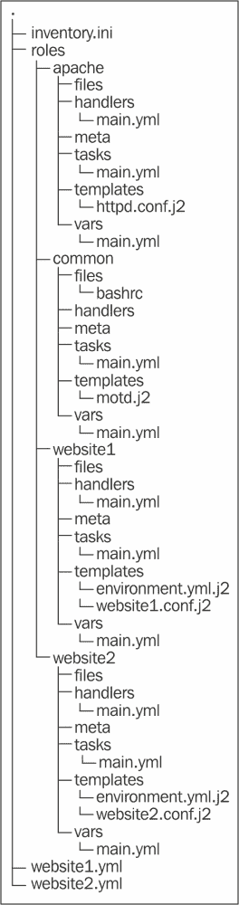

# 第四章. 更大的项目

到目前为止，我们一直在查看单个剧本中的单个剧本文件。这种方法适用于简单的基础设施，或者在将 Ansible 用作简单的部署机制时。然而，如果你有一个庞大而复杂的基础设施，那么你需要采取措施以防止局面失控。本章将包括以下主题：

+   将剧本拆分成不同的文件，并从其他位置包含它们

+   使用角色包含多个执行相似功能的文件

+   提高 Ansible 配置机器速度的方法

# 包含

你在面对复杂的基础设施时会遇到的第一个问题是，剧本文件的大小会迅速增加。大的剧本文件会变得难以阅读和维护。Ansible 允许你通过包含来解决这个问题。

包含允许你将剧本拆分为多个部分。然后，你可以从其他剧本中包含每个部分。这使得你可以为不同的目的构建多个不同的部分，并将它们全部包含在一个主剧本中。

包含有四种类型，分别是变量包含、剧本包含、任务包含和处理器包含。关于从外部`vars_file`文件包含变量的内容，已经在第二章，*简单剧本*中讨论过了。以下是每种包含的描述：

+   **变量包含**：它们允许你将变量放在外部 YAML 文件中

+   **剧本包含**：它们用于将其他文件中的剧本包含到单个剧本中

+   **任务包含**：它们允许你将公共任务放到其他文件中，并在需要的地方包含它们

+   **处理器包含**：它们允许你将所有的处理器放在一个地方

我们将在接下来的章节中探讨这些包含；不过，关于从外部`vars_file`文件包含变量的内容，已经在第二章，*简单剧本*中讨论过了，因此我们不再详细讨论。

## 任务包含

当你有许多重复的公共任务时，可以使用任务包含。例如，你可能有一组任务，在配置机器之前，将其从监控和负载均衡器中移除。你可以将这些任务放在一个单独的 YAML 文件中，然后从主任务中包含它们。

任务包含会继承它们所包含的剧本中的事实。你还可以提供自己的变量，这些变量会传递到任务中，并可供使用。

最后，任务包含可以应用条件判断。如果你这样做，Ansible 将自动为每个包含的任务单独添加条件判断。这些任务仍然会被包含。在大多数情况下，这是不重要的区别；然而，在变量可能发生变化的情况下，这是很重要的。

作为任务包含的文件包含一系列任务。如果你假设某些变量、主机或组的存在，那么应该在文件顶部的注释中说明它们。这可以帮助后来想要重用该文件的人。

因此，如果你想创建一批用户并设置他们的环境和公钥，你可以将每个用户的任务拆分到一个单独的文件中。这个文件将类似于以下代码：

```
---
# Requires a user variable to specify user to setup
- name: Create user account
  user:
    name: "{{ user }}"
    state: present

- name: Make user SSH config dir
  file:
    path: "/home/{{ user }}/.ssh"
    owner: "{{ user }}"
    group: "{{ user }}"
    mode: 0600
    state: directory

- name: Copy in public key
  copy:
    src: "keys/{{ user }}.pub"
    dest: "/home/{{ user }}/.ssh/authorized_keys"
    mode: 0600
    owner: "{{ user }}"
    group: "{{ user }}"
```

我们预计将会传入一个名为`user`的变量，并且他们的公钥会存放在`keys`目录中。会创建帐户，生成`ssh config`目录，最后我们可以将他们的公钥复制到其中。使用这个`config`文件的最简单方法是通过你在第三章中学习的`with_items`关键字来包含它，*高级 Playbooks*。这将类似于以下代码：

```
---
- hosts: ansibletest
  user: root
  tasks:
    - include: usersetup.yml user={{ item }}
      with_items:
        - mal
        - dan
        - kate
```

## 处理器包含

在编写 Ansible playbook 时，你会发现自己多次重复使用相同的处理器。例如，用于重启 MySQL 的处理器在任何地方看起来都一样。为了简化这一过程，Ansible 允许你在处理器部分包含其他文件。处理器包含的写法与任务包含类似。你应该确保为每个处理器提供一个名称，否则你将无法在任务中轻松引用它们。一个处理器包含文件看起来类似于以下代码：

```
---
- name: config sendmail
  command: make -C /etc/mail
  notify: reload sendmail

- name: config aliases
  command: newaliases
  notify: reload sendmail

- name: reload sendmail
  service:
    name: sendmail
    state: reloaded

- name: restart sendmail
  service:
    name: sendmail
    state: restarted
```

本文件提供了在配置`sendmail`后你可能需要处理的几项常见任务。通过将以下处理器包含在各自的文件中，你可以在需要更改`sendmail`配置时轻松地重用它们：

+   第一个处理器重新生成`sendmail`数据库的`config`文件，并在稍后触发`sendmail`的`reload`文件。

+   第二个处理器初始化`aliases`数据库，并且还会安排一个`sendmail`的`reload`文件。

+   第三个处理器重新加载`sendmail`；它可能由前两个任务触发，或者也可以直接通过任务触发。

+   第四个处理器在被触发时重启`sendmail`；如果你升级了`sendmail`到新版本，这将非常有用。

### 注意

处理器可以触发其他处理器，只要它们仅触发后面指定的处理器，而不是已触发的处理器。这意味着你可以设置一系列相互调用的级联处理器。这将避免你在任务的 notify 部分写出一长串处理器。

使用前面的处理器文件现在变得简单了。我们只需要记住，如果我们更改了`sendmail`配置文件，则应触发`config sendmail`，如果更改了`aliases`文件，则应触发`config aliases`。以下代码为我们展示了这个示例：

```
---
  hosts: mailers
  tasks:
    - name: update sendmail
      yum:
        name: sendmail
        state: latest
      notify: restart sendmail

    - name: configure sendmail
      template:
        src: templates/sendmail.mc.j2 dest: /etc/mail/sendmail.mc
      notify: config sendmail

  handlers:
    - include: sendmailhandlers.yml
```

这个 playbook 确保 `sendmail` 已安装。如果没有安装，或者没有运行最新版本，则会安装或更新它。更新后，它会安排重启，以便我们可以确信在 playbook 执行完毕后，最新版本将会运行。在下一步中，我们用模板替换 `sendmail` 配置文件。如果配置文件被模板更改，则会重新生成 `sendmail` 配置文件，最后 `sendmail` 会被重新加载。

## Playbook includes

Playbook includes 用于在你想要为一组机器包含一整套任务时使用。例如，你可能有一个 play，它收集几个机器的主机密钥，并构建一个 `known_hosts` 文件，将其复制到所有机器上。

虽然任务包含允许你包含任务，但 playbook includes 允许你包含完整的 play。这使你能够选择你希望执行的主机，并为通知事件提供处理程序。由于你包含的是完整的 playbook 文件，你还可以包含多个 plays。

Playbook includes 允许你嵌入完全自包含的文件。因此，你需要提供它所需的任何变量。如果它们依赖于某些特定的主机或组，应该在文件顶部的注释中注明。

当你希望一次执行多个不同的操作时，这非常方便。例如，假设我们有一个名为 `drfailover.yml` 的 playbook，用于切换到我们的灾难恢复站点，另一个名为 `upgradeapp.yml` 的 playbook 用于升级应用，另一个名为 `drfailback.yml` 的 playbook 用于故障恢复，最后一个名为 `drupgrade.yml`。这些 playbook 分别使用可能都是有效的；然而，在执行站点升级时，你可能希望一次执行所有这些操作。你可以像下面的代码那样做到这一点：

```
---
- include "drfailover.yml"
- include "upgradeapp.yml"
- include "drfailback.yml"

- name: Notify management
  hosts: local
  tasks:
    - mail
        to: "mgmt-team@example.com"
        msg: 'The application has been upgraded and is now live'

- include "drupgrade.yml"
```

正如你所看到的，你可以在包含其他 playbook 的 playbooks 中放入完整的 plays。

# 角色

如果你的 playbook 开始超出 includes 能解决的问题，或者你开始收集大量模板，你可能需要使用角色。Ansible 中的角色允许你将文件按定义的结构组合在一起。它们本质上是对 includes 的扩展，能够自动处理一些事情，这有助于你在代码库中组织这些文件。

角色允许你将变量、文件、任务、模板和处理程序放在一个文件夹中，然后轻松地将它们包含进去。你还可以在角色中包含其他角色，这实际上创建了一个依赖树。与任务包含类似，它们也可以传递变量给角色。使用这些功能，你应该能够构建自包含的角色，方便与他人共享。

角色通常用于管理机器提供的服务，但它们也可以是守护进程、选项或简单的特性。你可能希望在角色中配置的内容如下：

+   Web 服务器，如 Nginx 或 Apache

+   根据机器的安全级别定制的每日信息 |

+   运行 PostgreSQL 或 MySQL 的数据库服务器 |

要管理 Ansible 中的角色，请执行以下步骤： |

1.  创建一个名为 `roles` 的文件夹，并将你的 playbooks 放入其中。 |

1.  在 `roles` 文件夹中，为你想要的每个角色创建一个文件夹。 |

1.  在每个角色的文件夹中，创建名为 `files`、`handlers`、`meta`、`tasks`、`templates` 和 `vars` 的文件夹。如果你不打算使用所有这些文件夹，可以省略不需要的部分。当使用角色时，Ansible 会默默忽略任何缺失的文件或目录。 |

1.  在你的 playbooks 中，添加关键字 `roles`，后跟你希望应用于主机的角色列表。 |

1.  例如，如果你有 `common`、`apache`、`website1` 和 `website2` 角色，你的目录结构看起来会像以下示例。`site.yml` 文件用于重新配置整个站点，而 `webservers1.yml` 和 `webservers2.yml` 文件用于配置每个 Web 服务器集群。 |

以下文件可能出现在 `website1.yml` 中。它展示了一个 playbook，将 `common`、`apache` 和 `website1` 角色应用到清单中的 `website1` 组。`website1` 角色使用更详细的格式进行包含，允许我们将变量传递给角色，如下所示： |

```
---
- name: Setup servers for website1.example.com
  hosts: website1
  roles:
    - common
    - apache
    - { role: website1, port: 80 }
```

对于名为 `common` 的角色，Ansible 将尝试加载 `roles/common/tasks/main.yml` 作为任务包含，`roles/common/handlers/main.yml` 作为处理程序包含，`roles/common/vars/main.yml` 作为变量文件包含。如果这些文件都缺失，Ansible 会抛出错误；但是，如果其中一个文件存在，则缺失的其他文件将被忽略。以下目录是 Ansible 默认安装时使用的目录（其他目录可能被不同的模块使用）： |

| 目录 | 描述 |
| --- | --- |
| `tasks` | `tasks` 文件夹应包含一个 `main.yml` 文件，该文件应包括该角色的任务列表。任何包含在这些角色中的任务也将在此文件夹中查找其文件。这允许你将大量任务拆分到单独的文件中，并使用任务包含的其他功能。 |
| `files` | `files` 文件夹是用于存放由复制或脚本模块使用的角色的默认文件位置。 |
| `templates` | `templates` 目录是模板模块将自动查找角色中包含的 jinja2 模板的位置。 |
| `handlers` | `handlers` 文件夹应包含一个 `main.yml` 文件，该文件指定角色的处理程序，并且该文件夹中的任何包含文件也会在相同位置查找文件。 |
| `vars` | `vars` 文件夹应包含一个 `main.yml` 文件，该文件包含此角色的变量。 |
| `meta` | `meta` 文件夹应包含一个 `main.yml` 文件。此文件可以包含角色的设置以及其依赖项的列表。此功能仅在 Ansible 1.3 及以上版本中可用。 |
| `default` | 如果你希望将变量传递给该角色并希望使其可选，则应使用 `default` 文件夹。该文件夹中的 `main.yml` 文件将被读取，以获取可以被从调用角色的 playbook 中传递的变量覆盖的初始变量值。此功能仅适用于 Ansible 1.3 及以上版本。 |

使用角色时，`copy`、`template` 和 `script` 模块的行为会略有改变。除了从 playbook 文件所在的目录中查找文件外，Ansible 还会在角色的位置查找文件。例如，如果你使用名为 `common` 的角色，这些模块的行为将变为如下：

+   `copy` 模块将查找 `roles/common/files` 中的文件。

+   `template` 模块将首先在 `roles/common/templates` 中查找模板。

+   `script` 模块将首先在 `roles/common/files` 中查找文件。

+   其他模块可能会决定在 `roles/common/` 内的其他文件夹中查找其数据。模块的文档可以通过 `ansible-doc` 获取，正如在 第一章 的 *模块帮助* 部分中讨论的那样，*开始使用 Ansible*。

# 角色元数据

使用角色元数据允许我们指定我们的角色依赖于其他角色。例如，如果你正在部署的应用程序需要发送电子邮件，你的角色可能依赖于 Postfix 角色。这意味着在应用程序设置和安装之前，Postfix 将被安装和设置。

`meta/main.yml` 文件将类似于以下代码：

```
---
allow_duplicates: no
dependencies:
  - apache
```

`allow_duplicates` 行设置为 `no`，这是默认值。如果你将其设置为 `no`，那么如果该角色在相同的参数下被包含两次，Ansible 将不会再次运行该角色。如果将其设置为 `yes`，即使该角色之前已经运行过，也会重复执行。你可以将其保持为 `off`，而不是设置为 `no`。

依赖项以与角色相同的格式指定。这意味着你可以在此传递变量；可以是静态值或传递给当前角色的变量。

# 角色默认值

Ansible 1.3 版本新增的第二个功能是变量默认值。如果你在角色的 `defaults` 目录中放置一个 `main.yml` 文件，这些变量将被读取到角色中；然而，它们可以被 `vars/main.yml` 文件中的变量，或者在包含角色时传递给角色的变量覆盖。这使得向角色传递变量变得可选。这些文件与其他变量文件完全相同。例如，如果你在角色中使用了一个名为 `port` 的变量，并且你希望将其默认设置为端口 `80`，那么你的 `defaults/main.yml` 文件将类似于以下代码：

```
---
port: 80
```

# 加速执行

随着你在 Ansible 配置中添加越来越多的机器和服务，你会发现系统运行得越来越慢。幸运的是，有几种技巧可以让 Ansible 在更大规模下运行。

## 配置

Ansible 不仅仅限于配置我们的机器；我们还可以用它来创建我们要配置的机器。我们不仅限于创建要配置的机器，还可以创建网络、负载均衡器、DNS 条目，甚至是整个基础设施。你甚至可以在配置机器之前，通过使用`group`、`group_by`和`add_host`模块让这一切自动发生。

在以下示例中，我们使用 Google Compute 创建了两台机器，并在其上安装和启动了 MySQL 服务器：

```
---
- name: Setup MySQL Infrastructure
  hosts: localhost
  connection: local
  tasks:
    - name: Start GCE Nodes
      gce:
        image: centos-6
        name: "mysql-{{ item }}"
        tags: mysql
        zone: us-central1-a
      with_sequence: count=2
      register: nodes
      when: '"mysql-{{ item }}" not in groups.all'

    - name: Wait for the nodes to start
      wait_for:
          host: "{{ item.instance_data[0].public_ip }}"
          port: 22
      with_items: nodes.results
      when: not item|skipped

    - name: Register the hosts in a group
      add_host:
          name: "{{ item.instance_data[0].name }}"
          ansible_ssh_host: "{{ item.instance_data[0].public_ip }}"
          groups: "tag_mysql"
      with_items: nodes.results
      when: not item|skipped

- name: Setup MySQL
  hosts: tag_mysql
  tasks:
    - name: Install MySQL
      yum:
        name: mysql
        state: present

    - name: Start MySQL
      service:
        name: mysqld
        state: started
        enabled: yes
```

## 标签

Ansible 标签是一个特性，它允许你选择剧本中需要执行的部分以及应跳过的部分。虽然 Ansible 模块是幂等的，并且在没有更改时会自动跳过，但这通常需要与远程主机建立连接。yum 模块在确定模块是否为最新时通常比较慢，因为它需要刷新所有的仓库。

如果你知道不需要执行某些操作，可以选择只运行那些已被标记特定标签的任务。这甚至不尝试运行任务，它只是跳过它。这将节省几乎所有模块的时间，即使没有任何操作需要执行。

假设你有一台机器上有大量的 Shell 账户，同时也配置了多个服务在其上运行。现在，假设某个用户的 SSH 密钥被泄露，需要立即移除。你可以不必运行整个剧本，或者重新编写剧本以只包括移除该密钥所需的步骤，而是可以通过已存在的剧本和 SSH 密钥标签来运行，这样它只会运行必要的步骤来复制新的密钥，立即跳过其他步骤。

这在你拥有一个包含整个基础设施的剧本时特别有用。有了这个设置，你可以迅速部署安全补丁、修改密码，并在整个基础设施中撤销密钥，尽可能快地进行操作。

给任务打标签非常简单；只需添加一个名为`tag`的键，并将其值设置为你希望给予的标签列表。以下代码展示了我们如何做到这一点：

```
---
- name: Install and setup our webservers
  hosts: webservers
  tasks:
  - name: install latest software
    yum
      name: "{{ item }}"
      state: latest
    notify: restart apache
    tags:
      - patch
    with_items:
    - httpd
    - webalizer

  - name: Create subdirectories
    file
      dest: "/var/www/html/{{ item }}"
      state: directory
      mode: 755 owner: apache
      group: apache
    tags:
      - deploy
    with_items:
      - pub

  - name: Copy in web files
    copy
      src: "website/{{ item }}"
      dest: "/var/www/html/{{ item }}"
      mode: 0755
      owner: apache
      group: apache
    tags:
      - deploy
    with_items:
      - index.html
      - logo.png
      - style.css
      - app.js
      - pub/index.html

  - name: Copy webserver config
    tags:
      - deploy
      - config
    copy
      src: website/httpd.conf
      dest: /etc/httpd/conf/httpd.conf
      mode: 0644
      owner: root
      group: root
    notify: reload apache

  - name: set apache to start on startup
    service
      name: httpd
      state: started
      enabled: yes

  handlers:
  - name: reload apache
    service: name=httpd state=reloaded

  - name: restart apache
    service: name=httpd state=restarted
```

这个剧本定义了`patch`、`deploy`和`config`标签。如果你事先知道要执行哪个操作，可以通过提供正确的参数来运行 Ansible，只执行你选择的操作。如果在命令行中没有提供标签，则默认会运行所有任务。例如，如果你只想让 Ansible 执行标记为`deploy`的任务，你可以运行以下命令：

```
$ ansible-playbook webservers.yml --tags deploy

```

除了适用于离散任务，标签也可以应用于角色，这使得 Ansible 只应用在命令行中提供的标签对应的角色。你可以像应用标签到任务一样应用它们。例如，参考以下代码：

```
---
- hosts: website1
  roles:
    - common
    - { role: apache, tags: ["patch"] }
    - { role: website2, tags: ["deploy", "patch"] }
```

在前面的代码中，`common` 角色没有任何标签，如果应用了任何标签，它将不会被运行。如果应用了 `patch` 标签，则会应用 `apache` 和 `website2` 角色，但不会应用 `common`。如果应用了 `deploy` 标签，则只会运行 `website2` 角色。这样可以缩短修补服务器或运行部署所需的时间，因为不必要的步骤将被完全跳过。

## Ansible 的拉取模式

Ansible 包含一个拉取模式，可以显著提升你的 playbook 的可扩展性。到目前为止，我们只讲了如何通过 SSH 使用 Ansible 配置另一台机器。这与 Ansible 的拉取模式不同，拉取模式在你想要配置的主机上运行。由于 `ansible-pull` 在配置的机器上运行，它不需要与其他机器建立连接，因此运行速度更快。在这种模式下，你将配置放在一个 Git 仓库中，Ansible 会下载并使用这些配置来配置你的机器。

你应该在以下情况使用 Ansible 的拉取模式：

+   在配置节点时，你的节点可能无法访问，比如自动扩展服务器集群中的成员。

+   你有大量机器需要配置，即使使用较大的 fork 值，也会花费很长时间来配置它们。

+   你希望机器在仓库更新时自动更新它们的配置。

+   你可能想在一台可能没有网络访问权限的机器上运行 Ansible，比如在启动后安装的 kickstart 环境中。

然而，拉取模式有以下一些缺点，这使得它不适用于某些特定的场景：

+   要连接到其他机器并收集变量，或复制文件，你需要在管理节点上拥有凭证。

+   你需要在服务器集群中协调 playbook 的运行；例如，如果你一次只能将三台服务器下线进行维护。

+   这些服务器位于严格的防火墙后面，防火墙不允许从你用来配置它们的节点发起 SSH 连接。

拉取模式不需要在 playbook 中做任何特殊设置，但需要在你想要配置的节点上进行一些配置。在某些情况下，你可以使用 Ansible 的正常推送模式来完成这项工作。这里有一个小的 play 用于在机器上设置拉取模式：

```
---
- name: Ansible Pull Mode
  hosts: pullhosts
  tasks:
    - name: Setup EPEL
      command: "rpm -ivh http://download.fedoraproject.org/pub/epel/6/i386/epel-release-6-8.noarch.rpm"
      args: creates=/etc/yum.repos.d/epel.repo

    - name: Install Ansible + Dependencies
      yum:
        name: "{{ item }}"
        state: latest
        enablerepo: epel
      with_items:
      - ansible
      - git-core

    - name: Make directory to put downloaded playbooks in
      file:
        state: directory
        path: /opt/ansiblepull

    - name: Setup cron
      cron:
        name: "ansible-pull"
        user: root
        minute: "*/5"
        state: present
        job: "ansible-pull -U https://git.int.example.com.com/gitrepos/ansiblepull.git -D /opt/ansiblepull {{ inventory_hostname_short }}.yml"
```

在这个示例中，我们执行了以下步骤：

1.  首先，我们安装并设置了 **EPEL**。这是一个包含 CentOS 额外软件的仓库，Ansible 可以在 EPEL 仓库中找到。

1.  接下来我们安装了 Ansible，并确保启用了 EPEL 仓库。

1.  然后，我们为 Ansible 的拉取模式创建了一个目录来存放 playbook。保留这些文件意味着你不需要每次都下载整个 Git 仓库；只需要更新即可。

1.  最后，我们设置了一个定时任务，每五分钟尝试运行`ansible-pull`模式配置。

### 注意

上面的代码会从内部 HTTPS git 服务器下载仓库。如果你想通过 SSH 下载仓库，你需要添加一个步骤来安装 SSH 密钥，或者生成密钥并将其复制到 git 服务器。

# 存储机密信息

最终，你将需要在 Ansible 配方中包含敏感数据。到目前为止，我们讨论的所有配方都必须以纯文本的形式存储在磁盘上；如果你还将其存储在源代码控制中，第三方可能也能访问这些数据。这是有风险的，可能违反公司政策。

这可以通过使用 Ansible 密钥库来避免。密钥库是加密文件，Ansible 可以透明地解密它们。你可以将它们用于包括、变量文件、角色中的任务列表以及 Ansible 使用的任何其他 YAML 格式文件。你还可以在使用`ansible-playbook`时，配合`-e`命令行参数使用包含 JSON 和 YAML 文件的密钥库文件。密钥库文件由`ansible-vault`命令管理，可以像没有加密一样使用。

`ansible-vault`命令有多个模式，作为第一个参数传递。此表描述了这些模式：

| 模式 | 操作 |
| --- | --- |
| `创建` | 这将启动默认编辑器以创建一个新的加密文件 |
| `加密` | 这将加密一个现有文件，将其转变为密钥库 |
| `编辑` | 这将编辑密钥库，允许你更改内容 |
| `重设密码` | 这将更改用于加密密钥库的密码 |
| `解密` | 这将解密密钥库，将其恢复为普通文件 |

例如，要为你的暂存环境创建一个新的变量文件，你可以运行：

```
$ ansible-vault create vars/staging.yml

```

该命令会提示你输入密码，要求确认密码，然后打开编辑器让你添加内容；最后，加密的内容将保存在`vars/staging.yml`中。

使用密钥库文件时，你需要提供密码以便解密。这可以通过三种方式完成。你可以将`--ask-vault-pass`参数传递给 Ansible，这会导致 Ansible 在每次启动时都提示输入密码。你还可以使用`--vault-password-file`参数，它指向包含密码的文件。最后，你可以将`vault_password_file`添加到`ansible.cfg`文件中，使 Ansible 在每个命令中自动使用密钥库密码文件。需要注意的是，每次运行 Ansible 时只能提供一个密码，因此不能包含多个不同密码的文件。

为了让 Ansible 在运行加密的 playbook 时提示输入密码，你需要执行以下操作：

```
$ ansible-playbook --ask-vault-pass encrypted.yml

```

### 注意

密码文件也可以是可执行文件。要输出到屏幕上，你可以将内容输出到标准错误；要从用户处读取密码，你可以像往常一样使用`stdin`，最后脚本需要在退出之前将密码输出到`stdout`。

# 总结

在本章中，我们介绍了从简单的配置到更大规模部署时所需的技巧。我们讨论了如何使用 `include` 将你的 playbook 分成多个部分。接着，我们探讨了如何将相关的 `include` 打包，并通过角色一次性自动包含它们。最后，我们讨论了拉取模式，它允许你在远程节点本身上自动化 playbook 的部署。

在下一章中，我们将介绍如何编写你自己的模块。我们从使用 bash 脚本构建一个简单的模块开始。然后，我们将了解 Ansible 如何查找模块，以及如何让它找到你自己的自定义模块。接下来，我们看看如何使用 Python 编写更高级的模块，利用 Ansible 提供的功能。最后，我们将编写一个脚本，将 Ansible 配置为从外部源拉取其库存。
