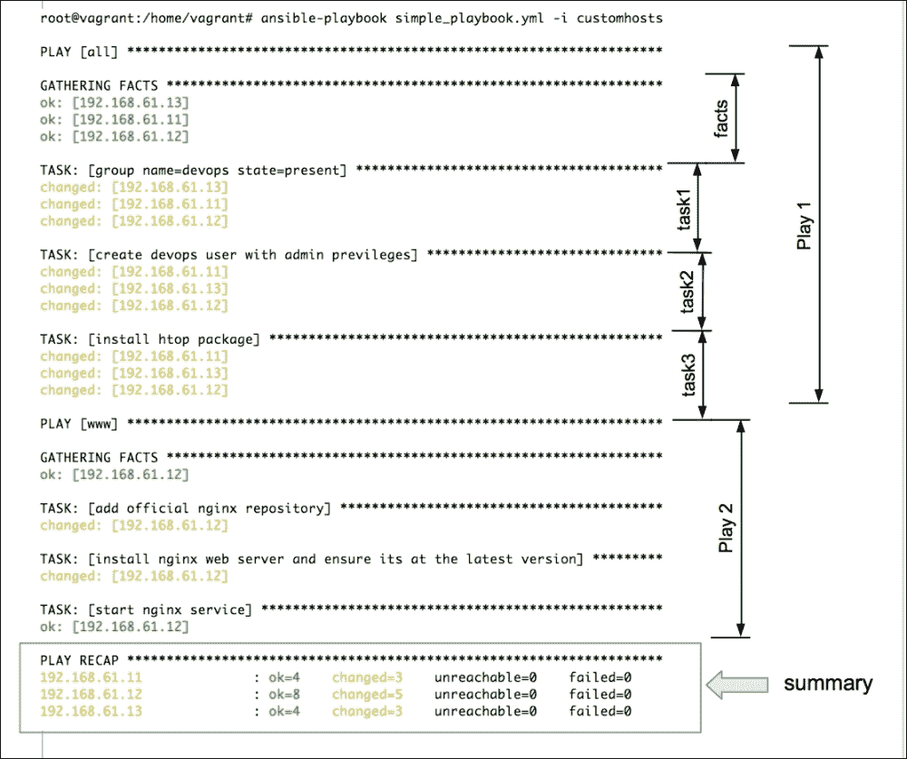

# 第一章：蓝图化你的基础设施

本书是为任何具备 Ansible 概念性知识的人准备的入门书籍，旨在帮助读者开始编写 Ansible playbooks，自动化常见的基础设施任务，编排应用程序部署，并/或管理跨多个环境的配置。本书采用逐步深入的方式，从学习 playbook 的构成和编写简单角色来创建模块化代码等基础知识开始。掌握基础后，将介绍如何通过变量和模板添加动态数据，并使用条件语句和迭代器控制执行流程。接下来是一些更高级的主题，如节点发现、集群、加密数据和环境管理。最后，我们将讨论 Ansible 的编排功能。让我们从学习 playbook 开始，迈出成为 Ansible 从业者的第一步。

本章我们将学习：

+   playbook 的结构

+   什么是 play 以及如何编写主机清单和搜索模式

+   Ansible 模块及其“开箱即用”的方法

# 了解 Ansible

**Ansible** 是一个简单、灵活且功能极其强大的工具，能够让你自动化常见的基础设施任务、运行临时命令以及部署跨多个机器的多层应用程序。尽管你可以使用 Ansible 在多个主机上并行执行命令，但真正的力量在于使用 playbook 来管理这些主机。

作为系统工程师，我们通常需要自动化的基础设施包含复杂的多层应用程序。每个应用程序代表一种服务器类别，例如负载均衡器、Web 服务器、数据库服务器、缓存应用程序和中间件队列。由于这些应用程序往往需要协同工作以提供服务，因此也涉及拓扑结构。例如，负载均衡器会连接到 Web 服务器，Web 服务器会读写数据库，并连接到缓存服务器以获取内存中的对象。大多数情况下，当我们启动这种应用栈时，需要按特定顺序配置这些组件。

这是一个非常常见的三层 Web 应用示例，运行负载均衡器、Web 服务器和数据库后端：


Ansible 让你将这个图示转换为蓝图，定义你的基础设施策略。指定这些策略的格式就是 playbook。

示例策略及其应用顺序如下所示：

1.  在数据库服务器上安装、配置并启动 MySQL 服务。

1.  安装并配置运行 **Nginx** 和 **PHP** 绑定的 Web 服务器。

1.  在 Web 服务器上部署 Wordpress 应用并为 Nginx 添加相应的配置。

1.  在部署 Wordpress 后，启动所有 Web 服务器上的 Nginx 服务。最后，在负载均衡主机上安装、配置并启动 **haproxy** 服务。使用之前创建的所有 Web 服务器的主机名更新 haproxy 配置。

以下是一个示例 playbook，它将基础设施蓝图转换为 Ansible 可执行的策略：


# Plays

一个 playbook 由一个或多个 play 组成，它们将主机组映射到明确定义的任务。前面的示例包含了三个 play，每个 play 配置一个多层 Web 应用中的一层。Play 还定义了任务配置的顺序，这使得我们能够编排多层部署。例如，只有在启动 Web 服务器后才配置负载均衡器，或者进行两阶段部署，其中第一阶段只添加配置，第二阶段按所需顺序启动服务。

## YAML – playbook 语言

正如你可能已经注意到的，我们之前编写的 playbook 更像是一个文本配置，而不是代码片段。这是因为 Ansible 的创建者选择使用简单、易读且熟悉的 YAML 格式来设计基础设施。这增加了 Ansible 的吸引力，因为使用这个工具的用户无需学习任何特殊的编程语言就能开始使用。Ansible 代码本身就是自解释和自文档化的。快速学习一下 YAML 基础知识就足以理解基本语法。以下是你需要了解的 YAML 相关内容，帮助你开始编写第一个 playbook：

+   playbook 的第一行应以 "--- "（三个短横线）开始，表示 YAML 文档的开始。

+   YAML 中的列表使用短横线加空格表示。一个 playbook 包含一个 plays 列表；它们由"- "表示。每个 play 都是一个关联数组、字典或键值对的映射。

+   缩进非常重要。列表中的所有成员应该具有相同的缩进级别。

+   每个 play 可以包含以 ":" 分隔的键值对，用于表示主机、变量、角色、任务等。

# 我们的第一个 playbook

基于之前解释的基本规则，并假设读者已经快速学习了 YAML 基础知识，我们现在将开始编写我们的第一个 playbook。我们的问题陈述包括以下内容：

1.  在所有主机上创建一个 devops 用户。该用户应为 `devops` 组的一部分。

1.  安装 "htop" 工具。**Htop** 是 top 的改进版——一个交互式系统进程监视器。

1.  将 Nginx 仓库添加到 Web 服务器并将其作为服务启动。

现在，我们将创建我们的第一个 playbook，并将其保存为`simple_playbook.yml`，其中包含以下代码：

```
---
- hosts: all
  remote_user: vagrant
  sudo: yes
  tasks:

  - group:
      name: devops
      state: present
  - name: create devops user with admin privileges

    user:
      name: devops
      comment: "Devops User"
      uid: 2001
      group: devops
  - name: install htop package
    action: apt name=htop state=present update_cache=yes

- hosts: www
  user: vagrant
  sudo: yes
  tasks:
  - name: add official nginx repository
    apt_repository:
      repo: 'deb http://nginx.org/packages/ubuntu/ lucid nginx'
  - name: install nginx web server and ensure its at the latest version
    apt:
      name: nginx
      state: latest
  - name: start nginx service
    service:
      name: nginx
      state: started
```

我们的 playbook 包含两个 play。每个 play 都由以下两个重要部分组成：

+   **要配置的内容**：我们需要配置一个主机或主机组来运行该 play。还需要包括有用的连接信息，如连接时使用的用户、是否使用`sudo`命令等。

+   **要运行的内容**：这包括要运行的任务的规范，包括要修改的系统组件及其应处于的状态，例如，已安装、已启动或最新。可以通过任务来表示，稍后通过角色来执行。

现在，让我们简要查看一下这些内容。

## 创建主机清单

在开始编写 Ansible playbook 之前，我们需要定义一个包含所有需要配置的主机的清单，并使其可以供 Ansible 使用。稍后，我们将开始针对这个清单中的部分主机运行 play。如果你已有现有清单，如 cobbler、LDAP、CMDB 软件，或希望从云提供商（如 ec2）拉取清单，可以通过动态清单的概念从 Ansible 中提取。

对于基于文本的本地清单，默认位置是 `/etc/ansible/hosts`。但是，对于我们的学习环境，我们将在工作目录中创建一个自定义清单文件`customhosts`，其内容如下所示。你可以自由创建自己的清单文件：

```
#customhosts
#inventory configs for my cluster
[db]
192.168.61.11  ansible_ssh_user=vagrant

[www]
www-01.example.com ansible_ssh_user=ubuntu
www-02 ansible_ssh_user=ubuntu

[lb]
lb0.example.com
```

现在，当我们的 playbook 将 play 映射到组时，该组中的`www`（`hosts:` `www`）主机将被配置。`all` 关键字将匹配清单中的所有主机。

以下是创建清单文件的指南：

+   清单文件遵循 INI 风格的配置，这实际上包括以 "`[ ]`" 包含的主机组/类名称开始的配置块。这样可以选择性地在系统类上执行操作，例如，`[namenodes]`。

+   一个主机可以属于多个组。在这种情况下，来自两个组的主机变量将合并，并且优先级规则适用。我们将在后面详细讨论变量和优先级。

+   每个组包含一组主机和连接详细信息，如连接时使用的 SSH 用户、如果端口非默认的 SSH 端口号、SSH 凭证/密钥、sudo 凭证等。主机名还可以包含通配符、范围等，便于包括多个具有相同类型、遵循某些命名模式的主机。

### 提示

创建了主机清单之后，最好使用 Ansible 的 ping 模块来验证连接（例如，`ansible -m ping all`）。

## 模式

在前面的 playbook 中，以下行决定了选择哪些主机来运行特定的 play：

```
- hosts: all
- hosts: www
```

第一个代码将匹配所有主机，第二个代码将匹配属于`www`组的主机。

模式可以是以下任意一种或它们的组合：

| 模式类型 | 示例 |
| --- | --- |
| 组名 | `namenodes` |
| 匹配所有 | `all` 或 `*` |
| 范围 | `namenode[0:100]` |
| 主机名/主机名通配符 | `*.example.com`，`host01.example.com` |
| 排除项 | `namenodes:!secondaynamenodes` |
| 交集 | `namenodes:&zookeeper` |
| 正则表达式 | `~(nn&#124;zk).*\.example\.org` |

## 任务

Play 将主机映射到任务。任务是一系列针对与 Play 中指定模式匹配的主机执行的操作。每个 Play 通常包含多个任务，这些任务在与模式匹配的每台机器上按顺序运行。例如，看看以下代码片段：

```
- group:
 name:devops
 state: present
- name: create devops user with admin privileges
 user:
 name: devops
 comment: "Devops User"
 uid: 2001
 group: devops

```

在前面的示例中，我们有两个任务。第一个是创建一个组，第二个是创建一个用户并将其添加到之前创建的组中。如果你注意到，第二个任务中有一行额外的内容，从`name:`开始。在编写任务时，最好提供一个名称，清晰地描述此任务要实现的内容。如果没有，操作字符串将会被打印出来。

任务列表中的每个操作可以通过指定以下内容来声明：

+   模块的名称

+   可选地，管理系统组件的状态

+   可选参数

### 提示

从 Ansible 的更新版本（0.8 及以后版本）开始，编写操作关键字已不再是必需的。我们可以直接提供模块名称。因此，这两行将执行相似的操作，即使用`apt`模块安装一个包：

```
action: apt name=htop state=present update_cache=yes
apt: name=nginx state=latest

```

Ansible 与其他配置管理工具的不同之处在于它的“一体化”方式。这些“一体化的电池”就是“模块”。在继续之前，理解模块是什么非常重要。

### 模块

模块是封装的程序，负责在特定平台上管理特定的系统组件。

考虑以下示例：

+   Debian 的`apt`模块和 RedHat 的`yum`模块有助于管理系统包

+   `user`模块负责在系统上添加、删除或修改用户

+   `service`模块将启动/停止系统服务

模块将实际的实现从用户中抽象出来。它们暴露了一种声明性语法，接受管理系统组件的参数和状态列表。所有这些都可以使用人类可读的 YAML 语法声明，采用键值对的形式。

就功能而言，模块类似于那些熟悉 Chef/Puppet 软件的用户中的提供者。与其编写程序来创建用户，使用 Ansible 时，我们声明组件应该处于的状态，即要创建的用户、用户状态和特性，如 UID、组、Shell 等。实际的操作通过模块被 Ansible 固有地识别，并在后台执行。

### 提示

`Command`和`Shell`模块是特殊的模块。它们既不接受键值对作为参数，也不是幂等的。

Ansible 预装了一个模块库，从管理基本系统资源的模块到更复杂的模块，如发送通知、进行云集成等。如果你想为 ec2 实例配置、在远程 PostgreSQL 服务器上创建数据库，并在**IRC**上接收通知，那么 Ansible 已经为你准备好了相关模块。这是不是很棒？

无需担心寻找外部插件，或为与云服务提供商的集成而烦恼。要查看可用模块的列表，可以参考 Ansible 文档：[`docs.ansible.com/list_of_all_modules.html`](http://docs.ansible.com/list_of_all_modules.html)。

Ansible 也是可扩展的。如果你找不到合适的模块来完成工作，写一个模块非常简单，而且不一定要用 Python。可以用你选择的语言为 Ansible 编写模块。详细信息可以参考：[`docs.ansible.com/developing_modules.html`](http://docs.ansible.com/developing_modules.html)。

#### 模块和幂等性

幂等性是模块的一个重要特性。它是指可以在系统上多次应用并返回确定性结果的特性。它具有内建的智能。例如，我们有一个任务，使用`apt`模块安装 Nginx 并确保它是最新的。如果你多次运行它，发生的情况如下：

+   每次幂等性运行多次时，`apt`模块将比较剧本中声明的内容与系统上该软件包的当前状态。第一次运行时，Ansible 会确定 Nginx 未安装，并继续进行安装。

+   对于每次随后的运行，除非上游仓库有新版本的软件包，否则它将跳过安装部分。

这允许多次执行相同任务而不会导致错误状态。大多数 Ansible 模块都是幂等的，只有`command`和`shell`模块例外。用户需要使这些模块具备幂等性。

## 运行剧本

Ansible 自带`ansible-playbook`命令来启动剧本。现在让我们运行我们创建的任务：

```
$ ansible-playbook simple_playbook.yml -i customhosts

```

运行上述命令时会发生以下情况：

+   `ansible-playbook`参数是将剧本作为参数（`simple_playbook.yml`）并在主机上执行任务的命令

+   `simple_playbook`参数包含我们创建的两个任务：一个用于常见任务，另一个用于安装 Nginx

+   `customhosts`参数是我们主机的清单，它让 Ansible 知道哪些主机或主机组需要执行任务

启动上述命令将开始调用任务，按照我们在剧本中描述的顺序进行编排。以下是执行上述命令后的输出：



现在让我们分析一下发生了什么：

+   Ansible 读取作为 `ansible-playbook` 命令参数指定的 playbook，并开始按顺序执行 plays。

+   我们声明的第一个 play 运行在 "`all`" 主机上。`all` 关键字是一个特殊的模式，它会匹配所有主机（类似于 `*`）。因此，第一个 play 中的任务将会在我们作为参数传递的所有主机清单上执行。

+   在运行任何任务之前，Ansible 会收集它即将配置的系统的信息。这些信息以事实的形式被收集。

+   第一个 play 包括创建 `devops` 组和用户，并安装 htop 包。由于我们的清单中有三个主机，我们会看到每个主机都会打印一行，表示被管理实体的状态是否发生了变化。如果状态没有变化，将打印 "ok"。

+   然后，Ansible 进入下一个 play。这个 play 只在一个主机上执行，因为我们在 play 中指定了 "`hosts:www`"，而我们的清单中 "`www`" 组内只有一个主机。

+   在第二个 play 中，添加了 Nginx 仓库，安装了包，并启动了服务。

+   最后，Ansible 在 "`PLAY RECAP`" 部分打印 playbook 执行的总结。它会显示有多少修改被执行，如果任何主机无法访问，或者是否有任何系统执行失败。

### 提示

如果一个主机无响应或无法执行任务怎么办？Ansible 具有内置的智能，能够识别这些问题并将失败的主机从轮换中移除。这不会影响其他主机的执行。

# 复习问题

你认为你已经充分理解了这一章的内容吗？试着回答以下问题来测试你的理解：

1.  在模块中，幂等性是什么意思？

1.  什么是主机的清单，为什么需要它？

1.  Playbooks 将 ___ 映射到 ___（填空）

1.  在选择要运行 plays 的主机列表时，你可以使用哪些类型的模式？

1.  执行特定平台上的操作的实际过程在哪里定义？

1.  为什么说 Ansible 是自带电池的？

# 总结

在本章中，你了解了什么是 Ansible playbook，它由哪些组件组成，以及如何使用它来规划你的基础设施。我们还对 YAML 语言做了一个简要介绍——它是用于创建 plays 的语言。你了解了 plays 如何将任务映射到主机，如何创建主机清单，如何使用模式筛选主机，以及如何使用模块在我们的系统上执行操作。然后，我们创建了一个简单的 playbook 作为概念验证。

在接下来的章节中，我们将开始重构我们的代码，创建可重用和模块化的代码块，并将它们称为角色（roles）。
