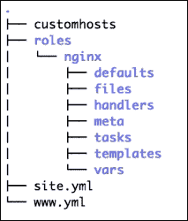
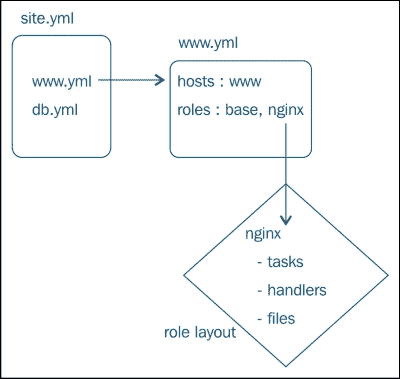
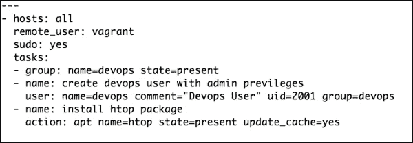
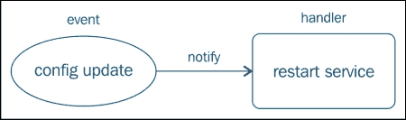
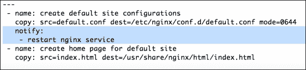
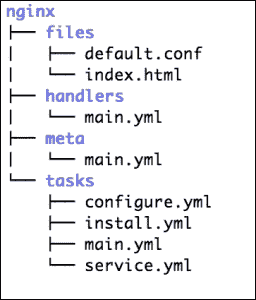
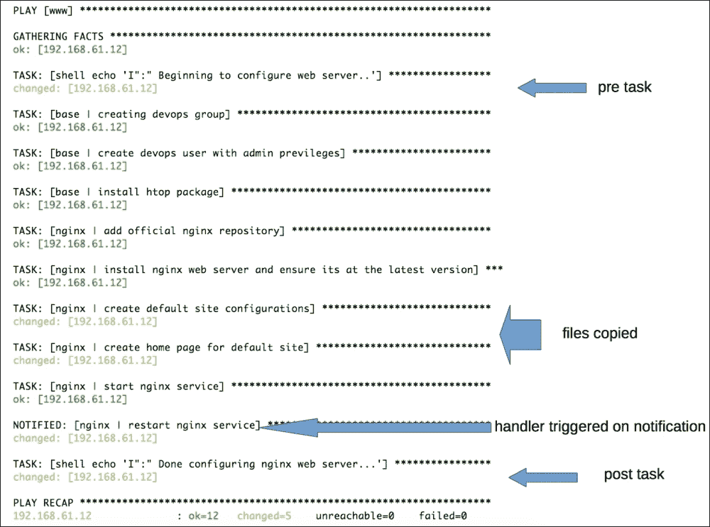

# 第二章：使用 Ansible 角色实现模块化

在上一章中，您学习了如何使用 Ansible 编写简单的剧本。您还了解了将主机映射到任务的剧本概念。在单个剧本中编写任务可能对于非常简单的设置来说效果不错。然而，如果我们有多个跨多个主机的应用程序，这将很快变得不可管理。

在本章中，您将了解以下概念：

+   角色是什么，角色的用途是什么？

+   如何创建角色以提供抽象？

+   组织内容以提供模块化

+   使用 include 语句

+   编写简单的任务和处理器

+   使用 Ansible 模块安装包、管理服务和提供文件

# 理解角色

在实际场景中，我们大多数情况下配置的是 Web 服务器、数据库服务器、负载均衡器、中间件队列等。如果退后一步看整体情况，您会发现您实际上是在以可重复的方式配置一组相同的服务器。

为了最有效地管理这样的基础设施，我们需要一些抽象机制，允许我们定义在这些组中每个需要配置的内容，并按名称调用它们。这正是角色的作用。Ansible 角色允许我们同时配置一组节点，而无需重复自己。角色还提供了一种创建模块化代码的方式，这样的代码可以共享和重用。

# 命名角色

一种常见的做法是创建与您想要配置的每个应用程序或基础设施组件相对应的角色。例如：

+   Nginx

+   MySQL

+   MongoDB

+   Tomcat

# 角色的目录布局

角色就是以特定方式布局的目录。角色遵循预定义的目录布局约定，并期望每个组件都在它应该在的路径下。

以下是一个角色的示例，名为 Nginx：



现在让我们来看一下游戏规则，以及前面图表中每个组件的作用：

+   每个角色包含一个以其自身命名的目录，例如`Nginx`，其父目录为`roles/`。每个命名的角色目录包含一个或多个可选的子目录。最常见的子目录包括任务、模板和处理器。每个子目录通常包含`main.yml`文件，这是默认文件。

+   任务包含核心逻辑，例如，它们会有安装包、启动服务、管理文件等的代码规范。如果我们将角色看作一部电影，那么任务就是主角。

+   仅靠任务本身无法完成所有工作。考虑到我们与电影的类比，故事没有配角是完整的。主角有朋友、汽车、爱人和反派来完成故事。同样，任务需要数据、调用静态或动态文件、触发操作等。这就是 files、handlers、templates、defaults 和`vars`的作用。让我们看看这些是做什么用的。

+   Vars 和 defaults 提供关于你的应用程序/角色的数据，例如你的服务器应该运行在哪个端口、存储应用程序数据的路径、哪个用户应当运行服务等。默认变量在版本 1.3 中引入，这些变量允许我们提供合理的默认值。之后可以从其他地方覆盖这些默认值，例如`vars`、`group_vars`和`host_vars`。变量会合并，并且优先级规则适用。这给我们提供了很大的灵活性来选择性地配置我们的服务器。例如，除了处于预发布环境的主机外，所有主机都应该在`80`端口上运行 Web 服务器，而预发布环境的主机则应在`8080`端口上运行。

+   文件和模板子目录提供了管理文件的选项。通常，files 子目录用于将静态文件复制到目标主机，例如一些应用程序安装包、静态文本文件等。除了静态文件外，你还经常需要管理动态生成的文件。例如，一个配置文件，它具有像端口、用户和内存等参数，可以通过变量动态提供。生成这些文件需要一种特殊的原始类型，叫做模板（templates）。

+   任务可以根据状态或条件的变化触发某些操作。在电影中，主角可能会基于挑衅或某个事件追逐反派并报仇。一个例子事件是绑架主角心爱的女士。同样，你可能需要在主机上执行某个操作，例如基于先前发生的事情重新启动服务，这可能是配置文件状态的变化。这种触发-动作关系可以通过处理器（handler）来指定。

继续我们的类比，许多受欢迎的电影都有续集，有时甚至还有前传。在这种情况下，应该按照特定的顺序观看，因为续集的情节依赖于前一部电影中发生的事情。同样，一个角色可能会依赖于另一个角色。一个非常常见的例子是，在安装 Tomcat 之前，系统上应该安装 Java。这些依赖关系在角色的 meta 子目录中定义。

让我们动手实践一下，创建一个 Nginx 应用程序的角色。我们来设定一个问题陈述，尝试解决它，并在这个过程中学习角色。

考虑以下场景。在世界杯的到来之际，我们需要创建一个 Web 服务器来提供体育新闻页面。

作为敏捷方法论的追随者，我们将分阶段进行。在第一阶段，我们将只安装一个 web 服务器并提供首页。现在，让我们把它分解成我们需要采取的步骤：

1.  安装一个 web 服务器。在本例中，我们将使用'Nginx'，因为它是一个轻量级的 web 服务器。

1.  管理 Nginx web 服务器的配置。

1.  安装 web 服务器后启动它。

1.  复制一个 HTML 文件，它将作为首页进行展示。

既然我们已经确定了需要采取的步骤，我们还需要将它们映射到我们将用来实现每个步骤的相应模块类型：

+   安装 Nginx = 包管理模块 (apt)

+   配置 Nginx = 文件模块 (file)

+   启动 Nginx = 系统模块 (service)

+   提供网页 = 文件模块 (file)

在开始编写代码之前，我们将开始创建布局来组织我们的文件。

# 创建一个全站剧本，进行嵌套并使用包含语句。

作为最佳实践，我们将创建一个顶层文件，该文件将包含我们完整基础设施的蓝图。从技术上讲，我们可以将所有需要配置的内容包含在一个文件中。然而，这会带来两个问题：

+   当我们开始向这个单一文件中添加任务、变量和处理程序时，它会迅速失控。维护这样的代码将变成一场噩梦。

+   这样做也会使得代码的重用和共享变得困难。使用像 Ansible 这样的工具的一个优势是它能够将数据与代码分离。数据是特定于组织的，而代码是通用的。这些通用代码可以与他人共享。然而，如果你把所有东西写在一个文件中，就无法做到这一点。

为了避免这个问题，我们将开始以模块化的方式组织代码，具体如下：

+   我们将为需要配置的每个应用程序创建角色。在本例中，它是 Nginx。

+   我们的 web 服务器除了 Nginx 之外，可能还需要安装其他应用程序，例如 PHP 和 OpenSSL。为了封装这些内容，我们将创建一个名为`www.yml`的剧本。

+   我们创建的前述剧本将映射具有 Nginx 角色的主机。我们以后可能会向其中添加更多角色。

+   我们将把这个剧本添加到顶层剧本中，也就是`site.yml`

以下图示以非常简单的方式描绘了前述步骤：



这是我们的`site.yml`文件：

```
---
# site.yml : This is a sitewide playbook
- include: www.yml
```

前述我们创建的`include`指令帮助我们模块化代码。与其把所有内容都写在一个文件中，我们将逻辑拆分并导入所需内容。在这种情况下，我们将包含另一个剧本，它被称为**嵌套剧本**。

以下是一些关于可以包含内容以及如何包含的指南：

+   `include`指令可以用来包含任务、处理程序甚至其他剧本

+   如果你像在`site.yml`文件中那样将一个剧本包含在另一个剧本中，你不能替换变量。

+   `include` 关键字可以与常规的任务/处理程序规范一起使用

+   可以使用 `include` 语句传递参数。这被称为 **参数化的** **include**。

### 提示

**角色和自动包含**

角色有隐式规则来自动包含文件。只要遵循目录布局规范，就可以确保所有任务、处理程序及其他文件都自动包含。因此，创建子目录时必须严格按照 Ansible 指定的名称。

# 创建 www 剧本

我们创建了一个全站的剧本，并使用 `include` 语句调用另一个名为 `www.yml` 的剧本。现在我们将创建这个文件，其中包含一个剧本，将我们的 Web 服务器主机映射到 Nginx 角色：

```
---
#www.yml : playbook for web servers
- hosts: www
  remote_user: vagrant
  sudo: yes
  roles:
     - nginx
```

上面的代码工作原理如下：

+   在任何映射到主机文件中指定的 `[www]` 组的主机上运行此代码。

+   对于 `roles/nginx/*` 文件中的每个目录，将 `roles/nginx/*/main.yml` 包含到剧本中。这包括 `tasks`、`handlers`、`vars`、`meta`、`default` 等文件。这就是自动包含规则的应用场所。

## 默认和自定义角色路径

默认情况下，Ansible 会查看我们为项目创建剧本时的 `roles/` 子目录。作为顶尖的 DevOps 工程师，我们将遵循最佳实践，建立一个集中式的版本控制库来存储所有的角色。我们也可能会重用社区创建的角色。这样一来，我们可以在多个项目中复用这些角色。在这种情况下，我们会在一个或多个位置检出代码，例如：

+   `/deploy/ansible/roles`

+   `/deploy/ansible/community/roles`

对于非默认路径，我们需要将 `roles_path` 参数添加到 `ansible.cfg` 文件中，如以下命令所示：

```
roles_path = /deploy/ansible/roles:/deploy/ansible/community/roles

```

## 参数化角色

有时，我们可能需要覆盖在 vars 或角色的默认目录中指定的默认参数，例如，在端口 8080 上运行 Web 服务器，而不是 80。此时，我们也可以在前面的剧本中将参数传递给角色，如下所示：

```
---
#www.yml : playbook for web servers
- hosts: www
  roles:
- { role: nginx, port: 8080 }
```

# 创建基本角色

在上一章中，我们创建了一个简单的剧本，将所有剧本写在同一个文件中。在发现关于角色的新信息后，我们将开始重构代码并使其模块化。

## 重构我们的代码 – 创建基本角色

我们在 `simple_playbook.yml` 文件中编写了两个剧本。我们打算在所有主机上运行第一个剧本。这个剧本包含创建用户、安装基本包等任务：



结合所有这些基本任务并创建一个基本角色是一个好习惯。你可以将其命名为 base、common、essential 等，但概念是相同的。现在我们将把这段代码移动到基本角色中：

1.  为基本角色创建目录布局。由于我们只打算指定任务，因此只需要在基本角色中创建一个子目录：

    ```
    $ mkdir -p roles/base/tasks

    ```

1.  在 `roles/base/tasks` 中创建 `main.yml` 文件以指定基础角色的任务。

1.  编辑 `main.yml` 文件并添加以下代码：

    ```
    ---
    # essential tasks. should run on all nodes
     - name: creating devops group
       group: name=devops state=present
     - name: create devops user
       user: name=devops comment="Devops User" uid=2001 group=devops
     - name: install htop package
       action: apt name=htop state=present update_cache=yes
    ```

# 创建一个 Nginx 角色

现在我们将为 Nginx 创建一个单独的角色，并将我们在 `simple_playbook.yml` 文件中编写的先前代码移动到其中，如下所示：

1.  为 Nginx 角色创建目录布局：

    ```
    $ mkdir roles/nginx
    $ cd roles/nginx
    $ mkdir tasks meta files
    $ cd tasks

    ```

1.  在 `roles/base` 中创建 `install.yml` 文件。将与 Nginx 相关的任务移动到此文件中。它应该如下所示：

    ```
    ---
     - name: add official nginx repository
       apt_repository: repo='deb http://nginx.org/packages/ubuntu/ lucid nginx'
     - name: install nginx web server and ensure its at the latest version
       apt: name=nginx state=latest force=yes
    ```

1.  我们还将创建 `service.yml` 文件来管理 Nginx 守护程序的状态：

    ```
    ---
     - name: start nginx service
       service: name=nginx state=started
    ```

1.  我们之前看过 `include` 指令。我们将使用它来在 `main.yml` 文件中包含 `install.yml` 和 `service.yml` 文件，如下所示：

    ```
    ---
    # This is main tasks file for nginx role
     - include: install.yml
    - include: service.yml
    ```

### 提示

**最佳实践**

为什么我们要创建多个文件来分别安装软件包和管理服务的代码？这是因为良好设计的角色允许您选择性地启用特定功能。例如，有时您可能希望在多个阶段部署服务。在第一阶段，您可能只想安装和配置应用程序，并且仅在部署的第二阶段才启动服务。在这种情况下，具有模块化任务可以帮助。您始终可以将它们全部包含在 `main.yml` 文件中。

## 添加角色依赖关系

我们在基础角色中指定了一些基本任务。我们可能会继续添加更多任务，这些任务是后续应用程序的先决条件。在这种情况下，我们希望我们的 Nginx 角色依赖于基础角色。现在我们将在 meta 子目录中指定这个依赖关系。让我们看看以下步骤：

1.  在 `roles/nginx/meta/main.yml` 路径下创建 `main.yml` 文件。

1.  将以下代码添加到 `meta` 目录中的 `main.yml` 文件：

    ```
    ---
    dependencies:
      - {role: base}
    ```

上述规范将确保在任何 Nginx 任务开始运行之前始终应用基础角色。

## 管理 Nginx 的文件

根据我们对场景的解决方案，我们已经有了安装 Nginx 和启动服务的 Ansible 任务。但是，我们还没有要服务的网页，并且我们还没有考虑到 Nginx 网站的配置。我们难道期望 Nginx 魔法般地知道如何以及从哪里提供网页吗？

我们需要执行以下步骤来提供 HTML 页面：

1.  创建一个站点配置，让 Nginx 知道要监听哪个端口以及当请求到来时应该执行什么操作。

1.  创建一些 HTML 内容，当 HTTP 请求到来时将其提供。

1.  添加代码到 `tasks/main.yml` 以复制这些文件。

您可能已经注意到，步骤 1 和 2 都要求您在运行 Nginx Web 服务器的主机上创建和管理一些文件。您还了解了角色的文件和子目录。没错，我们将使用这个子目录来托管我们的文件，并使用 Ansible 将它们复制到所有 Nginx 主机上。因此，现在让我们使用以下命令创建这些文件：

```
$ cd roles/nginx/files

```

创建一个 `default.configuration` 文件来管理默认的 Nginx 网站配置。该文件应包含端口、服务器名称和网站根目录配置等参数，如下所示：

```
#filename: roles/nginx/files/default.conf
server {
  listen 80;
  server_name localhost;
  location / {
    root /usr/share/nginx/html;
    index index.html;
  }
}
```

我们还将创建一个 `index.html` 文件，并将其推送到所有的 Web 服务器：

```
#filename: roles/nginx/files/indx.html
<html>
  <body>
    <h1>Ole Ole Ole </h1>
    <p> Welcome to FIFA World Cup News Portal</p>
  </body>
</html>
```

既然我们已经创建了这些文件，我们将添加任务，将这些文件复制过去并放入 `roles/nginx/tasks/configure.yml`，如下所示：

```
---
 - name: create default site configurations
   copy: src=default.conf dest=/etc/nginx/conf.d/default.conf mode=0644
 - name: create home page for default site
   copy: src=index.html dest=/usr/share/nginx/html/index.html
```

我们还将更新 `tasks` 中的 `main.yaml` 文件，以包含新创建的文件，并将其添加到 `service.yml` 文件之前：

```
---
# This is the main tasks file for the nginx role
 - include: install.yml
 - include: configure.yml
 - include: service.yml
```

# 使用处理程序自动化事件和操作

假设我们手动管理 Nginx，并且需要将 Nginx 监听的端口从默认的 80 改为 `8080`。我们应该怎么做才能实现这一点呢？当然，我们会编辑 `default.conf` 文件，将端口从 80 改为 8080。然而，这样就足够了吗？编辑完这个文件后，Nginx 会立即开始监听端口 8080 吗？答案是否定的。还需要一步。让我们来看一下下面的截图：



当我们更改配置文件时，我们通常也会重启/重新加载服务，以便它能够读取我们的修改并应用这些修改。

到目前为止，一切顺利。现在，让我们回到我们的 Ansible 代码。我们打算以自动化的方式在大量服务器上运行这段代码，可能是数百台服务器。考虑到这一点，我们不能在每次更改后都登录到每个系统来重启服务。这违背了自动化的目的。那么，当事件发生时，我们如何让 Ansible 采取行动呢？这正是处理程序可以帮助的地方。

你已经了解了 Ansible 模块是幂等的。只有当配置发生漂移时，它们才会强制改变状态。在使用 Ansible 管理时，我们会在 `roles/nginx/files` 中提交之前在 `default.conf` 文件中的端口更改。如果我们在做完这个更改后启动 Ansible 执行，它将在执行过程中比较角色中的文件与系统上的文件，检测到配置漂移，并将更改后的文件复制过去。使用 Ansible 时，我们将在这里添加一个通知，触发处理程序运行。在这种情况下，我们将调用处理程序来重启 Nginx 服务。

现在，让我们将这个处理程序添加到 `roles/nginx/handlers/main.yml` 中：

```
---
- name: restart nginx service
  service: name=nginx state=restarted
```

处理程序类似于常规任务。它们指定一个模块的名称、实例和状态。那么，为什么我们不将它们与常规任务一起添加呢？嗯，我们只需要在事件发生时执行处理程序，而不是每次运行 Ansible 时都执行。这正是我们创建单独部分的原因。

既然我们已经编写了处理程序，我们还需要为它添加一个触发器。我们通过在 `roles/tasks/nginx/configure.yml` 中添加 `notify` 指令来实现，如下所示：



### 提示

即使多个任务通知了处理器，它也只会在最后被调用一次。这样可以避免不必要的多次重启同一服务。

到现在为止，我们的 Nginx 角色布局看起来更完整，包含了文件、处理器、任务和目录，每个阶段的 Nginx 设置都有独立的任务来管理。角色布局如下：



# 将`pre-tasks`和`post-tasks`添加到剧本中

我们希望在应用 Nginx 之前和之后打印状态信息。让我们将其添加到`www.yml`剧本中，使用`pre_tasks`和`post_tasks`参数：

```
---
- hosts: www
 remote_user: vagrant
 sudo: yes
 pre_tasks:
 - shell: echo 'I":" Beginning to configure web server..'
 roles:
 - nginx
 post_tasks:
 - shell: echo 'I":" Done configuring nginx web server...'

```

在前面的例子中，我们只是用`echo`命令打印了一些消息。然而，我们可以使用 Ansible 的任何模块来创建任务，这些任务可以在应用角色之前或之后运行。

# 使用角色运行剧本

现在让我们将重构后的代码应用到我们的主机上。我们将仅启动全站剧本，即`site.yml`文件，然后依赖`include`语句和角色来实现功能：

```
$ ansible-playbook -i customhosts site.yml

```

让我们看一下以下的截图：



除了上次看到的输出之外，这次还有一些新的信息。让我们分析一下这些：

+   在应用角色之前和之后，`pre-tasks`和`post-tasks`会被触发；这时通过 shell 模块打印消息。

+   现在我们已经有了复制到`config`和`.html`文件的代码，用于我们的 Nginx Web 服务器。

+   我们还看到处理器触发了 Nginx 服务的重启。这是由于`configuration`文件的状态发生了变化，从而触发了处理器。

### 提示

你有没有注意到，即使我们没有在`www`剧本中提到基础角色，基础角色中的任务也会被触发？这就是元数据（meta information）发挥作用的地方。还记得我们在`meta/main.yml`中为 Nginx 指定了对基础角色的依赖关系吗？这就是起作用的原因。

依赖关系：

```
           - { role: base}
```

# 复习问题

你觉得自己已经充分理解这一章了吗？试着回答以下问题，检验你的理解：

1.  角色包含 ___ 和 ___ 子目录，用于指定变量/参数。

1.  如何指定对另一个角色的依赖关系？

1.  当我们向剧本中添加角色时，为什么不需要使用`include`指令？任务、处理器等是如何自动添加到剧本中的？

1.  为什么我们要为处理器单独设置一个部分，虽然它们和普通任务很相似？

1.  哪个模块可以用于将静态文件复制到目标主机？

1.  如何在剧本中指定角色应用前要运行的任务？

# 总结

在本章中，你学习了如何使用角色提供抽象，并帮助模块化代码以便重用。这正是你在社区中看到的。创建角色，并与您共享。你还学习了`include`指令、角色的目录结构以及如何添加角色依赖关系。接着，我们对代码进行了重构，并创建了一个基础角色——Nginx 角色。我们还探讨了如何管理事件并通过处理器执行操作。

在下一章中，我们将扩展角色的概念，并开始使用变量和模板添加动态数据。
