# 第三章：分离代码与数据 - 变量、事实和模板

在上一章中，我们学习了如何编写角色以提供模块化和抽象。在此过程中，我们创建了配置文件，并使用 Ansible 的复制模块将文件复制到目标主机。

在本章中，我们将涵盖以下概念：

+   如何将数据与代码分开？

+   什么是 Jinja2 模板？如何创建这些模板？

+   什么是变量？它们如何以及在哪里使用？

+   什么是系统事实？它们是如何被发现的？

+   变量有哪些不同类型？

+   什么是变量合并顺序？它的优先级规则是什么？

# 静态内容爆炸

假设我们管理着一个横跨多个数据中心的几百台 Web 服务器的集群。由于我们将 `server_name` 参数硬编码到 `config` 文件中，我们需要为每个服务器创建一个文件。这也意味着我们将管理数百个静态文件，这些文件会迅速失控。我们的基础设施是动态的，管理变化是 DevOps 工程师日常工作中最常见的任务之一。如果明天公司政策规定我们应该将 Web 服务器的端口从 80 改为 8080，只在生产环境中执行，想象一下你得单独修改所有这些文件时会有多麻烦。是不是更好拥有一个接受特定主机动态输入的单一文件？这正是模板的用途，正如下图所示，一个模板可以替代多个静态文件：


在定义模板是什么之前，让我们先理解如何将代码与数据分开，以及这如何帮助我们解决静态内容爆炸的问题。

# 分离代码和数据

基础设施即代码工具（如 Ansible）的真正魔力在于它能够将数据和代码分开。在我们的示例中，`default.conf` 文件是特定于 Nginx Web 服务器的配置文件。配置参数（如端口、用户、路径等）始终保持通用且不变，无论由谁安装和配置。变化的是这些参数所取的值。这就是特定于我们组织的部分。所以，对于这个问题，我们需要决定以下内容：

+   Nginx 应该运行在哪个端口？

+   哪个用户应该拥有 Web 服务器进程？

+   日志文件应该放在哪里？

+   应该运行多少个工作进程？

我们的组织政策可能还要求我们根据主机运行的环境或地理位置，向这些参数传递不同的值。

Ansible 将这些分为两部分：

+   通用代码

+   特定于组织的数据

这有两个优点；第一个优点是它解决了我们静态数据爆炸的问题。现在我们已经分离了代码和数据，可以灵活且动态地创建 `config` 文件。第二个优点，你可能意识到的是，由于代码和数据已分离，代码中没有任何内容是特定于某个组织的。这使得将网站分享给世界上任何有需要的人变得容易。这正是你在 Ansible-Galaxy 或 GitHub 上看到的情况，推动了像 Ansible 这样的工具的增长。你可以下载别人编写的代码，进行自定义，填入与代码相关的数据，然后完成工作，而不是重新发明轮子。

现在，这段代码是如何与数据分离的呢？答案是 Ansible 有两个基本原语：

+   Jinja 模板（代码）

+   变量（数据）

下图解释了如何从模板和变量生成最终文件：

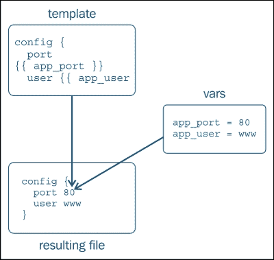

模板为参数值提供占位符，随后这些值在变量中定义。变量可以从不同地方提供，包括角色、剧本、清单，甚至在启动 Ansible 时通过命令行传递。现在让我们详细了解模板和变量。

# Jinja2 模板

**Jinja** 是做什么的？**Jinja2** 是一个非常流行且强大的基于 Python 的模板引擎。由于 Ansible 是用 Python 编写的，因此它成为大多数用户的默认选择，就像其他基于 Python 的配置管理系统，如 **Fabric** 和 **SaltStack** 一样。Jinja 这个名字源自日语中的“寺庙”一词，发音与“模板”相似。

Jinja2 的一些重要特性包括：

+   它运行速度快，并且是与 Python 字节码即时编译的。

+   它有一个可选的沙盒环境

+   它易于调试

+   它支持模板继承

## 模板的形成

模板看起来与普通的基于文本的文件非常相似，除了偶尔出现的变量或代码，这些代码被特殊标签包围。它们在运行时被评估，并大部分被值替换，从而生成文本文件，并将其复制到目标主机上。以下是 Jinja2 模板接受的两种标签类型：

+   `{{ }}` 将变量嵌入模板中，并在生成的文件中打印其值。这是模板最常见的用法。

    例如：

    ```
        {{ nginx_port }}
    ```

+   `` 将代码语句嵌入模板中，例如，对于循环，它嵌入 if-else 语句，这些语句在运行时被评估，但不会被打印出来。

# 事实和变量

现在我们已经了解了 Jinja2 模板提供的代码，让我们理解一下这些数据的来源，这些数据会在运行时嵌入到模板中。数据可以来自事实或变量。在 Jinja2 模板中，事实和变量的使用遵循相同的规则。事实是一种变量；它们的区别在于来源。事实在运行时自动可用并被发现，而变量是用户定义的。

## 自动变量 – 事实

我们系统中的很多数据在握手过程中的托管主机会自动发现并提供给 Ansible。这些数据非常有用，告诉我们有关系统的所有信息，例如：

+   主机名、网络接口和 IP 地址

+   系统架构

+   操作系统

+   硬盘驱动器

+   使用的处理器和内存量

+   它是一个虚拟机吗？如果是，是否是虚拟化/云提供商？

### 提示

事实会在 Ansible 执行的最开始阶段收集。记住输出中有一行说 **GATHERING FACTS *********？那正是发生的时刻。

你可以通过运行以下命令来查找任何系统的事实，并获得简化的输出：

```
$ ansible -i customhosts www -m setup | less
192.168.61.12 | success >> {
  "ansible_facts": {
    "ansible_all_ipv4_addresses": [
      "10.0.2.15",
      "192.168.61.12"
    ],
    "ansible_architecture": "i386",
    "ansible_bios_date": "12/01/2006",
    "ansible_cmdline": {
      "BOOT_IMAGE": "/vmlinuz-3.5.0-23-generic",
      "quiet": true,
      "ro": true,
      "root": "/dev/mapper/vagrant-root"
    },
    "ansible_distribution": "Ubuntu",
    "ansible_distribution_major_version": "12",
    "ansible_distribution_version": "12.04",
    "ansible_domain": "vm",
    "ansible_fqdn": "vagrant.vm",
    "ansible_hostname": "vagrant",
    "ansible_nodename": "vagrant",
    "ansible_os_family": "Debian",
    "ansible_pkg_mgr": "apt",
    "ansible_processor": [
      "GenuineIntel",
      "Intel(R) Core(TM) i5-3210M CPU @ 2.50GHz"
    ],
    "ansible_processor_cores": 1,
    "ansible_processor_count": 2,
    "ansible_processor_threads_per_core": 1,
    "ansible_processor_vcpus": 2,
    "ansible_product_name": "VirtualBox",
  }
}
```

上述输出是 Ansible 自有格式，使用的是其核心的 setup 模块。与 setup 模块类似，还有一个名为 `facter` 的模块，它会发现并展示在 Puppet（一种配置管理系统）中发现的事实。以下是如何使用 `facter` 模块发现同一主机事实的示例：

```
$ ansible -i customhosts www -m facter | less

```

在使用 `facter` 模块时，你需要注意的一点是，这个模块不是核心模块，它是作为额外模块的一部分提供的。额外模块是 Ansible 模块的一个子集，使用频率较低，相比于核心模块也不那么流行。此外，要使用 `facter` 模块，你需要在目标主机上预安装 "`facter`" 和 "`ruby-json`" 包。

## 用户定义的变量

我们看到了自动可用的事实，所发现的数据量是庞大的。然而，这并不提供我们基础设施的每个属性。例如，Ansible 无法发现：

+   我们希望 Web 服务器监听的端口

+   哪个用户应该拥有一个进程

+   用户需要创建哪些系统，并定义哪些授权规则

所有这些数据都是外部于系统配置文件的，必须由我们用户提供。这些数据是用户定义的，没错，但我们应该如何以及在哪里定义它们呢？接下来我们将探讨这个问题。

### 在哪里定义变量

变量可以定义的地方是一个复杂的现象，因为 Ansible 在这方面提供了丰富的选择。这也为用户提供了很大的灵活性，使他们能够以不同的方式配置基础设施的各个部分。例如，生产环境中的所有 Linux 主机应该使用本地包仓库或在暂存环境中的 Web 服务器，并应运行在 8080 端口上。所有这些都可以在不更改代码的情况下，仅通过数据驱动，变量来完成。

以下是 Ansible 接受变量的地方：

+   角色中的`default`目录

+   清单变量

    +   在单独的目录中定义的`host_vars`和`group_vars`参数

    +   在清单文件中定义的`host/group vars`参数

+   Playbooks 中的变量和角色参数

+   角色中的`vars`目录和在 play 中定义的变量

+   在运行时通过`-e`选项提供的额外变量

### 如何定义一个变量

看过变量可以从哪里定义之后，我们将开始研究如何在不同地方定义它。

下面是一些简单的规则，你可以用来创建有效的 Ansible 变量：

+   变量应始终以字母开头

+   它可以包含：

    +   字母

    +   数字

    +   下划线

让我们来看一下以下表格：

| 有效变量 | 无效变量 |
| --- | --- |
| `app_port` | `app-port` |
| `userid_5` | `5userid` |
| `logdir` | `log.dir` |

我们已经了解了优先级规则，现在知道可以在多个地方定义变量。无论优先级如何，定义变量的语法都是相同的。

要以键值对格式定义简单变量，请使用`var: value`，例如：

```
      nginx_port: 80
```

可以定义为 Nginx 的字典或哈希：

```
       port: 80
       user: www-data
```

数组可以定义为：

```
    nginx_listners:
      - '127.0.0.1:80'
      - '192.168.4.5:80'
```

# 模板化 Nginx 配置

你已经学到了很多关于事实、变量和模板的知识。现在，让我们将我们的 Nginx 角色转换为数据驱动。我们将开始模板化之前创建的 Nginx 的`default.conf`文件。将文件转换为模板的方法如下：

1.  在角色中创建用于存放模板和默认变量的目录：

    ```
    $ mkdir roles/nginx/templates
    $ mkdir roles/nginx/defaults

    ```

1.  始终从实际的配置文件开始，这个文件是该过程的最终结果，了解它所需的所有参数。然后倒推。例如，系统中`default.conf`文件的配置如下：

    ```
            server {
                     listen       80;
                     server_name  localhost; 
                     location / {
                        root   /usr/share/nginx/html;
                        index  index.html;
                   }
             }
    ```

1.  确定你希望动态生成的配置参数，移除这些参数的值，将它们单独记录下来，并用模板变量替换：

    ```
        Template Snippets:
          listen {{ nginx_port }} ;
          root   {{ nginx_root }};
          index  {{ nginx_index }};

        Variables:
          nginx_port: 80
          nginx_root: /usr/share/nginx/html
          nginx_index: index.html
    ```

1.  如果某些配置参数的值应该来自事实（通常是系统参数或拓扑信息，如主机名、IP 地址等），则可以通过以下命令来查找相关事实：

    例如：

    ```
    $ ansible -i customhosts www -m setup | less

    ```

    要查找系统的主机名：

    ```
    $ ansible -i customhosts www -m setup | grep -i hostname

      "ansible_hostname": "vagrant",
      "ohai_hostname": "vagrant",
    ```

1.  在模板中使用发现的事实，而不是用户定义的变量。例如：

    ```
      server_name  {{ ansible_hostname }},
    ```

1.  将生成的文件保存在模板目录中，最好使用 `.j2` 扩展名。例如，对于 `roles/nginx/templates/default.conf.j2`，生成的文件变为：

    ```
    #roles/nginx/templates/default.conf.j2
    server {
        listen       {{ nginx_port }};
        server_name  {{ ansible_hostname }};

        location / {
            root   {{ nginx_root }};
            index  {{ nginx_index }};
        }
    }
    ```

1.  创建 `roles/nginx/defaults/main.yml` 并存储如下的合理默认值：

    ```
    ---
    #file: roles/nginx/defaults/main.yml
    nginx_port: 80
    nginx_root: /usr/share/nginx/html
    nginx_index: index.html
    ```

1.  一旦模板创建完成，修改 `configure.yml` 文件中的任务，使用模板而不是复制模块：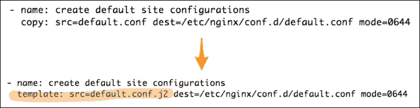

1.  最后，是时候删除之前使用复制模块的静态文件了：

    ```
    $ rm roles/nginx/files/default.conf

    ```

    然后是运行 Ansible playbook 的时候：

    ```
    $ ansible-playbook -i customhosts site.yml

    ```

让我们看看以下截图：

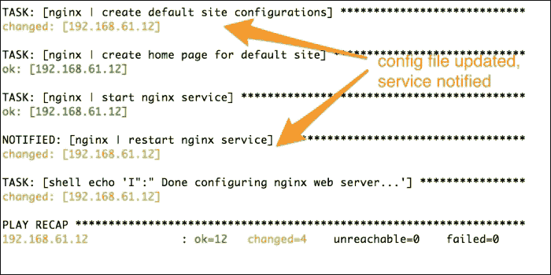

让我们分析一下这次运行发生了什么：

+   我们将配置任务更改为使用模板而不是复制模块，这一点在任务显示其更改状态时在截图中得到了体现

+   由于任务已更新，触发了通知，这会调用处理程序重新启动服务

在我们进行此更改后，Nginx 角色的代码树如下所示：

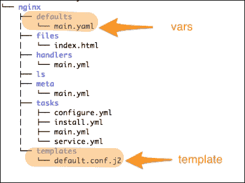

# 增加另一个层级——MySQL 角色

到目前为止，我们一直专注于我们基础设施的单层，即 Web 服务器层。只编写一个层的代码其实并不好玩。作为一个酷炫的 DevOps 团队，我们将创建一个多层架构，包括数据库、Web 服务器和负载均衡器。接下来，我们将开始创建 MySQL 角色，应用到目前为止学到的所有内容，并通过几个新概念扩展我们的知识。

这是我们 MySQL 角色的规范：

+   它应该安装 MySQL 服务器软件包

+   它应该配置 `my.cnf`，这是 MySQL 服务器的主要配置文件

+   它应该启动 MySQL 服务器守护进程

+   它应该支持 Ubuntu 12.04 以及 CentOS/RedHat Enterprise 6.x

## 使用 Ansible-Galaxy 创建角色框架

到目前为止，我们一直在做所有的繁重工作，理解并创建角色所需的目录结构。然而，为了让我们的生活更轻松，Ansible 附带了一个名为 **Ansible-Galaxy** 的工具，它应该能够帮助我们通过自动创建框架来初始化一个角色，并帮助我们遵循最佳实践。Ansible-Galaxy 实际上做的不止这些。它是一个实用工具，用于连接到 [`galaxy.ansible.com`](http://galaxy.ansible.com) 上托管的自由可用 Ansible 角色的仓库。这类似于我们使用 **CPAN** 或 **RubyGems** 的方式。

让我们开始使用以下命令通过 Ansible-Galaxy 初始化 MySQL 角色：

```
$ ansible-galaxy init --init-path roles/ mysql

```

下面是对前面命令的分析：

+   `init`：这是传递给 Ansible-Galaxy 用来创建框架的子命令

+   `--init-path` 或 `-p`：这些参数提供角色目录的路径，在该路径下会创建目录结构

+   `mysql`：这是角色的名称

让我们看看以下截图：

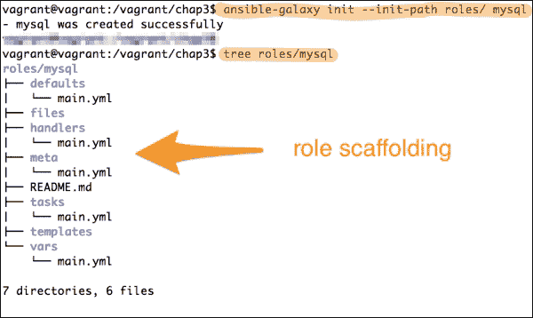

上图显示了通过 Ansible-Galaxy 初始化角色后创建的目录结构，它创建了一个空角色，结构适合上传到 Galaxy。它还初始化了必要的组件，包括任务、处理程序、变量和带占位符的 meta 文件。

## 向角色添加元数据

我们之前使用过 `meta` 文件来指定对其他角色的依赖关系。除了指定依赖关系外，meta 文件还可以为角色指定更多的数据，例如：

+   作者和公司信息

+   支持的操作系统和平台

+   角色功能的简要描述

+   支持的 Ansible 版本

+   该角色尝试自动化的软件类别

+   许可信息

让我们通过编辑 `roles/meta/main.yml` 来更新所有这些数据：

```
---
galaxy_info:
  author: Gourav Shah
  description: MySQL Database Role
  company: PACKT
  min_ansible_version: 1.4
  platforms:
  - name: EL
    versions:
      - all
  - name: Ubuntu
    versions:
      - all
  categories:
  - database:sql
```

在前面的代码片段中，我们为角色添加了元数据，例如作者和公司信息、角色功能的简要描述、与 Ansible 版本的兼容性、支持的平台、角色所属的类别等。

## 在任务和处理程序中使用变量

你已经学会了如何在模板中使用变量。这并不是所有定义变量的代码。除了模板，我们还可以在任务、plays 等中使用变量。这一次，我们承诺提供一个多平台角色，支持 Ubuntu 和 RedHat。与 **Chef** 和 **Puppet** 不同，Ansible 使用特定于操作系统的模块（例如 `apt` 和 `yum`），而不是平台无关的资源（如包）。我们将必须创建特定于操作系统的任务文件，并根据它们运行的操作系统选择性地调用它们。以下是我们如何操作：

+   我们将找到一个事实来确定操作系统平台/家族。我们在这里有几个选择：

    +   `ansible_distribution`

    +   `ansible_os_family`

+   RedHat、CentOS 和 Amazon Linux 都基于 `rpm`，具有类似的行为。Ubuntu 和 Debian 操作系统也是相同平台家族的一部分。因此，我们选择使用 `ansible_os_family` 事实，它能提供更广泛的支持。

+   我们将在角色中从两个地方定义变量：

    +   来自默认的 `vars` 文件，包含 Debian 的合理默认值。

    +   来自特定于 `os_family` 的变量（如果不是 Debian）。

+   我们还将创建特定于操作系统的任务文件，因为我们可能需要调用不同的模块（例如 `apt` 与 `yum`）以及与该操作系统相关的附加任务。

+   对于处理程序和任务，我们将使用变量来提供特定于操作系统的名称（例如，MySQL 与 mysqld，用于服务）。

+   最后，我们将创建 `main.yml` 文件，通过检查该事实的值来选择性地包含主机特定的变量和任务文件。

### 创建变量

我们将从创建变量开始。在 `/mysql/defaults/main.yml` 文件中为 Debian/Ubuntu 设置合理的默认值：

```
---
#roles/mysql/defaults/main.yml
mysql_user: mysql
mysql_port: 3306
mysql_datadir: /var/lib/mysql
mysql_bind: 127.0.0.1
mysql_pkg: mysql-server
mysql_pid: /var/run/mysqld/mysqld.pid
mysql_socket: /var/run/mysqld/mysqld.sock
mysql_cnfpath: /etc/mysql/my.cnf
mysql_service: mysql
```

然后它将在 RedHat/CentOS 机器上运行，但是我们需要覆盖一些变量以配置特定于 RedHat 的参数。

### 注意

注意文件名应该与`ansible_os_family`事实返回的确切名称（RedHat）匹配，大小写要正确。

我们将创建并编辑`roles/mysql/vars/RedHat.yml`文件，如下所示：

```
---
# RedHat Specific Configs.
# roles/mysql/vars/RedHat.yml
mysql_socket: /var/lib/mysql/mysql.sock
mysql_cnfpath: /etc/my.cnf
mysql_service: mysqld
mysql_bind: 0.0.0.0
```

最后，我们将创建`group_vars`事实，并使用一个变量来覆盖我们的默认设置。您已经了解到可以在`inventory`文件、`group_vars`和`host_vars`事实中指定变量。我们现在将开始使用`group_vars`事实。您可以在您的清单文件中创建这些，也可以创建一个名为`group_vars`的单独目录来进行管理。我们将采用后一种方法，这是推荐的做法：

```
# From our top level dir, which also holds site.yml
$ mkdir group_vars
$ touch group_vars/all

```

编辑`group_vars`/`all`文件，并添加以下行：

```
mysql_bind: "{{ ansible_eth0.ipv4.address }}"
```

### 创建任务

现在是创建任务的时候了。按照最佳实践，我们将任务分割成多个文件，并使用包含语句，就像我们为 Nginx 所做的那样。让我们首先在`roles/mysql/tasks`目录内创建默认的`main.yml`文件，如下所示：

```
---
# This is main tasks file for mysql role
# filename: roles/mysql/tasks/main.yml
# Load vars specific to OS Family. 
- include_vars: "{{ ansible_os_family }}.yml"
  when: ansible_os_family != 'Debian'

- include: install_RedHat.yml
  when: ansible_os_family == 'RedHat'

- include: install_Debian.yml
  when: ansible_os_family == 'Debian'

- include: configure.yml
- include: service.yml
```

我们之前看到了`include`语句。这里新的是`include_vars`事实和使用`ansible_os_family`事实。如果你注意到：

+   我们在这里使用了`ansible_os_family`事实和`include_vars`事实，以确定在不是 Debian 系统的情况下是否包含特定于操作系统的变量。为什么不适用于 Debian 系统？因为我们已经在`default`文件中指定了特定于 Debian 的配置。`include_vars`事实在前述条件下运行良好。

+   我们还使用`when`条件调用特定于操作系统的安装脚本。目前我们包含了两个脚本，支持 Debian 和 RedHat 系列。但是，以后我们可以通过添加更多的`install_<os_family>.yml`脚本来支持其他平台。

现在，让我们为 Debian 和 RedHat 创建安装任务：

```
$ vim roles/mysql/tasks/install_Debian.yml

```

然后按照以下步骤编辑文件：

```
---
# filename: roles/mysql/tasks/install_Debian.yml
  - name: install mysql server
    apt:
      name:"{{ mysql_pkg }}"
      update_cache:yes

$ vim roles/mysql/tasks/install_Redhat.yml

```

在运行上述命令后，按照以下步骤编辑文件：

```
---
# filename: roles/mysql/tasks/install_RedHat.yml
- name: install mysql server
   yum:
     name:"{{ mysql_pkg }}"
     update_cache:yes
```

在前面的示例中，我们分别使用了`apt`和`yum`模块来支持 Debian 和 RedHat 基于系统。按照最佳实践，我们将通过使用变量`mysql_pkg`来写入数据驱动角色，根据运行的平台设置包名称。让我们看看以下步骤：

1.  下一步是创建一个任务来配置 MySQL。因为我们知道每个配置文件应该是一个模板，所以我们将为 MySQL 服务器的默认配置文件`my.cnf`创建一个模板：

    ```
    $ touch roles/mysql/templates/my.cnf.j2

    ```

    然后按照以下步骤编辑文件：

    ```
    # Notice:This file is being managed by Ansible
    # Any manual updates will be overwritten
    # filename: roles/mysql/templates/my.cnf.j2
    [mysqld]
    user = {{ mysql_user | default("mysql") }}
    pid-file	 = {{ mysql_pid }}
    socket = {{ mysql_socket }}
    port = {{ mysql_port }}
    datadir = {{ mysql_datadir }}
    bind-address = {{ mysql_bind }}
    ```

1.  我们创建了一个带有`.j2`扩展名的模板，因为它是一个 Jinja2 模板。虽然这不是必须的，但是是一种推荐的做法。

1.  所有配置参数都来自 `{{var}}` 格式的变量。这是管理配置文件的推荐做法。我们可以让属性优先级决定值的来源。

### 提示

在每个被 Ansible 管理的文件中添加注释是一个好习惯。这可以避免可能的手动更新或临时更改。

我们将编写一个任务来管理这个模板，并将生成的文件复制到主机上的目标路径：

```
---
# filename: roles/mysql/tasks/configure.yml
 - name: create mysql config
   template: src="img/my.cnf" dest="{{ mysql_cnfpath }}" mode=0644
   notify:
    - restart mysql service
```

我们有一个通用的配置文件模板；然而，复制到的路径因平台而异，也取决于你打算使用的 MySQL 版本。在这里，我们使用的是默认包含在 Ubuntu 和 CentOS 仓库中的 MySQL 发行版，我们将从角色变量中设置 `mysql_cnfpath` 路径，具体如下：

+   在 Ubuntu/Debian 上，使用命令：`mysql_cnfpath = /etc/mysql/my.cnf`

+   在 RedHat/CentOS 上，使用命令：`mysql_cnfpath = /etc/my.cnf`

同时，我们将通知 MySQL 服务重启处理程序。这将确保如果配置文件有任何更改，服务会自动重启。

为了管理一个服务，我们将创建一个服务任务和处理程序：

任务：

```
$ touch roles/mysql/tasks/service.yml

```

然后按如下方式编辑文件：

```
---
# filename: roles/mysql/tasks/service.yml
 - name: start mysql server
   service: name="{{ mysql_service }}" state=started
```

处理程序：

```
$ touch roles/mysql/handlers/main.yml

```

运行上述命令后，按如下方式编辑文件：

```
---
# handlers file for mysql
# filename: roles/mysql/handlers/main.yml
- name: restart mysql service
  service: name="{{ mysql_service }}" state=restarted
```

这里，任务和处理程序类似于 Nginx 服务，因此不需要过多描述。唯一的变化是我们使用 `mysql_service` 变量来决定启动或重启的服务名称。

## 在 playbook 中使用变量

变量也可以在 playbook 中指定。推荐的做法是将它们作为角色参数传递，以下是一个示例。这通常在角色中有默认值时很有用，如果你想覆盖一些特定于你配置的参数。这样，角色仍然是通用的和可共享的，并且不会包含特定于组织的数据。

我们将创建一个 playbook 来管理我们的数据库，然后将其包含在全局的 playbook 中，示例如下：

```
$ touch db.yml

```

然后按如下方式编辑文件：

```
---
# Playbook for Database Servers
# filename: db.yml
- hosts: db
  remote_user: vagrant
  sudo: yes
  roles:
    - { role: mysql, mysql_bind: "{{ ansible_eth1.ipv4.address }}" }
```

这里，我们假设主机的清单包含一个名为 `db` 的主机组。在我们的示例中，我们有两个 `db` 服务器，一个运行在 Ubuntu 上，另一个运行在 CentOS 上。可以这样添加：

```
[db]
192.168.61.11 ansible_ssh_user=vagrant ansible_ssh_private_key_file=/vagrant/insecure_private_key
192.168.61.14 ansible_ssh_user=vagrant ansible_ssh_private_key_file=/vagrant/insecure_private_key
```

在前面的 playbook 中，我们使用了一个带参数的角色，覆盖了一个变量，即 `mysql_bind`。这个值是从多级事实中设置的。

让我们看看以下截图：

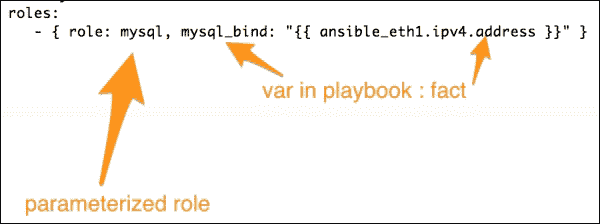

多级事实也可以指定为 `ansible_eth1["ipv4"]["address"]`，这两种格式都是有效的。当我们想创建角色的多个实例时，带参数的角色也很有用，例如，在不同端口上运行的虚拟主机和 WordPress 实例。

现在，让我们使用 `include` 语句将这个 playbook 包含在顶级的 `site.yml` 文件中：

编辑`site.yml`文件如下：

```
---
# This is a sitewide playbook
# filename: site.yml
- include: www.yml 
- include: db.yml
```

## 将 MySQL 角色应用于 DB 服务器

我们已经准备好配置数据库服务器。让我们继续将新创建的角色应用到清单中的所有`db`服务器：

```
$ ansible-playbook -i customhosts site.yml

```

以下图片包含了与数据库 play 相关的输出片段：

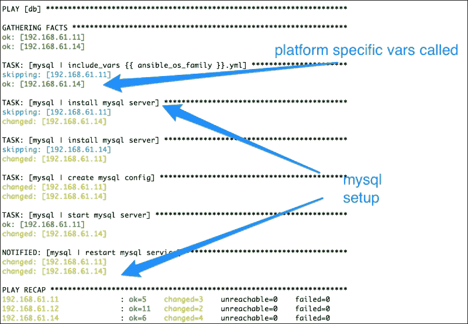

我们在前几章中已经解释了 Ansible 的运行过程，尤其是在创建第一个 playbook 和应用 Nginx 角色时。这里唯一的新概念是`include_var`部分。Ansible 将根据`ansible_os_family`事实检查我们的条件，并调用特定于操作系统的变量。在我们的案例中，我们有一个 Ubuntu 主机和一个 CentOS 主机，并且当仅在 CentOS 主机上运行时，它们都会调用`RedHat.yml`文件。

这里真正有趣的是，找出每个平台上我们的配置文件发生了什么变化，以及哪些变量的优先级更高。

# 变量优先级

我们指定了变量的默认值，将它们用于清单文件，并从不同的位置定义了相同的变量（例如，defaults、vars 和 inventory）。现在，让我们分析模板的输出，了解这些变量到底发生了什么。

以下是显示 Ubuntu 上`my.cnf`文件的图示：

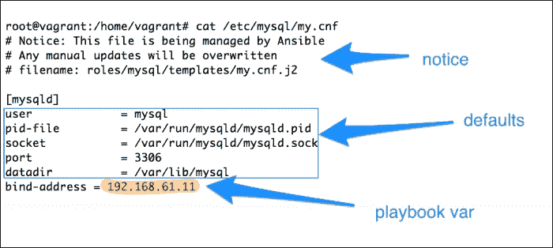

以下是对截图的分析：

+   文件的评论部分有一个通知。这可以防止管理员手动修改文件。

+   大多数变量来自角色中的默认值。这是因为 Debian 是我们的操作系统默认系列，我们已经为其设置了合理的默认值。类似地，对于其他操作系统平台，我们也从角色的`vars`目录中设置变量默认值。

+   即使在默认值和`group_vars`中已指定`bind_address`参数，它也会从 playbook 的角色参数中获取值，该值的优先级高于其他两个级别。

以下图表解释了在多个级别定义变量时会发生什么情况。所有这些都会在运行时合并。如果在多个位置定义了相同的变量，则适用优先级规则：

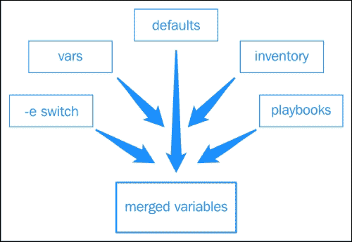

为了理解优先级规则，让我们看看在 CentOS 主机上发生了什么。以下是 CentOS 上创建的`my.cnf`文件：

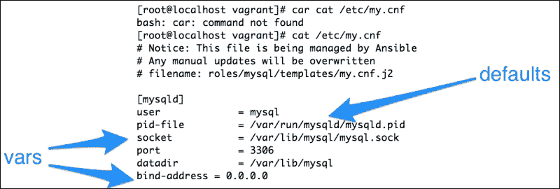

如前图所示，在 CentOS 的情况下，我们看到了一些有趣的结果：

+   **user**、**pid**、**datadir**和**port**的值来自默认值。我们已经看过合并顺序。如果变量不完全相同，它们将被合并以创建最终配置。

+   套接字的值来自 vars，因为这是唯一定义它的地方。不过，我们希望这个套接字在基于 RedHat 的系统中保持常量，因此我们将其指定在角色的 vars 目录中。

+   `bind_address`参数再次来自 vars 目录。这一点很有趣，因为我们在以下位置定义了`mysql_bind`变量：

    +   角色中的`Default`

    +   `group_vars`

    +   `playbook`

    +   角色中的`vars`

下图展示了当我们多次定义相同变量时的优先级规则：


由于我们的角色在`vars`目录中定义了`bind_address`参数，它优先于其他所有参数。

有一种方法可以在运行 Ansible 时使用额外的变量或`-e`选项来覆盖角色参数。这是 Ansible 管理的变量的最高优先级。

例如：

```
ansible-playbook -i customhosts db.yml  -e mysql_bind=127.0.0.1

```

在前面的启动命令中，我们使用了`-e`选项，它将覆盖其他所有变量级别，并确保 MySQL 服务器绑定到`127.0.0.1`。

# 变量使用的最佳实践

让人有些不知所措，对吧？别担心，我们将给你一些关于使用变量的最佳实践建议：

+   从角色中的默认值开始。这是所有优先级中最低的。这也是提供应用程序合理默认值的好地方，这些默认值之后可以从不同的地方被覆盖。

+   组变量非常有用。我们很多时候会做区域特定或环境特定的配置。我们还会将某些角色应用于特定组的服务器，例如，对于亚洲的所有 Web 服务器，我们应用 Nginx 角色。还有一个名为"`all`"的默认组，它将包含所有组的所有主机。将所有组共享的变量放在"`all`"（`group_vars/all`）中是一个好习惯，之后可以被更具体的组覆盖。

+   如果有主机特定的例外情况，请使用`hosts_vars`，例如`host_vars/specialhost.example.org`。

+   如果你希望将变量分开存放在不同的文件中，可以创建以主机名命名的目录，并将变量文件放入其中。该目录下的所有文件都会被评估：

    +   `group_vars/asia/web`

    +   `host_vars/specialhost/nginx`

    +   `host_vars/specialhost/mysql`

+   如果你希望保持角色的通用性并且能够共享，请在角色中使用默认值，然后从 playbook 中指定特定于组织的变量。这些可以作为角色参数来指定。

+   如果你希望角色变量始终优先于清单变量和 playbooks 中的变量，可以将它们指定在角色的`vars`目录中。这对于为特定平台提供角色常量很有用。

+   最后，如果你希望在运行时覆盖上述任何变量并提供一些数据，可以在使用 Ansible 命令时通过`-e`选项提供额外的变量。

到目前为止，我们的 MySQL 角色和数据库 playbook 的目录结构应该像下面的图示一样：

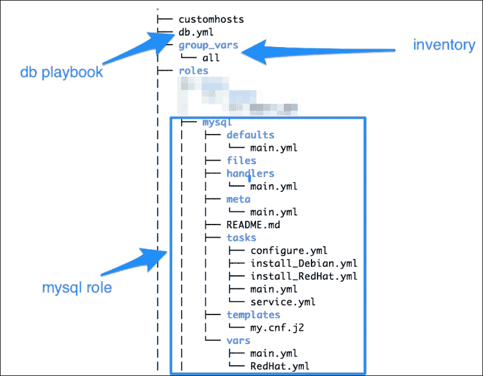

# 复习问题

你认为你已经足够理解本章内容了吗？尝试回答以下问题以测试你的理解：

1.  Jinja2 模板与静态文件有什么不同？

1.  什么是事实（facts）？它们是如何被发现的？

1.  在 Jinja2 模板中，`{{ }}` 和 `` 有什么区别？

1.  除了模板外，你还可以在其他地方使用变量吗？如果可以，在哪里？

1.  如果你在角色的 `vars` 目录中定义了变量 `foo`，并且在 `hosts_var` 文件中也定义了相同的变量，那么这两个变量中哪个会优先使用？

1.  如何编写支持多个平台的 Ansible 角色？

1.  你可以在角色的哪里指定作者和许可信息？

1.  如何在启动 Ansible-playbook 命令时提供变量？

1.  你会使用哪个命令来自动创建角色所需的目录结构？

1.  如何覆盖角色 `vars` 目录中指定的变量？

# 总结

本章的开始，我们学习了为什么以及如何使用 Ansible 变量、事实和 Jinja2 模板将数据与代码分离。你学会了通过在模板、任务、处理器和 playbook 中提供变量和事实来创建数据驱动的角色。此外，我们为数据库层创建了一个新角色，该角色支持 Debian 和 RedHat 两大操作系统家族。你学会了系统事实是什么，以及它们是如何被发现和使用的。你了解了变量可以从多个地方指定，它们是如何合并的以及优先级规则。最后，你了解了使用变量的最佳实践。

在下一章，我们将学习如何使用自定义命令和脚本，了解什么是注册变量，并使用这些信息部署一个示例 WordPress 应用。
