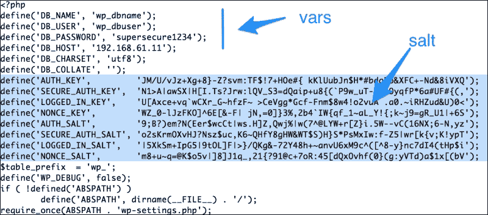

# 第四章：引入您的代码 – 自定义命令和脚本

Ansible 提供了多种内置模块，允许我们管理各种系统组件，例如用户、软件包、网络、文件和服务。Ansible 的内置式方法还提供了将组件与云平台、数据库和应用程序（如**Jira**、**Apache**、**IRC**、**Nagios**等）集成的能力。然而，偶尔我们会遇到找不到完全符合需求的模块的情况。例如，从源代码安装软件包涉及下载它、解压源代码 tarball、运行 make 命令，最后执行“make install”。没有单一模块可以完成这些操作。有时，我们也希望将已有的脚本（比如我们花费多夜编写的脚本）引入，只需使用 Ansible 调用或安排执行这些脚本，例如，每夜备份脚本。在这种情况下，Ansible 的命令模块将成为我们的救星。

在本章中，我们将介绍：

+   如何运行自定义命令和脚本

+   Ansible 命令模块：raw、command、shell 和 script

+   如何控制命令模块的幂等性

+   注册变量

+   如何创建 WordPress 应用

# 命令模块

Ansible 有四个模块属于这一类别，并在运行系统命令或脚本时提供了选择选项。这四个模块是：

+   Raw

+   命令

+   Shell

+   Script

我们将逐一开始学习这些内容。

## 使用 raw 模块

大多数 Ansible 模块要求目标节点上安装 Python。然而，顾名思义，raw 模块提供了一种通过 SSH 与主机通信的方式，执行原始命令而不涉及 Python。使用此模块将完全绕过 Ansible 的模块子系统。在某些特殊情况下，这种方法非常有用。例如：

+   对于运行 Python 版本低于 2.6 的遗留系统，Ansible 要求在运行 playbooks 之前安装 `Python-simplejson` 包。可以使用 raw 模块连接到目标主机并在执行任何 Ansible 代码之前安装所需的前置包。

+   对于网络设备，如路由器、交换机以及其他嵌入式系统，可能根本没有 Python。这些设备仍然可以仅通过使用 raw 模块来使用 Ansible 管理。

除了这些例外情况外，对于所有其他情况，建议使用命令或 shell 模块，因为它们提供了控制命令何时、从哪里以及如何执行的方式。

让我们看一下以下给定的示例：

```
$ ansible -i customhosts all  -m raw -a "uptime"
[Output]
192.168.61.13 | success | rc=0 >>
 04:21:10 up 1 min,  1 user,  load average: 0.27, 0.10, 0.04
192.168.61.11 | success | rc=0 >>
 04:21:10 up 5 min,  1 user,  load average: 0.01, 0.07, 0.05
192.168.61.12 | success | rc=0 >>
 04:21:12 up  9:04,  1 user,  load average: 0.00, 0.01, 0.05

```

上述命令通过 SSH 连接到提供的 `customhosts` 清单中的所有主机，运行 raw 命令 uptime，并返回结果。即使目标主机没有安装 Python，这也能正常工作。这相当于为一组主机编写一个 `for` 循环的临时 shell 命令。

相同的命令可以转换为如下任务：

```
   - name: running a raw command 
     raw: uptime
```

## 使用命令模块

这是执行命令在目标节点上最推荐的模块。该模块接受自由格式的命令序列，并允许你运行任何可以从命令行界面启动的命令。除了命令之外，我们还可以选择性地指定：

+   从哪个目录运行命令

+   使用哪个 shell 来执行命令

+   何时不运行命令

我们来看一下以下示例：

```
   - name: run a command on target node
     command: ls -ltr
     args:
       chdir: /etc
```

这里调用了命令模块，在目标主机上运行 `ls -ltr`，并通过参数将目录更改为 `/etc`，然后再运行命令。

除了将其编写为任务外，命令模块还可以直接调用，如下所示：

```
$ ansible -i customhosts all  -m command -a "ls -ltr"

```

## 使用 shell 模块

该模块与我们刚学到的命令模块非常相似。它接受自由格式的命令和可选参数，并在目标节点上执行它们。然而，shell 模块和命令模块之间有细微的区别，具体列举如下：

+   Shell 通过目标主机上的 '/`bin/sh`' shell 运行命令，这也意味着使用此模块执行的任何命令都可以访问该系统上的所有 shell 变量。

+   与命令模块不同，shell 还允许使用运算符，例如重定向（ `<, <<, >> , >` ）、管道（ | ）、&& 和 ||

+   Shell 比命令模块不那么安全，因为它可能会受到远程主机上 shell 环境的影响

我们来看一下以下示例：

```
   - name: run a shell command on target node
     shell: ls -ltr | grep host >> /tmp/hostconfigs
     args:
       chdir: /etc
```

类似于使用命令模块，前面的任务通过 shell 模块运行命令序列。然而，在这种情况下，它接受如 `|` 和 `>>` 这样的运算符，使用 `grep` 进行过滤，并将结果重定向到文件。

不需要将此任务指定为 playbook 的一部分，可以将其作为 Ad hoc 命令通过 Ansible 运行，如下所示：

```
ansible -i customhosts all --sudo -m shell \
 -a "ls -ltr | grep host >> /tmp/hostconfigs2 \
chdir=/etc"
```

在这里，你需要显式指定 `--sudo` 选项，以及作为参数的模块选项，例如 `chdir=/etc` 和实际的命令序列。

## 使用脚本模块

到目前为止我们学习的命令模块只允许在远程主机上执行一些系统命令。会有这种情况：我们已经有了一个现有的脚本，需要将其复制到远程主机上并在那里执行。使用 shell 或命令模块，这可以通过以下两个步骤来实现：

1.  使用复制模块将脚本文件传输到远程主机。

1.  然后，使用命令或 shell 模块执行之前传输的脚本。

Ansible 提供了一个量身定制的模块，以更高效的方式解决这个问题。使用脚本模块代替命令或 shell，我们可以一步完成复制和执行脚本。

例如，考虑以下代码片段：

```
   - name: run script sourced from inside a role
     script:  backup.sh
   - name: run script sourced from a system path on target host
     script: /usr/local/bin/backup.sh
```

如前面的代码片段所示，脚本可以从以下位置之一获取：

+   从角色内部调用此模块时的角色内部文件目录，如第一个示例所示

+   控制主机上的绝对系统路径（这是运行 Ansible 命令的主机）

就像所有其他模块一样，脚本也可以作为临时命令调用，如下所示：

```
$ ansible -i customhosts www --sudo -m script \

  -a "/usr/local/backup.sh"
```

在这里，`script` 模块只在 `www` 组的主机上调用。此命令将从控制主机复制脚本 `/usr/local/backup.sh` 并在目标节点上运行；在此情况下，所有 `www` 组中的主机都会执行。

# 部署 WordPress 应用程序——一种动手实践的方法

在第一次迭代中，我们已经配置了 Nginx Web 服务器和 MySQL 数据库来托管一个简单的网页。现在，我们将配置 WordPress 应用程序，在 Web 服务器上托管新闻和博客。

### 注意

**场景：**

在第 1 次迭代成功启动简单网页后，项目管理部门要求我们在第 2 次迭代中设置一个 WordPress 应用程序，用于发布新闻文章和博客。

WordPress 是一个基于 LAMP 平台的流行开源网站发布框架，LAMP 平台包含 Linux、Apache、MySQL 和 PHP。WordPress 是一个简单却灵活的开源应用程序，广泛用于许多博客和动态网站的搭建。运行 WordPress 需要一个 Web 服务器、PHP 和 MySQL 数据库。我们已经配置好了 Nginx Web 服务器和 MySQL 数据库。接下来，我们将通过为其创建角色来安装和配置 WordPress，稍后我们会配置 PHP。

为了创建角色，我们将使用 Ansible-Galaxy 工具，这个工具我们在前一章中已经学习过。

```
$ ansible-galaxy init --init-path roles/ wordpress

```

这将创建 WordPress 角色所需的框架。到目前为止，我们知道核心逻辑放在任务中，并由文件、模板、处理程序等支持。我们将从编写任务开始，来安装和配置 WordPress。首先，我们将创建主任务文件，如下所示：

```
---
# tasks file for wordpress
# filename: roles/wordpress/tasks/main.yml
 - include: install.yml 
 - include: configure.yml
```

### 注意

我们遵循最佳实践，并在此进一步模块化任务。我们不会将所有内容都放入 `main.yml` 文件中，而是创建一个 `install.yml` 文件和一个 `configure.yml` 文件，并从主文件中引入它们。

## 安装 WordPress

WordPress 的安装过程将在任务目录中的 `install.yml` 文件中处理。安装 WordPress 通常包括以下过程：

1.  从 [`wordpress.org`](https://wordpress.org) 下载 WordPress 安装包。

1.  解压安装包。

1.  将解压后的目录移动到 Web 服务器文档的 `root` 目录中。

我们将开始编写每个前述步骤的代码，如下所示：

```
---
# filename: roles/wordpress/tasks/install.yml
  - name: download wordpress
    command: /usr/bin/wget -c https://wordpress.org/latest.tar.gz
    args: 
      chdir: "{{ wp_srcdir }}"
      creates: "{{ wp_srcdir }}/latest.tar.gz"
    register: wp_download
```

我们在前面的步骤中看到了一些新特性。让我们分析一下这段代码：

+   我们正在使用一种新的方式编写任务。除了使用键值对表示任务外，我们还可以将参数分开，并以键值格式逐行编写每个参数。

+   为了下载 WordPress 安装程序，我们使用了命令模块并配合 `wget` 命令。该命令使用可执行序列并附加参数，参数包括 `chdir` 和 `creates`。

+   `Creates`是一个特殊选项。通过此选项，我们指定了 WordPress 安装程序下载的文件路径。我们将查看它如何起作用。

+   我们还将此模块的结果注册到名为`wp_download`的变量中，稍后将在其他任务中使用该变量。

### 提示

推荐使用内置的`get_url`模块，通过 HTTP/FTP 协议下载文件。由于我们想演示命令模块的使用，因此选择了使用命令模块，而不是`get_url`模块。

现在让我们回顾一下之前介绍的新概念。

### 控制命令模块的幂等性

Ansible 自带了大量的内置模块。正如我们在第一章《*构建基础架构蓝图*》中所学，大多数这些模块是幂等的，并且确定配置漂移的逻辑已内置于模块代码中。

然而，命令模块允许我们执行本质上非幂等的 Shell 命令。由于命令模块无法确定任务的结果，因此这些模块默认情况下是非幂等的。Ansible 为我们提供了一些选项，使得这些模块可以根据条件运行，从而实现幂等性。

以下是决定是否执行命令的两个参数：

+   `Creates`

+   `Removes`

两者都接受文件名作为参数的值。对于`creates`，如果文件存在，命令将不会执行。`removes`命令则相反。

"creates" 和 "removes" 选项适用于所有命令模块，除了 raw 模块。

以下是如何使用`creates`和`removes`标志的一些指南：

+   如果您执行的命令序列或脚本创建了文件，请提供该文件名作为参数值

+   如果命令序列没有创建标志文件，确保在命令序列或脚本中包含创建标志文件的逻辑

### 注册的变量

我们之前已经看过变量，但从未注册过变量。在我们编写的下载 WordPress 任务中，使用了以下选项：

```
           register: wp_download
```

此选项将任务的结果存储在名为`wp_download`的变量中。此注册结果稍后可以访问。以下是注册变量的一些重要组件：

+   `changed`：显示状态是否已更改

+   `cmd`：通过此项启动命令序列

+   `rc`：这是返回码

+   `stdout`：这是命令的输出

+   `stdout_lines`：这是逐行输出的内容

+   `stderr`：如果有错误，这里会显示错误信息

然后，这些可以作为`wp_download.rc`，`wp_download.stdout`访问，并且可以在模板、动作行或更常见的`when`语句中使用。在这种情况下，我们将使用`wp_download`的返回码来决定是否提取包。这是有道理的，因为提取一个根本不存在的文件没有意义。

### 使用 shell 模块提取 WordPress

现在，我们来编写一个任务来提取 WordPress 安装程序并将其移动到指定的位置。在此之前，我们还需要确保在运行此代码之前已经创建了文档的`root`目录：

```
  # filename: roles/wordpress/tasks/install.yml
  - name: create nginx docroot
    file:
      path: "{{ wp_docroot }}"
      state: directory
      owner: "{{ wp_user }}"
      group: "{{ wp_group }}"

  - name: extract wordpress
    shell: "tar xzf latest.tar.gz && mv wordpress {{ wp_docroot }}/{{ wp_sitedir }}"
    args: 
      chdir: "{{ wp_srcdir }}"
      creates: "{{ wp_docroot }}/{{ wp_sitedir }}"
    when: wp_download.rc == 0
```

现在，让我们分析一下我们刚刚写的内容：

+   我们使用`file`模块为 Web 服务器创建文档根目录。路径、用户和组等参数都来自变量。

+   为了提取 WordPress，我们使用`shell`模块而不是`command`模块。这是因为我们在这里将两个命令通过`&&`操作符结合在一起，而`command`模块不支持这种方式。

+   我们使用`when`语句来决定是否运行提取命令。为了检查条件，我们使用之前存储在注册变量`wp_download`中的下载命令的返回码。

## 配置 WordPress

下载并解压 WordPress 后，下一步是配置它。WordPress 的主要配置文件位于我们解压的`wordpress`目录下的`wp-config.php`文件中。作为一种良好的实践，我们将使用模板来管理这个配置文件。以下是配置 WordPress 的代码：

```
---
# filename: roles/wordpress/tasks/configure.yml
  - name: change permissions for wordpress site
    file:
      path: "{{ wp_docroot }}/{{ wp_sitedir }}"
      state: directory
      owner: "{{ wp_user }}"
      group: "{{ wp_group }}"
      recurse: true

  - name: get unique salt for wordpress
    local_action: command curl https://api.wordpress.org/secret-key/1.1/salt
    register: wp_salt

  - name: copy wordpress template
    template:
      src: wp-config.php.j2
      dest: "{{ wp_docroot }}/{{ wp_sitedir }}/wp-config.php"
      mode: 0644
```

让我们分析一下这段代码：

+   第一个任务递归地为所有 WordPress 文件设置权限。

+   第二个任务在本地运行一个命令，并将结果注册到`wp_salt`变量中。这是为了为 WordPress 提供用于增强安全性的密钥。这个变量这次将在模板中使用。

+   最后一个任务是生成一个 Jinja2 模板并将其复制到目标主机作为`wp-config.php`文件。

我们也来看看 Jinja2 模板：

```
# filename: roles/wordpress/templates/wp-config.php.j2
<?php
define('DB_NAME', 'wp_dbname');
define('DB_USER', 'wp_dbuser');
define('DB_PASSWORD', '{{ wp_dbpass }}');
define('DB_HOST', '{{ wp_dbhost }}');
define('DB_CHARSET', 'utf8');
define('DB_COLLATE', '');
{{ wp_salt.stdout }}
$table_prefix  = 'wp_';
define('WP_DEBUG', false);
if ( !defined('ABSPATH') )
  define('ABSPATH', dirname(__FILE__) . '/');
require_once(ABSPATH . 'wp-settings.php');
```

在这里，我们从变量中填充配置参数的值。值得注意的是，我们还嵌入了使用`stdout`变量下载的 salt 输出：

```
            {{ wp_salt.stdout }}
```

从这个模板生成的文件，在填入变量和从注册变量`stdut`中获取的值后，将会如下所示：



现在，我们将把这个新角色添加到`www.yml` playbook 中，以便它能在所有的 Web 服务器上执行：

```
#filename: www.yml
  roles:
     - nginx
     - wordpress
```

然后，我们将仅对 Web 服务器运行 Ansible playbook，如下所示：

```
$ ansible-playbook www.yml  -i customhosts

```

这将在所有 Web 服务器主机上下载、解压并配置 WordPress。我们仍然没有安装 PHP，也没有配置 Nginx 来提供 WordPress 页面，因此我们的更改尚未生效。

# 复习问题

你认为你已经足够理解这一章节了吗？尝试回答以下问题来测试你的理解：

1.  当 Ansible 提供了包含一切的方法时，为什么我们还需要命令模块？

1.  何时以及为什么要使用 raw 模块？

1.  当执行的命令不创建文件时，如何在 shell 中使用 `creates` 参数？

1.  `command` 模块和 `shell` 模块有什么不同？何时会使用 shell？

1.  如果 `var3` 是一个注册变量，如何在模板中打印其输出？

# 概要

在本章中，您学习了如何使用 Ansible 的命令模块运行自定义命令和脚本，即 raw、command、shell 和 script。您还学习了如何使用 `creates` 和 `removes` 标志来控制命令模块的幂等性。我们开始使用注册变量来存储任务的结果，稍后可以条件性地运行其他任务或在模板中嵌入输出。最后，我们创建了一个角色来安装和配置 WordPress 应用程序。

在下一章中，我们将开始学习如何使用条件语句控制执行流程，如何有选择地应用角色，以及如何在模板中使用条件控制结构。
