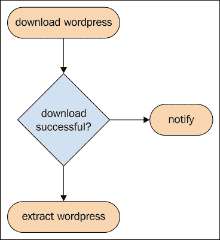
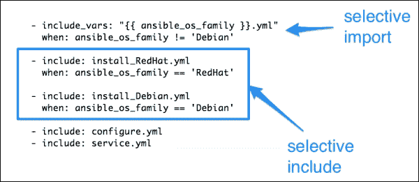
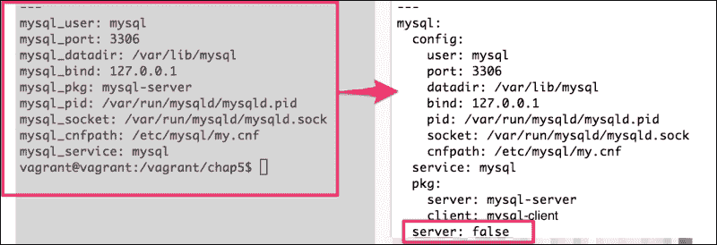
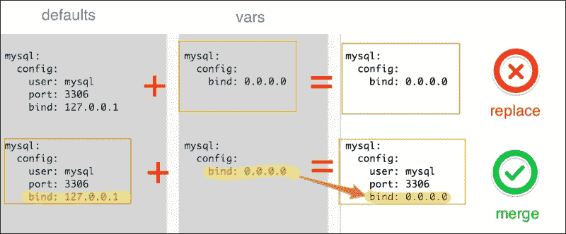
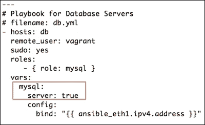

# 第五章 执行流程控制 - 条件语句

控制结构是指任何对程序执行流程产生影响的结构。控制结构主要有以下两种类型：

+   条件语句

+   迭代

有时，我们需要根据变量的值、平台类型或甚至其他命令的结果有条件地执行代码。有时我们还需要对多个对象进行迭代，如列表哈希或多层次变量。

大多数编程语言和工具使用强大但机器友好的构造，如`if else`、`for`、`unless`、`do while`等。然而，Ansible 始终坚持其作为人类友好的自动化语言的设计原则，并通过全能的`when`和`with_*`构造实现相同的目标，这些构造更接近英语语言。让我们开始探索它是如何做到的。

本章我们将涵盖以下主题：

+   使用条件控制与`when`语句

+   使用变量和事实跳过子例程

+   有选择性地应用角色

+   Jinja2 模板中的条件控制结构

# 条件控制结构

条件控制结构允许 Ansible 根据特定条件遵循替代路径、跳过任务或选择特定文件进行导入。在通用编程语言中，这通常通过`if-then`、`else if`、`else`、`case`语句来实现。Ansible 则使用"`when`"语句来实现。以下是一些示例条件：

+   判断某个变量是否已定义

+   判断之前的命令序列是否成功

+   判断任务是否曾经执行过

+   判断目标节点平台是否与支持的平台匹配

+   判断某个文件是否存在

## when 语句

我们已经使用了`when`语句，根据另一个命令的结果提取 WordPress 归档文件，代码如下：

```
- name: download wordpress
    register: wp_download
- name: extract wordpress
    when: wp_download.rc == 0
```

这大致等同于编写一个 shell 代码片段，如下所示：

```
DOWNLOAD_WORDPRESS
var=`echo $?
if [$var -eq 0]
then
    EXTRACT_WORDPRESS()
fi
```

除了检查前面的代码外，我们还可以根据任务本身的结果简单地编写条件，如下所示：

```
- name: extract wordpress
    when: wp_download|success
- name: notify devops engineers
    when: wp_download|failed
```

为了使失败语句生效，我们需要在早期的任务中添加`ignore_errors: True`语句，该任务注册了变量。以下流程图描述了相同的逻辑：



### 基于事实的选择

事实是检测平台特定信息并基于此做出选择的良好信息来源，特别是在有混合环境时。基于此选择，我们可以：

+   决定是否执行任务

+   决定是否包含任务文件

+   决定是否导入文件

+   决定是否在目标节点上应用角色

我们在编写 MySQL 时已经使用了基于事实的选择，在那里我们使用了事实`ansible_os_family`来：

1.  为非 Debian 系统导入`vars`文件。

1.  为包安装包含平台特定的任务。

以下代码片段展示了两种用例：



# 重构 MySQL 角色

我们现有的 MySQL 角色只安装和配置服务器。大多数时候，我们所需要做的只是安装 MySQL 客户端包，而不是服务器。我们没有能力选择性地做这件事。

### 注意

**场景：**

我们的任务是重构 MySQL 角色，并根据变量值有条件地安装 MySQL 服务器。默认情况下，它应该只安装 MySQL 客户端包。

布尔变量可以用于设置开/关开关。我们将添加一个变量，并将其默认值设置为 `false`。这次，我们将创建一个多级变量或嵌套哈希。

## 多级变量字典

到目前为止，我们一直将变量命名为 `mysql_bind`、`mysql_port` 等，并使用下划线对其进行分类。如果你定义多个级别的字典，变量可以更好地分类和组织，例如：

```
mysql:
  config:
    bind: 127.0.0.1
    port: 3306
```

多级变量可以在代码中通过 `mysql['config']['bind']` 或 `mysql['config']['port']` 访问。现在，让我们更新 `roles/mysql/defaults/main.yml` 文件，使用多级变量，并创建一个新的布尔变量 `mysql.server`，它作为一个标志：



此外，我们还需要更新 `mysql` 角色中的 `vars` 目录下的文件，以新的风格定义变量，所有任务、处理程序和模板需要相应地引用它们。这个过程被添加为文本的一部分，以避免重复。

### 合并哈希

多级变量，或本质上来自不同位置定义的字典，可能需要合并。例如，如果我们在角色的 `default` 中定义了默认配置参数，然后在角色的 `vars` 目录中覆盖了其中一些，那么最终的 `hash` 变量应该包含来自 **defaults** 的项目，以及来自 **vars** 的覆盖值。

让我们看一下以下的截图：



然而，默认情况下，Ansible 会替换字典，在前面的例子中，我们将不会得到一个合并后的字典，而是会丢失用户和端口的 `vars`，因为角色中的 `vars` 具有更高的优先级。通过将 `hash_behavior` 参数设置为 `merge` 而不是 `replace`，可以避免这种情况，如下所示：

```
# /etc/ansible/ansible.cfg
    hash_behaviour=merge
```

这应该在 Ansible 控制主机上设置，并且不需要我们重启任何服务。

## 有选择地配置 MySQL 服务器

在重构代码并添加一个由变量控制的标志后，我们已经准备好选择性地配置 MySQL 服务器。我们有一个 `mysql.server` 变量，它的值为布尔值 `True`/`False`。这个变量可以用来决定是否跳过服务器配置，如下所示：

```
#file: roles/mysql/tasks/main.yml
- include: configure.yml
  when: mysql.server

- include: service.yml
  when: mysql.server
```

我们还需要添加任务来安装 MySQL 客户端包以及 Ansible MySQL 模块所需的 Python 绑定：

```
---
# filename: roles/mysql/tasks/install_Debian.yml
  - name: install mysql client
    apt:
      name: "{{ mysql['pkg']['client'] }}"
      update_cache: yes

  - name: install mysql server
    apt:
      name: "{{ mysql['pkg']['server'] }}"
      update_cache: yes
    when: mysql.server

  - name: install mysql python binding
    apt:
      name: "{{ mysql['pkg']['python'] }}"
```

这里，包名称来自以下变量 `hash`：

```
mysql:
pkg:
    server: mysql-server
    client: mysql-client
    python: python-mysqldb
```

默认情况下，`mysql.server` 参数已设置为 `False`。我们如何仅为数据库服务器启用该参数？我们有很多方法可以做到这一点。这次我们选择使用 playbook 变量，因为我们为数据库服务器专门设置了一个变量。

让我们来看一下下面的截图：



# Jinja2 模板中的条件控制结构

Ansible 使用 Jinja2 作为模板引擎。因此，除了 Ansible 任务支持的控制结构外，了解 Jinja2 控制结构对我们也非常有用。Jinja2 的语法将控制结构包含在 `` 块中。对于条件控制，Jinja2 使用熟悉的 `if` 语句，其语法如下：

```

    do_some_thing

    do_another_thing

    do_something_else

```

## 更新 MySQL 模板

我们之前创建的用于生成 `my.cnf` 文件的模板假设其中提到的所有变量都已定义。实际上，这不一定总是如此，这可能导致在运行 Ansible 时出现错误。我们能否有选择性地在 `my.cnf` 文件中包含配置参数？答案是肯定的。我们可以检查变量是否已定义，只有在定义后才将其添加到文件中，如下所示：

```
#filename: roles/mysql/template/my.cnf.j2
[mysqld]
user = {{ mysql['config']['user'] | default("mysql") }}

pid-file = {{ mysql['config']['pid'] }}


socket = {{ mysql['config']['socket'] }}


port = {{ mysql['config']['port'] }}


datadir = {{ mysql['config']['datadir'] }}


bind-address = {{ mysql['config']['bind'] }}

```

让我们分析一下前面的代码：

+   由于我们正在为 `mysql['config']['user']` 参数设置默认值，因此不需要检查它是否已定义。它已经得到妥善处理。

+   对于所有其他参数，我们通过条件判断检查变量是否已定义，例如`if mysql.config.pid is defined`。如果变量未定义，这将跳过该参数，而不是抛出错误。

# 只运行任务一次

有时，角色中的特定任务在 playbook 执行期间可能需要只执行一次，即使该角色应用于多个主机。可以使用 `run_once` 条件来实现：

```
name: initialize wordpress database
script: initialize_wp_database.sh 
run_once: true
```

由于我们使用了 `run_once` 选项，前面的任务将在角色应用的第一个主机上运行。所有随后的主机会跳过此任务。

# 条件执行角色

我们之前创建的 Nginx 角色用于设置 Web 服务器，仅支持基于 Debian 的系统。在其他系统上运行此逻辑可能会导致失败。例如，Nginx 角色使用 `apt` 模块安装软件包，但在基于 RedHat 的系统上，这将不起作用，因为它们依赖于 `yum` 包管理器。通过在 `when` 语句中添加事实条件，可以基于操作系统家族选择性地执行任务，从而避免这种情况。以下是 `www.yml` playbook 的代码片段：

```
#filename: www.yml (snippet)
- hosts: www
  roles:
    - { role: nginx, when: ansible_os_family == 'Debian' }
```

# 复习问题

你认为自己已经足够理解这一章了吗？试着回答以下问题来测试你的理解：

1.  在 Ansible 中，`if else` 语句的替代方法是什么？

1.  如何选择性地导入平台特定的变量？

1.  为什么 Jinja2 模板使用 `__` 和 `__` 来限定控制结构？

1.  你如何在不兼容的平台上跳过运行角色？

# 总结

在本章中，您学习了如何使用`when`语句控制执行流程，条件导入，选择性包含等。您还学会了如何使用变量和事实来选择性地跳过例程并执行特定于平台的子例程。我们重构了 MySQL 角色，开始使用变量字典来有条件地配置 MySQL 服务器，并使用预定义变量的更智能模板进行预检查。

在下一章中，我们将开始探讨第二类控制结构，即迭代控制结构，我们将开始循环数组和哈希。
