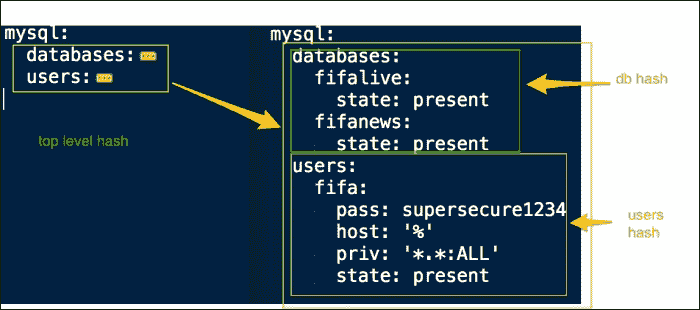
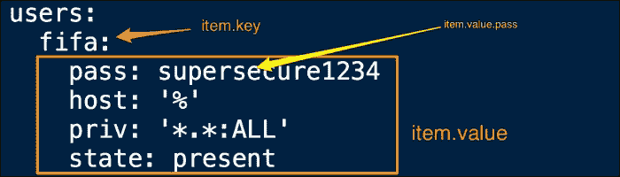
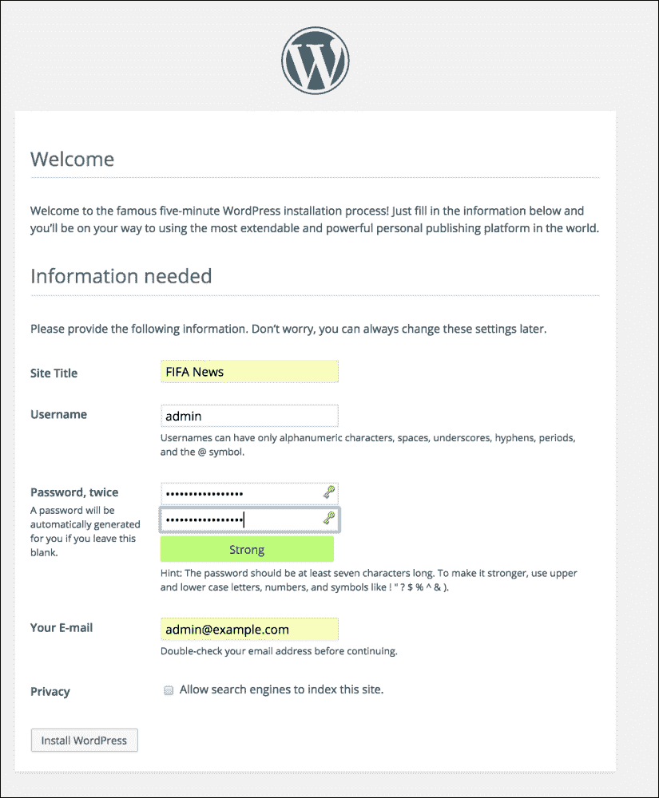

# 第六章：迭代控制结构 – 循环

在上一章你学到了条件控制。我们进入 Ansible 的控制结构世界，继续探索迭代控制。通常，我们需要创建目录列表、安装一堆包，或者定义并遍历嵌套的哈希或字典。传统编程语言使用`for`或`while`循环来迭代。Ansible 则用`with`语句替代它们。

在本章中，我们将学习：

+   如何使用`with`语句进行迭代控制

+   如何循环数组一次创建多个对象

+   如何定义嵌套哈希并遍历它们以创建数据驱动的角色

# 万能的`with`语句

通过“瑞士军刀”工具——`with`语句，可以实现迭代普通列表、解析字典、循环数字序列、解析路径并选择性地复制文件，或仅从列表中随机选取一个项。`with`语句的形式如下：

```
with_xxx
```

这里，`xxx`参数是需要循环的数据类型，例如，项目、字典等等。

以下表格列出了`with`语句可以迭代的数据类型：

| 构造 | 数据类型 | 描述 |
| --- | --- | --- |
| `with_items` | 数组 | 用于循环数组项。例如，创建一组用户、目录或安装一组包。 |
| `with_nested` | 嵌套循环 | 用于解析多维数组。例如，创建 MySQL 用户列表并授予他们访问一组数据库的权限。 |
| `with_dict` | 哈希 | 用于解析键值对字典并创建虚拟主机。 |
| `with_fileglobs` | 匹配模式的文件 | 用于解析路径并仅复制与特定模式匹配的文件。 |
| `with_together` | 集合 | 用于将两个数组作为集合连接并循环遍历。 |
| `with_subelements` | 哈希子元素 | 用于解析哈希的子元素。例如，遍历 SSH 密钥列表并分发给用户。 |
| `with_sequence` | 整数序列 | 用于循环一组数字。 |
| `with_random_choice` | 随机选择 | 用于随机选择数组中的项。 |
| `with_indexed_items` | 带索引的数组 | 这是一个带有索引的数组，当需要为项目指定索引时非常有用。 |

# 配置 WordPress 先决条件

在创建用于安装 WordPress 的角色时，在第四章，*引入你的代码 – 自定义命令和脚本*中，我们创建了下载、解压和复制 WordPress 应用程序的任务。然而，这还不足以启动 WordPress，它有以下先决条件：

+   一个 Web 服务器

+   PHP 绑定的 Web 服务器

+   MySQL 数据库和 MySQL 用户

在我们的案例中，已经安装了 Nginx Web 服务器和 MySQL 服务。我们还需要安装并配置 PHP，以及为我们的 WordPress 应用程序配置 MySQL 数据库和用户。为了处理 PHP 请求，我们选择实现 PHP5-FPM 处理器，它是传统 FastCGI 实现的替代方案。

# PHP5-FPM 角色

在 **PHP5-FPM** 中，**FPM** 代表 **FastCGI 进程管理器**。PHP5-FPM 提供了比 **fastcgi** 更先进的功能，这对于管理高流量网站非常有用。它适合服务我们的 fifanews 网站，该网站预计每天会收到几百万次访问。按照我们创建模块化代码的设计原则，我们将 PHP 功能独立到自己的角色中。让我们使用 Ansible-Galaxy 命令初始化 PHP5-FPM 角色，如下所示：

```
$ ansible-galaxy init --init-path roles/ php5-fpm

```

## 定义一个数组

PHP 的安装将涉及多个软件包的安装，包括 `php5-fpm`、`php5-mysql` 以及其他一些软件包。目前，我们一直在逐一编写任务。例如，让我们看看以下代码片段：

```
  - name: install php5-fpm
    apt: name: "php5-fpm" 
  - name: install php5-mysql
    apt: name: "php5-mysql"
```

然而，当我们想安装多个软件包时，这可能会变得重复，且会导致冗余代码。为了写出数据驱动的角色，我们将通过一个变量来驱动软件包的安装，该变量接收一个软件包列表并遍历列表。让我们开始定义列出软件包所需的参数，如下所示：

```
---
#filename: roles/php5-fpm/defaults/main.yml
#defaults file for php5-fpm
php5:
  packages:
    - php5-fpm
    - php5-common
    - php5-curl
    - php5-mysql
    - php5-cli
    - php5-gd
    - php5-mcrypt
    - php5-suhosin
    - php5-memcache
  service:
    name: php5-fpm
```

这是对前面代码的分析：

+   `php5` 变量是一个字典变量，它将包含我们传递给 `php5-fpm` 角色的所有参数。

+   `php5.packages` 参数是一个软件包数组，每个软件包在代码中占据一行。这个数组会传递给一个任务，该任务将遍历每个项目并安装它。

+   `php5.service` 参数定义了服务的名称，这将在服务任务中引用。

## 循环遍历数组

现在，让我们为 `php5-fpm` 角色创建任务。我们需要从数组中安装软件包，然后启动服务。我们将把软件包的功能分成两个单独的任务文件，并从 `main.yml` 文件中调用它们，如下所示：

```
---
#filename: roles/php5-fpm/tasks/main.yml
# tasks file for php5-fpm
- include_vars: "{{ ansible_os_family }}.yml"
  when: ansible_os_family != 'Debian'

- include: install.yml
- include: service.yml

#filename: roles/php5-fpm/tasks/install.yml
  - name: install php5-fpm and family
    apt:
      name: "{{ item }}"
    with_items: php5.packages
    notify:
     - restart php5-fpm service

#filename: roles/php5-fpm/tasks/service.yml
# manage php5-fpm service
- name: start php5-fpm service
  service:
    name: "{{ php5['service']['name'] }}"
    state: started
```

除了任务外，还可以编写重启 `php5-fpm` 角色的处理程序，如下所示：

```
---
# filename: roles/php5-fpm/handlers/main.yml
# handlers file for php5-fpm
- name: restart php5-fpm service
  service: name="{{ php5['service']['name'] }}" state=restarted
```

让我们分析一下前面的代码：

+   **主**：`main.yml` 文件包括基于 `ansible_os_family` 信息的变量，用于非 Debian 系统。这对于覆盖特定平台的变量非常有用。在包含 `vars` 文件后，主任务将继续包含 `install.yml` 和 `service.yml` 文件。

+   **安装**：`install.yml` 文件是我们遍历之前定义的软件包数组的地方。由于文件包含一个数组，我们使用 `with.items` 结构并使用 `php5.packages` 变量，然后传递 `{{ item }}` 参数作为要安装的软件包的名称。我们也可以直接传递数组，如下所示：

    ```
      with_items:
        - php5-fpm
        - php5-mysql
    ```

+   **服务与处理器**：`service.yml` 文件和处理器 `main.yml` 文件管理 `php5-fom` 服务的启动和重启。它使用字典变量 `php5['service']['name']` 来确定服务名称。

# 创建 MySQL 数据库和用户账户

WordPress 是一个内容管理系统，需要 MySQL 数据库来存储数据，如文章、用户等。此外，它还需要一个具有适当权限的 MySQL 用户，以便从 WordPress 应用程序连接到数据库。在安装 MySQL 时我们会获得一个管理员用户，但创建一个额外的用户账户并根据需要授予权限是一种好的做法。

## 创建哈希

**哈希**（hash）的缩写是哈希表，它是一个键值对字典。它是一个有用的数据结构，用来创建多级变量，然后通过程序化方式创建多个对象，每个对象具有自己的值。我们将在 `group_vars`/`all` 文件中将数据库和用户定义为字典项，如下所示：

```
#filename: group_vars/all
mysql_bind:  "{{ ansible_eth0.ipv4.address }}"
mysql:
  databases:
    fifalive:
      state: present
    fifanews:
      state: present
  users:
    fifa:
      pass: supersecure1234
      host: '%'
      priv: '*.*:ALL'
      state: present
```

以下是前面代码的分析：

+   我们在 `group_vars`/`all` 文件中定义了这个变量哈希，而不是在角色中定义。这是因为我们希望保持角色的通用性和可共享性，不添加特定于各自环境的数据。

+   我们将数据库和用户配置定义为多级字典或哈希。

### 嵌套哈希

这个多级哈希通过以下图表解释：



以下是描述该嵌套哈希结构的方式：

+   一个 MySQL 变量是一个哈希，包含两个键：数据库和用户。例如：

    ```
    mysql:
        databases: value
         users: value
    ```

+   这两个键的值分别是哈希，或者是关于要创建的数据库和用户的字典信息。例如：

    ```
    databases:
        fifalive: value
        fifanews: value
    ```

+   每个数据库本身就是一个包含键值对的字典。例如，对于 MySQL 用户 `fifalive`，其键值对为 "state:present"。

## 迭代哈希

创建数据库和用户账户通常需要创建带有模板的自定义脚本，然后通过命令模块调用。而 Ansible 则自带了这些模块，遵循这一理念，它为我们提供了现成的模块来执行 MySQL 相关任务，即 `mysql_db` 和 `mysql_user` 参数。使用 `with_dict` 语句，我们将遍历之前定义的数据库和用户字典，具体如下：

```
# filename: roles/mysql/tasks/configure.yml
 - name: create mysql databases
    mysql_db:
      name: "{{ item.key }}"
      state: "{{ item.value.state }}"
    with_dict: "{{ mysql['databases'] }}"

 - name: create mysql users
    mysql_user:
      name: "{{ item.key }}"
      host: "{{ item.value.host }}"
      password: "{{ item.value.pass }}"
      priv: "{{ item.value.priv }}"
      state: "{{ item.value.state }}"
    with_dict: "{{ mysql['users'] }}"
```

以下是前面代码的分析：

+   `mysql['databases']` 和 `mysql['users']` 参数是字典，通过 `with_dict` 语句传递给任务。

+   每个字典，或哈希，都有一个键值对，作为 `{{ item.key }}` 和 `{{ item.value }}` 参数传递。

+   `{{ item.value }}` 参数是一个字典。字典中的每个键随后会被称为 `{{ item.value.<key> }}`。例如，`{{ item.value.state }}` 参数

以下图表解释了如何解析这个嵌套哈希：



# 创建 Nginx 虚拟主机

在安装`php5-fpm`管理器并创建 MySQL 数据库和用户帐户后，剩下的最后一项配置是使用 Nginx 创建一个虚拟主机来服务我们的 WordPress 应用。我们之前安装的 Nginx web 服务器只服务一个简单的 HTML 页面，并且并不知道 WordPress 应用的存在或如何提供服务。我们从添加这些配置开始。

## 定义 PHP 站点信息

除了我们正在设置的`fifanews.com`站点之外，未来我们可能还会启动一些与足球相关的其他站点。因此，我们需要能够以编程方式在同一个 Nginx 服务器上添加多个站点。创建一个字典来定义站点信息，并将其嵌入到模板中，听起来是个不错的选择。由于站点信息是我们特有的，我们将变量哈希添加到`group_vars`文件中，如下所示：

```
#filename: group_vars/all
nginx:
  phpsites:
    fifanews:
      name: fifanews.com
      port: 8080
      doc_root: /var/www/fifanews
```

我们已经从 Ansible 任务中学会了如何解析这个字典。现在让我们添加一个任务，允许我们遍历这个字典，将值传递给模板，并创建虚拟主机配置：

```
#filename: roles/nginx/tasks/configure.yml
- name: create php virtual hosts
    template:
      src: php_vhost.j2
      dest: /etc/nginx/conf.d/{{ item.key }}.conf
    with_dict: "{{ nginx['phpsites'] }}"
    notify:
      - restart nginx service
```

字典中的每个项都会传递给模板，在这个例子中是传递给`php_vhost.j2`参数。这会读取哈希并创建一个虚拟主机模板，从而配置一个 PHP 应用，如下所示：

```
#filename: roles/nginx/templates/php_vhost.j2
#{{ ansible_managed }}

server {
    listen {{ item.value.port }};

  location / {
    root {{ item.value.doc_root }};
    index index.php;
  }

  location ~ .php$ {
    fastcgi_split_path_info ^(.+\.php)(.*)$;
    fastcgi_pass   backend;
    fastcgi_index  index.php;
    fastcgi_param  SCRIPT_FILENAME  {{ item.value.doc_root }}$fastcgi_script_name;
    include fastcgi_params;
  }
}
upstream backend {
  server 127.0.0.1:9000;
}
```

以下是前述代码的分析：

+   `{{ ansible_managed }}`参数是一个特殊变量，用来添加一个注释，通知服务器该文件正在由 Ansible 管理，并提供此文件在 Ansible 仓库中的路径、最后修改时间以及修改它的用户。

+   模板获取一个字典项并解析其值，因为它是一个嵌套哈希。此模板用于创建 Nginx 的 PHP 虚拟主机配置，使用`nginx.phpsites`设置的字典值。

+   字典提供的配置参数包括文档根目录、端口、使用的后端，告诉 Nginx 如何处理传入的 PHP 请求、使用哪个后端、监听哪个端口等等。

最后，我们将新角色添加到`www.yaml`文件中，如下所示：

```
# www.yml
roles:
     - { role: nginx, when: ansible_os_family == 'Debian' }
     - php5-fpm
     - wordpress
```

使用以下命令运行 playbook：

```
$ ansible-playbook -i customhosts site.yml

```

运行完成后，是时候测试我们的工作了。让我们在浏览器中加载以下 URL：

`http://<web_server_ip>:8080`

恭喜！！我们已经成功地使用 Nginx web 服务器和 MySQL 后台，完整配置地创建了一个 WordPress PHP 应用。现在，我们准备好设置我们的 fifanews 站点：



# 复习问题

你认为你已经足够理解本章内容了吗？试着回答以下问题来测试你的理解：

1.  在 Ansible 中，哪个语句替代了`for`循环？

1.  如何使用`with_____`语句遍历字典？

1.  你如何向模板中添加一个语句，打印出文件何时以及由谁修改？

1.  你如何打印嵌套哈希的值？

# 总结

在本章中，你学习了如何通过迭代创建多个对象。我们从全能的`with`语句及其各种形式的概述开始。然后，我们深入探讨了迭代两个最基本的数据结构——数组和哈希。`php5-fpm`角色接收一个包含软件包列表的数组，并在循环中创建任务以安装这些软件包。为了创建 MySQL 数据库和用户，我们定义了变量字典或哈希并对其进行了迭代。最后，我们添加了 Nginx 模板配置，通过迭代一个嵌套字典来创建多个虚拟主机，以支持 PHP 应用程序。

在下一章中，你将学习如何使用魔法变量发现关于其他节点的信息。
