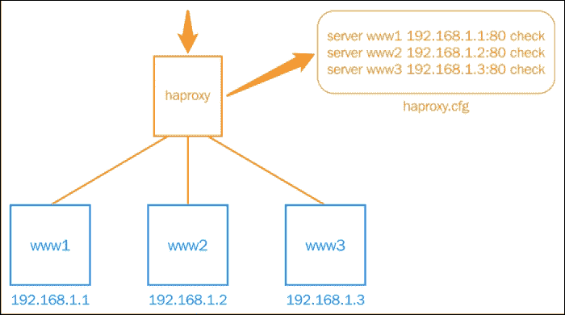
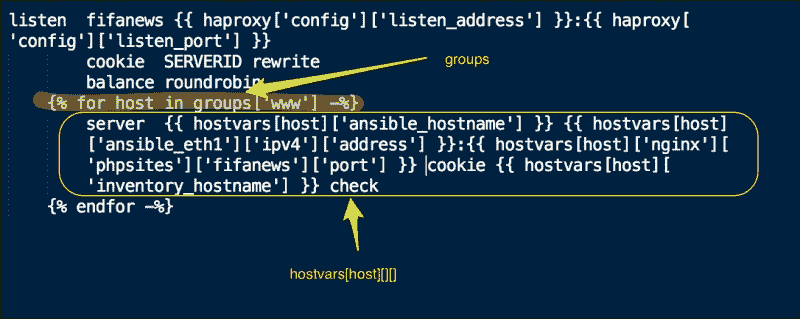
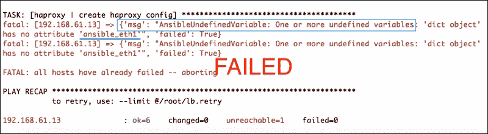
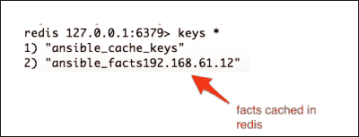

# 第七章：节点发现与集群化  

对于大多数现实场景，我们需要创建一个计算节点的集群，应用程序则在其上运行，并且这些节点是相互连接的。例如，我们之前构建的 WordPress 网站就需要将 Web 服务器和数据库连接在一起。  

集群化基础设施有一个拓扑结构，其中一种类的节点应该能够发现不同类或相同类服务器的信息。例如，WordPress 应用服务器需要发现数据库服务器的信息，负载均衡器则需要知道它正在服务的每个 Web 服务器的 IP 地址/主机名。本章重点介绍 Ansible 提供的原语，用于将节点分组并发现相互连接节点的属性。  

本章我们将学习：  

+   发现集群中其他节点的信息  

+   使用发现的魔法变量动态生成配置  

+   为什么以及如何启用事实缓存

# 使用魔法变量进行节点发现  

我们已经了解了用户定义的变量以及系统数据，也就是事实。除了这些，还有一些变量定义了节点、清单和任务的元信息，例如节点属于哪些组，哪些组是清单的一部分，哪些节点属于哪个组，等等。这些变量是隐式设置的，被称为**魔法**变量，非常有助于发现节点和拓扑信息。下表列出了最有用的魔法变量及其描述：  

| 魔法变量 | 描述 |   |
| --- | --- | --- |
| --- | --- |   |
| `hostvars` | 这些是其他主机上设置的查找变量或事实。 |   |
| `groups` | 这是清单中组的列表。可以用它来遍历一组节点，发现其拓扑信息。 |   |
| `group_names` | 这是节点所属的组列表。 |   |
| `inventory_hostname` | 这是清单文件中设置的主机名，可能与`ansible_hostname`事实不同。 |   |
| `play_hosts` | 这是当前任务中所有主机的列表。 |   |

除了前面的表格，还有一些额外的魔法变量，例如`delegate_to`、`inventory_dir`和`inventory_file`参数，然而这些与节点发现无关，且使用频率较低。  

我们现在将创建一个新的角色，作为负载均衡器，依赖于魔法变量提供的节点发现功能。  

# 创建负载均衡器角色  

我们创建了 Nginx 和 MySQL 角色来为 WordPress 站点提供服务。然而，如果我们需要构建一个可扩展的网站，我们还需要添加一个负载均衡器。这个负载均衡器将作为传入请求的入口点，然后将流量分配到可用的 Web 服务器上。让我们考虑以下场景：我们的网站 fifanews 已经成为了一个即时的热门网站。流量呈指数增长，而我们一直使用的单一 Web 服务器方法开始出现问题。我们需要横向扩展，添加更多的 Web 服务器。一旦我们开始创建更多的 Web 服务器，我们也需要有一些机制来平衡这些服务器的流量。我们被要求创建一个`haproxy`角色，它将自动发现集群中的所有 Web 服务器，并将它们添加到其配置中。

以下图解说明了这个场景，其中 haproxy 作为前端，将流量平衡到后端的 Web 服务器。Haproxy 是一个广泛使用的开源 TCP/HTTP 负载均衡器。让我们来看一下下面的图：



在接下来的步骤中，我们不仅会创建一个`haproxy`模块，还会利用魔法变量自动配置所有 Web 服务器节点的 IP 地址：

1.  我们先从创建编写这个角色所需的框架开始，使用以下命令：

    ```
    $ ansible-galaxy init --init-path roles/ mysql

    ```

    输出将如下所示：

    ```
     haproxy was created successfully

    ```

1.  我们现在将一些与`haproxy`角色相关的变量添加到变量默认值中：

    ```
    ---
    # filename: roles/haproxy/defaults/main.yml
    haproxy:
      config:
        cnfpath: /etc/haproxy/haproxy.cfg
        enabled: 1
        listen_address: 0.0.0.0
        listen_port: 8080
      service: haproxy
      pkg: haproxy
    ```

    ### 提示

    尽管为 haproxy 支持的每个配置添加一个参数是一种好习惯，但在编写这个角色时，我们将仅使用其中的一部分参数；这对于节点发现特别有用。

1.  现在，我们来创建一些任务和处理器，这些任务和处理器将安装、配置并管理在 Ubuntu 主机上的 haproxy 服务：

    ```
    ---
    # filename: roles/haproxy/tasks/main.yml
    - include: install.yml
    - include: configure.yml
    - include: service.yml

    ---
    # filename: roles/haproxy/tasks/install.yml
      - name: install haproxy
        apt:
          name: "{{ haproxy['pkg'] }}"

    ---
    # filename: roles/haproxy/tasks/configure.yml
     - name: create haproxy config
       template: src="img/haproxy.cfg.j2" dest="{{ haproxy['config']['cnfpath'] }}" mode=0644
       notify:
        - restart haproxy service

     - name: enable haproxy
       template: src="img/haproxy.default.j2" dest=/etc/default/haproxy mode=0644
       notify:
        - restart haproxy service

    ---
    # filename: roles/haproxy/tasks/service.yml
     - name: start haproxy server
       service:
         name: "{{ haproxy['service'] }}" 
         state: started

    ---
    # filename: roles/haproxy/handlers/main.yml
    - name: restart haproxy service
      service: name="{{ haproxy['service'] }}" state=restarted
    ```

下面是对前面代码的分析：

+   根据最佳实践，我们为每个阶段（安装、配置和服务）创建了单独的任务文件。然后我们从主任务文件中调用这些任务文件，即`tasks/main.yml`文件。

+   haproxy 的配置文件将使用 Jinja2 模板创建在`/etc/haproxy/haproxy.cfg`中。除了创建配置文件外，我们还需要在`/etc/defaults/haproxy`文件中启用`haproxy`服务。

+   安装、服务和处理器与我们之前创建的角色类似，因此我们将跳过描述。

我们已经在`configure.yml`文件中定义了模板的使用。现在，让我们创建这些模板：

```
#filename: roles/haproxy/templates/haproxy.default
ENABLED="{{ haproxy['config']['enabled'] }}"

#filename: roles/haproxy/templates/haproxy.cfg.j2
global
        log 127.0.0.1 local0
        log 127.0.0.1 local1 notice
        maxconn 4096
        user haproxy
        group haproxy
        daemon

defaults
        log global
        mode http
        option httplog
        option dontlognull
        retries 3
        option redispatch
        maxconn 2000
        contimeout 5000
        clitimeout 50000
        srvtimeout 50000

listen fifanews {{ haproxy['config']['listen_address'] }}:{{ haproxy['config']['listen_port'] }}
        cookie  SERVERID rewrite
        balance roundrobin
    
        server {{ hostvars[host]['ansible_hostname'] }} {{ hostvars[host]['ansible_eth1']['ipv4']['address'] }}:{{ hostvars[host]['nginx']['phpsites']['fifanews']['port'] }} cookie {{ hostvars[host]['inventory_hostname'] }} check
    
```

我们在`roles/haproxy/templates/haproxy.cfg.j2`创建的第二个模板与节点发现有关，特别值得关注。下图展示了相关部分，并标出了魔法变量的使用：



让我们分析这个模板片段：

+   我们使用魔法变量`groups`来发现属于`www`组的所有主机，具体如下：

    

+   对于每个发现的主机，我们使用 `hostvars` 参数获取事实以及用户定义的变量，`hostvars` 是另一个魔法变量。我们正在查找事实和用户定义的变量，以及另一个魔法变量 `inventory_hostname`，如下所示：

    {{ hostvars[host]['ansible_eth1']['ipv4']['address'] }}

    ```
    {{ hostvars[host]['inventory_hostname'] }}
    {{ hostvars[host]['nginx']['phpsites']['fifanews']['port'] }}
    ```

为了将此角色应用于库存中定义的负载均衡器主机，我们需要创建一个 play，它应该是 `site.yml` 文件的一部分，该文件是我们的主 playbook：

```
---
#filename: lb.yml
- hosts: lb
  remote_user: vagrant
  sudo: yes
  roles:
     - { role: haproxy, when: ansible_os_family == 'Debian' }

---
# This is a site wide playbook 
# filename: site.yml
- include: db.yml
- include: www.yml
- include: lb.yml
```

现在，使用以下命令运行 playbook：

```
$ ansible-playbook -i customhosts site.yml

```

上述运行将安装 `haproxy` 并创建一个配置，将所有 Web 服务器添加到 `haproxy.cfg` 文件的后端部分。以下是 `haproxy.cfg` 文件的示例：

```
listen fifanews 0.0.0.0:8080
     cookie  SERVERID rewrite
     balance roundrobin
     server  vagrant 192.168.61.12:8080 cookie 192.168.61.12 check
```

# 访问非 playbook 主机的事实

在前面的练习中，我们启动了主 playbook，该 playbook 调用了所有其他 playbook 来配置整个基础设施。有时，我们可能只想配置部分基础设施，在这种情况下，我们可以只调用单个 playbook，如 `lb.yml`、`www.yml` 或 `db.yml`。让我们尝试仅为负载均衡器运行 Ansible playbook：

```
$ ansible-playbook -i customhosts lb.yml

```

哎呀！安装失败了！以下是输出中的一段快照：



当 Ansible 无法找到来自主机的变量，而该变量已经不再是 playbook 的一部分时，Ansible 会退出并报错。以下是 Ansible 在处理魔法变量时的行为：

+   Ansible 在运行代码时开始收集主机的事实。这些事实会在 playbook 运行期间存储在内存中。这是默认行为，可以关闭。

+   为了使主机 B 能够发现来自主机 A 的变量，Ansible 必须在 playbook 中先与主机 A 通信。

Ansible 这种行为可能会导致不想要的结果，并且可能会限制主机只发现属于其自身 play 的节点信息。

## 使用 Redis 进行事实缓存

通过缓存事实，可以避免从非 playbook 主机中发现事实的问题。此功能是在 Ansible 1.8 版本中添加的，并支持在 **Redis** 中缓存事实，Redis 是一种内存数据存储的键值存储。这需要进行两个更改：

+   在 Ansible 控制节点上安装并启动 Redis 服务

+   配置 Ansible 将事实发送到 Redis 实例

现在，让我们使用以下命令安装并启动 Redis 服务器：

```
$ sudo apt-get install redis-server
$ sudo service redis-server start
$ apt-get install python-pip
$ pip install redis

```

这将在 Ubuntu 主机上安装 Redis 并启动服务。如果你使用的是基于 `rpm` 包的系统，你可以按如下方式安装：

```
$ sudo yum install redis
$ sudo yum install python-pip
$ sudo service start redis
$ sudo pip install redis

```

### 提示

在启用事实缓存之前，最好首先检查你是否运行的是 Ansible 1.8 版本或更高版本。你可以通过运行命令 `$ ansible –version` 来检查。

现在我们已经启动了 Redis，是时候配置 Ansible 了。让我们按照如下方式编辑 `ansible.cfg` 文件：

```
# filename: /etc/ansible/ansible.cfg
# Comment  following lines 
# gathering = smart
# fact_caching = memory
# Add  following lines 
gathering = smart
fact_caching = redis
fact_caching_timeout = 86400
fact_caching_connection = localhost:6379:0
```

现在，让我们通过运行配置 Web 服务器的 playbook 来验证此设置：

```
$ ansible-playbook -i customhosts www.yml
$ redis-cli 
$ keys *

```

让我们看看以下截图：



现在我们将尝试使用以下命令再次运行负载均衡器剧本：

```
$ ansible-playbook -i customhosts lb.yml

```

这次成功通过了。它能够发现 Web 服务器的事实，而该服务器并不在剧本中。

## 将事实缓存到文件中

尽管使用 Redis 是推荐的方式，但也可以将事实缓存到平面文件中。Ansible 可以使用 JSON 格式将事实写入文件。为了启用 JSON 文件作为格式，我们只需按如下方式编辑 `ansible.cfg` 文件：

```
   # filename: /etc/ansible/ansible.cfg 
   fact_caching = jsonfile
fact_caching_connection = /tmp/cache
```

确保指定的目录存在且具有正确的权限：

```
$ mkdir /tmp/cache
$ chmod 777 /tmp/cache

```

在做出这些更改后，我们只需运行剧本，Ansible 就会开始将事实写入以主机名命名的 JSON 文件，这些文件会被创建在该目录下。

# 回顾问题

您认为自己已经足够理解本章内容了吗？试着回答以下问题来测试您的理解：

1.  魔法变量与事实不同吗？它们有什么用途？

1.  哪个魔法变量允许我们遍历一组 Web 服务器并列举每个服务器的 IP 地址？

1.  为什么需要缓存事实？缓存事实有哪些不同的模式？

1.  `inventory_hostname` 事实是否总是与 `ansible_hostname` 事实相同？

# 总结

在本章中，您学习了如何发现集群中其他节点的信息以将它们连接起来。我们从魔法变量的介绍开始，并查看了最常用的几个变量。接着，我们开始创建一个 haproxy 角色，它可以自动发现 Web 服务器并动态创建配置。最后，我们讨论了如何访问不在剧本中的主机信息，并通过启用事实缓存来解决这个问题。魔法变量非常强大，特别是在使用 Ansible 协调基础设施时，自动发现拓扑信息非常有用。

在下一章中，您将学习如何使用 vault（加密数据存储）安全地传递数据。
