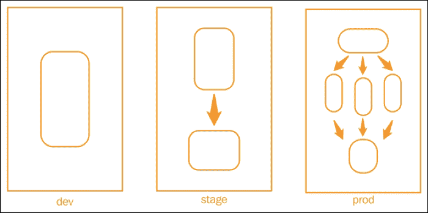
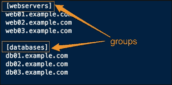
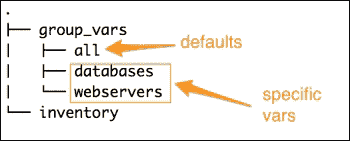
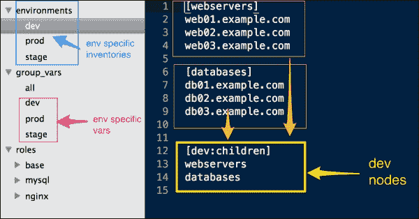
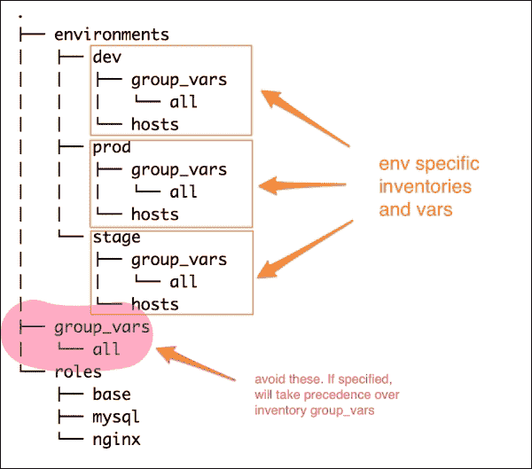
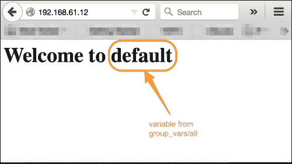
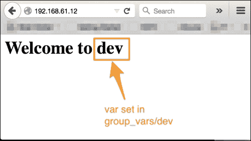

# 第九章：管理环境

大多数组织在构建基础设施时，从单一环境开始。然而，随着复杂性的增加，必须拥有一个工作流，包括编写代码并在开发环境中进行测试，然后经过严格的 QA 周期，确保代码在预生产（即 staging）环境中经过稳定性测试，最后才发布到生产环境。为了模拟现实世界的行为，这些环境必须运行相同的应用堆栈，但很可能是不同的规模。例如，staging 环境将是生产环境的小规模复制，具有较少的服务器，而开发环境通常运行在虚拟化的个人工作站上。即使所有这些环境都运行相同的应用堆栈，它们必须相互隔离，并且必须具有特定环境的配置，具体如下：

+   `dev`组中的应用不应指向 staging 中的数据库，反之亦然

+   生产环境可能有自己的包存储库

+   预生产环境可能在端口`8080`上运行 Web 服务器，而其他所有环境则在端口`80`上运行

通过角色，我们可以创建一个模块化的代码，以便为所有环境配置相同的环境。Ansible 的另一个重要特性是它能够将代码与数据分离。通过这两者的结合，我们可以以一种方式建模基础设施，使得我们能够在不修改角色的情况下创建特定环境的配置。我们只需要通过提供来自不同位置的变量就能创建它们。让我们来看一下下面的截图：



上面的图表展示了同一组织中的三种不同环境：开发（dev）、预生产（stage）和生产（production）。这三者都运行相同的应用堆栈，包括负载均衡器、Web 服务器和数据库服务器。然而，需要注意的两点是：

+   每个环境的规模不同，基于此，主机可以配置为运行一个或多个角色（例如，`db` 和 `www`）。

+   每个环境都彼此隔离。生产环境中的 Web 服务器不会连接到 staging 中的数据库，反之亦然。

本章我们将涵盖以下主题：

+   使用 Ansible 管理多个环境

+   按环境分隔库存文件

+   使用`group_vars`和`host_vars`组来指定特定环境的配置

# 管理环境的方法

你已经了解到，需要创建具有相同角色但数据不同的不同环境。在写这篇文章时，已经存在多种方法来管理 Ansible 中的多环境场景。我们将在这里讨论两种方法，你可以根据自己的判断选择其中一种，或者创建自己的方法。没有明确的方式来创建环境，但以下是 Ansible 的内置功能，可能会派上用场：

+   使用库存将属于同一环境的主机分组，并将它们与其他环境中的主机隔离开

+   使用库存变量，例如`group_vars`和`host_vars`组，来提供特定于环境的变量

在我们继续之前，回顾适用于库存组、变量和优先级规则会很有帮助。

## 库存组和变量

你已经了解到，Ansible 的库存遵循 INI 样式的配置，其中主机通过带有方括号的组标签分组，如下图所示：



然后可以指定库存变量，使其与这些组名匹配，使用`group_vars`或在`host_vars`文件中匹配特定主机。除了这些组名外，还可以使用名为"`all`"的文件为`group_vars`和`host_vars`文件指定默认变量，从而形成以下结构：



在这种情况下，如果在`all`和`webserver`文件中指定相同的变量，具有更高特定性的变量将优先。也就是说，如果你在`'all'`中定义了一个变量，并在`'webserver'`组的`group_vars`下再次定义该变量，那么该变量的值将被设置为`'webserver'`中定义的值，因为它更具体。这就是我们在以下方法中利用的行为：

## 方法 1 – 在库存中使用嵌套组

除了能够使用 INI 样式创建组，Ansible 还支持嵌套组，其中一个完整的组可以是另一个父组的一部分。第一种方法就是基于这个特性，并按以下步骤逐步讨论：

1.  创建一个环境目录来存储特定于环境的库存文件。最好按照环境命名它们。添加特定于该环境的主机并将其分组。组可以基于任何标准，例如角色、位置、服务器机架等等。例如，创建一个`'webservers'`组，将所有 Apache web 服务器添加进去，或者创建一个名为`'in'`的组，将所有属于该位置的主机添加进去。

1.  添加一个父组，名称与环境名称相同，如生产、开发、预发布等，并将所有属于该环境的其他组作为子组包含进来。每个子组依次包含一个主机组，例如：

    ```
    [dev:children]
      webservers
      databases
    ```

1.  现在，在 `group_vars/all` 文件中创建公共/默认的组变量。这些变量随后可以从特定于环境的文件中被覆盖。

1.  要指定特定于环境的变量，请创建 `group_vars/{{env}}` 文件，具体如下所示：

    ```
    group_vars
      |_ all
      |_ dev
      |_ stage
    ```

这还将覆盖 `all` 组中的变量。以下图所示，使用此方法创建的文件结构：



一旦创建完成，只需通过运行 `ansible-playbook` 命令调用特定于环境的清单。

例如，让我们看一下以下命令：

```
$ ansible-playbook -i environments/dev site.yml

```

## 方法 2 – 使用特定于环境的清单变量

第二种方法不需要嵌套组，而是依赖于 Ansible 的以下两个特性：

+   `ansible-playbook` 的 `-i` 选项也接受一个目录，目录下可以包含一个或多个清单文件。

+   `host` 和 `group` 变量除了位于 Ansible 仓库根目录的 `group_vars` 和 `host_vars` 组外，还可以相对于清单文件。

这种方法将为每个环境创建完全隔离的变量文件。我们创建的文件结构如下图所示：



以下是此方法的逐步操作：

1.  在 Ansible 仓库的根目录中创建一个环境目录。在此目录下为每个环境创建一个子目录。

1.  每个环境目录包含两样东西：

    +   主机的清单。

    +   清单变量，例如 `group_vars` 和 `host_vars`。要进行环境特定的更改，`group_vars` 与我们相关。

1.  每个环境包含自己的 `group_vars` 目录，目录下可以有一个或多个文件，其中包括默认的 `all` 文件。不同环境之间不会共享这些变量。

### 提示

**注意**：除了特定于环境的 `group_vars` 组外，您还可以使用位于 Ansible-playbook 仓库顶部的 `group_vars` 文件。然而，建议不要在这种方法中使用它，因为如果它们相同，环境特定的更改会被播放簿 `group_vars` 中的值覆盖。

使用这种方法，播放簿可以针对特定环境启动，如下所示：

```
$ ansible-playbook -i environments/dev site.py

```

这里，`environments/dev` 是一个目录。

# 创建开发环境

学习了如何管理环境后，让我们通过重构现有代码并创建一个 dev 环境来实践。为了测试它，我们创建了一个名为"`env_name`"的变量，并将 Nginx 的默认页面修改为动态使用这个变量并打印环境名称。然后我们会尝试从环境中覆盖这个变量。让我们来看看以下步骤：

1.  让我们首先设置默认变量：

    ```
    #group_vars/all
    env_name: default
    ```

1.  然后，将 Nginx 任务更改为使用模板而不是静态文件，因此在`roles/nginx/tasks/configure.yml`文件中做出如下修改：

    ```
     - name: create home page for default site
        copy: src=index.html dest=/usr/share/nginx/html/index.html
    ```

    将其修改为以下代码：

    ```
     - name: create home page for default site
       template:
         src: index.html.j2
         dest: /usr/share/nginx/html/index.html
    ```

1.  现在让我们尝试在未创建环境的情况下运行 playbook：

    ```
    $ ansible-playbook -i customhosts www.yml

    ```

1.  运行完成后，让我们检查默认的网页：

1.  它打印我们从`group_vars/all`文件中设置的变量值，即默认值。

1.  现在让我们创建一个文件，允许我们管理`dev`环境。由于我们将使用相同的主机集，我们可以将现有的清单转换为 dev 环境，并在环境名称后添加一个父组：

    ```
    $ mkdir environments/
    $ mv customhosts environments/dev 
     [ edit  environments/dev ]

    ```

1.  将所有组添加到`dev`环境中，如下所示：

    ```
    [dev:children]
    db
    www
    lb
    ```

    清单文件如下所示，我们需要做以下更改：

    1.  现在，创建一个用于`dev`环境的`group_vars`文件，并覆盖环境名称：

        ```
          #file: environments/dev
        env_name: dev
        ```

    1.  这一次，我们将以以下方式运行 playbook：

        ```
        $ ansible-playbook -i environments/dev www.yml

        ```

    我们将看到以下截图作为输出：

    

# 复习问题

你认为你已经充分理解了这一章的内容吗？尝试回答以下问题来测试你的理解：

1.  如何为同一个环境指定多个主机清单？

1.  如果你在`environments/dev/group_vars/all`文件中定义了一个变量，并在`group_vars/all`文件中也定义了同一个变量，哪个变量会优先？

1.  如何在主机清单文件中创建一个组的组？

# 总结

在本章中，你学习了如何创建与软件开发工作流或各个阶段相对应的多个环境。我们从简要介绍清单组和清单变量开始，特别是`group_vars`文件。接着介绍了管理环境的两种方法。最后，我们重构了代码，创建了`dev`环境，并通过覆盖环境中的一个变量进行了测试。在下一章中，你将学习基础设施编排，以及在编排复杂的基础设施工作流、零停机部署等方面，Ansible 如何大放异彩。
