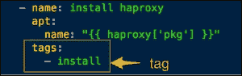

# 第十章：使用 Ansible 编排基础设施

编排在不同的场景中有不同的含义，具体取决于使用时的情境。以下是一些编排场景的描述：

+   在一组主机上并行执行临时命令，例如，使用 `for` 循环遍历一组 Web 服务器以重启 Apache 服务。这是最基本的编排形式。

+   调用编排引擎启动另一个配置管理工具，以确保正确的执行顺序。

+   按照特定顺序配置多层应用基础设施，同时能够对每个步骤进行精细控制，并且在配置多个组件时具有前后灵活调整的能力。例如，安装数据库、设置 Web 服务器、返回数据库创建模式、然后去 Web 服务器启动服务等。

大多数现实世界的场景类似于最后一种情况，涉及多层应用栈和多个环境，在这些场景中，按特定顺序并协调一致地启动和更新节点非常重要。在继续执行下一步之前，实际测试应用程序是否运行正常也很有用。首次设置应用栈与推送更新的工作流可能是不同的。有时，你可能不想一次性更新所有服务器，而是分批进行，以避免停机时间。

在本章中，我们将涵盖以下主题：

+   编排场景

+   使用 Ansible 作为基础设施编排引擎

+   实现滚动更新

+   使用标签、限制和模式

+   在 playbook 中构建测试

# Ansible 作为编排工具

在任何形式的编排中，Ansible 相较于其他工具表现得尤为突出。当然，正如 Ansible 的创始人所说，它不仅仅是一个配置管理工具，这一点是正确的。Ansible 可以在之前讨论的任何编排场景中找到自己的位置。它的设计初衷就是为了管理复杂的多层部署。即使你的基础设施已经通过其他配置管理工具进行自动化，你也可以考虑使用 Ansible 来进行编排。

让我们讨论一下 Ansible 所提供的特性，这些特性对于编排非常有用。

## 多个 playbook 和执行顺序

与大多数其他配置管理系统不同，Ansible 支持在不同的时间运行不同的 playbook 来配置或管理相同的基础设施。你可以创建一个 playbook 来首次设置应用栈，另一个 playbook 来以某种方式逐步推送更新。Playbook 的另一个特点是它可以包含多个 play，这使得能够将应用栈中的每一层的主机分组，并同时对它们进行配置。

## 前置任务和后置任务

之前我们已经使用过前任务和后任务，在编排时非常相关，因为这些允许我们在运行播放之前和之后执行任务或运行验证。让我们举一个更新已在负载平衡器注册的 Web 服务器的例子。使用前任务，可以将 Web 服务器从负载平衡器中移除，然后将角色应用于 Web 服务器以推送更新，随后使用后任务将 Web 服务器重新注册到负载平衡器。此外，如果这些服务器正在被 **Nagios** 监控，可以在更新过程中通过前任务和后任务自动禁用和重新启用警报。这可以避免监控工具可能以警报形式生成的噪音。

## 委托

如果您希望任务仅在某些类型的主机上运行，特别是当前播放之外的主机上，Ansible 的委托功能非常方便。这与前面讨论的场景相关，并且通常与前任务和后任务一起使用。例如，在更新 Web 服务器之前，需要将其从负载平衡器中注销。现在，此任务应在不属于播放范围的负载平衡器上运行。可以使用 `delegate_to` 关键字通过前任务在负载平衡器上启动脚本来解决这个问题，执行注销操作如下：

```
- name: deregister web server from lb
  shell: < script to run on lb host >
  delegate_to: lbIf there areis more than one load balancers, anan inventory group can be iterated over as, follows: 
- name: deregister web server from lb
  shell: < script to run on lb host >
  delegate_to: "{{ item }}"
  with_items: groups.lb
```

## 滚动更新

这也称为批量更新或零停机更新。假设我们有 100 台需要更新的 Web 服务器。如果我们在清单中定义它们并对其启动一个 Playbook，Ansible 将并行开始更新所有主机。这也可能导致停机时间。为了避免完全停机并进行无缝更新，可以分批更新，例如每次更新 20 台。在运行 Playbook 时，可以通过在播放中使用 `serial` 关键字来指定批量大小。让我们看以下代码片段：

```
- hosts: www
  remote_user: vagrant
  sudo: yes
  serial: 20 
```

## 测试

在编排时，不仅需要按顺序配置应用程序，还需要确保它们实际启动并按预期运行。例如，Ansible 模块如 `wait_for` 和 `uri` 可以帮助您将这些测试集成到 Playbooks 中，例如：

```
- name: wait for mysql to be up
  wait_for: host=db.example.org port=3106 state=started
- name: check if a uri returns content
  uri: url=http://{{ inventory_hostname }}/api
  register: apicheck
```

`wait_for` 模块可以额外用于测试文件的存在。当您希望在继续之前等待服务可用时，它也非常有用。

## 标签

Ansible plays 将角色映射到特定的主机。在执行 play 时，从主任务调用的整个逻辑都会被执行。在编排过程中，我们可能只需要根据我们希望将基础设施带到的阶段来运行部分任务。一个例子是 zookeeper 集群，在这个场景中，重要的是同时启动集群中的所有节点，或者在几秒钟的间隔内启动。Ansible 可以轻松地通过两阶段执行来编排此过程。在第一阶段，您可以在所有节点上安装和配置应用程序，但不启动它。第二阶段涉及几乎同时在所有节点上启动应用程序。这可以通过标记单独的任务来实现，例如配置、安装、服务等。

例如，来看一下以下截图：



在运行 playbook 时，可以使用 `--tags` 调用所有带有特定标签的任务，具体如下：

```
$ Ansible-playbook -i customhosts site.yml –-tags install

```

标签不仅可以应用于任务，还可以应用于角色，具体如下：

```
{ role: nginx, when: Ansible_os_family == 'Debian', tags: 'www' }
```

如果某个特定任务需要始终执行，即使是使用标签过滤，也可以使用一个特殊标签 `always`。这会使任务执行，除非使用了覆盖选项，例如 `--skip-tags always`。

## 模式与限制

限制可以用于在主机的子集上运行任务，这些主机通过模式进行过滤。例如，以下代码将仅在属于`db`组的主机上运行任务：

```
$ Ansible-playbook -i customhosts site.yml --limit db

```

模式通常包含一组需要包含或排除的主机。可以通过以下方式指定多个模式的组合：

```
$ Ansible-playbook -i customhosts site.yml --limit db,lb

```

使用冒号作为分隔符可以进一步过滤主机。以下命令将在除属于`www`和`db`组的主机外，所有主机上运行任务：

```
$ Ansible-playbook -i customhosts site.yml --limit 'all:!www:!db'

```

请注意，通常需要将其括在引号中。在此模式中，我们使用了 `all` 组，它匹配清单中的所有主机，并可以替换为 `*`。接着使用了 `!` 来排除 `db` 组中的主机。该命令的输出如下，显示由于我们先前使用的过滤器，没有主机匹配，导致名为 `db` 和 `www` 的 play 被跳过：


现在让我们看看这些编排功能的实际应用。我们将从标记角色开始，进行多阶段执行，然后编写一个新的 playbook 来管理 WordPress 应用程序的更新。

# 标记角色

现在，我们开始为之前创建的角色打标签。我们将创建以下标签，这些标签映射到应用程序管理的各个阶段：

+   安装

+   配置

+   开始

下面是为 `haproxy` 角色添加标签的示例。为了避免冗余，文本中排除了标记其他角色的部分。我们可以将标签添加到角色中的任务，也可以在 playbook 中标记整个角色。让我们先从标记任务开始：

```
---
# filename: roles/haproxy/tasks/install.yml
  - name: install haproxy
    apt:
      name: "{{ haproxy['pkg'] }}"
    tags:
     - install

---
# filename: roles/haproxy/tasks/configure.yml
 - name: create haproxy config
    template: src="img/haproxy.cfg.j2" dest="{{ haproxy['config']['cnfpath'] }}" mode=0644
   notify:
    - restart haproxy service
   tags:
    - configure

 - name: enable haproxy
    template: src="img/haproxy.default.j2" dest=/and more/default/haproxy mode=0644
    notify:
    - restart haproxy service
    tags:
    - configure

---
# filename: roles/haproxy/tasks/service.yml
 - name: start haproxy server
    service:
      name: "{{ haproxy['service'] }}" 
      state: started
    tags:
    - start
```

在角色中标记任务后，我们还将在 playbook 中标记角色，具体如下：

```
# filename: db.yml
  roles:
- { role: mysql, tags: 'mysql' }

#filename: www.yml
  roles:
     - { role: nginx, when: Ansible_os_family == 'Debian', tags: [ 'www', 'nginx' ] }
     - { role: php5-fpm, tags: [ 'www', 'php5-fpm' ] }
     - { role: wordpress, tags: [ 'www', 'wordpress' ] }

#filename: lb.yml
  roles:
- { role: haproxy, when: Ansible_os_family == 'Debian', tags: 'haproxy' }
```

一旦应用，主 playbook 的标签可以按以下方式列出：

```
$ Ansible-playbook -i customhosts site.yml --list-tags

#Output:
playbook: site.yml

 play #1 (db): TAGS: []
 TASK TAGS: [configure, install, mysql, start]

 play #2 (www): TAGS: []
 TASK TAGS: [configure, install, nginx, php5-fpm, ssl, start, wordpress, www]

 play #3 (lb): TAGS: []
 TASK TAGS: [configure, haproxy, install, start]

```

使用标签和限制的组合可以让我们对在 playbook 运行时执行的内容进行细粒度控制，例如：

```
# Run install tasks for haproxy, 
$ Ansible-playbook -i customhosts site.yml --tags=install --limit lb

# Install and configure all but web servers
$ Ansible-playbook -i customhosts site.yml --tags=install,configure --limit 'all:!www'

# Run all tasks with tag nginx
$ Ansible-playbook -i customhosts site.yml --tags=nginx

```

# 为 WordPress 创建一个协调 playbook

我们有一个全站的 playbook，也就是 `site.yml` 文件，它用于安装和配置完整的 WordPress 堆栈。对于零停机更新应用程序和部署新版本，`site.yml` 文件并不是理想的 playbook。我们希望遵循一个包含以下步骤的工作流：

1.  一次更新一个 Web 服务器，这样可以避免任何停机。

1.  在更新之前，将 Web 服务器从 haproxy 负载均衡器中注销。这样可以停止对 Web 服务器的流量，避免停机。

1.  运行与 WordPress 应用程序相关的角色，也就是 Nginx、php5-fpm 和 WordPress。

1.  确保 Web 服务器正在运行并监听 80 端口。

1.  将服务器重新注册到 haproxy，并再次开始发送流量。

让我们创建一个名为`update.yml`的 playbook，它按照前面解释的方式进行协调，并使用本章之前讨论的大部分功能。以下是 playbook：

```
 ---
# Playbook for updating web server in batches
# filename: update_www.yml
- hosts: www
  remote_user: vagrant
  sudo: yes
  serial: 1
  pre_tasks:
    - name: deregister web server from  load balancer
    shell: echo "disable server fifanews/{{ Ansible_hostname }}" | socat stdio /var/lib/haproxystats
    delegate_to: "{{ item }}"
    with_items: groups.lb
  roles:
    - { role: nginx, when: Ansible_os_family == 'Debian' }
    - php5-fpm
    - wordpress
  post_tasks:
    - name: wait for web server to come up 
    wait_for: host={{ inventory_hostname }} port=80 state=started
    - name: register webserver from  load balancer
    shell: echo "enable server fifanews/{{ Ansible_hostname }}" | socat stdio /var/lib/haproxystats
    delegate_to: "{{ item }}"
    with_items: groups.lb
```

让我们分析一下这段代码：

+   该 playbook 只包含一个 play，它运行在属于 `www` 组的主机上。

+   `serial` 关键字指定批处理大小，并允许进行零停机的滚动更新。在我们的案例中，由于我们有较少的主机，我们选择一次更新一个 Web 服务器。

+   在应用角色之前，主机通过 pre-tasks 部分从负载均衡器中注销，该部分运行一个带有**socat**的 shell 命令。这个命令将在所有负载均衡器上使用 `delegate` 关键字运行。Socat 是一个类似于 `nc`（netcat）的 Unix 工具，但功能更强大。

+   在注销主机后，会应用角色；这将更新 Web 服务器的配置或部署新代码。

+   更新后，后任务将启动，首先等待直到 Web 服务器启动并监听 80 端口，只有在其准备好后，才会将其注册回负载均衡器。

# 复习问题

你认为自己已经充分理解了这一章吗？尝试回答以下问题来测试你的理解：

1.  是否可以使用 Ansible 来协调其他配置管理工具？

1.  如何在使用 Ansible 部署应用程序时实现零停机？

1.  `--limit` 命令对 Ansible playbook 有什么作用？

1.  如何在 playbook 中为给定角色运行任务的子集？

1.  使用前任务和后任务的目的是什么？

1.  可以使用哪些模块从 playbook 中运行测试？

1.  为什么 `always` 标签很特殊？

# 总结

我们从讨论编排的概念开始本章，介绍了不同的编排场景以及 Ansible 的应用。您了解了 Ansible 在编排背景下的丰富功能集，包括多 playbook 支持、前任务和后任务、标签和限制、运行测试等等。我们进一步给之前创建的角色打上标签，并学习了如何使用标签、模式和限制来控制代码在哪些机器上运行的方法。最后，我们创建了一个新的 playbook 来编排工作流程，以更新 Web 服务器，其中涉及零停机部署、委派、前任务和后任务以及测试。您也了解到 Ansible 可以很好地适用于任何编排场景中。

这本书到此结束。在结束之前，我代表审阅者、编辑、贡献者以及整个出版团队，感谢您将本书作为在成为 Ansible 实践者之路上的伴侣。

我们希望您现在已经对 Ansible 提供的各种基本操作有了充分的了解，包括自动化常见基础设施任务、创建动态角色、管理多层应用配置、零停机部署、编排复杂基础设施等等。希望您能够将本书中获得的知识应用到创建有效的 Ansible playbook 中。
