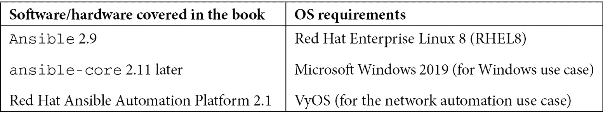

# 前言

自动化是 IT 现代化的关键，使用正确的自动化工具是组织自动化旅程中的关键一步。Ansible 是一款开源自动化软件，您可以使用它来自动化大多数 IT 和应用基础设施组件的操作，包括服务器、存储、网络和应用平台。Ansible 是目前 IT 领域最知名的开源自动化工具之一，并且拥有强大的社区支持，全球有超过 5000 名活跃贡献者。

Ansible 不是一种*通过阅读学习*的技术。本书将通过实际的 playbook、配置和实践示例，帮助你理解并实践 Ansible 的自动化功能。它将帮助你理解 Ansible 自动化的基础，并且随着学习的深入，你将逐步学会如何使用 Ansible 自动化日常任务。

你将学习到实际的 IT 自动化用例和实践示例，如简单的系统报告、安全扫描和每周重启 Linux 机器。之后，书中将教你如何在 Ansible 自动化中实现协作，以及如何自动化其他设备和平台，如 Microsoft Windows、网络设备、VMware、AWS 和 GCP。你还将学习如何在 DevOps 工作流程中使用 Ansible，结合 Jenkins 进行集成，以及在 Kubernetes 上管理容器和应用程序。为了进一步扩展你在企业自动化方面的知识，本书还将教你 Red Hat Ansible 自动化平台、机密管理以及 Ansible 与其他工具（如 Jira 和 ServiceNow）的集成。本书中还有章节讲解如何使用原始命令和 API 调用通过 Ansible 自动化不被支持的设备和平台。在书籍结束之前，你还将探索如何为生产环境存储被管理节点信息、变量、凭证和 playbook 的 Ansible 最佳实践。

完成*Ansible 实践自动化*后，你将具备在工作环境中发现自动化用例、设计和部署自动化解决方案的技能。

# 本书适合的人群

本书面向希望使用 Ansible 作为自动化工具的系统工程师和 DevOps 工程师。书中提供了参考资料和实际示例，帮助你在工作环境中启动 IT 自动化。

# 本书内容

*第一章*，*Ansible 自动化—简介*，为你介绍了 Ansible，并教你如何安装和配置 Ansible 以及配置被管理的节点。

*第二章*，*从简单的自动化开始*，教你如何识别可以自动化的手动任务，找到合适的 Ansible 模块，并使用文本编辑器进行 Ansible 配置。

*第三章*，*自动化你的日常工作*，是你开始为实际用例开发 Ansible playbook 的章节，涉及系统信息收集、系统重启和安全扫描等内容。你还将学习 Ansible 集合、Ansible 中的机密管理以及自动化通知。

*第四章*，*探索自动化开发中的协作*，讲解了版本控制在 IT 自动化中的重要性，并介绍了使用源代码管理工具存储 Ansible 工件的最佳实践。

*第五章*，*扩展你的自动化视野*，介绍了如何从工作场所中发现自动化的应用场景，并检查自动化的可行性。本章还教你如何在 Ansible 中使用动态清单。

*第六章*，*自动化 Microsoft Windows 和网络设备*，是你发现使用 Ansible 自动化 Microsoft Windows 和网络设备的可能性。本章将涵盖 Windows 自动化、VyOS 信息收集以及在 Cisco ASA 设备上创建访问控制列表等实际示例。

*第七章*，*管理你的虚拟化和云平台*，讲解了**基础设施即代码**（**IaC**）的概念，并介绍了如何将 Ansible 用作 IaC 工具，提供了管理 VMware、AWS 和 GCP 平台的实际示例。

*第八章*，*帮助数据库团队实现自动化*，介绍了数据库操作的基础知识，例如安装数据库服务器、创建数据库、表格和数据库用户。

*第九章*，*在 DevOps 流程中实现自动化*，是你将学习 DevOps 及其在 DevOps 流程中使用 Ansible 的章节，提供了减少部署时间、管理应用负载均衡器和滚动更新的实际示例。本章还讲解了如何将 Ansible 与 Terraform 集成。

*第十章*，*使用 Ansible 管理容器*，继续探讨 Ansible 和 DevOps，介绍了如何使用 Ansible 管理应用容器。本章涉及的实际应用包括部署容器主机、在 CI/CD 流水线中使用 Ansible、构建容器以及管理多容器应用。

*第十一章*，*使用 Ansible 管理 Kubernetes*，深入探讨基于容器的应用场景，介绍了 Kubernetes，并讲解了如何使用 Ansible 管理 Kubernetes 集群和应用程序。本章教你如何在 Kubernetes 平台上部署、管理和扩展容器化应用。

*第十二章*，*将 Ansible 与您的工具集成*，介绍了企业自动化工具 Red Hat **Ansible Automation Platform**（**AAP**）。本章教您如何使用 AAP 进行自动化，并通过实际案例，如数据库管理、Jenkins 集成和 Slack 通知，来讲解这些方法。

*第十三章*，*使用 Ansible 进行密钥管理*，解释了使用 Ansible Vault 处理自动化中的敏感数据的方法，以及如何在 Ansible playbook 中使用加密数据。

*第十四章*，*保持自动化简单高效*，教您关于 Ansible 自动化控制器中的调查表单和工作流作业模板的内容。本章还涵盖了安全自动化及将 Ansible 集成到监控工具中的方法。

*第十五章*，*自动化非标准平台和操作*，教您如何使用原始命令和 API 命令自动化处理不受支持的平台。本章还教您如何开发自定义 Ansible 模块，以便在没有现成模块时使用。

*第十六章*，*Ansible 在生产环境中的最佳实践*，是您学习 Ansible 生产环境最佳实践的章节，内容包括如何组织 Ansible 制品、库存和变量。本章还涵盖了凭证管理和 playbook 开发的最佳实践。

# 为了充分利用本书

在本书中，我将首先指导您完成 Ansible 自动化工具的安装和部署，之后，我将解释一些实际的 IT 使用案例和如何使用 Ansible 自动化这些操作的方法。由于本书的重点是不同的自动化使用案例，部分章节可能会有额外的技术要求，如对某项特定技术的基础知识或对实验环境（如 Kubernetes 集群）的访问。对于这一点，如果您想进行实践，我还介绍了如何安排开发环境的方法。请始终参考 Ansible 文档 [`docs.ansible.com`](https://docs.ansible.com) 和章节中提供的其他链接以进一步学习。



对于测试和开发，您可以获得免费的 RHEL 订阅（[`developers.redhat.com/articles/faqs-no-cost-red-hat-enterprise-linux`](https://developers.redhat.com/articles/faqs-no-cost-red-hat-enterprise-linux)）。也可以将 RHEL8 替换为其他操作系统，如 Fedora、CentOS 或 Ubuntu，但可能需要调整 playbook 中的某些命令和模块。

**如果你正在阅读本书的电子版或数字版，建议自己输入命令并编写 playbook，而不是从书中复制粘贴。然而，你可以访问本书的 GitHub 仓库（下一节会提供链接）来查看代码、代码片段和 playbooks，供参考。**

# 下载示例代码文件

你可以从 GitHub 上下载本书的示例代码文件，链接为 [`github.com/PacktPublishing/Ansible-for-Real-life-Automation`](https://github.com/PacktPublishing/Ansible-for-Real-life-Automation)。如果代码有更新，GitHub 仓库中的代码会进行更新。你可以指出代码示例中的问题或提交与本书相关的任何问题，通过在 GitHub 仓库中创建问题票据来联系。

我们还提供了其他代码包，来自我们丰富的书籍和视频目录，网址是 [`github.com/PacktPublishing/`](https://github.com/PacktPublishing/)。欢迎查看！

# 下载彩色图片

我们还提供了包含书中截图/图表彩色图片的 PDF 文件。你可以在这里下载：[`packt.link/TVh0m`](https://packt.link/TVh0m)。

# 使用的规范

本书中使用了若干文本规范。

`文本中的代码`：表示文本中的代码词汇、数据库表名、文件夹名、文件名、文件扩展名、路径名、虚拟 URL、用户输入和 Twitter 账户名。示例：“配置 `KUBECONFIG` 环境变量，因为我们的 `kubeconfig` 文件名与默认文件名不同（`/home/ansible/.kube/minikube-config` 与 `/home/ansible/.kube/config`）。”

代码块如下所示：

```
[ansible@ansible Chapter-11]$ export KUBECONFIG=$KUBECONFIG:/home/ansible/.kube/minikube-config
```

一些代码片段和输出以图片形式展示，以便更好地阅读和简洁表达。

**粗体**：表示新术语、重要单词或你在屏幕上看到的词汇。例如，菜单或对话框中的词汇会以这种方式出现在文本中。示例：“更新你的作业模板，并通过进入 **Job Template** | **Edit**，然后点击 **Credential** 旁边的 *Search* 按钮，添加新的 vault 凭证。”

提示或重要说明

显示方式如下。

# 联系我们

我们欢迎读者的反馈。

**一般反馈**：如果你对本书的任何部分有疑问，请在邮件主题中提及书名，并通过 customercare@packtpub.com 向我们发送邮件。

**勘误**：虽然我们已经尽最大努力确保内容的准确性，但错误还是有可能发生。如果你在本书中发现了错误，感谢你向我们报告。请访问 [www.packtpub.com/support/errata](http://www.packtpub.com/support/errata)，选择你的书籍，点击勘误提交表格链接，并填写详细信息。

**盗版**：如果您在互联网上遇到任何非法复制的作品，我们将非常感激您提供材料的地址或网站名称。请通过 copyright@packt.com 联系我们，并附上相关链接。

**如果您有兴趣成为作者**：如果您在某个领域具有专业知识，并且有兴趣撰写或参与书籍创作，请访问 [authors.packtpub.com](http://authors.packtpub.com)。

# 分享您的想法

阅读完 *Ansible 实践自动化* 后，我们很期待听到您的想法！请 [点击这里直接进入亚马逊书评页面](https://packt.link/r/1803235411) 并分享您的反馈。

您的反馈对我们和技术社区非常重要，将帮助我们确保提供高质量的内容。

# 第一部分：将 Ansible 作为您的自动化工具

在这一部分中，您将清晰地了解如何开始使用 Ansible 自动化，并自动化您的基本日常工作。

本书的这一部分包含以下章节：

+   *第一章**，Ansible 自动化——简介*

+   *第二章**，从简单的自动化开始*

+   *第三章**，自动化您的日常工作*

+   *第四章**，探索自动化开发中的协作*
