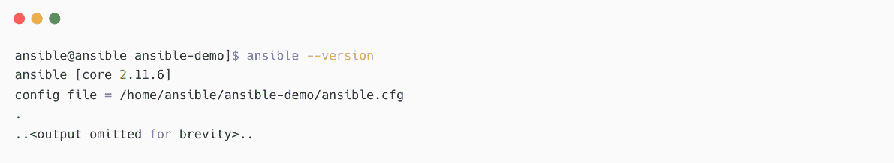

# 1

# Ansible 自动化 – 介绍

Ansible 是一个开源的自动化和编排软件，可用于自动化大多数 IT 基础设施组件的操作，包括服务器、存储、网络和应用平台。Ansible 是目前 IT 世界中最受欢迎的自动化工具之一，并且有强大的社区支持，全球有超过 5,000 名贡献者。

本章节我们将涵盖以下主题：

+   什么是 Ansible？我应该在哪里使用这个自动化工具？

+   部署 Ansible

+   配置你的管理节点

截至目前，Ansible 仅在 Linux/Unix 平台上可用，但这并不意味着你不能使用 Ansible 来自动化其他**操作系统**（**OSs**）或设备。实际上，使用 Ansible 可以自动化几乎所有与 IT 基础设施相关的组件，因为有成千上万个支持的模块可以支持 Ansible 自动化。

# 技术要求

以下是继续本章节所需的技术要求：

+   对 Linux 操作系统有基本了解，并能够处理 Linux 中的基本操作

+   一台或多台 Linux 机器

本章节中使用的代码和代码片段在**Red Hat Enterprise Linux 8**（**RHEL8**）上进行了测试。本章节的所有 Ansible 代码、Ansible playbooks、命令和代码片段可以在 GitHub 仓库中找到，网址为：[`github.com/PacktPublishing/Ansible-for-Real-life-Automation/tree/main/Chapter-01`](https://github.com/PacktPublishing/Ansible-for-Real-life-Automation/tree/main/Chapter-01)。

# 你好，工程师们！

系统工程师的主要职责是构建和管理用于托管应用程序及其数据的 IT 基础设施。过去，使用的应用程序数量较少，因此基础设施的规模也较小。随着应用程序和组件的增长，IT 基础设施也在不断扩展，系统工程师和系统管理员开始遇到资源瓶颈。换句话说，系统工程师花更多时间在构建、维护和支持基础设施上，而不是花时间改进和优化基础设施设计。

对于支持团队来说，90%的事件工单都是简单的修复，包括磁盘空间满、用户账户被锁定、卷未挂载等等。但支持工程师仍然需要手动登录每一台服务器，逐一解决这些问题。

任务可能包括修复服务器上的磁盘空间不足问题、安装某些软件包、修补操作系统、创建虚拟机或重置用户密码；工程师在多个系统上重复执行相同的工作，这促使了自动化操作的发明。最初，自动化的解决方案是由个别工程师开发和维护的自定义脚本，但由于缺乏协作、维护或责任机制，这些自定义自动化脚本并没有成为企业的真正解决方案。如果开发人员离开公司，脚本就会变成孤儿，接下来的工程师将创建自己的自定义脚本。

随着 DevOps 方法论和实践的引入，开发人员、系统工程师、运维团队和其他平台团队开始协作，彼此之间的界限变得越来越模糊，形成了一个更具责任感的生态系统。每个人开始构建和维护应用程序及其底层 IT 基础设施，这反过来使得自动化的使用场景变得更加复杂和庞大。

# 什么是 Ansible？我应该在哪里使用这个工具？

Ansible 是一个开源自动化工具，由 Michael DeHaan 于 2012 年 2 月 20 日编写并发布。2013 年，**Ansible, Inc.**（最初名为**AnsibleWorks, Inc.**）由 Michael DeHaan、Timothy Gerla 和 Saïd Ziouani 创立，他们的目标是为 Ansible 提供商业支持和赞助。2015 年，Ansible 被 Red Hat 收购，Red Hat 按照开源社区的期望，支持并推广 Ansible。

截至目前，Ansible 控制节点仅适用于基于 Linux/Unix 的平台（如 Red Hat Enterprise Linux、CentOS、Fedora、Debian 或 Ubuntu 等大多数通用操作系统），无法在 Windows 上原生安装（可以使用 Windows 子系统 for Linux 或虚拟机来实现）。这并不意味着你不能使用 Ansible 来自动化 Windows 操作。你可以在 Linux 上使用 Ansible 控制节点，管理 Windows 机器以及其他设备和平台，如网络设备、防火墙设备、云平台和容器平台。截至目前，有超过 3200 个 Ansible 模块可供使用，对于 Windows 操作系统，单独有超过 100 个 Ansible 模块来自动化 Windows 操作。

Ansible 支持的 Windows 操作系统

Ansible 可以管理包括 Windows 7、8.1 和 10 在内的桌面操作系统，以及包括 Windows Server 2008、2008 R2、2012、2012 R2、2016 和 2019 在内的服务器操作系统。有关更多详细信息，请参考 [`docs.ansible.com/ansible/latest/user_guide/windows_setup.xhtml#host-requirements`](https://docs.ansible.com/ansible/latest/user_guide/windows_setup.xhtml#host-requirements)。

Ansible 的社区版本像其他开源软件一样可以免费使用，但红帽也提供基于 Ansible 的产品——红帽 **Ansible 自动化平台**，该平台需要付费订阅。你可以使用社区版 Ansible 或带有订阅的红帽支持版本。Ansible 自动化平台面向企业使用，提供如 **基于角色的访问控制**（**RBAC**）、**图形用户界面**（**GUI**）、**应用程序编程接口**（**API**）、冗余和可扩展性等功能。当你需要为更大的团队、多个工程师共同工作时，考虑这些选项，尤其是在你需要审计、追踪和其他集成时。详细了解 Ansible 自动化平台，请访问 [`www.ansible.com/products/automation-platform`](https://www.ansible.com/products/automation-platform)。

红帽 Ansible 自动化平台

红帽的企业自动化产品在 2019 年 9 月之前被称为 **Ansible Tower**，直到宣布推出红帽 Ansible 自动化平台（[`www.ansible.com/blog/introducing-red-hat-ansible-automation-platform`](https://www.ansible.com/blog/introducing-red-hat-ansible-automation-platform)）。Ansible 自动化平台中的组件被重新命名为更有意义的名称，如自动化控制器和执行环境。详细了解 Ansible 自动化平台，请访问 [`www.redhat.com/en/technologies/management/ansible`](https://www.redhat.com/en/technologies/management/ansible)。

Ansible 文档可在 [`docs.ansible.com`](https://docs.ansible.com) 获取。

## 前提条件

我们将在一个名为 **Ansible 剧本** 的 YAML 文件中编写自动化步骤。Ansible 将解析剧本文件并在目标机器上执行任务：

+   你应该了解 Linux 基础知识；正如我之前提到的，目前只能在 Linux 或 Unix 机器上安装 Ansible。这并不意味着你需要成为 Linux 专家，但你需要能够处理 Linux 中的基本操作，如文件管理和文件编辑。

+   你需要理解 YAML 语法，这很简单，因为 YAML 是最容易阅读的文件格式之一。

Ansible 基于 Python 编程语言，但你无需学习 Python 或任何编程语言即可开发 Ansible 自动化剧本。

什么是 YAML？

**YAML 不是标记语言**（**YAML**）是一种人类可读的语言格式，广泛应用于现代工具和软件中，包括 Ansible、Kubernetes 和 OpenShift。例如，YAML 常用作应用程序数据和配置的文件格式。

## Ansible 控制节点要求

Ansible 控制节点机器没有特定的硬件要求。可以使用具有 512 MB 内存和一个**虚拟中央处理单元**（**vCPU**）的机器。遵循一些标准的**虚拟机**（**VM**）规范，例如 4 GB 或更高，因为在管理更多节点和并行运行更多任务时，可能需要更多的内存。至于磁盘，你可以遵循标准的虚拟机规范，因为 Ansible 是一个小型程序，不需要太多的磁盘空间。使用任何安装了 Python 3.8 或更新版本的 Linux/Unix 机器。

Ansible 控制节点要求

在 https://docs.ansible.com/ansible/latest/installation_guide/intro_installation.xhtml#control-node-requirements 查找 Ansible 控制节点要求。

## Ansible 管理节点要求

目标节点（管理节点）应该安装 Python 2.6 或更高版本（推荐使用 3.x），以便执行任务。对于 Windows 机器，需要安装 PowerShell 和.NET。

Ansible 还支持以下内容：

+   网络设备

+   VMware

+   公有云如 AWS、Azure 和 GCP

+   安全设备

Python 2.x 结束生命周期

在具有 Python 2.x 的机器上安装 Ansible，但 Python 2.x 已经在 2020 年 1 月 1 日**结束生命周期**（**EOL**），最好使用最新版本的 Python。有关 Python 2 结束生命周期的更多细节，请访问[`www.python.org/doc/sunset-python-2/`](https://www.python.org/doc/sunset-python-2/)。

## Ansible 是无代理的

Ansible 自动化涉及两种类型的机器。安装 Ansible 程序的机器被称为**Ansible 控制节点**。控制节点可以是任何机器，一台专用服务器，甚至是你的工作站，它会存放你的 Ansible 剧本和其他配置。然后，你想要自动化的机器或设备被称为**受管主机**。你将从控制节点运行 Ansible 任务和剧本，这些任务将在目标节点或受管节点上执行。

下图展示了 Ansible 的基本组件：


图 1.1 – Ansible 及其组件

Ansible 是无代理的，你不需要在管理节点上安装任何类型的代理。Ansible 使用默认的连接方式与管理节点进行通信，例如`ssh`、`WinRM`、`http`或其他适当的协议。在上手过程中，你需要配置管理节点的凭证，例如使用 SSH 密钥的 SSH 凭证，或用于 WinRM 连接的 SSL 证书。这是一次性设置，之后可以随时配置或更改。你可以为不同的管理节点使用相同或不同的凭证，并为单个节点或一组管理节点配置凭证。在本章的后续章节中，你将了解受管节点和清单。

## Ansible 架构

下图展示了 Ansible 内部结构及其组件的结构：


图 1.2 – Ansible 和组件

## Ansible 库存

Ansible 库存是一个文件或脚本，提供有关受管节点的详细信息，包括主机名、连接方式、使用的凭证以及其他许多细节。可以通过静态库存文件、动态库存脚本或使用**配置管理数据库**（**CMDB**）将库存传递给 Ansible。CMDB 就是提供受管节点信息的 CMDB。最佳实践是在环境中将 CMDB 与 Ansible 集成，以避免频繁更新静态库存文件，但这不是强制性的组件。

可以在库存文件中添加任意数量的受管节点，如下所示：


图 1.3 – 带有受管节点的 Ansible 库存

最佳实践是根据关键性、服务器类型和环境将受管节点信息分隔到多个库存文件中。你将在*第十六章*中学习更多关于库存最佳实践的内容，*存储远程主机信息 – 库存最佳实践*。

动态库存插件将从你的虚拟化平台（如 VMware、OpenStack、AWS、Azure 和 GCP）或其他容器平台（如 Kubernetes）收集受管节点的详细信息。在 Ansible GitHub 仓库中，提供了超过 40 个动态库存插件供使用。如果需要，可以使用它们，或者如果这些插件不适合你的需求，可以创建自己的动态库存脚本。

Ansible 动态库存

要了解有关 Ansible 动态库存的更多信息，请访问[`docs.ansible.com/ansible/latest/user_guide/intro_dynamic_inventory.xhtml`](https://docs.ansible.com/ansible/latest/user_guide/intro_dynamic_inventory.xhtml) 和 [`github.com/ansible/ansible/tree/stable-2.9/contrib/inventory`](https://github.com/ansible/ansible/tree/stable-2.9/contrib/inventory)。

## Ansible 插件

Ansible 插件是帮助启用灵活且可扩展架构的小段代码。你有 Ansible 可执行文件，并根据需要添加插件以支持其他功能和能力，像其他软件一样。Ansible 中有不同类型的插件，如 `ssh`，并且可以使用名为 `docker` 或 `buildah` 的连接插件来连接容器。如果需要，安装并使用这些插件。

Ansible 插件

阅读更多关于 Ansible 插件的信息，请访问[`docs.ansible.com/ansible/latest/plugins/plugins.xhtml`](https://docs.ansible.com/ansible/latest/plugins/plugins.xhtml)。

## Ansible 模块

Ansible 模块是一个可重用的独立脚本，可以用于实现某些特定任务。模块提供了一个定义好的接口，选项接受参数并以 JSON 格式将信息返回给 Ansible。当你使用模块执行任务时，模块脚本会在目标机器上使用 Python 执行，或者在 Windows 机器上使用 PowerShell 执行。

例如，以下 Ansible 内容使用了一个 `ping` 模块来验证与目标机器的连通性，另一个任务使用 `yum` 模块来通过 `yum` 包管理器在受管节点上安装 `httpd package`：


图 1.4 – Ansible ping 模块和 yum 模块

我之前提到过，我们可以使用 Ansible 来自动化网络设备和防火墙设备，但我们都知道，不能在这些设备上安装 Python 或 PowerShell。与大多数 Ansible 模块不同，网络模块并不直接在网络设备上运行。相反，这些模块会从 Ansible 控制节点本身执行，并在目标网络设备上运行适当的命令以完成任务。从用户的角度来看，网络模块的执行方式与其他模块没有区别，你仍然像使用其他模块一样使用它们。你可以像管理其他 Linux 机器和 Windows 机器一样管理网络设备，只是使用不同的连接方式，例如`network_cli`、`netconf`和`httpapi`。

阅读：网络自动化有何不同

访问[`docs.ansible.com/ansible/latest/network/getting_started/network_differences.xhtml`](https://docs.ansible.com/ansible/latest/network/getting_started/network_differences.xhtml)了解更多关于网络设备自动化的信息。

## Ansible 内容集合

在 2.10 版本之前，Ansible 是一个包含所有模块和库的大包，但社区发展非常迅速，成千上万的新模块被贡献到 Ansible 中。每当社区或供应商提供新的模块或模块的新版本时，用户需要等待下一个 Ansible 版本的发布才能获取更新的模块。为了解决这个依赖问题，出现了一种新的分发方式，将 Ansible 模块从 Ansible 基础中分离出来，作为 **Ansible 内容集合**，或简而言之，**Ansible 集合**来分发。你可以选择单独安装 Ansible，或者安装包含 Ansible 集合的 Ansible 包。如果你需要管理一些不同的节点或系统（例如，管理 VMware 私有云或自动化 Fortigate 防火墙设备），那么安装所需的 Ansible 集合并使用它。这种模块化使你可以只安装所需的模块和插件，而不是安装所有可用的模块。

下图展示了 Ansible 集合从旧版 Ansible 的过渡：


图 1.5 – 从 Ansible 到 Ansible 核心和 Ansible 集合的转换

另外，请注意一些 Ansible 基础和 Ansible 集合重构中的变化：

+   在版本 2.9.x 之前：该包包含了 `ansible` 以及所有的 Ansible 模块和其他插件。

+   从版本 2.10++ 开始：Ansible 被重命名为 `ansible-base`，并且模块被移到了 Ansible 集合（供应商和社区）。

+   从版本 2.11++ 开始：`ansible-base` 被重命名为 `ansible-core`。

+   当你安装 Ansible 3.x 或 Ansible 4.x 时，你安装的是 Ansible 社区包，其中包括 `ansible-core` 和所有的 Ansible 集合（供应商和社区）。

重构 Ansible 项目

阅读博客文章 [ansible.com/blog/thoughts-on-restructuring-the-ansible-project](http://ansible.com/blog/thoughts-on-restructuring-the-ansible-project) 和 [ansible.com/blog/the-future-of-ansible-content-delivery](http://ansible.com/blog/the-future-of-ansible-content-delivery) 以了解更多关于 Ansible 集合过渡的内容。

## Ansible playbook

Ansible playbook 是一个用 YAML 格式编写的简单文件，里面包含自动化任务的指令列表。以下图解展示了 Ansible playbook 的组件、语法和结构：


图 1.6 – Ansible playbook 基本组件

在 **play** 中的每个任务都会运行一个模块，在目标节点上执行某些特定的工作。一个 play 中可以有多个任务，一个 playbook 中可以有多个 play，如图所示。play、任务和模块参数通过 YAML 格式中的缩进来区分。在此示例中，我们有一个包含两个 play 的 playbook。

在第一个 play 中，`启用内网服务`，我们针对 `node1` 运行任务 —— 请查看 `hosts: node1` 这一行。

在任务下方，查看两个任务：

+   第一个任务是使用 `yum` 模块安装 `httpd` 包。

+   第二个任务是使用 `service` 模块启动 `httpd` 服务。

然后，我们在 playbook 中有第二个 play，`测试内网 Web 服务器`，其中只有一个任务：

+   使用 `uri` 模块测试内网 Web 服务器

Ansible 将解析此 playbook 并逐一在目标节点上执行任务。

## Ansible 用例

使用 Ansible，几乎可以构建、管理或维护 IT 基础设施中的所有组件：

+   服务器和存储

+   网络设备、防火墙、**软件定义网络**（**SDNs**）和负载均衡器

+   应用程序组件

+   容器和容器平台

+   数据库应用程序

+   公有云和私有云

你需要从日常工作中找到用例，并找出你每天重复执行的任务数量最多的任务，并将这些任务视为自动化候选任务。以下是此类用例的示例列表：

+   操作系统补丁

+   应用程序和包部署

+   应用程序的编排

+   配置管理

+   基础设施供应

+   持续交付

+   安全性和合规性审计及整改

+   数据库预配和管理

在接下来的章节中，我们将学习如何安装和配置 Ansible。

# 安装 Ansible

有多种方法可以在系统上安装 Ansible，例如使用默认的包管理器（`yum`、`apt`、`dnf`），使用 Python 的 `pip`，或安装源代码本身。根据你的环境和限制，按照官方文档中提供的任何方法进行安装（[`docs.ansible.com/ansible/latest/installation_guide/intro_installation.xhtml`](https://docs.ansible.com/ansible/latest/installation_guide/intro_installation.xhtml)）。如果你使用的是操作系统包管理器，如 `dnf`、`yum` 或 `apt`，则需要 `sudo` 权限（或 `root` 访问权限）来安装 Ansible。

请注意，在 Ansible 控制节点上使用 Ansible 时，不需要 `root` 或 `sudo` 权限。在以下代码片段中，`sudo` 权限用于安装和更新包。

## 验证依赖关系

如你所知，Ansible 需要 Python 才能工作，因此你需要先检查 Python 是否已安装：


图 1.7 – 检查已安装的 Python 包和版本

如果你已经安装了受支持的 Python 版本，则按下节所述继续安装 Ansible。

## 使用包管理器安装 Ansible

根据操作系统，你需要在安装 Ansible 之前添加并启用适当的仓库。例如，如果你使用 **Red Hat Enterprise Linux** (**RHEL**)，则需要确保已设置 Red Hat 订阅，并启用仓库以安装 Ansible：


图 1.8 – 安装 Ansible 包

使用以下命令验证已安装的 Ansible 版本：


图 1.9 – 验证 Ansible 安装

从此输出中，可以看到 Ansible 的版本（*2.9.27*）、使用的默认配置文件（配置文件 = `/etc/ansible/ansible.cfg`）、模块搜索路径、正在使用的 Python 版本和其他细节。

上述 Ansible 版本来自你在操作系统中配置的默认仓库。如果你想安装最新或不同版本的 Ansible，则需要按照不同的方法进行操作。

## 使用 Python pip 安装 Ansible

如果系统中没有安装 `pip`，则需要安装 `pip`，然后使用 Python pip 安装 Ansible，如下所示：


图 1.10 – 使用 Python pip 安装 Ansible

请注意，当你执行 `pip install ansible` 时，你正在安装包含 `ansible-core` 和 Ansible 集合的 Ansible 包。我在本章前面已经解释过 Ansible 集合。

基于 Pip 的 Ansible 安装和支持

最好的做法是根据操作系统的包管理器来进行安装，这样可以自动获得适当的支持和更新。此外，基于 pip 的安装方式在软件有新版本时维护和升级较为困难。

如果你想安装特定版本的 `ansible`、`ansible-base` 或 `ansible-core`，可以按照以下方式使用版本信息：


图 1.11 – 使用 pip 安装特定版本的 Ansible

现在让我们检查一下 Ansible 的版本：


图 1.12 – 检查 Ansible 版本

查看 `DEPRECATION WARNING` 消息，并在开发环境中忽略该消息。但在生产环境中，你需要确保使用 Ansible 支持的 Python 版本。

Ansible 安装

查看 Ansible 文档，获取不同操作系统和方法的安装说明：[`docs.ansible.com/ansible/latest/installation_guide/intro_installation.xhtml`](https://docs.ansible.com/ansible/latest/installation_guide/intro_installation.xhtml)

## 部署 Ansible

在开始自动化任务之前，你需要使用 `ansible.cfg` 文件为你的环境配置 Ansible。Ansible 会按以下顺序在四个地方查找配置文件：

+   `$ANSIBLE_CONFIG`：环境变量中的配置文件路径

+   `./ansible.cfg`：当前目录中的配置文件

+   `~/.ansible.cfg`：主目录中的配置文件

+   `/etc/ansible/ansible.cfg`：默认配置文件

最佳实践是将项目特定的 `ansible.cfg` 文件保存在项目目录中：


图 1.13 – 创建 ansible.cfg 文件

在 `ansible.cfg` 文件中添加一些基本配置：


图 1.14 – ansible.cfg 文件的内容

在 `ansible.cfg` 中保留 `remote_user = devops` 不是最佳实践；最好在清单文件中为不同的主机和主机组配置该项。你将在本章的*创建 Ansible 清单*部分了解这一点。

现在再次检查 Ansible 版本，查看差异，并确认 Ansible 正在使用 `/home/ansible/ansible-demo/ansible.cfg` 作为配置文件：



图 1.15 – 检查 Ansible 使用的是哪个 ansible.cfg 文件

在 `ansible.cfg` 中，你有许多其他参数可以配置，但并非所有参数都是必需的。如果在自定义的 `ansible.cfg` 文件中没有指定某些参数，Ansible 会根据需要加载默认配置。

查看另一个示例`ansible.cfg`文件，它包含一些重要的参数，这些参数决定了 Ansible 中的权限提升。这些参数决定了目标节点上的`sudo`或`su`操作：


图 1.16 – 另一个包含权限提升参数的 ansible.cfg 示例

在前面的示例中，发生了以下情况：

+   Ansible 将以`devops`用户身份登录远程节点，且无需输入密码（`ask_pass = false`）。

+   Ansible 将自动通过`sudo`方法将权限提升（`become = true`）至`root`（`become_user = root`），并且会要求输入`sudo`密码。可以通过设置`become_ask_pass = false`来关闭此功能。

为 Ansible 库存中的不同节点配置不同的凭据。你将在本章后续部分学习这一点。

还要注意，在前面的示例中，我还没有创建任何库存文件。我只是将库存文件名提到为`./hosts`。

## 创建 Ansible 库存

可以为你的库存文件使用任何名称，例如`hosts`、`inventory`、`myhosts`或`production-servers`。不要将这个 hosts 文件与`/etc/hosts`文件混淆。当你的库存文件中有越来越多的管理节点时，可以将库存文件分为不同的组或分成多个库存文件。例如，将生产服务器和设备放入一个名为`production-hosts`的文件中，将预发布节点放入`staging-hosts`文件中；对此没有任何限制。还要注意，如果你通过`yum`或`apt`工具安装 Ansible，则会有一个默认的库存文件，路径为`/etc/ansible/hosts`，其中包含示例库存内容。可以参考该文件开始使用，但最佳做法是在你的项目目录中创建一个项目特定的库存文件。你可以按照以下格式创建`ini`或`yaml`格式的库存文件：


图 1.17 – 在项目目录中创建库存文件

按如下方式在文件中添加内容并保存：


图 1.18 – 示例库存文件

你无需添加`localhost`，因为`localhost`条目在 Ansible 中是隐式的。这意味着我们仍然可以调用`localhost`节点，Ansible 会自动创建隐式条目。在前面的示范中，我添加了这个条目作为示例。由于`localhost`是本地机器，你将不会使用 SSH 连接，而且可以告诉 Ansible 将 localhost 的连接类型设置为`local`：

```
localhost ansible_connection=local
```

记住 IP 地址或长主机名的节点并不容易。在 Ansible 中，可以为主机使用任何名称，并通过`ansible_host`参数指定实际的名称或 IP 地址。

现在，请更新你的清单，使用正确的条目名称。请注意，这是可选的，但最佳实践是使用可读名称，而非 IP 地址和长**完全限定域名**（**FQDNs**）：


图 1.19 – 具有可读名称和 ansible_host 的 Ansible 清单

默认的`ansible_connection`是`ssh`，你无需在清单中提及该项。如果你使用其他连接类型，则需要指定它们，例如`local`、`winrm`或`paramiko`。

在此添加任意数量的节点，并使用多个主机组（如前面示例中的`dev`主机组）。

现在，测试你的清单，确保 Ansible 能够读取和理解你的清单和主机。请注意，你并没有通过此命令连接到主机：


图 1.20 – 列出清单主机

创建另一个包含一些虚拟托管节点的清单文件：


图 1.21 – 另一个具有更多主机和组的 Ansible 清单

在上面的清单中，请参见以下内容：

+   你有四个主机组：`myself`、`intranet`、`database`和`everyone`。

+   `everyone`是`myself`、`intranet`和`database`主机组的父组。

现在你有两个清单文件：


图 1.22 – 项目目录中的多个清单文件

要使用不同的清单文件，你无需更改`ansible.cfg`的内容；相反，使用`-i`开关动态指定清单文件。Ansible 将采用指定的清单文件，而不是`ansible.cfg`文件中配置的文件，示例如下：


图 1.23 – 使用不同的清单文件列出清单主机

使用`--help`选项查看 Ansible 命令的所有可用开关：


图 1.24 – 使用不同的清单文件列出清单主机

也可以使用模式来过滤托管主机，支持的模式有很多。例如，我们可以仅显示`*techbeatly.com`的托管节点：


图 1.25 – 使用模式选择主机

Ansible 主机模式

在[`docs.ansible.com/ansible/latest/user_guide/intro_patterns.xhtml`](https://docs.ansible.com/ansible/latest/user_guide/intro_patterns.xhtml)查阅有关模式、目标主机和组的更多信息。

了解更多关于 Ansible 动态库存的信息，请访问 [`docs.ansible.com/ansible/latest/user_guide/intro_dynamic_inventory.xhtml`](https://docs.ansible.com/ansible/latest/user_guide/intro_dynamic_inventory.xhtml) 和 [`github.com/ansible/ansible/tree/stable-2.9/contrib/inventory`](https://github.com/ansible/ansible/tree/stable-2.9/contrib/inventory)。

在下一节中，我们将学习如何配置管理节点和连接。

# 配置你的管理节点

使用任何支持的认证机制从 Ansible 控制节点连接到管理节点，例如基于 SSH 密钥的认证、基于用户名和密码的认证以及 SSL 证书认证等。

## 设置基于 SSH 密钥的认证

使用 Ansible 的临时命令可以自动化大多数以下步骤，但我们将使用手动方法，以便了解所需的后台配置。

创建用户（例如 devops）并在 node-1 上启用 SSH 密钥认证的步骤如下：

1.  在目标节点上创建一个专用用户（例如：node01），步骤如下。（这不是强制的，也可以使用任何现有用户帐户，并在 Ansible 中进行配置。）


图 1.26 – 创建新用户并设置密码

如果没有 `ansible_host` 选项，或者在 `/etc/hosts` 中添加条目以进行本地 DNS 解析。

1.  启用新用户的 `sudo` 访问权限，因为在目标节点执行任何特权操作时，必须具有此访问权限：


图 1.27 – 为新用户启用特权访问

1.  在 **Ansible 控制** **节点** 上创建 `SSH` 密钥对。可以创建任何支持的类型和大小。请注意，如果已有相同名称的密钥，请记得使用不同的名称或备份原始 SSH 密钥对：


图 1.28 – 在 Ansible 控制节点上生成 SSH 密钥对

1.  验证 SSH 密钥权限：


图 1.29 – 验证 SSH 密钥权限

1.  使用 `ssh-copy-id` 命令将 SSH 公钥从 Ansible 控制节点复制到 `devops` 用户下的管理节点：


图 1.30 – 将 SSH 公钥复制到管理节点

如果遇到密码认证或复制问题，可以手动将 `/home/ansible/.ssh/id_rsa.pub` 中的公钥内容复制到管理节点的 `/home/devops/.ssh/authorized_keys` 文件中。

1.  验证从 Ansible 控制节点到管理节点的无密码 SSH 访问：


图 1.31 – 无密码登录到管理节点

如何设置基于 SSH 密钥的认证

查看如何设置基于 SSH 密钥的认证步骤，详见[`www.techbeatly.com/2018/06/how-to-setup-ssh-key-based-authentication.xhtml`](https://www.techbeatly.com/2018/06/how-to-setup-ssh-key-based-authentication.xhtml)。

在下一节中，我们将探讨使用多个凭据来管理不同受管节点的选项。

## 多个用户和凭据

如果你有不同的凭据用于不同的受管节点，请在你的清单文件中配置远程用户名、要使用的 SSH 密钥等信息。让我为我们的`node01`受管节点展示一个示例：


图 1.32 – 配置受管节点的 SSH 密钥信息

在后面的示例中，我们为`dev`主机组使用了一个变量部分，并提到了 SSH 密钥和远程用户的详细信息。

## Ansible 即时命令

`ansible`命令可用于在受管节点上执行单个任务而无需剧本；这被称为`ping`）到受管节点，创建一个用户帐户、复制一些文件或重启一个服务，并执行这些任务而不编写 Ansible 剧本。

例如，可以使用`ping`模块测试从 Ansible 到受管节点`node01`的连接，使用此用户和 SSH 密钥对：


图 1.33 – 使用 ping 模块的 Ansible 即时命令

在前面的代码片段中，由于你的`localhost`也包含在清单中（隐式地），当你提到`all`时，任务将在`localhost`和`node01`节点上执行。Ansible 的`ping`模块不仅仅是一个常规的网络 ping（ICMP）；它将登录到受管节点并返回结果`pong`。

使用`shell`模块执行另一个 Ansible 即时命令，检查 Ansible 用于连接的远程用户：


图 1.34 – 使用 shell 模块的 Ansible 即时命令

从前面的输出中可以看到，`localhost`是以默认的`ansible`用户执行的，而`dev`节点是以`devops`用户执行的。

现在，使用`shell`模块执行多个命令：


图 1.35 – 在 shell 模块中执行多个命令

请注意，前面的示例用于演示`shell`模块，类似的细节可以使用`ansible_facts`收集，而无需此类任务。


图 1.36 – 使用 setup 模块的 Ansible 即时命令

你将在*第三章*，*自动化你的日常任务*中了解更多关于`ansible_facts`的内容。

## 使用 Ansible 安装软件包

你需要确保目标机器上配置并启用了软件包仓库（`yum`或`apt`）。

在 `node01` 上安装 `vim` 包：


图 1.37 – 使用 dnf 模块的 Ansible 临时命令

从上面的输出中可以看出，你正在使用 `devops` 用户连接到管理节点，这个用户是普通用户。你无需在 `ansible.cfg` 中添加 `become` 相关设置；相反，在执行 `ansible` 命令时，传递此 `become` 开关，即 `-b`。 (对于 Ansible playbook，你可以在 play 层级或任务层级启用或禁用特权提升)：


图 1.38 – 使用 dnf 模块和特权模式安装包

根据输出，包的安装已成功。

上面的临时执行可以按如下方式写入 playbook：


图 1.39 – 使用 Ansible playbook 安装包

你将会在*第二章*，*从简单的自动化开始*，学习更多关于编写 playbook 的内容。

现在，使用 Ansible 临时命令移除相同的包；将 `state=latest` 替换为 `state=absent`：


图 1.40 – 使用 Ansible 临时命令移除包

我们现在已经成功使用 Ansible 安装和卸载了一个包。

# 概要

在本章中，你已经了解了 Ansible 的核心概念，Ansible 的工作原理以及关键术语，包括 Ansible 清单、playbook、任务、Ansible 控制节点、管理节点和模块。你还学习了基本的 Ansible 安装、配置和部署，以及管理节点配置、SSH 密钥凭证和无密码 SSH 的重要性。

在下一章中，你将学习如何从简单的自动化 playbook 和执行开始。接着，你将学习如何找到适合的 Ansible 模块用于 playbook 开发和远程节点连接方式。

# 进一步阅读

+   *Ansible 文档*: https://docs.ansible.com/ansible/latest/index.xhtml

+   *Ansible 控制节点要求*: https://docs.ansible.com/ansible/latest/installation_guide/intro_installation.xhtml#control-node-requirements

+   *Ansible 动态清单*: https://docs.ansible.com/ansible/latest/user_guide/intro_dynamic_inventory.xhtml 和 https://github.com/ansible/ansible/tree/stable-2.9/contrib/inventory

+   *Ansible 自动化平台*: https://www.ansible.com/blog/introducing-red-hat-ansible-automation-platform

+   *安装 Ansible*: https://docs.ansible.com/ansible/latest/installation_guide/intro_installation.xhtml

+   *网络自动化的不同之处*: https://docs.ansible.com/ansible/latest/network/getting_started/network_differences.xhtml
