# 2

# 从简单自动化开始

当你开始自动化之旅时，首先从简单的用例入手，而不是自动化复杂的工作流。找出三个小的用例，这些用例能帮助你更快地学习自动化并在你的环境中实施。Ansible 有一个平滑的学习曲线，但选择合适的用例作为你的第一个自动化项目同样重要。三个很好的初始自动化用例示例包括简单的任务，如应用程序部署、资产信息收集以及简单的文件操作，如复制操作。

在本章中，我们将覆盖以下主题：

+   识别需要自动化的手动任务

+   寻找要使用的 Ansible 模块

+   配置你的文本编辑器以支持 Ansible

+   连接到远程节点

你将通过在学习如何使用凭证和其他参数之前，先找到合适的模块来创建基本的自动化任务。

# 技术要求

本章你将需要以下技术要求：

+   一台用于 Ansible 控制节点的 Linux 机器

+   一台或多台配置了 Red Hat 仓库的 Linux 机器（如果你使用的是其他 Linux 操作系统，而不是**Red Hat Enterprise Linux**（**RHEL**），请确保已配置适当的仓库以获取软件包和更新）

本章的所有 Ansible 代码、Ansible 剧本、命令和片段都可以在本书的 GitHub 仓库中找到，链接为 [`github.com/PacktPublishing/Ansible-for-Real-life-Automation/tree/main/Chapter-02`](https://github.com/PacktPublishing/Ansible-for-Real-life-Automation/tree/main/Chapter-02)。

# 识别需要自动化的手动任务

在上一章中，你学习了如何使用 Ansible 临时命令手动执行远程管理节点上的任务，使用的是 Ansible 模块。现在，你将学习如何从简单的 Ansible 剧本和任务开始。记住，在执行任何 Ansible 任务之前，你需要将管理节点的详细信息添加到你的库存文件中。

我们将从一个简单的自动化任务开始，以理解 Ansible 剧本的基本概念。对于这个示例，我们假设你已经安装并配置了 `chronyd` 应用程序。`chrony` 应用程序是 `chronyd` 的实现，是 Red Hat Enterprise Linux 8 和 SUSE Linux Enterprise Server 15 中默认的 NTP 客户端和服务器，并且在许多 Linux 发行版中都可以使用。

对于我们的示例 Ansible 剧本，我们将执行以下操作：

1.  在所有节点上安装 `chrony` 包。

1.  调整 `chrony` 配置。

1.  启动 `chronyd` 服务并启用它。

下图显示了用于部署和配置 `chrony` 应用程序的 Ansible 与 `node1` 的连接：

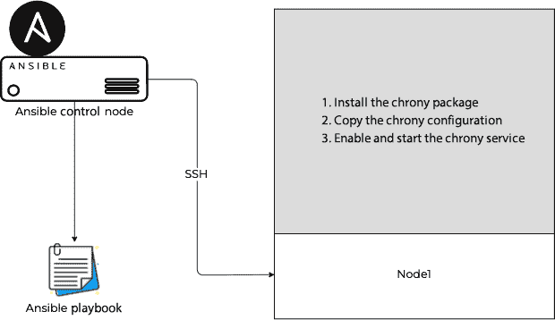

图 2.1 – 配置 Ansible 以自动化 chrony

按照以下步骤创建 Ansible 工件以安装 `chronyd`，包括 `ansible.cfg`、`hosts` 文件和 Ansible 剧本：

1.  首先，创建一个名为`Chapter-02`的新目录，并像上一章那样在该目录中创建`ansible.cfg`文件：

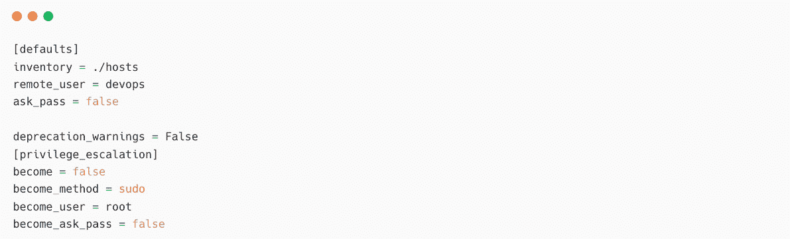

图 2.2 – Ansible 配置文件 (ansible.cfg)

1.  接下来，在与 `node1` 受管节点相同的目录下创建 `hosts` 文件：

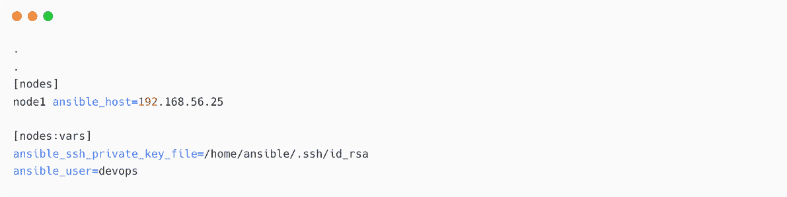

图 2.3 – 带有 node1 的 Ansible 清单文件

1.  在同一目录下创建一个名为`install-package.yaml`的 playbook 文件，内容如下：

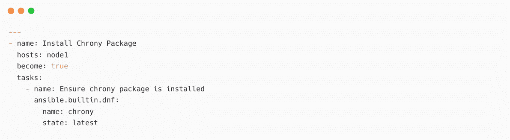

图 2.4 – 安装 chrony 的 Ansible playbook

在前面的 playbook 中，您只有一个名为 `Install Chrony Package` 的 *play*，以及一个名为 `Ensure Chrony package is installed` 的任务。还要注意 `hosts: node1` 行，因为您正在安装软件包到您的受管节点——也就是 `node1`。

Ansible 完全限定集合名称 (FQCN)

正如我们在*第一章*中学到的，*Ansible 自动化 – 介绍*，在 *Ansible 内容集合* *部分*，许多插件和模块已移至 Ansible 2.10 中的内容集合。playbook 可以正常工作，但最佳实践是使用 `ansible.builtin.dnf` 作为 FQCN，其中 `dnf` 是模块名称，且是 `ansible-core` 的一部分。另一个例子是 `google.cloud.gcp_compute_disk`，其中 `google` 是集合的作者，`cloud` 是集合名称，`gcp_compute_disk` 是创建 Google Cloud 磁盘的模块名称。有关集合的更多信息，请阅读：[`docs.ansible.com/ansible/latest/user_guide/collections_using.xhtml`](https://docs.ansible.com/ansible/latest/user_guide/collections_using.xhtml)。

1.  使用 `ansible-playbook` 命令执行 playbook，您将看到以下输出：

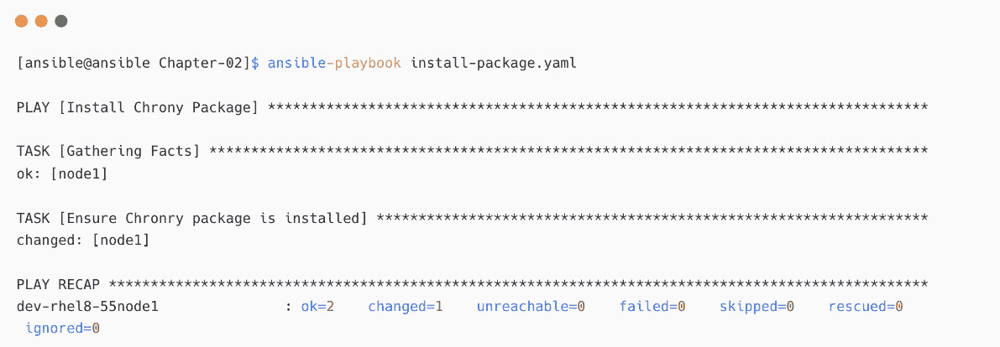

图 2.5 – chrony 包安装 playbook

这样，playbook 就已成功执行。以下截图显示了成功状态：


图 2.6 – chrony 包安装消息

1.  现在，登录到目标机器 `node1` 并验证安装：

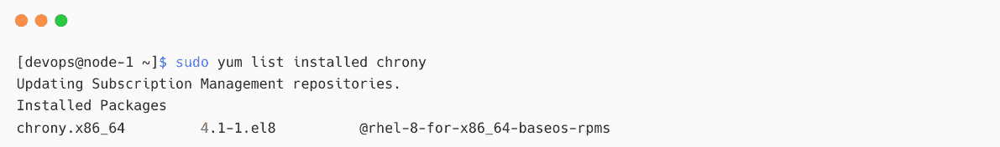

图 2.7 – 在 node1 上安装的 chrony 包

现在，您需要创建一个可以在所有服务器上使用的`chrony`配置。

1.  在相同目录（`Chapter-02`）下创建 `Chapter-02/chrony.conf.sample` 文件。根据您组织的标准，为 `chrony` 配置添加更多详细信息：

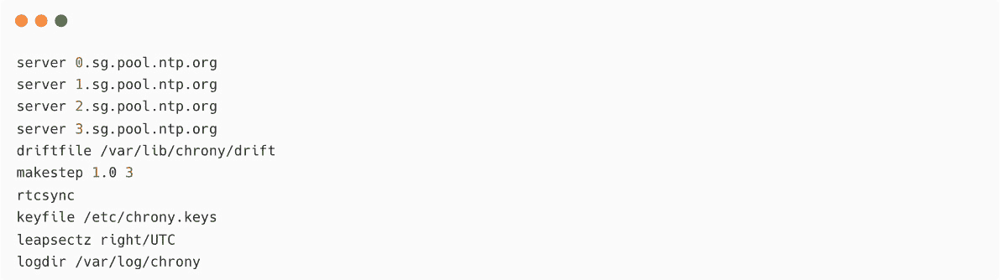

图 2.8 – 示例 chrony 配置

1.  在剧本中添加一个名为`Copy chrony configuration to node`的任务，使用`template`模块将示例`chrony`配置复制到节点。然后，使用`service`模块启动`chronyd`服务。

完整的剧本如下所示：

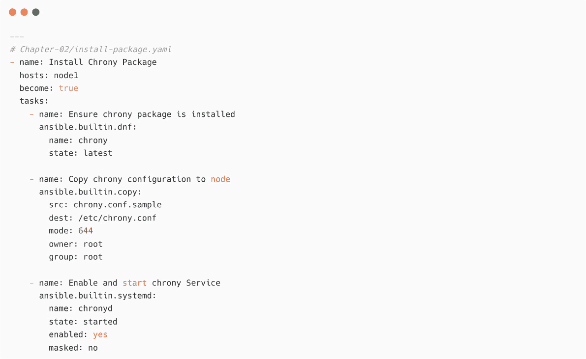

图 2.9 – 安装和配置 chrony 的剧本

1.  再次执行剧本并验证，如下图所示：

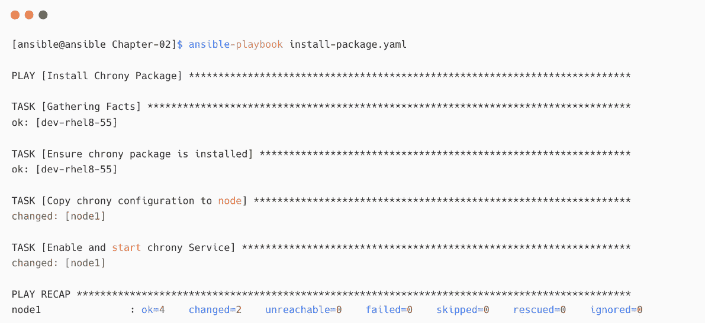

图 2.10 – 展开后的剧本与 chrony 配置

在上述示例中，`Ensure chrony package is installed`任务的状态为`ok`。这意味着所需的状态已经达到，因此无需再次安装`chrony`包。因此，Ansible 不会对该任务采取任何行动。

在 Ansible 中，这一特性称为**幂等性**，意味着如果执行一个操作的结果与当前状态相同，则该任务无需进一步操作。大多数 Ansible 模块是幂等的，这将帮助你在受管节点上多次运行相同的剧本而不会产生任何影响（[`docs.ansible.com/ansible/latest/reference_appendices/glossary.xhtml#term-Idempotency`](https://docs.ansible.com/ansible/latest/reference_appendices/glossary.xhtml#term-Idempotency)）。

现在，验证目标节点上的详细信息：

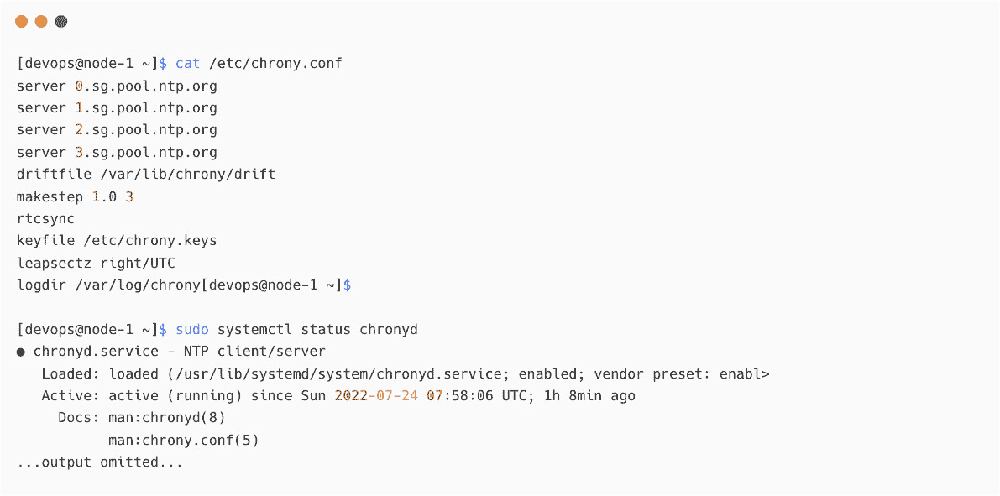

图 2.11 – node1 上的 chrony 配置和服务状态

上述剧本可以用来自动化你的`chrony`配置，适用于成千上万的服务器，并且只需几分钟就能完成任务。

Ansible 模块参考

请参考以下文档，了解你在剧本中使用的模块：

+   [`docs.ansible.com/ansible/latest/collections/ansible/builtin/dnf_module.xhtml`](https://docs.ansible.com/ansible/latest/collections/ansible/builtin/dnf_module.xhtml)

+   [`docs.ansible.com/ansible/latest/collections/ansible/builtin/copy_module.xhtml`](https://docs.ansible.com/ansible/latest/collections/ansible/builtin/copy_module.xhtml)

+   [`docs.ansible.com/ansible/latest/collections/ansible/builtin/systemd_module.xhtml`](https://docs.ansible.com/ansible/latest/collections/ansible/builtin/systemd_module.xhtml)。

# 查找要使用的 Ansible 模块

在本节中，你将学习如何在 Ansible 剧本中查找适合的模块和文档。

使用`ansible-doc`命令查找可用的模块和详细信息：

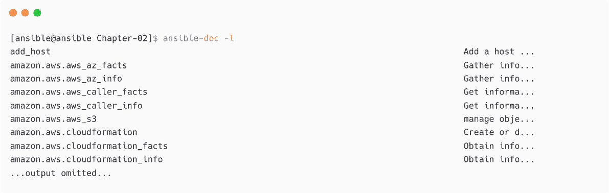

图 2.12 – Ansible 模块列表

它将是一个长列表或短列表，具体取决于你的 Ansible 安装类型。（回顾前一章中解释的`ansible`、`ansible-base`和`ansible-core`之间的区别。）你可以按照以下方式检查可用的模块总数：

```
[ansible@ansible Chapter-02]$ ansible-doc -l |wc -l
6108
```

通过调用模块名称并使用`-s`（`--snippet`）参数检查模块详情，如下所示：

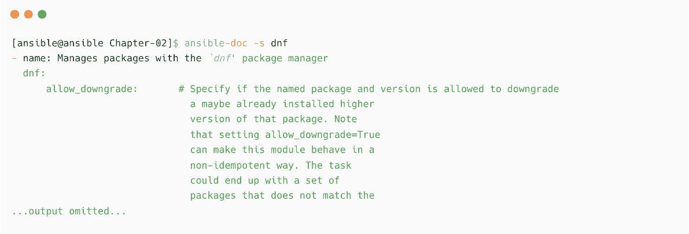

图 2.13 – dnf 模块的 Ansible 模块片段

或者，检查模块的完整详情如下：

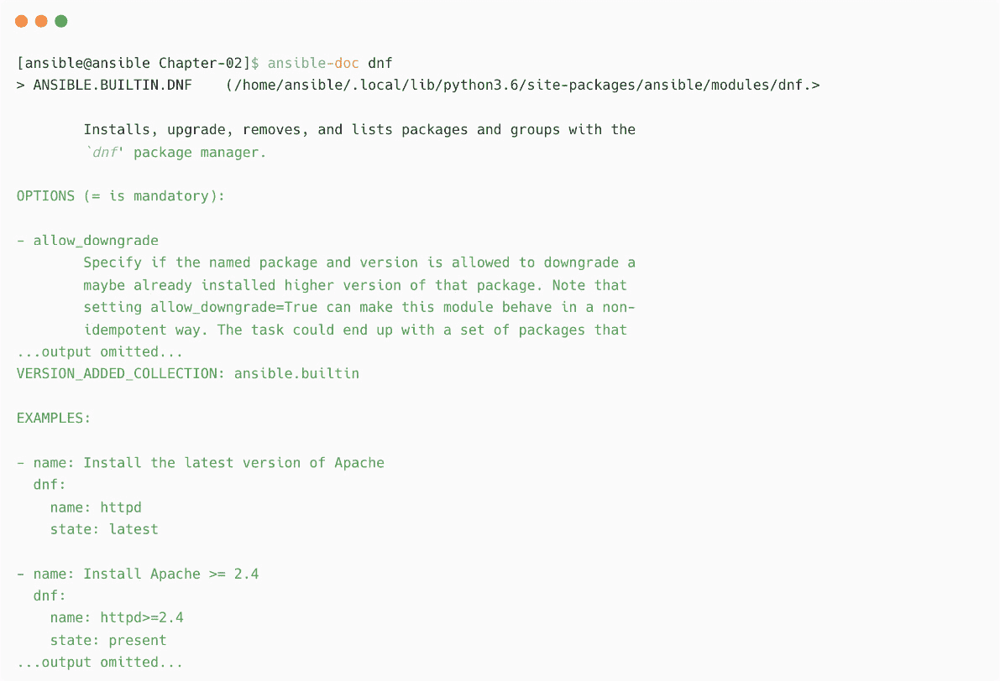

图 2.14 – dnf 模块的 Ansible 模块详情

上面的输出显示了模块的示例用法和所有参数。这就像是模块文档的离线副本。如果你想在模块列表中交互式地搜索某个特定模块，可以执行`ansible-doc -l`命令，然后按*/*键并输入模块名称进行搜索，如下截图所示：

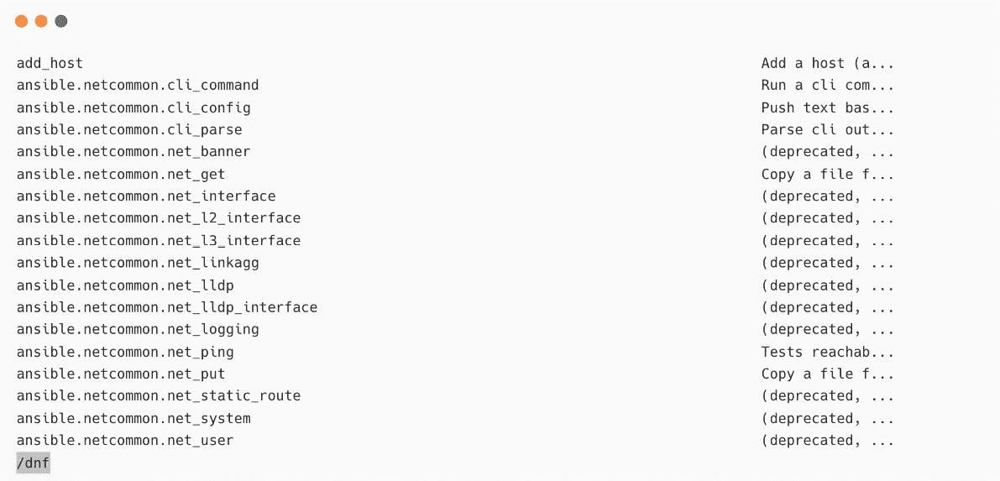

图 2.15 – 在 ansible-doc 中搜索模块

当你按下*Enter*键时，如果搜索项存在，它将被高亮显示。这可以通过以下截图看到。按*N*键可以查找下一个包含相同文本的项目：

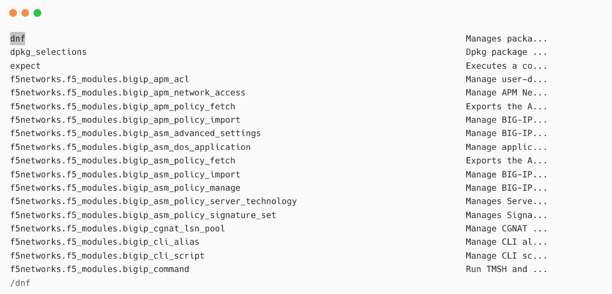

图 2.16 – 在 ansible-doc 列表中查找模块

使用`ansible-doc`列出所有其他插件，包括`connection`插件、`become`插件、`lookup`、`filters`等。

以下截图显示了可用的`become`插件：


图 2.17 – Ansible become 插件

以下截图显示了可用的`connection`插件：

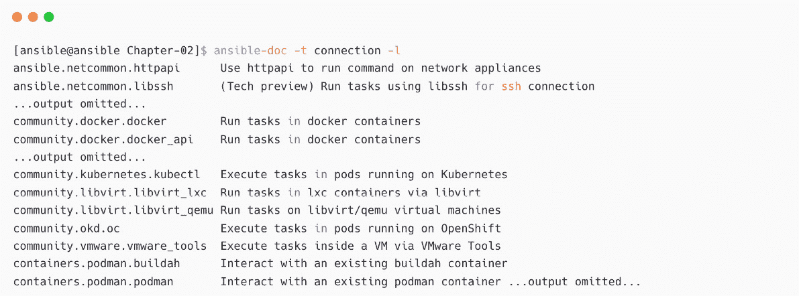

图 2.18 – Ansible 连接插件

到此，你已经学会了如何使用`ansible-doc`命令查找所需的模块和模块文档。接下来，你将学习如何配置文本编辑器以编辑 Ansible playbook。

# 配置你的文本编辑器以支持 Ansible

由于**YAML**对缩进非常敏感，因此在使用文本编辑器开发和编辑 playbook 时，需要格外小心。你可以使用任何你喜欢的文本编辑器来编辑 Ansible playbook，并根据需要配置编辑器。

如果你能够使用像 Visual Studio Code 或 Atom 这样的 GUI 编辑器，请跳过本节内容，因为 GUI 编辑器可以轻松通过多个插件配置，以更高效地进行 Ansible 内容开发。有关 Ansible 内容开发的工具和程序详情，请参考 [`docs.ansible.com/ansible/latest/community/other_tools_and_programs.xhtml`](https://docs.ansible.com/ansible/latest/community/other_tools_and_programs.xhtml)。现在，让我们学习如何为 Ansible YAML 文件配置 **Vim** 编辑器。使用 Vim 变量启用或禁用 Vim 编辑器中的功能：

```
[ansible@ansible Chapter-02]$ vim install-package.yaml 
```

现在，按下*Esc*，接着按 *:* 并输入 `set nu` 来启用行号，如下图所示：

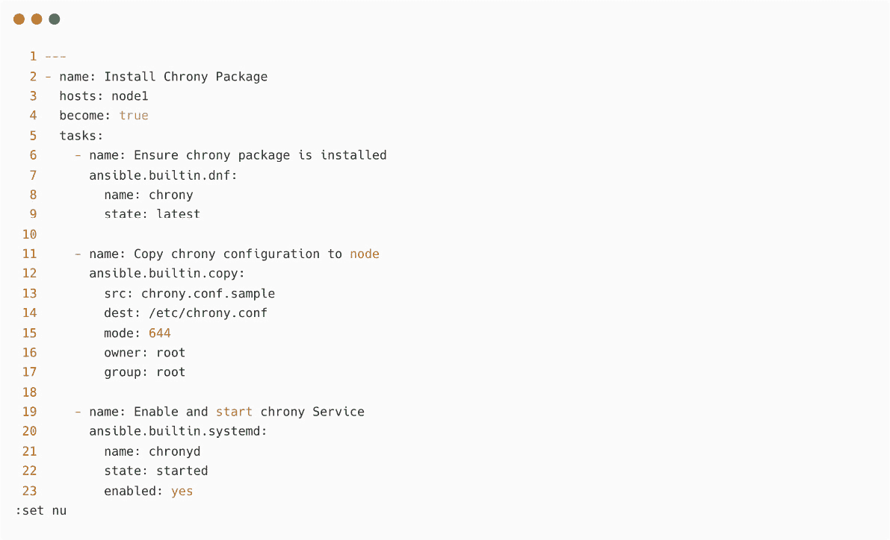

图 2.19 – 配置 Vim 编辑器以显示行号

你将看到行号显示在编辑器的左侧。但是当你关闭 Vim 编辑器会话并重新打开时，所有这些变量会被重置。为了避免逐一启用这些功能，你可以在主目录下的 `.vimrc` 文件中配置这些 Vim 变量。

创建一个 `~/.vimrc` 文件，并添加以下内容来配置 Vim 支持 YAML 文件：


图 2.20 – 配置 ~/.vimrc 文件

以下表格列出了一些可用的 Vim 变量：

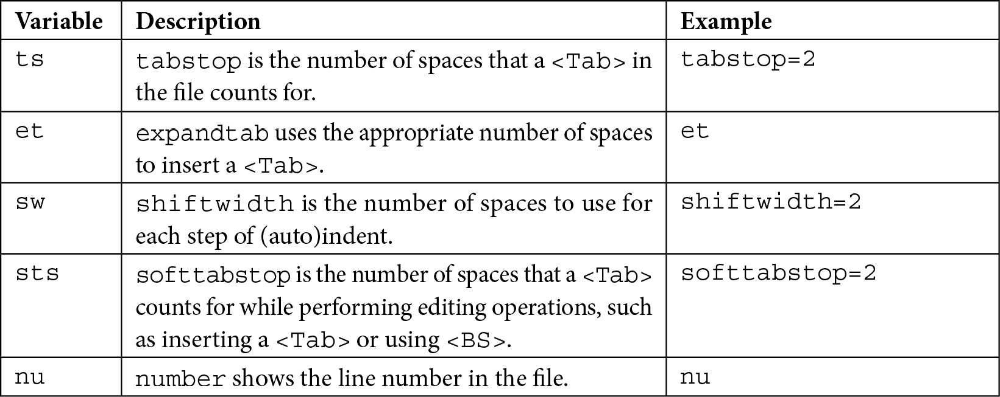

表 2.1 – Vim 变量列表

完成 `~/.vimrc` 文件后，尝试通过编辑任何 YAML 文件来检查 Vim 编辑器：

```
[ansible@ansible Chapter-02]$ vim install-package.yaml
```

你将看到行号和其他语法高亮。尝试编辑文件；当你编辑行时，缩进会自动创建。你仍然可以使用*Tab*键，因为 Vim 会根据你的 `vimrc` 配置将*Tab*替换为两个空格。以下截图展示了启用 `vimrc` 配置后 Vim 编辑器的示例界面：

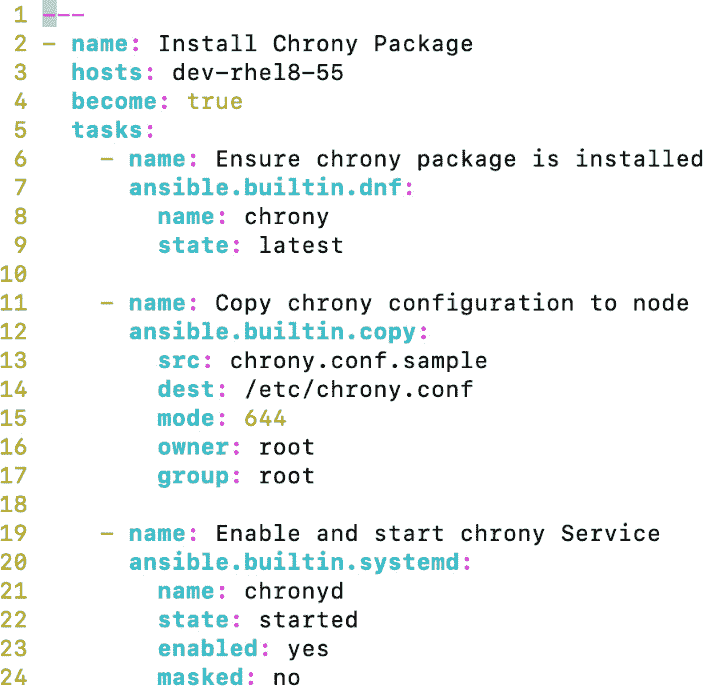

图 2.21 – 配置为 YAML 文件的 Vim 编辑器

请参阅 [`www.techbeatly.com/setup-your-vim-editor-for-ansible-playbook/`](https://www.techbeatly.com/setup-your-vim-editor-for-ansible-playbook/) 中的 *设置你的 Vim 编辑器以支持 Ansible Playbook*，了解更多关于 Vim 编辑器配置 YAML 的内容。

什么是 Vim 编辑器？

Vim 是一个著名的文本编辑器，适用于 Linux 平台。Vim 编辑器具有高度的可配置性，非常适合开发和编辑任何复杂的 Linux 文件。更多详情请参考 [`www.vim.org`](https://www.vim.org)。

# 连接到远程节点

最佳实践是使用动态清单，以避免频繁更改静态清单文件。然而，这取决于你的环境。另一个最佳实践是根据环境、重要性或其他参数分离清单文件。以下截图展示了基于工作负载环境的示例清单文件。如你所见，生产、开发和暂存设备分别有不同的目录和文件：

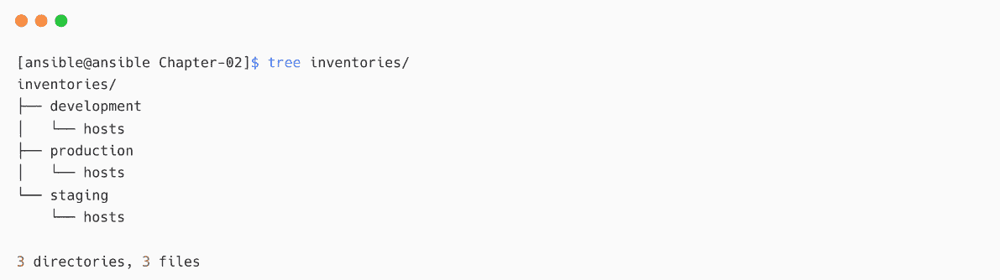

图 2.22 – 基于环境的 Ansible 清单分离

你需要确保 Ansible 控制节点到受管节点的连接是安全的。对于 Linux/Unix 受管节点，使用`ssh`连接（这是默认连接方式）并使用基于密钥的身份验证，如在*第一章**“配置受管节点”*部分所解释的那样。可能会有无法使用 SSH 密钥的情况，在这种情况下，你可以使用用户名和加密密码进行身份验证；这将在*第十三章*中讲解，*使用 Ansible 进行密钥管理*。

对于 Windows 机器，使用`WinRM`协议，Ansible 可以用它连接并执行 Windows 机器上的任务。然而，你需要在 Windows 机器上配置一些项，如启用 WinRM 监听器、打开 WinRM 的端口等。

使用`ansible-doc`命令查看`WinRM`连接插件，如下所示：


图 2.23 – Ansible WinRM 连接插件

你也可以在清单或 playbook 中配置受管主机的连接方式。你还可以在执行 playbook 时进行配置。以下截图展示了`ansible_connection=winrm`方法用于`win2019`清单组。该组下的所有主机将使用`winrm`作为连接方式：


图 2.24 – 在 Ansible 清单中配置 WinRM

你也可以在 Ansible playbook 中提及连接类型，如下所示：


图 2.25 – 在 Ansible playbook 中配置 WinRM

如果你想动态地提供连接方式，可以在执行`ansible-playbook`命令时传递此信息：


图 2.26 – 在执行 Ansible playbook 时传递 WinRM 连接

对于网络和防火墙设备，使用基于设备类型和兼容性的支持连接协议。你将在*第六章*中了解更多内容，*自动化 Microsoft Windows 和网络设备*。

请参考 Ansible 连接插件文档，网址：[`docs.ansible.com/ansible/latest/plugins/connection.xhtml`](https://docs.ansible.com/ansible/latest/plugins/connection.xhtml)，以了解更多信息。

# 总结

在本章中，你学习了如何开发一个简单的 playbook 来自动化 `chrony` 包的部署和服务管理。你学习了如何使用 `ansible-doc` 命令查找模块及其详细信息，包括模块示例和使用的参数。你还探索了如何使用 `ansible-doc` 命令查找连接插件和成为插件。之后，你学习了如何配置你的 Vim 编辑器，以便轻松编辑 Ansible YAML 文件。最后，你学习了如何配置被管理节点的连接方法。

在下一章，你将学习如何使用 Ansible 自动化你的日常任务，开发实际用例，并将其应用到你的工作场所。

# 进一步阅读

若要了解本章所涉及的更多信息，请访问以下链接：

+   *Ansible 的工具和程序*: [`docs.ansible.com/ansible/latest/community/other_tools_and_programs.xhtml`](https://docs.ansible.com/ansible/latest/community/other_tools_and_programs.xhtml)

+   *Ansible 幂等性*: [`docs.ansible.com/ansible/latest/reference_appendices/glossary.xhtml#term-Idempotency`](https://docs.ansible.com/ansible/latest/reference_appendices/glossary.xhtml#term-Idempotency)

+   *Ansible 在 Windows 上的自动化*: [`www.techbeatly.com/ansible-windows/`](https://www.techbeatly.com/ansible-windows/)

+   *Ansible 模块介绍*: [`docs.ansible.com/ansible/latest/user_guide/modules_intro.xhtml`](https://docs.ansible.com/ansible/latest/user_guide/modules_intro.xhtml)

+   *Ansible 连接插件*: [`docs.ansible.com/ansible/latest/plugins/connection.xhtml`](https://docs.ansible.com/ansible/latest/plugins/connection.xhtml)
