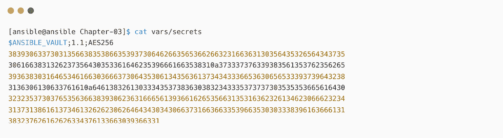
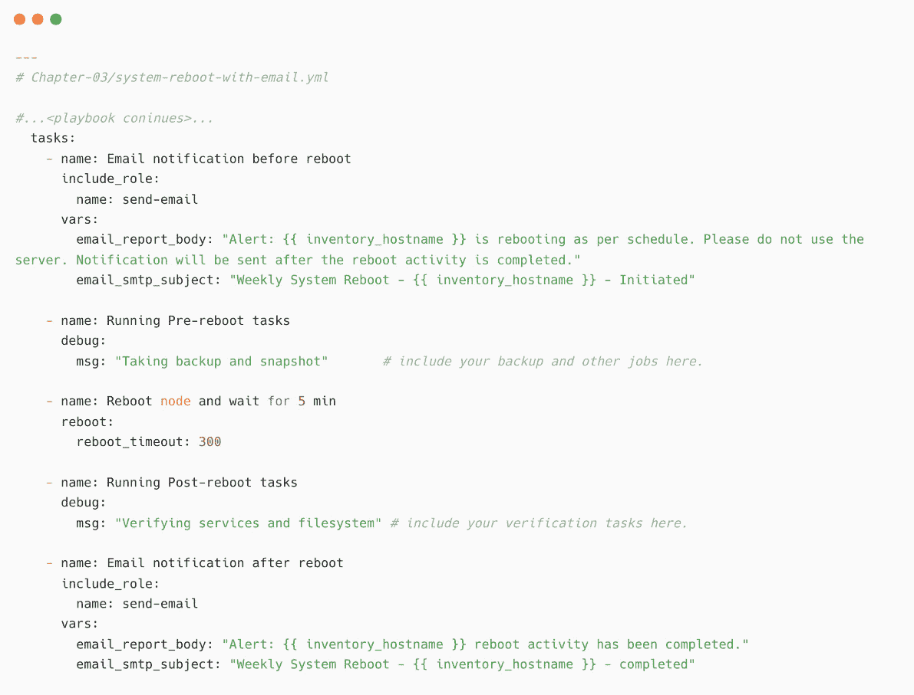

# 第三章：自动化您的日常工作

是否在为找到适合 Ansible 自动化的使用案例而苦恼？您的工作场所是寻找自动化使用案例的绝佳起点。跟踪您或您的团队每天重复执行的任务，您会发现自动化这些任务的机会。这些任务可能是简单的服务器信息收集、操作系统版本采集，或者是每周一次的重启工作。

在本章中，您将学习如何利用 Jinja2 模板创建报告和电子邮件，并借助 Ansible 完成这些任务。您还将学习如何以模块化的方式开发 Ansible 工件，并动态地包括任务和变量。

本章将涵盖以下主题：

+   使用 Ansible 收集服务器详细信息

+   收集系统信息

+   使用 Ansible 进行系统扫描与修复

+   使用 Ansible 实现自动化的每周系统重启

+   自动化通知

我们将从 `ansible_facts` 开始，学习如何提取系统报告所需的数据。本章将解释如何收集数据、将其插入到 HTML 报告中，并存储到 Web 服务器上。接着，您将学习如何配置标准的系统文件，并通过电子邮件通知自动化服务器重启。

# 技术要求

以下是本章的技术要求：

+   用于 Ansible 控制节点的 Linux 机器

+   配置了 Red Hat 仓库的两台或更多 Linux 机器（如果您使用的是其他 Linux 操作系统而非**Red Hat Enterprise Linux**（**RHEL**）机器，请确保您已经配置了适当的仓库，以便获取包和更新）

本章的所有 Ansible 配置、playbook、命令和代码片段可以在本书的 GitHub 仓库中找到，地址是：[`github.com/PacktPublishing/Ansible-for-Real-life-Automation/tree/main/Chapter-03`](https://github.com/PacktPublishing/Ansible-for-Real-life-Automation/tree/main/Chapter-03)。

# 使用 Ansible 收集服务器详细信息

在上一章中，您学习了如何通过使用简单的 playbook 和任务来利用 Ansible 进行基本的自动化。本章中，您将通过自动化您工作场所中的一些简单的日常任务，进一步加深理解。

一个最新的、易于访问的系统清单是每个系统工程师和 IT 团队的梦想。在大型企业中，常常使用**配置管理数据库**（**CMDB**）软件。然而，工程师们必须维护自己的电子表格，以便跟踪他们管理的服务器和设备信息。当您使用虚拟机和虚拟设备等软件定义基础设施时，验证和更新这些本地电子表格将变得非常繁琐。

使用 Ansible 可以自动化维护这些信息，如下图所示：


图 3.1 – 使用 Ansible 维护系统信息数据库

Ansible 和 `ansible_facts` 可以用来创建和更新系统库存数据库或您自己的 CMDB。`ansible_facts` 提供从目标节点（被管理节点）收集的详细和有用的数据，并存储在 `setup` 模块中，这个过程发生在每个 play 的开始。如果您还记得 `chrony` 包的安装 playbook，可以查看 `TASK [Gathering Facts]` 行，那里显示了 `setup` 模块在后台运行：


图 3.2 – 由 setup 模块执行的 Ansible 信息收集任务

`ansible_facts` 可用于在 playbook 中做出决策，例如，如果系统内存低于要求的值，则跳过任务，或根据目标节点的操作系统版本安装特定的软件包。

## Ansible 角色

An Ansible 角色是一个包含任务、处理器、模板和变量的集合，用于配置目标系统，使其达到所需状态。Ansible 角色使得内容共享变得简单，因为我们可以在角色目录中包含所需的变量、任务、模板和其他文件。Ansible 角色旨在实现可重用性和协作支持，以便将相同的角色分发给团队或公众。其他用户可以使用这些角色来完成相同的任务：

+   使用 Ansible 角色，我们可以轻松地将 playbook 的内容与其他团队共享，只需共享整个角色目录。例如，可以编写 `install_dbserver` 或 `setup_webserver` 角色，并在之后将其与公众或其他团队共享。

+   更大的项目可以通过模块化的方式进行创建。

+   不同的用户可以并行创建不同的角色并共享同一个项目。例如，开发人员 1 编写 `install_dbserver` 角色，开发人员 2 则专注于 `setup_webserver` 角色。

接下来让我们学习 Ansible 角色的目录结构。

### 角色目录结构

Ansible 角色的内容以有组织的方式进行排列。顶层目录定义了角色本身的名称，如下截图所示（我们将在本章稍后创建这些角色及其内容）：


图 3.3 – 包含角色的示例项目目录

在前面的截图中，我的 `roles` 目录下有两个角色，分别是 `deploy-web-server` 和 `security-baseline-rhel8`。其中一些目录包含 `main.yml` 文件，里面包含任务、变量或处理器：

+   `Defaults/main.yml`：包含角色的变量，在使用该角色时可以被覆盖。

+   `tasks/main.yml`：包含使用角色时要执行的主要任务列表。

+   `vars/main.yml`：包含角色的内部变量。

+   `files`：包含可以从此角色引用的静态文件。

+   `templates`：这是可以通过该角色使用的 jinja2 模板。

+   `handlers/main.yml`：这包含了处理程序定义。

+   `meta/main.yml`：这定义了此角色的一些元数据，如作者、许可、平台和依赖关系。

+   `tests`：这是一个清单。`test.yml` 文件可以用来测试这个角色。

默认变量可以在 `defaults/main.yml` 中定义；其他角色变量可以在 `vars/main.yml` 中定义。但是，根据变量的位置和变量优先级，Ansible 将应用适当的变量值。参阅 [`docs.ansible.com/ansible/latest/user_guide/playbooks_variables.xhtml#understanding-variable-precedence`](https://docs.ansible.com/ansible/latest/user_guide/playbooks_variables.xhtml#understanding-variable-precedence) 以了解更多关于变量优先级的信息。

Ansible 角色

在 Ansible Galaxy 中有超过 10,000 个角色可供使用（[`galaxy.ansible.com`](https://galaxy.ansible.com)），这些角色由社区贡献。用户可以自由下载并用于 Ansible 自动化过程。如果组织需要认证的内容集合（集合和角色），则可以通过访问 Red Hat Automation Hub（在 [console.redhat.com](http://console.redhat.com) 门户）来找到它们。阅读 [`docs.ansible.com/ansible/latest/user_guide/playbooks_reuse_roles.xhtml`](https://docs.ansible.com/ansible/latest/user_guide/playbooks_reuse_roles.xhtml) 以了解更多关于 Ansible 角色的信息。可以在 [`galaxy.ansible.com/RedHatOfficial`](https://galaxy.ansible.com/RedHatOfficial) 找到官方的 Red Hat 角色。

## Ansible Jinja2 模板

使用 `template` 模块（或 Ansible 的 `template` 过滤器）将 Jinja2 模板转换为实际内容或文件。Ansible 将根据需要替换变量的值。

例如，标准的 `/etc/motd` 文件可以通过动态地使用适当的值部署到服务器上。你的 Jinja2 模板将如下所示（根据你的自定义可能有所不同）：


图 3.4 – 用于 motd 文件的 Jinja2 模板

在剧本中，你将 `template` 文件，并使用 `template` 模块将其传输到目标机器（不要使用 `copy` 模块，因为模板化将无法工作）：


图 3.5 – 在剧本中使用模板模块

在目标机器上，Jinja2 模板中的变量将被替换为相应的值，如下所示：


图 3.6 – 使用 Jinja2 模板创建的 /etc/motd 文件

模板中可以使用任何复杂度和循环来生成动态输出文件。一些使用案例包括生成报告、Web 服务器配置（HTTPS、Nginx）、系统配置文件（`/etc/hosts`、`/etc/motd` 和 `/etc/fstab`）等。

Ansible Jinja2 模板

阅读更多关于 Ansible Jinja2 模板的内容，请访问 [`docs.ansible.com/ansible/latest/user_guide/playbooks_templating.xhtml`](https://docs.ansible.com/ansible/latest/user_guide/playbooks_templating.xhtml)。

在此使用案例中，您将使用 `ansible_facts` 从 `node1`（如果有其他机器，也可以从它们获取）提取所需的信息，并将其作为 HTML 报告存储在 Web 服务器（`node2`）中，如下图所示：


图 3.7 – 用于 Ansible CMDB 使用案例的机器

对于以下使用案例，我们需要部署一个 Web 服务器。我们将使用 Ansible 在 `node2` 上部署和配置 Web 服务器。

按照以下步骤使用 Ansible 角色部署 Web 服务器：

1.  在您的 Ansible 控制节点上，创建一个名为 `Chapter-03` 的新目录，并创建一个 `ansible.cfg` 文件，如下所示：


图 3.8 – ansible.cfg 文件

1.  在与 `node-1` 管理节点相同的目录中创建一个 `hosts` 文件（使用您实验室或环境中的正确 IP 地址）：


图 3.9 – Ansible 清单（hosts）文件

在上面的截图中，`[nodes:vars]` 是组变量。这些变量将在 `nodes` 主机组下对所有管理节点可用。

1.  现在，创建一个 Ansible 角色，在 `node2` 上使用 Apache 部署 Web 服务器：

    ```
    [ansible@ansible Chapter-03]$ mkdir roles
    [ansible@ansible Chapter-03]$ cd roles/
    ```

1.  一旦创建了 `roles` 目录，使用 `ansible-galaxy` 命令初始化一个新的 Ansible 角色。`ansible-galaxy` 命令将初始化并创建该角色的骨架目录结构：


图 3.10 – 使用 ansible-galaxy 命令初始化 Ansible 角色

1.  验证 `roles` 目录的内容：


图 3.11 – 角色目录的内容

1.  将以下任务添加到 `roles/deploy-web-server/tasks/main.yml` 文件中，以安装 `firewalld` 和 `httpd` 软件包：


图 3.12 – 安装 httpd 和 firewalld

1.  向角色中添加更多任务，以启用防火墙服务并允许 `httpd` 服务通过防火墙，如下所示：


图 3.13 – Ansible web 部署角色 – 启用 firewalld 服务并允许 httpd 通过防火墙

1.  最后，添加启用并启动 `httpd` 服务的任务，如下所示：


图 3.14 – Ansible web 部署角色 – 启用并启动 httpd

`tasks/main.yml`文件将创建`/var/www/html`目录，并安装`httpd`和`firewalld`包。然后，它将启动`httpd`和`firewalld`服务，并在防火墙中打开`httpd`端口。

删除`deploy-web-server`角色目录中其他不需要的目录和文件（自动生成的）。在这种情况下，保持不变并继续进行下一步。

1.  创建一个名为`Chapter-03/deploy-web.yml`的剧本，这样您就可以部署 Web 服务器（记得返回到主目录——即`Chapter-03`）：


图 3.15 – 调用角色的 Ansible 剧本

现在，您的目录将包含以下内容：


图 3.16 – 项目目录内容

1.  执行`deploy-web.yml`剧本以在`node2`上部署 Web 服务器：


图 3.17 – 执行 Web 服务器部署剧本

相同的剧本可以执行多次，Ansible 将在后台根据所需的状态执行或跳过操作。这个特性在 Ansible 中称为**幂等性**，Ansible 模块将检查所需的状态（例如，安装包或复制文件），并仅在需要时执行操作。

Ansible 的幂等性

*“一个操作是幂等的，如果执行一次的结果与重复执行多次的结果相同，而中间没有任何干预操作。”* – Ansible 词汇表（[`docs.ansible.com/ansible/latest/reference_appendices/glossary.xhtml`](https://docs.ansible.com/ansible/latest/reference_appendices/glossary.xhtml)）

让我们再次执行相同的剧本并检查差异。在这里，我们可以看到`ok`状态而不是`changed`（*图 3.17*），因为 Ansible 并没有执行该操作。这是因为`firewalld`和`httpd`包已经安装，并且服务已经启动（所需的状态已经满足）：


图 3.18 – 再次执行部署剧本，并注意到`ok`状态而不是`changed`

现在，通过访问服务器 IP 或**完全限定域名**（**FQDN**）在浏览器中验证 Web 服务器（根据操作系统和版本的不同，您可能会看到不同或相似的页面）：


图 3.19 – 默认 Apache 网页

登录到`node2`并删除默认的`welcome.conf`文件，以便您可以查看`/var/www/html`目录的内容：

```
[root@node-2 ~]# mv /etc/httpd/conf.d/welcome.conf .
```

这在生产环境中不是最佳实践，您需要为 Web 服务器配置适当的权限和目录列表选项。提到上述步骤是为了演示和说明 Web 服务器的功能。

这样，你就使用 Ansible 角色部署了一个 Web 服务器，用于存储系统信息报告或 CMDB。

注意

有许多开源项目可以用于实现 CMDB，比如使用 Ansible facts 的 Ansible-CMDB（[`ansible-cmdb.readthedocs.io/en/latest/`](https://ansible-cmdb.readthedocs.io/en/latest/)）。请参考项目文档和仓库以获取详细信息。

# 收集系统信息

在本节中，你将从`ansible_facts`中提取所需的信息，并在你在上一节中创建的 Web 服务器中生成 HTML 报告。

`ansible_facts`包含关于嵌套字典和列表的很多信息。搜索并浏览内容，找到报告中需要的重要信息。

要查看`ansible_facts`的内容，请执行以下临时命令：


图 3.20 – 使用临时命令后的 Ansible facts 输出

使用管道符号（`|`）后的`less`或`more`命令可以将输出保持在顶部，无需滚动到页面底部。你可以使用箭头键向下或向上滚动，或者通过搜索文本来查找它（`/` + `<text>`）。

在[`github.com/PacktPublishing/Ansible-for-Real-life-Automation/tree/main/Chapter-03/node1-ansible-facts`](https://github.com/PacktPublishing/Ansible-for-Real-life-Automation/tree/main/Chapter-03/node1-ansible-facts)中找到 Linux 机器的`ansible_facts`详细信息。

按照以下步骤，使用前面`setup`输出中的一些变量：

1.  创建一个名为`Chapter-03/roles/system-report`的角色来生成 HTML 报告，如下所示：


图 3.21 – 创建一个新的 Ansible 角色用于系统报告

1.  创建一个名为`roles/system-report/templates/system-information.xhtml.j2`的 Jinja2 模板文件，并在模板文件中添加 HTML 头部和其他细节：


图 3.22 – 用于 HTML 报告的 Jinja2 模板

在[`github.com/PacktPublishing/Ansible-for-Real-life-Automation/blob/main/Chapter-03/roles/system-report/templates/system-information.xhtml.j2`](https://github.com/PacktPublishing/Ansible-for-Real-life-Automation/blob/main/Chapter-03/roles/system-report/templates/system-information.xhtml.j2)中找到完整的 Jinja2 模板。你可能已经注意到模板中使用的变量，如下所示：

+   `{{ ansible_hostname }}`：托管节点的主机名。

+   `{{ ansible_all_ipv4_addresses }}`：IP 地址列表。

+   `{{ ansible_architecture }}`：目标机器的架构。

+   `{{ ansible_distribution }}`和`{{ ansible_distribution_version }}`：操作系统的发行版和版本。

+   `{{ report_admin_email }}`：这是一个你需要在剧本中定义的自定义变量。

1.  创建 `roles/system-report/tasks/main.yml` 文件，内容如下：


图 3.23 – 系统报告角色的任务文件

在上述示例中，`template` 模块会将模板转换为目标 HTML 文件，并用相应的值替换变量。由于报告需要保存在 web 服务器路径中，任务将委托给 `node2`（即 web 服务器）。

1.  创建 `Chapter-03/system-info.yml` playbook 并包含 `system-report` 角色：


图 3.24 – 用于收集系统信息的 Ansible playbook

1.  执行 playbook 并验证其输出：


图 3.25 – 收集系统信息

1.  检查 web 服务器以查看报告，如下所示：


图 3.26 – 在 web 服务器上生成的报告

1.  点击 `node1.xhtml` 查看其内容，如下所示：


图 3.27 – Ansible 生成的系统信息报告

这是一个非常基础的 HTML 报告模板，说明了 Jinja2 模板和 `ansible_facts` 的功能。可以通过增加额外的项、CSS 样式，甚至不同的格式（如 Markdown、CSV 或 JSON）来扩展模板。此外，也可以将报告保存在其他位置，如 GitHub 服务器或具有认证的 web 服务器。

# 使用 Ansible 进行系统扫描和修复

安全扫描和修复至关重要，组织每年在这一领域投入更多的时间和金钱。当操作系统和应用程序有新功能和变更时，你将有更多的配置需要检查和验证，以确保最佳的安全实践已到位。在 Ansible 的帮助下，能够自动化系统和设备的安全扫描和修复任务。

本节中，你将基于 CIS Red Hat Enterprise Linux 8 基准，自动化一些基本的安全性和合规性配置。

CIS 基准

CIS 提供了确保系统和平台安全与合规的最佳实践和配置。请参考 [`www.cisecurity.org/cis-benchmarks`](https://www.cisecurity.org/cis-benchmarks) 了解更多 CIS 基准的信息。

当我们在 playbook 或角色中有多个任务时，可以将任务拆分为多个文件，并使用 `include_tasks` 模块动态调用它们。例如，可以将不同的安全修复任务拆分为不同的任务文件，以便从 `main.yaml` 中调用，如下图所示：


图 3.28 – 将任务拆分为多个文件

这种方法可以帮助我们以动态和模块化的方式开发、测试和执行任务。

按照以下步骤开发一个安全修复用例：

1.  创建一个名为`Chapter-03/roles/security-baseline-rhel8`的新角色：


图 3.29 – 创建一个新的安全基准角色

1.  将必要的安全基准配置添加到`roles/security-baseline-rhel8/tasks/main.yml`。

正如我在本节开始时提到的（*图 3.28*），在这个示例中，你将学习如何将任务拆分成多个文件，并以模块化方式开发 playbook。将以下内容添加到`roles/security-baseline-rhel8/tasks/main.yml`中：


图 3.30 – 安全基准角色的主任务文件

你有两个任务，两个任务都通过`include_tasks`模块调用了其他任务文件。你需要注意其中一行，内容如下：

+   `when: “’01.01’ not in baseline_exclusions”`：这是我们添加到任务中的一个机制，用于通过`when`语句控制特定基准规则的执行。Ansible 会检查条件并根据该条件执行或跳过任务。在这种情况下，你需要定义一个名为`baseline_exclusions`的列表变量，并将特定项目添加到排除执行的列表中。（可以使用任何其他字符串或编号系统，这只是本示范中的一个样例列表。）

1.  创建一个名为`roles/security-baseline-rhel8/tasks/part-01.yml`的文件，内容如下，用于安装`sudo`并启用`sudo`日志记录：


图 3.31 – part-01.yml 用于 sudo 配置

第一个任务将安装`sudo`包，而第二个任务将启用`sudo`日志记录。你需要注意其中一行，内容如下：

+   `line: ‘Defaults logfile=”{{ sudo_log }}”’`：你需要在 playbook 中定义这个`sudo_log`变量。

1.  创建一个名为`roles/security-baseline-rhel8/tasks/part-02.yml`的任务文件，内容如下，用于部署默认的`/etc/motd`和`/etc/issue`文件：


图 3.32 – part-02.yml 用于 motd 配置

第一个任务将部署默认内容到`/etc/motd`，而第二个任务将部署内容到`/etc/issue`文件。

1.  在`roles/security-baseline-rhel8/files/`目录下为`motd`和`issue`文件创建以下默认内容：


图 3.33 – 默认的 motd 和 issue 文件

1.  验证你 Ansible 角色的文件，以确保所有内容都已到位，如下截图所示：


图 3.34 – 安全基准角色的内容

你可以删除其他不再使用的目录。然而，在这种情况下，保持一切如原样。

1.  变量可以保存在你的剧本中，甚至可以保存在清单文件内，但当你有更多变量需要维护时，管理内容将变得不容易。创建一个目录来存放变量，如下所示：

    ```
    [ansible@ansible Chapter-03]$ mkdir vars
    ```

1.  创建一个名为`vars/common.yml`的变量文件，用于存放公共变量，并将`sudo_log`和其他变量添加到该文件中（记得在文件中根据需要添加变量和值）：


图 3.35 – 创建一个变量文件

1.  创建另一个名为`vars/baseline_exclusions.yml`的变量文件，用于存放`baseline_exclusions`变量：


图 3.36 – 为基准排除创建一个变量文件

我们可以通过取消注释该行（例如，`‘01.01’`）来禁用安全检查，以便在执行任务之前让 Ansible 进行检查。

1.  作为最佳实践，你需要将所有在 Ansible 角色中使用的变量的默认值保存在一个文件中。可以使用`roles/security-baseline-rhel8/defaults/main.yml`文件来实现这个目的：


图 3.37 – security-baseline-rhel8 角色的默认变量

1.  现在，创建主剧本`security-compliance-rhel8.yml`，并确保它包含以下内容：


图 3.38 – 主剧本 – security-compliance-rhel8.yml

请注意，在前面的剧本中，我们并没有硬编码主机。相反，我们使用了一个名为`NODES`的变量。这个变量将通过`hosts`传递给剧本，以避免剧本意外地在错误的服务器上执行。（关于`extra-vars`的更多内容将在下一节中讲解。）

同时，注意`vars_files`，我们在其中包含了之前创建的两个变量文件。在这里，剧本正在调用`security-baseline-rhel8`角色。

1.  执行剧本并将`NODES`详细信息作为额外变量传递：


图 3.39 – 执行安全基准剧本并确保子任务被执行

1.  登录到`node1`并验证已实施的项目（注意登录提示）：


图 3.40 – 验证 node1 登录屏幕上 motd 的内容

通过为任务添加更多的验证和检查来增强你的剧本。同时，在执行作业时生成报告，并发送或保存以备后续审计使用。

Ansible 与第三方安全工具的集成

可以将 Ansible 与其他第三方平台和工具集成，如 OpenSCAP 或 Red Hat Insight。在这种情况下，你需要开发剧本来控制扫描和修复，而不是手动扫描和修复系统上的配置。有关更多信息，请参阅 [`www.ansible.com/use-cases/security-and-compliance`](https://www.ansible.com/use-cases/security-and-compliance) 和 [`www.open-scap.org/`](https://www.open-scap.org/)。

## Ansible --extra-vars

`extra-vars` 包含将覆盖所有其他变量的变量。使用动态额外变量有助于根据值控制剧本，并且在你使用 Ansible AWX 或 Ansible Automation Controller 中的调查表单时也非常有用，因为变量可以通过 GUI 方法（调查表单）定义。`--extra-vars` 可以作为单个值、多对键值对、JSON 格式传递，或从变量文件读取，如下所示：


图 3.41 – Ansible extra-vars 示例

Ansible --extra-vars

阅读更多有关运行时变量的信息，请访问 [`docs.ansible.com/ansible/latest/user_guide/playbooks_variables.xhtml#defining-variables-at-runtime`](https://docs.ansible.com/ansible/latest/user_guide/playbooks_variables.xhtml#defining-variables-at-runtime)。还可以查看自动化控制器调查表单，网址为 [`docs.ansible.com/automation-controller/latest/html/userguide/job_templates.xhtml#surveys`](https://docs.ansible.com/automation-controller/latest/html/userguide/job_templates.xhtml#surveys)。

在下一部分，你将学习如何使用 Ansible 自动化定期重启作业。

# 使用 Ansible 自动化每周系统重启

定期和计划的系统重启是 IT 环境中的标准过程，旨在确保服务器和应用程序正常运行，并通过服务重启操作保持环境稳定。尽管执行 `reboot` 命令时很简单，但重启过程及其相关手续并非简单明了。

通用服务器重启活动涉及多个步骤，如下图所示：


图 3.42 – 典型系统重启作业工作流

想象一下，每周你需要重启数百台服务器，而你的团队规模太小，无法在周末处理如此重要的操作。通过使用 Ansible 自动化整个工作流，可以在重启前进行备份操作，并在重启后进行服务验证。

Ansible 的 `reboot` 模块首次出现在 Ansible 2.7（2018 年）。在撰写时，该模块是 `ansible-core` 的一部分，包含在所有 Ansible 安装中。

创建一个 Ansible 剧本以重启机器，具体如下：

1.  创建 `Chapter-03/system-reboot.yml` 剧本，内容如下：


图 3.43 – 用于重启任务的 Ansible playbook

1.  执行 playbook：

    ```
    [ansible@ansible Chapter-03]$ ansible-playbook system-reboot.yml -e “NODES=nodes”
    ```

1.  如下所示，验证 `node1` 上的重启状态：


图 3.44 – 在 node1 上验证重启状态

在重启系统之前，增强 playbook，添加快照任务（例如，VMWare 或 OpenStack 备份）或文件备份（例如，`/etc/hosts`、`/etc/motd` 或 `/etc/fstab`）。同时，创建额外的任务来验证服务器上所需的服务是否正在运行，例如 `httpd` 或 `mysql` 服务。如果你使用的是自动化控制器或 Ansible AWS，那么可以将这些自动化任务设置为每周或每日执行；任务将根据预定计划自动执行，无需任何用户交互（有关更多详细信息，请参考 *第十二章*，*将 Ansible 与工具集成*）。

Ansible 重启模块

有关 Ansible `reboot` 模块的更多信息，请参见 [`docs.ansible.com/ansible/latest/collections/ansible/builtin/reboot_module.xhtml`](https://docs.ansible.com/ansible/latest/collections/ansible/builtin/reboot_module.xhtml)。

# 自动化通知

通知管理员和最终用户你在环境中所做的更改非常重要。无论是简单的软件包安装还是系统重启，最终用户都应该知道停机时间和正在发生的更改。与其手动发送电子邮件，不如使用 Ansible 的 `mail` 模块来自动化电子邮件通知。Ansible `mail` 模块功能强大，支持大多数电子邮件功能，包括自定义头信息、附件和安全性。

## 使用 Ansible Vault 加密敏感数据

如果电子邮件服务器（**SMTP**）未 **开放**（未配置为无需身份验证即可发送电子邮件），则需要使用用户名和密码（应用密码或密钥）对 SMTP 服务器进行身份验证。将此类敏感信息以明文存储并不是最佳实践，因此你需要以安全的方式存储它。要存储这类敏感信息，可以使用密钥库工具，信息将在加密格式中保存。幸运的是，Ansible 提供了一个内置功能，叫做 **Ansible Vault**，用于存储和管理加密内容。

Ansible Vault 会使用你提供的密码（vault 密码）对文件进行加密，并使敏感数据对普通用户不可读。当 Ansible 想要读取数据时，Ansible 会要求输入 vault 密码；你需要通过键盘输入或通过密钥文件提供密码。

使用 `ansible-vault create` 命令创建一个 vault 文件。请不要忘记 vault 密码，否则你将无法解密内容：


图 3.45 – 使用 Ansible Vault 创建一个秘密变量文件

完成后，一个文本编辑器（例如`vim`）将打开，以便你输入敏感文件的内容。添加你的内容并保存文件：

```
mysecretusername: username 
mysecretpassword: password
```

如果你尝试读取该文件，你将看到加密的内容，如下所示：



图 3.46 – Ansible Vault 文件加密后的样子

使用`ansible-vault view`命令查看文件内容；Ansible 会要求输入 vault 密码，如下所示：


图 3.47 – 查看 Ansible Vault 文件的内容

你将在接下来的练习中使用这个 Ansible Vault 来保护 SMTP 服务器的用户名和密码安全。

我们将在*第十三章*中更详细地讨论 Ansible Vault，*使用 Ansible 进行秘密管理*。

使用 Ansible Vault 加密内容

使用 Ansible Vault 时，你有更多选项，如编辑、加密、解密、更换密钥等。有关更多详细信息，请参考*第十三章*，*使用 Ansible 进行秘密管理*，并查看文档[`docs.ansible.com/ansible/latest/user_guide/vault.xhtml`](https://docs.ansible.com/ansible/latest/user_guide/vault.xhtml)了解更多关于 Ansible Vault 的信息。

在本练习中，你将通过在系统重启前后添加电子邮件通知来增强之前的**每周重启**剧本：

1.  创建一个名为`Chapter-03/roles/send-email`的新角色：


图 3.48 – 创建一个用于发送电子邮件的 Ansible 角色

1.  在`roles/send-email/tasks/main.yml`中添加一个任务：


图 3.49 – 发送电子邮件角色的任务文件

注意

`mail`模块的`delegate_to: localhost`行需要在 localhost（此处为 Ansible 控制节点）上执行，而不是在被管理节点上执行。

如果你的 SMTP 服务器已配置为开放且不需要身份验证，则跳过`username`和`password`变量。在这种情况下，你需要创建一个秘密文件来保存用户名和密码。（这里保留了`cc`和`attach`选项作为注释，供演示使用。通过添加这些功能，完全可以增强该用例。）

1.  使用 Ansible Vault 创建一个名为`vars/smtp_secrets.yml`的新变量文件（记住 vault 密码）：


图 3.50 – 使用 Ansible Vault 创建一个秘密变量文件

1.  添加秘密文件的内容并保存它：


图 3.51 – 向 Vault 文件中添加变量并保存它 (:wq)

1.  创建一个新的剧本 `Chapter-03/system-reboot-with-email.yml`，并包含以下内容（或者，复制之前的 `system-reboot.yml` 文件并重命名）：


图 3.52 – 带有电子邮件通知的 Ansible 剧本用于重启（1）

1.  添加重启和电子邮件的任务，如下所示：



图 3.53 – 带有电子邮件通知的 Ansible 剧本用于重启（2）

请注意，`email_report_body` 和 `email_smtp_subject` 的不同值应根据作业（重启前或重启后）使用。

到此为止，您已经在剧本中包含了 `send-email` 角色所需的所有变量，除了 `email_smtp_username` 和 `email_smtp_password`。这是因为它们是敏感信息，您不能将它们作为明文存储在此；相反，您应将它们包含在您的秘密变量文件（`vars/smtp_secrets.yml`）中，并通过 Ansible Vault 加密该文件。

1.  执行该剧本：


图 3.54 – 执行没有 vault 密码的 Ansible 剧本

Ansible 正在尝试解密密钥文件，但没有提供 vault 密码（vault 密码）。执行相同的剧本，但在末尾添加 `--ask-vault-password` 开关（默认情况下，Ansible 不会询问或提示 vault 密码）：


图 3.55 – 执行带有 vault 密码的 Ansible 剧本

1.  检查您的收件箱（您的 `email_smtp_to_address`）是否收到来自 Ansible 的自动电子邮件：


图 3.56 – 电子邮件通知

作为练习，改进剧本，通过发送所有服务器的合并邮件，而不是单独发送每个邮件或在邮件中附加作业总结报告。

使用 Ansible 发送电子邮件

有关 Ansible 邮件模块的更多信息，请参考 [`docs.ansible.com/ansible/latest/collections/community/general/mail_module.xhtml`](https://docs.ansible.com/ansible/latest/collections/community/general/mail_module.xhtml)。

# 总结

在本章中，您学会了如何创建 Ansible 角色、Jinja2 模板和 Ansible Vault 密钥。您还学会了如何从 Ansible 事实收集系统信息，并使用 Jinja2 模板来创建报告和配置。您练习的用例非常通用，例如收集系统信息、配置标准系统文件、重启服务器和发送电子邮件通知。作为练习，您可以通过添加更多任务和验证（例如在发送电子邮件之前验证重启活动等）来改进这些用例。

在下一章中，你将学习**版本控制系统**（**VCSs**）在 Ansible 中的重要性，保持 Ansible 工件安全的最佳实践，以及如何启用协作与共享，以提高 Ansible 工件的质量。

# 进一步阅读

要了解本章涉及的更多主题，请查看以下资源：

+   *如何将额外的变量传递给 Ansible playbook*：[`www.redhat.com/sysadmin/extra-variables-ansible-playbook`](https://www.redhat.com/sysadmin/extra-variables-ansible-playbook)

+   *Ansible 在安全和合规性方面的应用*：[`www.ansible.com/use-cases/security-and-compliance`](https://www.ansible.com/use-cases/security-and-compliance)
