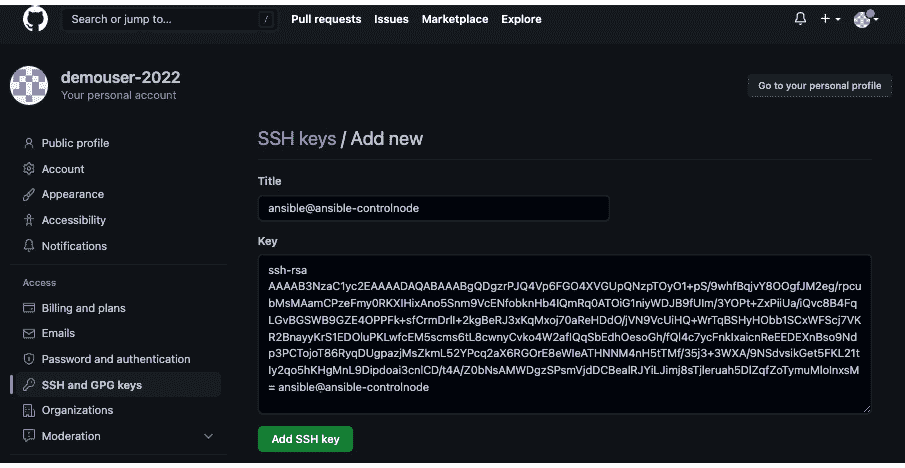
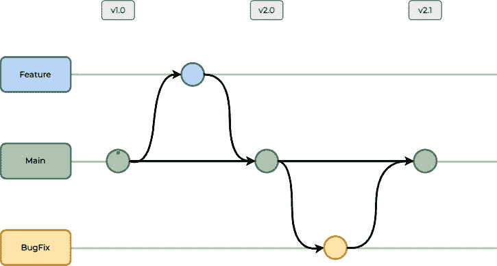
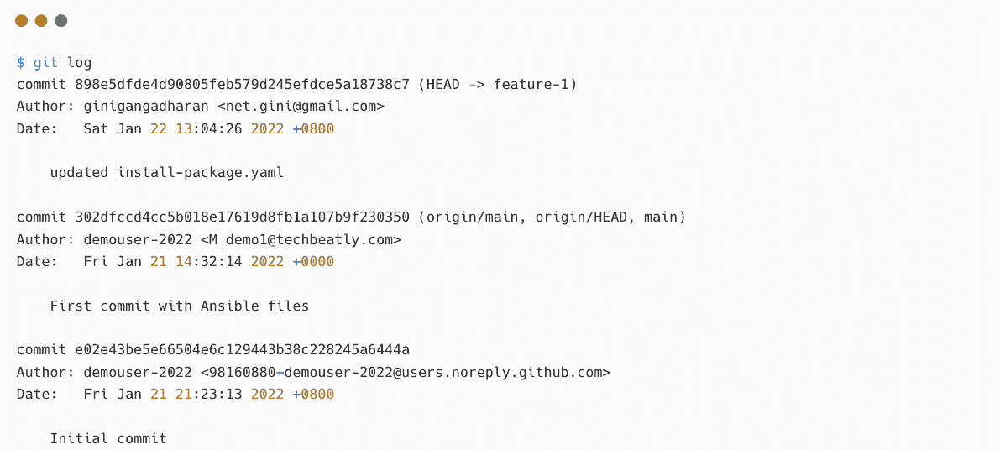

# 第四章：探索自动化开发中的协作

当你作为一个团队工作时，协作是团队和谐的关键。与其将你的自动化内容和知识藏在自己手里，不如与团队，甚至其他部门共享。这样，内容将对更多人有用，而且他们还可以贡献自己的想法和技巧。与自定义脚本相比，Ansible 内容更易读，其他人更容易理解。因此，他们可以修改内容并通过修复 bug 或增加功能来贡献。你可以使用任何标准的方法来保存和分发你的 Ansible 自动化内容，比如 Git 服务器、Subversion 或任何其他**版本控制系统**（**VCS**）。

在本章中，你将学习以下内容：

+   版本控制在 IT 自动化中的重要性

+   我应该把自动化工件保存在何处？

+   在 Git 服务器上管理自动化内容

+   协作是自动化的关键

你将从 GitHub 帐户配置和访问管理开始，学习如何与团队共享内容。你还将了解如何管理来自其他用户的贡献，而不丢失原始内容。

本章重点讲解 Git 以及如何使用 Git 管理 Ansible 内容。如果你已经熟悉 Git 和 GitHub，可以跳过关于这些话题的部分。

# 技术要求

以下是继续本章所需的技术要求：

+   一台用于 Ansible 控制节点的 Linux 机器。

+   一台或多台配置了 Red Hat 仓库的 Linux 机器（如果你使用的是其他 Linux 操作系统而非 RHEL 机器，确保你已配置适当的仓库，以便获取软件包和更新）。

+   创建一个新的 GitHub 帐户所需的电子邮件地址（如果你还没有 GitHub 帐户的话）。

+   有关源代码控制服务器和版本控制系统的基础知识。

本章所有的 Ansible 代码、Ansible 剧本、命令和代码片段都可以在 GitHub 仓库中找到，链接为[`github.com/PacktPublishing/Ansible-for-Real-life-Automation/tree/main/Chapter-04`](https://github.com/PacktPublishing/Ansible-for-Real-life-Automation/tree/main/Chapter-04)。

# 版本控制在 IT 自动化中的重要性

就像任何其他软件、配置或脚本一样，最好不要把你的 Ansible 剧本和配置保存在本地机器上，也就是 Ansible 控制节点。将自动化内容保存在本地 Ansible 控制节点上有许多不推荐的原因，下面列出了一些：

+   如果 Ansible 控制节点出现问题，你将丧失所有的自动化内容，这是不可取的。

+   如果有人不小心删除了文件或更改了配置，你将没有机会恢复原始内容。

+   如果你想更改配置或剧本，那么你需要备份文件和配置。这是常见的做法，以防万一发生问题，你可以恢复到文件的旧版本。

你需要将 Ansible 自动化内容视为软件代码，它应该能够跟踪每一次更改，并且随时可以选择使用旧版本。保持多个版本的内容将使你能够自由地对自动化剧本和配置进行持续的修改，并且给予你信心。这也会实施*单一真实来源*的实践，即你的 Ansible 剧本和变量都保存在一个中心位置，并跟踪所有更改。

版本控制系统（VCS），如 Git 和 Subversion，将帮助你跟踪 Ansible 自动化内容和配置的更改。根据技术的不同，这些工具将在内容发生更改时创建新的版本。

你将把内容保存在 Git 服务器中作为仓库，仓库是文件和目录的集合。可以根据内容创建和维护多个 Git 仓库，例如，一个 Git 仓库用于存储软件包安装剧本和任务，另一个 Git 仓库用于 Linux 修复自动化，等等。你将在本章接下来的部分中实践如何创建和管理 Git 仓库。

Git 文档

请访问 [`git-scm.com/doc`](https://git-scm.com/doc) 查阅参考手册、书籍和视频，学习 Git。了解 Git 中的重要术语，如分支、提交、推送、拉取、克隆和暂存。由于本书专注于 Ansible，我们不会详细讲解这些主题。

请注意，**软件配置管理**（**SCM**）与 VCS 不同，但 VCS 是 SCM 的一部分或子集。

## 选择 Git 服务器

选择任何类型的版本控制系统（VCS），但在本章中，我们将重点介绍如何使用 Git 服务器来存储你的 Ansible 自动化内容。组织使用企业级 Git 解决方案，如**GitHub 企业版**、GitLab **企业版**（**EE**）和**Atlassian Bitbucket**。如果你在环境中没有 Git 服务器，那么可以轻松地通过任何免费且开源的解决方案来搭建一个，例如 GitLab **社区版**（**CE**）、Gogs 和 Gitea。大多数这些解决方案都包含了图形用户界面（**GUI**），你可以使用它们来处理任何一般的 Git 用例，包括 Ansible 自动化内容。

### GitHub

GitHub 是一个托管服务提供商，用于版本控制仓库和其他**持续集成/持续交付**（**CI/CD**）操作。你可以创建一个个人 GitHub 账户，并创建无限制的公共或私人仓库来存储你的软件或配置。GitHub 的主要限制之一是，你不能为你的环境托管一个私人 GitHub 服务器。

### GitLab

GitLab ([gitlab.com](http://gitlab.com)) 是另一种托管的版本控制系统提供商，类似于 GitHub，但具有不同的功能和服务。GitLab 提供公共托管服务器 ([gitlab.com](http://gitlab.com))，也支持通过 GitLab EE 或 CE 进行私有托管。

如何安装 Git 服务器

参考[`www.techbeatly.com/build-your-own-git-server-using-gogs/`](https://www.techbeatly.com/build-your-own-git-server-using-gogs/)了解如何使用 Gogs 在简单的 Docker 容器中安装 Git 服务器。如果你想安装 GitLab CE，请参考[`about.gitlab.com/install/`](https://about.gitlab.com/install/)上的文档，获取详细的安装说明。

我们已经学习了将 Ansible 自动化内容存储在 Git 服务器上的重要性，以及可用的不同 Git 服务器。在下一节中，我们将学习将 Ansible 内容存储在 Git 中的最佳实践和仓库指南。

# 我应该将自动化工件存储在哪里？

根据自动化和内容类型，将你的 playbooks 和配置保存在多个 Git 仓库中。

## Ansible 和 Git 仓库的最佳实践

有许多最佳实践用于将你的 Ansible 自动化内容保存在版本控制系统（VCS）中。

### Ansible 角色的仓库

如果你仅创建 Ansible 角色（不再常见单独创建用于分发的角色，而不包含集合），那么为每个角色创建一个 Git 仓库，以便开发和协作更为便捷，无需依赖其他任务和配置。参见 *图 4.1* 中的示例 ansible-role 仓库。


图 4.1 – 为 Ansible 角色创建单独的仓库

### Ansible 集合仓库

如果你正在创建 Ansible 集合，那么每个集合创建一个 Git 仓库，以便简化开发和管理。将现有的 Ansible 角色、库、模块以及其他插件移至 Ansible 集合仓库，并以标准方式进行分发。参见 *图 4.2* 中的示例 ansible-collection 仓库。


图 4.2 – Ansible 集合仓库

### 为团队创建专用仓库

最佳实践是为不同的团队创建不同的仓库，如果他们正在处理不同的项目，这样可以使仓库管理更加简便和透明。

### 为清单创建专用仓库

将不同环境和组的清单保存在单独的 Git 仓库中，有助于在 playbooks 中高效使用它们。此外，这一做法可以避免在错误的清单中意外执行自动化任务。例如，你可以将生产服务器保存在一个仓库中，将开发服务器保存在另一个仓库中，如 *图 4.3* 所示：


图 4.3 – 不同环境的 Ansible 清单目录结构

通过将不同环境的清单分离到不同的 Git 仓库中，您可以控制对这些清单数据的访问权限，例如谁可以修改或使用这些内容。

如果您使用 Ansible 控制器，这个操作同样会帮助您，因为可以从项目仓库中导入清单。请阅读 [`docs.ansible.com/automation-controller/latest/html/userguide/inventories.xhtml#sourced-from-a-project`](https://docs.ansible.com/automation-controller/latest/html/userguide/inventories.xhtml#sourced-from-a-project) 了解更多信息。

# 在 Git 服务器中管理自动化内容

在本节中，您将学习如何创建 GitHub（[github.com](http://github.com)）账户、创建、安装和配置仓库，并将 Ansible 自动化内容保存在仓库中。

## 设置 GitHub 账户

如果您已经拥有 GitHub 的个人账户或企业账户，则可以跳过账户创建步骤：

1.  打开您的网页浏览器，访问 [github.com](http://github.com)，然后点击页面右上角的 **注册** 按钮。

1.  在下一个页面中输入您的电子邮件地址、密码和用户名，如*图 4.4*所示。GitHub 会告知您用户名是否可用，因为 GitHub 中的用户名必须唯一：


图 4.4 – 创建 GitHub 账户

1.  点击 **继续** 并完成下一个页面上的简单拼图（验证码）来验证您的身份。完成后，创建您的账户。

1.  在下一个页面中，GitHub 会要求您输入在注册邮箱中收到的一次性代码。请检查您的邮箱以获取该代码（*图 4.5*）。


图 4.5 – 从邮箱中获取激活令牌

1.  将代码输入到 GitHub 窗口中并完成注册过程（*图 4.6*）。


图 4.6 – 在 GitHub 中输入一次性令牌

1.  现在，您将进入 GitHub 主页并看到您的激活账户（*图 4.7*）。


图 4.7 – GitHub 账户主页

其他 Git 服务器

使用其他 Git 服务，如 GitLab（https://gitlab.com）或 Bitbucket（[`bitbucket.org`](https://bitbucket.org)），注册过程基本相同。

## 创建您的第一个 Git 仓库

在这个练习中，您将创建一个新的 Git 仓库来存储您的剧本和配置文件：

1.  从 GitHub 主页，点击右上角的 **+** 图标，并从菜单中选择 **新建仓库**。


图 4.8 – 创建新的仓库

1.  输入新仓库的详细信息，如仓库名称和描述。同时选择仓库的可见性，可以是公开仓库或私有仓库。同时，勾选 **添加 README 文件** 选项，如 *图 4.9* 所示。


图 4.9 – 输入新的仓库名称和详细信息

注意

随时可以更改所有这些配置，但最佳实践是不要更改仓库名称，因为这可能会破坏你的集成和路径。

输入所有细节后，点击 **创建仓库** 按钮。

1.  GitHub 会显示带有默认 `README.md` 文件内容的仓库（*图 4.10*）。该文件是自动创建的，因为我们在上一步中勾选了 **添加 README 文件** 选项。


图 4.10 – 带有 `README.md` 文件的 GitHub 仓库默认视图

`README.md` 是一个特殊文件，用于传达有关仓库或仓库内目录的重要信息。GitHub 会将 `README.md` 文件的内容以 HTML 等效格式渲染和显示，这是添加仓库信息、文档等的好方法。

Markdown 格式

`.md` 扩展名用于 Markdown 文件，它是一种轻量级标记语言。Markdown 语言用于通过纯文本编辑器创建格式化文本，之后渲染成 HTML 或其他格式。有关详细信息，请阅读 [`www.markdownguide.org/getting-started`](https://www.markdownguide.org/getting-started)。

## 在本地机器上安装 Git

你可以通过 GitHub 网络用户界面本身创建和管理 Git 仓库及其内容，但这有限制，因为你不能进行任何批量操作，比如在一次提交中更改多个文件。你也可以通过任何兼容的 Git 命令行或图形界面工具来管理仓库和内容，比如默认的 Git 命令行、GitHub Desktop、Sourcetree、TortoiseGit、SmartGit 和 Tower。

在本练习中，你将安装并使用 Git 命令行工具来访问和管理 Git 仓库：

1.  在 Ansible 控制节点上安装 Git，请使用以下命令：

    ```
    [ansible@ansible ~]$ sudo yum install git
    ```

1.  接下来，验证 Git 版本：

    ```
    [ansible@ansible ~]$ git version
    git version 2.27.0
    ```

1.  配置 Git 用户名和电子邮件地址。此步骤将更新你 Git 环境中的全局用户名和电子邮件地址。你需要使用在创建 GitHub 账户时使用的用户名和电子邮件地址：

    ```
    [ansible@ansible ~]$ git config --global user.name “demouser-2022”
    [ansible@ansible ~]$ git config --global user.email “M demo1@techbeatly.com”
    ```

请注意，使用其他虚拟用户名或电子邮件地址是可能的，因为这些信息不会作为 GitHub 访问的凭据，而是用于本地用户的身份标识。

Git 命令行和图形界面客户端

请访问 [`git-scm.com/book/en/v2/Getting-Started-Installing-Git`](https://git-scm.com/book/en/v2/Getting-Started-Installing-Git) 查找如何在不同操作系统上安装 Git 的方法。Git GUI 客户端用于更好地管理 Git 仓库，而无需频繁执行命令行操作。请访问 https://git-scm.com/downloads/guis 查找可用的 Git GUI 客户端。

## 在 GitHub 中配置 SSH 密钥

您可以使用用户名和密码访问并管理您的 GitHub 仓库，但每次更新 Git 服务器中的内容时输入用户名和密码并不理想。这时我们可以利用 SSH 密钥，您可以使用相同或不同的 SSH 密钥来配置 GitHub 访问。

在本练习中，您将配置 SSH 公钥以实现通过 Git 客户端与 GitHub 的无缝、无需密码的访问：

1.  获取 SSH 公钥内容。使用在*第一章*《Ansible 自动化 – 简介》章节中的*设置基于 SSH 的身份验证*部分创建的相同 SSH 密钥对。复制公钥内容，如*图 4.11*所示：


图 4.11 – 复制 SSH 公钥内容

1.  转到 **GitHub** | **设置**。


图 4.12 – 打开 GitHub 设置

1.  在左侧选择**SSH 和 GPG 密钥**选项卡（*图 4.13*）。


图 4.13 – GitHub 账户 SSH 和 GPG 密钥配置

1.  点击**新增 SSH 密钥**按钮，输入标题（任何可识别的名称）和我们在*步骤 1*中复制的 SSH 公钥内容。点击**添加 SSH 密钥**。



图 4.14 – 添加 SSH 公钥内容

GitHub 会要求您输入密码以确认此次 SSH 密钥添加操作。

1.  验证 SSH 密钥是否已添加（*图 4.15*）。


图 4.15 – 验证 SSH 密钥

在此处添加任意数量的密钥；例如，如果您希望从另一台工作站（或笔记本电脑）管理 GitHub 仓库，则可以在此添加该工作站的 SSH 公钥。另外，注意如果您发现某些 SSH 密钥没有使用或已经泄露，您可以从此页面删除它们并拒绝访问。

向 GitHub 添加 SSH 密钥

请参考 [`docs.github.com/en/authentication/connecting-to-github-with-ssh/adding-a-new-ssh-key-to-your-github-account`](https://docs.github.com/en/authentication/connecting-to-github-with-ssh/adding-a-new-ssh-key-to-your-github-account) 了解更多详细信息。

## 向 Git 仓库添加内容

在本练习中，你将把之前创建的自动化剧本（位于*第二章*，*从简单自动化开始*）和配置添加到新创建的 GitHub 仓库中。为此，你需要**克隆**远程仓库（位于[github.com](http://github.com)）到本地计算机：

1.  访问 GitHub 并进入你的仓库。


图 4.16 – GitHub 仓库详情

1.  找到**代码**按钮，点击下拉箭头，切换到**SSH**选项，并复制命令将仓库克隆到本地计算机。


图 4.17 – 获取 GitHub 仓库 URL

由于你已经配置了 SSH 密钥，你可以使用基于 SSH 的克隆并访问仓库。如果你使用基于 HTTPS 的克隆，每次将内容更新到远程仓库时，GitHub 都会要求你输入用户名和密码。

1.  在你的 Ansible 控制节点上，执行`git clone`命令：


图 4.18 – 克隆 Git 仓库到本地计算机

1.  检查克隆的 Git 仓库的内容：


图 4.19 – 列出克隆的 Git 仓库内容

查看在创建 Git 仓库时自动生成的`README.md`文件。`.git`目录包含关于该仓库的所有信息，包括远程仓库和提交详情。

1.  将你在`Chapter-02`练习中创建的文件移动/复制到此目录，并验证文件是否如*图 4.20*所示，已存在该目录中：


图 4.20 – 文件移动后 Git 本地仓库的内容

1.  检查`git status`并注意*图 4.21*中所示的更改：


图 4.21 – 未追踪文件的 git status 输出

从前面的输出中，你可以理解以下事实：

+   `ansible.cfg`、`chrony.conf.sample`、`hosts` 和 `install-package.yaml` 文件不在 Git 数据库中，称为**未追踪文件**。

+   如果你想将它们添加到 Git，你需要使用`git add`命令。

1.  将未追踪的文件添加到 Git（你可以逐个添加或一次性添加所有文件）：

    ```
    [ansible@ansible ansible-package-installation]$ git add *
    ```

再次检查`git status`，如*图 4.22*所示。


图 4.22 – 在将文件添加到 Git 仓库后执行 git status

还需注意，文件尚未传输到远程仓库（GitHub）。

1.  使用`git commit`命令提交更改到 Git。使用适当的注释来标识仓库中的更改：


图 4.23 – git commit 输出

1.  现在，使用`git push`命令将更改推送到远程仓库，如*图 4.24*所示：


图 4.24 – 推送更改到远程 Git 仓库

这将把所有文件和更改传输到远程仓库。

1.  验证 GitHub 上的内容。


图 4.25 – 验证远程仓库中的推送内容

如我们所见，文件已经可以在 Git 仓库中找到。

1.  在 GitHub 上验证提交历史。点击**Commits**链接（如*图 4.25*所示，位于**Code**按钮下方）查看提交记录。


图 4.26 – 在 GitHub 中验证 Git 提交

你可以通过参考 Git 文档来探索提交记录和历史：https://git-scm.com/docs/gittutorial。

现在，我们已经学会了如何将 Ansible 内容添加到 Git 仓库，并通过 GitHub 用户界面查看版本历史。在下一个章节，我们将学习如何管理 Git 仓库中的贡献和协同开发。

# 协作是自动化的关键

现在，你已经将 Ansible 自动化内容添加到你的 GitHub 仓库中。这带来了几个优点：

+   在你进行更改之前，不需要备份文件（进行更改后，记得测试、提交并将更改推送到远程 GitHub 仓库）。

+   随时将内容拉取到任何机器上进行测试。例如，你可以将代码下载到本地工作站并进一步开发。完成更改后，将其推送回远程仓库；新版本的代码将存储在那里。

+   其他用户和开发人员可以在无需访问你的 Ansible 控制节点的情况下测试和贡献你的代码。你只需允许其他用户适当的访问权限。

+   如果更新后某些代码无法正常工作，你可以随时回退到旧版本的代码。

让我们在下一个环节学习如何使用 Git 分支。

## 使用 Git 分支

Git 提供了一个名为分支的功能，它可以帮助你在同一个 Git 仓库中创建多个版本（或分支）。`main`（以前称为`master`）和所有 Git 提交都会进入`main`分支。

你可以在 Git 仓库中创建多个分支，以利用 Git 工作流：

+   为`development`和`staging`创建多个分支以跟踪更改。一旦`development`和`staging`分支的内容经过测试并确认没有问题，就可以将这些分支的内容合并到 Git 仓库的`main`分支中。通过这种做法，`main`分支将只包含经过测试和清理的代码。

+   为修补程序或 bug 修复创建不同的分支，并在测试后将其合并到`main`分支。

+   创建一个分支，供用户提交他们的代码，经过测试后合并到 `main` 分支。

你可以根据开发工作流和组织的需求选择任何类型的分支策略。在我们的练习中，我们将使用一个简单的 Git 分支策略，如 *图 4.27* 所示：



图 4.27 – Git 分支管理

Git 分支和合并可能会因为不同的原因发生。以下是 Git 工作流中典型的任务：

+   `main` 分支将包含代码，例如，你的自动化内容的 1.0 版本。

+   根据需要创建新的功能分支。一旦功能分支经过测试并准备好使用，你将提交一个合并请求（**PR**，或 **拉取请求**）。这是贡献者通知 Git 仓库维护者，要求审查功能分支中的代码并将其合并到项目的主分支中的阶段。例如，你可以称这个版本为代码的 **2.0**。

+   如果你在代码中发现任何问题，复制一个 bugfix 分支（与功能分支相同），并提出另一个 PR，将更改合并到主分支中。你可以称这个版本为 **2.1**。

让我们通过一个例子来更好地理解这个概念。

## 实现 Git 分支管理

在这个练习中，你将学习如何创建多个分支并以不同的用户身份进行贡献。

在这个练习中，我使用了另一台工作站，以不同的 GitHub 用户身份（例如 `ginigangadharan`）克隆之前创建的仓库。你可以创建另一个 GitHub 账户，或者问问你的朋友是否可以用他们的账户来测试这个：

1.  从网页浏览器中以不同用户（例如：`ginigangadharan`）的身份分叉原始仓库。点击如 *图 4.28* 所示的 **Fork** 按钮。


图 4.28 – 作为不同用户打开仓库

1.  GitHub 会询问目标账户，如 *图 4.29* 所示（如果你有其他组织账户），以便分叉仓库，并会在新用户账户中创建原始仓库的副本。


图 4.29 – 分叉仓库

现在，你可以看到在新账户下创建了一个新的仓库，这个仓库是从原始仓库分叉（forked）出来的。


图 4.30 – Forked 仓库详情

1.  将此仓库克隆到你的工作站并检查内容；记得使用新的仓库 URL 进行克隆：


图 4.31 – 从新用户账户克隆 Git 仓库

1.  创建一个名为 `feature-1` 的新的 Git 分支：

    ```
    $ git branch feature-1
    ```

1.  切换到新分支：

    ```
    $ git checkout feature-1
    Switched to branch ‘feature-1’
    ```

1.  检查 Git 分支：

    ```
    $ git branch
    * feature-1
      Main
    ```

在这里，你可以看到 `*` 符号，表示当前分支。

1.  现在，你可以更新你的代码，例如，修改一些代码行或向 playbook 中添加一些任务。

1.  检查 git `status` 以查看更改：


图 4.32 – 更新仓库内容后的 Git 状态

你可以看到 `install-package.yaml`（或你更改的任何文件）已在那里高亮显示。

1.  添加更改的文件并将更改提交到 Git；记得使用适当的提交信息来标识更改：


图 4.33 – 添加更新到 Git 并提交更改

1.  检查 git `log` 以查看提交历史，如 *图 4.34* 所示：



图 4.34 – Git 日志中提交的详细信息

1.  将新的分支和更改推送到远程仓库：


图 4.35 – 推送更改到远程 Git 仓库

现在，更新后的代码已出现在新用户的 GitHub 仓库中，这是原始仓库的一个分叉副本。

1.  转到新用户的 GitHub 仓库并选择 **拉取请求**。


图 4.36 – GitHub 仓库中的拉取请求

1.  点击 **新建拉取请求** 按钮，选择仓库和分支，然后点击 **创建拉取请求** 按钮提交 PR（根据需要提供 PR 评论）：


图 4.37 – 在 GitHub 仓库中创建拉取请求

1.  现在，返回到 `demouser-2022` 用户的 GitHub 账户，查看 PRs。你将看到来自其他用户（即 `ginigangadharan`）的 PR，并可以打开该 PR。验证合并，检查是否有冲突，然后点击 **合并拉取请求** 按钮接受此用户的更改。


图 4.38 – GitHub 仓库中拉取请求的详细信息

现在你已经在 Git 仓库中获得了来自另一个用户的最新贡献。

请注意，这只是一个非常基础的 Git 工作流，你需要包括额外的步骤，比如添加 PR 审批、在合并到 `main` 分支之前创建测试，以及根据需求执行其他政策。

使用上述工作流接受其他用户和团队的贡献，而无需完全开放你的仓库访问权限，这是常见的开源软件使用方法。

# 小结

在本章中，你已经了解了版本控制在 IT 自动化环境中的重要性。你学习了 Git 的基础知识以及不同的 Git 服务器和提供商。你还实践了创建 GitHub 账户、Git 仓库等步骤，并了解了如何接受其他用户对你的 Git 内容的贡献、分支方法以及 PR 流程。

在下一章中，你将学习如何从你的工作场所和个人项目中找到更多的自动化使用案例。你还将学习更多关于清单管理和不同策略来保持你管理的节点信息。

# 进一步阅读

若要了解本章所涉及的主题，请访问以下链接：

+   *什么是 Git?*: [`git-scm.com/docs/gittutorial`](https://git-scm.com/docs/gittutorial)

+   *什么是版本控制?*: [`en.wikipedia.org/wiki/Version_control`](https://en.wikipedia.org/wiki/Version_control)

+   *什么是拉取请求?*: [`docs.github.com/en/pull-requests/collaborating-with-pull-requests/proposing-changes-to-your-work-with-pull-requests/about-pull-requests`](https://docs.github.com/en/pull-requests/collaborating-with-pull-requests/proposing-changes-to-your-work-with-pull-requests/about-pull-requests)

+   *同步你的分支*: [`docs.github.com/en/desktop/contributing-and-collaborating-using-github-desktop/keeping-your-local-repository-in-sync-with-github/syncing-your-branch`](https://docs.github.com/en/desktop/contributing-and-collaborating-using-github-desktop/keeping-your-local-repository-in-sync-with-github/syncing-your-branch)

# 第二部分：寻找使用案例和集成

本书的这一部分将解释如何在 IT 环境中的实际应用案例中使用 Ansible。它还将涵盖大多数常见的项目，如基础设施、平台和应用程序。

本书的这一部分包括以下章节：

+   *第五章**, 扩展你的自动化领域*

+   *第六章**, 自动化微软 Windows 和网络设备*

+   *第七章**, 管理你的虚拟化和云平台*

+   *第八章**, 帮助数据库团队实现自动化*

+   *第九章**, 在 DevOps 工作流中实现自动化*

+   *第十章**, 使用 Ansible 管理容器*

+   *第十一章**, 使用 Ansible 管理 Kubernetes*

+   *第十二章**, 将 Ansible 与你的工具集成*

+   *第十三章**, 使用 Ansible 进行秘密管理*
