# 第五章：扩展你的自动化领域

在合适的地方和适当的层级应用自动化是非常重要的。通常，在寻找自动化应用场景时，人们会犯错，自动化了不合适的任务，最终浪费了金钱、精力和时间。这就是为什么我们需要分析环境和日常任务，找出最适合作为自动化候选的任务的原因。我们可以通过使用诸如事件票据、客户变更请求和项目任务等统计数据来获取这些信息。

在本章节中，你将学习以下内容：

+   在日常工作中寻找自动化的应用场景

+   自动化的可行性和可用性

+   在自动化过程中涉及团队成员

+   Ansible 动态库存

我们将从标准方法开始，分析任务，找出任务的最大数量，并检查自动化的可行性。我们还将探索**IT 服务管理**（**ITSM**）工具与 Ansible 自动化平台之间的集成机会。我们还将实践 Ansible 动态库存与如**亚马逊网络服务**（**AWS**）等公共云，并探索 Ansible 主机变量和组变量的重要性。

# 技术要求

以下是继续本章节所需的技术要求：

+   一台 Linux 机器作为 Ansible 控制节点（需要有互联网连接）

+   一台或多台配置了 Red Hat 仓库的 Linux 机器作为管理节点（如果你使用非 RHEL 机器，请确保已配置适当的仓库以获取软件包和更新）

+   AWS 平台的基础知识，并拥有一个或多个已创建测试机器的 AWS 账户

本章节的所有 Ansible 工件、剧本、命令和代码片段都可以在 GitHub 仓库中找到，地址为[`github.com/PacktPublishing/Ansible-for-Real-life-Automation/tree/main/Chapter-05`](https://github.com/PacktPublishing/Ansible-for-Real-life-Automation/tree/main/Chapter-05)。

# 在日常工作中寻找自动化的应用场景

我们都知道，IT 环境中每个员工都在执行一些任务，而大多数时间，他们每天都在重复同样的工作。环顾四周，我们可以看到很多例子，如下所示：

+   系统工程师正在构建服务器和虚拟机，安装软件包，修补旧系统，等等。

+   网络工程师正在配置新的网络设备和防火墙设备，基于请求配置端口和**虚拟局域网**（**VLANs**），修补设备固件，以及许多其他任务。

+   开发人员每次当编程语言或软件库有新版本时，都在为构建其编程环境而苦恼。他们还花费大量时间测试代码并等待测试结果。

+   存储管理员正在花费宝贵的时间来配置磁盘空间和存储设备。

+   一名数据库管理员抱怨新数据库服务器的配置延迟，以及网络或系统准备情况的问题。

+   一名数据库用户正在为简单的数据库密码重置任务的延迟而苦恼。

+   操作团队正为事件和警报的洪流而苦恼，他们花费时间筛选虚假警报，导致工作效率低下。

+   安全团队正在努力修复违规问题，并确保系统符合安全标准。

该列表并不全面；您还会在工作场所发现许多额外的任务和场景。

## 评估任务

您可以从 ITSM 系统（如 ServiceNow、Remedy 和 Jira）中获取每日或每周的任务报告或详细信息。在此场景中，我们将使用平台团队常见的任务，但您可以使用任何任务、团队或方法进行评估。我们已提取了一周的报告，如*图 5.1*所示：

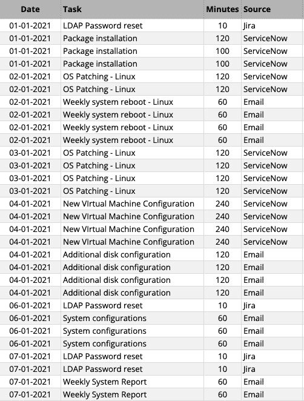

图 5.1 – 示例任务报告

我们可以从图表中（*图 5.2*）看到最关键的任务，这些任务花费了系统工程师最多的时间和精力：

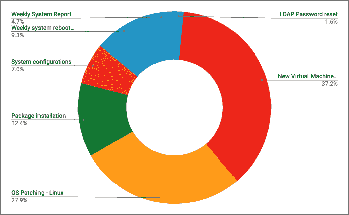

图 5.2 – 每周任务汇总

根据这个非常小的图表，我们几乎可以识别出需要自动化并节省时间的任务。

如果我们查看更多的细节，可以看到任务请求的来源（*图 5.3*）以及进一步的自动化范围和机会：

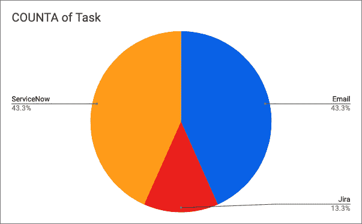

图 5.3 – 每周任务来源汇总

大多数 ITSM 工具可以与自动化工具集成，帮助我们从工具本身触发自动化执行。

## Ansible 和 ITSM

例如，当用户通过 ServiceNow 门户请求在 Linux 服务器上部署软件包时，您可以配置您的 Ansible Automation Platform，根据 ServiceNow 提供的输入细节触发软件包安装任务。在自动化任务完成后，Ansible 将结果返回到 ServiceNow 工单，创建工单的用户可以在无需等待工程师手动更新工单的情况下查看详细信息。

请注意，您需要使用 Ansible AWX 或 Red Hat **Ansible Automation Platform**（**AAP**）进行此集成，单独的 Ansible 控制节点无法实现这一点。

*图 5.4*展示了与 ITSM 工具和 Ansible AWX 或 Red Hat AAP 的简单集成。您将在*第十二章*《将 Ansible 与您的工具集成》中了解更多关于 Ansible 和 ITSM 工具集成的内容。

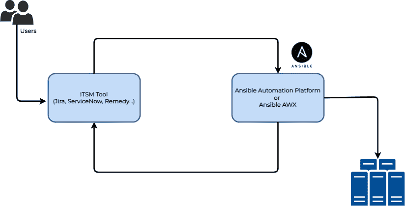

图 5.4 – Ansible 与 ITSM 工具的集成

ITSM 软件

ITSM 软件将帮助组织跟踪和管理其 IT 基础设施的操作、资源及其他相关使用情况：[`www.gartner.com/reviews/market/it-service-management-tools`](https://www.gartner.com/reviews/market/it-service-management-tools)。

## 自动化和信息技术基础设施库合规性

当我们谈论使用 ITSM 和自动化工具进行自动化操作时，利益相关者通常会提出关于**信息技术基础设施库**（**ITIL**）的实践和合规性问题。IT 自动化并不意味着您需要绕过组织的最佳实践或 ITIL 流程；相反，您是将那些需要人工手动反复执行的任务自动化。例如，您仍然需要在 ITSM 系统中遵循标准的变更审批流程，只有在请求获得批准执行后，工具才会触发自动化操作。

在本节中，我们了解了一些简单的方法来从工作空间中找出自动化使用场景。您可以将复杂的操作拆分为小任务，并从简单的自动化使用场景开始。我们将在下一节中学习如何研究这些使用场景并将其转化为自动化候选项。

# 自动化的可行性和可用性

我们都需要明白，并非所有的使用场景或重复性工作都适合自动化。我们需要研究并确认是否可以使用 Ansible 自动化来实现这些任务。

一旦找到了使用场景，您可以通过提问自己一些问题来了解自动化使用场景的可行性和可用性。

## 这个使用场景有多复杂？

您需要考虑您要自动化的使用场景或工作流的复杂性。如果使用场景过于复杂，您可以将其拆分为更小的使用场景。为了避免任何可能的延迟或障碍，您需要从较小的使用场景开始。

例如，如果您想自动化 Linux**操作系统**（**OS**）的补丁任务，您可以将工作拆分为多个使用场景，如下所示：

1.  拍摄虚拟机快照。

1.  备份配置。

1.  操作系统补丁任务。

1.  补丁安装和重启后验证操作系统。

1.  在出现故障时恢复快照。

通过这样做，您将更有信心开始自动化之旅，同时，团队中的不同成员也可以在自己的专业领域作出贡献。

## 我可以减少人为错误吗？

想一想通过为某个使用场景实现自动化，我们能避免多少人为失误。如果任务包含多个步骤，工程师在执行任务时很有可能会遗漏某些步骤或在输入过程中出现拼写错误。这类任务是自动化的好候选项，因为使用自动化工作流时，您无需担心错误和拼写问题。

例如，假设您有一个任务需要部署一个数据库集群，其中有数百个步骤，部分步骤如下：

1.  为集群节点配置 IP 地址。

1.  在集群节点上安装多个包。

1.  在节点上配置多个文件。

1.  配置集群和心跳。

1.  配置虚拟 IP 和虚拟接口等。

在这种情况下，你可以开发 Ansible 剧本来覆盖每一个任务，从而节省大量的时间和精力。

## 我可以减少部署时间并加快任务速度吗？

自动化可以提高任务、部署和交付的速度，这是一个经过验证的事实。自动化能够显著减少操作所需的时间，因为一个触发器就能完成整个工作流程，工程师无需观察监视器或控制台的错误和状态更新。

所以，你应该问自己关于使用场景的问题，并考虑通过自动化这个任务是否能够节省时间。

例如，如果你使用 Ansible 自动化操作系统补丁任务，你只需通过一个命令触发数百台服务器的补丁更新，然后等待任务完成。你不需要登录到不同的服务器，切换控制台，收集日志或记录事件的时间。你可以将每个任务包含在 Ansible 剧本中，并收集摘要或报告以供后续审核使用。

## 我执行这个任务的频率有多高？

如果任务执行不频繁（例如，一年一次），那么为该任务开发自动化内容可能没什么用。但如果任务是针对多台服务器执行的，那么这个自动化用例就是有效的，也是一个很好的候选，因为在执行时，你将需要更少的资源，因为自动化将处理复杂的工作流程。

始终将手动任务所需的时间与开发 Ansible 剧本内容所需的时间进行比较。你还需要考虑当前任务可能因为资源不可用或任务复杂性较高而执行得不那么频繁。通过自动化这些任务，你可以提高任务的执行频率，因为使用 Ansible 剧本执行任务时所需的努力更少。

例如，假设你需要管理成千上万台服务器，而由于团队规模较小，操作系统补丁每 6 个月只能更新一次，而且我们都知道工程师需要花费几个小时才能完成单台服务器的补丁更新。由于操作系统补丁任务的复杂性和关键性，你只能在非工作时间（通常是周末）进行操作，并且你需要安排工程师在周末轮流进行这项工作。如果你能通过 Ansible 自动化这个任务，工程师将花费更少的时间，你几乎可以每个月或在需要时随时进行操作系统补丁更新。

## 我通过自动化这个任务可以节省多少时间？

考虑是否自动化可以帮助节省一些时间，并帮助工程师专注于改进他们的工作流程。对于某些任务，工程师需要坐在工作站前，直到任务达到特定阶段，并且无论工作时间如何，他们都需要交互式地完成任务。

例如，对于每周的系统重启任务，你需要等待系统启动并正常运行，然后才能集中精力处理工作流中的下一个机器。Ansible 可以帮助你自动化这个重启、验证和系统恢复过程，以应对紧急情况。你可以在并行或串行工作流中安排任务，而不必等待某台机器完成重启活动。

## 我能节省一些钱吗？

从技术角度来看，这并不是主要原因，但降低成本是组织寻求自动化其 IT 和应用基础设施的最常见原因之一。你可以将节省的成本与节省的时间一起评估，因为工程师将花更多时间在改进和更好的实践上，而不是重复处理相同的工作。此外，减少人为错误将有助于减少服务中断，从而减少组织的成本。

你可以根据你组织的需求，在使用案例选择标准和评估中添加更多事实和问题。

在下一部分中，我们将学习如何在 Ansible 清单中组织和存储受管节点信息，以及需要遵循的不同最佳实践。

# 在自动化过程中涉及团队

一个常见的误解是，寻找使用案例并实施自动化的责任仅仅落在系统团队、平台团队或基础设施团队身上。当我们探索我们的工作环境和日常任务时，我们会发现有成千上万的任务可以使用 Ansible 自动化。可能是数据库团队管理数据库服务器和实例，网络团队处理网络操作，或者应用团队希望更有效地部署其应用程序更新。在环境中实施自动化是一个协作过程，我们需要来自不同团队的支持和指导。

例如，典型的数据库配置步骤可以在 *图 5.5* 中看到：

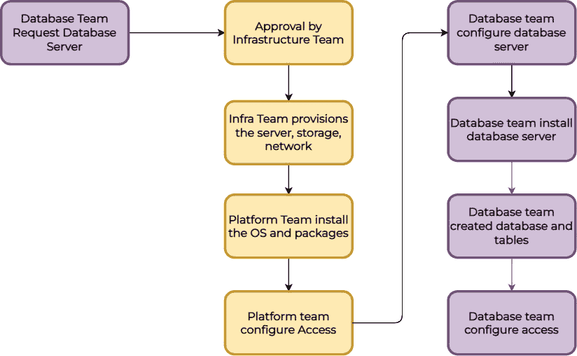

图 5.5 – 典型的数据库配置任务

在 *图 5.5* 中列出的许多任务都可以使用 Ansible 自动化，并且工作流可以在几分钟内完成，而不是几天或几周。数据库团队需要分享更多关于数据库操作和自动化机会的见解，因为他们是数据库相关主题的 **主题专家** (**SMEs**)。

我们有关于使用 Ansible 学习数据库自动化的详细章节，你可以在 *第八章* 中找到，*帮助数据库团队实现自动化*。

我们可以以 Windows 服务器自动化为例，因为总有一种误解，认为 Ansible 仅适用于 Linux，不能用于 Windows 服务器自动化。这是不正确的，Ansible 可以用于自动化大多数 Windows 管理和操作。Ansible Windows 集合中大约有 100 个模块，可以通过 Ansible Galaxy 下载，地址如下：

+   `community.windows` – [`galaxy.ansible.com/community/windows`](https://galaxy.ansible.com/community/windows)

+   `Ansible.windows` – [`galaxy.ansible.com/ansible/windows`](https://galaxy.ansible.com/ansible/windows%20)

请参阅*图 5.6*，了解 Windows 中典型的用户创建工作：

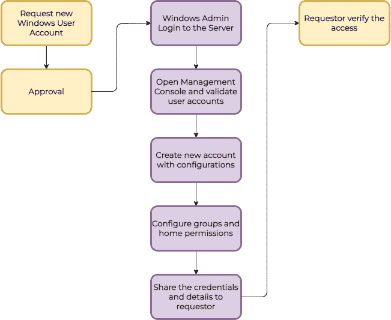

图 5.6 – Windows 用户创建工作流

整个工作流可以通过 Ansible playbook 中的几个任务进行自动化，Windows 团队可以在环境中的数千台服务器上重用相同的自动化工件。作为 Ansible 内容开发人员，你可以与 Windows 平台团队合作，找到更多类似的使用案例来实施自动化。你将在*第六章*中了解更多关于 Windows 自动化的内容，*自动化 Microsoft Windows 和网络设备*。

让我们再探讨一个云平台团队面临的使用案例机会和挑战。当你将 Ansible 自动化引入到管理公共或私有云的云平台团队时，他们总是会面临一个两难问题——如何在虚拟机、磁盘、网络等方面频繁变化时，每次更新 Ansible 清单中的受管节点信息。在接下来的章节中，我们将学习如何使用动态清单插件处理 Ansible 清单中大量动态管理的节点。

# Ansible 动态清单

当节点数量较少或资产集几乎固定时（如不经常重建的裸金属服务器或虚拟机），在静态清单文件中管理受管节点信息是容易的。但如果你的环境包含许多动态节点，如多个公共或私有云平台上的虚拟机、Kubernetes 或 OpenShift 平台上的节点，那么将受管节点信息保存在静态文件中就会变得困难，因为你需要跟踪这些变化并将其更新到清单文件中，包括 IP 地址、登录凭证等。在这种情况下，你可以使用 Ansible 中的**动态清单**功能，基本上是一些自定义脚本和清单插件，从这些虚拟化或容器平台收集清单信息。

当你将动态库存传递给 Ansible 时，库存插件将被执行，并将从你的虚拟化平台收集受管节点的详细信息。这些信息将作为常规库存数据传递给 Ansible，Ansible 将根据节点选择为这些受管节点执行自动化任务。

你可以为任何受支持的平台使用动态库存插件，例如 VMware、OpenStack、AWS、Azure、GCP，或者来自其他容器平台（如 Kubernetes、OpenShift 等），如*图 5.7*所示：

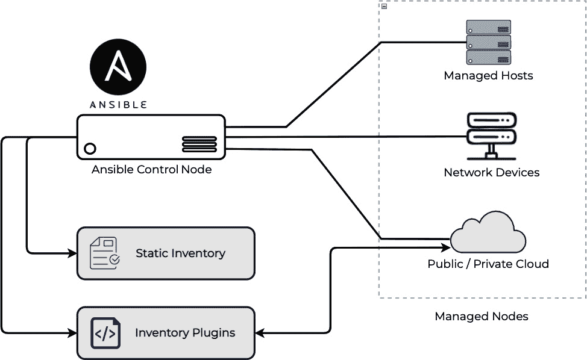

图 5.7 – Ansible 静态和动态库存

你可以按如下方式列出所有可用的动态插件：

```
[ansible@ansible inventories]$ ansible-doc -t inventory -l 
```

请注意，如果你安装了额外的 Ansible 集合，你将看到更多的库存插件，因为某些集合可能也包含库存插件。

Ansible 库存插件

欲了解更多有关 Ansible 库存插件的详细信息，可以访问[`docs.ansible.com/ansible/latest/plugins/inventory.xhtml`](https://docs.ansible.com/ansible/latest/plugins/inventory.xhtml)。旧版动态库存脚本可在[`docs.ansible.com/ansible/latest/user_guide/intro_dynamic_inventory.xhtml`](https://docs.ansible.com/ansible/latest/user_guide/intro_dynamic_inventory.xhtml) 和 [`github.com/ansible/ansible/tree/stable-2.9/contrib/inventory`](https://github.com/ansible/ansible/tree/stable-2.9/contrib/inventory) 查找。

## 使用 Ansible 动态库存与 AWS

在本次练习中，你将学习如何安装 Ansible 集合，以及如何使用 Ansible 库存插件管理 AWS 云。你将使用`amazon.aws`集合中提供的默认 AWS 库存插件。

### 假设条件

我们假设以下内容：

+   你有一个 AWS 账户（免费套餐足以完成本练习）。

+   你具备基本的 AWS 平台知识，足以创建新用户和 EC2 实例。

### 安装 AWS 集合和库

首先，我们需要在使用库存插件之前安装所需的 Ansible 集合和插件：

1.  配置`ansible.cfg`文件中的集合路径。默认情况下，`ansible-galaxy`会将 Ansible 集合（和角色）安装到默认路径，这个路径位于你的主目录下（例如，`/home/ansible/.ansible/collections/ansible_collections`）。在这种情况下，我们将告诉 Ansible 将集合安装到一个特定路径，以便更好地进行管理。请在`ansible.cfg`文件中配置`COLLECTIONS_PATHS`行：

    ```
    [defaults]
    inventory = ./hosts 
    remote_user = devops
    ask_pass = false       
    COLLECTIONS_PATHS = ./collections
    ```

1.  使用`ansible-galaxy`命令安装`amazon.aws`集合：

    ```
    [ansible@ansible Chapter-05]$ ansible-galaxy collection install amazon.aws
    ```

1.  验证已安装的集合：

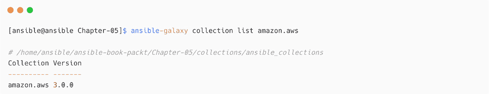

图 5.8 – 已安装 Ansible AWS 集合

你可以看到该集合已安装在你的`PROJECT_DIRECTORY/collections`路径中。

1.  验证已安装的 AWS 库存插件：

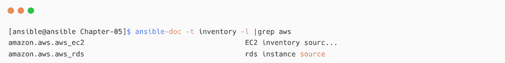

图 5.9 – AWS 清单插件

1.  安装 `python3-boto3` 包。AWS 模块和插件要求系统中必须有 `boto3` 包：

    ```
    [ansible@ansible Chapter-05]$ sudo dnf install python3-boto3
    ```

如果您的 Ansible 是通过 Python 安装的，那么可以使用 `pip install boto3` 命令安装 `boto3`。

安装 Ansible AWS 集合后，您需要创建一个用于 Ansible 访问 AWS 平台的 AWS 用户。

如果您使用的是 Ansible 自动化平台的自动化执行环境，那么所有的依赖项和库可以打包在执行环境镜像中。详情请参见 [`www.ansible.com/products/execution-environments`](https://www.ansible.com/products/execution-environments)。

### 创建 AWS 用户和凭证

要使 AWS `ec2` 清单插件访问您的 AWS 账户，您需要使用标准方法配置 AWS 凭证，如*图 5.10*所示：

1.  转到**AWS 控制台** | **IAM** | **用户** | **添加用户**并选择**程序访问**：

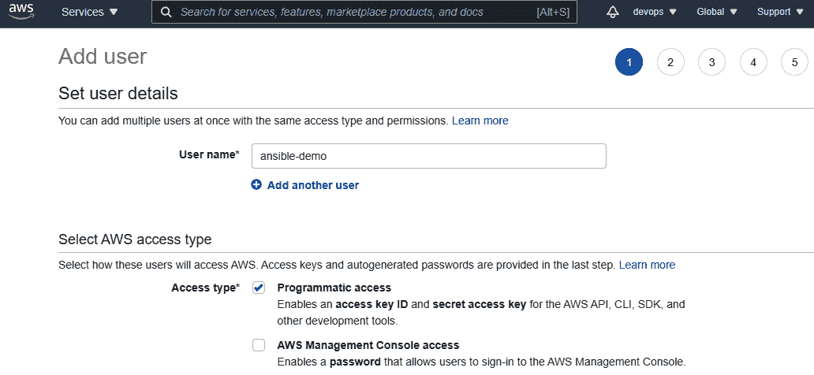

图 5.10 – 创建具有编程访问权限的 AWS 用户

1.  为新用户添加适当的权限（不要授予用户**AdministratorAccess**权限，以免影响生产账户），如*图 5.11*所示：

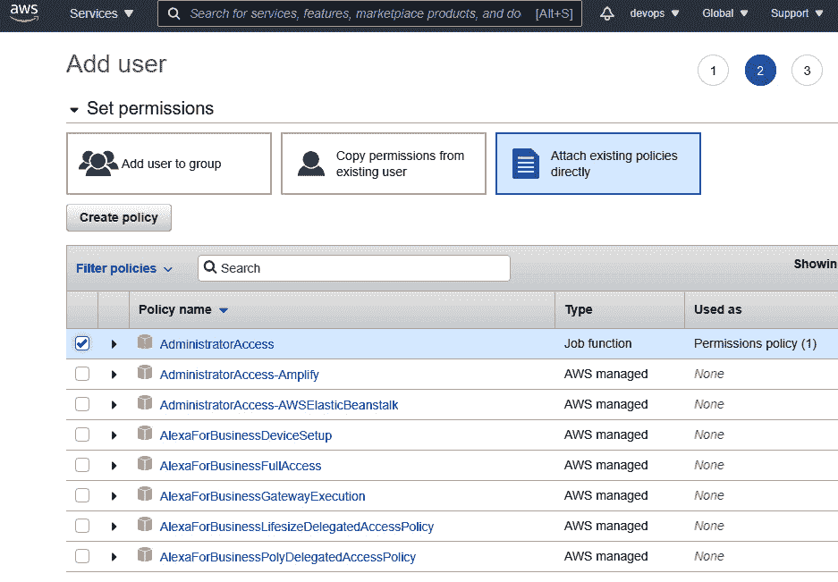

图 5.11 – 为新 AWS 用户应用权限

1.  如果需要，添加**标签**并点击**创建用户**。请记得复制**访问密钥 ID**和**秘密访问密钥**，如*图 5.12*所示，因为我们在接下来的步骤中需要这些信息。

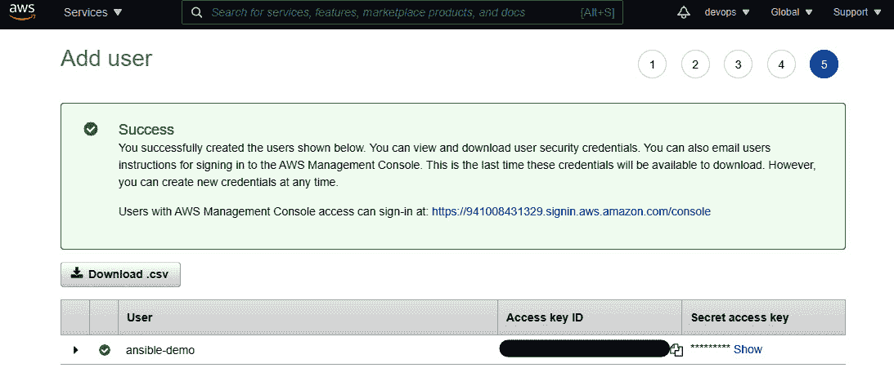

图 5.12 – AWS 用户访问密钥 ID 和秘密访问密钥

创建用户账户后，您需要在 Ansible 控制节点上配置访问密钥和秘密访问密钥。

### 在 Ansible 控制节点上配置 AWS 凭证

现在，您需要在控制节点上配置 AWS 凭证信息：

1.  在您的 Ansible 控制节点机器上添加新的 AWS 凭证。如果您有多个凭证，则按照以下方式将其作为新配置文件添加（例如，`default` 和 `ansible` 配置文件）：

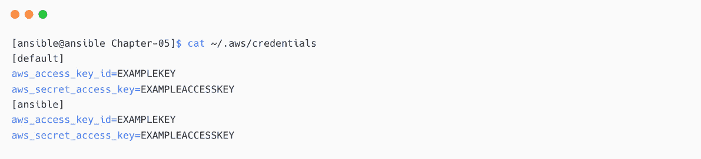

图 5.13 – AWS 配置文件设置

1.  按照如下方式更新 `config` 文件：


图 5.14 – AWS 配置文件

请记得在接下来的步骤中使用正确的 AWS 配置文件名称（在我们的示例中为 `ansible`）。

### 使用 AWS aws_ec2 清单插件

配置完 AWS 凭证后，您可以开始测试动态清单插件：

1.  创建一个包含 `ec2` 插件信息的清单文件。我们还将包含过滤 `ec2` 实例的位置信息：

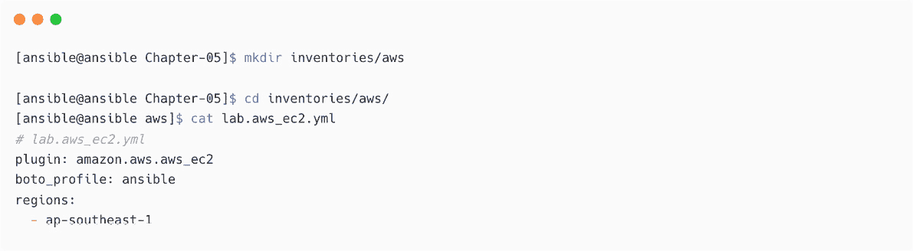

图 5.15 – AWS ec2 实例的清单文件

1.  通过传递清单位置（`inventories/aws/`）来验证动态清单插件：

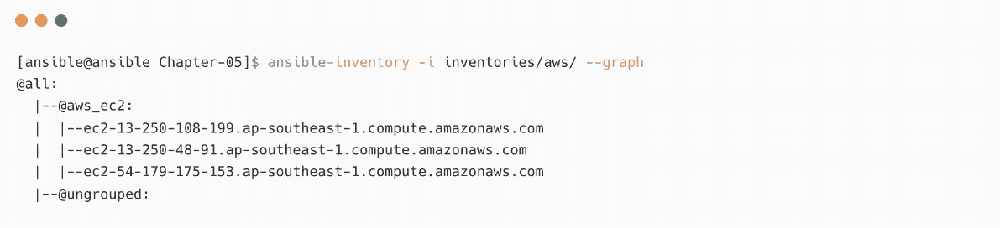

图 5.16 – 验证 AWS 动态清单

动态清单插件将使用你在之前步骤中配置的账户访问 AWS 平台，并以 Ansible 可以读取并用于执行的格式返回结果。（我们使用了`--graph`选项来查看概览，但你也可以使用其他选项，如`--list`。）

1.  你可以通过标签和主机名添加更多的过滤器，如下所示：

    ```
    filters:
      tag:Environment: dev
      tag:Criticality:
        - low
    ```

1.  插件将根据你在清单 YAML 文件中配置的过滤器返回结果：

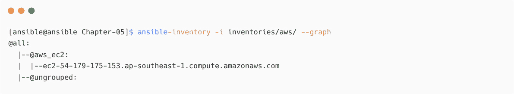

图 5.17 – 带有附加过滤器的 AWS 动态清单

1.  如果你已经配置了`ec2`实例（使用 AWS `ec2` 模板或其他方法），那么你现在可以测试访问：

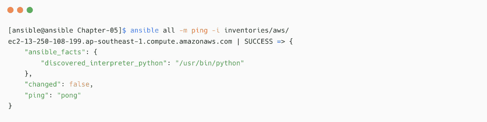

图 5.18 – 使用 AWS 动态清单进行 Ansible ping 测试

安全外壳（SSH）

SSH 是一种加密网络协议，帮助用户以安全的方式访问目标系统。阅读 [`www.techtarget.com/searchsecurity/definition/Secure-Shell`](https://www.techtarget.com/searchsecurity/definition/Secure-Shell) 了解更多关于 SSH 的信息。

在前面的练习中，你已经学会了如何使用 Ansible 动态清单插件，并在没有将受管节点信息添加到任何静态文件中的情况下使用清单。对于所有其他云平台和容器平台，这个过程大致相同，因为你通常可以找到并使用合适的清单插件来实现它们的动态清单。

Ansible 清单插件选项

查看官方文档以获取清单插件的附加选项和过滤器：[`docs.ansible.com/ansible/latest/plugins/inventory.xhtml`](https://docs.ansible.com/ansible/latest/plugins/inventory.xhtml) 和 [`docs.ansible.com/ansible/latest/collections/amazon/aws/aws_ec2_inventory.xhtml`](https://docs.ansible.com/ansible/latest/collections/amazon/aws/aws_ec2_inventory.xhtml) 以及 [`docs.ansible.com/ansible/latest/user_guide/playbooks_variables.xhtml#understanding-variable-precedence`](https://docs.ansible.com/ansible/latest/user_guide/playbooks_variables.xhtml#understanding-variable-precedence)。

# 总结

在本章中，你已经学习了如何在工作场所中找到自动化使用案例，并确定这些自动化使用案例的可行性和可用性。你还探索了团队间合作在实施更好自动化使用案例中的重要性。稍后，你学习了如何使用 Ansible 动态清单，并练习了如何使用 AWS `ec2` 清单插件的 Ansible 清单插件。

在下一章中，我们将学习 Windows 自动化的基础知识以及可用的远程连接方法。我们还将通过实践部分学习使用 Ansible 进行网络自动化的基础知识。

# 进一步阅读

要了解本章涉及的更多主题，请访问以下链接：

+   *Ansible ServiceNow 集合*: [`github.com/ansible-collections/servicenow.itsm`](https://github.com/ansible-collections/servicenow.itsm)

+   *使用 Red Hat Ansible 自动化平台自动化 ServiceNow*: [`www.ansible.com/blog/certified-collection-servicenow`](https://www.ansible.com/blog/certified-collection-servicenow)

+   *Ansible 使用案例*: [`www.ansible.com/use-cases`](https://www.ansible.com/use-cases)

+   *如何构建你的库存*: [`docs.ansible.com/ansible/latest/user_guide/intro_inventory.xhtml`](https://docs.ansible.com/ansible/latest/user_guide/intro_inventory.xhtml)

+   *库存技巧*: [`docs.ansible.com/ansible/latest/user_guide/playbooks_best_practices.xhtml#inventory-tips`](https://docs.ansible.com/ansible/latest/user_guide/playbooks_best_practices.xhtml#inventory-tips)

+   *使用动态库存*: [`docs.ansible.com/ansible/latest/user_guide/intro_dynamic_inventory.xhtml`](https://docs.ansible.com/ansible/latest/user_guide/intro_dynamic_inventory.xhtml)

+   *Ansible AWS 集合*: [`docs.ansible.com/ansible/latest/collections/amazon/aws/index.xhtml`](https://docs.ansible.com/ansible/latest/collections/amazon/aws/index.xhtml)

+   *Ansible 与 Windows*: [`www.ansible.com/for/windows`](https://www.ansible.com/for/windows)

+   *Ansible Windows 指南*: [`docs.ansible.com/ansible/latest/user_guide/windows.xhtml`](https://docs.ansible.com/ansible/latest/user_guide/windows.xhtml)
