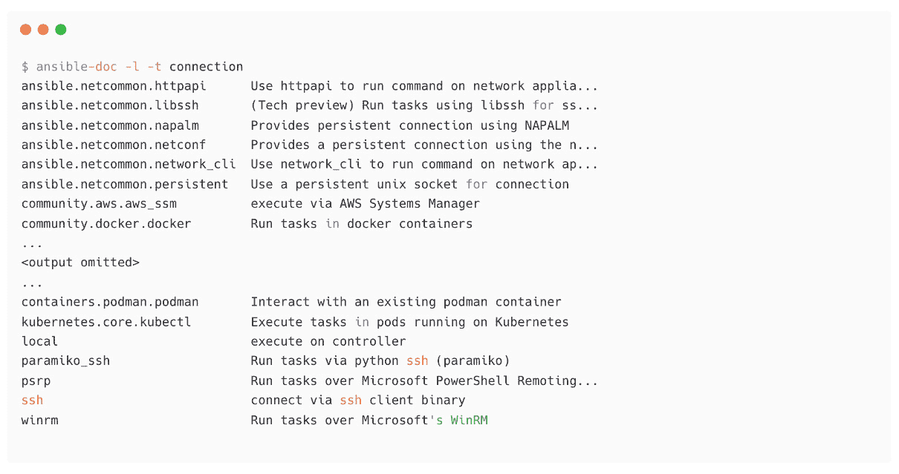
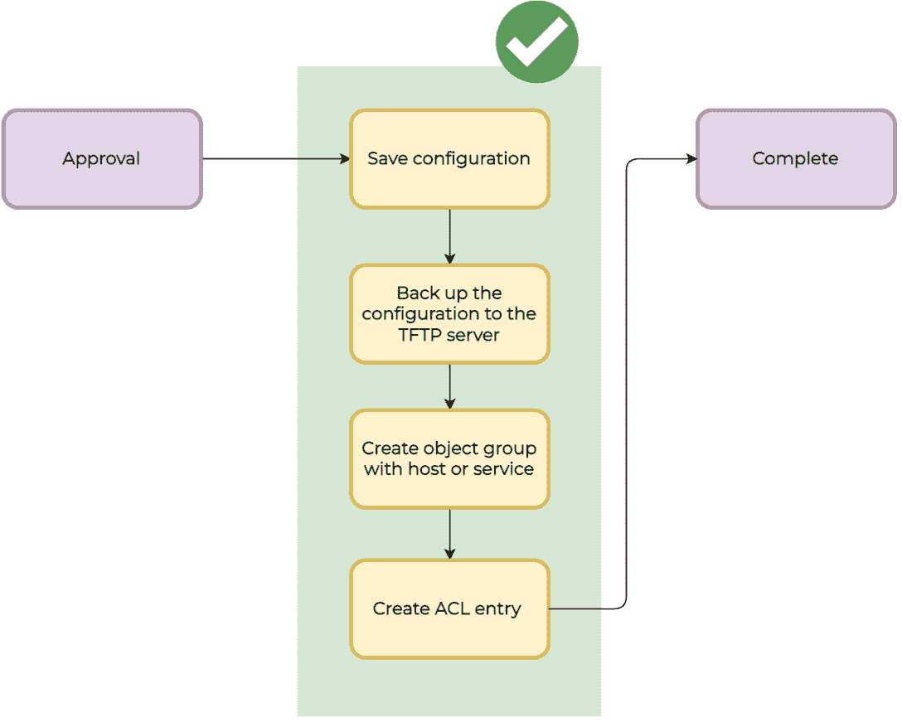

# 6

# 使用 Ansible 自动化 Microsoft Windows 和网络设备

由于技术的复杂性和广泛的多样性，信息技术领域没有一种适合所有的工具。这在自动化软件中同样适用，但幸运的是，由于大量的社区支持和提供这些服务的供应商的贡献（如云平台、网络设备和软件平台），Ansible 可以用于大多数 IT 自动化用例。

当我们谈论基本系统自动化时，我们知道使用 Ansible 自动化 Linux 机器有多么容易。然而，我们也可以同样地对 Microsoft Windows 机器进行自动化。有社区集合和认证内容集合用于管理 Microsoft Windows 操作，如用户管理、防火墙、系统管理、软件包管理和注册表配置。

同样地，我们通过不同的集合拥有数千个模块，用于管理诸如 Cisco、FortiGate、Palo Alto、VyOS、F5 和 CheckPoint 等网络设备。为了熟悉网络自动化，我们将讨论 VyOS 和 Cisco ASA 设备的网络连接方法和配置。

在本章中，我们将涵盖以下主题：

+   Ansible 远程连接方法

+   使用 Ansible 自动化 Microsoft Windows 服务器

+   网络自动化简介

+   使用 Ansible 收集 VyOS 信息

+   在 Cisco ASA 设备中创建 ACL 条目

首先，您将了解 Ansible 中可用的不同连接方法。然后，您将学习如何使用 Ansible 配置和自动化 Microsoft Windows 任务。最后，您将学习如何使用 Ansible 进行网络自动化。

# 技术要求

本章的技术要求如下：

+   一个用作 Ansible 控制节点的 Linux 机器

+   一个或多个作为受管节点的 Linux 机器，并配置了 Red Hat 仓库（如果您使用非 RHEL 机器，则确保配置了适当的仓库以获取软件包和更新）

+   一个或多个 Microsoft Windows 机器（我们使用了 Windows 2019 服务器）

+   一个或多个网络设备/虚拟设备（用于实践本章的网络自动化用例）

+   包括用户创建和软件包管理在内的 Microsoft Windows 机器基础管理知识

+   包括 IP 配置和访问配置在内的网络设备基础管理知识

本章的所有 Ansible 代码、playbook、命令和片段均可在本书的 GitHub 代码库中找到：[`github.com/PacktPublishing/Ansible-for-Real-life-Automation/tree/main/Chapter-06`](https://github.com/PacktPublishing/Ansible-for-Real-life-Automation/tree/main/Chapter-06)。

# Ansible 远程连接方法

默认情况下，Ansible 使用 SSH 协议（本地 OpenSSH）与远程机器进行通信，正如你在本书中前面所学到的。对于没有 SSH 服务器选项的远程节点，可以使用其他连接方法，如 Microsoft Windows 远程机器的 WinRM，或基于 API 的远程设备（如 Cisco NXAPI 和 Arista eAPI）的**httpapi**。

下图展示了 Ansible 用于自动化不同设备和平台的不同连接方法：


图 6.1 – Ansible 使用的连接方法

你可以找到可用的 Ansible `ansible-doc`命令，如下所示：



图 6.2 – Ansible 连接插件

Ansible 清单和连接参数

请参考[`docs.ansible.com/ansible/latest/user_guide/intro_inventory.xhtml#connecting-to-hosts-behavioral-inventory-parameters`](https://docs.ansible.com/ansible/latest/user_guide/intro_inventory.xhtml#connecting-to-hosts-behavioral-inventory-parameters)，了解 SSH、Docker 等连接的具体连接参数。

在你的 Ansible 控制节点上的连接插件数量将取决于你所使用的 Ansible 集合，因为默认情况下，Ansible 只提供少量的连接选项，如`ssh`、`winrm`、`local`等。其余的连接插件来自你已安装的 Ansible 集合。

你还可以查看关于`ansible-doc`命令的详细信息，如下所示：


图 6.3 – Docker 连接插件的详细信息

在前面的输出中，我们可以看到关于`community.docker.docker`连接插件的详细信息，包括它的使用方式。

你将在下一节中学到更多关于 Ansible 连接变量和可用选项的内容。

## Ansible 连接变量

你可以通过 Ansible 清单参数和其他变量来控制远程连接的详细信息。更多关于 Ansible 特殊变量的内容，请参考文档：[`docs.ansible.com/ansible/latest/reference_appendices/special_variables.xhtml`](https://docs.ansible.com/ansible/latest/reference_appendices/special_variables.xhtml)。以下截图显示了清单变量部分。这里提到了不同的远程连接详细信息，如`ansible_connection`、`ansible_port`和`ansible_user`：


图 6.4 – Ansible 清单变量与特殊变量

可以配置不同的值和变量，如下所示：

+   `ansible_connection`：指定要使用的连接类型，如`ssh`、`local`（用于`localhost`节点）、`winrm`或`docker`：

    ```
    # inventory
    [local]
    localhost ansible_connection=local
    [web]
    node1 
    [windows]
    Win2019 ansible_connection: “winrm”
    ```

+   `ansible_host`：如果远程节点的名称或 IP 地址与清单中的名称不同，则使用实际的名称或 IP 地址。

+   `ansible_user`：用于远程节点身份验证的用户账户。

+   `ansible_password`：用于 `ansible_user` 身份验证的密码。请注意，保持 `ansible_password` 为明文密码并不是最佳实践；你应考虑使用 Ansible Vault 对其进行加密（请参阅 *第三章*，*自动化你的日常工作*，以及 *使用 Ansible Vault 加密敏感数据* 部分，和 *第十三章*，*使用 Ansible 进行密钥管理*），或者采用基于 SSH 密钥的身份验证（参见 *第一章*，*配置你的托管节点* 部分）。

+   `ansible_port`：如果远程连接端口不是 `22`（默认 SSH 端口），则需要指定用于远程连接的端口号。

在接下来的章节中，我们将学习关于 SSH 连接参数及如何为托管节点配置它。

## SSH 连接参数

此外，还存在一些 SSH 特定变量，如 `ansible_ssh_private_key_file` 和 `ansible_ssh_common_args`，用于为不同的托管节点分配不同的 SSH 密钥（如果需要）：


图 6.5 – Ansible SSH 特定变量

到此，你已经了解了可用于控制连接的 Ansible 连接方法和连接参数。现在，让我们学习如何使用 Ansible 自动化 Microsoft Windows 服务器。

# 使用 Ansible 自动化 Microsoft Windows 服务器

如我之前提到的，Ansible 仅适用于 Linux/Unix 平台，但这并不意味着你不能使用 Ansible 来自动化 Microsoft Windows 机器。你可以在 Linux/Unix 机器（即 Ansible 控制节点）上使用 Ansible，像这样自动化你的 Microsoft Windows 机器：


图 6.6 – Ansible 和托管节点

可以使用多个 Ansible **内容集合**来进行 Microsoft Windows 自动化。总共有超过 100 个 Ansible 模块可用于自动化 Microsoft Windows 任务：

+   来自社区的 Ansible Windows 模块 ([`galaxy.ansible.com/community/windows`](https://galaxy.ansible.com/community/windows)) 包含 84 个模块。

+   Red Hat 提供的 Ansible Windows 模块 ([`galaxy.ansible.com/ansible/windows`](https://galaxy.ansible.com/ansible/windows)) 包含 40 个模块。

在接下来的几节中，你将进一步了解 Ansible Windows 自动化，如支持的 Microsoft Windows 版本、前提条件、凭据配置以及库存配置。

Ansible Windows 指南

官方 Ansible 文档门户提供了如何配置和设置 Microsoft Windows 机器以便使用 Ansible 进行自动化的详细信息。请参考 [`docs.ansible.com/ansible/latest/user_guide/windows.xhtml`](https://docs.ansible.com/ansible/latest/user_guide/windows.xhtml) 和 [`www.techbeatly.com/ansible-windows`](https://www.techbeatly.com/ansible-windows) 获取更多信息。

## 支持的 Microsoft Windows 操作系统

Ansible 可以管理大多数通用的 Microsoft Windows 操作系统版本，如下所示：

+   Microsoft Windows 7

+   Microsoft Windows 8.1

+   Microsoft Windows 10

+   Microsoft Windows Server 2008

+   Microsoft Windows Server 2008 R2

+   Microsoft Windows Server 2012

+   Microsoft Windows Server 2012 R2

+   Microsoft Windows Server 2016

+   Microsoft Windows Server 2019

## Microsoft Windows 自动化 – Ansible 控制节点的先决条件

对于 Ansible 控制节点，没有特殊要求，只需安装 Python `pywinrm` 库，安装方法如下：

1.  如果您正在使用 Python 虚拟环境，请记得激活虚拟环境（如果不是，则跳过此步骤）：

    ```
    $ source ~/python-venv/ansible210/bin/activate
    ```

1.  安装 `pywinrm` 库：

    ```
    $ python3 -m pip install --user --ignore-installed pywinrm
    ```

确保在 Ansible 使用的 Python 环境中安装了 `pywinrm` 库（检查 `ansible --version` 以查看它使用的 Python 版本）。

## Microsoft Windows 自动化 – 被管理节点的先决条件

Microsoft Windows 机器应安装并配置以下项：

+   PowerShell 3.0 或更新版本（某些 Ansible 模块需要更新版本的 PowerShell，具体要求请参考所用模块的文档）。

+   .NET 4.0 或更新版本。

+   应该创建并启用 **WinRM** 监听器 – Ansible 默认使用 WinRM 连接到 Microsoft Windows 机器。Microsoft Windows 远程管理（WinRM）是一个基于 SOAP 的远程管理协议，通过 HTTP 或 HTTPS 进行通信。

+   应配置 Microsoft Windows 防火墙，允许通过 `5985`（HTTP）和/或 `5986`（HTTPS）端口的流量。如果 Ansible 控制节点与 Microsoft Windows 机器之间存在额外的防火墙或网络流量控制，请确保相应端口也被允许。

## 配置 Microsoft Windows 机器上的用户帐户和 WinRM

在本练习中，您将配置 Microsoft Windows 机器上的用户和 WinRM：

1.  登录到 Microsoft Windows 机器并创建一个名为 `ansible` 的新用户。使用任意方法创建此用户：

注意

可以使用默认的 `Administrator` 用户组成员身份来演示自动化而不会遇到问题。有关如何管理 Windows Server 用户帐户的详细信息，请参阅文档 [`docs.microsoft.com/en-us/windows-server-essentials/manage/manage-user-accounts-in-windows-server-essentials`](https://docs.microsoft.com/en-us/windows-server-essentials/manage/manage-user-accounts-in-windows-server-essentials)。


图 6.7 – 在 Microsoft Windows 服务器上创建新用户帐户

1.  类似于 Linux 中的 `sudo` 权限，你需要为从 Ansible 连接到 Microsoft Windows 机器的 Microsoft Windows 用户提供管理员权限。将新的 `ansible` 用户添加到**管理员**组，如下所示：


图 6.8 – 将 Ansible 用户添加到管理员组

1.  使用 `(Get-Host).Version` 命令验证 PowerShell 版本：


图 6.9 – 检查 PowerShell 版本

1.  下一步是配置 WinRM 侦听器并启用 Microsoft Windows 管理节点上的 WinRM 服务。你可以使用 Ansible `ConfigureRemotingForAnsible.ps1` 仓库中现成的脚本，而不必在 PowerShell 中执行多个命令 ([`github.com/ansible/ansible/blob/devel/examples/scripts/ConfigureRemotingForAnsible.ps1`](https://github.com/ansible/ansible/blob/devel/examples/scripts/ConfigureRemotingForAnsible.ps1))。

下载脚本并在 Microsoft Windows 机器上执行，如下所示：


图 6.10 – 使用脚本在 Microsoft Windows 机器上配置 WinRM

如果你的 Microsoft Windows 机器位于离线环境中，可以从其他机器下载脚本并将其传输到 Microsoft Windows 机器。

1.  在脚本成功执行后，使用 `winrm e winrm/config/listener` 命令验证 WinRM 配置：


图 6.11 – 验证 WinRM 配置

1.  然后使用`winrm get winrm/config`命令验证 WinRM 配置。

1.  验证来自 Ansible 控制节点的端口访问：


图 6.12 – 使用 WinRM 验证 Ansible 与 Microsoft Windows 的连接

配置你的 Microsoft Windows 主机以便由 Ansible 管理

请参考[`www.techbeatly.com/configure-your-windows-host-to-manage-by-ansible/`](https://www.techbeatly.com/configure-your-windows-host-to-manage-by-ansible/) 或 [`docs.ansible.com/ansible/latest/user_guide/windows_winrm.xhtml`](https://docs.ansible.com/ansible/latest/user_guide/windows_winrm.xhtml) 以获取更多资料。

现在，Microsoft Windows 管理节点已准备好通过 WinRM 连接。接下来，你需要在 Ansible 端配置这些细节。在下一节中，你将学习如何配置 Ansible 清单以连接到 Microsoft Windows 管理节点。

## 配置 Ansible 访问 Microsoft Windows 机器

在本练习中，您将为 Ansible 控制节点配置 Microsoft Windows 用户和其他访问详细信息：

1.  在 Ansible 清单中为 Microsoft Windows 创建主机条目（根据需要替换 IP 地址）：

    ```
    [windows]
    win2019 ansible_host=192.168.56.22
    ```

1.  创建一个目录用于 Ansible 组变量：

    ```
    [ansible@ansible Chapter-06]$ mkdir group_vars
    ```

1.  添加`group_vars/windows`组变量文件，以配置`ansible_connection`、`ansible_port`和用户凭据。这些是特殊变量；有关所有特殊变量，请参阅`ansible_`前缀（参阅[`docs.ansible.com/ansible/latest/reference_appendices/special_variables.xhtml`](https://docs.ansible.com/ansible/latest/reference_appendices/special_variables.xhtml)文档了解有关特殊变量的更多信息）：


图 6.13 – 用于 Windows 的 Ansible 组变量

*请注意，在关键环境中使用用户名和密码进行基本身份验证并不是最佳实践。对于生产环境和关键环境，建议使用通过 Ansible Vault 加密的密码，或将凭据保存在 Ansible 自动化控制器（或 Ansible Tower）中。此外，您可能需要创建一个与管理员不同的用户。您还应该考虑使用 SSL 证书和其他安全方法，从 Ansible 控制节点连接 Microsoft Windows 机器。*

使用 HTTPS 和 SSL 进行 Ansible Windows 管理

考虑使用 SSL 证书和其他安全方法，从 Ansible 控制节点（或自动化控制器）连接 Microsoft Windows 机器。请参考[`www.techbeatly.com/ansible-windows-management-using-https-and-ssl`](https://www.techbeatly.com/ansible-windows-management-using-https-and-ssl)了解更多信息。

1.  验证 Ansible 与 Microsoft Windows 机器的连接：


图 6.14 – 使用 win_ping 模块测试 Ansible 与 Microsoft Windows 的连接

与`ping`模块（用于 Linux 机器）类似，`win_ping`模块将建立与目标机器的连接，如果连接成功，将显示`pong`消息。

## Microsoft Windows 自动化 – 使用 Ansible 创建 Windows 用户

在本练习中，您将使用 Ansible 在 Microsoft Windows 机器上创建一个新用户：

1.  创建一个新的 Ansible playbook，命名为`Chapter-06/windows-create-user.yaml`，并添加以下详细信息：


图 6.15 – 用于在 Microsoft Windows 中创建用户的 Ansible playbook

1.  执行 Ansible playbook：


图 6.16 – 执行 Ansible playbook 以在 Microsoft Windows 中创建用户

将清单节点作为额外变量

在前面的 playbook 中，我们没有硬编码 `hosts` 信息，而是在执行 playbook 时传递了 `windows` 主机组。

1.  验证 Microsoft Windows 机器，查看用户是否已创建：


图 6.17 – 使用 Ansible 创建的新 Windows 用户账户

查找更多来自工作场所的 Microsoft Windows 自动化用例，例如包部署、组策略更新、Active Directory 操作、防火墙管理、服务管理，甚至执行 PowerShell 脚本。

Ansible 用于 Windows 自动化

请访问 [`www.ansible.com/for/windows`](https://www.ansible.com/for/windows) 了解更多关于 Ansible Windows 自动化的信息。访问 [`aap2.demoredhat.com/exercises/ansible_windows`](https://aap2.demoredhat.com/exercises/ansible_windows) 查找有关使用 Ansible 进行 Microsoft Windows 自动化的工作坊和实践课程。

在下一部分，你将学习使用 Ansible 进行网络自动化的基础知识。

# 网络自动化简介

使用 Ansible 进行网络自动化基于不同的连接方法。与 Linux/Unix 和 Microsoft Windows 自动化相比，Ansible 网络自动化有一些差异。同时，注意 Ansible 可以用于自动化现有的网络自动化工具，如使用可用的 Cisco ACI 模块自动化 Cisco ACI ([`docs.ansible.com/ansible/latest/scenario_guides/guide_aci.xhtml`](https://docs.ansible.com/ansible/latest/scenario_guides/guide_aci.xhtml))。

## 在 Ansible 控制节点上执行任务

之前，你已经学到 Ansible 是建立在 Python 之上的，因此必须在远程节点上安装 Python 才能执行自动化任务（Microsoft Windows 模块是用 PowerShell 编写的，必须设置 `winrm` 连接才能使用 PowerShell 模块）。与 Linux/Microsoft Windows 节点不同，许多网络设备没有 Python，无法运行 Python 脚本。因此，网络自动化模块会在 Ansible 控制节点中处理和执行；所有实际命令将在目标网络设备上执行。

## 不同的连接方法

网络任务执行可以支持多种通信方法，具体取决于网络设备的操作系统及其版本：


图 6.18 – Ansible 网络通信协议（来源：[`docs.ansible.com`](https://docs.ansible.com)）

你需要指定用于网络设备连接的适当方法、特权升级方法（`become_method`，如 `enable`）以及网络设备的操作系统，如下图所示：


图 6.19 – Ansible 网络设备清单

在前面的截图中，我们使用了以下内容：

+   `ansible_connection=ansible.netcommon.network_cli` 指定要使用的连接插件

+   `ansible_become_method=enable` 使用 `enable` 作为特权提升方法

+   `ansible_network_os=cisco.ios.ios` 表示网络设备的操作系统

网络通信协议

参阅 [`docs.ansible.com/ansible/latest/network/getting_started/network_differences.xhtml#multiple-communication-protocols`](https://docs.ansible.com/ansible/latest/network/getting_started/network_differences.xhtml#multiple-communication-protocols) 了解使用 Ansible 进行网络自动化时支持的不同通信协议。

在下一部分，你将学习如何创建一个 Ansible playbook，以收集来自 VyOS 网络设备的信息。

# 使用 Ansible 收集 VyOS 信息

这是一个可选练习，让你熟悉使用 Ansible 进行网络自动化。我们假设你已经掌握了在虚拟机中安装和配置 **VyOS** 设备的基本知识，并且可以使用你选择的虚拟化平台。

从 [`support.vyos.io/en/downloads`](https://support.vyos.io/en/downloads) 下载 VyOS 镜像，并将其安装为虚拟设备（更多细节请参考 VyOS 文档 https://support.vyos.io/en/kb）。

VyOS 网络操作系统

VyOS 是一个基于 Debian Linux 的开源网络操作系统。VyOS 提供了大部分网络功能，例如路由、**虚拟私人网络**（**VPNs**）、防火墙、**网络地址转换**（**NAT**）等。详情请参见 [`vyos.io`](https://vyos.io)。

在以下练习中，你将创建一个简单的 Ansible playbook，以从 VyOS 设备（或虚拟设备）收集操作系统信息：

1.  将 VyOS 虚拟机的详细信息添加到 Ansible 清单中：

    ```
    [ansible@ansible Chapter-06]$ mkdir inventories/
    [ansible@ansible Chapter-06]$ cd inventories/
    ```

1.  按如下方式更新清单：


图 6.20 – 使用 VyOS 设备信息更新 Ansible 清单

1.  创建一个名为 `Chapter-06/vyos-facts.yaml` 的 playbook 来收集 VyOS 事实：


图 6.21 – 用于从 VyOS 设备收集详细信息的 Ansible playbook

1.  执行 playbook，如下所示：


图 6.22 – VyOS 收集事实的 playbook 输出

1.  通过收集更多事实并使用你在*第三章*中学到的方法生成报告，扩展 playbook，*自动化你的日常工作*。

在下一部分，你将通过在 Cisco ASA 设备中创建 **访问控制列表**（**ACL**）条目来了解一些更高级的网络自动化使用案例。

# 在 Cisco ASA 设备中创建 ACL 条目

Cisco ASA 是一种安全设备，具备防火墙、病毒防护、入侵预防和 VPN 功能。请参考 [`www.cisco.com/c/en/us/products/security/adaptive-security-appliance-asa-software/index.xhtml`](https://www.cisco.com/c/en/us/products/security/adaptive-security-appliance-asa-software/index.xhtml) 了解更多关于 Cisco ASA 的信息。

Cisco ASA 集合 ([`galaxy.ansible.com/cisco/asa`](https://galaxy.ansible.com/cisco/asa)) 提供了模块和插件，用于自动化 Cisco ASA 操作。在本节中，您将学习如何使用 Cisco ASA 模块在 Cisco ASA 设备中创建 ACL 条目。

第一个任务是使用 `ansible-galaxy` 命令安装 Cisco ASA 集合，如下所示：

```
$ ansible-galaxy collection install cisco.asa
```

像您配置 VyOS 连接变量一样，您需要配置 Cisco ASA 设备的连接变量，如下所示：


图 6.23 – Cisco ASA 清单变量

和往常一样，记得使用 Ansible Vault（或 Ansible 自动化控制器中的凭证）加密密码，而不是将其作为明文值保存在文件中。另外，注意我们为 Cisco ASA 设备使用的连接变量，例如 `ansible_network_os=cisco.asa.asa` 和 `ansible_connection=ansible.netcommon.network_cli`。

一个典型的 ACL 条目创建任务包括多个步骤，如下图所示：



图 6.24 – Cisco ASA 的 ACL 条目创建步骤

遵循组织的政策和程序，执行标准的前置任务和后置任务。最佳实践是基于特定操作创建 Ansible 角色，例如创建对象组、备份配置或创建 ACL 条目。为了使这个过程更容易理解，我为本示例使用了一个单一的 Playbook，如下所示：


图 6.25 – 带变量的 Cisco ACL Playbook

在实际环境中，从仓库中的变量文件（作为事实源）获取这些变量（如 *图 6.25* 所示），或通过 Ansible 自动化控制器（或 Ansible Tower）中的调查表格收集它们。

向 Playbook 中添加任务，执行 *图 6.24* 中解释的步骤。

首先，您必须使用 `cisco.asa.asa_command` 模块将当前配置备份到 TFTP 服务器，如下所示：


图 6.26 – 使用 Playbook 任务备份 Cisco ASA

添加任务，使用 `cisco.asa.asa_ogs` 模块创建对象组，如下所示：


图 6.27 – 创建对象组的 Playbook 任务

最后，添加任务以使用 `cisco.asa.asa_acls` 模块创建 ACL 条目，如下所示：


图 6.28 – 创建 ACL 条目的剧本任务

执行剧本并验证任务是否已完成：


图 6.29 – Cisco ASA ACL 剧本执行

一旦剧本成功执行，请通过登录 Cisco ASA 设备来验证其详细信息。以下截图显示了示例输出：


图 6.30 – 从 Cisco ASA 设备控制台验证 ACL 条目的创建

然后，登录 TFTP 服务器并验证备份是否已从剧本任务中创建：


图 6.31 – 在 TFTP 服务器中验证配置备份

通过添加多个规则、对象组和其他备份方法，可以扩展此用例。有关更多信息，请参阅[`docs.ansible.com/ansible/latest/collections/cisco/asa/index.xhtml`](https://docs.ansible.com/ansible/latest/collections/cisco/asa/index.xhtml)中的 Cisco ASA 模块文档。

扩展你对其他网络设备的知识，例如 Cisco、Arista、Juniper Network 或 HPE 设备，但请记住使用适当的连接方法和参数。

网络自动化中的 Ansible

请参阅[`docs.ansible.com/ansible/latest/network/index.xhtml`](https://docs.ansible.com/ansible/latest/network/index.xhtml)中的文档，了解更多关于网络自动化基础知识的内容。还可以查看*网络入门*([`docs.ansible.com/ansible/latest/network/getting_started/index.xhtml`](https://docs.ansible.com/ansible/latest/network/getting_started/index.xhtml))，以开始配置网络自动化。

访问[`www.ansible.com/use-cases/network-automation?hsLang=en-us`](https://www.ansible.com/use-cases/network-automation?hsLang=en-us)了解更多关于 Red Hat Ansible 网络自动化的信息。还可以查看 Ansible 网络自动化工作坊([`aap2.demoredhat.com/exercises/ansible_network`](https://aap2.demoredhat.com/exercises/ansible_network))，获取实践指南。

# 总结

在本章中，你学习了 Ansible 中不同的远程连接方法和连接变量。之后，你使用 Ansible 探索了 Microsoft Windows 自动化。你学习了如何从 Ansible 连接到 Microsoft Windows 机器，并使用 Ansible 剧本创建一个新的用户账户。

你还学习了 Linux 和 Windows 在网络自动化中的区别。你使用 VyOS 设备探索了简单的网络自动化，并使用收集系统信息的事实收集剧本。

最后，你学习了如何使用 Cisco ASA 集合，并实现了一个用于在 Cisco ASA 设备中创建 ACL 条目的用例。

在下一章中，你将学习如何使用 Ansible 来自动化你的虚拟化和云平台，如 VMware、AWS 和 Google Cloud Platform。

# 深入阅读

要了解本章中涉及的主题，请查看以下资源：

+   *Cisco ACI 指南*：[`docs.ansible.com/ansible/latest/scenario_guides/guide_aci.xhtml`](https://docs.ansible.com/ansible/latest/scenario_guides/guide_aci.xhtml)

+   *自定进度的 Ansible 自动化平台互动实验室*：[`www.redhat.com/en/engage/redhat-ansible-automation-202108061218`](https://www.redhat.com/en/engage/redhat-ansible-automation-202108061218)

+   *使用 Ansible 进行网络自动化*：[`www.ansible.com/integrations/networks`](https://www.ansible.com/integrations/networks)

+   *Ansible 网络自动化工作坊*：[`aap2.demoredhat.com/exercises/ansible_network/`](https://aap2.demoredhat.com/exercises/ansible_network/)
