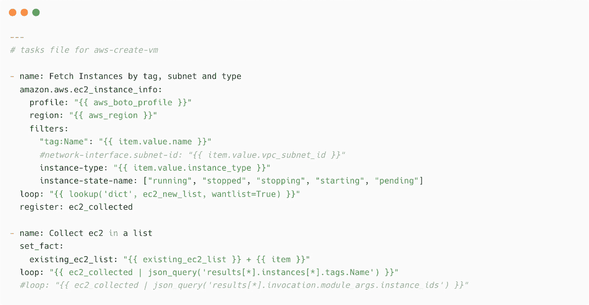

# 7

# 管理您的虚拟化和云平台

自虚拟化和云计算引入以来，组织能够使用程序化的方法处理其 IT 基础设施，因为大多数 IT 组件是软件定义的，例如**软件定义数据中心**（**SDDC**）、**软件定义存储**（**SDS**）、**软件定义网络**（**SDN**）等。但是，这些额外的技术层也使得基础设施管理更加复杂，因为工程师需要同时处理底层基础设施和上层虚拟组件。

Ansible 可以帮助您自动化底层云基础设施以及上层虚拟组件的管理，例如虚拟化平台（VMware、OpenStack、Red Hat Virtualization 等）的自动化集群配置。它还可以帮助您配置虚拟组件，如虚拟机、虚拟网络和虚拟存储。

本章将覆盖以下主题：

+   基础设施即代码简介

+   使用 Ansible 管理云平台

+   使用 Ansible 自动化 VMware vSphere 资源

+   使用 Ansible 作为 AWS 的 IaC 工具

+   使用 Ansible 在 GCP 中创建资源

首先，您将学习如何配置必要的身份验证，并在虚拟化平台（如 VMware vCenter）和公共云平台（如 GCP 和 AWS）中配置资源。

# 技术要求

本章的技术要求如下：

+   用于 Ansible 控制节点的 Linux 机器（需要能够访问互联网）

+   管理云平台（VMware、GCP 和 AWS）的知识

+   访问 VMware vCenter 控制台和 API（针对 VMware 用例）

+   访问 AWS 控制台和 API

+   访问 GCP 控制台和 API

本章的所有 Ansible 代码、剧本、命令和代码片段可以在本书的 GitHub 仓库中找到：[`github.com/PacktPublishing/Ansible-for-Real-life-Automation/tree/main/Chapter-07`](https://github.com/PacktPublishing/Ansible-for-Real-life-Automation/tree/main/Chapter-07)

# 基础设施即代码简介

**基础设施即代码**（**IaC**）是一种方法，用于将基础设施的细节和配置作为软件代码进行配置和管理，并通过修改代码来更改基础设施，而不是每次需要时修改基础设施。许多专门的工具和软件用于 IaC，包括 Ansible。与手动部署基础设施组件（如虚拟机、存储、网络、策略等）不同，您可以开发 IaC 并使用工具自动化部署基础设施。下图展示了与以下内容相关的典型 IaC 组件：

+   基础设施组件的详细信息将以特定格式（例如 YAML 剧本）存储为代码。

+   IaC 工具（例如 Ansible）将根据基础设施代码在私有或公共云中创建和管理基础设施组件：


图 7.1 – 典型的基础设施即代码组件

在接下来的章节中，你将学习如何使用 Ansible 作为基础设施即代码（IaC）工具，在私有和公共云平台上部署和管理基础设施。

# 使用 Ansible 管理云平台

正如你在前几章中所学到的，Ansible 可以管理 Linux、Windows 和网络设备。但是虚拟化平台的工作方式不同，无法使用基于 SSH 的连接和操作来自动化这些平台。这些平台大多数提供 **应用程序编程接口** (**API**) 和 **软件开发工具包** (**SDK**) 访问方式，帮助我们通过 HTTP（或 HTTPS）访问和控制这些平台。由于 Ansible 可以使用 SDK（Python 库）并通过 HTTP/HTTPS 进行通信，因此可以自动化任何提供这种访问方式的平台。

下图展示了 Ansible 用于与管理设备和平台进行通信的不同连接方式：


图 7.2 – Ansible 连接方式

应用程序编程接口

API 是一种连接或协议，允许一个系统通过一套专用的指令和结果与另一个系统进行通信。与命令行工具不同，命令行工具是用于人机交互的，而基于 API 的访问可以帮助以编程方式和受控的方式自动化和控制这些系统。了解更多关于 API 的内容，请访问 [`en.wikipedia.org/wiki/API`](https://en.wikipedia.org/wiki/API)。

Ansible 拥有数百个模块（参见 *图 7.3*）和插件，支持云自动化，并且它们作为特定云平台或虚拟化平台的集合提供。通过这些模块，可以创建和管理云资源，如虚拟机、虚拟私有网络、虚拟磁盘、访问策略、无服务器组件、容器等：


图 7.3 – Ansible 云模块

在 [`docs.ansible.com/ansible/2.9/modules/list_of_cloud_modules.xhtml`](https://docs.ansible.com/ansible/2.9/modules/list_of_cloud_modules.xhtml)（适用于 Ansible 2.9）上找到云模块的完整列表。自 Ansible 集合推出以来，这些模块已经迁移到相应的云集合中。请查看 Ansible Galaxy 中的集合页面（[`galaxy.ansible.com`](https://galaxy.ansible.com)），以查看所有插件、角色和剧本，这些内容是 Ansible 内容集合的一部分。例如，以下截图显示了 VMware 集合的社区 Ansible 集合页面（[`galaxy.ansible.com/community/vmware`](https://galaxy.ansible.com/community/vmware)）：


图 7.4 – Ansible VMware 集合

在 Ansible Galaxy 中搜索集合，并使用来自社区或供应商的适当集合。以下截图展示了在 Ansible Galaxy 门户中搜索 `aws` 集合的结果：


图 7.5 – AWS 集合在 Ansible Galaxy 中的结果

通过探索 Ansible Galaxy 门户，你将发现来自社区和供应商的成千上万的贡献。通过使用 Ansible 集合，可以利用现有的角色、模块和剧本，节省开发剧本的时间。

在下一节中，你将学习如何通过使用连接方法、模块等来管理 VMware。

# 使用 Ansible 自动化 VMware vSphere 资源

我们将从一些简单的 VMware 自动化用例开始，例如虚拟机的配置、管理等。`community.vmware` 包含大约 150 个模块和其他插件：


图 7.6 – 社区提供的 Ansible VMware 集合

`community.vmware` 集合依赖于 `pyvmomi` 和 `community.vmware` 集合，你需要安装适当的包以便 Ansible 使用它。

VMware 已经推出了 `vmware.vmware_rest`，通过 REST API 来管理操作，而不是使用 Python 库和 SDK。`vmware.vmware_rest` 包含大约 130 个模块和其他插件：


图 7.7 – VMware 提供的 Ansible VMware REST API 集合

根据你的 vSphere 版本和模块需求，使用这些 Ansible 集合中的任何一个。

VMware Ansible 集合

基于 Python 库的 Ansible VMware 社区集合可以在 [`galaxy.ansible.com/community/vmware`](https://galaxy.ansible.com/community/vmware) 获取。基于 REST API 的集合可以在 [`galaxy.ansible.com/vmware/vmware_rest`](https://galaxy.ansible.com/vmware/vmware_rest) 获取。

## Ansible VMware 自动化前提条件

要使用 VMware 集合，你需要满足以下要求：

+   安装 Ansible VMware 集合。

+   安装所需的库。

VMware vCenter 实验室

如果你没有 VMware 实验室用于测试和练习，可以获取 VMware vSphere 的评估版（[`customerconnect.vmware.com/en/web/vmware/evalcenter?p=vsphere-eval-7`](https://customerconnect.vmware.com/en/web/vmware/evalcenter?p=vsphere-eval-7)）并将其安装在你的家庭服务器上。参考*如何安装 VMware vSphere Hypervisor ESXi*（[`www.techbeatly.com/how-to-install-vmware-vsphere-hypervisor-esxi`](https://www.techbeatly.com/how-to-install-vmware-vsphere-hypervisor-esxi)）和*如何安装 VMware vCenter Server Appliance*（[`www.techbeatly.com/how-to-install-vmware-vcenter-server-appliance`](https://www.techbeatly.com/how-to-install-vmware-vcenter-server-appliance)）来搭建 VMware 家庭实验室。

### 安装 Ansible VMware 集合

使用`ansible-galaxy`命令安装集合。默认情况下，`ansible-galaxy`会将集合的内容存储在`HOME_DIRECTORY/.ansible/collections`路径中。为了避免任何依赖问题，最佳实践是将集合存储在项目目录中，而不是主目录中。按照以下方式在`ansible.cfg`中配置集合路径：


图 7.8 – ansible.cfg 配置文件与 collection_paths

执行`ansible-galaxy`命令时，集合将根据配置被下载并存储在项目目录中，如下图所示（请参阅**VMware Ansible 集合**页面，网址为[galaxy.ansible.com](http://galaxy.ansible.com)查看安装命令；请参阅前面的信息框查找链接）：


图 7.9 – 安装 VMware 集合

使用`ansible-galaxy collection list`命令验证集合的详细信息，如下所示：


图 7.10 – 列出已安装的集合

如果你已经安装了 Ansible 社区包，那么默认集合将作为 Python 的`site-packages`的一部分存在。最新安装的集合可以在你自定义的集合目录中看到，前面截图中已显示。

### 安装所需的 Python 库

所需的 Python 库和 SDK 列表将存储在集合文件夹中的`requirements.txt`文件内，如下所示：


图 7.11 – requirements.txt 中的集合依赖项

使用`pip install`命令安装 Ansible 集合的所有依赖项，如下所示：


图 7.12 – 安装集合所需的依赖项

如果你正在为 Ansible 使用 Python 虚拟环境，请记得激活适当的虚拟环境，并在虚拟环境中安装必要的库。

自动化执行环境

Red Hat Ansible Tower 使用 Python 虚拟环境来处理依赖项，如 Python 库、集合等。在 `ansible-core` 和所需的集合中。有关更多详细信息，请参考 [`www.ansible.com/products/execution-environments`](https://www.ansible.com/products/execution-environments)。学习如何使用 `ansible-builder` 工具构建新的执行环境（容器镜像）（[`docs.ansible.com/automation-controller/latest/html/userguide/execution_environments.xhtml`](https://docs.ansible.com/automation-controller/latest/html/userguide/execution_environments.xhtml)）。

## 在 Ansible 中配置 VMware 虚拟机

在本练习中，您将创建 Ansible 内容来在 VMware 集群中配置虚拟机。

在继续此练习之前，您必须具备以下配置和详细信息：

+   VMware vCenter 中的虚拟机模板（Linux 或 Windows）

+   虚拟机模板中用于访问新虚拟机的默认用户帐户

+   拥有足够权限的 VMware vCenter 用户名和密码，以便在集群中创建和管理资源

+   用于保存虚拟机的数据中心、集群、数据存储和文件夹的详细信息

通过登录到 VMware vCenter 并使用 VMware 虚拟机模板创建一些测试机器，确保适当的权限已经设置好。一旦确认了访问和权限，开始为 VMware 虚拟机配置开发 Ansible 工件。

### 创建用于虚拟机配置的 Ansible 自动化工件

您需要声明并传递一些变量以进行 vCenter 访问和虚拟机创建。将这些变量保存在 playbook 中或单独的文件中。按照以下步骤操作：

1.  将 vCenter 凭据存储在您的 Ansible Vault 文件中——即 `vars/vmware-credential.yaml`：


图 7.13 – 为您的 VMware 凭据创建 Ansible Vault 文件

1.  将 VMware vCenter 用户名和密码添加到文件中并保存 Vault 文件：

    ```
    vcenter_username: yourvmwareadmin
    vcenter_password: yoursecretpassword
    ```

请记住 Vault 密码，因为在执行 playbook 时将需要它。

1.  创建另一个名为 `vars/common-vars.yml` 的变量文件，用于存储关于新虚拟机的详细信息（有关详细信息，请参阅本书 GitHub 仓库中的 `Chapter-07`）：


图 7.14 – VMware 集群和虚拟机的变量

可以在其中添加多个虚拟机详细信息并循环任务。然而，我们这里只涉及了使用单个虚拟机。

1.  使用 `ansible-galaxy role init` 命令创建用于虚拟机配置的角色，如下所示：


图 7.15 – 使用 `ansible-galaxy role init` 命令初始化一个新角色

1.  将必要的任务添加到 `roles/vmware-provision-vm-from-template/tasks/main.yml`：


图 7.16 – 带有子任务文件的 main.yaml

`tasks/main.yml` 包含两个任务，用于调用子任务文件。第一个任务进行预检查，以确保在继续创建虚拟机之前不存在同名的虚拟机。如果没有虚拟机存在，则根据 `when: vm_check.failed` 条件执行下一个任务。这是一种最佳实践，因为在 playbook 中需要添加所有可能的验证和错误处理。

1.  创建 `roles/vmware-provision-vm-from-template/tasks/vmware-provisioning-pre-check.yaml` 的必要内容。如果虚拟机已存在，还要显示一条消息：


图 7.17 – vmware-provisioning-pre-check.yaml

1.  创建 `roles/vmware-provision-vm-from-template/tasks/vmware-provisioning-task.yaml` 并添加一个任务来创建新的 VMware 虚拟机（请参考本书的 GitHub 仓库查看完整代码），如下面的截图所示：


图 7.18 – VMware 虚拟机创建任务文件

1.  最佳实践是将变量的默认值保存在 `roles/vmware-provision-vm-from-template/defaults/main.yml` 中，并在执行 playbook 时传递实际值：


图 7.19 – VMware 角色的默认变量

1.  创建主 playbook，`Chapter-07/vmware-provision-vm-from-template.yml`。由于执行是在本地机器上进行的，适用于 API 和 HTTP 基础平台，确保已配置 `hosts: localhost`，如下所示：


图 7.20 – 创建 VMware 基础设施的主 playbook

可以根据需要将变量保存在 `group_vars` 或 `host_vars` 中。然而，在这里我们采用了变量文件的方法，以便轻松展示此用例。

在前面的代码片段中，使用了 `ansible.builtin.wait_for` 模块，等待新创建的虚拟机通过 SSH 上线。我们使用了虚拟机的 IP 地址、端口 `22`（SSH），并指示 Ansible 等待一段时间（`vm_wait_for_ssh_time`）。详细了解 `wait_for` 模块，请参阅 [`docs.ansible.com/ansible/latest/collections/ansible/builtin/wait_for_module.xhtml`](https://docs.ansible.com/ansible/latest/collections/ansible/builtin/wait_for_module.xhtml)。

1.  一旦虚拟机启动并运行，将新虚拟机添加到动态主机组 `vmwarenewvms` 中，以进行后期配置任务，如下所示：


图 7.21 – 将新创建的虚拟机添加到 Ansible 库中

通过使用 VMware 的动态库存插件代替手动添加主机，可以自动检测新创建的虚拟机并在接下来的任务中使用它们。有关更多详情，请参阅 [`docs.ansible.com/ansible/latest/collections/community/vmware/vmware_vm_inventory_inventory.xhtml`](https://docs.ansible.com/ansible/latest/collections/community/vmware/vmware_vm_inventory_inventory.xhtml)。此外，参阅 *第五章*，*扩展您的自动化范围*，其中包含 *Ansible 动态库存* 部分，了解如何将 Ansible 动态库存与 AWS 一起使用。

1.  在同一个 Ansible playbook 中创建另一个 play 来执行后期配置任务，例如创建新用户、配置系统文件和安装新软件包，如下所示：


图 7.22 – 用于后期配置任务的 playbook 中的第二个 play

当您使用 Ansible 自动化控制器（Ansible 自动化平台的一部分）或 Ansible AWX 时，可以将 playbook 拆分为多个作业模板，并创建作业工作流，如下图所示：


图 7.23 – 工作流模板（来源：docs.ansible.com）

在 *第十二章*，*将 Ansible 集成到您的工具中* 中，您将了解工作流作业模板和 Ansible 自动化控制器。参阅 [`docs.ansible.com/automation-controller/latest/html/userguide/workflows.xhtml`](https://docs.ansible.com/automation-controller/latest/html/userguide/workflows.xhtml) 了解更多关于工作流模板的内容。

1.  执行 `ansible-playbook vmware-provision-vm-from-template.yml` playbook，使用 `--ask-vault-password` 参数并提供 vault 密码，如下所示：


图 7.24 – 执行 playbook 来创建 VMware 虚拟机

向后期配置部分添加更多任务，以自动化虚拟机配置工作流，并将其作为端到端虚拟机配置的单一工作流。在接下来的部分中，您将了解 **Amazon Web Services** (**AWS**) 的云管理以及如何将 Ansible 用作基础设施即代码（IaC）工具。

在 vSphere Client 中创建一个模板

请参阅 [`docs.vmware.com/en/VMware-vSphere/6.0/com.vmware.vsphere.hostclient.doc/GUID-40BC4243-E4FA-4A46-8C8B-F50D92C186ED.xhtml`](https://docs.vmware.com/en/VMware-vSphere/6.0/com.vmware.vsphere.hostclient.doc/GUID-40BC4243-E4FA-4A46-8C8B-F50D92C186ED.xhtml) 了解 VMware 模板创建流程。

# 将 Ansible 用作 AWS 的基础设施即代码（IaC）工具

在本节中，您将创建 Ansible 内容，用于通过 Ansible 配置和管理 AWS 资源。假设每当您需要创建一个新的 EC2 实例时，您需要执行多个手动步骤，例如创建一个新的**虚拟私有云**（**VPC**）、一个新的安全组、网络访问策略以及许多其他项目。您还需要进行后配置步骤，例如创建新的用户帐户、安装软件包、配置应用程序等。

在 Ansible AWS 集合的帮助下，可以自动化所有这些任务，并管理基础设施的整个生命周期。

### AWS 免费套餐

要实践 AWS 和 Ansible 的用例，可以使用 AWS 免费套餐，该套餐提供超过 100 种 AWS 资源，免费使用。访问[`aws.amazon.com/free`](https://aws.amazon.com/free) (*图 7.25*)并注册免费的 AWS 免费套餐账户来查找它们：


图 7.25 – 使用超过 100 种服务的 AWS 免费套餐访问

确保您的 AWS 资源使用量在 AWS 免费套餐限制范围内，以避免与您的账户连接的信用卡或借记卡被收费。请参考[`aws.amazon.com/aws-cost-management/aws-budgets/`](https://aws.amazon.com/aws-cost-management/aws-budgets/)了解如何配置预算警报和其他计费详情。

我已确保以下演示仅使用基于 AWS 免费套餐的资源，这样您的 AWS 免费套餐账户将不会产生额外费用。但在完成测试后，也很重要要从 AWS 账户中删除这些资源。

## 安装 Ansible AWS 集合

如您在上一节中所学，可以使用`ansible-galaxy`命令来安装 Ansible AWS 集合。如果项目需要多个集合，可以创建一个`requirements.yaml`文件，并在其中列出所需的集合和角色：


图 7.26 – 包含集合详细信息的 requirements.yaml 文件

一旦`requirements.yaml`文件已更新，通过调用`requirements.yaml`文件，使用`ansible-galaxy`命令安装集合：


图 7.27 – 使用 requirements.yaml 安装集合

该集合将安装在您在`ansible.cfg`中配置的`Chapter-07/collections`路径下。请验证集合，如下所示：


图 7.28 – Ansible 集合列表

现在，Ansible 的 AWS 自动化集合已准备好使用。现在，开始开发您的 Ansible 剧本。

## 为 AWS 基础设施创建 Ansible IaC 内容

在此场景中，将安装两个 Web 服务器并配置网站内容，在 **弹性负载均衡器**（**ELB**）后面提供服务，如下图所示：


图 7.29 – 构建 Web 服务器基础设施和应用程序

可以创建多个角色来处理 Ansible 自动化内容中的多个资源，如下图所示：


图 7.30 – 管理云平台的 Ansible 角色

查看 `amazon.aws` 集合文档（[`galaxy.ansible.com/amazon/aws`](https://galaxy.ansible.com/amazon/aws)），了解安装 `boto` 和 `boto3` Python 库的 Python 库要求。您在 *第五章*《扩展您的自动化领域》中已学习如何操作。请参考该章节学习如何配置 AWS 凭证，以便进行此自动化作业。

### 为 AWS 环境创建变量

有关 AWS 区域、VPC 和子网的详细信息存储在 `Chapter-07/vars/aws-common-vars.yml` 文件中（请参阅 GitHub 上的课程仓库）：


图 7.31 – vars/aws-common-vars.yml 中的 AWS 相关变量

一旦有关 AWS 云的详细信息存储在变量中，就必须创建一个变量来存储 EC2 实例的详细信息。

### AWS 中的默认 VPC

当您开始使用 AWS VPC 时，每个 AWS 区域将默认存在一个 VPC，包含以下资源：

+   每个 **可用区**（**AZ**）中的子网（公共）

+   一个互联网网关

+   DNS 解析

在本示范中，我们将使用 `amazon.aws.ec2_vpc_net` Ansible 模块。请参阅官方文档（[`docs.aws.amazon.com/vpc/latest/userguide/default-vpc.xhtml`](https://docs.aws.amazon.com/vpc/latest/userguide/default-vpc.xhtml)）了解更多信息。

### 列出 EC2 实例

有关新 EC2 实例的详细信息存储在 `vars/aws-ec2-new.yml` 文件中：


图 7.32 – 变量文件中的新 EC2 详细信息

通过此变量可以控制 EC2 实例的数量，因为您将使用循环来配置它们。现在，您必须配置 AWS 安全组变量。

### 创建 AWS 安全组

使用 `amazon.aws.ec2_group` 模块在 `roles/aws-create-sg/tasks/main.yml` 中创建一个新安全组，并配置所需规则，如下所示：


图 7.33 – 安全组任务

如果您的应用程序在不同端口上提供服务，请相应添加端口并根据需要调整剧本。一旦完成此操作，您必须创建 SSH 密钥对任务。

### 创建 SSH 密钥对

可以使用 `amazon.aws.ec2_key` 模块创建新的密钥对。在 `roles/aws-create-keypair/tasks/main.yml` 中，将使用本地密钥对（`~/.ssh/id_rsa.pub`）：


图 7.34 – 创建 SSH 密钥资源

这个密钥对非常重要，因为您稍后需要使用它来访问 EC2 实例并配置 Web 服务器和其他细节。在前面的代码块中，我们使用了工作站上的现有 SSH 密钥对（`~/.ssh/id_rsa.pub`）及其公钥，在 AWS 中创建了这个新的密钥对资源，以便我们不需要重新下载私钥。现在，您必须添加用于创建**弹性负载均衡器**（**ELB**）的任务。

### 创建弹性负载均衡器

可以使用 `amazon.aws.ec2_elb_lb` 模块在 `roles/aws-create-elb/tasks/main.yml` 中创建新的 ELB，如下所示：


图 7.35 – 创建 Amazon ELB

如果您使用的是不同版本的 AWS Ansible 集合，请查看适当的 Ansible 模块以创建负载均衡器，并相应地更改 playbook。现在，您已准备好创建 EC2 实例任务。

### 创建 EC2 实例

最后，开始创建 EC2 实例。然而，您必须确保不会创建重复的虚拟机。最佳实践是在 playbook 中添加验证，以避免自动发生任何错误，因为 AWS 不会对创建具有相同名称的多个实例提出警告。

在 `roles/aws-create-ec2/tasks/main.yml` 中创建必要的任务以收集现有实例。只有当实例不存在时，才继续创建 EC2 实例：



图 7.36 – 获取 EC2 实例

如果 EC2 实例已经存在，则不应再次创建新 EC2 实例。因此，根据 `existing_ec2_list` 创建新的 EC2 实例，如下所示：


图 7.37 – 如果实例不存在，则创建 EC2 实例

创建 EC2 实例后，您需要收集新创建的 EC2 实例的详情，并等待它们启动并响应在线状态，如下所示：


图 7.38 – 收集新创建的 EC2 实例信息

一旦 EC2 实例启动并运行，收集其详情，以便您可以将它们更新到 ELB：


图 7.39 – 收集新 EC2 实例的详情

使用收集的详情（`ec2_existing_collected`），在后台更新 ELB 实例项，如下所示：


图 7.40 – 在后台更新 ELB 实例详情

ELB 和后端实例已经准备好并已连接，但 EC2 实例内还没有运行任何程序。现在，你需要在其中安装 Web 服务器及其内容。为此，收集新创建的 EC2 实例详细信息，放入动态主机组中，以便进行**后置配置**任务，如下所示：


图 7.41 – 使用新的 EC2 实例详细信息更新库存

与前面的截图中所示的收集主机详细信息不同，你也可以利用 Ansible 动态库存。参见*第五章*，*扩展自动化领域*，*Ansible 动态库存* 部分，了解如何在 AWS 中使用 Ansible 动态库存。

一旦你准备好了所有角色中的任务，就按照适当的顺序在主剧本中使用这些角色。

### 集成 AWS 配置工作流的主剧本

IaC 配置工作流写在主剧本中——即 `Chapter-07/aws-infra-provisioning.yaml`（请参考本书的 GitHub 仓库获取完整代码）。作为最佳实践，变量可以存储在 `group_vars` 或 `host_vars` 下。然而，我们采用了变量文件的方法来简化此用例的演示。按照以下顺序使用之前创建的角色：


图 7.42 – AWS 基础设施配置剧本

在同一个剧本中，后置配置任务已经被添加到名为 `Deploy Webserver to EC2 instances` 和 `hosts: ec2webservers` 的不同 play 下（即在 `roles/aws-create-ec2/tasks/main.yml` 中创建的动态主机组）。

`deploy-web-server` 角色将安装 `httpd` Web 服务器，并安装 `firewalld`，同时配置 Web 服务器以提供默认的网站内容。以下截图显示了后置配置的 play 以及一个可选的 play，用于展示 ELB 地址，这样你就不需要登录 AWS 控制台去检查访问网站的 URL：


图 7.43 – 第二个 play 中的后置配置任务

执行剧本时，工作流将触发基础设施和应用程序的配置：

```
[ansible@ansible Chapter-07]$ ansible-playbook aws-infra-provisioning.yaml
```

最后，后置配置任务完成后，将显示以下信息：


图 7.44 – 显示 ELB 详细信息的 Ansible 剧本

向配置工作流中添加更多资源，例如额外的 EBS 卷、网络访问控制规则，以及来自自定义 AMI 或快照的镜像。后置配置可以根据需要通过更多配置来扩展。

现在，你需要创建剧本内容来删除资源，以完成完整的 IaC 生命周期。

## 通过使用销毁剧本完成 IaC 生命周期

`Chapter-07/aws-infra-destroy.yaml` 剧本将负责销毁资源和清理任务（请参考本书的 GitHub 仓库获取完整代码）：


图 7.45 – AWS 基础设施销毁剧本

如果不再需要资源，可以使用销毁剧本销毁整个基础设施：

```
[ansible@ansible Chapter-07]$ ansible-playbook aws-infra- destroy.yaml
```

在本节中，您学习了如何创建 AWS 资源并管理实施基础设施即代码（IaC）实践的端到端生命周期。在下一节中，您将探索类似的 **Google Cloud Platform**（**GCP**）自动化。

Ansible 与 AWS 集成

阅读更多关于 Ansible AWS 集成的信息：[`www.ansible.com/integrations/cloud/amazon-web-services`](https://www.ansible.com/integrations/cloud/amazon-web-services)。

# 使用 Ansible 在 GCP 中创建资源

与 VMware 和 AWS 类似，借助 Ansible GCP 内容集合，您可以创建和管理 GCP 资源。

## Ansible GCP 自动化的前提条件

在开始之前，您需要确保为 Ansible GCP 自动化配置了必要的前提条件。

正如您在 VMware、AWS 和其他平台上所学的那样，您需要安装相关的 Ansible 内容集合。在本例中，如果尚未安装，您必须安装 `google.cloud` 集合：

```
[ansible@ansible Chapter-07]$ ansible-galaxy collection install google.cloud
```

`google.cloud` 集合包含约 170 个模块、角色和其他插件，用于自动化 GCP 基础设施及其资源。

`google.cloud` 集合中的模块需要在系统上安装以下 Python 库：

```
$ pip install requests google-auth
```

如果您正在使用 Python 虚拟环境进行 Ansible 操作，请确保将库安装到正确的路径。

用于 Google Cloud 的 Ansible

通过阅读 *Google Cloud Platform 手册*，了解更多 Ansible GCP 自动化内容：[`docs.ansible.com/ansible/latest/scenario_guides/guide_gce.xhtml`](https://docs.ansible.com/ansible/latest/scenario_guides/guide_gce.xhtml)。同时，访问 [`galaxy.ansible.com/google/cloud`](https://galaxy.ansible.com/google/cloud) 查阅 Google Cloud Ansible 集合，探索 GCP 自动化的 Ansible 模块。

## GCP 免费试用

为了练习 GCP 和 Ansible 的使用案例，可以通过 GCP 免费试用获得超过 20 项 GCP 服务，免费使用。访问 [`cloud.google.com/free`](https://cloud.google.com/free) 并注册 GCP 免费层账户。我已经确保以下演示仅使用基于 GCP 免费层的资源，因此不会对您的账户产生额外费用。完成测试后，记得从您的 GCP 账户中删除这些资源。

## 配置 GCP 凭证

使用你的 GCP 服务账户或机器账户配置 Ansible 自动化平台访问（更多信息请参阅下面的信息框）。创建服务账户并下载 JSON 文件后，配置 Ansible 使用该 JSON 文件作为 GCP 访问凭证。

可以将凭证配置为模块参数或环境变量，具体如下：

```
GCP_AUTH_KIND
GCP_SERVICE_ACCOUNT_EMAIL
GCP_SERVICE_ACCOUNT_FILE
GCP_SCOPES
```

根据环境和实践，选择合适的方法，类似于我们为 VMware 和 AWS 所做的。

创建 GCP 服务账户

请参考 [`developers.google.com/identity/protocols/oauth2/service-account#creatinganaccount`](https://developers.google.com/identity/protocols/oauth2/service-account#creatinganaccount) 了解如何创建 GCP 服务账户，并创建和下载 JSON 密钥文件。

## 使用 Ansible 创建 GCP 实例

在此练习中，您将创建 Ansible 内容以在 GCP 中创建一个简单的计算实例：

1.  创建一个名为 `vars/gcp-details.yaml` 的变量文件，以便您可以存储 GCP 凭证详细信息，如下所示：


图 7.46 – Ansible 的 GCP 配置变量

1.  创建 `Chapter-07/gcp-create-instance.yml` 剧本。根据需要使用 `google.cloud.gcp_compute_network` 创建新的 VPC 网络，并配置新的 GCP 实例以便它使用新的 VPC 网络。在此练习中，您将使用 `default` VPC 网络，并添加一个任务来获取 `default` VPC 网络的详细信息：


图 7.47 – GCP 配置剧本

1.  向同一剧本中添加一个任务，使用 Debian 9 操作系统创建 GCP 实例启动磁盘（根据需要使用其他公共镜像或自己的私有镜像）：


图 7.48 – 为新虚拟机创建 GCP 磁盘

`instance_source_disk` 变量将包含有关磁盘的详细信息。我们将在下一步将此信息传递给实例创建任务。

1.  添加一个任务来创建 GCP 实例，并传递网络和磁盘详细信息，如下所示：


图 7.49 – 创建带有网络和磁盘详细信息的 GCP 实例

1.  执行 Ansible `gcp-create-instance.yml` 剧本：

    ```
    [ansible@ansible Chapter-07]$ ansible-playbook gcp-create-instance.yml
    ```

1.  如下所示，在 GCP 控制台验证实例详细信息：


图 7.50 – 在 GCP 控制台验证实例

1.  同时，验证磁盘详细信息，如下所示：


图 7.51 – 在 GCP 控制台验证磁盘详细信息

可用大约 170 个模块，几乎可以管理 GCP 中的所有云资源，包括计算、磁盘、网络、负载均衡器、防火墙、路由、云构建、自动扩展、DNS、数据库、Spanner 等。

Ansible GCP 模块

请参考官方文档查看可用的 Ansible GCP 模块：[`docs.ansible.com/ansible/latest/collections/google/cloud/index.xhtml`](https://docs.ansible.com/ansible/latest/collections/google/cloud/index.xhtml)。

# 总结

在本章中，你了解了 IaC 的概念以及如何使用 Ansible 作为 IaC 工具。你还了解了 Ansible 如何管理虚拟化和云平台，如 VMware、AWS 和 GCP。然后，你了解了这些平台的不同方法和凭证配置，以便 Ansible 能够访问并执行自动化操作。

接下来，你了解了可用于 VMware、AWS 和 GCP 的 Ansible 模块和集合。通过开发用于创建新虚拟机（EC2 实例或 GCP 实例）的基本 playbook，你已经开始了基础设施自动化和管理的旅程。扩展 playbook 的内容，构建适合你云和虚拟化环境的使用案例。

在下一章中，你将学习如何帮助非平台团队使用 Ansible 进行自动化应用场景，例如使用 Ansible 构建和管理数据库。

# 进一步阅读

要了解更多本章内容的相关主题，请查看以下资源：

+   *什么是基础设施即代码（IaC）？*: [`www.redhat.com/en/topics/automation/what-is-infrastructure-as-code-iac`](https://www.redhat.com/en/topics/automation/what-is-infrastructure-as-code-iac)

+   *Ansible VMware 指南*: [`docs.ansible.com/ansible/2.5/scenario_guides/guide_vmware.xhtml`](https://docs.ansible.com/ansible/2.5/scenario_guides/guide_vmware.xhtml)

+   *VMware API 和 SDK 文档*: [`www.vmware.com/support/pubs/sdk_pubs.xhtml`](https://www.vmware.com/support/pubs/sdk_pubs.xhtml)

+   *介绍 VMware REST Ansible 内容集合*: [`www.ansible.com/blog/introducing-the-vmware-rest-ansible-content-collection`](https://www.ansible.com/blog/introducing-the-vmware-rest-ansible-content-collection)

+   *Ansible Amazon Web Services 指南*: [`docs.ansible.com/ansible/latest/collections/amazon/aws/docsite/guide_aws.xhtml`](https://docs.ansible.com/ansible/latest/collections/amazon/aws/docsite/guide_aws.xhtml)
