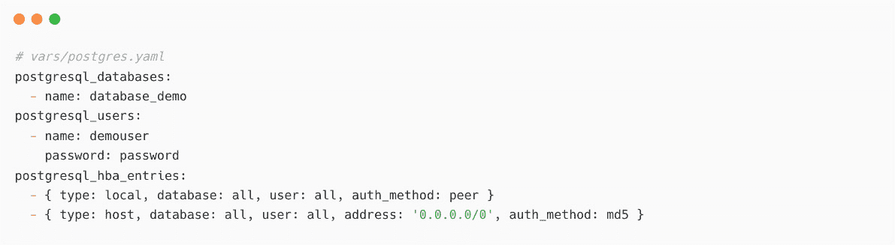

# 8

# 帮助数据库团队实现自动化

有状态应用程序，按定义必须持久保存数据。因此，当我们谈论有状态应用程序时，数据将成为关键因素，因此也涉及数据库服务器。根据你要存储的数据类型，选择任何支持的数据库软件。这包括事务数量、应用程序所需的性能、高可用性和故障切换支持以及许多其他因素。然而，更重要的考虑因素是准备数据存储、安装必要的依赖项、软件包或库。在维护方面，这将是一个持续的过程，因为我们需要处理备份、数据转储、快照和在故障情况下的恢复。

Ansible 可以帮助你应对这种情况。有数百个 Ansible 数据库模块可以帮助你实现数据库自动化任务，包括数据库安装、部署、管理表格、管理用户以及许多其他任务。

本章将涵盖以下主题：

+   Ansible 在数据库操作中的应用

+   安装数据库服务器

+   使用 Ansible 创建和管理数据库

+   自动化 PostgreSQL 操作

+   使用 ITSM 和 Ansible 自动化密码重置

我们将学习如何安装 PostgreSQL 数据库服务器，创建数据库，配置数据库表格，用户认证等。你还将了解在使用 Ansible 和**IT 服务管理**（**ITSM**）工具时进行零接触自动化的集成机会。

# 技术要求

以下是继续本章所需的技术要求。

+   用于 Ansible 控制节点的 Linux 机器（需要有互联网连接）

+   用于安装和配置 PostgreSQL 服务器的 Linux 机器

+   数据库（PostgreSQL）和服务器的基础知识

本章的所有 Ansible 代码、剧本、命令和片段可以在本书的 GitHub 仓库中找到，地址为 [`github.com/PacktPublishing/Ansible-for-Real-life-Automation/tree/main/Chapter-08`](https://github.com/PacktPublishing/Ansible-for-Real-life-Automation/tree/main/Chapter-08)。

# Ansible 在数据库操作中的应用

数据库操作不仅仅涉及部署数据库服务器，还包括日常操作，如管理数据库、表格、数据库用户、权限或访问。Ansible 可以通过适当的 Ansible 模块与大多数著名的数据库服务进行交互，如下图所示：


图 8.1 – Ansible 数据库自动化

一些最常见的数据库自动化用例如下：

+   部署独立数据库服务器

+   配置**高可用性**（**HA**）数据库集群

+   创建数据库和表格

+   管理用户账户

+   管理权限

+   管理数据库和服务器访问

+   备份和恢复操作

+   实现数据复制和镜像

+   自动化数据库故障切换

在 Ansible 数据库集合和模块的帮助下，我们可以自动化大多数这些操作。在下一节中，你将学习如何使用 Ansible 安装 PostgreSQL 数据库服务器。

请参考本章结尾的 *进一步阅读* 部分，获取更多资源。

# 安装数据库服务器

如果你是数据库管理员，或者你了解数据库服务器的工作原理，那么你一定知道按照应用需求管理和维护服务与数据的痛苦与挑战。自从虚拟化和基于云的平台引入以来，配置虚拟机、磁盘和其他资源已经不再是大问题。然而，我们仍然需要自动化选项来配置数据库服务器和数据库实例。公共**云服务提供商**（**CSPs**）提供了所谓的**托管数据库解决方案**，它们提供一键部署服务，但在大多数情况下，如果我们有更严格的要求，往往无法对这些服务拥有太多控制和透明度。因此，组织不得不使用自托管的数据库服务器，并遵循手动部署和管理过程。

在*第七章*，*管理你的虚拟化和云平台*中，你学习了如何自动化基础设施的配置，包括虚拟机和磁盘。在本章中，我们将探讨如何自动化数据库任务，例如安装数据库服务器，或配置数据库或表，如下图所示：


图 8.2 – 基本数据库操作

幸运的是，Ansible 提供了丰富的模块和插件，用于部署和管理数据库服务器，如 Microsoft SQL、MySQL、PostgreSQL、InfluxDB、MongoDB、ProxySQL 或 Vertica。在接下来的章节中，你将了解基于 Ansible 的数据库部署基础知识。

## 使用 Ansible 安装 PostgreSQL

如果参考官方文档，安装 PostgreSQL 是简单的。然而，你需要安装 PostgreSQL 所需的所有依赖项和库。你还需要配置数据库服务器的详细信息。幸运的是，Ansible Galaxy 上有很多写得很好的 Ansible 角色，我们可以下载并使用它们来安装和配置 PostgreSQL 服务器（以及其他数据库服务器）。下图展示了我们在 Ansible Galaxy 中搜索 `postgresql` 角色的过程：


图 8.3 – 在 Ansible Galaxy 中搜索 postgresql 角色

在本练习中，你将使用由社区成员 *Jeff Geerling* 贡献的 `geerlingguy.postgresql` Ansible 角色安装一个简单的独立 PostgreSQL 服务器，该角色的链接为 [`galaxy.ansible.com/geerlingguy/postgresql`](https://galaxy.ansible.com/geerlingguy/postgresql)。请按照以下步骤进行：

1.  确保你的 `ansible.cfg` 文件已根据项目配置了特定的角色和集合页面：


图 8.4 - 配置 ansible.cfg

1.  使用 `ansible-galaxy` 命令安装角色，如下所示：


图 8.5 – 使用 ansible-galaxy 命令安装 Ansible 角色

1.  创建一个名为 `Chapter-08/vars/postgres.yaml` 的变量文件，以便传递一些用户详细信息、要创建的数据库和 `hba` 条目，更新 `geerlingguy.postgresql` 角色。此角色将根据你传递给 Playbook 的变量自动创建资源。如果你不希望自动创建此类条目和配置，可以跳过此步骤：



图 8.6 – PostgreSQL 数据库的变量

重要提示

```
postgresql_users have been specified in plain text for demonstration purposes. You should consider using encrypted passwords using Ansible Vault or other appropriate methods. 
```

1.  创建 `Chapter-08/postgres-deploy.yaml` Playbook，如下所示：


图 8.7 – 部署 PostgreSQL 服务器的 Playbook

1.  添加一个任务，允许 PostgreSQL 的远程连接并重启 PostgreSQL 服务。最后，在防火墙中允许数据库端口 `5432`，如下所示的代码片段。如果使用的是其他防火墙服务模块（例如 `community.general.ufw`），请根据需要进行修改：


图 8.8 – 打开端口和数据库服务的任务

1.  执行 Playbook 并部署 PostgreSQL 服务器：


图 8.9 – 执行 Ansible Playbook 部署 PostgreSQL

1.  登录到数据库服务器（`node1`），并通过切换到 `postgres` 用户来验证数据库服务器的详细信息，如下所示：


图 8.10 – 登录 PostgreSQL 数据库服务器

1.  以 `postgres` 用户身份打开 `psql` 客户端，如下所示：


图 8.11 – 在数据库服务器上打开 psql 客户端

1.  使用 `\l` 命令列出现有的数据库，并验证 `database_demo` 是否已创建（根据 `vars/postgres.yaml` 文件中的变量配置）：


图 8.12 – 在 psql 命令行中列出现有的数据库

1.  使用 `\du` 命令验证用户列表，如下所示：


图 8.13 – 在 psql 命令行中验证用户

1.  使用 *Ctrl* + *D* 键盘快捷键或 `\q` 命令退出 `psql` 控制台：


图 8.14 – 退出 psql 控制台

1.  还需要验证`pg_hba.conf`文件；`geerlingguy.postgresql`角色将根据变量的内容配置此文件。请检查`/var/lib/pgsql/data/pg_hba.conf`文件，方法如下：


图 8.15 – 验证/var/lib/pgsql/data/pg_hba.conf 文件

如果您希望从远程节点访问 PostgreSQL，您需要确保`pg_hba.conf`文件中的条目已正确配置。

使用现有的 Ansible 角色是最佳实践，这样可以节省大量时间和精力来开发自动化内容。同时，您需要确保 Ansible 角色及其方法适合您的环境，而不是盲目使用它们。

在下一节中，您将学习如何更新默认`postgres`用户的密码。

### 配置默认 postgres 用户的密码

默认用户`postgres`没有配置密码，默认的认证方法是`postgres`用户（或其他管理员用户的密码）。按如下方式设置或更新`postgres`用户的密码：

1.  切换到`postgres`用户：


图 8.16 – 切换到 postgres 用户并打开 psql 命令行

1.  更改密码，退出`psql`控制台，然后按以下方式退出`postgres`用户：


图 8.17 – 更改密码并退出 postgres 账户

如果需要，这些步骤也可以在您的数据库安装 Playbook 中自动化，尽管这取决于您组织的需求。

也可以使用 Ansible 自动化其他数据库服务器的安装，例如 Microsoft SQL Server。我们将在下一节中讨论这个问题。

## 在 Linux 上安装 Microsoft SQL Server

2016 年，微软通过其博客（参考以下信息框）宣布 Microsoft SQL Server 将在 Linux 平台上运行。因此，在没有 Windows 服务器的情况下，您可以安装并使用 MSSQL 数据库，且安装将支持最常见的 Linux 平台，如**Red Hat 企业 Linux**（**RHEL**）、**SUSE 企业 Linux 服务器**（**SLES**）、Ubuntu 等。

在 Linux 上安装 MSSQL 非常简单，但仍然涉及一些配置和服务步骤。当部署中需要安装多个数据库服务器时，除了手动配置每个服务器外，还可以使用 Ansible 角色和 Playbook 来实现这一过程。按照文档中的步骤（参考以下信息框）或使用社区提供的现有贡献；例如，[galaxy.ansible.com/microsoft/sql](http://galaxy.ansible.com/microsoft/sql)上的角色可以用来在 Linux 上安装 MSSQL：


图 8.18 – 安装 microsoft.sql 集合

`community.general.mssql_db` 社区模块可用于添加或删除 MSSQL 数据库，方法如下：


图 8.19 – 创建 Microsoft SQL 数据库

在 Ansible Galaxy 中探索更多 MSSQL 自动化内容，并根据环境需求使用它。

公布 SQL Server 在 Linux 上的发布

微软关于 SQL Server 在 Linux 平台上可用性的公告可以在[`blogs.microsoft.com/blog/2016/03/07/announcing-sql-server-on-linux/`](https://blogs.microsoft.com/blog/2016/03/07/announcing-sql-server-on-linux/)查看。

SQL Server 在 Linux 上的安装指南可以在[`docs.microsoft.com/en-us/sql/linux/sql-server-linux-setup`](https://docs.microsoft.com/en-us/sql/linux/sql-server-linux-setup)查看。

一旦数据库服务器安装并配置完成，可以自动化其他任务，例如创建新数据库、创建新表、添加用户或权限。使用现有的 Ansible 集合和模块，例如`community.postgresql`、`community.mysql`、`community.cockroachdb`、`community.cassandra`等。我们将在下一节中学习如何使用`community.postgresql` Ansible 集合进行 PostgreSQL 数据库的自动化。

# 使用 Ansible 创建和管理数据库

PostgreSQL 的社区集合包含 20 多个模块和一些插件。可以使用这些模块和插件自动化 PostgreSQL 数据库操作，包括创建、删除和更新数据库、表格、用户和数据库服务器中的其他资源。

## Ansible `community.postgresql` 前提条件

如果你从远程节点（例如 Ansible 控制节点）访问 PostgreSQL，则需要在该机器上安装`psycopg2` Python 库，以使用这些 PostgreSQL 模块：

```
$ pip install psycopg2
```

在下一节中，我们将使用 Ansible 从数据库节点本身（`node1`）执行任务。因为数据库服务器已经配置了所需的依赖项，所以此库不是必需的。

在下一节中，你将学习如何使用 Ansible 和`community.postgresql` 集合来管理数据库操作。

## 管理数据库生命周期

在本节中，你将学习如何创建数据库、在新数据库中创建表格，然后使用 Ansible 配置用户和权限。按照以下步骤操作：

1.  创建 `postgres-manage-database.yaml` Playbook，并添加提供关于要创建的数据库、要配置的表格、要添加的用户等详细信息的变量。记得使用 Ansible Vault 加密敏感项，如用户名和密码，方法如下：


图 8.20 – 管理数据库操作的 Playbook

1.  添加一个任务来创建一个新的 PostgreSQL 数据库，如下所示：


图 8.21 – 创建数据库的任务

1.  现在，添加另一个任务来创建包含列的表：


图 8.22 – 在数据库中创建表的任务

1.  添加一个任务，用于创建用户并授予对新创建的数据库的访问权限：


图 8.23 – 创建用户并授予数据库访问权限的任务

1.  执行 playbook 创建数据库和其他资源：


图 8.24 – 执行 playbook 创建数据库、表和用户

1.  一旦 playbook 创建完成，验证数据库和数据库服务器（例如 `node1`）上的资源。

1.  登录到 `node1`，切换到 `postgres` 用户并打开 `psql` 控制台。列出数据库，你会看到 `db_sales` 数据库和 `devteam` 的访问权限：


图 8.25 – 登录数据库服务器并验证详细信息

1.  在 `psql` 中验证用户信息，如下所示：


图 8.26 – 列出并验证新创建的用户

1.  验证表是否按照 playbook 中的要求已创建。

首先，通过 `psql` 控制台使用 `\c` 命令连接到新创建的数据库，然后使用 `\dt` 命令列出数据库中的表，如下所示：


图 8.27 – 连接到新创建的数据库并列出表

1.  确保你通过 Ansible playbook 创建的列已存在于表中，如下所示：


图 8.28 – 数据库表详细信息

1.  还可以通过使用相应的用户名和密码在 `psql` 控制台中验证新用户的访问权限，如下所示：


图 8.29 – 验证新用户访问权限和列出表

扩展 playbook，加入更多细节，例如表所需的列、更多用户、权限等。更多细节请参考模块的文档：[`docs.ansible.com/ansible/latest/collections/community/postgresql/`](https://docs.ansible.com/ansible/latest/collections/community/postgresql/)。

在接下来的章节中，你将学习更多关于数据库操作的内容，例如如何通过自动化 `pg_hba` 配置来管理远程访问、如何进行数据库备份等。

# 自动化 PostgreSQL 操作

借助 `community.postgresql` 集合中的模块，可以自动化更多的数据库维护和操作。让我们深入了解一下。

## 管理 PostgreSQL 远程访问

数据库服务器由远程节点上的应用程序访问，必须适当且安全地配置此访问权限。在测试环境中，允许使用通配符条目（例如 `0.0.0.0/0`），但这不是生产服务器的推荐做法。您需要配置正确的 IP 地址或主机名以允许或限制对数据库的访问。此操作可以通过使用 `community.postgresql.postgresql_pg_hba` 模块来自动化，方法如下：


图 8.30 – 授予用户访问数据库的权限

使用 Ansible 管理 `pg_hba` 条目将使您能够处理数据库及其访问的整个生命周期。

接下来，我们将学习如何进行自动化的数据库备份。

## 数据库备份和恢复

对于敏感和重要数据，进行数据库备份至关重要。使用 Ansible 自动化此数据库转储，并安排每日、每周或每月的数据库备份：


图 8.31 – 使用 Ansible 进行数据库备份

备份将保存在管理节点上。可以自定义目标位置或自动将备份复制到远程位置，例如 NFS 卷或云存储。

同样，我们可以通过以下方式自动化数据库恢复操作：


图 8.32 – 从备份文件恢复数据库

注意上面示例中的 `state: restore`。这指示 Ansible 使用 `target` 参数中提到的文件或归档执行恢复操作。以下截图显示了完整的剧本，可以根据 `db_action` 值执行备份或恢复操作：


图 8.33 – PostgreSQL 数据库备份和恢复剧本

请参考[`docs.ansible.com/ansible/latest/collections/community/postgresql/postgresql_db_module.xhtml`](https://docs.ansible.com/ansible/latest/collections/community/postgresql/postgresql_db_module.xhtml)文档，了解有关 `community.postgresql.postgresql_db` 模块的更多信息。

Ansible PostgreSQL 和 MySQL 集合

请参考[`galaxy.ansible.com/community/postgresql`](https://galaxy.ansible.com/community/postgresql)了解 PostgreSQL 社区集合，并参考[`docs.ansible.com/ansible/latest/collections/community/postgresql/`](https://docs.ansible.com/ansible/latest/collections/community/postgresql/)查看文档。同时，您可以访问[`galaxy.ansible.com/community/mysql`](https://galaxy.ansible.com/community/mysql)获取 Ansible MySQL 集合和模块。

在下一部分，您将了解如何处理自动化的数据库密码重置请求，您可以使用 Ansible 和您的 ITSM 工具来实现。

# 使用 ITSM 和 Ansible 自动化密码重置

借助 ITSM 工具和 Red Hat Ansible 自动化平台（或社区版 Ansible AWX），可以实现零接触自动化用例，例如数据库用户密码重置、数据库预配等。用户将与 ITSM 工具交互，而该工具将与 Ansible 自动化平台交互以实现任务执行，如下图所示：


图 8.34 – ITSM 和 Ansible 自动化平台在数据库操作中的集成

这种**程序化自动化**是 Ansible 最佳的功能之一，它通过与现有工具和软件的集成，帮助组织扩展其自动化范围。

如下截图所示，在 ITSM 工具中使用自定义表单或工单系统：


图 8.35 – Jira 工单及其详情

ITSM 工具，如 Jira 或 ServiceNow，也可以配置自定义字段来收集信息，例如数据库服务器的名称、数据库名称、用户名等，如下截图所示：


图 8.36 – 带有自定义字段的 Jira 工单

自动化不会跳过你的 ITSM 流程或程序；在任务执行之前，审查和批准将到位，如*图 8.34*所示。

一旦获得批准，ITSM 工具将发送包含数据（如数据库主机名、数据库名称和用户名）的通知到 Ansible 自动化平台，并触发自动化任务。我们将在下一节中详细讨论这一过程。

## 重置密码的 Ansible 剧本

Ansible 剧本将根据 Ansible 作业模板和来自 Jira 的输入数据，从 Ansible 自动化平台触发。使用以下截图中显示的自定义字段收集 Jira 的输入数据（有关详细信息，请参见`Chapter-08/postgres-password-reset.yaml`）：


图 8.37 – 在剧本中收集来自 Jira 的详情

以下任务将为用户设置新密码：


图 8.38 – 设置新密码的任务

一旦密码重置操作成功，以下任务将使用密码重置操作的输出更新 Jira 工单：


图 8.39 – 使用 community.general.jira 模块更新 Jira 工单

扩展 playbook，添加任务，通过 `community.general.mail` 模块将新密码通过电子邮件发送给用户。更多关于 Ansible Jira 模块的信息，请查阅文档（[`docs.ansible.com/ansible/latest/collections/community/general/jira_module.xhtml`](https://docs.ansible.com/ansible/latest/collections/community/general/jira_module.xhtml)）。

# 总结

本章中，你了解了 Ansible 如何帮助你安装数据库服务器，并管理如创建数据库、创建表、分配用户权限、进行数据库备份以及配置 `pg_hba` 等数据库操作。你还了解了 ITSM 工具提供的集成机会，借助 Ansible Automation Platform 实现零接触自动化。

在下一章中，你将学习如何将 Ansible 与 DevOps 实践结合，进行部署、滚动更新、基础设施即代码（IaC）配置等。

# 进一步阅读

要了解本章所涵盖的更多内容，请访问以下链接：

+   *如何使用 Ansible 和 Gmail 发送邮件：* [`www.techbeatly.com/ansible-gmail`](https://www.techbeatly.com/ansible-gmail)

+   *使用 Ansible 在 Red Hat Enterprise Linux 8 上部署 Microsoft SQL Server 2019：* [`www.redhat.com/sysadmin/mssql-linux-easy`](https://www.redhat.com/sysadmin/mssql-linux-easy)

+   *Community.Postgresql 集合：* [`docs.ansible.com/ansible/latest/collections/community/postgresql/index.xhtml`](https://docs.ansible.com/ansible/latest/collections/community/postgresql/index.xhtml)

+   *Ansible 数据库模块：* [`docs.ansible.com/ansible/2.9/modules/list_of_database_modules.xhtml`](https://docs.ansible.com/ansible/2.9/modules/list_of_database_modules.xhtml)

+   *使用 ServiceNow 和 Red Hat Ansible Automation Platform 自动化 IT 服务管理：* [`www.ansible.com/integrations/it-service-management/servicenow`](https://www.ansible.com/integrations/it-service-management/servicenow)

+   *Ansible 的 MongoDB 集合：* [`galaxy.ansible.com/community/mongodb`](https://galaxy.ansible.com/community/mongodb)
