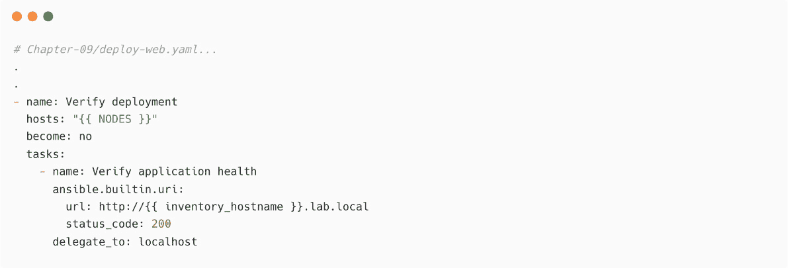
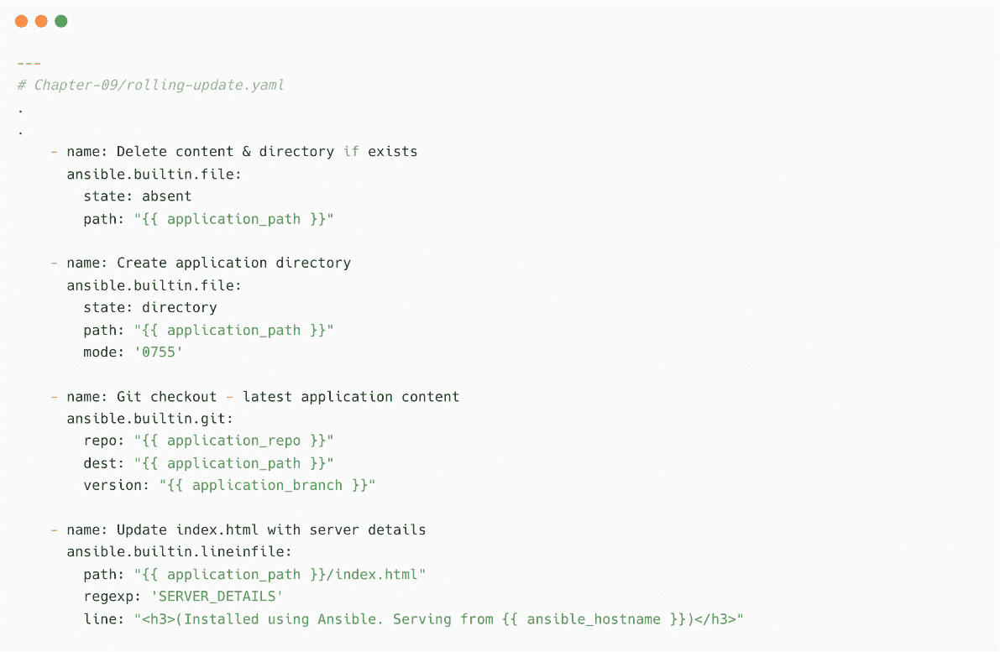

# 9

# 在 DevOps 工作流中实现自动化

**DevOps** 是一组实践、工具和理念的结合体，旨在帮助提高软件开发、应用交付和基础设施管理过程的速度、效率和安全性。由于许多优势，如更快和更频繁的部署、质量改善、减少错误以及通过自动化实现高度透明性，DevOps 的实践和方法现在在组织中非常普遍。通过结合自动化、协作和集成，可以开发并实施高效的 DevOps 实践，从而确保 IT 运维团队提供更高质量的输出。

由于有大量的集成、支持的插件和模块，Ansible 是自动化 DevOps 工作流中任务的优秀工具。Ansible 可以帮助你自动化 **软件开发生命周期**（**SDLC**）的不同阶段，如构建应用程序、扫描源代码、将工件存储到仓库、部署应用程序、配置应用服务等。自动化这些应用生命周期过程称为 **持续集成** 和 **持续交付**（**CI/CD**）。CI/CD 工具和框架有多种选择，如 Jenkins、CircleCI、GitLab、GitHub Actions、Bamboo 等。

本章将重点介绍在 CI/CD 和 DevOps 工作流中使用 Ansible 来部署和管理应用程序，而不是将 Ansible 作为 CI/CD 工具来使用。

本章将涵盖以下内容：

+   DevOps 快速介绍

+   使用负载均衡器提供应用程序

+   使用 Ansible 进行滚动更新

+   在 Terraform 中使用 Ansible 作为配置工具

首先，你将学习如何使用 Ansible 将应用程序部署到服务器，包括负载均衡器配置。你还将学习如何使用 Ansible 实现滚动更新，以便在没有停机和中断的情况下部署应用程序。最后，你将学习如何将 Ansible 用作 Terraform 基础设施管理工具的配置和管理工具。

# 技术要求

本章的技术要求如下：

+   用于 Ansible 控制节点的 Linux 机器（需要互联网访问）

+   用于安装和配置应用程序的三台 Linux 机器

+   DevOps 方法论、CI/CD 工具（Jenkins）以及 Git 工作流的基本知识

+   Terraform 的基本知识

本章的所有 Ansible 代码、剧本、命令和代码片段可以在本书的 GitHub 仓库中找到，链接如下：[`github.com/PacktPublishing/Ansible-for-Real-life-Automation/tree/main/Chapter-09`](https://github.com/PacktPublishing/Ansible-for-Real-life-Automation/tree/main/Chapter-09)。

# DevOps 快速介绍

简单来说，**DevOps** 是**开发**（**Dev**）和**运维**（**Ops**）的结合，但实际上，DevOps 是由帮助提高软件开发、交付和基础设施管理流程速度和效率的理念、工具和实践组成的组合。我们可以遵循并纳入 DevOps 工作流程中的一些已知最佳实践，具体如下：

+   团队协作和透明沟通

+   CI/CD

+   **基础设施即代码**（**IaC**）和自动化基础设施管理

+   容器化和微服务

+   日志记录、监控和反馈循环

DevOps 实践中的一个关键概念是减少应用生命周期管理所需的时间和精力，例如集成、构建、测试、发布和部署。通过使用 DevOps 方法论和工具，可以实现这个过程的自动化，这就是所谓的 CI/CD。

学习 DevOps

请参考以下指南，了解更多关于 DevOps 和 CI/CD 过程的内容：

+   DevOps 是什么？：[`aws.amazon.com/devops/what-is-devops/`](https://aws.amazon.com/devops/what-is-devops/)

+   DevOps 解释：[`about.gitlab.com/topics/devops/`](https://about.gitlab.com/topics/devops/)

+   了解 DevOps：[`www.redhat.com/en/topics/devops`](https://www.redhat.com/en/topics/devops)

在典型的 CI/CD 工作流中，开发人员将代码推送到中央代码仓库（例如 Git 服务器），每当仓库内容发生变化时，CI/CD 工具（如 Jenkins、CircleCI、GitHub Actions 等）将收到触发信号。下图展示了典型的 CI/CD 环境：

图 9.1 – CI/CD 环境中的典型工作流

构建、测试、交付和部署过程中涉及多个任务，具体取决于应用类型、应用平台和其他环境因素。

下图展示了 CI、CD 和持续部署过程中的典型手动和自动化任务：

图 9.2 – CI/CD 过程中的典型任务

应用程序可以是一个简单的 JAR 文件、一个压缩镜像、一个容器镜像或其他任何格式（我们将在*第十章*中学习使用 Ansible 管理容器，*使用 Ansible 管理容器*）。

**CI** 帮助开发人员定期合并软件代码更改，并自动快速地完成测试和扫描过程。CI 过程还帮助更快、更有效地发现代码中的缺陷、漏洞和安全问题。

**CD** 过程涉及自动化软件生命周期操作，例如测试应用程序、扫描以及准备应用程序，使其准备好进入生产环境（发布）。

一旦应用程序构建、扫描并在应用程序仓库（应用程序构件）中可用，它需要按照流程部署到生产环境（或开发环境）。这是下一个**CD**过程或**持续部署**任务，根据环境的不同，这可以作为自动化或半自动化部署来实现。

## 持续交付与持续部署

CD 通过将应用程序部署到生产环境中，帮助应用程序生命周期管理，使得应用程序中的最新变更能够作为 CI/CD 流程的一部分自动到达最终用户，无需任何人工干预。可以根据应用程序的性质、环境和依赖性，使用相同的 CI/CD 工具或专用工具来执行持续部署过程。

部署可以是 CI/CD 流水线的一部分，也可以是部署工具的独立触发器，例如**Ansible 自动化平台**（**AAP**）（你将在*第十二章*《将 Ansible 与工具集成》中学习如何将 Ansible 集成到 CI/CD 流水线中）。

## Ansible 在 CI/CD 任务中的应用

Ansible 可以作为 CI/CD 工作流中大多数任务的工具，如下所示：

+   扫描应用程序

+   构建应用程序构件

+   运行单元测试和集成测试

+   在预生产环境中推广和测试应用程序

+   将应用程序构件存储在构件仓库中

+   将应用程序部署到生产环境

在下一节中，你将学习如何使用 Ansible 将应用程序作为持续部署工具部署到生产服务器。

AAP 作为 CI/CD 工具

可以将 AAP 作为 CI/CD 工具，并使用 Ansible 剧本和作业模板来管理应用程序的完整生命周期。你将会在*第十二章*《将 Ansible 与工具集成》中了解更多内容。

使用 Ansible 可以减少软件部署时间。由于 Ansible 可以高效、有效地管理应用程序部署，因此在 CI/CD 流水线中，Ansible 可以作为主要工具来部署应用程序。下图展示了 Ansible 如何在 Jenkins 流水线作业中用于部署目的（持续部署）：

图 9.3 – Jenkins 流水线作业中的 Ansible

软件构建和 CI/CD 工作流可以通过多种 Jenkins 原生方法触发，也可以通过使用附加插件来触发。例如，要基于 Git 仓库的变化激活构建触发器，并从 Jenkins 执行 Ansible 剧本，你需要按照以下步骤执行一些强制性操作：

1.  首先，您必须安装并配置 Jenkins 的 Ansible 插件，以便在 Jenkins 流水线作业中使用 Ansible。请参阅文档 [`www.jenkins.io/doc/pipeline/steps/ansible/`](https://www.jenkins.io/doc/pipeline/steps/ansible/) 以了解有关 Jenkins Ansible 插件的更多信息。

Jenkins 中的 Ansible

请参阅 [`plugins.jenkins.io/ansible`](https://plugins.jenkins.io/ansible) 以了解有关 Jenkins Ansible 插件的更多信息。

1.  然后，您必须在 Jenkins 服务器（或 Jenkins 代理机器）上安装和配置 Ansible 及其所需的软件包，因为 Ansible playbook 将从 Jenkins 机器执行。（稍后在 *第十二章*，*将 Ansible 与您的工具集成* 中，您将学习如何使用 Jenkins 调用 AAP 中的自动化作业。）

1.  要触发 Jenkins 流水线作业，必须在 Jenkins 作业上配置构建触发器，如下截图所示。复制 URL (`JENKINS_URL/job/ansible-demo/build?token=TOKEN_NAME`) 和 `TOKEN` 值，并在 Git 服务器中的 webhook 配置中使用它们：

图 9.4 – Jenkins 流水线作业上配置的构建触发器

1.  每当应用程序代码发生变化时，您需要触发 Jenkins 流水线作业。为此，我们在 GitHub 应用程序存储库中配置了一个 webhook，如下截图所示：

图 9.5 – GitHub 存储库中的 webhook 配置

在 GitHub webhook 配置中，还提供了额外的配置选项，帮助您决定何时调用 webhook。请参阅 GitHub webhook 文档 ([`docs.github.com/en/developers/webhooks-and-events/webhooks/about-webhooks`](https://docs.github.com/en/developers/webhooks-and-events/webhooks/about-webhooks)) 以了解更多关于 webhook 的信息。

使用简单 webhook 触发作业

要了解有关 Jenkins 和 webhook 的更多信息，请阅读 [`docs.cloudbees.com/docs/admin-resources/latest/triggering-jobs-simple-webhook`](https://docs.cloudbees.com/docs/admin-resources/latest/triggering-jobs-simple-webhook)

## 在 Jenkins 流水线中使用 Ansible

安装并配置了 Ansible 插件后，可以通过在流水线阶段内调用它来从 Jenkins 服务器（或代理）执行 Ansible playbook。以下截图显示了使用 Jenkins 流水线阶段的示例来利用 Ansible 部署应用程序：

图 9.6 – Jenkins 流水线作业阶段，包含用于部署应用的 Ansible 任务

在接下来的练习中，我将解释如何使用 Ansible 从源存储库部署网站内容，用于持续部署任务。

我将使用简单的网站内容（静态网站），以避免任何复杂性，帮助您理解使用 Ansible 部署应用程序的概念。该剧本可以集成到 Jenkins 管道中（或您使用的任何 CI/CD 工具中），以实现持续部署任务。请按照以下步骤进行：

1.  更新`Chapter-09/hosts`清单文件，将`node1`和`node2`作为 Web 主机组的一部分，如下所示：

图 9.7 – 清单中的 Web 主机

1.  创建一个名为`Chapter-09/deploy-web.yaml`的剧本，并添加以下内容：

图 9.8 – 部署 Web 应用程序的剧本

变量可以保存在单独的文件中，也可以作为参数从您的 CI/CD 工具传递。

1.  添加一个任务来清理应用程序目录并重新创建它（这样可以确保从应用程序路径中删除任何旧版本的文件），如下所示：

图 9.9 – 清理应用程序目录的任务

1.  向同一个剧本中添加任务，以安装所需的包和依赖项。即使您在同一服务器上部署应用程序，最佳实践是在每次部署时安装并配置依赖项。这可能包括服务、包、系统库、Python 包或其他文件，具体取决于应用程序的类型和框架。

1.  也可以提到包的特定版本，如下图所示。还可以添加任务以启动`firewalld`，打开 Web 服务的防火墙端口，并启动 Web 服务，如下所示：

图 9.10 – 安装包并启动必要的服务

1.  下一步是将网站内容部署到应用程序路径中。（在本练习中，我们使用的是静态网站内容，而不是动态应用程序。）为了识别服务器，请按照以下方式更新`index.xhtml`文件（我们将在以下任务中用包含节点信息的自定义文本替换`SERVER_DETAILS`）：

图 9.11 – 部署应用程序并更新其内容

1.  根据需要添加更多任务，例如为 Web 服务器配置更多的限制或自定义 SSL 证书。

1.  将验证步骤作为自动化的一部分非常重要。我们将在这里添加自动化的网站验证。在这种情况下，这是一个简单的健康检查，用来验证网站是否正常工作。在同一个剧本中添加一个新的任务（而不是任务），如下所示：

图 9.12 – 添加一个任务来验证 Web 服务

请注意，我们没有硬编码服务器名称，而是将详细信息作为 Ansible *额外变量* 传递，这将帮助您在执行 Ansible playbook 时从 CI/CD 工具传递服务器详细信息。

每当我们在应用程序仓库中进行更改时（[`github.com/ginigangadharan/website-demo-one-page`](https://github.com/ginigangadharan/website-demo-one-page)），GitHub 将触发 Jenkins 服务器中的构建任务，并且 playbook 将作为流水线任务的一部分执行。（我们将在*第十二章*，*将 Ansible 与您的工具集成*中探索 Jenkins 作业和流水线。）为了演示和测试的目的，我们从控制台手动执行 playbook，如下所示：

1.  执行 playbook 并验证任务的成功（当您通过 CI/CD 流水线执行 playbook 时，您将在 CI/CD 控制台中看到类似的结果）：

图 9.13 – 带健康检查的 Ansible playbook 输出

`Verify application health` 任务成功，这意味着网站正在运行并提供内容。

1.  从网页浏览器中验证网站内容，如下所示：

图 9.14 – 使用 Ansible 部署的网站

为进一步练习，请扩展部署用例，如下所示：

+   部署其他 Web 应用程序、API 应用程序或来自仓库的其他压缩应用程序文件。

+   根据需要包括更多验证、测试用例、扫描任务等，作为健康检查的一部分。

+   使用角色部署 Web 服务、负载均衡器、数据库等。

您将在*第十二章*，*将 Ansible 与您的工具集成*中学习一些这些场景。在下一节中，您将学习如何使用负载均衡器处理多节点 Web 服务器流量。

# 使用负载均衡器服务应用程序

到目前为止，您已经学习了如何使用 Ansible 将应用程序部署到多个服务器上，并且具备了所有必要的前提条件、依赖关系和基本健康检查。但是，如果应用程序或网站运行在多个服务器上，您需要告诉最终用户多个服务器的信息，以便他们能够访问网站。将应用程序从单一实体（如负载均衡器）提供服务是一个最佳实践，如下图所示，这样最终用户就不需要了解实际的 Web 或应用服务器 IP 地址。这还将帮助您实现高可用性和应用程序的滚动更新：

图 9.15 – 使用负载均衡器托管在多个服务器上的网站

由于我们在 CI/CD 工作流中使用 Ansible 处理应用程序部署，因此可以将负载均衡器的安装和配置任务包含在管道中，如下图所示：

图 9.16 – Jenkins 管道与 HA Proxy 安装

由于你已经在`node1`和`node2`上部署了网站内容，在接下来的练习中，你将学习如何使用`haproxy`部署一个简单的负载均衡器，并将`node1`和`node2`配置为后端服务器：

1.  更新`Chapter-09/hosts`库存文件，将`node3`添加到`loadbalancer`主机组下：

图 9.17 – 库存中的负载均衡器条目

1.  不必从头创建 Playbook，而是使用来自**Ansible Galaxy**的`haproxy`角色，由*Jeff Geerling*提供（[`galaxy.ansible.com/geerlingguy/haproxy`](https://galaxy.ansible.com/geerlingguy/haproxy)），如下所示：

图 9.18 – 从 Ansible Galaxy 安装 haproxy 角色

1.  创建`Chapter-09/deploy-haproxy.yaml` Playbook，并包括你在上一步安装的`geerlingguy.haproxy`角色。下图显示了用于安装 HAProxy 负载均衡器的示例 Playbook：

图 9.19 – 安装 HAProxy 负载均衡器的 Playbook

1.  包括`geerlingguy.haproxy`角色所需的变量，如前面的截图所示。你可以通过参考角色文档（[`galaxy.ansible.com/geerlingguy/haproxy`](https://galaxy.ansible.com/geerlingguy/haproxy)）来自定义角色的执行，但在本演示中，你只需添加负载均衡器后端和一些其他细节。（更改 IP 地址，使其与在库存中配置的`node1`和`node2`的 IP 地址匹配。）该角色将处理`haproxy`的安装、配置等。此外，记得添加一个任务以允许防火墙开放端口`80`（如果你使用的是其他防火墙，例如`ufw`，则需要修改 Playbook，使用相应的防火墙模块）。

1.  最后，在相同的 Playbook（`Chapter-09/deploy-haproxy.yaml`）中添加一个新的 Play，用于自动验证负载均衡器的访问：

图 9.20 – 添加 Ansible Play 以验证负载均衡器

1.  执行 Playbook 并验证输出：

图 9.21 – 含健康检查成功的 HAProxy Playbook

`验证负载均衡器健康`任务成功，这意味着负载均衡器（`haproxy`）正在工作，并从后端 Web 服务器（即`node1`和`node2`）提供内容。

1.  使用负载均衡器 IP 地址（例如，`http://192.168.56.45`）在 Web 浏览器中验证网站的内容，如下图所示：

图 9.22 – 使用负载均衡器 IP 访问的网站

一旦负载均衡器准备好，可以启用负载均衡器的 DNS 并与最终用户共享（例如，`website.example.com`）。用户无需担心记住网站或 Web 服务器的 IP 地址。当你有新版本的网站或应用程序时，可以在没有停机的情况下更新内容，因为负载均衡器会从后台可用的 Web 服务器提供网站。

在下一部分中，你将学习如何使用 Ansible 处理没有停机的滚动更新，适用于网站和应用程序。

# 使用 Ansible 进行滚动更新

持续部署是一种适用于频繁应用程序部署（结合 CI/CD）和频繁更新应用程序或网站的方法，而不是等待计划的停机和部署周期。但是，你还需要确保应用程序在更新过程中能够保持可用。到目前为止，你已经了解到，可以使用负载均衡器实现应用程序的高可用性。在本节中，你将学习如何在 Web 服务器上进行应用程序更新而无需停机。

## 应用程序更新过程中涉及的步骤

根据应用程序的类型和涉及的组件，更新过程可能包含不同的步骤和程序。下图展示了应用程序更新过程中的通用步骤，该过程运行在负载均衡器后端：

图 9.23 – 应用程序更新过程中涉及的步骤

可以使用 Ansible 自动化所有这些任务，包括验证和检查服务、监控任务等。

## 在一批托管节点中部署更新

如果你在所有 Web 服务器上（例如，`node1` 和 `node2`）并行运行更新任务，则没有服务器来处理来自负载均衡器的请求，网站将会停机。这不是理想的行为，因此你需要将 Web 服务器分批更新，而不是一次性更新所有服务器。可以通过传递特定的远程节点名称（例如，`extra-variable`）来实现，但这不是最佳做法或方法，因为你需要多次执行剧本才能完成整个网站的更新。

使用 Ansible 进行 CD 和滚动升级

Ansible 编排功能对于管理多层应用程序非常有用。请参考文档 [`docs.ansible.com/ansible/latest/user_guide/guide_rolling_upgrade.xhtml`](https://docs.ansible.com/ansible/latest/user_guide/guide_rolling_upgrade.xhtml) 了解更多信息。

在 Ansible 中使用 `serial` 关键字来指定每次执行时管理节点的数量：

图 9.24 – 在 Ansible playbook 中使用 serial

这里，`serial: 25%` 表示该任务将在每次执行时只在 25% 的总管理节点上运行。

下图显示了滚动更新流程，其中只有一个节点会执行更新任务，负载均衡器将继续为其他节点提供流量：

图 9.25 – 使用 Ansible 进行滚动更新

也可以通过使用 `serial: 2` 或 `serial: 5` 关键字来指定批次中的确切节点数量。`serial` 关键字非常灵活，你甚至可以使用不同数量的节点来控制不同的批次，如下所示：

图 9.26 – 对主机批次使用不同的 serial 值

在下一部分，你将学习如何使用 `serial` 关键字在 Web 服务器上部署更新而不会导致应用程序停机。

## 在多个服务器上部署更新而不造成服务中断

现在 CI/CD 流水线包含更多任务，我们将如以下图所示替换应用程序部署的 playbook 为滚动更新 playbook：

图 9.27 – CI/CD 流水线执行应用程序的滚动更新

在本练习中，你将使用 `serial: 1`，这意味着操作将仅在一个管理节点上执行一次。根据管理节点或后端服务器的数量，根据需要控制此批次大小：

1.  通过在仓库中创建一个新分支来更新网站的内容。 （使用 [`github.com/ginigangadharan/website-demo-one-page`](https://github.com/ginigangadharan/website-demo-one-page) 仓库并进行复制以进行测试。）

1.  克隆仓库到本地机器并切换到生产分支，如下所示。还要 `checkout` 一个新分支 `v2`：

图 9.28 – 克隆仓库，切换到生产分支，并创建一个新分支

1.  使用以下方式更新 `index.xhtml` 文件进行一些修改（例如，在主页上添加 `v2` 来标识更改）：

图 9.29 – 更新应用程序仓库中的 index.xhtml

做完这些更改后，保存文件。

1.  提交所有更改并将新分支 `v2` 推送到仓库：

图 9.30 – 提交更改并将 v2 分支推送到原始仓库

现在，包含应用程序新版本的新分支已在 GitHub 仓库中可用。这意味着我们可以使用 `Chapter-09/deploy-web.yaml` playbook 将其部署到 Web 服务器。但对于滚动更新，您需要创建另一个名为 `Chapter-09/rolling-update.yaml` 的 playbook，并在其中添加滚动更新任务。

1.  创建一个新的 playbook，命名为 `Chapter-09/rolling-update.yaml`，并添加 `serial` 关键字，格式如下：

图 9.31 – 滚动更新 playbook

1.  在更新期间，节点将无法提供网页服务。因此，您需要通知负载均衡器这一点。添加一个任务以禁用您之前配置的 `haproxy` 后端中的主机。还需要添加一个任务来停止服务器上的 Web 服务（`httpd`）：

图 9.32 – 从负载均衡器中移除主机条目

请注意 `delegate_to: ‘{{ item }}’` 这一行，因为该任务将在负载均衡器节点上执行。任务将通过 `with_items: ‘{{ groups.loadbalancer }}’` 循环遍历负载均衡器节点。在我们的案例中，只有一个负载均衡器节点。

1.  现在，您的部署 playbook 中有类似的任务，如下图所示：

图 9.33 – 清理目录并部署应用程序

默认分支在 playbook 中设置为生产（`application_branch: production`）；稍后我们将使用 `extra-variable` 覆盖该分支名称。

1.  一旦获得最新的应用程序内容，启动 Web 服务并将主机重新添加到负载均衡器后端，如下所示：

图 9.34 – 部署后的配置

1.  最后，在同一个 playbook 中添加另一个任务来验证通过负载均衡器访问 Web 服务器：

图 9.35 – 验证 play 的执行

1.  执行 playbook 并检查其输出。记得将新的分支信息作为 `application_branch=v2` 传递：

图 9.36 – 在 node1 上执行 Ansible 滚动更新

在前面的截图中，执行过程每次只会在一个节点上进行（即 `node1`），并完成该批次节点的所有任务。稍后，playbook 将开始为新的批次（即 `node2`）执行任务，如下所示：

图 9.37 – 在 node2 上执行 Ansible 滚动更新

如前面的输出所示，更新正在以 `rolling` 方式进行。这意味着在任何时候，负载均衡器后端的 Web 服务器都会有一个可用来提供网站服务。通过这种方式，您可以在应用更新过程中实现零停机时间。

现在，让我们使用负载均衡器的 IP 地址来验证网站访问并查看更改（注意 `v2` 分支）：

图 9.38 – 滚动更新后的网页（v2）

对于静态网站和动态 Web 应用程序，过程是相同的。在滚动更新过程中，包含你希望执行的确切步骤。

CD 和滚动更新

参考[`docs.ansible.com/ansible/latest/user_guide/guide_rolling_upgrade.xhtml`](https://docs.ansible.com/ansible/latest/user_guide/guide_rolling_upgrade.xhtml)，了解更多关于使用 Ansible 进行滚动更新的详细信息。还可以查看应用程序部署（[`www.ansible.com/use-cases/application-deployment`](https://www.ansible.com/use-cases/application-deployment)）和 Ansible CD（[`www.ansible.com/use-cases/continuous-delivery`](https://www.ansible.com/use-cases/continuous-delivery)）的使用案例。

Ansible 的灵活性使其适用于在大多数 DevOps 工作流中实现自动化。除了单独使用 Ansible，始终可以将 Ansible 与其他工具集成。通过 AAP 和 Ansible API，可以在 CI/CD 工作流中使用 webhooks、作业模板和回调实现更强大的集成。你将会在*第十二章*，*将 Ansible 与工具集成*中了解 AAP 和集成的相关内容。在下一节中，你将学习如何将 Ansible 与 Terraform 作为配置工具一起使用。

# 在 Terraform 中使用 Ansible 作为配置工具

Ansible 可以作为 IaC 工具使用，正如你在*第七章*，*管理你的虚拟化和云平台*中学到的那样。同时，在行业中有一个常见的做法，就是为不同的任务选择合适的工具——例如，使用 Terraform 进行 IaC，使用 Ansible 进行 IT 自动化，使用 Jenkins 进行 CI/CD 管道，等等。与其比较类似的工具，不如在合适的地方将它们集成，进而实现更好的结果。

**Terraform** 是 **HashiCorp** 提供的开源工具，用于实现 IaC 实践。Terraform 可以用于部署和管理基于云的基础设施和应用程序，使用一种称为 **HashiCorp 配置语言**（**HCL**）的声明式配置语言编写基础设施代码。根据云平台和组件的不同，使用可用的提供商模块和资源。参阅[`registry.terraform.io/browse/providers`](https://registry.terraform.io/browse/providers)以探索可用和受支持的提供商。

例如，以下 Terraform 代码将为 AWS 平台提供具有指定的 **Amazon 机器镜像**（**AMIs**）和其他细节的 EC2 实例：

图 9.39 – EC2 配置的 Terraform 代码

Terraform 擅长处理基础设施变更，并通过其状态管理机制跟踪更新。但如果你想配置操作系统级别的组件，你需要使用 Terraform 配置器（[`www.terraform.io/language/resources/provisioners/syntax`](https://www.terraform.io/language/resources/provisioners/syntax)），因为此类配置无法通过声明性代码表示。Terraform 支持许多配置器，如 `file`、`local-exec`、`remote-exec` 等。使用 `local-exec` 或 `remote-exec` 配置器，并使用 Ansible 配置通过 Terraform 配置的系统。根据你的环境和其他工具集成选项，选择其中一种方法。

## 使用 Terraform 的 local-exec 配置器与 Ansible

要使用 `local-exec` 配置器与 Ansible，运行 Terraform 的机器应已安装并配置 Ansible，因为 `ansible-playbook` 命令将在本地机器上执行，如下图所示：

图 9.40 – 在 Terraform 中使用 Ansible 作为 local-exec

你还需要在命令中传递凭证详细信息，如用户名和 SSH 私钥，具体如下：

图 9.41 – 使用 Ansible 自动化的 EC2 配置 Terraform 代码

`ec2-user` 在前面的代码片段中是 AWS Linux AMI 中的默认用户账户。这个用户名或凭证可以根据你的 EC2 AMI 或其他源镜像进行更改。例如，在 AWS、GCP、Azure 或其他云平台中创建自定义基础镜像，然后使用该镜像通过 Terraform 创建实例，并使用 Ansible 配置它们。

## 使用 Terraform 的 remote-exec 配置器与 Ansible

如果你的本地机器不支持安装 Ansible（例如，在 Windows 机器上运行 Terraform），则可以使用 `remote-exec` 配置器，但你需要确保 Ansible 已安装在 Terraform 配置的远程机器上。你还需要确保在调用 `ansible-playbook` 命令之前，相关的 playbook 和必需文件已经复制到目标机器。以下图示展示了使用 Terraform 配合 Ansible `remote-exec` 配置的高级工作流：

图 9.42 – Terraform 中的 Ansible remote-exec 配置

请参考 `Chapter-09/terraform-aws-ansible-lab` 获取以下说明中使用的 Terraform 代码。按照以下步骤操作：

1.  使用 `user_data` 参数将基本命令传递给 EC2 实例初始化和 Ansible 安装过程中要执行的命令。这些命令可以包含在 `user_data` 脚本中。一个典型的用户数据脚本可以写成如下：

图 9.43 – 用于在 EC2 实例中安装 Ansible 的用户数据脚本

1.  如您在前面的示例中所见，EC2 实例创建代码现在将包含更多组件，如下所示：

图 9.44 – 带有 user_data 脚本的 EC2 资源

`user-data-dbnodes.sh`脚本将在新 EC2 实例创建时执行。所有组件，包括 Ansible，都将在其中安装。

1.  下一步是将所需的 playbooks 复制到远程 EC2 实例。在这里，我们使用了 Terraform 的`file`配置器。之后，使用`remote-exec`配置器执行 playbook：

图 9.45 – 使用 remote-exec 方法在 EC2 实例内复制并执行 playbook

为了进一步实践和学习，将系统配置任务包含在`dbnode-config.yaml`文件中，如创建新用户、安装数据库包、启动服务、挂载磁盘卷等。

参见*使用 Ansible 与 Terraform*（[`www.techbeatly.com/using-ansible-with-terraform-ansible-real-life-series`](https://www.techbeatly.com/using-ansible-with-terraform-ansible-real-life-series)）以深入了解并理解 Terraform 与 Ansible 的集成。

# 总结

本章中，您探讨了围绕 DevOps 的基本概念、过程和技术术语，如 CI/CD 和持续部署。您还了解了 Ansible 在 DevOps 工作流中的一些集成可能性。然后，您学习了如何在持续部署工作流中使用 Jenkins 中的 Ansible。接下来，您了解了如何在不中断服务的情况下执行滚动更新，并将 Ansible 作为持续应用程序部署的一部分。最后，您了解了如何将 Ansible 与 Terraform 集成，以实现基础设施即代码（IaC）配置。

在下一章中，您将学习如何使用 Ansible 构建、运行和管理容器。

# 进一步阅读

若要了解本章涵盖的更多内容，请查看以下资源：

+   *使用 Terraform 在 AWS 中创建免费的 Ansible 实验室*：[`www.techbeatly.com/use-terraform-to-create-a-free-ansible-lab-in-aws`](https://www.techbeatly.com/use-terraform-to-create-a-free-ansible-lab-in-aws)

+   *深入了解 – 自动化 NetOps – 用于网络 GitOps 的 Ansible*：[`www.youtube.com/watch?v=JqE13sP2sq8`](https://www.youtube.com/watch?v=JqE13sP2sq8)（视频）

+   *持续集成与交付与部署*：[`www.atlassian.com/continuous-delivery/principles/continuous-integration-vs-delivery-vs-deployment`](https://www.atlassian.com/continuous-delivery/principles/continuous-integration-vs-delivery-vs-deployment)

+   *Ansible 和 HashiCorp: 更强组合*: [`www.hashicorp.com/resources/ansible-terraform-better-together`](https://www.hashicorp.com/resources/ansible-terraform-better-together)

+   *管理 Terraform 部署*: [`docs.ansible.com/ansible/latest/collections/community/general/terraform_module.xhtml`](https://docs.ansible.com/ansible/latest/collections/community/general/terraform_module.xhtml)
