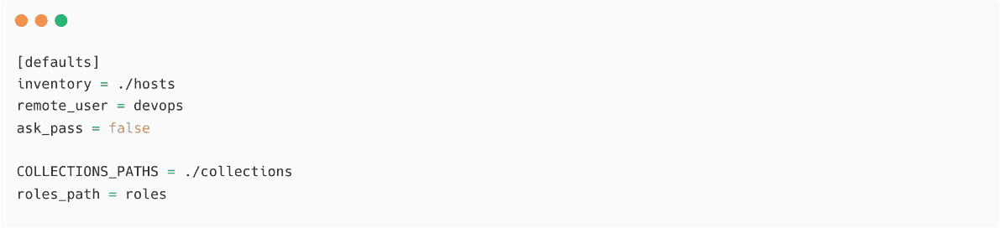
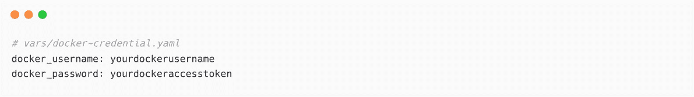

# 第十章：使用 Ansible 管理容器

自从容器化技术引入以来，组织可以更快速地部署应用，并通过频繁的更新和部署加速发布周期。然而，容器化应用相较于传统的服务器部署需要更多步骤。例如，你需要确保打包好的容器镜像按预期工作、安全标准已就位、卷挂载正常、机密信息安全存储等等。当应用发布频率更高时，自动化容器构建和部署任务将有助于实现更好的 CI/CD 工作流，并节省手动操作的时间。

使用 Ansible 容器管理的集合，我们可以管理容器的整个生命周期。这包括构建容器、将其推送到注册表、扫描其漏洞并进行部署。

在本章中，我们将涵盖以下主题：

+   管理容器主机

+   Ansible、容器与 CI/CD

+   使用 Ansible 管理容器

+   使用 Ansible 构建容器镜像

+   使用 Ansible 管理多容器应用

首先，你将学习如何使用 Ansible 部署容器引擎到主机上并在其中运行容器。接下来，你将学习如何管理容器镜像构建，并将其管理到容器注册表中。

# 技术要求

本章需要以下技术要求：

+   一台用于 Ansible 控制节点的 Linux 机器（需要连接互联网）

+   一台用于安装和配置 Docker 的 Linux 机器

+   访问 Docker 容器注册表（`hub.docker.com`）

+   关于容器和容器注册表（Docker 或 Podman）的基础知识

本章所有的 Ansible 代码和剧本，以及命令和代码片段，都可以在本书的 GitHub 仓库中找到，网址为：[`github.com/PacktPublishing/Ansible-for-Real-life-Automation/tree/main/Chapter-10`](https://github.com/PacktPublishing/Ansible-for-Real-life-Automation/tree/main/Chapter-10)。

# 管理容器主机

市面上有各种类型的容器软件，例如 **Docker** 和 **Podman**。在本章中，我们将使用 Docker 来解释和演示如何使用 Ansible 管理容器。我们将使用 Docker **社区版**（**CE**），这是免费的，但如果需要，你也可以使用 Docker **企业版**（**EE**）。

## Ansible Docker 先决条件

要使用 `docker` 库，你可以通过 `Python pip` 或者标准的包管理工具（例如 `yum`（`yum install python-docker-py`）或 `dnf`）来安装。如果你使用的是旧版本的 Python（2.6），那么你应该安装并使用旧版库 `docker-py`。

## 使用 Ansible 在主机上安装 Docker

在主机上安装 Docker 软件涉及多个步骤和配置。这些步骤可以手动完成，或者我们可以使用 Ansible Galaxy 中的 Ansible 角色。我们将使用由著名 Ansible 贡献者 *Jeff Geerling* 创建的社区 Ansible 角色 `geerlingguy.docker`（[`github.com/geerlingguy/ansible-role-docker`](https://github.com/geerlingguy/ansible-role-docker)）。

我们还将使用 `geerlingguy.pip` 来使用 Ansible 安装 Docker 库（例如，`docker`）。

按照以下步骤在 Linux 机器上安装 Docker 软件：

1.  在清单中将 `node1` 更新到 `dockerhost` 主机组（`chapter-10/hosts`）：

图 10.1 – 在清单中配置 Docker 主机

1.  在 `roles` 目录中安装 `geerlingguy.docker`，如下所示：

图 10.2 – 安装 Docker 角色

1.  创建一个名为 `Chapter-10/deploy-docker.yaml` 的 playbook 来安装角色和库：

图 10.3 – 使用 deploy-docker.yaml 在主机上安装 Docker

`pip_install_packages` 变量将由 `geerlingguy.pip` 角色使用，以通过 `pip` 安装列出的包。

1.  执行 playbook 在主机上部署 Docker：

图 10.4 – 执行 playbook 在主机上部署 Docker

1.  验证它是否已安装。登录到 `node1` 并检查详细信息：

图 10.5 – 验证 Docker 安装

这样，Docker 就已在主机上安装并配置完成，这意味着我们可以开始运行容器。

接下来，你将了解 Ansible 在管理容器化应用方面的能力。

# Ansible、容器和 CI/CD

将应用容器化将为你提供更多的集成、交付和部署选项，因为大多数工具都支持自动化构建、测试和执行。典型的容器化应用工作流程如下图所示：

图 10.6 – 基于 Docker 的部署中的典型 CI/CD 任务

上图中的大部分任务都可以使用 Ansible 自动化，因为 Ansible 的 Docker 和 Podman 集合包含了多个模块，用于支持在容器主机上构建、运行和管理容器。你可以使用 Ansible 实现整个工作流程，或者将 Ansible 与我们喜爱的 CI/CD 工具结合使用，更灵活地执行任务。你将学习如何在*第十二章*，*将 Ansible 与工具集成*中将 Ansible 与 Jenkins 集成。

在接下来的部分，你将学习如何使用 Ansible 管理容器并管理容器生命周期。

# 使用 Ansible 管理容器

Ansible 集合 `community.docker` ([`galaxy.ansible.com/community/docker`](https://galaxy.ansible.com/community/docker)) 包含 25 个以上的 Ansible 模块和大约 10 个用于连接、清单等的插件。这些模块将帮助你管理容器、容器镜像、容器注册表中的镜像、Docker 网络、Docker 卷、Docker 集群以及其他基于容器的操作。

如果你使用的是 Podman，可以在 Ansible Galaxy 中查看 `containers.podman` 集合 ([`galaxy.ansible.com/containers/podman`](https://galaxy.ansible.com/containers/podman))。

在接下来的章节中，你将学习如何使用 Ansible 构建、启动和管理容器。

安装 Ansible Docker 集合

安装集合非常简单，正如你在前面的章节中所学的那样：

1.  更新你的 `ansible.cfg` 配置文件，添加集合路径：

图 10.7 – ansible.cfg 配置文件，包含集合和角色路径

1.  安装 `community.docker` Ansible 集合：

图 10.8 – 安装 community.docker 集合

1.  验证集合是否已安装在集合路径中，如下所示的截图所示：

图 10.9 – 安装在集合路径中的 Docker 集合

如果你使用的是 Ansible 社区包，则默认路径中可能有一个旧版本的 `community.docker` 集合。这就是我们在项目路径（`COLLECTIONS_PATHS =`）中安装最新版本集合的原因：

图 10.10 – 来自默认 Ansible 安装的 Docker 集合

一旦集合可用，开始使用已安装的 Docker 模块。

在断开网络的 Ansible 控制节点上安装 Ansible 集合

如果你处于受限环境中（如断网或没有互联网），可以按照替代方法安装 Ansible 集合和角色：*如何在断开网络的 Ansible 控制节点上安装 Ansible 集合* ([`www.techbeatly.com/how-to-install-an-ansible-collection-on-a-disconnected-ansible-control-node`](https://www.techbeatly.com/how-to-install-an-ansible-collection-on-a-disconnected-ansible-control-node))。

## 使用 Ansible 启动 Docker 容器

使用你自己的容器镜像，或者使用来自公共 Docker 注册中心的现有容器镜像，例如 Docker Hub（`https://hub.docker.com`）、Quay.io（[`quay.io/repository`](https://quay.io/repository)）和 GitHub 容器注册中心（[`ghcr.io`](https://ghcr.io)）。也可以使用私有仓库中的容器镜像，但你需要通过用户名、密码或令牌进行认证，才能拉取或推送容器镜像。在*使用 Ansible 构建容器镜像*章节中，你将学习如何进行注册中心认证。

在本节中，你将学习如何使用 Ansible 运行 Docker 容器。为了简化演示，我们将使用默认的`nginx`（[`hub.docker.com/_/nginx`](https://hub.docker.com/_/nginx)）容器镜像，但之后可以探索使用其他容器镜像：

1.  创建一个名为`Chapter-10/container-manage.yaml`的 playbook，如下所示：

图 10.11 – container-manage.yaml

注意

变量可以在不同的变量文件中动态配置，例如`host_vars`或`group_vars`，也可以通过外部变量进行配置。已在 playbook 中使用的变量已提供，以展示用例的执行过程。

1.  添加一个任务，通过变量详情启动容器，如下所示：

图 10.12 – container-manage.yaml – 第二部分

我们稍后将使用`container_action`变量来控制容器的其他操作。

1.  在仓库中添加另一个`Chapter-10/container-manage.yaml`以包含完整的 playbook：

图 10.13 – container-manage.yaml – 使用第二个 play 验证容器内运行的应用

（参见*第一章*，*Ansible 自动化 – 入门*，以查看包含多个 play 的 playbook。）

1.  执行 playbook 时将`NODES`设置为`dockerhost`：

图 10.14 – 在 Docker 主机上执行 playbook

1.  一旦 playbook 成功执行，验证来自 Docker 主机（`node1`）的容器，如下所示：

图 10.15 – 在 Docker 主机上运行的 nginx 容器

在这里，`nginx`容器被命名为`web`，并在 Docker 主机的端口`8080`上暴露服务。

1.  访问运行在`nginx`容器内的网站。你需要记得使用端口`8080`，因为 Docker 端口已暴露在`8080`上：

图 10.16 – 使用 curl 命令后可用的 nginx 应用

1.  从浏览器访问网站，如下图所示：

图 10.17 – 使用 Ansible 部署的 Docker 容器内运行的 nginx Web 服务器

向容器添加更复杂的配置，如不同的 Docker 网络、挂载卷等。请参考[`docs.ansible.com/ansible/latest/collections/community/docker/docker_container_module.xhtml`](https://docs.ansible.com/ansible/latest/collections/community/docker/docker_container_module.xhtml)文档，了解各种参数和选项。

## 使用 Ansible 停止 Docker 容器

在 CI/CD 过程中，当您构建容器进行测试时，也需要处理清理任务。测试完成后，您需要停止容器并删除它作为后续维护的一部分。使用相同的 Ansible 模块 `community.docker.docker_container` 来处理整个容器生命周期，如停止、删除等操作。

在本节中，您将学习如何停止并移除我们在上一练习中创建的容器。请按照以下步骤操作：

1.  更新之前的 playbook `Chapter-10/container-manage.yaml`，并向第一个 play `管理 Docker 容器` 中添加任务，如下图所示：

图 10.18 – 添加停止和移除容器的任务

1.  执行 playbook 并传递 `container_action=stop` 作为额外变量：

图 10.19 - 执行 container-manage.yaml 文件以停止容器

1.  在容器主机（`node1`）上，验证是否有任何容器正在运行：

图 10.20 – nginx 容器已被停止并移除

根据需要向 playbook 添加更多任务，例如验证端口、备份容器卷中的某些配置文件、进行 API 调用等作为测试的一部分。

在本节中，您使用 Docker Registry 的公共容器镜像进行了简单的容器执行测试。在下一节中，您将学习如何使用 Ansible 构建一个包含所有必要依赖项的自定义容器镜像，并使用自定义镜像运行容器。

# 使用 Ansible 管理容器镜像

如我们从*图 10.6*中学到的，当开发人员将代码推送或合并分支到 Git 仓库时，您的集成阶段将开始。直接从您的 CI/CD 工具（如**Jenkins**或**GitHub Actions**）调用容器构建命令。然而，命令和管道任务是不确定的，因此您对输出和结果的控制较少。这时，您可以利用 Ansible playbook，因为它能提供更多灵活性和对构建过程及输出的控制。

在接下来的几节中，您将学习如何创建 Docker 容器注册表访问、使用 Ansible 构建容器镜像，并将容器镜像保存到容器注册表中。

## 配置 Docker 注册表访问

在将最新的镜像推送到容器注册表之前，您需要使用凭据登录到注册表。使用用户名和密码访问 Docker 注册表，但最佳实践是使用**访问令牌**而不是密码。下图显示了 Ansible 如何访问容器注册表以管理容器镜像：

图 10.21 – Ansible 到容器注册表访问

在本示范中，您将使用 Docker 注册表。有关其他注册表的信息，请查看文档（参考*容器注册表访问令牌*信息框）。请按照以下步骤操作：

1.  登录到 Docker Hub：[hub.docker.com](http://hub.docker.com)。

1.  在右上角，点击您的个人资料名称并从菜单中选择**账户设置**。

1.  选择**安全性**选项卡。

1.  点击**新建访问令牌**按钮并为您的令牌输入名称。之后，在**访问权限**下选择**读取、写入、删除**权限并点击**生成**：

图 10.22 – 在 Docker Hub 中创建新的访问令牌

1.  您将在下一屏幕上看到说明和令牌文本。记得复制并妥善保管该令牌，因为之后将无法再看到该令牌文本。

容器注册表访问令牌

要了解更多关于访问令牌的信息，请参考[`docs.docker.com/docker-hub/access-tokens/`](https://docs.docker.com/docker-hub/access-tokens/)（Docker Hub）和[`docs.quay.io/glossary/access-token.xhtml`](https://docs.quay.io/glossary/access-token.xhtml)（Quay）。

1.  创建一个 Ansible Vault 文件来存储 Docker 注册表凭据，具体如下：

图 10.23 – 使用 Ansible Vault 文件管理您的 Docker 注册表凭据

1.  将您的 Docker 用户名和访问令牌值添加到文件中并保存：

图 10.24 – 将您的 Docker 用户名和密码添加到 Ansible Vault 文件

这些变量将在接下来的章节中用于访问 Docker Registry。你可以将这些敏感信息保存在环境变量中，或使用 CI/CD 软件的内置秘密管理功能（例如 Jenkins 中的凭证）。

## 使用 Ansible 构建容器镜像

如你所知，你可以使用公共注册表（如 Docker Hub 或 Quay）中的现有 Docker 容器镜像。但对于我们的应用程序，我们需要构建容器镜像并使用它们来部署应用程序。

在 `community.docker.docker_image` 和其他模块的帮助下，我们可以轻松构建容器镜像，并将这些镜像推送到容器注册表。

创建应用程序或在互联网上查找示例应用程序，并利用它们进行进一步练习。以下是一些选项：

+   [`github.com/spring-projects/spring-petclinic`](https://github.com/spring-projects/spring-petclinic)

+   [`github.com/docker/getting-started/tree/master/app`](https://github.com/docker/getting-started/tree/master/app)

+   [`github.com/dockersamples/example-voting-app`](https://github.com/dockersamples/example-voting-app)

+   [`github.com/dockersamples`](https://github.com/dockersamples)

在本节中，你将使用 Dockerfile 将一个简单的 Node.js 应用程序（[`github.com/ginigangadharan/nodejs-todo-demo-app`](https://github.com/ginigangadharan/nodejs-todo-demo-app)）容器化。Dockerfile（[`docs.docker.com/engine/reference/builder`](https://docs.docker.com/engine/reference/builder)）是一个简单的文本文件，其中包含构建容器镜像的指令。之后，你将使用 Ansible 来构建容器镜像并将其推送到 Docker Registry。以下图示展示了涉及的步骤：

图 10.25 – 使用 Ansible 构建和管理容器镜像

Podman 和 Containerfiles

如果你使用的是不同的容器引擎，例如 Podman，那么请查看相应的模块文档并根据需要使用它。Podman 的 Ansible 模块可以在 [`docs.ansible.com/ansible/latest/collections/containers/podman/index.xhtml`](https://docs.ansible.com/ansible/latest/collections/containers/podman/index.xhtml) 找到，而 Podman 的构建文档可在 [`docs.podman.io/en/latest/markdown/podman-build.1.xhtml`](https://docs.podman.io/en/latest/markdown/podman-build.1.xhtml) 查阅。这将帮助你了解更多关于 Containerfiles 的信息。

访问仓库并执行以下步骤：

1.  验证应用程序仓库中的 Dockerfile（[`github.com/ginigangadharan/nodejs-todo-demo-app`](https://github.com/ginigangadharan/nodejs-todo-demo-app)）：

图 10.26 – 验证 Dockerfile 以构建容器镜像

Dockerfile 包含构建容器镜像的指令，并将应用程序暴露在端口 `3000` 上。

仓库还包含一个用 **Node.js** 编写的简单 **ToDo** 应用程序，包含支持的文件和目录：

图 10.27 – 应用程序仓库内容

1.  Fork 此仓库并根据需要进行更改。

1.  创建一个名为 `Chapter-10/container-build.yaml` 的 Playbook，并添加所需的变量以构建容器镜像，如下所示：

图 10.28 – 构建容器镜像的 Playbook

使用变量将帮助你动态地将值传递给同一个 Playbook，用于不同的镜像构建任务。

Docker 注册表 URL

请注意，[`index.docker.io/v1/`](https://index.docker.io/v1/) 是 Docker Hub 注册表的默认 URL。如果你使用的是其他注册表或私人容器注册表，请找到正确的注册表 URL 并将其用作 `container_registry_url`。

还需要检查包含的变量文件 `vars/docker-credential.yaml`，该文件包含 Docker 注册表的用户名和访问令牌（详细内容请参见本章的 *配置 Docker 注册表访问* 部分）。

1.  添加一个任务，用于在主机上创建临时工作目录并签出应用程序仓库。这是为了避免使用默认的目录名称并在同一 Playbook 并行执行时出现覆盖问题。你还需要在 Playbook 结束时删除该目录，作为清理的一部分：

图 10.29 – 构建容器镜像的任务

1.  添加一个任务，在创建新容器镜像之前，如果已有相同名称和标签的镜像，则删除该镜像。同时添加构建容器镜像的任务，提供工作目录路径，即 `temp_location.path`：

图 10.30 – 删除并创建新的容器镜像

1.  如果你想包括像扫描镜像、测试漏洞等任务，可以在此阶段添加（或者将其作为 CI/CD 管道中的 `post-build` 阶段的一部分）：

图 10.31 – 包含扫描或测试任务

1.  现在，我们需要在将镜像推送到仓库之前对 Docker 注册表进行身份验证。验证通过后，将镜像推送到 Docker 注册表，如下所示：

图 10.32 – 认证 Docker Hub 并将镜像推送到容器注册表

1.  可选地，向镜像添加 `latest` 标签，这样在拉取镜像时如果没有提到标签就会使用该标签：

图 10.33 – 为镜像添加最新标签并从 Docker Hub 注销

另外，注意最后一个任务是从容器注册表退出。出于安全原因，一旦镜像推送（或拉取）完成，务必从 Docker Registry 注销。

1.  最后，作为清理过程的一部分，删除临时工作目录：

图 10.34 – 删除临时工作目录

1.  执行 playbook 并验证结果。记得在命令中加上 `--ask-vault-password`，因为你已使用 Ansible Vault 包含了 Docker 凭证：

图 10.35 – 执行 playbook 来构建并推送容器镜像

1.  现在，从多个地方验证镜像，例如从 Docker 主机和 Docker 注册表 GUI（Docker Hub: [`hub.docker.com/repositories`](https://hub.docker.com/repositories)）。

1.  在 Docker 主机（`node1`）上检查镜像：

图 10.36 – 使用 Ansible 构建的容器镜像

1.  另外，按照以下截图的显示，验证 Docker Hub GUI 上的镜像 ([`hub.docker.com/repositories`](https://hub.docker.com/repositories))：

图 10.37 – Docker Hub 中的 Docker 镜像

1.  点击容器镜像条目查看更多镜像详细信息：

图 10.38 – Docker 镜像详细信息

为镜像添加更多细节，如容器镜像的 `README` 信息、支持的标签、文档链接等。

这样，我们就有了最新的容器镜像，并且应用已存储在容器注册表中。我们可以使用相同的 `Chapter-10/container-manage.yaml` playbook 来进行测试。

按照以下步骤运行容器并使用新镜像：

1.  使用 `Chapter-10/container-manage.yaml` playbook 启动新容器，但传递适当的额外变量，如 `container_image`、`container_name`、`container_port` 和 `container_expose_port`，如下所示：

图 10.39 – 使用不同镜像运行容器

1.  容器创建完成后，按照以下步骤在 Docker 主机（`node1`）上进行验证：

图 10.40 – 使用 Ansible 部署的 ToDo 应用容器

1.  从网页浏览器验证应用。记得添加端口 `8081`，如下所示，因为我们在运行容器时使用了端口 `8081`：

图 10.41 – 从网页浏览器访问 ToDo 应用

1.  添加一些条目并测试应用程序，如下截图所示：

图 10.42 – 使用示例条目测试 ToDo 应用程序

1.  使用相同的 playbook 停止容器作为日常管理的一部分，但传递 `container_action=stop` 动作：

图 10.43 – 使用 playbook 停止容器

注意

当您停止并销毁容器时，由于没有为数据持久性挂载任何卷，您存储的数据将会丢失。向 `Chapter-10/container-manage.yaml` 添加更多配置和卷的细节，增强您的 playbook。

在本节中，您学习了如何处理单个容器和容器镜像。但是，您可以根据应用程序堆栈使用 Ansible 来处理任意数量的镜像和容器。在下一节中，您将学习如何使用 Ansible 处理多个容器。

# 使用 Ansible 管理多容器应用程序

在本节中，您将使用著名的 **内容管理系统** (**CMS**) 应用堆栈 WordPress ([`wordpress.org`](https://wordpress.org))。WordPress 应用基于多个应用堆栈，包括 PHP、Web 服务器和数据库。WordPress 应用有一个容器镜像 ([`hub.docker.com/_/wordpress`](https://hub.docker.com/_/wordpress))。对于数据库，我们将使用 MariaDB 部署另一个容器 ([`hub.docker.com/_/mariadb`](https://hub.docker.com/_/mariadb))。

请参考 `Chapter-10/deploy-wordpress-on-docker.yaml` 文件，查看使用 Ansible 部署 WordPress CMS 的 Ansible playbook。请按照以下步骤操作：

1.  我们在 playbook 顶部声明了必要的参数，如下截图所示。请记住，使用 Ansible Vault（或在 Ansible 自动化控制器中使用凭证）或其他秘密管理服务存储敏感数据，如数据库用户名和密码。然后，这些变量会作为环境变量传递给容器，同时创建 Docker 卷，如下截图所示：

图 10.44 – 使用 Ansible 部署 WordPress

1.  有两个任务，如下截图所示。第一个任务将部署 MariaDB 容器，第二个任务将部署 WordPress 容器：

图 10.45 – 部署 WordPress 和 MariaDB 容器的 Ansible 任务

1.  执行 playbook 在 `node1` 上部署 WordPress 堆栈及 MariaDB 数据库：

图 10.46 – 使用 Ansible 部署 WordPress

1.  在 `node1` 上，验证 Docker 容器和 Docker 卷，如下截图所示：

图 10.47 – 在 Docker 主机上运行的 WordPress 和 MariaDB 容器

1.  通过浏览器使用我们已经配置的 `8082` 端口验证 WordPress 应用。初始的 WordPress 配置界面将可见，如下图所示。现在，我们可以配置 WordPress CMS 应用（[`wordpress.org/support/article/how-to-install-wordpress/#setup-configuration-file`](https://wordpress.org/support/article/how-to-install-wordpress/#setup-configuration-file)）：

图 10.48 – 初始的 WordPress 配置界面

通过配置额外的卷和配置，可以增强 playbook；请参考 WordPress 安装文档，以便为此类用例实施更多自动化步骤（[`wordpress.org/support/article/how-to-install-wordpress/#setup-configuration-file`](https://wordpress.org/support/article/how-to-install-wordpress/#setup-configuration-file)）。

通过本章，你已经学会了如何在 CI/CD 管道的不同阶段使用 Ansible 自动化整个容器镜像生命周期。与使用现有 CI/CD 工具中的原生容器管理功能相比，这将使你对构建和测试过程拥有更多的控制权。

# 摘要

本章中，你学习了如何使用 Ansible 在 Linux 机器上安装和配置 Docker。接着，你学习了如何从容器注册表拉取镜像，然后使用 Ansible 模块启动和停止该容器。最后，你学习了如何使用 Ansible 根据 Dockerfile 构建容器镜像，以及如何构建应用内容并将容器镜像推送到容器注册表。你还通过使用 Ansible 模块运行容器，测试了新构建的容器镜像。掌握了如何使用 Ansible 管理容器和容器镜像，将帮助你实现更好、更高效的 CI/CD 工作流和管道。与其在 CI/CD 工具中挣扎于有限的功能，不如利用 Ansible 的灵活性，向容器构建过程添加更多的验证、测试和集成。

在下一章中，你将学习如何在 Kubernetes 中管理容器化应用，并使用 Ansible 管理其他 Kubernetes 资源和应用。

# 进一步阅读

若想进一步了解本章所涵盖的主题，请查看以下资源：

+   *Docker Hub 的容器注册表访问令牌*：[`docs.docker.com/docker-hub/access-tokens`](https://docs.docker.com/docker-hub/access-tokens)

+   *Ansible docker-compose 模块*：[`docs.ansible.com/ansible/latest/collections/community/docker/docker_compose_module.xhtml`](https://docs.ansible.com/ansible/latest/collections/community/docker/docker_compose_module.xhtml)

+   *Docker RUN 和环境变量*: [`docs.docker.com/engine/reference/commandline/run/#set-environment-variables--e---env---env-file`](https://docs.docker.com/engine/reference/commandline/run/#set-environment-variables--e---env---env-file)

+   *Dockerfile 文档*: [`docs.docker.com/engine/reference/builder/`](https://docs.docker.com/engine/reference/builder/)

+   *学习 Docker 的 5 大免费资源*: [`www.techbeatly.com/top-5-free-resources-to-learn-docker/`](https://www.techbeatly.com/top-5-free-resources-to-learn-docker/)
