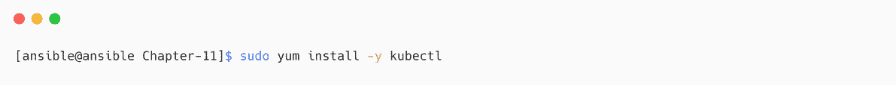
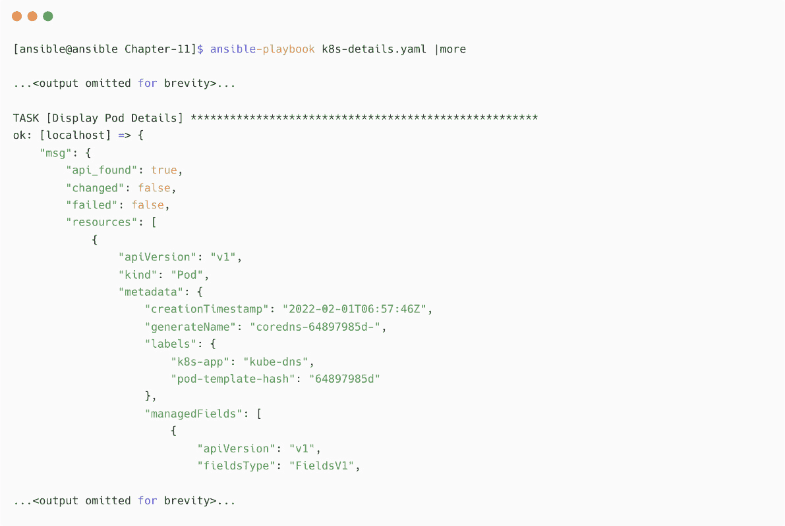

# 第十一章：使用 Ansible 管理 Kubernetes

由于应用程序的容器化和微服务革命，基于 Kubernetes 的平台变得越来越流行。应用程序的容器化和使用 Kubernetes 进行容器编排，为基础设施增加了额外的层次和复杂性，这需要自动化解决方案来管理大量组件。

在前一章中，你了解了 Ansible 构建和管理容器镜像与容器的功能。当涉及到容器编排工具时，如 Kubernetes 或 Red Hat OpenShift，有 Ansible 集合可用，包含模块和插件，用于支持和管理你的 Kubernetes 和 Red Hat OpenShift 集群及资源。

使用 Ansible 进行 Kubernetes 资源管理将帮助你在 DevOps 工作流和**持续集成/持续部署**（**CI/CD**）管道中实现更多的集成，从而灵活地部署应用程序。

在本章中，我们将覆盖以下主题：

+   Kubernetes 简介

+   使用 Ansible 管理 Kubernetes 集群

+   配置 Ansible 以支持 Kubernetes

+   使用 Ansible 将应用程序部署到 Kubernetes

+   扩展 Kubernetes 应用程序

+   在 Kubernetes Pod 内部执行命令

我们将学习如何使用 Ansible 集合来管理 Kubernetes，并通过它自动化 Kubernetes 集群操作和资源管理。

# 技术要求

以下是继续本章所需的技术要求：

+   一台用于 Ansible 控制节点的 Linux 机器

+   一个具有 API 访问权限的工作 Kubernetes 集群（参考[`minikube.sigs.k8s.io/docs/start`](https://minikube.sigs.k8s.io/docs/start)来启动一个本地 Kubernetes 集群）

+   关于容器和 Kubernetes 的基础知识

本章的所有 Ansible 代码、Ansible 剧本、命令和片段可以在 GitHub 仓库中找到：[`github.com/PacktPublishing/Ansible-for-Real-life-Automation/tree/main/Chapter-11`](https://github.com/PacktPublishing/Ansible-for-Real-life-Automation/tree/main/Chapter-11)。

# Kubernetes 简介

**Kubernetes**是一个开源容器编排平台，在这里我们可以部署和管理我们的容器化应用程序，而无需担心底层层次结构。这种服务模型被称为**平台即服务**（**PaaS**），开发人员可以自由地部署他们的应用程序及其他必要的资源，如存储、网络和密钥，而无需平台团队的帮助。

Kubernetes 平台包含多个组件，用于管理容器的部署和协调，如*图 11.1*所示：


图 11.1 – Kubernetes 集群的组件（来源：[`kubernetes.io/docs/concepts/overview/components/`](https://kubernetes.io/docs/concepts/overview/components/)）

让我们在接下来的部分简要了解这些组件。

## Kubernetes 控制平面

控制平面负责代表集群和应用程序做出决策，例如调度应用程序 Pods、检测和响应 Pod 故障，以及管理集群节点。控制平面有多个组件来处理这些操作，如下所示：

+   **kube-apiserver** – 提供 Kubernetes 集群 API，负责所有的中央管理和通信。Kubernetes 集群中的每个任务都是通过 Kubernetes API 服务器操作的。

+   **kube-controller-manager** – 包含多个控制器进程，如节点控制器、任务控制器、服务账户控制器和端点控制器。

+   **etcd** – 一个 **高可用性**（**HA**）键值存储，用于存储 Kubernetes 集群数据。

+   **kube-scheduler** – 帮助选择节点以部署 Pods。

## 节点上的组件

这些是运行在集群中每个节点上的 Kubernetes 组件，管理应用程序 Pods 及其网络：

+   **容器运行时** – 实际在后台运行容器的软件，例如 **containerd** 和 **CRI-O**。

+   **kubelet** – 按照规范管理运行中的容器。

+   **kube-proxy** – 通过维护节点上的网络规则，帮助实现 Kubernetes 服务。

和其他开源项目一样，Kubernetes 也是免费的，且得到 Kubernetes 用户和开发者社区的支持 ([`kubernetes.io/community`](https://kubernetes.io/community))。如果一个组织正在寻找企业级的 Kubernetes 发行版和支持，市场上有多种 Kubernetes 发行版作为交钥匙解决方案，例如 Red Hat OpenShift、Rancher 和 VMware Tanzu。

解释 Kubernetes 平台、概念和架构超出了本书的范围。你可以在本章末的 *进一步阅读* 部分找到更多详细信息。

要在 Kubernetes 中使用 Ansible，我们可以使用 **minikube**，它是一个本地的 Kubernetes 集群，用于学习和开发 Kubernetes 部署。请参考 [`minikube.sigs.k8s.io/docs/start`](https://minikube.sigs.k8s.io/docs/start) 上的文档，那里你可以找到适用于 Linux、Windows 和 macOS 平台的安装说明。

Kubernetes 文档

请参考 Kubernetes 文档 [`kubernetes.io/docs/home`](https://kubernetes.io/docs/home) 以了解更多关于 Kubernetes 的信息。也可以参考 *前 15 个免费 Kubernetes 课程* ([`www.techbeatly.com/kubernetes-free-courses`](https://www.techbeatly.com/kubernetes-free-courses)) 了解 Kubernetes 的基础知识。

在接下来的部分，我们将学习用于管理 Kubernetes 集群的 Ansible 方法。

# 使用 Ansible 管理 Kubernetes 集群

部署 Kubernetes 集群涉及许多步骤，包括准备节点、安装容器运行时包和配置网络。我们可以使用多种方法在测试或生产环境中部署 Kubernetes 集群。Kubernetes 集群的安装方法还取决于您的需求，例如，您是使用单节点集群还是使用具有 HA 的多节点集群，或者是否需要随时扩展集群。

**Kubespray** 是一种生产级的 Kubernetes 集群部署方法，基于 Ansible 进行配置和编排。使用 Kubespray，可以在裸金属服务器、虚拟机以及私有云或公有云平台（例如，AWS、GCE、Azure 和 OpenStack）上部署 Kubernetes 集群。

Kubespray 高度可定制，您可以根据需要选择不同的 Kubernetes 组件配置集群，如下所示：

+   支持的 **容器网络接口**（**CNI**） – Calico、Flannel、Kube-router、Kube-OVN、Weave 或 Multus

+   支持的 **容器运行时接口**（**CRI**） – containerd、Docker、CRI-O、Kata Containers 或 gVisor

+   支持的云服务提供商 – AWS、Azure、OpenStack 或 vSphere

+   支持的 **Ingress** – Kube-vip、ALB Ingress、MetalLB 或 Nginx

+   支持的操作系统 – Debian、Fedora CoreOS、Flatcar Container Linux、openSUSE、Red Hat Enterprise Linux、CentOS 或 Amazon Linux 2

使用 Kubespray 部署 Kubernetes 的详细说明可以在文档 ([`kubespray.io`](https://kubespray.io)) 和其他在线指南中找到。

一旦完成配置，Kubernetes 集群可以根据需要进行扩展（通过添加或删除节点），使用 Kubespray 无需担心新节点的手动配置和集群加入步骤。请参考以下信息框和本章末尾的 *进一步阅读* 部分，获取关于 Kubespray 更多信息的链接。

Kubespray

请参考文档 ([`kubespray.io`](https://kubespray.io)) 和项目仓库 ([`github.com/kubernetes-sigs/kubespray`](https://github.com/kubernetes-sigs/kubespray)) 了解有关 Kubespray 的更多选项。还可以查看 [`www.techbeatly.com/deploying-kubernetes-with-kubespray`](https://www.techbeatly.com/deploying-kubernetes-with-kubespray)，以获取关于如何使用 Kubespray 部署多节点 Kubernetes 集群的详细指南。

为了演示 Ansible 用例，我们使用了一个 minikube Kubernetes 环境，如下所示：


图 11.2 – minikube Kubernetes 集群详情

请参考文档 ([`minikube.sigs.k8s.io/docs/start`](https://minikube.sigs.k8s.io/docs/start)) 了解如何创建 minikube 环境的更多细节。

在下一节中，我们将学习如何配置 Ansible 以访问 Kubernetes 集群并检查集群资源。

# 配置 Ansible 以支持 Kubernetes

Ansible 可以使用 Kubernetes Python 库或直接通过 Kubernetes API 与 Kubernetes 集群进行通信，如*图 11.3*所示：


图 11.3 - Ansible 与 Kubernetes 的通信

用于管理 Kubernetes 的 Ansible 模块和插件可以在 `kubernetes.core` Ansible 集合中找到。（在 `kubernetes.core` 1.1 版本发布之前，Ansible Kubernetes 集合以 `community.kubernetes` 发布。）我们将在接下来的章节中安装、配置并使用 `kubernetes.core` 集合。

## Python 要求

要与 Kubernetes 或 OpenShift API 通信，可以使用 **OpenShift API 的 Python 客户端**（[`github.com/openshift/openshift-restclient-python`](https://github.com/openshift/openshift-restclient-python)）Python 库。在使用任何 Kubernetes 模块之前，你需要安装以下所需的 Python 库：

```
$ pip install openshift
$ pip install PyYAML
```

如果你在 Python 虚拟环境中使用 Ansible，请记得激活该环境并在其中安装库。

Kubernetes 的 Python 库

OpenShift REST 客户端依赖于 Kubernetes Python 客户端（[`github.com/kubernetes-client/python`](https://github.com/kubernetes-client/python)），该 Kubernetes Python 客户端将作为依赖项安装。同时，请查看 Ansible 为 Red Hat OpenShift 提供的内容集合（Ansible 博客）– [`www.ansible.com/blog/introducing-the-ansible-content-collection-for-red-hat-openshift`](https://www.ansible.com/blog/introducing-the-ansible-content-collection-for-red-hat-openshift)

## 安装 Ansible Kubernetes 集合

从 Ansible Galaxy 安装 Ansible Kubernetes 集合（[`galaxy.ansible.com/kubernetes/core`](https://galaxy.ansible.com/kubernetes/core)），步骤如下：

1.  如果你希望将集合安装到项目目录中，可以在 `ansible.cfg` 文件中配置集合路径的对象类型：


图 11.4 - 在 ansible.cfg 中配置集合路径

1.  安装 `kubernetes.core` 集合：


图 11.5 - 安装 kubernetes.core 集合

`kubernetes.core` 集合将根据你在 `ansible.cfg` 文件中提到的路径安装到集合目录内（`COLLECTIONS_PATHS = ./collections`）。

## 将 Ansible 连接到 Kubernetes

Ansible 将尝试使用`$HOME/.kube/config`文件，这是默认的 Kubernetes 配置文件（`kubeconfig`），包含 Kubernetes 集群的详细信息、凭证详细信息和连接上下文。如果你的`kubeconfig`文件位于其他路径或具有不同的文件名，请在 Ansible 剧本中的 Kubernetes `module`参数中指定此路径。

如前所述，我们有一个在 minikube 上运行的 Kubernetes 集群。`kubeconfig`文件和证书凭证已复制到 Ansible 控制节点，如下图所示：


图 11.6 – kubeconfig 文件和证书

如果你使用基本身份验证（用户名和密码）来访问集群，请在 Kubernetes 模块中指定这些详细信息。

对于生产环境，请记得遵循最佳实践来存储凭证、证书和访问密钥，使用 Ansible Vault 或任何其他秘密管理系统。

## 安装 kubectl CLI 工具

由于我们从控制节点进行操作，请在机器上安装`kubectl` CLI 工具，并执行`kubectl`命令以验证我们将通过 Ansible 创建的资源。

如果你的机器上已安装`kubectl`并能够访问 Kubernetes 集群，则跳过此步骤。

请参阅`kubectl`安装文档（[`kubernetes.io/docs/tasks/tools/install-kubectl-linux`](https://kubernetes.io/docs/tasks/tools/install-kubectl-linux)），并使用适合您环境的正确方法（由于我们在 Red Hat Enterprise Linux 机器上运行 Ansible 控制节点，以下命令基于 Red Hat Enterprise Linux/Fedora 发行版）：

1.  添加`kubectl`包的仓库。


图 11.7 – 添加 kubectl 包的仓库

1.  安装`kubectl`包：



图 11.8 – 安装 kubectl 工具

1.  配置`KUBECONFIG`环境变量，因为我们的`kubeconfig`文件名不同（`/home/ansible/.kube/minikube-config`），与默认文件名（`/home/ansible/.kube/config`）不同：


图 11.9 – 配置 KUBECONFIG 环境变量

1.  验证`kubectl` CLI 版本和集群详细信息。


图 11.10 – kubectl 版本信息

`kubectl` CLI 可以访问集群，我们将在接下来的章节中使用它来验证 Kubernetes 集群中的资源。

## 使用 Ansible 验证 Kubernetes 集群详细信息

收集集群详细信息和资源信息是一个重要步骤。Kubernetes 集群的详细信息可以通过`kubectl` CLI 收集，如*图 11.11*所示：


图 11.11 – 使用 kubectl CLI 收集的 Kubernetes 集群详细信息

使用`kubernetes.core.k8s_info`模块通过 Ansible 收集 Kubernetes 集群的类似详细信息（在 Ansible 2.9 之前，该模块被称为`k8s_facts`）。

按照以下步骤创建我们的第一个 Ansible playbook 与 Kubernetes 集群交互：

1.  创建`Chapter-11/k8s-details.yaml`，如下所示：


图 11.12 – 从 kube-system 命名空间获取 Pod 详细信息的任务

我们正在从 Kubernetes 集群的`kube-system`命名空间中获取 Pod 的详细信息。注意`hosts: localhost`这一行，因为执行需要在`localhost`上进行。Python 库将处理 Kubernetes 操作。

1.  执行 playbook 并验证输出。你将看到很多关于运行在`kube-system`命名空间内的 Pods 的详细信息，如*图 11.13*所示：



图 11.13 – 来自 Kubernetes 命名空间的 Pod 详细信息

1.  在同一个 playbook 中添加一个任务，以收集 Kubernetes 集群节点的详细信息。


图 11.14 – 获取 Kubernetes 节点详细信息的任务

1.  再次执行 playbook 并验证结果。

查看节点名称（在此示例中为`minikube`），如*图 11.15*中的输出所示。如果你有多个节点，你将在这里看到多个条目。


图 11.15 – 获取 Kubernetes 集群节点详细信息

通过使用不同的`kubeconfig`文件或在模块本身中提供凭证信息，如`api_key`、`client_cert`和`client_key`，来自定义不同集群的 playbook。有关更多详细信息，请参考`kubernetes.core.k8s_info`模块（[`docs.ansible.com/ansible/latest/collections/kubernetes/core/k8s_info_module.xhtml`](https://docs.ansible.com/ansible/latest/collections/kubernetes/core/k8s_info_module.xhtml)）。

现在，你已经学会了如何使用 Ansible 模块与 Kubernetes 集群进行通信，以及如何获取集群的详细信息。在下一节中，我们将通过在 Kubernetes 集群中创建资源和对象，进一步学习 Kubernetes 自动化的 Ansible 应用。

# 使用 Ansible 将应用部署到 Kubernetes

可以通过 Kubernetes 仪表板（Web UI）或使用 `kubectl` CLI ([`kubernetes.io/docs/reference/kubectl`](https://kubernetes.io/docs/reference/kubectl)) 在 Kubernetes 内部部署容器化应用程序。通过使用 Ansible，我们可以自动化在 Kubernetes 集群内部发生的大多数部署操作。由于 Ansible 可以轻松集成到 CI/CD 流水线中，因此可以在像 Kubernetes 这样的容器化环境中对应用程序部署进行更多控制。

应用程序部署在称为 Kubernetes **命名空间** 的逻辑隔离组内。可以有默认命名空间和与 Kubernetes 集群相关的命名空间，我们还可以根据需要创建额外的命名空间来部署应用程序。*图 11.16* 展示了 Kubernetes 集群中部署、Pod、服务和命名空间之间的关系：


图 11.16 – Kubernetes 部署和命名空间

在以下练习中，我们将通过创建专用的命名空间、部署配置和服务来部署一个应用程序：

1.  准备 `Chapter-11/todo-app-deploy.yaml` 部署定义文件，接下来的步骤中将使用该文件创建 Kubernetes 部署资源。我们可以创建在 *第十章*《使用 Ansible 管理容器》中创建的 `ginigangadharan/todo-app:latest` 镜像。


图 11.17 – 待办事项应用的 Kubernetes 定义文件

1.  准备一个 `Chapter-11/todo-app-service.yaml` Kubernetes 服务定义文件，以使用 `NodePort 300080` 暴露应用程序。根据所使用的 Kubernetes 集群，可以选择不同的 `NodePort`、`ClusterIP` 或 `LoadBalancer` 类型的服务。


图 11.18 – 待办事项应用的 Kubernetes 服务定义文件

1.  创建 `Chapter-11/k8s-app-deploy.yaml` playbook，并添加如下内容：


图 11.19 – 用于在 Kubernetes 中部署应用的 playbook

1.  执行 playbook：


图 11.20 – 执行 playbook 部署 todo-app

1.  使用 `kubectl` CLI 验证命名空间是否创建，如 *图 11.21* 所示：


图 11.21 – 使用 Ansible 创建的 Kubernetes 命名空间

1.  在同一个 playbook 中添加一个任务，用于使用 `todo-app-deploy.yaml` 部署定义文件创建部署，并使用 `todo-app-service.yaml` 文件创建 Kubernetes 服务资源，内容如下：


图 11.22 – 在 Kubernetes 中创建 Deployment 和 Service 资源的任务

1.  再次执行 playbook 来创建 Deployment。

1.  验证 Deployment、Pods、ReplicaSet 和 Service 资源是否已创建，如 *图 11.23* 所示：


图 11.23 – 由 Ansible 创建的 Deployment、Pod 和 Service

1.  由于我们使用的是 minikube 集群，我们可以通过运行 minikube 集群的机器（而不是 Ansible 控制节点）使用 `minikube service list` 命令获取暴露的服务详情，如 *图 11.24* 所示：


图 11.24 – 在 minikube 集群中暴露的服务详情

根据名称查找 `todo-app` 应用的 URL（在此案例中为 `http://192.168.64.10:30080`），并在下一步中使用它。

1.  通过 URL `http://192.168.64.10:30080` 在网页浏览器中访问应用，如 *图 11.25* 所示：


图 11.25 – 访问部署在 Kubernetes 集群中的待办应用

1.  在你的应用部署中扩展 playbook，加入更多资源和配置。例如，我们可以通过 Ingress 定义创建一个 Ingress 资源，如下所示：


图 11.26 – 待办应用的 Ingress 资源定义

1.  使用 Ansible 任务中的 Ingress 定义来创建 Ingress 资源，如下所示：


图 11.27 – 使用 Ansible 创建 Ingress 资源

我们还可以以变量的形式传递 Deployment 信息，并将其集成到我们的 CD 工作流中。

你已经学会了如何使用 Ansible 在 Kubernetes 中部署应用和服务资源。大多数 Kubernetes 资源可以通过 `kubernetes.core.k8s` 模块和资源定义文件来创建。然而，在 `kubernetes.core` 集合中还有其他有用的模块，我们将继续学习如何使用其中的一些模块，比如扩展应用和在 Pod 中运行命令。

# 扩展 Kubernetes 应用

Kubernetes 中的 **ReplicaSet** 资源确保指定数量的应用 Pod 副本作为 Deployment 的一部分运行。这个机制有助于在需要时横向扩展应用，而无需额外的资源配置。当你在 Kubernetes 中创建 Deployment 资源时，将会创建一个 ReplicaSet 资源，如 *图 11.28* 所示：


图 11.28 – 作为 Deployment 一部分创建的 ReplicaSet 资源

在部署定义文件中指定初始副本数为`replicas: 1`。ReplicaSet 将根据副本数量扩展 Pod 的数量。

当应用 Pod 上有额外流量时，使用`kubectl scale`命令扩展应用，如下所示（修改部署，而不是 ReplicaSet）：


图 11.29 – 使用 kubectl 扩展应用

等待复制更改生效并再次检查资源详细信息。你将发现现在有多个 Pod（三个）在运行，如*图 11.30*所示：


图 11.30 – 使用 ReplicaSet 资源扩展的应用

流量将通过`service/todoapp-svc`模块作为负载均衡器，分配给所有 Pods。请参考*图 11.31*，其中突出显示了多个*端点*，即 Pod 的 IP 地址：


图 11.31 – 一个具有多个 Pod 副本作为端点的 Kubernetes 服务

我们可以使用 Ansible 自动根据流量和条件管理 Kubernetes 应用的扩展。我们将在下一节中进一步了解`kubernetes.core.k8s_scale`模块，并进行实践。

## 使用 Ansible 扩展 Kubernetes 部署

`k8s_scale`模块是`kubernetes.core`集合的一部分，我们可以使用它来扩展或缩小 Kubernetes 部署。

在开始练习之前，记得将应用缩小为一个副本（`--replicas=1`），如下所示：


图 11.32 – 缩小 todo-app 副本

按照以下步骤创建用于扩展 Kubernetes 应用的 Ansible 工件：

1.  创建一个`Chapter-11/k8s-app-scale.yaml`剧本，并添加以下内容：


图 11.33 – 扩展 Kubernetes 部署的 Ansible 剧本

根据工作流中的下一个任务，调整`wait_timeout: 30`。例如，增加该值，以确保 Pod 副本在继续执行下一任务之前已经创建并成功运行。

1.  执行剧本：


图 11.34 – 执行 Kubernetes 部署扩展剧本

1.  使用`kubectl`命令验证 Pod 副本，如*图 11.35*所示：


图 11.35 – 扩展后的 Pod 副本

根据以下条件定制扩展：

+   `current_replicas: x`：只有当前副本数量与`current_replicas`值匹配时，才会更改副本。

+   `src: deployment.ym`l：这将从文件中读取部署和副本定义。

+   `wait: no`：这将不会等待缩放完成。

参阅 `k8s_scale` 模块文档获取更多细节（[`docs.ansible.com/ansible/latest/collections/kubernetes/core/k8s_scale_module.xhtml`](https://docs.ansible.com/ansible/latest/collections/kubernetes/core/k8s_scale_module.xhtml)）。

在下一节中，我们将学习 `k8s_exec` 模块，并了解如何使用它来排查 Pod 问题。

# 在 Kubernetes Pod 中执行命令

在正常情况下，我们不需要登录到 Pod 或容器中，因为应用程序通过一些端口暴露，服务会通过这些暴露的端口进行通信。然而，当出现问题时，我们需要访问容器并检查内部情况，通过查看日志、访问其他 Pod 或运行必要的故障排除命令。

如果你正在手动排查问题或收集信息，请使用 `kubectl exec` 命令：


图 11.36 – 使用 kubectl 工具在 Pod 中执行命令

然而，当我们使用 Ansible 自动化 Kubernetes 操作时，应使用 `k8s_exec` 模块，并同时自动化验证任务或验证过程。

对于这种场景，我们可以使用合适的镜像（例如，包含所需工具的镜像，如`ping`、`curl`或`netstat`）部署调试 Pod，并从这些 Pod 执行验证命令。一个典型的部署场景是使用测试 Pod（`curl-pod`），如*图 11.37*所示：


图 11.37 – 用于验证和确认应用程序的调试 Pod

在以下场景中，我们将创建一个 playbook，使用 `busyboxplus` 镜像（[`hub.docker.com/r/radial/busyboxplus`](https://hub.docker.com/r/radial/busyboxplus)）部署一个 `curl-pod` Pod，并验证 `curl-pod` Pod 中的 `todoapp-svc` 服务：

1.  创建 `curl-app-pod.yaml` 定义文件用于定义 `curl-pod` Pod，如下所示：


图 11.38 – curl-pod Pod 的 Kubernetes Deployment 定义

我们添加了一个 `sleep 50000` 命令；否则，Pod 会在没有运行任何进程的情况下退出。

1.  创建一个 `Chapter-11/curl-app-deploy.yaml` playbook，并添加如下内容：


图 11.39 – 用于部署 curl-pod 的 Ansible playbook

1.  添加一个任务，在 `curl-pod` Pod 中执行 `curl` 命令，以验证 `todoapp-svc` 服务是否可以访问。然后，添加任务以显示 `curl` 命令的输出，并验证成功与失败状态（`curl_output.failed == true`），如下所示：


图 11.40 – 在 curl-pod Pod 内执行 curl 命令并显示其状态的任务

最后一个任务是可选的，但添加更多的验证和消息将有助于实现更好的工作流程。

1.  一旦验证完成，删除 `curl-pod` Pod，因为我们不再需要它。


图 11.41 – 测试完成后删除 curl-pod Pod

1.  执行 playbook 并验证输出。如果 `todoapp-svc` 服务可以从 `curl-pod` Pod 访问，我们可以看到如 *图 11.42* 所示的 `curl` 输出：


图 11.42 – todoapp-svc 的 curl 命令输出

`kubernetes.core.k8s_exec` 模块在使用 Ansible 进行 Kubernetes 应用程序和集群管理的验证和确认中非常有用。该命令可以在调试 Pod 内执行，正如我们在前面的练习中所学的那样，甚至可以在应用程序 Pod 内执行以验证信息。

探索 `kubernetes.core` 集合，查找其他有用的模块和插件，以自动化您的 Kubernetes 部署和资源。

# 总结

在本章中，我们学习了用于 Kubernetes 集群和资源管理的 Ansible 集合。我们从 Kubernetes 组件的基础知识开始，讨论了如何使用 Kubespray 部署和管理 Kubernetes 集群及其支持的功能。

之后，我们学习了将 Kubernetes 集群连接到 Ansible 以自动化集群操作的方法。我们使用 Kubernetes Ansible 集合部署应用程序并扩展 Deployments。我们还学习了如何使用 Ansible 在运行中的 Kubernetes Pod 内执行命令，这可以用于验证和故障排除。本章简要介绍了使用 Ansible 自动化 Kubernetes 及其他重要信息，如 Kubernetes 内容集合以及将 Ansible 连接到 Kubernetes 的方法。

在下一章中，您将学习如何使用 Ansible 集成 CI/CD 和通信工具的不同方法。我们将进一步了解 Ansible 的企业版，名为 Ansible Automation Platform，以及其灵活的集成功能。

# 进一步阅读

欲了解更多本章内容的相关信息，请参考以下链接：

+   *Kubernetes Ansible 入门指南* – [`docs.ansible.com/ansible/latest/collections/kubernetes/core/docsite/scenario_guide.xhtml`](https://docs.ansible.com/ansible/latest/collections/kubernetes/core/docsite/scenario_guide.xhtml)

+   *Play with Kubernetes – 免费的动手实验室* – [`labs.play-with-k8s.com/`](https://labs.play-with-k8s.com/)

+   *CRI-O* – [`cri-o.io`](https://cri-o.io)

+   *containerd* – [`containerd.io/`](https://containerd.io/)

+   *前 15 名免费 Kubernetes 课程* – [`www.techbeatly.com/kubernetes-free-courses/`](https://www.techbeatly.com/kubernetes-free-courses/)

+   *什么是 Kubernetes？* – [`www.redhat.com/en/topics/containers/what-is-kubernetes`](https://www.redhat.com/en/topics/containers/what-is-kubernetes)

+   *免费的 OpenShift 实验室* – [learn.openshift.com](http://learn.openshift.com)

+   *Ansible kubernetes.core 集合* – [`galaxy.ansible.com/kubernetes/core`](https://galaxy.ansible.com/kubernetes/core) 或 [`console.redhat.com/ansible/automation-hub/repo/published/kubernetes/core`](https://console.redhat.com/ansible/automation-hub/repo/published/kubernetes/core)

+   *Ansible community.kubernetes 集合* – [`galaxy.ansible.com/community/kubernetes`](https://galaxy.ansible.com/community/kubernetes)

+   *模板化（Jinja2）* – [`docs.ansible.com/ansible/latest/user_guide/playbooks_templating.xhtml`](https://docs.ansible.com/ansible/latest/user_guide/playbooks_templating.xhtml)

+   *什么是 PaaS？* – [`www.redhat.com/en/topics/cloud-computing/what-is-paas`](https://www.redhat.com/en/topics/cloud-computing/what-is-paas)

+   *Microk8s* – [`microk8s.io`](https://microk8s.io)

+   *Red Hat OpenShift* – [`www.redhat.com/en/technologies/cloud-computing/openshift`](https://www.redhat.com/en/technologies/cloud-computing/openshift)

+   *Kubespray* – [`kubespray.io`](https://kubespray.io), [`github.com/kubernetes-sigs/kubespray`](https://github.com/kubernetes-sigs/kubespray)
