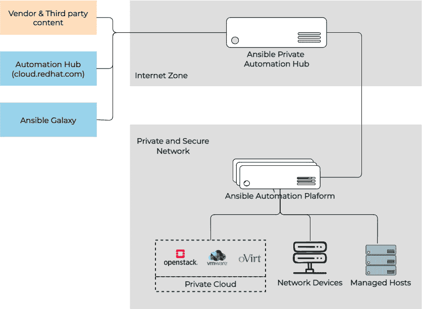
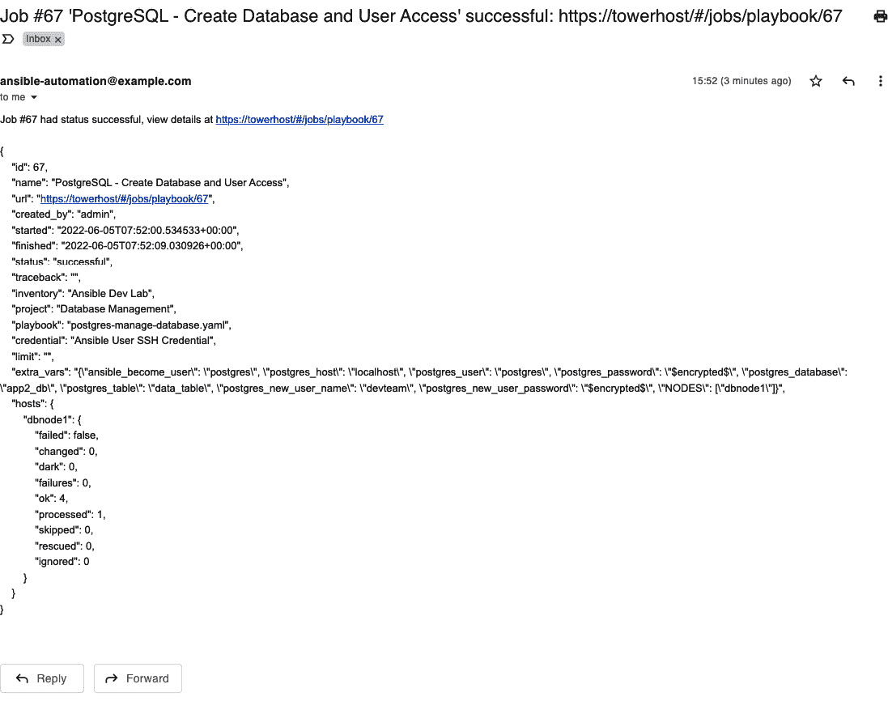
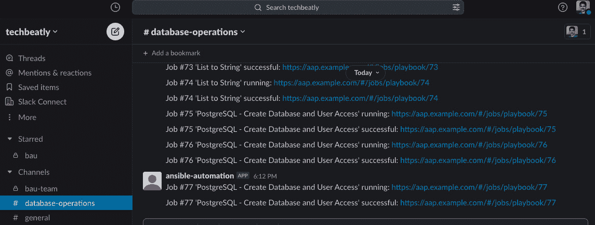

# 12

# 将 Ansible 与你的工具集成

随着组织 IT 基础设施的不断发展，通常需要越来越多的工具来解决技术难题。与其让这些工具独立工作在孤岛中，不如实现它们之间的集成，以提高效率和可扩展性。例如，**IT 服务管理** (**ITSM**) 工具可以向审批人发送警报，或者当团队开发出新版本时，容器平台可以触发应用程序的新部署。将多个孤立的 IT 基础设施工具进行集成，带来了无数的机会。

自动化同样适用；Ansible 可以作为实施多个基础设施和应用支持工具之间集成的关键自动化工具。在前几章中，你学习了基础设施（公有云和私有云）、DevOps、网络、应用程序等领域的 Ansible 自动化和集成机会。在本章中，你将了解更多有关企业自动化解决方案 **Ansible Automation Platform** (**AAP**) 以及如何在 IT 基础设施环境中与其他工具进行集成的方法。

我们将从介绍 Red Hat AAP 及其组件、功能和优势开始。然后，你将学习如何通过在自动化控制器中创建各种自动化资源（如项目、作业模板和凭证）来使用 AAP。

在本章中，我们将涵盖以下主题：

+   Red Hat AAP 简介

+   Red Hat AAP 组件

+   使用 Red Hat AAP 进行数据库管理

+   将 Jenkins 与 AAP 集成

+   将自动化控制器与 Slack 和通知服务集成

让我们开始学习 AAP，这一企业 IT 自动化工具。

# 技术要求

本章需要以下技术要求：

+   一台或多台配置了 Red Hat 仓库的 Linux 机器。如果你使用的是其他 Linux 操作系统而非 **Red Hat Enterprise Linux** (**RHEL**) 机器，请确保已配置相应的仓库，以便获取软件包和更新。

+   访问 Red Hat AAP。

+   一个 GitHub 帐户。

+   一个 Jenkins 服务器和有关 Jenkins 流水线的基本知识。

+   一个 Slack 应用帐户和有关 Slack 使用的基本知识。

一个 60 天的自助试用订阅可以用于测试 AAP 及其功能。请参阅 [`www.redhat.com/en/technologies/management/ansible/trial`](https://www.redhat.com/en/technologies/management/ansible/trial) 了解有关 AAP 试用订阅的更多信息。

本章的所有 Ansible 工件、命令和代码片段可以在本书的 GitHub 仓库中找到，地址为 [`github.com/PacktPublishing/Ansible-for-Real-life-Automation/tree/main/Chapter-12`](https://github.com/PacktPublishing/Ansible-for-Real-life-Automation/tree/main/Chapter-12)。

# Red Hat AAP 简介

到目前为止，您已经学习了如何使用 Ansible，开发剧本，创建角色，使用内容集合等来处理您的用例。任何人都可以在他们的工作站或环境中的任意服务器上安装并使用 Ansible，用于自动化用例。然而，由于每个人采用自己的方法和实践，这将导致没有标准化、痕迹或问责。因此，组织中会出现以下挑战：

+   个人工作各自为营，导致工作场所没有协作。

+   自动化工件（剧本、角色和集合）未在个人或团队之间共享。

+   由于自动化在个人工作站或任意服务器上运行，因此没有可用的日志记录或审计选项。

+   对谁可以执行剧本或自动化作业的控制较少。

+   隐私和凭证管理困难。

+   缺乏作业调度和监控功能。

+   管理托管节点信息的复杂性。

在企业自动化中，解决方案必须能够实施治理、标准化、协作、问责和审计。

Red Hat AAP 通过实施企业自动化解决方案，帮助组织应对之前提到的大部分挑战，从而可以扩展自动化并协调基础设施和应用程序。AAP 包括所有企业自动化所需的工具和功能，如**图形用户界面**（**GUI**）和**文本用户界面**（**TUI**）基础工具、分析、仪表板、审计等。

请注意，与 Ansible（`ansible-core` 或 `ansible` 包）不同，Red Hat AAP 不是免费的，并且以订阅模式提供（[`www.ansible.com/products/pricing`](https://www.ansible.com/products/pricing)），就像其他 Red Hat 产品一样。对于测试和**概念验证**（**POC**）目的，可以申请 60 天的试用订阅，并访问 https://www.redhat.com/en/technologies/management/ansible/try-it 了解更多信息。有关如何安装和配置 Red Hat AAP 的详细信息，请参阅 [`access.redhat.com/documentation/en-us/red_hat_ansible_automation_platform/2.1/html/red_hat_ansible_automation_platform_installation_guide/index`](https://access.redhat.com/documentation/en-us/red_hat_ansible_automation_platform/2.1/html/red_hat_ansible_automation_platform_installation_guide/index)。

也可以获得免费的 RHEL 个人开发者订阅，用于测试和开发目的。请参阅[`developers.redhat.com/articles/faqs-no-cost-red-hat-enterprise-linux`](https://developers.redhat.com/articles/faqs-no-cost-red-hat-enterprise-linux)了解有关此免费 RHEL 订阅的更多信息。

微软 Azure 中的 Red Hat AAP 托管服务

Red Hat 将 AAP 作为 Microsoft Azure 上的托管服务提供，组织可以像使用其他 Microsoft Azure 云服务一样使用 AAP 解决方案。这是由 Red Hat 完全支持的，计费将包含在同一个云服务账单中。有关此托管服务的更多信息，请参阅[`www.redhat.com/en/technologies/management/ansible/azure`](https://www.redhat.com/en/technologies/management/ansible/azure)。

现在，让我们探索 Red Hat AAP 的各种功能。

## Red Hat AAP 的功能

以下是 Red Hat AAP 包含的重要功能：

+   **WebUI**：基于 Web 的 GUI 可以帮助管理员和开发人员通过 Web 浏览器管理整个自动化解决方案。AAP 中的大多数配置都可以直接从 WebUI 执行，如下所示的截图所示：


图 12.1 – Red Hat AAP 仪表板

+   **基于角色的访问控制**（**RBAC**）：管理员可以在 AAP 中创建团队和角色，并将适当的权限分配给用户或团队。这些权限可以针对 AAP 中的每个组件进行配置，例如项目、作业模板、清单或凭据。

+   **日志记录和审计**：AAP 将存储活动日志，包括作业执行历史记录，并且可以随时通过 WebUI 访问旧的作业详情。AAP 还包括与日志聚合工具（如 Logstash、Splunk、Loggly、Sumo Logic 等）集成的选项，以便我们可以将日志保存在中央系统中。

+   **REST API**（**也称为 RESTful API**）：强大且文档完善的 REST API 将帮助您将 AAP 与您环境中现有的工具和应用程序集成。

自动化控制器 API 指南

自动化控制器的 REST API 还帮助您管理自动化控制器操作，如作业模板创建、凭据管理或配置身份验证。有关详细信息，请参阅 API 指南 [`docs.ansible.com/automation-controller/latest/html/controllerapi/index.xhtml`](https://docs.ansible.com/automation-controller/latest/html/controllerapi/index.xhtml)。

+   **作业模板和工作流**：可以预定义和配置作业模板和工作流模板，以便快速执行复杂的自动化作业（[`docs.ansible.com/automation-controller/latest/html/userguide/workflows.xhtml`](https://docs.ansible.com/automation-controller/latest/html/userguide/workflows.xhtml)）。

+   **凭据管理**：使用凭据，您可以存储密码、API 密钥、令牌等敏感信息。AAP 提供了几种预定义的凭据类型，如果需要，还可以创建自定义凭据类型（[`docs.ansible.com/automation-controller/latest/html/userguide/credential_types.xhtml`](https://docs.ansible.com/automation-controller/latest/html/userguide/credential_types.xhtml)）：


图 12.2 – 自动化控制器凭证

+   **作业调度**：自动化作业可以自动调度和执行，无需用户干预，如下截图所示。这对于许多需要在特定时间段执行且不需要手动干预的自动化作业非常有用。例如，我们可以使用自动化控制器调度每周或每月的重启作业（如我们在*第三章*《自动化日常作业》中所学到的）：


图 12.3 – 自动化控制器中的作业调度

+   **通知**：AAP 支持多种类型的通知，如电子邮件、IRC 和 Webhook，以及 Grafana、Slack、Mattermost 等工具的集成。

+   **与 Red Hat Insights 的集成**：启用此集成后，可以分析您环境中自动化平台（AAP 集群）的自动化状态和数据。

+   **与第三方认证系统的集成**：无需在 AAP 中管理本地用户账户，而是与现有的认证提供商集成，例如 Active Directory、Google OAuth2、LDAP、RADIUS、SAMPLE 或 TACACS。

Red Hat AAP 特性与优势

请访问[`www.redhat.com/en/technologies/management/ansible/features`](https://www.redhat.com/en/technologies/management/ansible/features)了解有关 AAP 的更多功能及其优势。

在下一节中，您将深入了解 Red Hat AAP 的组件。

# Red Hat AAP 组件

Red Hat AAP 是一个包含多个组件的自动化套件，如下图所示：


图 12.4 – Red Hat AAP 2.1 组件的高级图示（来源：https://www.ansible.com/blog/introducing-red-hat-ansible-automation-platform-2.1）

在接下来的章节中，您将了解 AAP 的不同组件，如自动化控制器、执行环境和自动化网格。

## Ansible 自动化控制器

**自动化控制器**之前被称为**Ansible Tower**。它是 AAP 的控制平面和核心组件。随着 Ansible 自动化控制器的引入，控制平面组件（WebUI 和 API）与**执行环境**（**EE**）解耦，这也帮助解决方案增加了额外的执行节点。

使用自动化控制器，我们可以通过 WebUI 管理 AAP 操作，例如管理远程节点（库存）、凭证、项目、作业模板和其他操作。自动化控制器包含多个组件，如下所示：

+   用于库存、凭证和作业管理的 REST API

+   用于存储资源详情的数据库，包括自动化任务的历史记录

+   自动化网格连接器和接收器

+   消息队列和缓存

+   任务调度器

根据 RBAC 配置，用户在自动化控制器界面上将拥有不同的权限。

什么是 Red Hat Ansible 自动化平台的自动化控制器？

要了解更多关于自动化控制器的信息，请查看 *什么是 Red Hat Ansible 自动化平台的自动化控制器？*（[`www.redhat.com/en/technologies/management/ansible/automation-controller`](https://www.redhat.com/en/technologies/management/ansible/automation-controller)）。

Ansible Tower 和 AAP 生命周期

Ansible 自动化控制器 3.8（Ansible Tower）自版本 1.2 起已成为 AAP 的一部分。请参考 Ansible Tower 生命周期（[`access.redhat.com/support/policy/updates/ansible-tower`](https://access.redhat.com/support/policy/updates/ansible-tower)）和 AAP 生命周期（[`access.redhat.com/support/policy/updates/ansible-automation-platform`](https://access.redhat.com/support/policy/updates/ansible-automation-platform)）以了解更多关于这些版本的信息。

`ansible-navigator` 是一个 TUI 工具，用于与自动化执行环境交互。在以下截图中可以看到。`ansible-navigator` 对于开发和测试自动化内容也很有帮助：


图 12.5 – ansible-navigator TUI

我们可以使用 `ansible-navigator` 来管理 Ansible 的所有命令行操作，如执行 playbook、管理集合、执行环境等，而不需要使用 `ansible-playbook` 和其他 `ansible-*` 命令。

请参考 Ansible navigator 文档（[`ansible-navigator.readthedocs.io`](https://ansible-navigator.readthedocs.io)）和 Ansible navigator 快捷操作表（[`www.techbeatly.com/ansible-navigator-cheat-sheet`](https://www.techbeatly.com/ansible-navigator-cheat-sheet)）以了解更多信息。

## 自动化执行环境

自动化执行环境提供了一种标准和可移植的机制，用于执行 Ansible playbook。执行环境在设计上是一致的，并提供包含以下组件的容器镜像：

+   Ansible

+   Ansible Runner

+   所需的 Ansible 集合

+   playbook 执行所需的其他依赖项（例如，Python 库、系统包）

之前，使用 Python 虚拟环境（例如，`/var/lib/awx/venv/ansible`）来实现此功能。在一致性方面，管理和维护这项功能并不容易，因为需要在 AAP 或 Ansible Tower 集群的所有节点上管理 Python 虚拟环境。通过容器化可执行文件和依赖项，可以将相同的镜像一致地分发到多个集群节点：


图 12.6 – 自动化执行环境中的组件

`ansible-builder` 是一个命令行工具，可以用来构建和管理自动化执行环境的容器镜像。有关构建和分发自动化执行环境的更多信息，请参考自动化执行环境文档（[`docs.ansible.com/automation-controller/latest/html/userguide/execution_environments.xhtml`](https://docs.ansible.com/automation-controller/latest/html/userguide/execution_environments.xhtml)）。

## 自动化网格

自动化网格是 Ansible 自动化的服务网格概念，并在 AAP 2.1 中引入。自动化网格替代了 AAP 旧版本（1.2 及以下）中的孤立节点概念，并提供了扩展自动化生态系统的灵活性。自动化网格消除了跳板服务器（或堡垒主机）的需求，并且可以将执行节点放置在靠近被管理节点的位置，如下图所示：

）](img/B18383_12_07.jpg)

图 12.7 – AAP 与自动化网格（来源： [`www.ansible.com/blog/whats-new-in-ansible-automation-platform-2.1-automation-mesh`](https://www.ansible.com/blog/whats-new-in-ansible-automation-platform-2.1-automation-mesh)）

有关自动化网格的更多信息，请参考文档（[`www.ansible.com/products/automation-mesh`](https://www.ansible.com/products/automation-mesh)）。

## 自动化中心

Ansible 自动化中心是下载受支持和认证的 Ansible 集合的官方位置。托管的自动化中心可通过 [`console.redhat.com/ansible/automation-hub`](https://console.redhat.com/ansible/automation-hub) 访问，如下图所示：


图 12.8 – Ansible 自动化中心

为了管理您的内容集合和其他受支持的集合，可以使用 **私有自动化中心**（**PAH**）。这一概念是在 AAP 1.2 中引入的。来自其他来源（例如 Red Hat Ansible 自动化中心或 Ansible Galaxy）的内容可以同步到私有自动化中心，如下图所示：



图 12.9 – 带 AAP 的私有自动化中心

有关自动化中心的更多信息，请参考文档（[`docs.ansible.com/ansible/latest/reference_appendices/automationhub.xhtml`](https://docs.ansible.com/ansible/latest/reference_appendices/automationhub.xhtml)）和产品页面（[`www.ansible.com/products/automation-hub`](https://www.ansible.com/products/automation-hub)）。

Ansible AWX 和 Ansible 自动化控制器

Ansible AWX 是由 Red Hat 赞助的开源社区项目。它是 Red Hat AAP 中自动化控制器组件的上游项目。（Red Hat Ansible Tower 3.2 是基于 Ansible AWX 项目的第一个版本。）Ansible AWX 是一个快速发展的项目（[`github.com/ansible/awx`](https://github.com/ansible/awx)），主要通过 IRC（[`web.libera.chat/#ansible-awx`](https://web.libera.chat/#ansible-awx)）和 AWX 邮件列表（[`groups.google.com/forum/#!forum/awx-project`](https://groups.google.com/forum/#!forum/awx-project)）由社区支持。请参阅项目页面（[`www.ansible.com/community/awx-project`](https://www.ansible.com/community/awx-project)）和常见问题（[`www.ansible.com/products/awx-project/faq`](https://www.ansible.com/products/awx-project/faq)）以了解更多关于 Ansible AWX 的信息。

在接下来的章节中，您将学习如何开始使用 Red Hat AAP 来实现自动化用例。

# 使用 Red Hat AAP 进行数据库管理

在*第八章*中，*帮助数据库团队实现自动化*，您学习了如何使用 Ansible 来自动化数据库创建和用户管理操作。本节将重复使用相同的 Ansible 工件，但在不同的仓库中，并从 Red Hat AAP 执行该作业。

以下是本节的前提条件：

+   访问 Red Hat Ansible 自动化控制器 WebUI

+   访问包含必要 Ansible 工件的 GitHub 仓库（[`github.com/ginigangadharan/ansible-database-demo`](https://github.com/ginigangadharan/ansible-database-demo)）

+   访问目标节点（数据库节点）

作业模板是自动化控制器中的核心资源，但作业模板需要一些其他资源作为依赖项。


图 12.10 – Ansible 自动化平台中的组件和依赖关系

您将学习在 Ansible 自动化控制器中进行基本操作，并创建各种资源，如下所示：

+   组织

+   项目

+   清单、管理节点和组

+   凭证

+   带有调查表单和额外变量的作业模板

在接下来的章节中，我们将学习如何访问 Ansible 自动化控制器并创建其中的资源。

## 访问 Ansible 自动化控制器

从支持的网页浏览器访问自动化控制器的 IP 地址或主机名，并使用用户名和密码登录，如下图所示：


图 12.11 – Ansible 自动化控制器 WebUI 登录页面

根据 RBAC 配置和权限，您将在仪表盘上找到允许的菜单和配置项：


图 12.12 – Ansible 自动化控制器仪表盘

要管理不同的项目、用户和其他资源，请创建一个新的*组织*；请参见以下截图中显示的示例。组织是项目、库存、团队和用户的逻辑集合（这是一个可选步骤；可以使用自动化控制器中已经存在的**默认**组织）：


图 12.13 – 创建新组织

一旦创建了新组织，就创建一个新项目。

## 在自动化控制器中创建项目

点击**项目**菜单，然后点击**添加**以创建一个新的项目，如下图所示。对于**源代码控制 URL**，使用 [`github.com/ginigangadharan/ansible-database-demo`](https://github.com/ginigangadharan/ansible-database-demo)：


图 12.14 – 在自动化控制器中创建新项目

由于 GitHub 仓库是公开的，我们不需要凭证来访问它。对于私有 GitHub 仓库，您需要提供凭证；您将在下一节学习如何创建凭证，当我们添加库存和管理节点时。

验证项目的同步状态，如下图所示：


图 12.15 – 项目详情和任务状态

如您所见，自动化控制器已完成从 GitHub 仓库同步内容到本地目录（`Playbook Directory: _15__database_management`）。

如果在同步内容时遇到任何问题，请检查您的互联网连接或与 Git 服务器（对于私有仓库）的连接，并确保必要的访问权限已经到位。

## 创建库存和管理节点

在前面的章节中，您使用静态文件（和动态库存插件）创建了 Ansible 库存，如下图所示：


图 12.16 – 使用静态文件创建 Ansible 库存

现在，让我们在自动化控制器中使用 WebUI 创建一个新的库存、管理节点和主机组：

1.  打开左侧的**库存**选项卡，并**添加**一个新库存，如下图所示：


图 12.17 – 在自动化控制器中创建 Ansible 库存

将创建一个新的库存，并显示其状态：


图 12.18 – 自动化控制器中的 Ansible 库存

1.  现在，选择顶部的**组**选项卡，然后点击**添加**以创建一个新的主机组：


图 12.19 – 创建新主机组

新主机组的详细信息将显示，如下图所示：


图 12.20 – 新主机组详情

1.  点击顶部的**主机**选项卡，然后点击**添加**并选择**添加新主机**，如下一截图所示：


图 12.21 – 将新主机添加到主机组

如果您已经直接添加了主机，则通过选择**添加现有主机**将主机添加到此主机组中。

1.  创建一个新的主机，并提供主机名和`ansible_host`信息，如下所示：


图 12.22 – 创建新主机

可以为主机组在**变量**部分添加更多变量，作为主机，如*图 12.22*和*图 12.20*所示。

将您的库存导入自动化控制器

除了逐一添加管理节点外，您还可以从项目源、公共云或其他库存管理系统导入库存。请参阅文档[`docs.ansible.com/automation-controller/latest/html/administration/scm-inv-source.xhtml`](https://docs.ansible.com/automation-controller/latest/html/administration/scm-inv-source.xhtml)了解更多信息。

## 在自动化控制器中创建凭证

在前几章中，我们使用 SSH 密钥访问管理节点。SSH 私钥存储在 Ansible 控制节点（`/home/ansible/.ssh/id_rsa`）中，但在这种情况下，我们必须通过凭证传递私钥。

打开`devops`和 SSH 私钥（您也可以使用`password`作为凭证）：


图 12.23 – 添加机器凭证

由于我们已为`sudo`访问启用了`NOPASSWD`（参见*第一章*，*Ansible 自动化 – 介绍*，*配置您的管理节点*部分），因此我们不需要在**权限提升**字段中输入任何数据：


图 12.24 – 机器凭证权限提升字段

保存凭证并验证其详细信息。密码和 SSH 私钥内容将被加密，且任何人都无法查看。您只能重置凭证中的 SSH 私钥内容或密码，如下图所示：


图 12.25 – 加密的 SSH 私钥内容

通过这些设置，您已经创建了一个项目，一个包含管理节点（`dbnode1`）的库存，并且已经创建了访问该节点的凭证。现在，您必须使用`Chapter-08/postgres-manage-database.yaml`剧本创建一个作业模板，如下一节所述。

Ansible 自动化控制器 – 凭证

了解更多关于自动化控制器凭据的信息，请访问[`docs.ansible.com/automation-controller/latest/html/userguide/credentials.xhtml`](https://docs.ansible.com/automation-controller/latest/html/userguide/credentials.xhtml)。要了解更多关于自定义凭据的信息，请访问[`docs.ansible.com/automation-controller/latest/html/userguide/credential_types.xhtml`](https://docs.ansible.com/automation-controller/latest/html/userguide/credential_types.xhtml)。

## 创建新的作业模板

自动化控制器中的作业模板是一个预配置的定义，包含一组参数和用于执行 Ansible 自动化作业的剧本。要多次执行相同的作业，使用作业模板并根据需要传递参数。请按以下步骤操作：

1.  打开仪表板左侧的**模板**标签。然后，点击**添加**并选择**添加作业模板**，如图所示：


图 12.26 – 创建作业模板

1.  输入作业模板的详细信息：


图 12.27 – 作业模板详情

自动化控制器中的作业模板

请参考文档[`docs.ansible.com/automation-controller/latest/html/userguide/job_templates.xhtml`](https://docs.ansible.com/automation-controller/latest/html/userguide/job_templates.xhtml)，了解如何通过附加选项自定义作业模板。

我们在剧本中使用了变量（*图 12.28*）来展示操作，避免了复杂性。在实际环境中，这些变量可以从额外的变量文件、组变量、主机变量或额外变量中获取。现在，我们必须将变量和值传递给作业模板，而不是在 Ansible 剧本中使用硬编码的变量：


图 12.28 – Ansible 剧本中的硬编码变量

可以通过自动传递参数给剧本的`extra_vars`来覆盖这些值。

1.  点击**作业模板**的**调查**标签，如下所示：


图 12.29 – 作业模板调查

1.  通过点击**添加**按钮并填写详细信息来创建新的调查问题：


图 12.30 – 用于收集 NODES 信息的作业模板调查表单

在前面的截图中，我们可以看到以下详细信息：

+   答案变量的名称是`NODES`，我们将其传递给剧本的`hosts`（`hosts: "{{ NODES }}"`）。

+   将显示一个多选菜单，供选择选项。

根据需要继续为其他变量创建调查问题。同时，记得启用调查，如下截图所示：


图 12.31 – Ansible 作业模板的调查变量

记得对于包含敏感信息（如密码或机密信息）的变量使用`password`类型。

自动化控制器中的调查表单

调查表单可以用来通过用户友好的表单和验证设置作业的额外变量。请参阅文档[`docs.ansible.com/automation-controller/latest/html/userguide/job_templates.xhtml#surveys`](https://docs.ansible.com/automation-controller/latest/html/userguide/job_templates.xhtml#surveys)，了解更多关于调查表单的信息。

我们假设以下变量在每次执行时不会更改，因此不需要放入调查表单中：

```
ansible_become_user: postgres 
postgres_host: localhost
```

相反，将它们作为额外变量添加，并保存作业模板：


图 12.32 – Ansible 作业模板中的额外变量

还可以将像`ansible_become_user`这样的变量传递到主机变量或组变量部分，但这会影响该节点上的所有作业，这在此情况下不是所需的配置。

在下一节中，你将学习如何执行我们之前配置的自动化作业。

## 从自动化控制器执行自动化作业

在前面的章节中，你已经在自动化控制器中配置了许多资源，例如组织、项目、库存、受管节点、凭证、作业模板等。现在，让我们通过启动自动化作业来测试作业模板。

Ansible 集合和执行环境

使用来自执行环境或项目库的集合（`COLLECTIONS_PATHS = ./collections`）。并非所有的 Ansible 集合（或最新版本）都会在执行环境中可用，并且可以创建一个自定义的执行环境，包含所需的集合和库。请参阅[`docs.ansible.com/automation-controller/latest/html/userguide/execution_environments.xhtml`](https://docs.ansible.com/automation-controller/latest/html/userguide/execution_environments.xhtml)中的文档，了解更多关于创建执行环境的信息。在这个演示中，我们将使用`community.postgresql` Ansible 集合，该集合已在项目库中可用（请参见*第八章*，*帮助数据库团队实现自动化*）。

从自动化控制器仪表盘中打开**模板**标签，找到我们在前一章节中创建的 PostgreSQL 作业模板。点击**启动模板**按钮（小火箭图标），等待调查表单弹出：


图 12.33 – 从自动化控制器启动作业模板

在调查表单中输入详细信息，然后点击**下一步**：


图 12.34 – 在调查表中输入详细信息

详细信息将在预览屏幕上显示。请注意，调查变量作为额外变量传递。点击**启动**按钮，等待作业屏幕加载：


图 12.35 – 作业预览详情

该作业将在目标节点上执行。关于该作业的每个细节将显示在**输出**选项卡上，包括 playbook 执行的输出，如下图所示：


图 12.36 – 自动化控制器上的作业执行输出

根据需要在数据库节点（`dbnode1`）上验证数据库和用户的创建。

相同的作业模板可以用于在不同的数据库节点或数据库上执行操作，因为变量是动态的，不需要在 playbook 中修改。

在本节中，您学习了如何创建基本资源并在自动化控制器中启动自动化作业。在下一节中，您将学习如何将其他应用程序（如 Jenkins CI/CD 服务器）与自动化控制器集成并触发自动化执行。

# 与 AAP 集成 Jenkins

Jenkins（[`www.jenkins.io`](https://www.jenkins.io)）是一个广为人知的开源工具（用 Java 编程语言编写），可用于实现**持续集成/持续交付**（**CI/CD**）和部署解决方案。自动化构建和部署是有效 DevOps 实践的关键。如以下图所示，开发人员和测试人员可以将这些任务委托给 CI/CD 工具，如 Jenkins：


图 12.37 – 使用 Jenkins 的 CI/CD 工作流

Jenkins 可以原生执行许多任务或使用插件，但对于复杂任务，Jenkins 可以利用适当的工具。例如，可以将特定作业卸载到 Ansible 自动化控制器，而不是在 Jenkins 管道中调用复杂的脚本或命令，如下图所示：


图 12.38 – Jenkins 与 AAP 集成进行数据库操作

自动化控制器将根据传递的参数执行作业，并将结果作为反馈（成功/失败及其他消息）返回给 Jenkins。

GitOps 和 CI/CD 课程

请参考 [`www.techbeatly.com/gitops-cicd/`](https://www.techbeatly.com/gitops-cicd/) 查找免费的 GitOps 和 CI/CD 课程及认证，包括 Jenkins 课程。

在以下演示中，您将重新使用数据库创建作业模板，作为部署 ToDo 应用程序的一部分。

以下是先决条件：

+   Jenkins 服务器必须安装了 Ansible Tower 插件（[`plugins.jenkins.io/ansible-tower`](https://plugins.jenkins.io/ansible-tower)）。

+   了解 Jenkins 的操作和配置。

+   `PostgreSQL - 创建数据库和用户访问` 作业模板必须已在自动化控制器上配置。

+   应用程序代码库（[`github.com/ginigangadharan/nodejs-todo-demo-app`](https://github.com/ginigangadharan/nodejs-todo-demo-app)）。

## Jenkins 的 Ansible Tower 插件

Jenkins 中的 Ansible Tower 插件帮助你通过传递适当的参数，在 Ansible Tower（或自动化控制器）上执行自动化作业：


图 12.39 – Jenkins 的 Ansible Tower 插件

如果尚未安装插件，请安装该插件并在 **管理 Jenkins** | **配置系统** 下创建 Ansible Tower（自动化控制器）连接（添加所需的凭据）：


图 12.40 – Jenkins 中 Ansible Tower 插件的自动化控制器配置

通过点击 **测试连接** 按钮验证 Jenkins 与 Ansible 自动化控制器之间的连接，如前面的截图所示。

在接下来的部分中，你将学习如何在 Jenkins 中创建和配置多分支流水线。

## Jenkins 中的多分支流水线

使用 ToDo 应用代码库（[`github.com/ginigangadharan/nodejs-todo-demo-app`](https://github.com/ginigangadharan/nodejs-todo-demo-app)）在 Jenkins 中创建多分支流水线，如下图所示：


图 12.41 – Jenkins 中的多分支流水线

此外，通过每分钟扫描源代码库来配置自动化流水线触发器。启用此功能后，Jenkins 会每分钟扫描一次代码库中的更改，并自动触发构建过程：


图 12.42 – 扫描多分支流水线触发器

## 创建 Jenkinsfile

`Jenkinsfile` 就是一个 `Jenkinsfile`。以下截图显示了 `todo` 应用程序源代码库中可用的 `Jenkinsfile`：


图 12.43 – 带有环境变量的 Jenkinsfile

在生产环境中，存储保险库服务或凭据时，需要考虑敏感变量。

以下截图显示了在自动化控制器中调用数据库创建作业：


图 12.44 – Jenkinsfile 中的数据库创建阶段

`ansible_controller_job()` 写在 `Jenkinsfile` 的底部，如下所示：


图 12.45 – Jenkinsfile 中的 ansible_controller_job

注意我们传递的`extraVars`参数，因为这些变量是强制性的，需要通过额外的变量或调查表单传递（在本例中不适用）。

在下一部分中，您将探索通过 Ansible 自动化控制器可以执行的自动化构建触发和自动化数据库配置。

## 在 Jenkins 管道中触发构建

每当仓库中有变更（新的提交）或手动启动构建时，都会自动触发新的构建。以下截图显示了作业中的构建历史；请注意，**创建数据库**阶段已被高亮显示：


图 12.46 – Jenkins 管道中的构建作业

检查构建控制台日志，找到 Ansible 自动化控制器作业执行的详细输出，如以下截图所示：


图 12.47 – Jenkins 构建控制台与 Ansible 作业执行详情

到此为止，您已经学会了如何从 Jenkins 管道中调用自动化控制器作业，并自动化复杂的构建步骤。

## Jenkins 管道的进一步增强

通过向管道中添加更多 Ansible 作业，探索 Jenkins 与 Ansible 自动化控制器之间的集成，具体如下：

+   在自动化控制器中创建一个作业模板，用于构建容器镜像并将其推送到容器注册表。（参考*第十章*《*使用 Ansible 管理容器*》中的 Ansible 工件。）

+   在`Jenkinsfile`中添加一个构建步骤，调用自动化控制器作业，构建应用程序的容器镜像。

+   在自动化控制器中创建另一个作业模板，通过使用在前一个阶段创建的容器镜像，在 Kubernetes 集群中部署应用程序。（参考*第十一章*《*使用 Ansible 管理 Kubernetes*》中的 Ansible 工件。）

+   在`Jenkinsfile`中添加一个部署步骤，调用自动化控制器作业，以使用最新的容器镜像部署更新的应用程序。

在下一部分中，您将学习如何在自动化控制器中启用通知并将其与 Slack 消息服务集成。

# 将自动化控制器与 Slack 及通知服务集成

在*第三章*《*自动化您的日常工作*》中，您学习了如何使用`mail`模块通过 Ansible 发送自定义电子邮件。在 Ansible 自动化控制器中，可以配置**通知**，根据作业的开始、成功或失败状态发送电子邮件和消息。自动化控制器支持以下通知类型：

+   Email

+   IRC

+   Webhook

+   Grafana

+   Slack

+   Mattermost

+   PagerDuty

+   Rocket.Chat

+   Twilio

可以创建多个通知，并可以为作业模板启用所需的通知。

## 在自动化控制器中创建电子邮件通知

要创建电子邮件通知，请从仪表盘打开**通知**标签并点击**添加**。选择类型为**电子邮件**并填写详细信息，如以下截图所示：

+   如果电子邮件服务器是开放的（无需身份验证），则将**用户名**和**密码**字段留空。

+   如果邮件服务器支持，启用 TLS 或 SSL。

+   输入一个已批准的发件人电子邮件（电子邮件白名单）。

保存表单并创建通知：


图 12.48 – 在自动化控制器中创建电子邮件通知

创建通知后，打开您想为其启用此通知的作业模板并选择**通知**标签。根据需要切换**开始**、**成功**和**失败**的开关：


图 12.49 – 在作业模板中启用通知

在上述示例中，只有在作业成功时，通知才会被触发。

执行作业模板并验证是否可以在作业成功时收到电子邮件。以下截图显示了一个示例电子邮件：



图 12.50 – 来自自动化控制器的电子邮件通知示例

通过编辑通知条目自定义通知消息及其内容，如下所示：


图 12.51 – 在自动化控制器中自定义电子邮件通知

在下一部分，您将学习如何将自动化控制与 Slack 集成，以便在 Slack 渠道中启用通知。

## 从自动化控制器发送 Slack 通知

Slack 是一个工作场所消息平台（[`app.slack.com`](https://app.slack.com)），用户可以发送即时消息并创建通话、视频会议等。Slack 对话以 Slack 渠道的形式组织，并且可以在工作场所创建多个频道。

Slack 因其与 IT 和应用程序基础设施的集成灵活性而闻名。这是因为它支持与约 2,400 个应用程序的集成（[`slack.com/apps`](https://slack.com/apps)）：


图 12.52 – Slack 集成（来源：https://slack.com/integrations）

在以下演示中，您将学习如何创建 Slack 认证令牌，以便从自动化控制器发送通知。请按照以下步骤操作：

1.  注册/登录 Slack，并访问你现有的工作区。（如果你没有工作区，可以按照[`slack.com/help/articles/206845317-Create-a-Slack-workspace`](https://slack.com/help/articles/206845317-Create-a-Slack-workspace)的文档创建一个新的工作区。）

1.  使用工作区中的现有频道（或者按照[`slack.com/help/articles/201402297-Create-a-channel`](https://slack.com/help/articles/201402297-Create-a-channel)的文档创建一个新的频道用于测试）。在本示例中，我们创建了一个名为`#database-operations`的新频道。

1.  在浏览器中打开[`api.slack.com`](https://api.slack.com)，点击右上角的**教程**菜单，并选择**发布互动通知**，如下图所示：


图 12.53 – 发布互动通知教程

1.  本教程将在[`api.slack.com/tutorials/tracks/actionable-notifications`](https://api.slack.com/tutorials/tracks/actionable-notifications)打开。从**创建预配置的应用**部分选择**创建应用**。

1.  Slack 会要求你选择你的工作区。在这里，配置应用的详细信息，如名称、重定向 URL 和其他项目。

1.  完成教程中的指示来创建应用。

1.  一旦应用创建完成，打开应用配置并复制 OAuth 令牌，如下图所示：


图 12.54 – 复制 Slack 应用 OAuth 令牌

1.  登录 Ansible 自动化控制器，并使用其`#database-operations`创建一个新的通知。如有需要，还可以自定义消息：


图 12.55 – 在自动化控制器中创建 Slack 通知

1.  打开作业模板的通知设置，并启用新创建的 Slack 通知，如下图所示：


图 12.56 – 启用作业模板的 Slack 通知

1.  再次执行该作业，并验证 Slack 频道中的消息：



图 12.57 – 来自自动化控制器的作业通知

探索与其他应用程序的**通知**选项，以为你的团队和工作区实现有效的通知。

Slack 教程

访问[`api.slack.com/tutorials`](https://api.slack.com/tutorials)以了解更多关于 Slack 及其可用教程的信息。

到此，你已经学会了如何将 Ansible 与 Slack 集成，以启用通知。你可以对其他通知和消息服务（如 Mattermost、Rocket.Chat 等）执行相同操作。

# 摘要

在本章中，你了解了名为 Red Hat AAP 的企业自动化解决方案。首先，你了解了使用 AAP 的好处及其特点。你还学习了 AAP 的不同组件，如执行环境、自动化控制器、自动化网络和自动化中心。

接下来，你通过创建不同的资源（如组织、项目、清单、受管节点和组、凭证作业模板及调查表和额外变量等）进一步了解了自动化控制器。你还学习了如何将 Jenkins CI/CD 工具与 Red Hat AAP 集成，以便作为构建和部署管道的一部分，自动触发作业。

最后，你探索了自动化控制器中的通知选项，并通过电子邮件和 Slack 等不同类型的通知进行了测试。所有这些知识将帮助你使用 AAP 实现和管理自动化，并将 AAP 与环境中的不同工具集成。

在下一章中，你将学习如何使用 Ansible Vault 管理 Ansible 工件的机密和敏感信息。

# 进一步阅读

要了解本章涵盖的更多主题，请查看以下资源：

+   *为什么选择 Red Hat 进行自动化？*: [`www.redhat.com/en/topics/automation/why-choose-red-hat-for-automation`](https://www.redhat.com/en/topics/automation/why-choose-red-hat-for-automation)

+   *部署 Ansible 自动化平台 2.1*: [`access.redhat.com/documentation/en-us/reference_architectures/2021/html-single/deploying_ansible_automation_platform_2.1/index`](https://access.redhat.com/documentation/en-us/reference_architectures/2021/html-single/deploying_ansible_automation_platform_2.1/index)

+   *Red Hat Ansible 自动化平台数据表*: [`www.redhat.com/en/resources/ansible-automation-platform-datasheet`](https://www.redhat.com/en/resources/ansible-automation-platform-datasheet%0D)

+   *通过私人自动化中心控制你的内容 – Ansible 博客*: [`www.ansible.com/blog/control-your-content-with-private-automation-hub`](https://www.ansible.com/blog/control-your-content-with-private-automation-hub%0D)

+   *什么是 Red Hat AAP 自动化执行环境？*: [`www.redhat.com/en/technologies/management/ansible/automation-execution-environments`](https://www.redhat.com/en/technologies/management/ansible/automation-execution-environments)
