# 第十三章：使用 Ansible 进行秘密管理

在我们自动化任务时，我们需要尽量减少用户交互。然而，我们也知道，在某些阶段，Ansible 需要输入信息，如用户名、密码、API 密钥和密钥。大多数这些细节可以保存在变量文件中，并且可以传递给 playbook，而无需用户提示或交互，但将这类敏感信息作为变量保存在明文格式中并不是最佳实践。虽然有一些外部密钥保管服务可以使用，但大多数都需要额外的设置和配置，而且你还需要将它们与 Ansible 集成。

Ansible Vault 是 Ansible 内置的功能，使用它我们可以通过加密自己的 Vault 密码来保护 Ansible 工件中的敏感部分。Ansible Vault 和 Ansible 一起安装，你可以在 Ansible 临时命令、playbook 或 Red Hat Ansible Automation Platform 中使用它。

在本章中，你将学习以下主要内容：

+   在 Ansible 中处理敏感数据

+   使用 Ansible Vault 管理秘密

+   在 Ansible playbook 中使用秘密

+   在自动化控制器中使用 Vault 凭证

我们将从基本的 Vault 操作开始，学习如何借助 Vault 在 playbook 中使用敏感数据。

# 技术要求

以下是继续本章所需的技术要求：

+   一台 RHEL8/Fedora 机器作为 Ansible 控制节点

+   一台或多台配置了 Red Hat 仓库的 Linux 机器。如果你使用的是 **Red Hat Enterprise Linux**（**RHEL**）以外的其他 Linux 操作系统，请确保已配置适当的仓库，以便获取软件包和更新。

本章的所有 Ansible 代码、playbook、命令和代码片段都可以在 GitHub 仓库中找到：[`github.com/PacktPublishing/Ansible-for-Real-life-Automation/tree/main/Chapter-13`](https://github.com/PacktPublishing/Ansible-for-Real-life-Automation/tree/main/Chapter-13)。

# 在 Ansible 中处理敏感数据

业界普遍认为，敏感数据不应以明文格式存储。这个规则同样适用于 Ansible，因为在使用 Ansible 时，你会处理不同类型的敏感数据。敏感数据可以是任何内容，如下所示：

+   系统密码

+   API 密钥

+   应用程序的端口信息

+   数据库密码

+   SSL 证书或密钥

+   云凭证

我们已经了解到，Ansible 使用明文格式存储 playbook、变量和其他配置。因此，将敏感数据存储在普通的变量文件中并不理想，我们需要使用更安全的方式来存储这类信息。

在深入了解 Ansible Vault 之前，让我们先了解以下章节中一些替代的秘密管理方法。

## 与 Vault 服务集成

存储敏感信息的最常见方法之一是使用密钥 Vault 软件和服务，在这些服务中，我们可以通过 GUI、API 或 CLI 访问密钥和机密。我们需要在 Ansible 中添加任务，以联系 Vault 存储、进行身份验证，并根据需要检索机密。*图 13.1* 演示了一个集成示例：

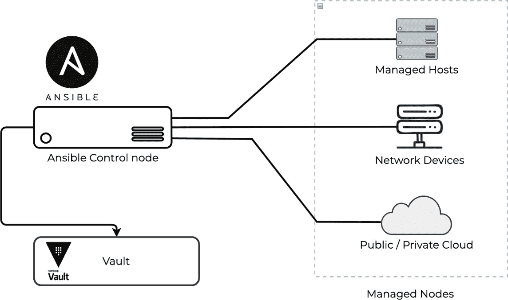

图 13.1 – Ansible 与外部 Vault 的集成

有可用的托管和自托管的外部机密管理解决方案，如 HashiCorp Vault ([`www.vaultproject.io`](https://www.vaultproject.io))、AWS Secrets Manager ([`aws.amazon.com/secrets-manager/`](https://aws.amazon.com/secrets-manager/)) 或 Azure Key Vault ([`azure.microsoft.com/en-us/services/key-vault/`](https://azure.microsoft.com/en-us/services/key-vault/))。为了检索密钥或机密，我们可以使用 API 调用、Ansible 模块或 Ansible `lookup` 插件，如下图所示：

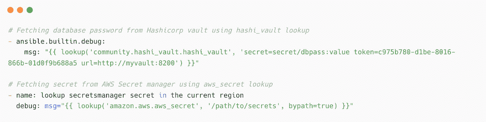

图 13.2 – 使用 lookup 插件检索 Vault 密钥

外部密钥 Vault 服务很好用且有用，但我们也需要处理管理和定价方面的开销。有关外部密钥 Vault 服务的更多文档和参考资料，请参考 *进一步阅读* 部分。

## 使用提示进行交互式输入

在 Ansible 中处理敏感数据的替代方法之一是，在 playbook 执行过程中动态收集数据。可以使用 `vars_prompt` 接受敏感和非敏感输入，如下所示：

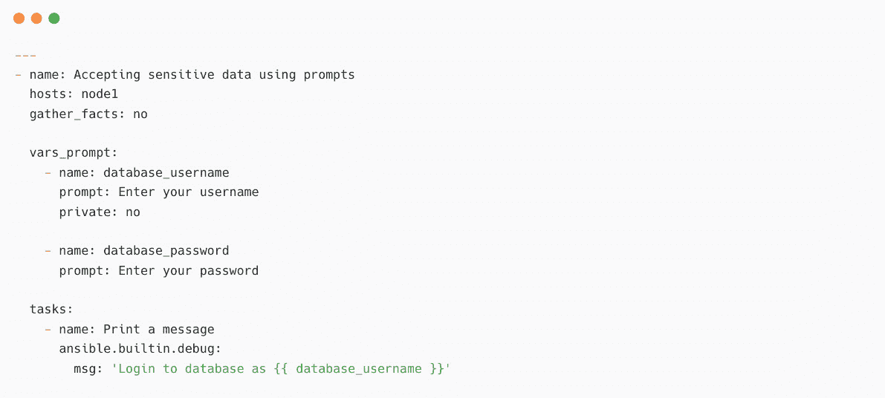

图 13.3 – Ansible playbook 使用提示接受密码

当你执行 playbook 时，Ansible 会要求输入，并且根据 `private` 值，输入将在提示中显示或隐藏，如*图 13.4*所示：

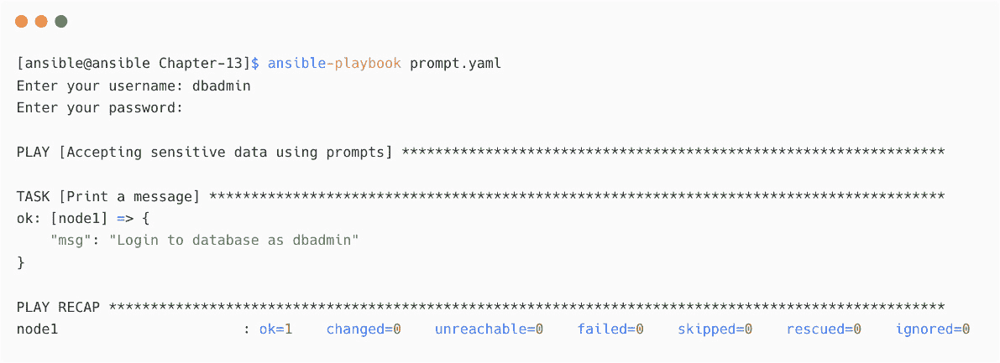

图 13.4 – 使用 vars_prompt 接受用户输入

然而，正如你在前面的图中看到的那样，这种方法是交互式的，执行 playbook 时需要有人输入详细信息。这意味着你将无法在完全自动化的工作流中使用这些 playbook，因为在这种工作流中无法进行用户交互。同样，`vars_prompt` 不适用于 Ansible 自动化控制器，因为控制器不允许交互式地提出 `vars_prompt` 问题。

## 使用 Ansible Vault 加密数据

如本章开头所述，Ansible Vault 是 Ansible 的内建功能，通过它我们可以加密数据，确保 Ansible 工件的敏感部分安全。我们可以使用自己的密码作为 Vault 密码来加密内容。可以在 Ansible 临时命令、Playbook 或 Ansible 自动化平台中使用 Ansible Vault。

最佳实践是将敏感工件与非敏感工件分开，并保存在不同的文件中。过程的第一步是将敏感数据与常规变量文件分开，并将其存储在单独的变量文件中，如*图 13.5*所示。

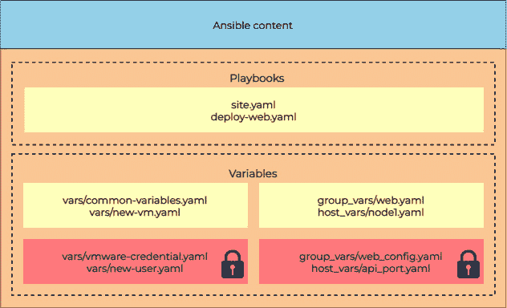

图 13.5 – 带有加密变量的 Ansible 工件

通过这种做法，你将能够以加密格式存储敏感数据，并且可以灵活地随时修改常规变量。当 Ansible 需要读取这些加密文件的内容时，Ansible 将使用 Vault 密码，我们可以通过提示（`--ask-vault-password`）输入或使用特殊的 Vault 密码文件来输入。对于 Ansible 自动化平台，Vault 密码可以作为凭据存储并分配给作业模板。

在接下来的章节中，我们将学习如何使用 Ansible Vault 来加密变量文件，并在 Ansible Playbook 中访问加密的数据。

# 使用 Ansible Vault 管理机密

Ansible Vault 非常灵活，我们可以根据需要随时加密、查看、解密或更改 Vault 密码（即重新设置密码）。Vault 密码必须安全存储，因为没有 Vault 密码你将无法恢复加密的 Vault 内容。

## 创建 Vault 文件

在以下练习中，我们将学习如何使用 Ansible Vault 创建加密文件：

1.  要从头开始创建 Vault 文件，请使用 `ansible-vault create` 命令，如*图 13.6*所示：


图 13.6 – 创建 Vault 文件

1.  在输入 Vault 密码后，默认文本编辑器（例如 `vim` 或 `nano`）将打开一个新文件（我们可以通过更新 `$EDITOR` 环境变量来更改默认编辑器）。根据需要输入变量和值，和普通变量文件一样：

    ```
    cloud_username: myusername 
    cloud_password: mysecretpassword
    ```

请参阅*图 13.7*以获取更多详情：

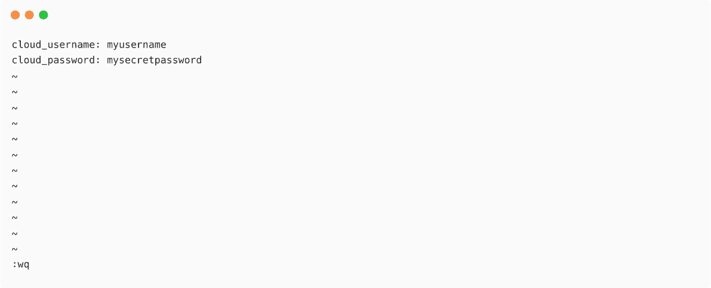

图 13.7 – 向 Vault 文件添加内容

1.  按照文本编辑器的操作保存文件（例如，`：wq`）并退出编辑器。

我们可以查看 Vault 文件，但内容将被加密（参见*图 13.8*），没有 Vault 密码，你将无法恢复数据。

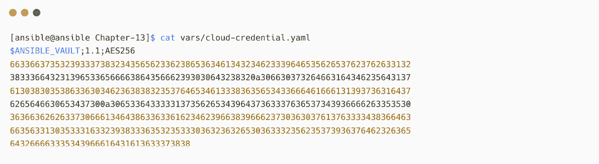

图 13.8 – Vault 文件中的加密内容

在前面的练习中，我们已经学习了如何使用 Ansible Vault 创建加密文件。在接下来的部分中，我们将学习如何使用 Ansible Vault 加密现有文件和内容。

## 加密现有文件

如果你有一个变量文件或包含敏感内容的文件，并且想要使用 Ansible Vault 对其进行加密，那么可以使用 `encrypt` 命令，具体步骤见以下练习：

1.  验证文件的当前内容如下所示：

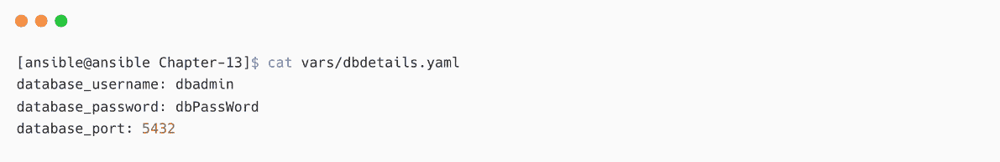

图 13.9 – 以纯文本格式显示的数据库详情

1.  使用 `ansible-vault encrypt` 命令加密内容：


图 13.10 – 使用 Ansible Vault 加密现有文件

1.  现在，验证文件的加密情况如下所示：


图 13.11 – 加密后的纯文本文件

现在我们知道如何加密文件，接下来我们将学习如何使用 Vault ID 处理多个 Vault 密码。

## 向加密中添加 Vault ID

当我们有许多 Vault 文件和多个 Vault 密码时，可以使用 **Vault ID** 来识别 Vault 内容。Vault ID 是一个标识符，用于标识一个或多个加密的密钥和内容。让我们跟随一个示例：

1.  使用 `--vault-id` 选项创建并加密秘密文件，如下所示。Vault ID 会在提示符中显示，如 *图 13.12* 所示。

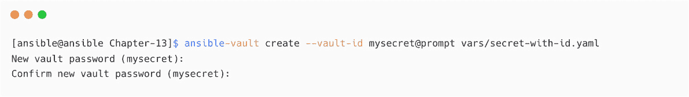

图 13.12 – 使用 Vault ID 创建 Vault 文件

1.  相同的 Vault ID 可以通过以下方式从 Vault 文件的内容中查看：

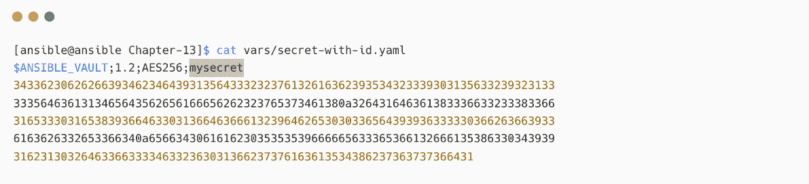

图 13.13 – 带有 Vault ID 的 Vault 文件

1.  Vault ID 的密码可以通过提示符获取（如前面的示例所示），也可以从 `ansible.cfg` 中配置的路径获取，如下所示：

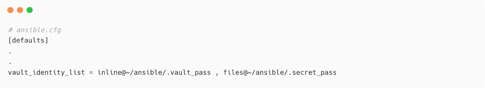

图 13.14 – 在 ansible.cfg 中配置的 Vault ID

使用 Vault ID 可以帮助你在大型环境中管理多个 Vault 文件，并识别被加密的文件和密钥。

## 查看 Vault 文件的内容

一旦内容被加密，就可以使用 `ansible-vault view` 命令显示 Vault 内容，如 *图 13.15* 所示。Ansible 将提示输入现有的 Vault 密码，你将看到纯文本格式的内容：

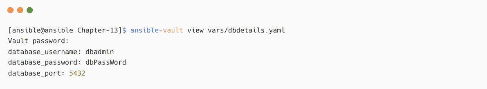

图 13.15 – 显示 Vault 内容

请注意，Vault 文件内容仍然处于加密状态，因此没有 Vault 密码，你将无法访问它。

## 编辑 Vault 文件

要编辑加密后的 Vault 文件，请使用 `ansible-vault edit` 命令，如下所示：

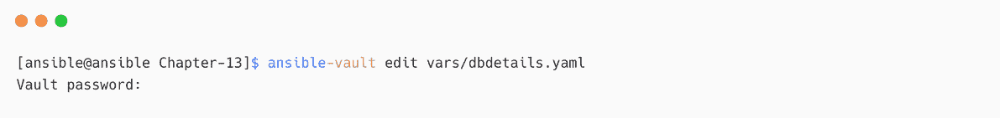

图 13.16 – 使用 Ansible Vault 编辑加密文件

Vault 文件将在文本编辑器中以纯文本格式打开。编辑完成后，保存文件（例如，`：wq`）并退出编辑器，如*图 13.17*所示：

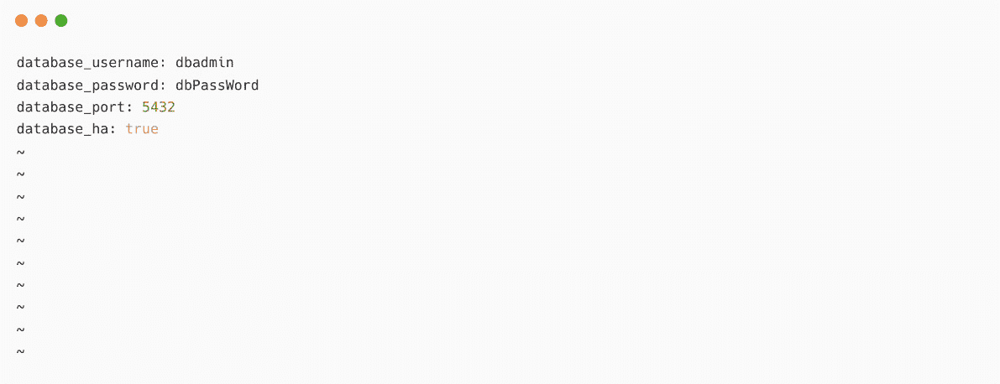

图 13.17 – 在文本编辑器中编辑 Vault 文件

编辑完成后，Vault 文件将以加密格式保存，无需额外操作。

## 解密 Vault 文件

有些情况下，我们需要将文件解密为纯文本，可能是暂时的也可能是永久的。在这种情况下，`ansible-vault decrypt` 命令可以帮助将 Vault 文件解密为纯文本格式，如下所示：

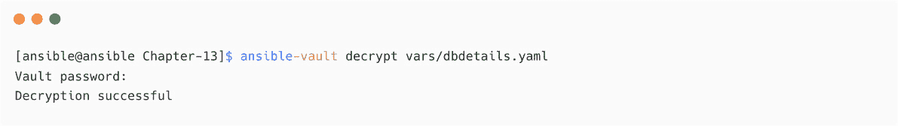

图 13.18 – 解密 Vault 文件

解密后验证文件内容，如*图 13.19*所示：

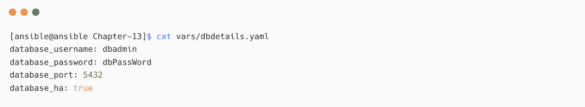

图 13.19 – 解密后的 Vault 文件

当你再次加密文件时，可以使用相同的或不同的 Vault 密码，这没有关系。

## Vault 密码轮换通过重新设置密码进行

定期更换密码、密钥和 SSL 证书是一种常见做法，以确保凭证不被泄露，并遵循组织的密码政策。`ansible-vault rekey` 命令可帮助更改或轮换 Vault 密码，保护敏感内容。Ansible Vault 会要求输入现有的 Vault 密码，如果成功，将显示提示以设置新 Vault 密码，如*图 13.20*所示：

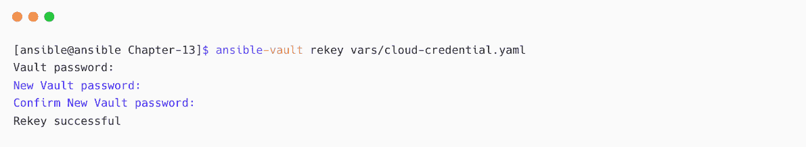

图 13.20 – 更换 Vault 密码

记得在适用的地方更新新的 Vault 密码，例如在本地 Vault 密码文件或 Ansible 自动化控制器的 Vault 凭证中。

## 加密特定变量

如果你不想加密整个变量文件，那么使用 `ansible-vault encrypt_string` 命令加密特定的变量，如下所示：

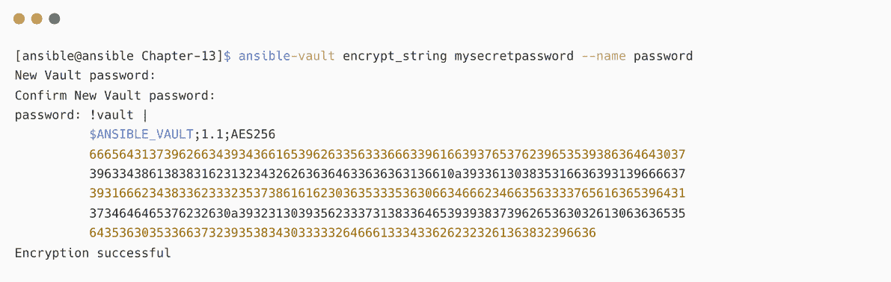

图 13.21 – 使用 Ansible Vault 加密字符串

输入可以来自内联，如前面的示例中所示（*图 13.21*），也可以来自标准输入，如*图 13.22*所示：

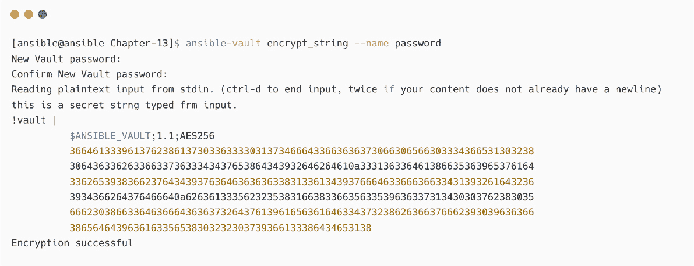

图 13.22 – Ansible Vault 使用输入值加密字符串

使用这个加密字符串作为 Ansible playbook 或变量文件中的变量，如下所示：

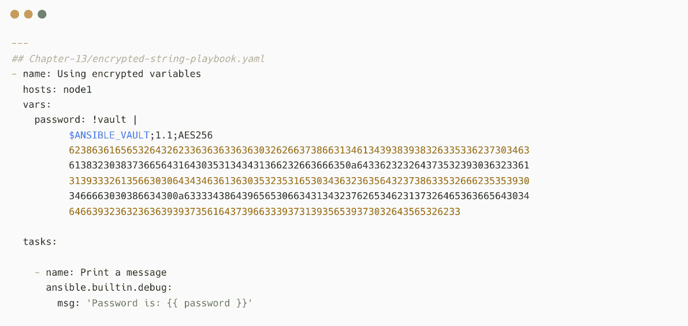

图 13.23 – Playbook 中的加密字符串

使用 Ansible Vault 加密内容

使用 Ansible Vault，你还有更多选择，比如编辑、加密、解密和重新生成密钥等。例如，请参考文档以了解更多详情：[`docs.ansible.com/ansible/latest/user_guide/vault.xhtml`](https://docs.ansible.com/ansible/latest/user_guide/vault.xhtml)。

在接下来的部分中，我们将学习如何在 Ansible 剧本中使用加密的 Vault 文件并检索密钥信息。

# 在 Ansible 剧本中使用机密信息

你已经在*第三章*的*自动化通知*部分学习了在 Ansible 剧本中使用机密的基本方法。在本节中，我们将进一步学习其用法和不同的传递 Vault 密码的方法。

在以下练习中，我们将开发 Ansible 内容，用于在 Linux 中创建用户，并从 Ansible Vault 文件中检索他们的密码：

1.  创建一个`Chapter-13/vars/users.yaml` Ansible Vault 文件，并输入 Vault 密码，如下所示：

    ```
    [ansible@ansible Chapter-13]$ ansible-vault create vars/users.yaml 
    ```

请记住密码，因为执行剧本时我们需要这些信息。

1.  将内容添加到变量文件中，如下所示：

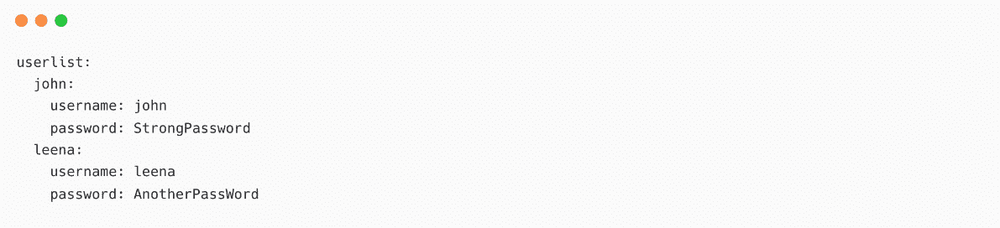

图 13.24 – Ansible Vault 文件中的用户详情

保存文件并退出编辑器。`userlist`变量包含多个用户及其密码的详细信息。

1.  验证文件内容，如*图 13.25*所示：

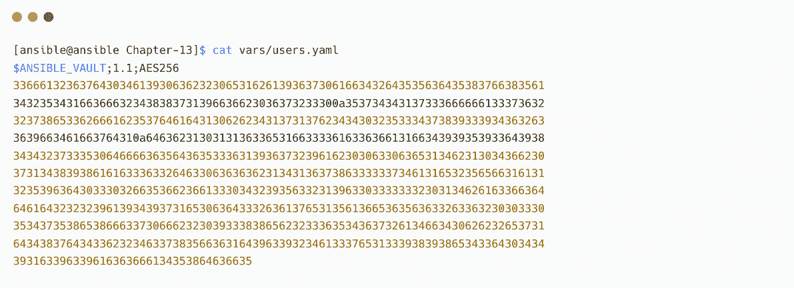

图 13.25 – 用户的加密信息

1.  创建一个`Chapter-13/manage-user.yaml`剧本，内容如下：

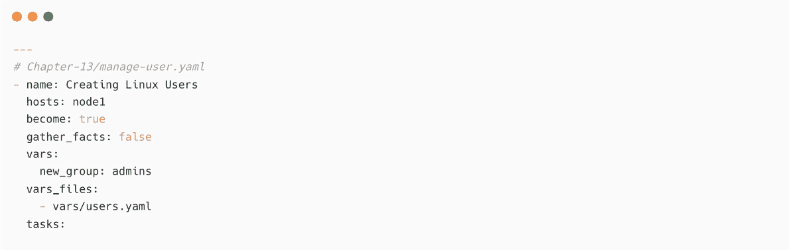

图 13.26 – 一个用于添加用户的剧本

查看`vars_files`部分，因为我们已经在剧本中包含了加密的变量文件。

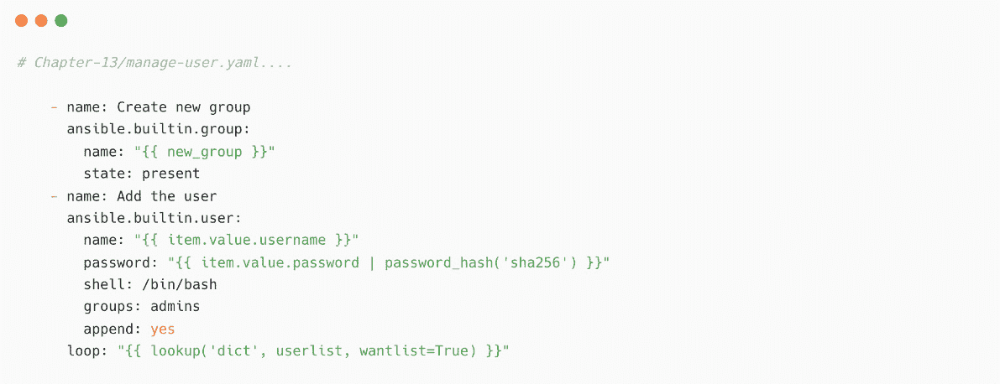

图 13.27 – 创建组和用户

在 Ansible 中生成加密密码

`password_hash(‘sha256’)`过滤器已被用来加密密码，以避免发送明文密码。请参考[`docs.ansible.com/ansible/latest/reference_appendices/faq.xhtml#how-do-i-generate-encrypted-passwords-for-the-user-module`](https://docs.ansible.com/ansible/latest/reference_appendices/faq.xhtml#how-do-i-generate-encrypted-passwords-for-the-user-module) 了解更多关于 Ansible 中密码加密的内容。

1.  现在，使用以下命令执行剧本：`ansible-playbook`。


图 13.28 – 由于没有 Vault 密钥，Ansible 错误

由于我们在剧本中包含了 Ansible Vault 文件，Ansible 期望 Vault 密钥可用，如果没有合适的密钥，它将失败。

1.  通过添加`--ask-vault-password`参数执行剧本：

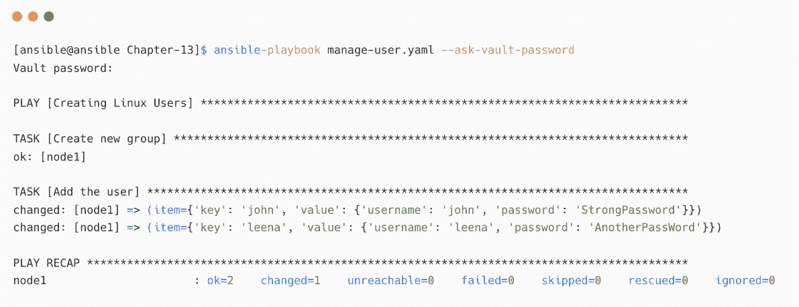

图 13.29 – 执行带有 Vault 密码提示的剧本

1.  使用以下临时命令验证`node1`上用户创建成功：

*图 13.30*展示了命令的示例输出：


图 13.30 – 用于检查用户是否成功创建的 Ansible 临时命令

在前面的示例中，您使用 Ansible Vault 加密了一个变量文件，并通过提示 Vault 密码从 Ansible 剧本中检索信息。但是，对于自动化操作，我们需要跳过此提示。Vault 密码应该能够在命令行中直接传递。在这种情况下，使用`--vault-password-file`参数，并将 Vault 密码放入一个文件中。

1.  创建一个文件来存储您的 Vault 密码。Vault 密码应该是一个纯文本文件，但保存在安全位置，例如您主目录中的一个隐藏文件，如*图 13.31*所示：

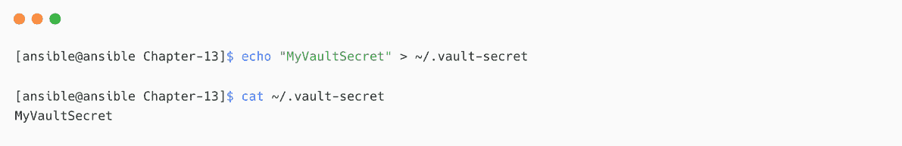

图 13.31 – 您主目录中的隐藏文件中的 Vault 密码

1.  执行相同的剧本，但使用`--vault-password-file`参数传递 Vault 密码文件。这时，Ansible 将不会询问密码，如*图 13.32*所示：

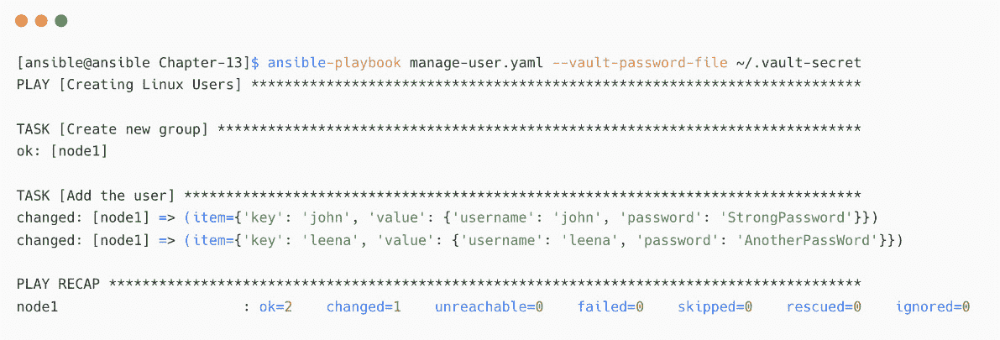

图 13.32 – 来自密码文件的 Ansible Vault 密码

Vault 文件可以包含任何类型的数据，无论是单一变量、字符串、复杂的字典变量，还是任何其他文本内容。

Ansible Vault 将帮助我们加密 Ansible 工件中的敏感数据，但我们需要防止这些数据在日志中被捕获，我们将在下一节学习如何做到这一点。

## 使用 no_log 从日志中隐藏秘密

您已经学会了如何使用 Ansible Vault 保护敏感内容，但我们在这里遇到了一个问题，因为 Ansible 在执行日志记录时会以纯文本格式包含敏感数据内容。有时，默认的详细模式中看不到这些内容，但在更高级的详细模式下（如`-vvv`或`-vvvv`）会显示出来。有关详细信息，请参见*图 13.33*：


图 13.33 – 显示敏感数据的 Ansible 剧本输出

在这种情况下，使用`no_log: True`，如*图 13.34*所示，该任务中的任何输出都会因安全原因被屏蔽：


图 13.34 – 使用 no_log 禁用任务的日志记录

如果现在执行剧本，您会注意到如下更改：

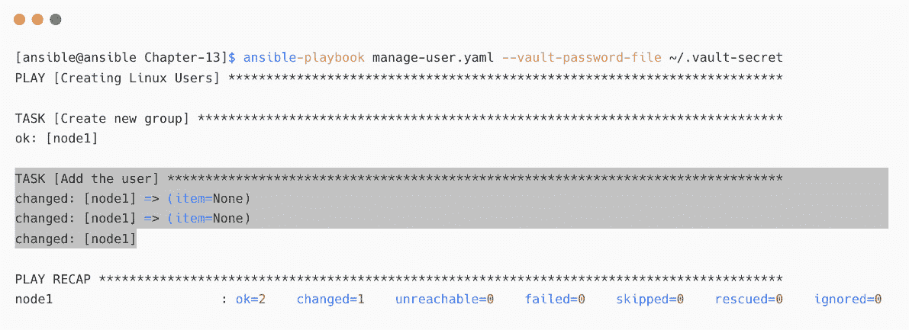

图 13.35 – 应用 no_log 到敏感数据的 Ansible 输出

即使启用了高详细模式`-vvv`，Ansible 仍会隐藏信息，如*图 13.36*所示：

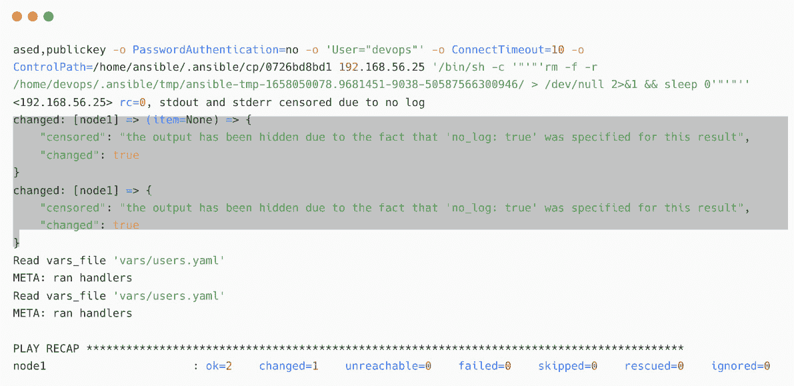

图 13.36 – 应用 no_log 的高详细 Ansible 日志

这是保护系统日志和作业历史中捕获的敏感数据的最佳实践之一。

在接下来的部分，我们将学习如何将敏感数据保存在其他变量位置，如`group_vars`和`host_vars`。

## Ansible Vault 用于`group_vars`和`host_vars`

正如我们在本章之前讨论的那样，最佳实践是根据需要将变量和敏感信息分开。

在以下练习中，我们将重用在*第八章*中开发的 PostgreSQL Ansible 工件，*帮助数据库团队进行自动化*。PostgreSQL 已安装并配置在`node2`上。我们将为访问`db_sales`数据库创建一个额外的数据库用户帐户（请参考*第八章*的内容了解更多详情）。我们将执行以下操作：

1.  更新库存文件（`Chapter-13/hosts`），通过将`node2`添加为`postgres`主机组的一部分：

    ```
    [postgres]
    node2 ansible_host=192.168.56.24
    ```

1.  创建`group_vars`和另一个子目录，如下所示：


图 13.37 – 创建`group_vars`目录和 Vault 文件

1.  为新用户添加数据库用户名和密码：

    ```
    postgres_app_user_name: appteam
    postgres_app_user_password: ‘AppPassword’
    ```

1.  保存并验证 Vault 文件，如*图 13.38*所示：

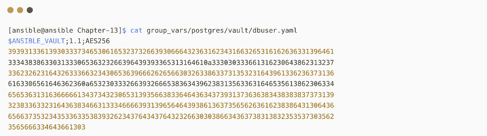

图 13.38 – Vault 文件中的数据库用户信息

1.  创建另一个 Vault 文件用于存储 PostgreSQL 管理员密码：

    ```
    [ansible@ansible Chapter-13]$ ansible-vault create group_vars/postgres/vault/dbadmin.yaml
    ```

1.  在其中添加`postgres_password`并保存文件：

    ```
    postgres_password: ‘PassWord’
    ```

1.  创建一个`Chapter-13/postgres-create-dbuser.yaml`剧本，如下所示：

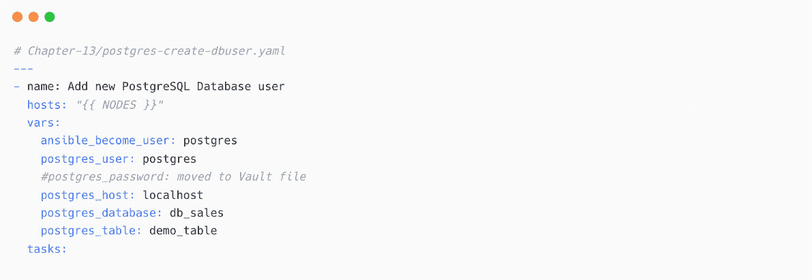

图 13.39 – 用于管理 PostgreSQL 用户信息的 Ansible 剧本

1.  添加一个任务以创建 PostgreSQL 数据库用户，如下所示：

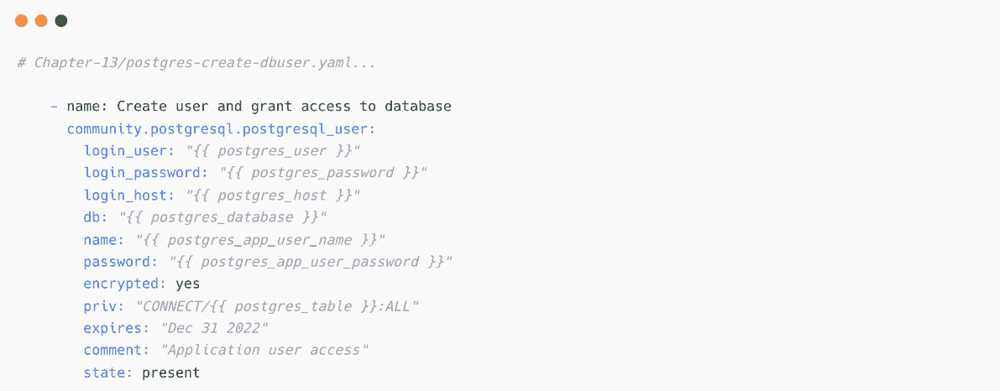

图 13.40 – 创建 PostgreSQL 用户的任务

所有敏感变量现在都在`group_vars` Vault 文件中，例如`postgres_password`、`postgres_password`和`postgres_app_user_password`。

1.  在`postgres`主机组（我们在第一步中创建的）上执行剧本，剧本将读取变量并安全地创建新用户，如*图 13.41*所示：

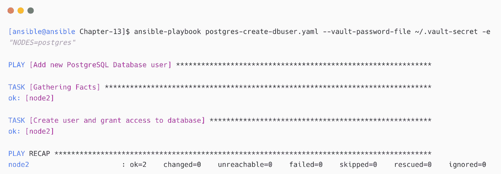

图 13.41 – 创建 PostgreSQL 数据库用户

最佳实践是将所有敏感信息保存在 Vault 文件中，并将其放在适当的位置，这样即使你的 Ansible 内容保存在 Git 仓库中，它们也会保持安全。

在接下来的部分中，我们将学习如何在 Ansible 自动化平台中使用 Vault 文件和凭证。

# 在 Ansible 自动化平台中使用 Vault 凭证

当你从自动化控制器的 Web UI 运行你的 playbook 时，你将有类似的选项来提供 Vault 密码。我们可以将 Vault 密码保存在 Vault 凭证中，或者在 Ansible 命令行执行中选择 `--ask-vault-password`，并在从自动化控制器的 WebUI 执行作业模板时提示输入 Vault 密码。

Ansible 自动化控制器

Ansible 自动化控制器是 **Ansible 自动化平台**（**AAP**）的控制平面。当你迁移到 AAP 2 时，自动化控制器将升级为包含 Ansible Tower。有关更多详细信息，请参阅 *第十二章*，*将 Ansible 与您的工具集成*。

在接下来的部分中，我们将学习如何在 Ansible 自动化控制器 GUI 中创建 Vault 凭证，并将其附加到作业模板中以检索加密内容。

## 创建 Vault 凭证

要存储 Vault 密码，请按照以下步骤创建一个新凭证：

1.  打开 **创建新凭证** 面板，并将 **凭证类型** 设置为 **Vault**，如 *图 13.42* 所示。输入 Vault 密码（秘密），并在需要时添加 Vault ID：

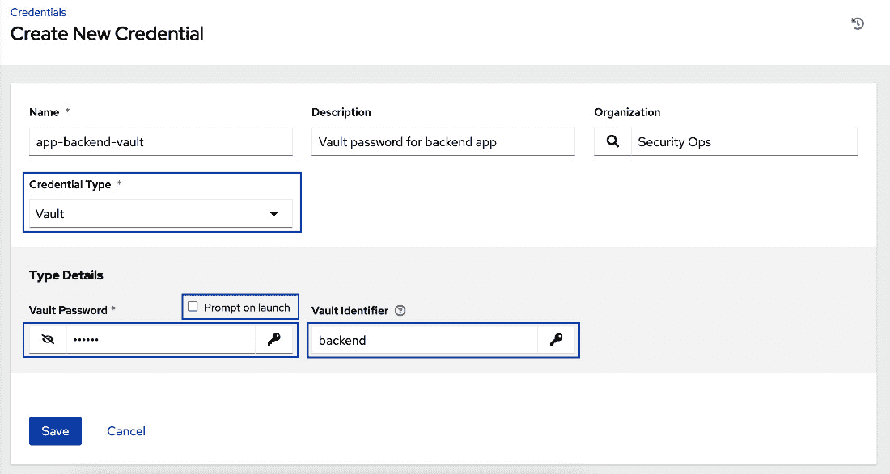

图 13.42 – 在自动化控制器中创建新的 Vault 凭证

1.  创建后，更新你的作业模板，并将新的 Vault 凭证添加到其中。导航到 **作业模板** | **编辑**，然后点击 **凭证** 旁边的 *搜索* 按钮。

1.  在弹出屏幕中，将 **选择的类别** 设置为 **Vault**，然后你将看到 Vault 凭证，如 *图 13.43* 所示。选择所需的 Vault 凭证并点击 **选择** 按钮。

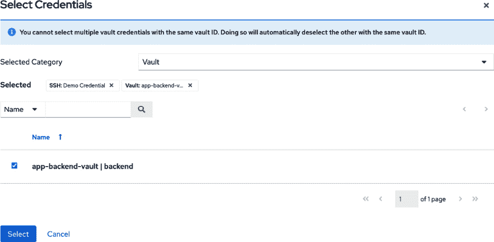

图 13.43 – 为作业模板选择 Vault 凭证

1.  验证凭证，如 *图 13.44* 所示：

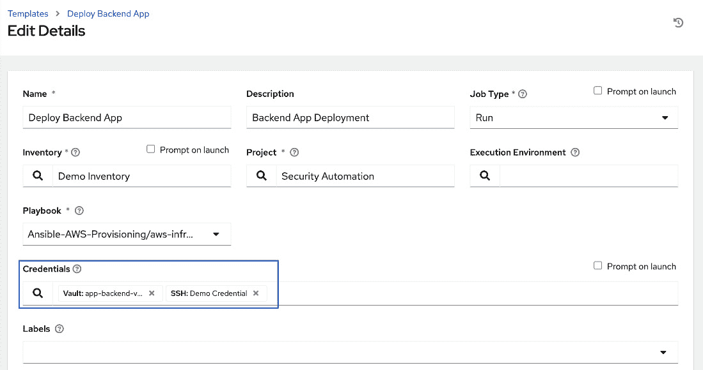

图 13.44 – 在作业模板中添加的凭证

如果你有多个 Vault 文件和不同的 Vault 密码，则根据需要添加多个 Vault 凭证并添加 Vault ID。

# 摘要

在本章中，我们学习了在 Ansible 自动化工件中保持敏感数据安全的重要性以及可用的不同方法，例如外部 Vault 服务、`vars_prompt` 和 Ansible Vault。之后，我们学习了在 Ansible Vault 中的不同操作，如创建、修改、查看、解密和重新设置 Vault 文件和变量。

我们还使用 Vault 文件开发了 Ansible 工件，用于存储用户信息和数据库用户凭证。我们还讨论了在自动化控制器 GUI 中的 Vault 凭证，以及如何在作业模板中使用它们。

在下一章中，我们将学习不同的方法和途径，用于开发 Ansible 自动化工件，并探讨在整个 Ansible 自动化过程中需要考虑的因素。

# 深入阅读

若要了解更多本章涉及的主题，请访问以下链接：

+   *教程：使用 Azure Key Vault 存储 VM 机密信息与 Ansible* – [`docs.microsoft.com/en-us/azure/developer/ansible/key-vault-configure-secrets?tabs=ansible`](https://docs.microsoft.com/en-us/azure/developer/ansible/key-vault-configure-secrets?tabs=ansible)

+   *如何使用 Ansible 和 Gmail 发送电子邮件* – [`www.techbeatly.com/ansible-gmail`](https://www.techbeatly.com/ansible-gmail)

+   *记录 Ansible 输出* – [`docs.ansible.com/ansible/latest/reference_appendices/logging.xhtml`](https://docs.ansible.com/ansible/latest/reference_appendices/logging.xhtml)

+   *安全地可见化 Vault 变量* – [`docs.ansible.com/ansible/latest/user_guide/playbooks_best_practices.xhtml#keep-vaulted-variables-safely-visible`](https://docs.ansible.com/ansible/latest/user_guide/playbooks_best_practices.xhtml#keep-vaulted-variables-safely-visible)

+   *在 Ansible 中加密密码* – [`docs.ansible.com/ansible/latest/reference_appendices/faq.xhtml#how-do-i-generate-encrypted-passwords-for-the-user-module`](https://docs.ansible.com/ansible/latest/reference_appendices/faq.xhtml#how-do-i-generate-encrypted-passwords-for-the-user-module)

+   *Red Hat Ansible 和 Red Hat Ansible Tower 中的 Vault ID* –[`developers.redhat.com/blog/2020/01/30/vault-ids-in-red-hat-ansible-and-red-hat-ansible-tower`](https://developers.redhat.com/blog/2020/01/30/vault-ids-in-red-hat-ansible-and-red-hat-ansible-tower)

# 第三部分：使用最佳实践管理您的自动化开发流程

本部分将描述持续评估、监控和安全操作的重要性。您将了解可以用于检测和保护环境的不同监控技术，以及如何从中获取洞察。

本书的这一部分包括以下章节：

+   *第十四章**，保持自动化简单高效*

+   *第十五章**，自动化非标准平台和操作*

+   *第十六章**，Ansible 生产环境自动化最佳实践*
