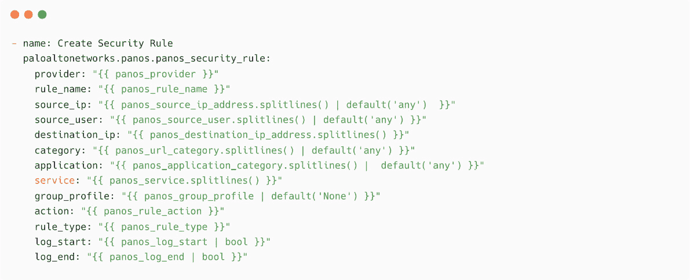

# 14

# 保持自动化简单高效

Ansible 是一个简单而强大的自动化工具。我们可以使用 Ansible 自动化任何类型的工作流，但如果我们增加自动化的复杂度，就会降低效率，从而影响生产力。当你设计自动化解决方案或使用案例时，必须考虑多个因素，例如工具的能力以及在调整自动化流程或扩展性时的灵活性。

例如，可以编写简单的 playbook 来监控系统中的服务状态或检查应用程序的健康状况。但这样做效率不高，因为你还需要其他安排，例如作业调度程序来定期执行任务并监控执行情况。我们可以利用 Ansible 自动化控制器和其他系统的集成功能，而不是仅仅使用 Ansible 来处理复杂的自动化任务。我们可以使用现有的监控、日志记录和安全控制工具，并利用 Ansible 执行补救操作，如启动服务、阻止端口和 IP 地址。

本章将涵盖以下主题：

+   利用调查和自动化输入

+   将 Ansible 与监控工具集成

+   用于安全自动化的 Ansible

+   Ansible 工作流模板

我们将从查看自动化控制器中的各种调查功能开始，并继续讲解 Ansible 集成相关的内容。

# 技术要求

本章的技术要求如下：

+   监控和日志平台的基础知识

+   一般的安全平台知识

+   关于**IT 服务管理**（**ITSM**）工具（Jira 和 ServiceNow）的基础知识

+   访问**Ansible 自动化平台**（**AAP**）环境

本章所有的 Ansible 文档、命令和片段都可以在本书的 GitHub 仓库中找到，网址是[`github.com/PacktPublishing/Ansible-for-Real-life-Automation/tree/main/Chapter-14`](https://github.com/PacktPublishing/Ansible-for-Real-life-Automation/tree/main/Chapter-14)。

# 利用调查和自动化输入

在*第八章*，*帮助数据库团队进行自动化*，你了解了将 Jira 服务管理与 Ansible 集成以自动化数据库操作的优势。你学会了如何与 Jira 集成并自动传递变量，而不是手动将 Jira 工单中的输入详情复制到 Ansible 自动化控制器中。这使得零接触集成成为可能，无需输入自动化任务的细节，如数据库名称、服务器名称、数据库用户名或数据库表。

你在*第十二章*，*将 Jenkins 与 Ansible 自动化平台集成*中了解了类似的示例，Jenkins 调用 Ansible 自动化控制器 API 来执行作业模板。在 Ansible 自动化控制器中，你使用了调查字段和优雅的表单来传递这些信息：

图 14.1 – PostgreSQL – 创建数据库和用户访问任务模板的调查表

当我们将这个任务模板与 Jenkins 等外部工具集成时，我们需要以非交互方式提供输入（数据库用户、数据库或表）。这时，我们使用 Jenkins（或者在前面的例子中使用 Jira）来调用带有所有必要信息的任务模板，包括数据库用户、数据库名称、表格和用户详细信息作为额外变量。

此外，通过与现有的 ITSM 和请求管理工具集成，可以增强自动化系统，并将输入表单创建（调查表）负载从 Ansible 自动化控制器中卸载。

以下图表展示了工具、AAP 和管理节点或平台之间的高级通信。外部工具可以将所有所需信息作为额外变量传递给 AAP API，并实现非交互式工作流：

图 14.2 – 从其他平台触发带有额外变量的 AAP 任务模板

通过这一点，你已经了解了 Ansible 中的最佳实践之一，称为*软编码*（与硬编码相对）。这意味着在执行自动化任务时接受参数。

在接下来的章节中，你将了解将 Ansible 与其他安全和监控工具集成的优势，而不是仅仅使用 Ansible 本身来执行这些目的。

# 将 Ansible 与监控工具集成

由于 Ansible 具有灵活性，并且可以自动化大多数日常工作，因此自动化所有可能的用例是常见的做法，即使它效率不高。我们从社区学到的一个所谓的非标准用例是将 Ansible 用于监控目的，如下所示：

+   在系统中监控服务或应用程序状态

+   对端点（应用程序、Web 服务或集群）运行健康检查

+   监控网络和安全设备规则或状态

以下图表展示了一个典型场景，其中 Ansible 自动化任务被安排定期运行健康检查，以监控管理节点或应用程序。这些任务可以作为 Ansible 控制节点上的**cron**任务运行，或者作为 Ansible 自动化控制器中的计划任务运行：

图 14.3 – 使用计划自动化任务进行监控

这种方法是可行且易于实现的，但效率不高。它有很多缺点，如下所示：

+   你对监控频率的控制较少。

+   在 Ansible 控制节点或自动化控制器上存在计算开销。监控目标的数量将增加这种开销。

+   由于某些作业可能需要更多时间，您对执行时间的控制较少，队列中的下一个作业也可能会被延迟。

+   根据要监控的目标项，你需要创建许多 Ansible 剧本。

我们可以使用已经到位并高效执行的标准监控工具，而不是使用 Ansible 剧本来执行频繁的监控作业。下图展示了监控和日志工具、ITSM 软件与 Ansible 之间的高级集成：

图 14.4 – Ansible 与日志和监控工具的集成

监控和日志代理可以有效地完成其工作，并将警报、事件和问题报告到中央数据库系统。根据组织的需求和基础设施布局，监控堆栈可能包含不同的组件和多个活动部分。监控和日志工具可以与 ITSM 工具集成，将事件和警报记录到 ITSM 事件管理系统中。此外，ITSM 工具还可以与 Red Hat AAP 集成，实现自动化修复。你将在下一节了解更多信息。

## Ansible 在监控中的作用

在监控和警报领域有几个使用案例，我们可以利用 Ansible 来自动化操作：

+   通过 API 调用在自动化控制器上实现自动作业触发。

+   基于监控工具或 ITSM 工具的 API 调用，实现自动化修复和部署。

+   在受管节点上部署监控代理和配置。

+   根据警报和 API 调用实施配置强化。

下图展示了基于 AAP 和自动化作业执行的典型集成和工作流：

图 14.5 – Ansible 中的监控和警报工作流

在上面的图示中，发生以下操作：

+   通过监控主机或服务上的代理，可以检测到事件和警报，如系统问题、安全事件或应用程序健康问题。

+   监控和日志工具在 ITSM 和安全监控工具中创建事件。

+   监控和日志工具还可以直接通过自动化控制器 API 触发警报（或 API 调用），从而触发作业。

+   ITSM 工具根据规则、工作流和脚本触发 API 调用。

+   基于 API 调用，自动化控制器执行配置好的作业模板并修复事件。

+   自动化控制器还会自动更新事件票证，包含修复作业的状态和票证状态（例如，关闭票证或更新审查状态）。

Ansible 与 ServiceNow 的集成

想要了解更多关于 Ansible 与 ServiceNow 集成的信息，请阅读 *Ansible + ServiceNow 第三部分：向 Red Hat Ansible Tower 发起外部 RESTful API 调用*（[`www.ansible.com/blog/ansible-servicenow-howto-part-3-making-outbound-restful-api-calls-to-ansible-tower`](https://www.ansible.com/blog/ansible-servicenow-howto-part-3-making-outbound-restful-api-calls-to-ansible-tower)）。同时，查看 [`www.ansible.com/integrations/it-service-management/servicenow`](https://www.ansible.com/integrations/it-service-management/servicenow) 获取更多相关参考资料。

你将在下一节中通过一个用例来探索这种集成。

## ServiceNow、Ansible 与零接触事件修复

在本节中，你将了解零接触事件修复与**ServiceNow**（也称为**SNOW**）和 Ansible 之间的重要集成和连接点。典型的工作流可以在以下图示中看到：

图 14.6 – 典型的事件自动化工作流

配置监控代理和 ServiceNow 实例超出了本书的范围，因此我们将只关注 Ansible 部分。只要该工具能够触发 API 调用至 AAP 进行自动化作业，就可以将 ServiceNow 替换为其他 ITSM 工具，如 Jira 服务管理或 BMC Remedy。

ServiceNow 工作流

请参考 ServiceNow 文档 [`www.servicenow.com/products/workflow.xhtml`](https://www.servicenow.com/products/workflow.xhtml) 了解更多有关其工作流自动化的信息。

一旦在服务管理系统中创建了事件，Ansible 自动化控制器将根据工作流的配置接收 API 调用。例如，我们在自动化控制器中配置了一个名为**PostgreSQL - 服务启动**的作业模板，如下所示：

图 14.7 – PostgreSQL – 服务启动作业模板

Ansible 剧本包含了一些任务，用于更新事件工单以及重启 PostgreSQL 服务。第一步是将事件工单的状态更新为`进行中`，如下所示：

图 14.8 – 更新 ServiceNow 工单的任务

现在，添加一个任务，启动 PostgreSQL 服务：

图 14.9 – 启动 PostgreSQL 服务的任务

现在，添加一个任务，将工单的状态更新为已解决：

图 14.10 – 更新工单状态为已解决

扩展剧本，增加更多验证和工单状态更新，以满足你所在组织的 ITSM 过程和需求。如果需要，你甚至可以添加更新工单为已关闭的任务。

ServiceNow 中事件的生命周期

请参阅 ServiceNow 文档 ([`docs.servicenow.com/en-US/bundle/sandiego-it-service-management/page/product/incident-management/concept/c_IncidentManagementStateModel.xhtml`](https://docs.servicenow.com/en-US/bundle/sandiego-it-service-management/page/product/incident-management/concept/c_IncidentManagementStateModel.xhtml)) 了解更多关于事件生命周期的信息。同时，参阅 Ansible 博客文章 [`www.ansible.com/blog/ansible-servicenow-opening-and-closing-tickets`](https://www.ansible.com/blog/ansible-servicenow-opening-and-closing-tickets) 了解更多关于 ServiceNow 与 Ansible 集成的内容。

有时可能会有人因某些活动而停止 PostgreSQL 服务；Ansible 应该能够意识到这一点。可以使用 ITSM 工具或第三方解决方案创建一个维护跟踪系统，在其中可以更新系统维护详情并指定时间段，以便高效处理事件工单，如下所示：

1.  ITSM 工具检测到系统维护窗口并将工单更新为误报。

1.  在 Ansible playbook 中添加任务，以检查是否处于此维护窗口，如果系统在该维护窗口内，则将警报更新为误报。

通过这一步，你已经探索了将 Ansible 与各种监控和日志系统集成的一些可能性。在下一节中，你将学习如何将 Ansible 用于安全自动化解决方案。

# Ansible 与安全自动化

安全加固是通过减少攻击面来保护主机、网络设备和应用程序的做法。实现安全加固的方式有多种，例如适当配置系统、安装最新版本的软件（或固件）或禁用不必要的配置。根据需求，组织采用不同的安全基准方法和标准。**互联网安全中心**（**CIS**）是一个提供必要企业标准基准和 CIS 控制的知名机构 ([`www.cisecurity.org/about-us`](https://www.cisecurity.org/about-us))。

登录并免费下载操作系统或平台的基准文档，如下图所示：

图 14.11 – Kubernetes 的 CIS 基准下载页面

根据这些基准来配置系统并不容易，因为必须执行数百条规则和配置项以确保系统安全。组织采用不同的方法来实现这些配置，例如 shell 脚本、PowerShell 脚本和 Ansible 自动化。由于 Ansible playbooks 的灵活性和模块化特性，它们比其他方法更高效且更易于维护。

可以通过 Ansible 或自动化控制器（定时任务）频繁执行 CIS 硬化剧本，以确保系统具有良好的安全状态。然而，这种方法无法及时检测和修复威胁及事件。

如您在上一节中所学，也可以利用安全工具和解决方案的强大功能，并将其与 Ansible 集成，以自动化各种安全操作，具体如下：

+   **安全信息与事件管理** (**SIEM**)

+   **入侵检测与防御系统** (**IDPS**) 任务

+   **特权访问管理** (**PAM**) 操作

+   **端点保护平台** (**EPP**) 任务

+   防火墙操作

以下图示展示了一个典型的威胁检测与自动化工作流：

图 14.12 – 威胁检测与自动化修复

通过使用现有的安全解决方案，可以将检测和响应的开销从 Ansible 中卸载，但仍然可以利用 Ansible 的强大功能来修复安全问题。

Ansible 拥有大量的社区模块和集合，可以支持安全设备和解决方案的自动化，具体如下：

+   Cisco ASA

+   FortiGate

+   Palo Alto

+   F5

+   CheckPoint

+   CyberArk

+   Trend Micro

Ansible 安全自动化集合

请参考 Ansible 集合索引 ([`docs.ansible.com/ansible/latest/collections/index.xhtml`](https://docs.ansible.com/ansible/latest/collections/index.xhtml)) 查找与安全相关的集合。同时，查看 *Red Hat Ansible 自动化平台的安全自动化* ([`access.redhat.com/articles/4001711`](https://access.redhat.com/articles/4001711)) 以了解该平台的兼容性矩阵。最后，请阅读博客文章 *使用 Ansible 安全自动化入门：调查丰富* ([`www.ansible.com/blog/getting-started-with-ansible-security-automation-investigation-enrichment`](https://www.ansible.com/blog/getting-started-with-ansible-security-automation-investigation-enrichment)) 以了解 Ansible 安全自动化及与 AAP 的集成。

自动化 IP 地址封锁的过程可见于以下图示：

图 14.13 – 自动化 IP 地址封锁

借助 Ansible 模块，大多数与安全相关的操作可以高效自动化。

例如，添加 `cisco.asa.asa_acls` 模块，如下图所示：

图 14.14 – 向 Cisco ASA 设备添加访问控制规则

以下截图显示了一个简单的 Ansible 任务，使用 `fortinet.fortios.fortios_firewall_address` 模块来封锁 FortiGate 设备中的 IP 地址：

图 14.15 – 在 FortiGate 设备中屏蔽 IP 地址

同样，以下截图展示了如何使用 `paloaltonetworks.panos.panos_security_rule` 模块向 Palo Alto 设备添加安全规则：

图 14.16 – 向 Palo Alto 设备添加安全规则

请参阅*进一步阅读*部分，获取有关 Ansible 中安全自动化模块的更多资源。

在下一节中，你将学习自动化控制器中的工作流模板。

# Ansible 工作流模板

在单个 playbook 中可以创建任意数量的任务，并将其变成一个长工作流。例如，一个 Linux 操作系统作业模板可以包含以下任务：

1.  在开始打补丁之前创建虚拟机快照。

1.  保存配置文件备份。

1.  停止系统中的服务。

1.  执行各种 Linux 操作系统补丁任务。

1.  重启系统。

1.  等待系统启动并启动必要的服务。

1.  如果虚拟机重启不成功，在同一作业中处理虚拟机快照恢复操作。

请注意，大多数任务可以作为单独的作业重用，例如创建快照、停止服务或配置备份。

不要开发冗长、复杂的作业模板，利用自动化控制器中的工作流模板创建模块化的作业工作流，并根据成功/失败状态处理任务。工作流模板是通过将多个作业模板拼接在一起创建的，以实现更大或更复杂的工作流。

以下图表展示了 Ansible 自动化控制器中作业模板和工作流模板之间的高层次区别。

图 14.17 – 作业模板与工作流模板

以下截图展示了一个简单的 Linux 操作系统补丁工作流模板。在这里，我们有多个任务，如下：

1.  在打补丁前创建快照作业。

1.  创建一个作业模板，停止系统中的重要和依赖服务。

1.  执行操作系统补丁任务。

1.  重启。

1.  如果重启成功，所有必需的服务将启动。

1.  如果重启失败，将执行恢复快照的作业模板：

图 14.18 – 操作系统补丁的工作流模板

这种模块化的方法通过重用作业模板帮助你实现复杂的自动化工作流。以下截图展示了一个类似的工作流，其中操作系统特定的作业模板已被替换，其他作业模板正在被重用：

图 14.19 – Windows 补丁工作流

Ansible 工作流作业模板

请参阅 [`docs.ansible.com/automation-controller/4.1.2/html/userguide/workflow_templates.xhtml`](https://docs.ansible.com/automation-controller/4.1.2/html/userguide/workflow_templates.xhtml) 了解更多关于工作流模板的功能，如 webhook 和集成选项。

# 总结

在这一章中，你了解了简化 Ansible 自动化的重要性。你探索了自动化控制器中调查功能的优势和软编码机会，以动态接受参数。这种方法帮助你复用相同的 playbook 和作业模板，适用于不同的设备和场景。

然后，你了解了 Ansible 与其他监控和告警工具之间的集成选项，以实现零接触事件修复。可以利用现有的 ITSM 工具和工作流，根据规则和条件触发 Ansible 自动化控制器作业。通过利用监控工具的强大功能和 Ansible 的自动化能力，可以实现高效的监控和修复系统。

之后，你探索了在安全领域内进行集成的机会，以实现威胁检测和自动修复的自动化，利用自动化控制器。Ansible 自动化的安全模块和集合帮助你实施复杂且增强的安全自动化解决方案。

最后，你学习了自动化控制器中的工作流模板、创建工作流的模块化方法，以及复用作业模板的优势。

在下一章中，你将学习如何使用 Ansible 自动化非标准和不支持的平台。你还将探索一些有用的模块以及 Ansible 自定义模块创建的基础知识。

进一步阅读

要了解更多本章所涵盖的主题，请查看以下资源：

+   *Ansible 安全自动化*： [`www.ansible.com/use-cases/security-automation`](https://www.ansible.com/use-cases/security-automation)

+   *Ansible 关于安全自动化的博客*： [`www.ansible.com/blog/topic/security-automation`](https://www.ansible.com/blog/topic/security-automation)

+   *使用 Ansible 的安全性与合规性*： [`www.ansible.com/use-cases/security-and-compliance`](https://www.ansible.com/use-cases/security-and-compliance)

+   *Ansible 集合*： [`docs.ansible.com/ansible/latest/collections/index.xhtml#list-of-collections`](https://docs.ansible.com/ansible/latest/collections/index.xhtml#list-of-collections)

+   *Ansible 自动化控制器中的应用程序*： [`docs.ansible.com/automation-controller/latest/html/userguide/applications_auth.xhtml`](https://docs.ansible.com/automation-controller/latest/html/userguide/applications_auth.xhtml)

+   *Ansible 网络自动化*： [`docs.ansible.com/ansible/latest/network/index.xhtml`](https://docs.ansible.com/ansible/latest/network/index.xhtml)
