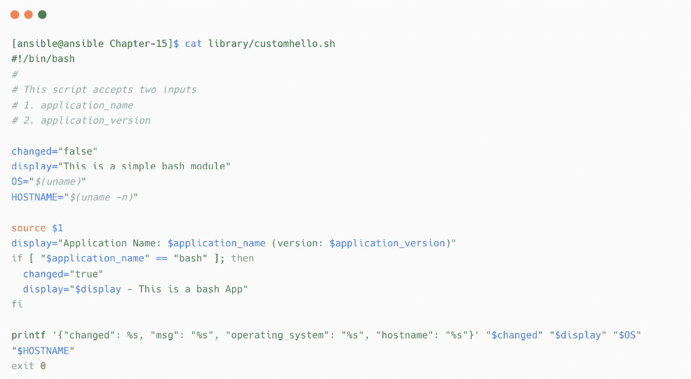
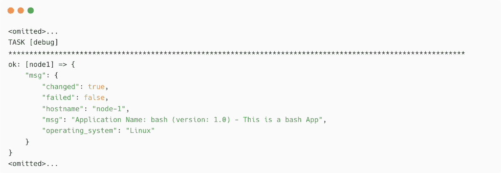

# 第十五章：自动化非标准平台和操作

到目前为止，您已经了解了不同的系统和平台（管理节点），例如 Linux 系统、Microsoft Windows 系统、网络设备和云平台，这些都可以通过 Ansible 进行自动化。您已经使用了不同的方法和协议来连接目标系统或平台，执行自动化操作。您无需了解这些系统内部如何运行复杂操作，因为 Ansible 会理解并对目标系统采取适当的行动，以达到所需的状态。

如果没有标准的 Ansible 模块或连接方法可用于管理节点上的特定操作怎么办？或者，如果模块缺少您需要的某个功能呢？例如，假设您想要自动化一台没有安装支持的 Python 版本的机器，并且您想使用 Ansible 来自动化 Python 安装，或在没有合适模块的防火墙设备上运行原始命令。

由于 Ansible 灵活且模块化，您有多种方式来克服这些挑战。在本章中，您将学习如何使用 Ansible 自动化这些非标准操作。

在本章中，我们将覆盖以下主题：

+   执行低级原始命令

+   使用原始命令进行网络操作

+   使用 API 调用进行自动化

+   为 Ansible 创建自定义模块

我们将从 Ansible 的`raw`模块开始，并探讨`raw`模块帮助自动化非标准用例的救命场景。然后，您将学习如何在 Ansible 模块或基于 SSH 的连接不可用时，使用 API 调用来自动化操作。您还将探索自定义 Ansible 模块，以及如何使用 Python 开发简单的自定义模块。

# 技术要求

您需要以下技术要求来完成本章内容：

+   用于 Ansible 控制节点的 Linux 机器

+   网络设备命令的基础知识（例如，FortiOS 和 Cisco ASA）

+   REST API 端点及其用法的基础知识

+   Bash 脚本编写和 Python 编程语言的基础知识

本章的所有 Ansible 工件、命令和代码片段都可以在本书的 GitHub 仓库中找到，地址为 [`github.com/PacktPublishing/Ansible-for-Real-life-Automation/tree/main/Chapter-15`](https://github.com/PacktPublishing/Ansible-for-Real-life-Automation/tree/main/Chapter-15)。

# 执行低级原始命令

到目前为止，你已经了解了不同的 Ansible 模块和集合，用于开发自动化内容。大多数这些模块要求在目标节点上有支持的 Python 版本（或 Microsoft Windows 的 PowerShell）来执行后端的自动化脚本（有关更多详细信息，请参考 Ansible 的管理节点要求文档：[`docs.ansible.com/ansible/latest/installation_guide/intro_installation.xhtml#managed-node-requirements`](https://docs.ansible.com/ansible/latest/installation_guide/intro_installation.xhtml#managed-node-requirements)）。当没有所需的 Python 版本或软件包时，你需要手动安装它（或使用某些脚本）到每个节点，才能让 Ansible 在这些节点上自动化任务。当多个管理节点需要加入到 Ansible 时，逐一登录每个节点并手动安装这些依赖项将是一项繁琐的任务。在这种情况下，可以执行原始命令（如你在 bash 脚本或 PowerShell 脚本中使用的命令）来安装和配置系统，具体如下：

```
sudo yum install python36
```

在使用低级原始命令之前，请注意以下几点：

+   低级原始命令与在系统中手动处理操作时使用的命令相同。

+   这些低级原始命令不会通过 Ansible 模块系统，而是通过配置的远程 shell 执行。

+   你必须假设命令的输出、成功和错误条件。

通过执行低级原始命令，可以通过 Ansible 自动化这些操作，使用 `ansible.builtin.raw` 模块。

Ansible 网络自动化的区别

我们无法在网络设备上安装 Python。正因如此，网络自动化在后端是不同的。请参阅 *第六章*，*自动化 Microsoft Windows 和网络设备*，了解更多信息。

`ansible.builtin.raw` 模块有助于在目标节点上通过 SSH 连接执行原始命令。由于命令的结果不可预测，因此在目标节点上使用原始命令并不是最佳实践；因此，Ansible 将无法像其他标准模块一样处理验证和错误。然而，`ansible.builtin.raw` 模块在一些特殊情况下是有用的，正如你将在接下来的章节中学习到的那样。

## 使用 raw 模块安装 Python

正如我在本章介绍中提到的，如果你的管理节点没有安装 Python，而你又想使用 Ansible 自动化 Python 安装该怎么办呢？让我们来学习如何创建一个 Playbook，使用 Ansible 安装 Python。

我们假设所需的包仓库已经按照标准系统配置在目标节点上进行了配置。

以下截图显示了用于安装和验证 Python 版本的示例 Playbook：


图 15.1 – 使用原始模块安装并验证 Python 的 Playbook

请注意前面截图中的`gather_facts: false`行；这是一个依赖于 Python 的收集事实任务。否则，playbook 将无法正常工作。

Playbook 的安装输出可以在以下截图中看到：


图 15.2 – Python 安装 Playbook 的输出

一旦您在目标节点上安装了 Python，可以像往常一样使用任何其他 Ansible 模块。`ansible.builtin.raw`模块还支持 Windows、网络和防火墙设备，用于执行底层原始命令。

Ansible 原始模块

原始模块是`ansible-core`的一部分，并且在您的安装中默认包含。请参考文档 [`docs.ansible.com/ansible/latest/collections/ansible/builtin/raw_module.xhtml`](https://docs.ansible.com/ansible/latest/collections/ansible/builtin/raw_module.xhtml) 了解更多信息。如前所述，`raw`模块仅在特殊情况下使用；否则，请使用`ansible.builtin.shell`或`ansible.builtin.command`模块来执行 Shell 命令（对于 Windows 机器，可以查看替代的`ansible.windows.win_command`和`ansible.windows.win_shell`模块）。

在下一节中，您将学习如何在没有适当模块可用的情况下，使用`ansible.builtin.raw`模块进行网络自动化。

# 使用原始命令进行网络操作

Ansible 拥有大量的模块和插件，支持大多数知名的网络和防火墙设备。下图显示了支持的部分网络设备和品牌，用于网络自动化：


图 15.3 – 支持的品牌用于 Ansible 网络自动化（来源：https://www.ansible.com/integrations/networks）

然而，也会有一些情况，您必须克服以下挑战：

+   没有支持的 Ansible 模块可用于执行特定的网络或防火墙操作。

+   有一个可用的模块进行操作，但您所寻找的特定功能或参数在当前模块版本中不存在。

+   与设备上的 CLI 命令相比，支持的模块使用的是一种较慢的方法。

Ansible 集合索引中的网络集合

请参考文档页面 [`docs.ansible.com/ansible/latest/collections/index.xhtml`](https://docs.ansible.com/ansible/latest/collections/index.xhtml) 查看 Ansible 集合索引中的网络集合。

为了克服这种情况，请使用相同的`ansible.builtin.raw`模块，并通过 SSH 连接在目标网络设备上执行原始命令。

在下一部分中，您将学习如何使用 `ansible.builtin.raw` 模块在 FortiOS 和 Cisco 设备中执行必要的操作，例如进行配置备份、升级软件等。

## 备份 FortiOS 配置

`fortinet.fortios` Ansible 集合包含超过 600 个用于管理和操作带有 FortiOS 的设备或设备的模块。我们来看看一个简单的操作，例如从 FortiOS 设备进行配置备份。

下图显示了 FortiOS 设备连接的清单变量：


图 15.4 – FortiOS 连接的清单变量

我们可以使用 `fortinet.fortios.fortios_monitor_fact` 来收集并将备份保存到系统中，如此处所示：


图 15.5 – 使用 fortios_monitor_fact 模块备份 FortiOS

Ansible fortinet.fortios 集合

在 [`galaxy.ansible.com/fortinet/fortios`](https://galaxy.ansible.com/fortinet/fortios) 上找到 `fortinet.fortios` Ansible 集合中的模块和插件容器。

然而，配置备份需要通过 Ansible 中的另一个任务安全地传输到文件服务器（例如 TFTP 服务器）。一些组织可能希望遵循标准和传统的备份方式，这种方式是从设备本身进行备份，而不是复制到 Ansible 控制节点（或自动化控制器）。在这种情况下，使用 `raw` 模块执行原始命令，如此处所示：


图 15.6 – 使用原始命令备份 FortiOS

在前面的例子中，我们使用了原始 CLI 命令将配置直接复制到 TFTP 服务器。

记得修改清单变量，使用默认的 SSH 连接，而不是 `ansible.netcommon.httpapi`：


图 15.7 – 没有 httpapi 的 FortiOS 连接清单变量

Ansible 将使用默认的 SSH 连接，并在目标 FortiOS 设备上执行原始命令。

## FortiOS 软件升级

让我们来看另一个 FortiOS 软件升级或修补的例子。我们有一个名为 `fortios_system_federated_upgrade` 的模块来按照标准的 Ansible 方式执行此任务。然而，这个模块需要将新的软件镜像从本地主机（即 Ansible 控制节点或 Ansible 执行环境）上传，因此首先，您需要将这个镜像从某个位置复制到本地主机。此外，如果网络有限制，无法复制较大的镜像文件（如固件文件），那么唯一的选择就是在 FortiOS 设备内部执行传统的原始命令，如下图所示：


图 15.8 – 使用 raw 模块运行 FortiOS 软件升级

`execute restore image`命令将要求你确认镜像升级；第二行的`Y`是对该确认问题的输入。

`fortios_system_federated_upgrade`模块将处理所有此类确认和程序化升级。请记住，raw 命令方法应仅在特殊情况下使用。

## Cisco 设备上的 raw 命令

同样，也可以在任何支持 SSH 连接的设备上使用 raw 命令。让我们来看另一个关于 Cisco ASA 设备备份的例子。

`cisco.asa.asa_config`模块是`cisco.asa` Ansible 集合的一部分（[`galaxy.ansible.com/cisco/asa`](https://galaxy.ansible.com/cisco/asa)）。使用该模块可以按照标准 Ansible 方式配置 Cisco ASA 设备并进行配置备份。备份将下载到你的`localmachine`（Ansible 控制节点或 Ansible 执行环境），因此需要将其传输到目标文件服务器（例如，TFTP 服务器）。备份可能包含敏感信息，因此组织可能更愿意直接将备份复制到 TFTP 服务器（或其他支持的目标文件服务器）。

在这种情况下，使用相同的`ansible.builtin.raw`模块在目标 Cisco 设备上执行 Cisco ASA 命令。但在使用`ansible.builtin.raw`模块之前，你需要检查相应的 Ansible 集合（例如，这里的`cisco.asa`集合），以查看是否有任何模块可以以 Ansible 的方式执行原始网络命令。在这种情况下，可以使用`cisco.asa.asa_command`模块来执行 Cisco ASA 的原始命令，如下所示：


图 15.9 – 使用 raw 命令进行 Cisco ASA 备份

同样，你可以在 Cisco IOS 和 Cisco Nexus OS 设备上分别使用`cisco.ios.ios_command`和`cisco.nxos.nxos_command`模块。如果没有特定设备的模块来执行原始命令，那么请使用`ansible.builtin.raw`，正如你之前所学的那样。

raw 模块可以用于任何支持 SSH 和命令行执行的设备。但对于不支持 SSH 连接的设备或没有此类命令的设备，可以使用 API 调用。在下一节中，你将学习如何使用 API 调用从 Ansible 自动化操作。

# 使用 API 调用进行自动化

在 *第六章*，*自动化 Microsoft Windows 和网络设备* 中，你学习了 Ansible 与受管节点、平台或应用程序进行通信的不同方式。所以，只要有受支持的方法可以访问目标系统，就可以使用 Ansible 自动化这些任务。在前几章中，你学习了 Ansible 与 Jira、ServiceNow、Kubernetes、公共或私有云平台等工具的集成。对于这些平台，大多数模块使用 HTTP/HTTPS API 调用来执行操作。这意味着，如果没有可用的模块来自动化操作，但有 API 方法，你可以在 Ansible 剧本中直接使用这些原始 API 调用。

Python SDK 和 API 调用

请记住，并非所有模块都使用直接或原生的 API 调用来执行操作；一些模块使用 Python 库和 `fortiosapi` Python 库，但现在，`httpapi` 是执行剧本的首选方式。阅读更多关于 **httpapi** 插件的信息，访问 https://docs.ansible.com/ansible/latest/plugins/httpapi.xhtml。

例如，`amazon.aws.ec2_instance_info` 模块（Ansible `amazon.aws` 集合的一部分）有助于收集 AWS 中 EC2 实例的信息。它的使用方法很简单，如下图所示，你无需担心复杂的 AWS EC2 端点 API 调用：


图 15.10 – 使用 amazon.aws.ec2_instance_info 模块收集 AWS EC2 信息

假设你有一个需求，需要收集一些模块输出中没有的附加要求。在这种情况下，也可以使用 AWS EC2 API 端点（[`docs.aws.amazon.com/AWSEC2/latest/APIReference/Welcome.xhtml`](https://docs.aws.amazon.com/AWSEC2/latest/APIReference/Welcome.xhtml)）来利用 API 调用的全部功能。

在接下来的章节中，你将学习如何从 Ansible 使用 API 调用来自动化平台或应用程序。

## 使用 Ansible 自动化 ToDo 应用程序

在本节中，你将使用提供的 API 自动化一个简单的 ToDo 应用程序。这个示范将帮助你了解如何使用 Ansible 发起 API 调用，并如何适当处理 API 调用的输出。本节将帮助你了解如何处理任何其他服务（例如云服务、网络设备、软件应用程序等）的 API 调用，方法是遵循产品的 API 文档。

### 介绍 Ansible 的 uri 模块

`ansible.builtin.uri`模块用于与 HTTP 和 HTTPS 端点进行交互，并使用 Ansible 实现与 Web 相关的操作。`ansible.builtin.uri`模块支持多种身份验证机制，如 Digest、Basic 和 WSSE HTTP（[`docs.ansible.com/ansible/latest/collections/ansible/builtin/uri_module.xhtml`](https://docs.ansible.com/ansible/latest/collections/ansible/builtin/uri_module.xhtml)）。`ansible.builtin.uri`模块可以用于多种用例，如下所示：

+   调用 AWS API 服务以获取 EC2 实例详细信息

+   调用 Jira API 以更新票据

+   从 Web 服务器获取详细信息

+   验证 Web 服务健康检查

现在，让我们学习如何使用`ansible.builtin.uri`模块与 ToDo 应用程序的 API 进行交互。

假设你有一个正在运行的 ToDo 应用程序，API 可以通过[`todo-app.example.com:8081/api`](http://todo-app.example.com:8081/api)进行访问，并且不需要身份验证。使用默认的`curl`命令测试 API，如下所示：


图 15.11 – 测试 ToDo API 的访问

让我们使用 Ansible 和`ansible.builtin.uri`模块（[`docs.ansible.com/ansible/latest/collections/ansible/builtin/uri_module.xhtml`](https://docs.ansible.com/ansible/latest/collections/ansible/builtin/uri_module.xhtml)）来处理 ToDo 应用程序。

这里是你有的`Chapter-15/todo-app.yaml`（请参阅 GitHub 仓库），其内容如下：


图 15.12 – ToDo 应用程序 playbook 详细信息

在上面的截图中，我们可以看到以下内容：

+   `hosts: localhost`：这是因为我们是从本地主机运行此 API 调用。

+   `gather_facts: false`：这是因为我们不需要来自`localhost`的任何事实（如果需要使用 Ansible 事实，请启用此选项）。

+   `become: false`：这是因为 API 调用不需要特权访问。

`method`参数使用`GET`作为`uri`模块的默认值。由于我们是从 URL 获取数据，因此在以下示例中将使用默认的 GET HTTP 方法。第一个任务是获取 API 的健康状态，然后使用调试模块打印输出，如下截图所示：


图 15.13 – API 健康检查任务

`status_code: 200`参数有助于验证 API 调用和任务的成功，因为你期望`OK 成功状态`；你不需要添加额外的验证任务。如果状态码不是`200`，任务将失败。

以下截图显示了执行 playbook 时的示例输出：


图 15.14 – API 健康检查示例输出

如果您只需要 API 调用返回的内容（结果），则通过将 `msg` 参数设置为 `msg: “{{ health_status.content }}”` 来修改 `msg`。这样，您将获得更准确的结果，如下所示：


图 15.15 – API 调用返回的内容

`uri` 调用将返回详细的 JSON 输出。根据需要筛选出内容。

HTTP 请求方法

根据 API 或 Web 端点，可能会提供不同的 HTTP 方法，例如 GET、POST、PUT 或 DELETE。请参阅 [`www.w3schools.com/tags/ref_httpmethods.asp`](https://www.w3schools.com/tags/ref_httpmethods.asp) 了解更多有关 HTTP 方法的信息。

下一步是获取 ToDo 列表中的项目，如下所示：


图 15.16 – 使用 API 获取 ToDo 应用中的项目

执行剧本时，您将获得如下所示的 ToDo 项目列表：


图 15.17 – 使用 API 调用获取的 ToDo 项目

通过筛选 JSON 输出，可以处理单独的项目。这样，您就可以根据需要检索精确的内容。

对于创建或更新新项目，使用 `POST HTTP` 方法，并根据需要附带内容和其他细节。让我们通过使用 `POST` 方法和 `body` 内容将新项目添加到 ToDo 列表。第一步是准备要发布的数据。在这种情况下，您有一个名为 `new_item` 的字典变量，其中包含项目详情，如下图所示：


图 15.18 – 新 ToDo 项目的变量

向 ToDo 列表 `POST` 内容的任务需要更多的参数，如下所示：


图 15.19 – 通过 API 调用向 ToDo 应用添加新任务

在上面的截图中，我们可以看到以下内容：

+   `status_code: 201` - `201` 是 `created` 的状态码。如果您未提及 `status_code`，Ansible 将使用默认值 `200`，并且任务将显示为失败（例如，`"msg": "Status code was 201 and not [200]: OK (unknown bytes)"`）。

+   `body_format: json`：默认值是 `raw`。这是您传递 JSON 格式输入的地方。

以下截图显示了执行剧本时任务的示例输出：


图 15.20 – 任务输出

这个简单的演示解释了使用 Ansible 与 API 端点交互的不同方式。根据您要管理的 API 端点，您可以探索更多的自动化用例和工作流。

一些 API 调用可能需要您准备复杂的 `body` 内容，在这种情况下，可以使用 Ansible Jinja2 模板；这将在下一部分中介绍。

Ansible uri 模块与 REST APIs

`uri`模块是一个多功能模块，提供了大多数 API 操作所需的参数，包括凭证、证书、代理配置等。查看模块文档，了解更多信息：[`docs.ansible.com/ansible/latest/collections/ansible/builtin/uri_module.xhtml`](https://docs.ansible.com/ansible/latest/collections/ansible/builtin/uri_module.xhtml)。

## 与 Akamai API 交互

假设你有一个场景，需要自动化像 Akamai 这样的 DNS 管理设备，但没有支持的 Ansible 模块。幸运的是，Akamai 设备提供了一个简单的 API 端点，用于管理 DNS 条目。可以在 Ansible 中使用该端点来自动化所需的操作。

API 需要以复杂的主体格式输入。为此，可以使用一个名为`akamai-url-block-format.j2`的 Jinja2 模板，如下所示：


图 15.21 – 用于准备 Akamai API 调用主体的 Jinja2 模板

`akamai-dns-block.yaml`剧本包含一些变量，如下截图所示：


图 15.22 – 用于 Akamai DNS 屏蔽的变量

记住，要使用 Ansible Vault（或**凭证**在 Ansible 自动化控制器中）以加密格式保存敏感项目（如凭证）。

`dns_list`（DNS 条目列表）可以通过`template`查找插件转换为所需格式，并传递给`uri`模块（`body: “{{ dns_list_templated }}”`），如下所示：


图 15.23 – 使用 uri 模块的 Akamai API 调用

在执行 API POST 调用之前，你需要添加所有必需的验证和核实任务。参考 Akamai 文档（[`techdocs.akamai.com/home/page/products-tools-a-z`](https://techdocs.akamai.com/home/page/products-tools-a-z)）了解更多关于产品的信息。

在本节中，你学习了如何使用原始命令和 API 调用自动化不支持的操作。在下一节中，你将探索 Ansible 模块以及为 Ansible 创建自定义模块的基本步骤。

# 为 Ansible 创建自定义模块

在前面的章节中，你学习了如何在标准模块不可用的情况下自动化操作。模块是实现自动化的标准方式，帮助你编写 Ansible 剧本，而无需担心后台复杂的操作。如果你了解后台操作以及如何执行任务，可以为 Ansible 创建一个模块来执行特定操作。最后，通过 Ansible collections 将其贡献回社区。这就是开源社区成长的方式。

## 创建自定义 Ansible 模块前需要检查的事实

你可以使用任何编程语言（可以通过 Ansible API、`ansible` 命令或 `ansible-playbook` 命令调用的语言）、库和方法来开发你的新 Ansible 模块。你现在使用的大多数 Ansible 模块都是用 Python 编程语言编写的。在开发新模块之前，请确认以下事项：

+   如果可以使用 Ansible 角色完成特定任务，则应开发角色，而不是 Ansible 模块。

+   如果实际执行发生在控制节点（而不是管理节点）上，则应创建一个动作插件而不是模块（阅读 *开发插件*，详见 [`docs.ansible.com/ansible/latest/dev_guide/developing_plugins.xhtml`](https://docs.ansible.com/ansible/latest/dev_guide/developing_plugins.xhtml)）。

+   如果有类似的模块可用，则可以修改该模块，增加新功能，并将其贡献回社区。

+   如果你计划开发的模块依赖项较多，请尝试将其作为 Ansible 集合进行开发，并包含所有必要的依赖项、自定义库和插件。

你应该开发 Ansible 模块吗？

请参考 Ansible 文档 [`docs.ansible.com/ansible/latest/dev_guide/developing_modules.xhtml`](https://docs.ansible.com/ansible/latest/dev_guide/developing_modules.xhtml) 了解更多信息。

如果你没有使用 Ansible 集合（或作为独立模块使用自定义模块），请确保模块脚本已被复制到正确的位置。以下是存放自定义模块的常见位置和方法：

+   在 Ansible 配置中使用 `DEFAULT_MODULE_UTILS_PATH`，并指定所有查找模块的目录。

+   将模块添加到用户目录：`~/.ansible/plugins/modules/`。

+   将模块添加到系统目录：`/usr/share/ansible/plugins/modules/`。

+   可以配置 `ANSIBLE_LIBRARY` 环境变量来设置自定义模块目录。

以下截图展示了 Ansible 配置的模块路径：


图 15.24 – Ansible 模块路径

+   如果该模块是为特定的 Ansible 角色使用的，则将模块存放在该角色的 `library` 目录中。Ansible 会自动检测该模块。

+   如果该模块被 playbook 和不同角色使用，则将其存放在项目目录的 `library` 目录中。以下截图展示了 `ansible.cfg` 中配置了 `library` 的示例：


图 15.25 – ansible.cfg 中的库路径

Ansible 模块目录配置

阅读 [`docs.ansible.com/ansible/latest/dev_guide/developing_locally.xhtml`](https://docs.ansible.com/ansible/latest/dev_guide/developing_locally.xhtml) 中的文档，了解更多有关本地添加模块和插件的内容。

在下一节中，您将学习如何使用简单的 bash 脚本为 Ansible 模块，并通过基于 Python 的 Ansible 模块进行更深入的探索。

## 使用 bash 脚本开发 Ansible 模块

模块仅仅是用于执行特定任务的可重用脚本。在继续之前，您需要创建一个简单的 bash 脚本并将其用作 Ansible 模块。

`library/customhello.sh`是一个简单的 Bash 脚本，它显示操作系统、主机名和自定义消息，如下截图所示：



图 15.26 – 用于 Ansible 模块的 Bash 脚本

注意 echo 行，其中输出格式为 JSON。模块应提供一个定义的接口（也接受参数），并应通过将 JSON 字符串打印到`stdout`来返回结果或信息给 Ansible，然后再退出。

我们有一个 playbook，包含一个调用此自定义模块的任务，如下截图所示：


图 15.27 – 带有自定义 hello 模块任务的 Ansible playbook

当您执行此 playbook 时，bash 脚本将在后台执行，Ansible 会从脚本中获取信息，如下所示：



图 15.28 – 自定义模块的 Ansible playbook 输出

这是 Ansible 模块及其参数和变量的一个非常基础的概念。根据需要进行扩展。

开发 Ansible 模块

遵循最佳实践将帮助您创建高质量的 Ansible 模块，这些模块可以根据需要进行增强。请参考文档（[`docs.ansible.com/ansible/latest/dev_guide/developing_modules_general.xhtml`](https://docs.ansible.com/ansible/latest/dev_guide/developing_modules_general.xhtml)）和 Ansible 模块架构（[`docs.ansible.com/ansible/latest/dev_guide/developing_program_flow_modules.xhtml`](https://docs.ansible.com/ansible/latest/dev_guide/developing_program_flow_modules.xhtml)）以了解更多关于开发 Ansible 模块的内容。

在下一节中，您将通过遵循 Ansible 模块开发指南进一步了解自定义模块。

## 使用 Python 开发 Ansible 模块

创建模块时，请尽量遵循最佳实践，并通过添加适当的文档、示例或预期结果来提高模块的可重用性。

查看本书 GitHub 仓库中`Chapter-15`目录下的`library/hello_message.py`文件，并探索 Python 脚本中的标准模块组件：

+   脚本以`ansible_python_interpreter`开头，以便运行。

+   之后根据需要添加版权和其他联系方式。

+   `DOCUMENTATION` 块是模块中非常重要的一部分，它帮助用户了解该模块的使用方法，例如可用的参数、使用的选项、字段类型等。以下截图展示了我们自定义的 `hello_message.py` 模块的文档部分：


图 15.29 – 模块文档

+   `EXAMPLES` 块包含模块的示例用法：


图 15.30 – 模块的 EXAMPLE 部分

+   `RETURN` 块应包含模块执行成功后返回的示例输出或结果：


图 15.31 – 模块的 RETURN 块

+   最后是实际的脚本。这包含了所有必需的库和依赖，就像一个普通的 Python 脚本：


图 15.32 – Ansible 模块的脚本部分

模块格式与文档

遵循最佳实践将帮助使用该模块的人理解如何使用它。请访问 https://docs.ansible.com/ansible/latest/dev_guide/developing_modules_documenting.xhtml#developing-modules-documenting 了解更多关于模块格式和文档的信息。

使用 `ansible-doc` 命令验证模块，如下所示：


图 15.33 – 使用 ansible-doc 命令后，自定义模块的详细信息

当使用键盘向下滚动时，你将看到模块文档中的 `EXAMPLES` 和 `RETURN VALUES` 部分，如下所示：


图 15.34 – 使用 ansible-doc 命令后，Ansible 自定义模块文档的详细信息

让我们在 `hello-python.yaml` playbook 中使用该模块，并传递 `message` 和 `name` 模块参数：


图 15.35 – 在 playbook 中使用 hello_message 模块

执行 playbook 并验证其输出，如下所示：


图 15.36 – 验证 playbook 执行情况及 hello_message 模块

检查本书 GitHub 仓库中的 `Chapter-15` 目录，了解更多关于 Ansible 自定义模块的信息。同时，请参考本章末尾的 *进一步阅读* 部分，获取更多关于 Ansible 自定义模块开发的资源。

## 使用 Ansible 集合并进行贡献

如前所述，将模块、角色和库作为 Ansible 集合存储和分发。这个集合可以通过 Ansible Galaxy ([`galaxy.ansible.com/`](https://galaxy.ansible.com/)) 公共发布，或者通过 Red Hat Ansible **私人自动化中心** (**PAH**) 内部发布。

在本节中，你将学习如何将集合导出到 Ansible Galaxy。

### 准备集合目录

以下截图显示了一个典型的 Ansible 集合目录结构：


图 15.37 – Ansible 集合目录结构

在我们的示例中，我们将进行各种调整，而不移动原始的 playbook 和模块目录。（这仅仅是为了演示目的；也可以将集合目录和文件保存在 GitHub 仓库的根目录中。）

类似于 `ansible-galaxy role init` 命令，使用 `ansible-galaxy collection init` 命令来初始化集合，包括基础目录和结构。在这个示例中，我们将手动创建集合及其子目录，以演示集合所需的目录结构和文件。这还将使我们能够重用现有的 playbook 和模块：

1.  创建 `collection` 目录。

1.  创建 `collection/playbook` 目录并将 playbook 复制到该目录。

1.  创建 `collection/plugins/modules` 目录并将自定义模块复制到其中。

1.  创建 `collection/meta/runtime.yml`。

1.  创建 `collection/galaxy.yml`，如以下截图所示：


图 15.38 – Ansible 集合的 galaxy.yml 文件

1.  创建 `collection/README.md`，并包含必要的文档和详细信息。添加/更新 `.gitignore` 文件（位于 GitHub 仓库根目录），并添加以下内容（用于在同步内容到 GitHub 服务器时忽略不需要的文件）：

    ```
    *.tar.gz
    test/results
    ```

一旦准备好集合的内容，你必须构建并将其发布到 Ansible Galaxy。下一节将详细介绍这一过程。

### 将 Ansible 集合发布到 Ansible Galaxy

通过 GUI 或 CLI 将集合发布到 Ansible Galaxy。按照以下步骤使用 CLI 发布集合：

1.  登录 Ansible Galaxy，并从 [`galaxy.ansible.com/me/preferences`](https://galaxy.ansible.com/me/preferences) 获取 Ansible Galaxy API 密钥（令牌）。

1.  将令牌导出到环境变量：

    ```
    $ export ANSIBLE_GALAXY_TOKEN='YOUR_ANSIBLE_GALAXY_API_TOKEN'
    ```

1.  使用 `ansible-galaxy collection build` 命令构建集合归档文件：


图 15.39 – 构建 Ansible 集合归档文件

使用 `--force` 来覆盖已有的集合归档文件，如果存在同版本的归档文件。

1.  现在，使用 `ansible-galaxy collection publish` 命令将集合发布到 Ansible Galaxy：


图 15.40 – 将集合发布到 Ansible Galaxy

1.  在 Ansible Galaxy 门户中验证发布的集合（[`galaxy.ansible.com/my-content/namespaces`](https://galaxy.ansible.com/my-content/namespaces)），如下所示的截图：


图 15.41 – 在 Ansible Galaxy 中发布的新集合

1.  打开集合并查看其内容：


图 15.42 – Ansible 集合内容

在本节中，你创建了一个子目录（`collection`），用来存放集合内容并构建归档文件。如前所述，将集合内容保存在 GitHub 仓库的根目录中。请参考 [`github.com/ginigangadharan/ansible-collection-custom-modules`](https://github.com/ginigangadharan/ansible-collection-custom-modules) 查看示例集合仓库。

# 总结

在本章中，你学习了如何使用 Ansible 自动化非支持和非标准操作，使用 Ansible `raw` 模块。你探讨了 `raw` 命令在服务器、网络设备、防火墙设备等上的执行。

然后，你学习了如何与提供 API 操作的设备进行交互。使用 Ansible `uri` 模块与一个待办应用进行交互；你探索了通过 API 获取和添加应用项目的选项。你还了解了设备的基于 API 的操作，并通过 Akamai DNS API 探索了一些示例用法。

除了 `raw` 命令和基于 API 的操作外，你还学习了 Ansible 自定义模块以及如何使用 bash 和 Python 创建自定义模块。最后，你将自定义模块作为 Ansible 内容集合分发到 Ansible Galaxy。

到此，你已经探索了一个常见的生产用例，可以使用 Ansible 作为完美的自动化工具，并将 Red Hat Ansible Automation Platform 作为企业自动化解决方案。

在下一章中，你将学习 Ansible 的最佳实践，例如存储 playbook 及其内容、组织清单、YAML 风格指南等。

# 进一步阅读

要了解本章涉及的主题，可以查看以下资源：

+   *使用 Ansible 进行网络自动化*: [`www.ansible.com/integrations/networks`](https://www.ansible.com/integrations/networks)

+   *开发 Ansible 模块*: [`docs.ansible.com/ansible/latest/dev_guide/developing_modules_general.xhtml`](https://docs.ansible.com/ansible/latest/dev_guide/developing_modules_general.xhtml)

+   *Ansible 模块最佳实践 – 约定、提示和陷阱*: [`docs.ansible.com/ansible/latest/dev_guide/developing_modules_best_practices.xhtml`](https://docs.ansible.com/ansible/latest/dev_guide/developing_modules_best_practices.xhtml)

+   *使用私有自动化中心（Ansible 博客）*: [`www.ansible.com/blog/control-your-content-with-private-automation-hub`](https://www.ansible.com/blog/control-your-content-with-private-automation-hub)
