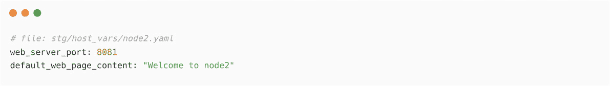

# 16

# 适用于生产环境的 Ansible 自动化最佳实践

Ansible 可以用于自动化 IT 基础设施和 DevOps 任务。由于其灵活和模块化的架构，我们可以使用 Ansible 实现大型复杂的自动化用例。但同时，我们需要保持自动化工件和方法的简单性和可重用性。

本章中，你将学习实现高效自动化解决方案的关键和知名最佳实践。

首先，你将学习如何在 Ansible 项目中组织 playbooks、角色、集合和清单。之后，我们将讨论在清单中存储管理节点信息的最佳实践以及存储和维护多个清单的不同方法。你可以根据远程节点的功能、重要性或位置将其单独存储；这些细节将在接下来的章节中进行解释。

你还将学习在动态方法中存储变量的最有效方式，以及如何存储主机变量和组变量，以便适当地维护它们。

另一个在 Ansible 自动化中至关重要的组件是处理凭据，如用户名和密码、API 密钥以及机密信息。因此，你将探索 Ansible 凭据管理的最佳实践，例如如何为 Ansible playbook 存储敏感数据。

最后，你将学习开发和执行 Ansible playbook 的最佳实践、方法和优化技巧。

本章将覆盖以下主题：

+   组织 Ansible 自动化内容

+   存储远程主机信息 – 清单最佳实践

+   Ansible 主机变量和组变量

+   Ansible 凭据最佳实践

+   Ansible playbook 最佳实践

本章将从介绍各种 Ansible 内容组织方法和不同的清单组织方法开始。

# 技术要求

完成本章内容，你需要以下技术要求：

+   一台用于 Ansible 控制节点的 Linux 机器。

+   一台或多台配置了 Red Hat 仓库的 Linux 机器作为管理节点（如果你使用的是非 RHEL 机器，请确保已配置适当的仓库以获取软件包和更新）。

本章所有的 Ansible 工件、Ansible playbooks、命令和片段可以在本书的 GitHub 仓库中找到，地址是 [`github.com/PacktPublishing/Ansible-for-Real-life-Automation/tree/main/Chapter-16`](https://github.com/PacktPublishing/Ansible-for-Real-life-Automation/tree/main/Chapter-16)。

# 组织 Ansible 自动化内容

在 *第四章*，*探索自动化开发中的协作*，你学习了**版本控制系统**（**VCS**）和**源代码管理**（**SCM**），以及如何使用 GitHub 服务存储 Ansible 工件。

最佳实践是创建特定于项目的目录（即存储库），将所有相关项保存在一个位置，例如特定于项目的`ansible.cfg`文件、剧本、角色、集合或库。如果有外部角色或集合依赖项，请在`requirements.yaml`（或`requirements.yml`）文件中提及详细信息。

使用 Linux 中的`tree`命令递归列出目录和文件，并了解目录内容的结构。一个示例项目目录可以按如下方式组织：


图 16.1 – 典型的 Ansible 项目目录

您的角色将位于`roles`目录下，如下图所示：


图 16.2 – Ansible 角色目录

根据项目和使用案例，您可能会有更多或更少的目录和文件。我们将在下一节中探讨存储清单的最佳实践。

# 存储远程主机信息 – 清单最佳实践

在 Ansible 自动化中，托管节点或远程主机信息是关键数据，因为没有正确的主机详细信息，Ansible 将无法执行自动化任务。您在*第一章*中了解了 Ansible 清单及其基本细节，*Ansible 自动化 – 介绍*。在*第四章*中，您了解了将清单存储在 GitHub 存储库中的重要性，以便进行版本控制和更好的管理。如果您的托管节点托管在云平台中，那么使用 Ansible 动态清单是最佳实践，正如您在*第五章*中学习的那样，*扩展您的自动化视野*。

## 使用有意义的主机名

在创建 Ansible 静态清单文件时，请使用有意义且用户友好的名称来表示托管节点，而不是复杂的**完全限定域名**（**FQDNs**）或 IP 地址。这将在执行 Ansible 剧本和故障排除时提供帮助。

例如，以下是一个通用的 Ansible 静态清单文件：


图 16.3 – 示例静态清单文件

相同的静态清单可以用用户友好的名称和`ansible_host`信息重写，如下图所示：


图 16.4 – 带有用户友好名称的 Ansible 清单

使用`ansible_host`意味着您不必依赖 DNS 名称（FQDN），可以通过 IP 地址访问托管节点。

这种做法不仅有助于您排除输出和日志中的故障，还能帮助您通过简单且有意义的名称管理清单。

如何构建您的清单

有关更多详情，请参考官方文档：[`docs.ansible.com/ansible/latest/user_guide/intro_inventory.xhtml`](https://docs.ansible.com/ansible/latest/user_guide/intro_inventory.xhtml)。

在下一节中，你将学习如何根据生产、预发布和开发等环境来分离库存。

## 将生产、预发布和开发主机分开存储

你需要在项目级别或整体库存级别组织你的库存。如果你在多个 Ansible 项目中使用相同的管理节点（相同的节点但不同的自动化和用例），那么将库存存储在一个中央的 GitHub 仓库中作为单一的事实来源。这将帮助你更好地组织管理节点信息，以便用于不同的自动化 playbook。以下图示展示了库存存储在专用 GitHub 仓库中的场景：


图 16.5 – 存储在专用库中的 Ansible 库存

在以下示例中，我们为库存创建了一个单独的目录，并将生产、开发和预发布的管理节点分别放入不同的目录（参见本书 GitHub 仓库中的`Chapter-16`目录）：


图 16.6 – 基于环境组织的 Ansible 库存

执行 playbook 时，必须指定使用的库存文件，如下所示：

```
[ansible@ansible Chapter-16]$ ansible-playbook site.yml -i inventories/prod/host
```

库存还可以根据位置、重要性、服务器类型等进行分类。也可以通过在库存文件中使用主机组来进行相同的分类，如下图所示：


图 16.7 – 用于管理节点的主机组和组变量

使用`ansible-inventory`命令验证管理节点的分组，如下图所示：


图 16.8 – 使用 ansible-inventory 命令列出主机和主机组

在前面的示例中，我们在相同或不同的文件夹中创建了多个库存文件，并根据功能或位置对管理节点进行分组。在下一节中，你将学习如何分别使用`group_vars`和`host_vars`变量来维护主机特定和组特定的变量。

# Ansible 主机变量和组变量

正如您之前学到的，像许多其他自动化工具一样，Ansible 允许您使用变量动态执行 Playbooks。可以配置相同的 Playbook，使其能够根据不同的期望状态通过变量和值执行。我们可以将变量保存在 Playbooks 内部、外部变量文件、库存文件和许多其他地方。您在*第六章*《自动化 Microsoft Windows 和网络设备》中学习了更多关于变量的内容。

相同的变量可以在多个位置指定，但根据变量的位置和变量优先级，Ansible 将应用适当的变量值。

Ansible 使用适当的变量值并根据它们执行 Playbooks；下图展示了 Ansible 如何将变量值与 Playbook 结合的典型流程：


图 16.9 – Ansible 结合 Playbooks 和变量进行最终执行

理解变量优先级

请参考[`docs.ansible.com/ansible/latest/user_guide/playbooks_variables.xhtml#understanding-variable-precedence`](https://docs.ansible.com/ansible/latest/user_guide/playbooks_variables.xhtml#understanding-variable-precedence)以了解更多关于变量优先级的信息。

最佳实践是分别在`host_vars`和`group_vars`目录中使用特定于主机和特定于组的变量，如下图所示：


图 16.10 – Ansible 库存中的 host_vars 和 group_vars

现在，让我们来学习如何创建`host_vars`和`group_vars`。

## Ansible group_vars

组的变量应在类似`group_vars/INVENTORY_GROUP_NAME.yaml`的文件或类似`group_vars/INVENTORY_GROUP_NAME/VAR_FILE`的子目录中提及。

例如：

+   `group_vars/web.yaml`

+   `group_vars/web/vars.yaml`

+   `group_vars/web/credential.yaml`

## Ansible host_vars

主机的变量应在类似`host_vars/INVENTORY_HOSTNAME`的文件或类似`host_vars/INVENTORY_HOSTNAME/VAR_FILE`的子目录中提及。

例如：

+   `host_vars/node1.yaml`

+   `host_vars/node1/vars.yaml`

+   `host_vars/node2.yaml`

可以为同一托管节点创建多个变量文件，以便您可以分别管理相关的变量。

## 将您的机密变量保存在安全的位置

如果您的主机变量中包含凭据或机密信息，请将这些变量保存在单独的变量文件中，并使用 Ansible Vault 对其进行加密。以下是一些示例：

+   `host_vars/node1/vars.yaml`

+   `host_vars/node1/credentials.yaml`

+   `group_vars/web/vault.yaml`

也可以使用其他保管服务，如 HashiCorp Vault 或 CyberArk，来替代 Ansible Vault。请参考 *第十三章*，*使用 Ansible 进行密钥管理*，以了解有关 Ansible Vault 的更多信息。

## 管理 Ansible 中的 group_vars 和 host_vars

在此练习中，您将使用主机变量和组变量来控制多个 Web 服务器的值。请按照以下步骤操作：

1.  在暂存清单目录（`Chapter-16/inventories/stg`）中创建一个 `hosts` 清单文件，内容如下（不用担心 `node1`、`node2` 或 `node3`，因为我们不会连接到这些机器）：


图 16.11 – 带有 web 组的 Ansible 清单

1.  为了存储组变量和主机变量，创建 `group_vars` 和 `host_vars` 目录：


图 16.12 – 创建组变量和主机变量的目录

1.  创建一个名为 `inventories/stg/group_vars/web.yaml` 的组变量文件，内容如下：


图 16.13 – 创建一个组变量文件

1.  为 `node1` 配置不同的 `web_server_port` 值（`8080`）。创建一个名为 `inventories/stg/host_vars/node1.yaml` 的主机变量文件，内容如下：


图 16.14 – 创建主机变量文件

1.  为 `node2` 配置不同的 `web_server_port` 值（`8081`）。然后，在 `inventories/stg/host_vars/node2.yaml` 中创建一个名为 `node2` 的主机变量文件，内容如下：



图 16.15 – 为 node2 创建主机变量文件

1.  现在，所有变量文件已创建，您必须验证它们，如下图所示：


图 16.16 – 带有组变量和主机变量的项目目录结构

1.  现在，使用 `ansible-inventory` 命令验证每个主机的变量值：


图 16.17 – 使用 ansible-inventory 命令验证清单和变量

1.  现在，您必须验证并理解已分配的主机变量，如下所示：

    +   `node1` 已分配了 `web_server_port: 8080`，该值来自 `host_vars/node1.yaml`。

    +   `node2` 已分配了 `web_server_port: 8081`，该值来自 `host_vars/node2.yaml`。

    +   `node3` 已分配了 `web_server_port: 80`，该值来自 `group_vars/web.yaml`。

根据变量优先级，节点将为相同的变量获取不同的值，如下图所示：


图 16.18 – 目标节点上的 Ansible 组变量和主机变量

配置 `host_vars` 或 `group_vars` 中的主机特定变量非常重要，这样你就不会在 playbook 级别丢失重要的值。如果多个主机共享相同的变量和值，那么应在 `group_vars` 中进行配置。

在下一节中，你将学习如何在 Ansible 中存储凭据的最佳实践。

# Ansible 凭据最佳实践

Ansible 支持多种凭据和认证方法，如用户名和密码、SSH 密钥、API 令牌、Webhooks，甚至可以创建自定义凭据。你应该使用一个简单的认证机制作为起点，但你需要考虑最佳实践，以确保安全性和防护措施到位。

## 避免使用默认的管理员用户帐户

工程师通常会将默认的管理员帐户配置为 Linux 中的 `root` 或 Microsoft Windows 中的 **administrator** 作为 `remote_user`。这不是最佳实践；你应该为 Ansible 创建专用帐户并为管理节点进行配置。

## 将环境和节点的登录凭据分开

在之前的示例中，你为 Ansible 创建了 Linux 和 Microsoft Windows 用户帐户，用于登录和执行任务。你可以为所有节点创建相同的用户帐户，但这不是必须的，也不推荐。你可以为不同的管理节点创建不同的用户帐户，因为你可以为每个管理节点或主机组指定 `remote_user` 或 `ansible_user`，如下面所示：


图 16.19 – 远程节点的不同用户帐户

在上面的库存输出中，可以看到不同的 `ansible_user` 实例已为不同的节点配置，例如 `node1` 使用 `ansibleadmin`，`node2` 使用 `user1`，`node3` 使用 `devops` 等。

## 避免使用明文密码

如果你使用基于密码的认证方式，则密码应加密并单独保存。请参考 *第三章**的*，*使用 Ansible Vault 加密敏感数据* 部分，了解更多关于 Ansible Vault 和秘密管理的内容。通过 Ansible Vault 加密后，密码文件将安全且无法被其他人读取，如下图所示：


图 16.20 – 使用 Ansible Vault 加密敏感文件

当你执行 playbook 时，也可以指示 Ansible 使用 `--ask-pass` 开关提示输入密码：


图 16.21 – Ansible Vault 密码提示

根据你组织的最佳实践和合规要求，为 Ansible 中的敏感数据处理添加更多的限制和最佳实践。

在下一部分中，你将学习一些 Ansible playbook 的最佳实践。

# Ansible playbook 最佳实践

在编写 Ansible playbook 时，考虑到可读性和可重用性是很重要的。由于 YAML 格式是人类可读的，因此很容易为你的 Ansible playbook 制定并遵循一些样式指南。

在 *第十五章*，《使用原始命令进行网络操作》中，你学习了何时使用 `raw` 模块和命令。始终查看文档，看看是否有适合任务的模块。如果没有合适的模块，可以使用 `command`、`shell`、`raw` 和 `script` 模块。但请始终记住，`command`、`shell`、`raw` 和 `script` 模块不是幂等的，每次执行时都会报告为 `changed`。

## 始终为你的任务命名

即使`name`参数是可选的，最佳实践是为你的 plays、tasks、blocks 及其他组件提供适当且有意义的名称。参见*图 16.22*，其中可以看到为任务使用的示例名称。

## 使用适当的注释

在你的 playbook 中添加注释将帮助你在出现问题时进行故障排除。注释在需要进一步开发或增强时也非常有用，这样原作者和其他开发人员就能轻松理解 Ansible playbook 中需要的任务或步骤。

以下截图显示了在任务之前添加了注释：


图 16.22 – 带有注释、额外行和标签的 Ansible playbook

## 额外的行和空格

在 playbook 中添加空格和额外的行将增加其可读性。如前面截图所示，在每个任务后添加一个额外的行可以帮助你更容易地识别各个任务。

实现你自己的样式指南，并遵循 YAML 编写的最佳实践，以提高 Ansible 制品的可读性和可重用性。

## 为任务添加标签

当你拥有大型或复杂的 playbook 时，可能需要单独运行某些任务，而不是执行 playbook 和角色中的每个任务。可以通过使用`--tags`参数来实现，方法如下：

```
$ ansible-playbook site.yml --tags=pretasks
```

可以通过使用`--skip-tags`参数来跳过这些任务，方法如下：

```
$ ansible-playbook site.yml --skip-tags=email
```

请参考 Ansible 标签文档（[`docs.ansible.com/ansible/latest/user_guide/playbooks_tags.xhtml`](https://docs.ansible.com/ansible/latest/user_guide/playbooks_tags.xhtml)），了解更多关于 Ansible playbook 中标签的使用和方法。

## 使用显式声明

模块可能具有默认的参数值，如果我们在 playbook 中没有提到这些值，它们可能会自动应用。但在 playbook 中显式声明这些参数将帮助你明确任务的期望结果。例如，在 `ansible.posix.firewalld` 模块中，`immediate` 的默认值是 **no**，如文档中所示：[`docs.ansible.com/ansible/latest/collections/ansible/posix/firewalld_module.xhtml`](https://docs.ansible.com/ansible/latest/collections/ansible/posix/firewalld_module.xhtml)：


图 16.23 – firewalld 模块显示立即参数详情

保持原样，或在需要立即应用防火墙条目时显式声明为 `immediate: yes`。以下截图展示了一个示例 `firewalld` 任务：


图 16.24 – 带有显式声明的 firewalld 任务

始终在 Ansible playbook 中声明期望的结果，以便在出现问题时可以进行故障排除和修复。

## 使用本地 YAML 格式编写 playbook

可以使用任何可接受的 YAML 格式编写任务，只要 Ansible 能够读取并理解它。以下截图展示了在 Ansible playbook 中的一些示例任务：


图 16.25 – 非本地 YAML 格式的 Ansible 任务

相同的 playbook 可以用本地 YAML 编写，这样更整洁且更具可读性。可以在以下截图中看到：


图 16.26 – 使用本地 YAML 格式编写的 Ansible 任务

参阅 Ansible YAML 语法（[`docs.ansible.com/ansible/latest/reference_appendices/YAMLSyntax.xhtml`](https://docs.ansible.com/ansible/latest/reference_appendices/YAMLSyntax.xhtml)）和高级语法（[`docs.ansible.com/ansible/latest/user_guide/playbooks_advanced_syntax.xhtml`](https://docs.ansible.com/ansible/latest/user_guide/playbooks_advanced_syntax.xhtml)）文档，了解更多有关 Ansible 的 YAML 知识。

## 避免硬编码变量和细节

以下截图展示了一个在 playbook 中提到（硬编码）目标节点和软件包详情的 play：


图 16.27 – 带有硬编码值的 Ansible playbook

如果你需要在其他目标节点上执行 playbook，那么你必须修改 playbook 文件并更新其值。相同的 playbook 可以这样编写：


图 16.28 – 带有动态变量的 Ansible playbook

现在，在执行 playbook 时传递变量，如下所示：

```
$ ansible-playbook site.yaml --extra-vars “nodes=webservers web_package=httpd”
```

通过避免硬编码，可以动态地使用相同的 playbook 针对不同的目标节点，使用不同的值。

## 在 Ansible playbook 中使用块

块是 Ansible playbook 中任务的逻辑分组，有助于处理执行过程中的错误。与其验证任务的成功率，不如在 playbook 中使用`block`，如下所示：


图 16.29 – 在 Ansible playbook 中使用块

如果 `block` 中的任何任务失败，Ansible 会执行 `rescue` 块中的任务。无论 `block` 和 `rescue` 任务成功或失败，`always` 块中的任务都会执行。

请参考块文档（[`docs.ansible.com/ansible/latest/user_guide/playbooks_blocks.xhtml`](https://docs.ansible.com/ansible/latest/user_guide/playbooks_blocks.xhtml)），了解如何在 Ansible 中使用块。

## 使用角色和子任务

当你开发大型复杂的自动化用例时，应该将 playbook 拆分成小的子任务文件和角色。这样做有助于提高 Ansible 工件的模块化和灵活性，同时也有助于更轻松地排除故障：


图 16.30 – 一个 Ansible playbook 调用角色和子任务文件

上图展示了一个 Ansible playbook，它调用了 `linux-patching` 角色以及来自该角色的一些特定任务文件。

## 为变量使用有意义的名称

在前几章中，你学习了 Ansible 变量及其不同的用法。在你的 playbook 和角色中使用多个变量是可能的，因此为变量使用有意义的名称非常重要。下图展示了命名变量的好例子和坏例子：


图 16.31 – 使用简洁且有意义名称的 Ansible 变量

适当地命名变量有助于避免在 playbook 开发中重复使用变量名称和复杂性。

## 学习 playbook 优化

有多种方法可以优化 Ansible playbook 并加速其执行。以下是其中的一些方法：

+   使用并行执行。

+   根据需要使用适当的执行策略。

+   根据需要使用适当的 `forks` 值。

+   使用 `serial` 批量执行。

+   使用 `order` 根据清单控制执行顺序。

+   使用 `throttle` 处理高 CPU 密集型任务。

阅读 *加速 Ansible playbook 的 8 种方法* ([`www.redhat.com/sysadmin/faster-ansible-playbook-execution`](https://www.redhat.com/sysadmin/faster-ansible-playbook-execution)) 和 *让 Ansible 模块更快工作的 5 种方法* ([`www.redhat.com/sysadmin/faster-ansible-modules`](https://www.redhat.com/sysadmin/faster-ansible-modules))，以了解更多关于 Ansible 优化技巧的内容。为了拓展你对 Ansible 最佳实践的学习，请参考官方的 Red Hat 课程 *高级自动化：Red Hat Ansible 最佳实践* ([`www.redhat.com/en/services/training/do447-advanced-automation-ansible-best-practices`](https://www.redhat.com/en/services/training/do447-advanced-automation-ansible-best-practices))。

# 总结

在本章中，你学习了一些可以在 Ansible 开发工作流中实现的最佳实践。你探讨了组织 Ansible 工件（包括 playbook、角色、变量、清单和其他 Ansible 内容）的最佳实践。接着，你了解了根据受管理节点环境、重要性和其他因素分别存储清单的重要性。你还学习了如何使用主机变量和组变量来组织变量。

之后，你学习了关于在 Ansible 中存储和管理凭据的一些最佳实践，如避免使用明文密码和将密钥与常规变量文件分开存储。最后，你学习了改善 Ansible playbook 效率的不同最佳实践和优化技巧。请参考 *进一步阅读* 部分，了解更多关于 Ansible 最佳实践的内容。

恭喜你！通过本章内容，你已经完成了关于 Ansible 在实际使用案例中自动化的学习。

首先，你了解了 Ansible 并学习了如何安装和部署它。在此基础上，你学习了 Ansible 命令、模块和管理节点。之后，你学习了 Ansible playbook，并开发了基本的自动化用例，如收集系统信息、每周系统重启和系统报告生成。你还学习了版本控制系统的重要性，并练习了如何使用它们存储 Ansible 工件。

此后，你通过理解如何寻找 Ansible 自动化用例来扩展了学习内容。你学习了如何使用 Ansible 自动化 Microsoft Windows 和网络设备（如 VyOS 和 Cisco ASA）。你还学习了如何使用 Ansible 管理虚拟化平台、云平台（AWS、GCP 和 VMware）以及数据库操作。

后来，你学习了如何在 DevOps 实践和工作流中使用 Ansible，并通过 Ansible 进行容器管理。你还学习了如何通过在 Kubernetes 上部署和扩展应用程序来使用 Ansible 进行 Kubernetes 管理。为了扩展你的知识，你了解了 Ansible 自动化平台及其各种集成方法。之后，你学习了如何使用 Ansible Vault 管理敏感信息。

在最后几章中，你学习了如何使用原始命令、API 调用和模块来管理非标准平台和操作。你还学习了开发和存储 Ansible 工件的最佳实践。

在继续之前，记得加入 Ansible 社区、实时聊天群组和邮件列表。参考 Ansible 社区页面（[`www.ansible.com/community`](https://www.ansible.com/community)）以查找聚会活动的详细信息。如果你对本书的内容有任何问题或反馈，欢迎通过 LinkedIn 与我联系（[`www.linkedin.com/in/gineesh`](https://www.linkedin.com/in/gineesh)）。

如果你正在寻找官方的 Ansible 培训，查看来自 Red Hat 的课程（[`www.ansible.com/products/training-certification`](https://www.ansible.com/products/training-certification)）。

如果在练习本书中的内容时遇到问题，请在书籍仓库中提出问题（[`github.com/PacktPublishing/Ansible-for-Real-life-Automation/issues`](https://github.com/PacktPublishing/Ansible-for-Real-life-Automation/issues)）。

感谢你对本书的关注以及致力于完成本书的努力！

# 进一步阅读

要了解更多关于本章涵盖的主题，请查看以下资源：

+   *重用 Ansible 工件（Include 和 Import）*： [`docs.ansible.com/ansible/latest/user_guide/playbooks_reuse.xhtml#playbooks-reuse`](https://docs.ansible.com/ansible/latest/user_guide/playbooks_reuse.xhtml#playbooks-reuse)

+   *Ansible 小技巧*： [`docs.ansible.com/ansible/latest/user_guide/playbooks_best_practices.xhtml`](https://docs.ansible.com/ansible/latest/user_guide/playbooks_best_practices.xhtml)

+   *Ansible 最佳实践（演示文稿归档）*： [`aap2.demoredhat.com/decks/ansible_best_practices.pdf`](https://aap2.demoredhat.com/decks/ansible_best_practices.pdf)

+   *伟大的 Ansible 用户的 10 个习惯*： [`www.redhat.com/sysadmin/10-great-ansible-practices`](https://www.redhat.com/sysadmin/10-great-ansible-practices)
