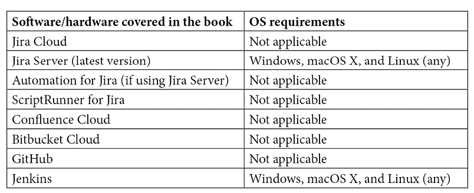

# 前言

Jira 最初是作为开发人员跟踪软件中的错误的工具开始的，经过多年的发展，它已经演变成一个强大的项目管理平台，允许组织在多个团队之间以及跨软件、服务管理和业务项目之间进行计划、管理和跟踪工作。

随着时间的推移，这使得团队能够跟上他们的项目进度；然而，这也带来了管理上的开销，用户必须不断执行简单而重复的任务，以确保 Jira 问题与正在执行的工作保持相关。

2019 年底，Atlassian 收购了 Automation for Jira，一款让用户无需编写代码即可自动化 Jira 中任务的应用程序。此功能随后被集成到 Jira Cloud 中，作为本地功能提供，同时仍作为可选附加组件，供服务器版 Jira 产品的用户使用。

本书是一本实践指南，适用于高级用户和 Jira 管理员，帮助他们使用 Jira 系列产品（包括 Jira 软件、Jira 服务管理和 Jira Core）以无代码方式自动化日常、重复和繁琐的任务。

# 本书适用对象

本书面向 Jira 管理员和项目经理，他们希望了解 Jira 中提供的自动化功能。要求读者对 Jira 有一定的了解，并具备一定的 Jira 管理概念知识，包括工作流和项目配置。

# 本书内容

*第一章*，*自动化的关键概念*，向你介绍 Jira 自动化规则的关键概念。我们将探索规则的基本构成部分，以及典型规则的样子。到本章结束时，你将理解自动化规则的工作原理，以及如何创建你的第一个规则。

*第二章*，*自动化 Jira 问题*，探讨了条件如何用于缩小自动化规则的适用范围，以及如何针对和处理相关问题，如子任务和关联问题。我们还将学习如何编辑和转换问题，如何使用高级字段编辑器。最后，你将学习如何按设定的时间间隔调度任务，所有这些都通过为每个主题提供的实际示例来帮助你理解。

*第三章*，*使用智能值增强规则*，讲述了智能值以及它们如何使你能够为自动化增加显著的力量和复杂性。我们将学习如何操作和格式化文本字符串、日期和时间，以及值列表，最后，还会介绍可以使用的强大数学表达式。

*第四章*，*发送自动化通知*，解释了如何使用自动化规则发送通知。你将学习如何向客户发送电子邮件通知，以及如何借助每个主题中涉及的实际用例，集成到包括 Slack 和 Microsoft Teams 在内的外部聊天系统中。

*第五章*，*与外部系统协作*，解释了如何使用自动化规则向外部系统发送请求以及如何处理这些系统返回的数据。我们还将学习如何使用自动化规则创建入站 Webhook，以接收来自外部系统的请求，并如何处理接收到的数据。

*第六章*，*自动化 Jira 服务管理*，解释了如何使用自动化规则来处理并自动将来请求路由到服务管理项目。我们还将学习如何监控服务请求的 SLA 合规性，最后，了解如何实现常见任务的端到端完全自动化。

*第七章*，*自动化 Jira 软件项目*，探讨了针对 Jira 软件项目的多种自动化方法。你将通过一些实际例子了解如何自动化开发人员在日常工作中常遇到的重复性任务，如保持多个项目之间的版本同步，并确保为任务和故事创建正确的子任务。

*第八章*，*与 DevOps 工具集成*，解释了如何使用自动化与 GitHub 和 Bitbucket 等工具进行集成。我们将发现如何在这些工具中的事件触发时，自动转换与之相关的 Scrum 看板上的问题，并通知相关方更新。我们还将探讨如何在 Sprint 完成时启动构建工具中的部署。

*第九章*，*最佳实践*，介绍了编写自动化规则时应遵循的一些最佳实践。特别是，我们将探讨如何规划和组织规则，并了解如何确保你的规则不会对性能产生负面影响。

*第十章*，*故障排除技巧与方法*，重点介绍了故障排除技术。我们将探讨调试规则和解决常见问题的技巧。我们还将了解服务限制及如何监控和维护它们，最后，我们将审视自动化性能洞察以及如何利用它们来微调规则。

*第十一章*，*超越自动化：脚本入门*，为你介绍了 Jira 最受欢迎的脚本插件之一，并通过一个先前的示例将其与自动化规则进行比较，以便我们可以比较 Jira Cloud 和 Jira Server 中无代码自动化规则与脚本的区别。

# 为了最大限度地发挥本书的价值

你至少需要拥有一个免费的 Atlassian 账户，并且能够访问 Jira Cloud 上的 Jira Software 和 Jira Service Management。或者，你需要安装最新版本的 Jira Server/Jira Data Center 和 Automation for Jira。所有示例都已在 Jira Cloud 和 Jira Server 上进行测试：



如果你使用的是本书的电子版本，建议你亲自输入代码或通过 GitHub 仓库访问代码（链接在下一节提供）。这样可以帮助你避免由于复制粘贴代码而导致的潜在错误。

如果你还没有这样做，应该在 https://community.atlassian.com 注册 Atlassian 社区账户。这里聚集了来自世界各地的 Atlassian 用户，你可以在这里提问或参与讨论，并获得关于任何 Atlassian 相关话题（包括自动化）的答案。

# 下载示例代码文件

你可以从 GitHub 上下载本书的示例代码文件，链接地址是 https://github.com/PacktPublishing/Automate-Everyday-Tasks-in-Jira。如果代码有更新，它将在现有的 GitHub 仓库中进行更新。

我们还提供了其他代码包，这些代码包来自我们丰富的书籍和视频目录，可以在 https://github.com/PacktPublishing/ 上找到。快去看看吧！

# Code in Action

本书的《Code in Action》视频可以在 http://bit.ly/3spHl2T 上观看。

# 下载彩色图像

我们还提供了一份 PDF 文件，包含本书中使用的屏幕截图/图表的彩色图像。你可以在这里下载： https://static.packt-cdn.com/downloads/9781800562868_ColorImages.pdf。

# 使用的约定

本书中使用了一些文本约定。

`文本中的代码`：表示文本中的代码词汇、数据库表名、文件夹名、文件名、文件扩展名、路径名、虚拟 URL、用户输入和 Twitter 账号。例如：“设置 `{{now.withDayOfMonth(15)}}` 然后点击 **保存**。”

一块代码的设置如下：

```
{
    "summary": "some summary text",
    "bugDescription": "some descriptive text",
    "softwareVersion": "version string"
}
```

当我们希望将注意力集中在代码块的某个特定部分时，相关的行或项会以粗体显示：

```
{
    "type": "page",
    "title": "Version {{version.name.jsonEncode}}",
    "space": {
```

任何命令行输入或输出都将如下所示：

```
$displayName = "Service Desk Autobot"; $objectId = (Get-AzureADServicePrincipal -SearchString $displayName).ObjectId
$roleName = "Company Administrator"; $role = Get-AzureADDirectoryRole | Where-Object {$_.DisplayName -eq $roleName}
```

**粗体**：表示新术语、重要词汇，或在屏幕上看到的词汇。例如，菜单或对话框中的词汇在文本中会以这种方式出现。示例：“选择**新建操作**，然后选择**发送电子邮件**，并按照以下字段填写，最后点击**保存**。”

提示或重要说明

如此显示。

# 联系我们

我们始终欢迎读者的反馈。

**一般反馈**：如果您对本书的任何内容有疑问，请在邮件主题中注明书名，并通过电子邮件联系我们：customercare@packtpub.com。

**勘误**：虽然我们已尽最大努力确保内容的准确性，但错误仍然可能发生。如果您发现本书中的错误，我们将非常感激您向我们报告。请访问[www.packtpub.com/support/errata](https://www.packtpub.com/support/errata)，选择您的书籍，点击“勘误提交表格”链接并填写相关细节。

**盗版**：如果您在互联网上发现任何我们作品的非法副本，无论形式如何，我们将非常感激您提供相关的地址或网站名称。请通过 copyright@packt.com 与我们联系，并附上相关链接。

**如果您有兴趣成为作者**：如果您在某个领域拥有专长，并且有兴趣撰写或参与书籍的编写，请访问[authors.packtpub.com](http://authors.packtpub.com/)。

# 评论

请留下评论。一旦您阅读并使用了本书，为什么不在您购买书籍的网站上留下评论呢？潜在读者可以看到并利用您的公正意见来做出购买决策，我们 Packt 公司也能了解您对我们产品的看法，而我们的作者也能看到您对他们书籍的反馈。谢谢！

欲了解更多关于 Packt 的信息，请访问[packt.com](http://packt.com)。
