# *第一章*: 自动化的关键概念

Atlassian Jira 是一个流行的工作流管理系统，允许团队在各种场景中跟踪工作，其中最常见的是软件项目，其次是服务台。随着时间的推移，大多数团队都会意识到，存在许多重复且耗时的任务，这些任务需要执行以确保项目任务和请求能够准确及时地进行跟踪。

由于 Atlassian 最近收购了**Jira 自动化**并将其作为 Jira Cloud 的原生功能集成，现在使用直观的*if-this-then-that*方法，甚至不需要编写任何代码，就能更轻松地创建复杂且强大的自动化规则。Jira 自动化仍然可以作为 Jira Server 和 Jira Data Center 的附加应用使用，我们将在本书中讲解两者的不同应用场景。

如果你像我一样，在面对 Jira 中的另一个单调且耗时的任务时，会不由自主地说出*我相信我们一定可以找到一种方法来自动化这个任务*，那么你选对书了。

在本章中，我们将涵盖以下主要主题：

+   开始使用规则

+   使用触发器

+   使用条件

+   使用操作

+   创建你的第一个规则

到本章结束时，你将对 Jira 中的自动化规则的关键概念有一个清晰的理解，了解规则的各个组件如何协作，使你能够编写规则，帮助你自动化 Jira 中的任何重复性和耗时任务，从而能专注于真正重要的事情：完成任务！

# 技术要求

本章的要求如下：

+   **Jira Cloud 环境**：如果你还没有 Jira 账户，可以在[`www.atlassian.com/software/jira/free`](https://www.atlassian.com/software/jira/free)创建一个免费的 Jira Cloud 账户，并确保你选择了 Jira Software 和 Jira Service Management；或者

+   **Jira Server 环境**：如果你使用的是 Jira Server（可以在[`www.atlassian.com/software/jira/download`](https://www.atlassian.com/software/jira/download)下载），请确保你已获得 Jira Software 和 Jira Service Management 的许可证。此外，你还需要确保安装了来自 Atlassian Marketplace 的*Automation for Jira*应用。

在这两种情况下，你都需要至少拥有 Jira 项目的项目管理员权限。

你可以从本书的官方 GitHub 仓库下载本章的最新代码示例，链接为[`github.com/PacktPublishing/Automate-Everyday-Tasks-in-Jira`](https://github.com/PacktPublishing/Automate-Everyday-Tasks-in-Jira)。

本章的 Code in Action 视频可以在[`bit.ly/38POLVA`](https://bit.ly/38POLVA)观看

# 开始使用规则

要理解自动化，我们首先需要了解与之相关的一些基本概念，其中最重要的就是规则。

在本节中，我们将讨论以下概念：

+   规则的定义

+   规则作用域

+   所有者和参与者

+   审计日志

这些将为我们在接下来的章节中构建奠定基础，那么不再拖延，开始吧。

## 什么是规则？

一个规则，在其基本形式下，是一系列步骤，按特定顺序执行，以实现一个既可重复又可审计的预期结果。

通过这点，我们的意思是，规则应该在每次执行时都具有完全相同的结果，并且我们应该能够按时间顺序检查规则所应用的操作。

具体来说，Jira 中的规则允许你根据你设定的标准对问题执行操作。

每个规则由三个基本组件组成：

+   **触发器**：规则的入口点。

+   **条件**：这些精炼了规则的标准。

+   **操作**：这些执行实际任务。

除了这些，规则还包含一些其他基本信息：

+   规则名称

+   规则描述

+   规则作用域

+   规则所有者和参与者

+   在规则失败时通知规则所有者的选项

+   允许其他规则触发此规则的选项

+   规则审计日志

这些组件共同构成了自动化规则的构建块。通过将这些基本组件结合起来，你可以创建用于自动化许多耗时和重复任务的规则。

下图展示了 Jira 中规则的基本组件概述：

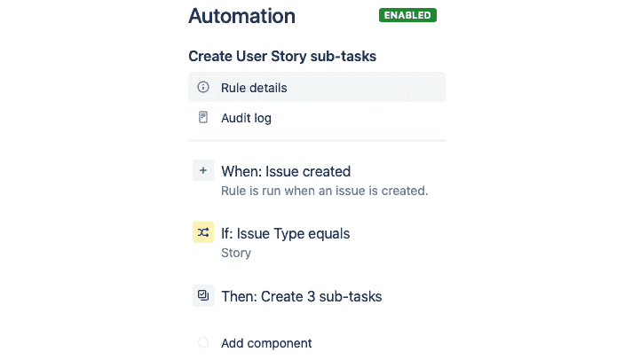

图 1.1 – 可视化规则的基本组件

我们将在本章和下一章中更详细地讨论这些组件。

## 理解作用域

Jira 中的规则可以应用于四个**作用域**中的一个：

+   全局规则

+   跨项目规则

+   项目类型特定规则

+   项目特定规则

下表展示了这些规则作用域是如何定义的，并且为了创建和管理在该作用域中应用的规则，需要哪些 Jira 权限：

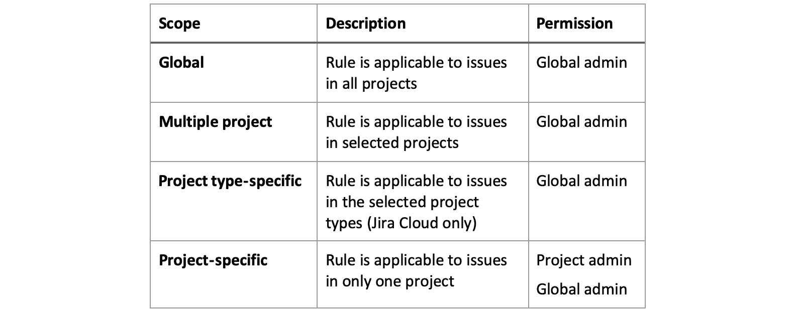

图 1.2 – 规则作用域权限

正如我们所看到的，大多数规则作用域需要你拥有 Jira 全局管理员权限才能管理它们，这是预期的，因为这些规则跨越多个项目，因此不能仅依赖于项目特定权限。

另一方面，项目规则除了 Jira 全局管理员外，还可以由项目管理员创建和管理。

这种区分使得 Jira 管理员可以委托项目特定的自动化规则，同时给予项目管理员在管理自己项目规则时更大的灵活性，而 Jira 全局管理员则可以专注于可以应用于更广泛受众的自动化规则。

规则也可以由 Jira 管理员在全局范围和项目范围之间移动。例如，如果确定某个项目特定的规则可以在多个项目中重用，Jira 管理员可以调整规则的范围。反之亦然，如果某个全局规则仅由单个项目使用，Jira 管理员可以将其范围调整为该特定项目，从而将规则的管理权限转交给项目管理员。

## 所有者和执行者

每个规则都需要一个所有者和一个执行者。

规则的**所有者**通常是创建规则的用户，负责维护该规则。如果规则在执行时失败，规则所有者还将收到来自 Jira 的电子邮件通知。

规则**执行者**是规则将以其身份执行的用户。此用户必须在项目中具有正确的权限，才能执行触发器和规则将执行的任何操作。例如，如果你创建一个需要向问题添加评论的规则，则规则执行者需要在项目中拥有*添加评论*权限。

重要提示

在 Jira Cloud 中，默认的规则执行者始终是*自动化应用用户*，并且属于*atlassian-addons-project-access*项目角色。该项目角色被分配了项目中的所有权限，并可以在**项目设置** | **权限**部分进行更改。从该角色中移除权限可能会导致插件无法正常工作，因此通常建议不要更改这些权限。

## 审计日志

每个规则都有自己的**审计日志**，该日志按时间顺序跟踪规则的执行，并允许你检查每次执行的结果以及对受影响项应用的操作。

这个功能不仅是为了能够跟踪规则执行的结果；它还使我们能够在规则执行不如预期时进行调试。

我们将在*第十章*，*故障排除技巧与方法*中更详细地探讨审计日志在调试规则中的作用，当时我们将探索调试规则和解决常见问题的技巧。

# 使用触发器

每个规则的起点是一个**触发器**。触发器定义了规则如何激活，通常会监听 Jira 中的事件，比如当问题被创建或问题中的字段值发生变化时。

在本节中，我们将首先查看 Jira 事件，因为这将帮助你理解规则是*何时*和*为什么*被触发，然后我们将探索可用的规则触发器，*它们是什么*以及*如何*使用它们。

## 理解 Jira 事件

为了更好地理解触发器的工作原理，值得简要了解 Jira 中的事件是如何工作的，因为这些事件是大多数自动化规则中可用触发器的驱动力。

Jira 像许多应用程序一样，采用事件驱动架构。从本质上讲，这意味着每当在 Jira 中执行一个操作时，都会触发一个事件，允许相关组件监听并根据这些事件执行额外的操作。

有两种主要类型的事件会影响 Jira 中的问题。第一种是工作流事件。当一个问题被创建时，或者每当问题在其底层工作流中转换为新状态时，都会触发这些事件，负责在自动化规则中触发**问题创建**和**问题过渡**。

第二种类型的事件是问题事件，这些事件负责大部分其他问题触发器，并在用户（或应用程序）对问题进行非工作流相关的更改时触发，例如更新字段或将两个问题链接在一起。

## 规则触发器

Jira 自动化为我们提供了多个触发器，我们可以利用这些触发器来启动规则的执行。

这些触发器被分为不同类别，方便你在创建规则时识别需要的触发器类型，这些类别如下：

+   问题触发器

+   DevOps 触发器

+   定时触发器

+   集成触发器

我们将依次查看每个类别及其可用的触发器。

### 问题触发器

正如我们在*理解 Jira 事件*部分中提到的，大多数触发器与问题发生的事件相关，例如问题被创建或编辑时。

大多数触发器都很容易理解且具有单一目的。然而，也有一些触发器可以进一步配置，使其更具体，而无需使用额外的条件。

让我们来看看在编写本文时可用的所有问题触发器以及每个触发器的作用：

+   **字段值更改**：当字段的值发生变化时，规则将会运行。你可以通过选择你希望监控的字段，或使用正则表达式来匹配你希望监控的字段名来配置此触发器。你还可以选择性地缩小哪些问题操作会触发规则。

+   **问题指派**：当问题的指派人发生变化时，规则将会运行。

+   **问题评论**：每当向问题添加新评论时，规则都会执行。请注意，这不包括编辑或删除评论的情况。

+   **问题创建**：每次创建问题时，规则将会执行。此触发器监听问题创建事件，这是工作流中的第一步。

+   **问题删除**：当一个问题被删除时，规则将会运行。

+   **问题链接删除**：当一个问题与另一个问题解除链接时，规则将会运行。你可以选择性地配置此触发器，仅在特定的链接类型上执行。

+   **问题链接**：当一个问题被链接到另一个问题时，规则将执行。和问题链接删除触发器一样，你可以选择性地配置触发器执行的链接类型。

+   **问题移动**：当问题从一个项目移动到另一个项目时，此规则将被执行。您还可以选择仅当问题从特定项目移动时触发该规则。

+   **问题过渡**：每次问题在工作流中从一个状态过渡到另一个状态时，此规则将被执行。您还可以选择配置此触发器以监听特定的过渡或多个过渡到或从特定状态。

+   **问题更新**：当问题的详情更新时（除非更改是通过关联、指派或记录工作完成的），此规则将被触发。

+   **SLA 阈值突破**：当服务管理项目中的 SLA 阈值被突破或即将突破时，此规则会被触发。您可以配置要监控的 SLA，以及突破前后的时间。

+   **工作记录**：当创建、更新或删除工作日志时，此规则将被触发。

有一些值得注意的专用问题触发器，它们如下：

+   **手动触发器**：此触发器不依赖于任何底层事件。相反，这类触发器会出现在用户的问题视图中，并需要用户手动激活。

+   **多个问题事件**：此触发器允许您监听一个问题的多个事件。例如，当您需要在一个工单既被创建又被更新时执行相同的自动化，而不必为每个事件创建单独的规则时，这将非常有用。

+   **冲刺和版本触发器**：这些触发器与底层问题没有直接关联，而是允许您在包含的冲刺发生变化或与项目相关的版本被创建或更改时，对相关问题执行操作。

+   **服务限制突破**：这是一个专用触发器，允许您监控和管理自动化规则本身。

### DevOps 触发器

DevOps 触发器是专门针对 Jira Cloud 设计的，它允许您创建与连接的开发工具中的事件（如 Bitbucket 和 GitHub）相关联的规则。

让我们快速看一下这些触发器及其作用：

+   **分支创建**：当连接的源代码库中创建一个分支时，此规则将被触发。

+   **构建失败**：当连接的构建工具中的构建失败时，此规则将被执行。您还可以选择将其配置为在特定的构建名称、分支或标签上触发。

+   **构建状态变更**：当连接的构建工具中的构建状态发生变化时，例如从失败变为成功，或反之时，此规则将被触发。您还可以选择将其配置为在特定的构建名称、分支或标签上触发。

+   **构建成功**：与前面的触发器类似，当连接的构建工具中的构建成功时，此规则将被执行。此规则也可以选择配置为监听特定的构建名称、分支或标签。

+   **提交创建**：当在连接的源代码库中创建提交时，此规则将执行。

+   **部署失败**：当在指定环境中的部署失败时，此规则将执行。

+   **部署状态更改**：当在指定环境中的部署状态从失败变为成功，或反之时，此规则将执行。

+   **部署成功**：当在指定环境中进行的部署成功时，此规则将执行。

+   **拉取请求创建**：当在连接的源代码库中创建拉取请求时，此规则将执行。

+   **拉取请求被拒绝**：当在连接的源代码库中拒绝拉取请求时，此规则将执行。

+   **拉取请求合并**：当在连接的源代码库中合并拉取请求时，此规则将执行。

    重要提示

    DevOps 触发器在 Jira Server 中不可用，尽管可以使用*传入 Webhook 集成*触发器来模拟这些触发器。

我们将在*第八章*中更详细地探讨这些触发器，*与 DevOps 工具的集成*。

### 定时触发器

定时触发器允许你配置在定义的时间间隔内运行的规则。这些可以是简单的固定间隔或更复杂的调度。

定时触发器非常适合自动化清理过程，或者创建需要定期执行的任务，我们将在*第二章*中更详细地讨论，*自动化 Jira 问题*。

### 集成触发器

最后一种触发器是传入的 webhook。这个触发器为第三方应用程序提供了一种触发自动化规则的方法。

传入的 webhook 触发器可以指定需要操作的确切问题，甚至提供实时数据供你更新问题。

*第五章*，*与外部系统协作*，专门探讨了如何将我们的自动化规则与外部系统集成。

# 使用条件

一旦触发规则，并且为了规则继续运行，它需要满足你指定的条件。

因此，条件会缩小规则的范围，如果条件失败，规则将停止运行，且不会执行该条件后面的任何操作。

自动化提供了一系列可以应用于规则的条件，大多数条件可以单独使用或链式组合，形成更复杂的条件。

自动化规则可用的条件集如下：

+   `问题`字段条件不足以满足需求。

+   **If/else 块**：此条件允许我们根据每个块中的条件是否匹配来执行交替操作，你可以根据需要添加任意数量的条件。

+   **问题附件**：此条件检查问题是否存在附件。

+   **问题字段条件**：此条件将问题字段与您指定的特定标准进行比较。

+   **JQL 条件**：此条件允许您根据任何有效的 JQL 查询检查问题。

+   **相关问题条件**：此条件允许您检查触发问题是否存在相关问题，以及这些问题是否符合特定的 JQL 查询。

+   **用户条件**：此条件允许您将用户与一组标准进行比较。

我们将在*第二章*中详细讲解条件，*自动化 Jira 问题*。

# 使用操作

规则链中的最终构建块是**操作**。操作是允许您在项目中进行更改的组件，能够执行许多任务，包括编辑问题、发送通知、创建任务等等。

与条件类似，规则链可以包含多个操作，从而允许您在单一规则中执行多个任务；例如，先编辑一个问题字段，然后立即通过电子邮件发送通知。

规则操作按类别分组，以便更容易识别您希望规则执行的操作类型。

让我们先看看各个类别，然后再逐个检查每个类别中的操作：

+   问题操作

+   通知

+   Jira 服务管理

+   软件

+   高级

## 问题操作

**问题操作**类别中的操作允许您对现有问题进行更改，也可以创建新问题。让我们看看此类别中的可用操作，以及它们的作用：

+   **指派问题**：此操作将问题指派给一个用户。可以指派给特定用户，或通过使用负载均衡、轮询或随机等方法，在用户列表中进行指派。

+   **克隆问题**：此操作会在同一项目或不同项目中创建一个新问题，复制所有可能的字段。但这并不是真正的克隆，因此不会复制链接、附件或评论。

+   **评论问题**：此操作允许您向问题添加评论，您可以选择在服务管理项目中指定可见性。

+   **创建问题**：此操作将在项目中创建一个新问题，或在全球规则中为选定项目创建新问题，并允许您选择配置哪些字段及其相应的值。

+   **创建子任务**：此操作将在问题上创建子任务，并将摘要设置为指定值。如果您选择添加其他字段，此操作将转化为**创建问题**操作，并将问题类型设置为**子任务**。

+   **删除评论**：此操作仅能与涉及添加评论的触发器一起使用，并且只能删除触发规则的评论。不能用于删除任何其他评论。

+   **删除问题**：此操作会删除当前上下文中的问题。

+   **删除问题链接**：此操作允许你删除问题上的任何问题链接。你可以指定删除某些类型的链接或特定的问题。

+   **编辑问题**：此操作允许你通过选择字段并设置其相应值，来编辑问题上的字段。

+   **链接问题**：使用此操作将允许你通过选择链接类型和要链接的问题，将一个问题链接到另一个问题。

+   **记录工作**：此操作允许你使用实际日期和时间或智能值函数记录针对问题的工作时间。

+   **管理观察者**：使用此操作指定要添加或删除的观察者用户。

+   **转换问题**：此操作允许你通过分配的工作流将问题从一个状态转换到另一个状态。你还可以选择要在转换过程中更新的字段及其关联的值，前提是这些字段存在于问题转换屏幕上。

## 通知

本类别的操作允许你通过各种渠道发送**通知**，并且提供将数据发送到其他外部系统的能力。此类别的操作如下：

+   **发送电子邮件**：此操作在规则执行时发送一封电子邮件。

+   **发送 Microsoft Teams 消息**：此操作允许你在规则执行时向 Microsoft Teams 中的团队发送消息通知。

+   **发送 Slack 消息**：此操作允许你在规则执行时向 Slack 渠道或特定的 Slack 用户发送消息。

+   **发送 Twilio 通知**：使用此操作，在规则执行时通过 Twilio 发送短信消息。

+   **发送网页请求**：此操作允许你向任何可以接受网页请求的第三方系统发送请求。你还可以配置此操作以接受来自外部系统的响应数据，供后续操作使用。

## Jira 服务管理

这些操作允许你执行专门针对**服务管理**项目的任务，具体如下：

+   **添加服务项目客户**：此操作允许你向服务管理项目中添加客户。

+   **批准/拒绝请求**：你可以使用此操作在服务管理项目中批准或拒绝请求。

+   **创建服务请求**：此操作允许你在服务管理项目中创建服务请求。其功能类似于**创建问题**操作，但增加了选择请求类型和客户的能力。

## 软件

软件操作允许你在软件项目中操作**软件**版本，且仅限于以下操作：

+   **创建版本**：此操作允许你在项目中创建新版本。如果已存在同名版本，则不会创建新版本。

+   **发布版本**：此操作使用版本的发布日期发布项目中的下一个未发布版本。或者，你可以配置发布哪个未发布的版本，并选择性地覆盖发布日期。

+   **取消发布版本**：此操作允许您取消发布一个版本。

## 高级

最后一类是**高级**操作。这些操作允许您执行一些任务，例如为后续规则组件创建变量、将信息记录到审核日志等。现在我们来看看这些操作：

+   **创建变量**：此操作允许您为在此规则中其他操作和条件使用的智能变量创建变量，仅在 Jira Cloud 中可用。

+   **删除附件**：此操作允许您使用正则表达式根据附件文件名删除问题中的附件。

+   **记录操作**：使用此操作将消息记录到规则的审核日志中。此操作在调试规则时特别有用。

+   **查找问题**：此操作允许您使用 JQL 搜索最多 100 个其他问题，并将结果列表包含在此规则的其他操作中。

+   **重新获取问题数据**：此操作使用最新的问题数据刷新智能值。对于多操作规则，后续操作依赖于先前更新的数据时，此操作尤其有用。

+   **设置实体属性**：您可以使用此操作为问题、项目和用户设置实体属性。这些是某些应用程序使用的隐藏的键/值存储。

# 创建您的第一个规则

现在我们已经涵盖了关键概念，让我们来看看如何创建您的第一个自动化规则。

在深入了解实际规则之前，我们先简要查看规则编辑器的用户界面及其布局。

## 规则编辑器

下图展示了**自动化规则编辑器**。正如您所见，它以结构化的格式呈现，使得操作规则变得简单直观：

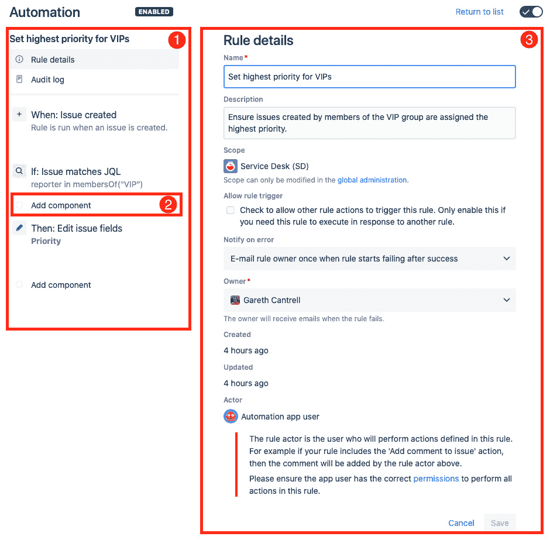

图 1.3 – 自动化规则编辑器

让我们来看一下我们在前面截图中编号的主要组件：

1.  **规则链视图**：在此面板中，您可以看到规则的名称以及构成该规则的组件，按执行顺序排列。这也是您可以访问规则的主要详细信息和其定制审核日志的地方。您还可以在此面板中拖放组件以重新排列它们。

1.  **组件**：您可以通过单击任何现有组件之间出现的**添加组件**链接，在规则链中任何位置添加新的组件。

1.  **规则详情视图**：规则详情视图允许您编辑主要规则详情、查看规则的审核日志，并根据需要编辑组件配置。

## 创建一个规则，将 VIP 用户的问题分配最高优先级

这引出了我们的第一个自动化规则。在许多组织中，VIP 用户（如经理或高管）提出的问题需要被赋予最高优先级，以便能立即引起团队成员的注意。

由于这是我们的第一个规则，我们将一步一步地展示如何在 Jira 中编写自动化规则，并通过相关截图帮助你看到规则编辑器如何让我们直观地快速创建规则。

提示

自动化规则的配置位置在 Jira Cloud 和 Jira Server 之间略有不同。

在 Jira Cloud 项目中，自动化规则可以在**项目设置**中的**自动化**标签下找到，而在 Jira Server 中，它们可以在**项目自动化**标签下找到。

对于这个规则，我们将使用一个服务管理项目。要跟随此规则，你需要定义一个名为**VIP**的用户组，并将适当的用户分配给该组。

首先，在你的服务管理项目中，导航到**项目设置**，点击**自动化**标签，然后点击右上角的**创建规则**按钮：

1.  在决定创建新规则后，首先呈现给你的是选择触发器的选项。

    对于这个规则，点击**问题创建**触发器，然后点击**保存**，如下面的截图所示：

    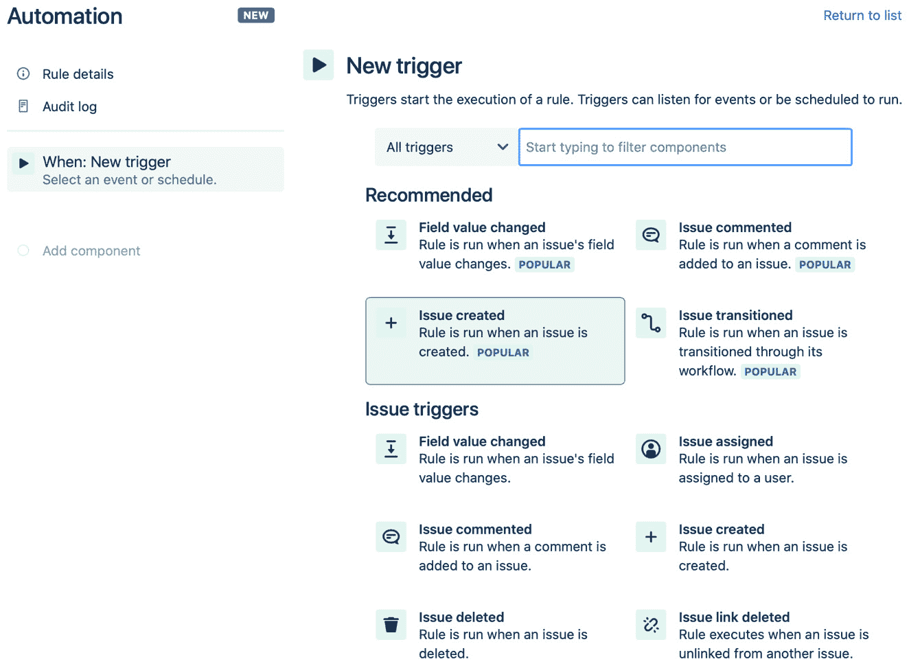

    图 1.4 – 选择问题创建触发器

1.  接下来，我们将添加一个条件，检查报告问题的用户是否是*VIP*用户组的成员。

    在接下来的屏幕中，选择**新建条件**，然后选择**JQL 条件**组件：

    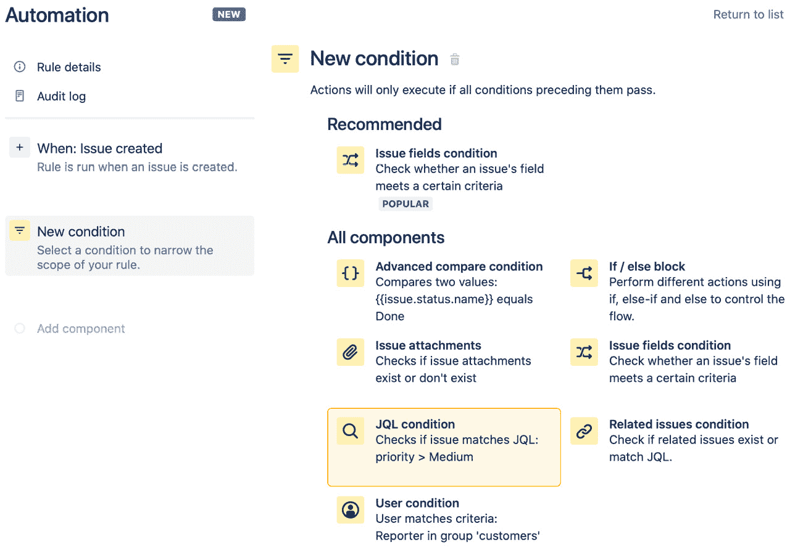

    图 1.5 – 添加 JQL 条件组件

1.  JQL 条件组件需要进一步配置，形式为 JQL 查询。在组件的配置屏幕中，输入以下 JQL 查询，然后点击`reporter in membersOf("VIP")`

    你的规则应该类似于以下截图所示：

    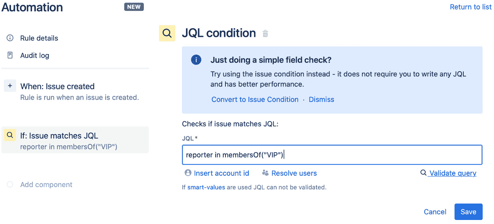

    图 1.6 – 配置 JQL 条件组件

1.  接下来，我们需要插入执行的操作。在这种情况下，我们需要使用**编辑问题**操作来将**优先级**字段设置为**最高**。

    点击**新建操作**，然后选择**编辑问题**：

    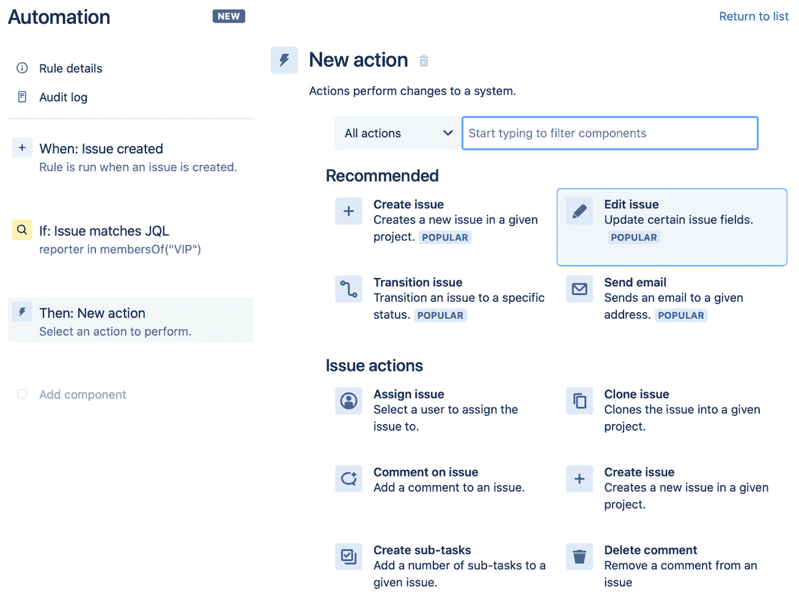

    图 1.7 – 选择编辑问题操作

1.  与**JQL 条件**组件一样，**编辑问题**组件也需要进一步配置，我们现在需要选择要更新的字段。

    你可以在此操作中设置多个字段。但是，对于这个规则，我们只会设置**优先级**字段。首先输入字段名，然后在缩小选择范围后勾选框：

    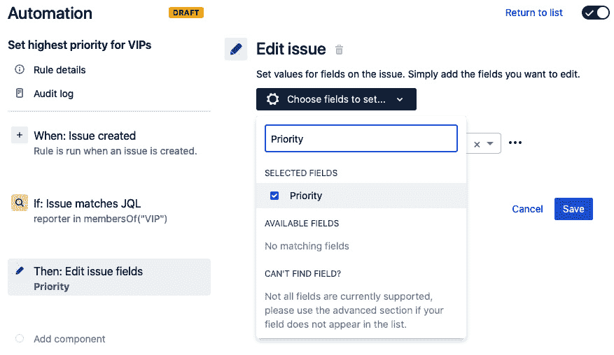

    图 1.8 – 选择优先级字段

1.  现在，你已经选择了**优先级**字段，点击**选择字段进行设置**选项外的区域，以便访问字段值列表，并从下拉菜单中选择可用选项。选择**最高**，然后点击**保存**：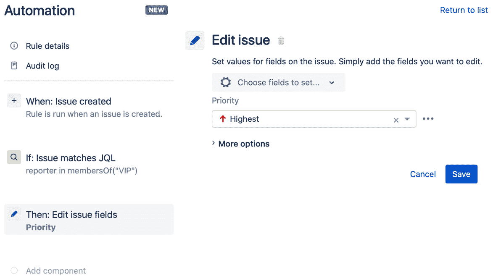

    图 1.9 – 设置优先级字段的值

1.  我们现在已经配置了第一个规则。剩下的就是为新规则命名，启用它，并添加描述。

    在接下来的屏幕中，设置规则名称如下，然后点击`为 VIP 设置最高优先级`

    完成的规则组件应类似于以下截图：

    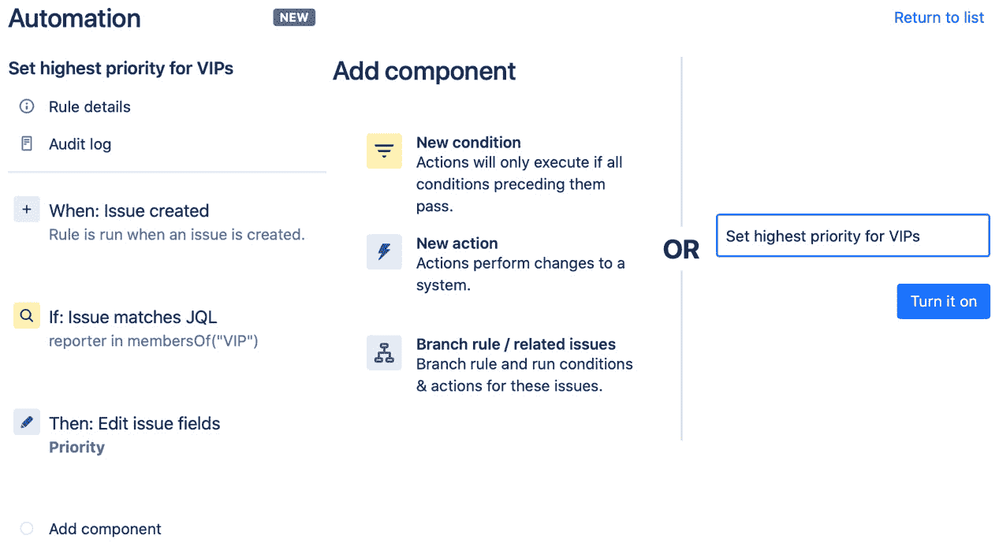

    图 1.10 – 为规则命名并启用它

1.  最后，让我们为规则添加描述，并确保我们对规则的基本细节感到满意。点击`确保由 VIP 组成员创建的问题被分配最高优先级。`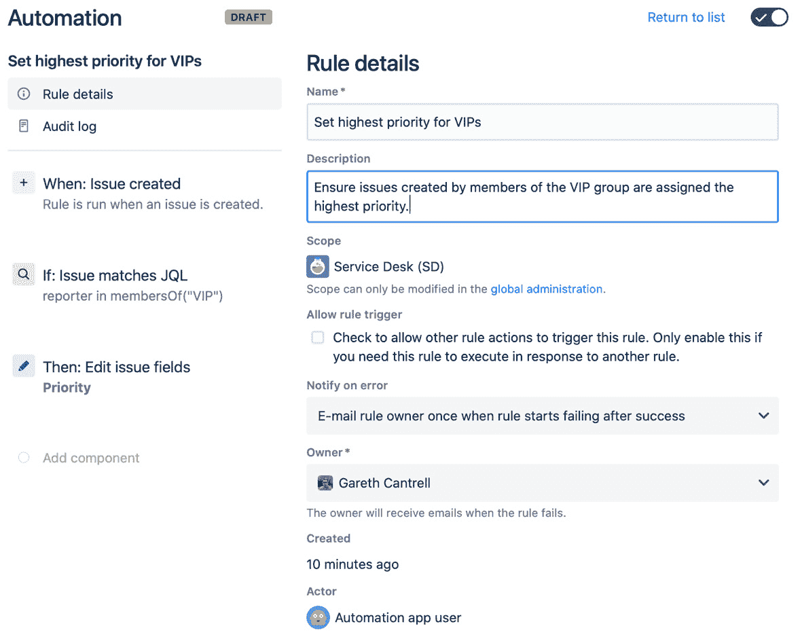

    图 1.11 – 为规则添加描述

1.  你可能已经注意到，当你输入描述时，**规则链**视图顶部的菱形标识从**启用**变为**草稿**。

    这提醒你规则已被修改，但尚未发布。如果你不希望这些更改被发布，可以点击**取消**按钮，位于**规则**详情面板的底部，或点击**返回列表**链接，位于**详情**面板的右上角。

    现在，点击**发布更改**：

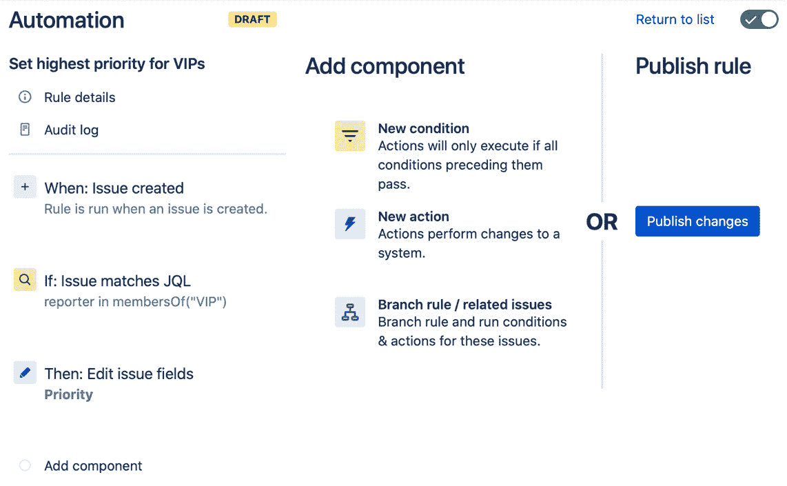

图 1.12 – 发布你的规则更改

你的规则现在将在规则列表中显示，针对你的服务管理项目，每当 VIP 用户组的用户创建问题时，优先级将自动更新为**最高**。

要测试此规则，首先将自己添加到 VIP 组，并在你的服务管理项目中创建一个新的服务请求。确保优先级设置为**最高**以外的其他选项。一旦你创建了问题，导航到该问题并查看**历史记录**选项卡中的活动。你应该看到优先级从你选择的值变更为**最高**，并且活动应记录在规则执行者的日志中。

你现在已经学会了如何在 Jira 中创建和发布自动化规则，而无需编写任何代码。

# 总结

在本章中，你已经了解了 Jira 中自动化规则的关键概念，以及规则的基本构建块，包括触发器、条件和动作。我们还讲解了规则类型、规则拥有者和执行者之间的差异，最后，我们展示了如何将所有这些概念结合起来，创建我们的第一个自动化规则。

正如你在本章中所学到的，我们有许多强大而灵活的组件可以使用，这些组件将帮助我们创建强大的自动化规则，在 Jira 中自动化日常任务，而无需编写任何代码。在接下来的章节中，我们将更详细地探讨这些组件，并通过实际的示例帮助你启动自己的规则。

在接下来的章节中，我们将学习如何使用这些组件来处理 Jira 中的问题。我们将探讨本章介绍的所有条件，如何处理相关问题，以及如何使用一些可用的操作组件在编辑和转换问题之前运行规则，最后看看如何定期执行这些规则。
