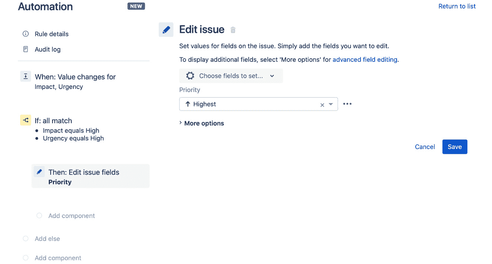

# 第二章：*第二章*：自动化 Jira 问题

在上一章中，我们介绍了 Jira 自动化规则的一些关键概念，并探讨了规则的基本构建块。要真正掌握自动化规则，我们需要理解如何使用这些构建块在 Jira 中自动化处理问题，本章正是讲解这一内容的。

在这里，我们将学习各种条件的工作原理以及何时使用每种条件。我们还将讨论如何处理相关问题，例如子任务、关联问题和史诗中的故事。最重要的是，你将学会如何使用问题动作对问题字段进行更改。

我们还将讨论如何使用高级字段编辑功能，处理那些标准字段编辑器无法满足的特殊情况，最后，我们将探讨如何在工作流中转换问题，以及如何创建计划规则。

我们将覆盖以下主要内容：

+   理解条件

+   使用分支规则和相关问题

+   编辑问题字段

+   高级字段编辑

+   转换问题

+   安排任务

到本章结束时，你应该能够清楚地理解如何在规则中使用自动化条件和动作，从而有效地处理 Jira 中的问题。

# 技术要求

本章的要求如下：

+   **Jira Cloud 环境**：如果你还没有访问 Jira 的权限，可以在 [`www.atlassian.com/software/jira/free`](https://www.atlassian.com/software/jira/free) 创建一个免费的 Jira Cloud 账户，并确保你选择了 Jira 软件和 Jira 服务管理；或者

+   **Jira Server 环境**：如果你使用的是 Jira Server（可以从 [`www.atlassian.com/software/jira/download`](https://www.atlassian.com/software/jira/download) 获取），请确保你拥有 Jira 软件和 Jira 服务管理的许可。此外，你还需要确保安装了 *Automation for Jira* 应用，这可以在 Atlassian Marketplace 找到。

在这两个实例中，你需要至少拥有服务管理项目和 Scrum 软件项目的项目管理员访问权限，才能跟随本章的示例进行操作。对于本章的示例，我们使用 IT 服务管理项目模板创建了服务管理项目，使用 Scrum 软件项目模板创建了软件项目。

你可以从本书的官方 GitHub 仓库下载本章的最新代码示例，地址为 [`github.com/PacktPublishing/Automate-Everyday-Tasks-in-Jira`](https://github.com/PacktPublishing/Automate-Everyday-Tasks-in-Jira)。本章的《实践中的代码》视频可以在 [`bit.ly/2XPMdR7`](https://bit.ly/2XPMdR7) 查看。

# 理解条件

条件使我们能够使规则更强大和灵活，因为它们使我们能够缩小规则的范围，并且在 **if/else** 块的情况下，改变规则的控制流。

在本节中，我们将更详细地研究在 *第一章* 中介绍的每个条件，*自动化的关键概念*，探索它们各自的功能，以及如何在自动化规则中使用它们。

让我们先来看看 **问题字段条件**。

## 问题字段条件

问题字段条件是所有条件中最简单的。它允许你将大多数 Jira 字段与某些标准进行比较，而无需使用智能值或 **JQL**（即 **Jira 查询语言**）。

你可以用它来将字段与一个值或一组值进行比较，也可以用它来测试字段与另一个字段的关系，不论是在同一问题中，还是在某些相关问题中，如父问题、史诗问题、目标问题或触发规则的问题。

此外，您可以通过使用加法操作将这些条件链在一起，形成更复杂的条件。

提示

问题字段条件应尽可能在任何其他条件之前使用，因为它不仅更易于配置，而且相较于 JQL 和高级比较条件等条件，它还具有性能优势。

现在，让我们来看看如何在规则中使用这个条件。

### 创建规则以为故事任务生成子任务

在这个例子中，我们假设开发团队有一个需求，即每个用户故事在创建时都需要同时创建以下三个子任务：

+   开发功能

+   执行 QA 任务

+   记录功能

我们将创建一个规则，在用户故事创建时添加这些子任务，以演示问题字段条件：

1.  如果你使用的是 Jira Cloud，请导航到 **项目设置**，然后点击软件项目的 **自动化** 标签，或者对于 Jira Server，请导航到 **项目设置**，点击 **项目自动化** 标签，然后点击 **创建规则**。

1.  选择 **问题创建** 作为触发器，然后点击 **保存**。

1.  接下来，选择 **新条件**，然后选择 **问题字段条件**。

1.  将 **字段** 设置为 **问题类型**，**条件** 设置为 **等于**，最后，将 **值** 设置为 **Story**，然后点击 **保存**。

1.  最后，选择 `Develop feature`

    `执行 QA 任务`

    `记录功能`

    你的规则应该如下所示：

    

    图 2.1 – 完成的创建子任务规则

1.  最后，命名规则为 `Create story sub-tasks`，然后点击 **启用**，如以下截图所示，以保存并启用该规则：


图 2.2 – 命名并启用自动化规则

在本节中，我们已经看到如何使用问题字段条件，通过简单地从可用字段、条件和值列表中选择我们希望评估的内容，从而在规则中创建决策点。

在下一节中，我们将介绍 JQL 条件，以及如何在自动化规则中使用它。

## JQL 条件

**JQL 条件**允许你测试问题是否符合任何有效的 JQL 查询。除了标准 JQL 外，还可以在查询中使用智能值。我们将在*第三章*中更详细地介绍智能值，*使用智能值增强规则*。

让我们看看如何在一个示例规则中利用 JQL 条件。

### 创建一个规则来创建高优先级事件提醒

在这个例子中，我们希望确保分配的团队成员更新一个高优先级事件，如果它即将突破且报告者在过去 15 分钟内没有被告知事件进展：

1.  在你的服务管理项目中，导航到**项目设置**，点击**自动化**标签，然后点击**创建规则**按钮。

1.  我们希望检查在接下来的 30 分钟内，**解决时间 SLA**是否即将违反，因此选择**SLA 阈值已突破**触发器。选择**解决时间 SLA**，然后选择**将在接下来的**选项，确保选择了 30 分钟，然后点击**保存**。

1.  接下来，选择`type = Incident AND priority in (Highest, High) AND updated >= "-15m"`

    以下截图展示了此时你的规则应该是什么样子的：

    ![图 2.3 – 添加 JQL 条件]

    ](img/Figure_2.2_B16551.jpg)

    图 2.3 – 添加 JQL 条件

1.  我们希望规则通过电子邮件通知被分配人，因此选择`Issue {{issue.key}} is about to breach without update`

    现在，设置`The issue {{issue.key}} - {{issue.summary}} is about to breach in 30 minutes and requires an update.`

    `请向上述问题添加评论或根据需要更新。`

    `非常感谢，`

    `Jira 自动化`

    你的规则现在应该类似于以下截图：

    ![图 2.4 – 高优先级事件提醒规则]

    ](img/Figure_2.3_B16551.jpg)

    图 2.4 – 高优先级事件提醒规则

1.  最后，点击`高优先级事件提醒`，然后点击**开启**以保存并启用规则。

在本节中，我们已经看到如何将任何有效的 JQL 查询作为条件用于我们的规则。

在下一节中，我们将讨论如何在自动化规则中使用`用户`条件。

## 用户条件

**用户条件**允许你检查是否存在某一类型的用户，并且他们是否处于特定的角色或组中，或者是否是某种类型的用户。此条件还允许你在单个条件中添加多个标准，你可以指定是否需要*所有*标准都匹配，或仅*一个*标准匹配即可。

然而，这个条件真正亮眼的地方在于服务管理项目中，在该项目中，客户可以是报告人、请求参与者或客户组织的成员，而用户条件为我们提供了一个标准，*用户是客户*，以便在单次操作中检查用户是否符合这些条件。此外，我们还可以检查用户是否属于特定组织，并根据需要应用特定操作。

现在，让我们来看看如何在规则中使用这个条件。

### 创建规则以将关系经理添加到客户请求

在此规则中，我们希望将客户关系经理作为观察者添加到我们服务管理项目中由重要客户的用户提出的任何问题。您需要在服务管理项目中创建以下组织，并在每个组织中创建一些客户：

+   Kate Price 负责*ACME* 和 *The Widget Co*

+   Pete Kramer 负责*Rain Forest Books*

    提示

    要将用户添加到 Jira 以便按照此示例操作，您需要为每个用户提供唯一的电子邮件地址。如果您的邮件服务器支持电子邮件子地址或标签功能，如 Gmail 或 Outlook 365，您可以利用此功能创建唯一的电子邮件地址，并将邮件发送到您的邮箱。例如，如果您的电子邮件地址是*your.name@yourcompany.com*，使用电子邮件地址*your.name+kateprice@yourcompany.com*将是唯一的，并且邮件会发送到您的收件箱，同时邮件标签为*kateprice*。

让我们来创建我们的规则：

1.  在您的服务管理项目中，导航到**项目设置**，点击**自动化**标签，然后点击**创建规则**。

1.  选择**问题创建**作为触发条件，然后点击**保存**。

1.  现在，选择`报告人`

    `位于组织中`

    `ACME, The Widget Co`

    您的条件应如下图所示：

    

    图 2.5 – 组织中的报告人用户条件

1.  选择**新操作**，然后选择**管理观察者**，在**添加这些观察者**字段中选择**Kate Price**，然后点击**保存**。

1.  添加`报告人`

    `位于组织中`

    `Rain Forest Books`

1.  选择**新操作**，然后选择**管理观察者**，在**添加这些观察者**字段中选择**Pete Kramer**，然后点击**保存**。您的规则应如下图所示：

    图 2.6 – 将关系经理添加为观察者

1.  最后，将您的规则命名为`将关系经理添加到客户请求`，然后点击**启用**以保存并启用此规则。

在本节中，我们讨论了如何使用用户条件来验证用户的存在以及用户是否属于特定的组、角色或组织。

接下来，我们将查看“相关问题条件”，以及如何使用它来检测与触发问题相关的问题。

## 相关问题条件

**相关问题**条件允许你检查在规则上下文中与当前问题相关的其他问题的状态，无论是触发该规则的问题，还是分支规则中的每个问题。

使用此条件，你可以检查相关问题是否存在，是否所有相关问题都匹配给定的 JQL 条件，或者仅有部分相关问题匹配该条件。

让我们来看一个使用**相关问题**条件的示例规则。

### 创建规则以便在所有子任务完成时关闭父任务或故事任务

当一个问题有子任务时，我们需要在所有子任务达到**完成**状态时自动关闭主任务。我们需要使用相关问题条件来实现这一点，如下所示：

1.  在你的软件项目中，进入**项目设置**，点击**自动化**标签（如果你使用的是 Jira Server，则点击**项目自动化**标签），然后点击**创建规则**。

1.  选择**问题已转换**触发器，然后在**至**状态字段中选择**完成**并点击**保存**。

1.  然后，选择`问题类型`

    `等于`

    `子任务`

1.  接下来，选择**分支规则/相关问题**，然后选择**父任务**作为**相关问题的类型**。

1.  现在选择`子任务`

    `所有匹配指定的 JQL`

    `status = Done`

    你的规则现在应该类似于以下截图：

    

    图 2.7 – 配置相关问题条件

1.  然后，选择**新建操作**，接着选择**转换问题**。在这种情况下，父任务（无论是**缺陷**还是**故事**）与子任务共享相同的最终状态，因此我们可以将**目标状态**保留为**从触发问题复制**。

1.  点击`子任务完成时关闭父任务`，然后点击**启用**以保存并启用该规则。

    提示

    当规则需要与其他项目中的相关问题一起工作时，它需要能够在包含相关问题的项目中执行，因此该规则应该是全局规则或多项目规则。

    这意味着只有 Jira 全局管理员才能创建和管理这些规则。

在这一节中，我们已经了解了如何使用相关问题条件对与触发自动化规则的问题相关的问题执行操作。

在下一节中，我们将详细了解高级比较条件。

## 高级比较条件

对于大多数规则，问题字段条件已足够；然而，有时你在编写规则时需要更多的灵活性，这时**高级比较条件**就派上用场了。此条件允许你对智能值、函数和正则表达式进行比较！

我们将在*第三章*中详细讨论智能值和函数，*通过智能值增强规则*，所以现在让我们来看一个使用此条件的规则。

让我们看一下如何在一个示例规则中使用高级比较条件。

### 创建一个规则，当报告者创建评论时重新打开问题

在大多数情况下，当客户创建请求时，服务台团队，或者确切来说是自动化规则，会在没有客户进一步参与的情况下解决该请求。然而，在某些情况下，请求可能没有让客户满意解决，而我们希望在客户添加新评论时重新打开原始请求，而不是创建一个新的请求。

让我们看看如何利用高级比较条件来实现这一点：

1.  在你的服务管理项目中，导航到**项目设置**，点击**自动化**标签，然后点击**创建规则**。

1.  然后，选择**问题评论**触发器并点击**保存**。

1.  接下来，选择`{{comment.author.accountId}}`

    `等于`

    `{{issue.reporter.accountId}}`

    你的条件应该如下所示：

    

    图 2.8 – 配置高级比较条件

    提示

    用户的**accountId**字段仅适用于 Jira Cloud。如果你使用的是 Jira Server 或 Jira Data Center，则需要使用*{{comment.author}}*和*{{issue.reporter}}*。

1.  然后，选择`状态`

    `等于`

    `已解决`

1.  现在选择**新建操作**，然后选择**转换问题**，接着将**目标状态**字段设置为**进行中**并点击**保存**。

1.  最后，命名你的规则为`在报告者评论时重新打开工单`，并点击**开启**来保存并启用规则。

在这一部分，我们讨论了何时使用高级比较条件以及它如何允许我们使用智能值来比较项。

在接下来的部分，我们将探讨**如果/否则**块，并了解如何基于不同条件执行替代操作。

## 如果/否则块

**如果/否则**语句可以说是自动化工具箱中最强大的条件。它允许我们基于指定条件是否匹配执行替代操作。

让我们看一下如何在示例规则中使用**如果/否则**块。

### 创建一个规则来定义事件优先级矩阵

正确的事件优先级排序对于确定问题的相对重要性至关重要。依赖用户选择事件的正确优先级，往往会导致大量事件被错误排序。

更常见的做法是根据事件的影响和紧急性来定义优先级。下表展示了基于所选影响和紧急性的一般优先级矩阵，我们将使用这个矩阵来帮助定义我们的自动化规则。


图 2.9 – 事件优先级矩阵

我们将在使用 IT 服务管理模板创建的服务管理项目中创建规则。我们已经调整了自定义字段**影响**和**紧急性**，并在前面的事件优先级矩阵中显示了选项。您还需要将这两个字段添加到服务管理项目中的**请求**表单，适用于事件请求类型。

参考前面的矩阵，我们来创建我们的规则：

1.  在您的服务管理项目中，导航到**项目设置**，点击**自动化**选项卡，然后点击**创建规则**。

1.  我们希望此规则在问题创建时触发，并且如果**影响**或**紧急性**字段的任何变化，也能触发该规则，因此我们将选择**字段值更改**触发器，然后在**监控更改的字段**下拉菜单中选择**影响**和**紧急性**字段。我们还希望仅在创建或编辑事件时触发此规则，因此我们仅在**操作类型**下拉菜单中选择这两种操作，并保存我们的更改，如下图所示：

    图 2.10 – 事件优先级矩阵触发器

1.  接下来，我们将添加**新条件**字段，并选择**If/else**块。

    在**If**块中，我们将配置第一个条件，用于测试最高优先级，当**影响**和**紧急性**都设置为**高**时。

1.  选择**添加条件...**，然后选择**问题字段条件**，将**字段**设置为**影响**，**条件**设置为**等于**，在**值**字段中选择**高**，然后对**紧急性**字段重复相同的步骤。

    现在您的规则应类似于以下截图：

    

    图 2.11 – 配置 If 块

1.  现在，我们需要添加当前条件满足时要执行的操作，因此选择**新建操作**，然后选择**编辑问题**，在**选择要设置的字段...**下拉菜单中找到**优先级**字段，将**值**设置为**最高**，然后点击**保存**。

    图 2.12 – 编辑问题优先级字段

1.  接下来，构建矩阵的其余部分。在**规则链**视图中点击**添加 else**，然后点击**添加条件**，接着选择**问题字段条件**。将**字段**设置为**影响**，**条件**设置为**等于**，**值**设置为**高**。对**紧急性**字段重复该步骤，将**值**设置为**中**，然后点击**保存**。

1.  我们需要添加当**else**块条件满足时要执行的操作，因此点击**新建操作**，然后选择**编辑问题**。接着，将**优先级**字段设置为**高**，与之前的矩阵一致：

    图 2.13 – 添加第一个 Else-if 块

1.  重复*第 6 步*和*第 7 步*，以处理前面所示事件优先级矩阵中的其余优先级。最终，您应该得到一个**If**块，后面跟着八个**Else-if**块，分别对应优先级矩阵中**影响**和**紧急性**的每个交集。

1.  最后，为规则命名为**事件优先级矩阵**，然后点击**启用**以保存并启用该规则。

在这一部分中，我们已经学习了如何使用条件来确保规则针对正确的问题，并且我们还学习了如何使用强大的**If**/**else**块来控制规则的执行流。

接下来，我们将查看分支规则以及如何处理相关问题。

# 使用分支规则和相关问题

问题很少是孤立存在的。事实上，在许多情况下，总是有其他问题与任何给定问题相关。这些可以是子任务、与更大史诗相关的故事，或是通过诸如被阻塞、重复等关系链接到其他问题。

因此，在创建自动化规则时，您经常会遇到不仅需要对触发规则的问题执行操作，还需要对与源问题相关的问题执行操作的情况。

在这里，**分支**规则组件及其配套条件**相关问题**条件最为有用，使您能够创建跨复杂问题关系工作的规则。

## 分支规则/相关问题

当我们使用分支规则组件对相关问题或问题列表执行操作时，规则不再按线性方式执行，而是扩展成多个子分支，代表每个相关问题。使用智能值时，我们将在下一章中详细讨论，智能值*{{issue}}*指的是当前子分支中的相关问题，而触发规则的问题可以通过智能值*{{triggerIssue}}*找到。

重要提示

*多个问题*上的分支在不同的进程中并行运行，因此不能保证任何一个分支会在下一个分支之前完成执行。

此外，主分支将在子分支开始之前继续执行。

如果只有一个相关问题，主分支将在子分支执行完成之前被阻塞。

现在让我们看看如何在示例规则中使用分支规则/相关问题组件。

### 创建规则以使 Epic 任务与其用户故事任务保持同步

在开发项目中，一个常见的需求是当其包含的第一个故事转换为“进行中”时，Epic 也应转换为**进行中**。这是一个非常适合使用分支规则组件的场景。让我们看看如何实现：

1.  在您的软件项目中，导航至**项目设置**，点击**自动化**选项卡（如果您使用的是 Jira Server，则为**项目自动化**选项卡），然后点击**创建规则**。

1.  选择**问题转换**触发器，然后点击**保存**。

1.  留空**从状态**字段，选择**进行中**作为**到状态**字段，然后点击**保存**。

1.  接下来，选择`Epic`

    `匹配指定的 JQL`

    `status != "进行中"`

1.  现在选择**分支规则/相关问题**，并将**相关问题的类型**字段设置为**Epic（父级）**，然后点击**保存**。

1.  最后，选择**新操作**，然后选择**转换问题**，选择**进行中**作为**目标状态**，然后点击**保存**。

    你的规则现在应该看起来如以下截图所示：

    

    图 2.14 – 在故事变化时将 Epic 移动到进行中

1.  一如既往，最后一步是给你的规则命名为`同步 Epic 状态到故事`，然后点击**开启**以保存并启用该规则。

在本节中，我们已经学习了如何利用分支规则组件创建强大的规则，使我们能够定位与触发规则的问题相关的问题。

在下一部分，我们将更详细地讨论编辑问题字段。

# 编辑问题字段

在你大多数的自动化规则中，你将编辑问题中的信息。在本节中，我们将介绍在创建规则时需要理解的一些常见操作，包括分配、评论、将问题链接到其他问题，以及当然，编辑问题字段。

## 分配问题

在 Jira 中常见的一项繁琐任务是让团队成员跟踪未分配的问题队列并承担这些问题的责任。另一种常见的方法是让像团队负责人这样的人查看这些问题，并根据某些标准将其分配给团队成员。

我们可以使用自动化来处理这些任务，以下是一些我们在分配问题时可以利用的功能：

+   基于当前工作负载进行分配

+   循环分配

+   分配给先前的指派人或评论者

+   从相关问题或 JQL 查询中分配

让我们看看如何在规则中使用这个功能。

### 创建一个规则，将新进的 bug 自动分配给开发人员

在这个规则中，我们将根据每个团队成员当前的工作量，将所有新进的 bug 类型问题分配给开发团队，前提是问题尚未有指派用户。开发团队是项目中所有开发角色的成员：

1.  在你的软件项目中，导航到**项目设置**，点击**自动化**标签（如果你使用的是 Jira Server，则是**项目自动化**标签），然后点击**创建规则**。

1.  选择**问题创建**触发器，然后点击**保存**。

1.  接下来，我们需要确保只分配 bug 类型的问题。选择**新条件**，然后选择**问题字段条件**。将**字段**设置为**问题类型**，**条件**设置为**等于**，**值**设置为**Bug**，然后点击**保存**。

1.  现在我们需要执行新的问题分配。通过选择**新操作**，然后选择**分配问题**来实现。

1.  在**分配问题给**字段中，选择**角色中的用户**。然后，在**选择负责人方法**字段中选择**平衡工作量**。

    由于我们不想重新分配已经设置了负责人（assignee）的任何问题，我们需要使用 JQL 添加进一步的限制。在**JQL 限制问题**字段中输入以下查询：

    ```
    assignee = Unassigned
    ```

    最后，设置**角色**为**开发人员**，然后点击**保存**：

    

    图 2.15 – 使用平衡工作量分配用户

1.  在最终屏幕中，将规则命名为`自动分配新问题`，然后点击**开启**以保存并启用规则。

    注意

    如果你使用的是 Jira Server，必须确保规则的执行者拥有**分配问题**的权限，才能将问题分配给用户。在 Jira Cloud 中，默认的权限设计是确保处于*atlassian-addons-project-access*角色中的用户，如*自动化应用用户*，拥有编辑和分配问题所需的权限，除非你修改了默认权限，否则通常不需要进行调整。

在本节中，我们已经看过如何使用**分配问题**操作，根据不同场景将问题分配给用户，包括基于个人工作量、轮流分配、随机分配或使用与相关问题或查询的输入。

在下一节中，我们将看看如何使用**编辑问题**字段操作来更新问题。

## 编辑问题字段

在问题中编辑字段的能力是自动化规则的主要目标之一，许多规则操作都提供此功能，具体包括以下几种：

+   克隆问题

+   编辑问题

+   变更问题状态

字段编辑器非常灵活，允许你清除字段中的值、设置新值，甚至从当前问题、父问题、触发问题、史诗问题或目标问题中复制值。

此外，你可以在单个操作中编辑多个字段，大多数字段支持智能值和函数。

让我们看一个规则，看看如何在实际操作中使用这个功能。

### 创建规则以对齐用户故事的到期日期和修复版本

在这个示例中，当开始一个冲刺时，我们将更新该冲刺中的所有故事，将到期日期设置为冲刺的结束日期，并将修复版本设置为项目中下一个未发布的版本：

1.  在你的 Scrum 软件项目中，进入**项目设置**，点击**自动化**标签（如果你使用的是 Jira Server，则点击**项目自动化**标签），然后点击**创建规则**。

1.  选择**冲刺开始**，从**可用看板**中选择你的 Scrum 看板，然后点击**保存**。

1.  接下来，选择**分支规则/相关问题**组件，并在**相关问题类型**字段中选择**冲刺中的问题**。

1.  然后，选择`{{sprint.endDate}}`

    `下一个未发布的版本`

    提示

    在这个示例中，我们为**截止日期**字段使用了智能值，你可以在 [`support.atlassian.com/jira-software-cloud/docs/smart-values-general`](https://support.atlassian.com/jira-software-cloud/docs/smart-values-general) 查找可以在规则中使用的智能值列表。我们将在*第三章*中更详细地讨论智能值和智能值函数，*增强规则与智能值*。

    你的规则应如下所示：

    

    图 2.16 – 编辑问题字段

1.  最后，将你的规则命名为 `Align story version and dates to sprint` 并点击 **启用** 来保存并启用该规则。

在本节中，我们介绍了在创建自动化规则时你会使用的一些常见操作。我们学习了如何使用不同的算法以更智能的方式将问题分配给团队成员，同时我们还学习了如何使用操作来修改问题字段。

在某些情况下，我们可能需要更多的灵活性来编辑问题，接下来我们将探讨如何使用可用的高级字段编辑功能来实现这一目标。

# 高级字段编辑

并非所有 Jira 中的字段都是相同的，尤其是在第三方应用提供的自定义字段的情况下。在这些无法使用默认功能更新字段的情况下，提供了一个**高级字段编辑器**，我们可以利用它来应用所需的字段更新。

在本节中，我们将介绍高级字段编辑器以及如何在无法使用标准字段编辑器的情况下利用它。

## 高级字段编辑器

高级字段编辑器存在于**更多选项**部分中的多个操作下，允许你使用 Jira 的 REST API 中指定的格式，通过 JSON 对象指定要编辑的字段。

允许进行高级字段编辑的操作如下：

+   克隆问题

+   创建问题

+   创建服务管理请求

+   编辑问题

+   转换问题

在我们了解如何使用高级字段编辑器之前，我们首先需要理解字段编辑器所需的 JSON 对象是如何结构化的。

## 理解 JSON 对象

我们可以在 JSON 对象中使用两个属性：

+   **update**：你可以在更新属性中使用任何支持的字段操作，如添加、设置或删除。它最适用于具有多个值的字段，在这种情况下，你可以向现有的值集合中添加值，或从中删除值。

+   **fields**：此属性是调用更新属性并执行设置操作的快捷方式。

您在**更新**或**字段**属性中使用的字段取决于您是在创建新问题时还是编辑现有问题时使用高级编辑器，这些字段可以通过以下 REST API 调用中的一种来找到：

+   *createmeta:* `https://<yourjira.domain.com>/rest/api/latest/issue/createmeta?projectKeys={projectKey}&expand=projects.issuetypes.fields` 或

+   *editmeta*: `https://<yourjira.domain.com>/rest/api/latest/{issueKey}/editmeta`

这些调用的响应将返回一个 JSON 对象，列出在创建或编辑问题时所有可用的字段，包括每个字段的可能操作和数值。您可以在官方文档中了解更多关于如何通过 REST API 查找字段的信息，文档地址为[`support.atlassian.com/jira-software-cloud/docs/advanced-field-editing-json/`](https://support.atlassian.com/jira-software-cloud/docs/advanced-field-editing-json/)。

重要提示

这些 API 调用返回与项目和问题类型配置的相应创建或编辑屏幕上的字段列表。如果在返回的 JSON 中找不到某个字段，您需要首先将其添加到相应的屏幕中。

现在让我们来看看如何在规则中使用高级字段编辑器。

## 创建一个规则以展示高级字段编辑器

为了演示如何使用高级字段编辑功能，我们将使用一个稍显牵强的情况。

对于此规则，我们将查找`summary`或`description`字段中包含的*printer*一词，然后将**打印机**组件添加到**组件**字段中，添加新的标签，并更新描述字段。让我们开始：

1.  在您的服务管理项目中，导航到**项目设置**，点击**自动化**标签，然后点击**创建规则**。

1.  添加**问题已创建**触发器并点击**保存**。

1.  添加一个新的**问题字段条件**，将**问题类型**设置为**服务请求**，然后点击**保存**。

1.  添加一个新的`summary ~ printer OR description ~ printer`

1.  添加一个**编辑问题**动作，展开**更多选项**部分，然后将**附加字段**设置为以下 JSON：

    ```
    {
      "update": {
        "labels": [
          {
            "add": "label-printer"
          }
        ]
      },
      "fields": {
        "description": "{{issue.description}}\n\nUpdated by Automation Rule",
        "components": [
          {
            "name": "Printers"
          }
        ]
      }
    }
    ```

    提示

    高级字段编辑器使用的 JSON 结构基于 Jira REST API，您可以在[`developer.atlassian.com/cloud/jira/platform/rest`](https://developer.atlassian.com/cloud/jira/platform/rest)了解有关 Jira Cloud 的更多信息，在[`developer.atlassian.com/server/jira/platform/rest-apis`](https://developer.atlassian.com/server/jira/platform/rest-apis)了解 Jira Server 和 Jira Data Center 的相关信息。

1.  你的规则应该与以下屏幕截图类似：

    图 2.17 – 高级字段编辑规则

1.  最后，点击`Advanced field editing example`，然后点击**开启**以保存并启用规则。

在本节中，我们学习了如何使用高级字段编辑器在默认字段编辑器不够用时更新问题字段。我们还学习了如何利用 REST API 了解可用的字段，以及如何在高级编辑器中正确格式化 JSON 数据。

在接下来的部分，我们将学习如何使用自动化将问题通过工作流进行过渡。

# 过渡问题

无论你是在 Jira 的 Software、Service Management 还是 Business 项目中工作，Jira 的核心是能够跟踪问题在特定工作流中的进展。因此，能够自动化问题在工作流中各个状态之间的**过渡**，对于完成工作流中的任务至关重要。

在本节中，我们将学习如何使用自动化响应问题在工作流中的状态过渡，以及如何将问题在工作流中的后续状态之间进行过渡。

## 过渡和工作流

正如我们所提到的，我们可以使用自动化将问题通过工作流进行过渡，并且为了实现这一点，你的规则必须与该问题类型的特定工作流对齐。

如果我们查看以下工作流，它代表了一个 Jira 服务管理项目中的服务请求，我们可以自动将问题从**In Progress**过渡到**Pending**；然而，由于从**In Progress**到**Closed**没有直接过渡，因此任何尝试执行此过渡的自动化规则都会导致规则失败，并在审计日志中记录错误：


图 2.18 – 一个服务请求工作流

正如你从前面的工作流示意图中看到的，自动化规则只能在工作流中已经存在两个状态之间的过渡时，将问题通过工作流进行过渡。

重要提示

另一个需要考虑的点是，规则执行者必须有权限执行特定的过渡。例如，如果你在工作流过渡中设置了条件，限制了某些用户或组的权限，那么你需要调整该条件，以允许规则执行者也能执行过渡。

让我们看看如何在自动化规则中将问题通过工作流进行过渡。

## 创建一个规则，自动将请求升级到正确的团队

假设一个服务台团队通常会收到大量请求，因此，为了腾出一些时间，我们希望将我们知道与基础设施相关的任何请求自动升级到基础设施团队的成员。我们将使用*图 2.17*中的工作流作为指南：

1.  在你的服务管理项目中，进入**项目设置**，点击**自动化**标签页，然后点击**创建规则**。

1.  在**To**状态字段中选择`Waiting for support`，然后点击**Save**。

1.  接下来，我们选择`Components`

    `包含任何`

    `云存储服务、数据中心服务、办公室网络`

1.  现在选择**新建操作**，然后选择**转换问题**，并将**目标状态**设置为**已升级**。

    此时，我们可以选择将**负责人**字段设置为某个特定用户；然而，我们希望将任务均匀分配给基础设施团队，因此点击**保存**。

    您的规则现在应该与以下截图类似：

    

    图 2.19 – 将问题转换为已升级状态

1.  接下来，我们来添加分配。选择`用户组中的用户`

    `循环分配`

    `基础设施团队`

1.  最后，为您的规则命名为 `自动升级请求`，然后点击**启用**以保存并启用规则。

在本节中，您已经学习了如何创建响应问题状态转换的规则，以及如何自动将问题转换为其工作流中的下一个状态。

在本章的最后一节中，我们将探讨如何使用自动化来安排定期执行的任务。

# 任务调度

当提到自动化时，人们首先想到的事情之一就是按计划创建问题，在 Jira 中使用自动化实现这一点是相对简单的任务。结合我们已经讨论的其他组件，它为您提供了巨大的灵活性，能让您实现各种功能。

在本节中，我们将探讨如何使用**定时**触发器来执行需要在特定时间间隔内完成的各种任务。

## 定时触发器

**定时触发器**允许我们在指定的时间间隔内运行规则。我们可以在规则中使用固定间隔，或者使用**cron**表达式来创建更复杂的调度计划。

固定速率间隔非常简单；您指定规则触发的频率（以分钟、小时或天为单位），自动化引擎会根据间隔启动规则的执行。

重要提示

当您使用小时或天数的固定速率间隔时，自动化引擎会将间隔的起始时间视为您保存或更新规则的时间。例如，如果您设置了每天运行的计划，并且您在 09:21 保存规则，那么它将每天在 09:21 运行，直到您编辑并在不同时间保存规则。

Cron 表达式为您提供了更大的灵活性，可以控制规则触发的时间。使用 cron 表达式，您可以定义计划，例如每周一和周五上午 8:30 执行规则。您可以在 [`support.atlassian.com/jira-software-cloud/docs/construct-cron-expressions-for-a-filter-subscription/`](https://support.atlassian.com/jira-software-cloud/docs/construct-cron-expressions-for-a-filter-subscription/) 找到更多关于如何在 Jira 中创建 cron 表达式的详细信息。

提示

编写 cron 表达式并不总是直观或简单的。我建议你使用像 CronMaker ([`www.cronmaker.com`](https://www.cronmaker.com)) 这样的网站，帮助你构建与 Jira 自动化兼容的 cron 表达式。请注意，Jira 的 cron 表达式包含**秒**字段，而某些 cron 表达式生成器只支持到分钟级别。

让我们先看看如何在调度规则中使用固定速率间隔。

## 创建一个规则来关闭过时的问题

在这个示例中，我们将看一下如何处理那些等待客户反馈超过 5 天的请求：

1.  在你的服务管理项目中，进入**项目设置**，点击**自动化**选项卡，然后点击**创建规则**。

1.  选择`status = "等待客户" AND updated > -5d`

    你的规则应该如下所示：

    

    图 2.20 – 调度固定速率规则

1.  接下来，我们将在问题中添加评论，通知客户我们正在自动关闭他们的请求，因此我们将选择`亲爱的 {{issue.reporter.displayName}}，`

    `我们已经有一段时间没有收到你的消息了，所以我们将关闭这个问题。`

    `如果你觉得这个不正确，请回复此消息，我们将为你重新打开这个请求。`

    `此致，`

    `服务团队`

1.  然后我们将问题转移到**已解决**状态。选择**新建操作**，**转移问题**，并将**目标状态**字段设置为**已解决**。

1.  最后，点击`自动解决过时问题`，然后点击**启用**以保存并启用规则。

现在我们已经看到固定间隔规则的工作方式，接下来我们来看一下如何使用 cron 表达式创建更精确的调度。

## 创建一个规则来生成周期性的周开始任务

接下来，让我们看看如何使用调度触发器每周一早上为服务管理创建任务。我们将创建一个主任务来跟踪此任务，并根据需要为主任务添加子任务。这个任务的到期日期应为 1 天内：

1.  在你的服务管理项目中，进入**项目设置**，点击**自动化**选项卡，然后点击**创建规则**。

1.  选择`0 0 9 ? * MON *`

    你的触发器应该如下所示：

    

    图 2.21 – 使用 cron 表达式设置调度触发器

1.  选择`任务`

    `周开始检查`

    `{{now.plusDays(1)}}`

1.  接下来，选择**分支规则/相关问题**，并将**相关问题类型**设置为**所有创建的问题**，然后点击**保存**。

1.  最后，点击**新建操作**，**创建子任务**，并根据需要添加多个子任务以执行你想要检查的操作。对于这个示例，我们将添加两个子任务：**检查周末访问日志**和**其他任务**。

    你的规则应该类似如下：

    

    图 2.22 – 创建定期的每周任务

1.  最后，点击`Start-of-week checks`，然后点击**开启**以保存并启用规则。

在本节中，我们学习了如何使用调度触发器，自动化定期创建任务，以及如何利用调度来在定义的时间间隔执行维护任务。

# 总结

在本章中，你已经学习了如何使用自动化规则来处理 Jira 中的问题。我们更详细地探讨了规则条件，以及如何利用这些条件精确地定位规则中的问题。

接下来，我们介绍了分支规则，学习了如何编写规则，既可以针对触发规则的问题，也可以针对与之相关的问题，并介绍了处理问题时最常用的操作。

然后，我们学习了如何使用高级字段编辑器，处理标准规则动作不足以应对的情况，并且还学会了如何自动化地将问题在其工作流中转换。

最后，我们了解了如何使用规则的调度功能，通过固定速率调度和 cron 表达式来定期执行任务，以便更精细地控制我们的日程安排。

这些技能构成了在自动化规则中处理问题的基础，接下来我们将在本书的其余部分继续使用这些技能。

在下一章中，我们将学习智能值和智能值函数，以及如何利用这些工具将你的自动化规则提升到一个新的水平。
