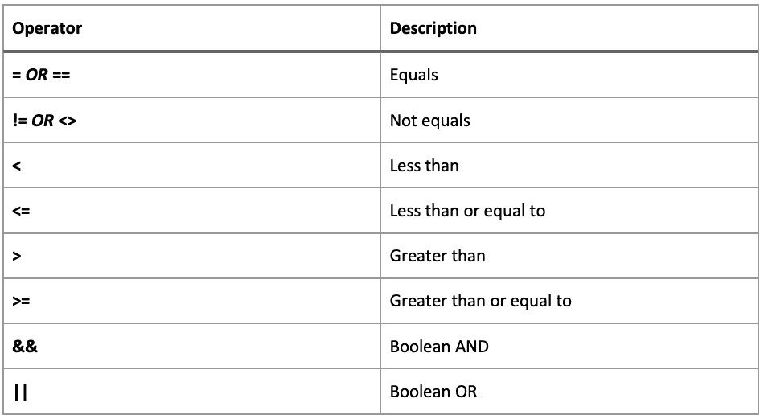

# *第三章*：使用智能值增强规则

我们在*第一章*中探讨的可视化规则编辑器，*自动化的关键概念*，使得创建复杂的自动化规则变得非常简单，且无需了解 Jira API 或任何专业的脚本知识即可开始。

虽然这种方法适用于大多数使用案例，但总有一些情况下，您需要直接访问问题数据并对这些数据执行更复杂的操作。这时，智能值就能派上用场。

本章将介绍智能值。您将学习如何查找智能值，智能函数如何工作，以及如何将您自己的智能值引入自动化规则。您还将概览如何操作日期、数据列表、文本值，以及如何使用数学表达式进行数字计算。

本章将涵盖以下主题：

+   理解智能值

+   使用智能值日期函数

+   使用智能值文本函数

+   使用智能值列表函数

+   使用智能值数学表达式和函数

到本章结束时，您将学会如何使用智能值和函数来操作日期、文本字符串和列表，以及如何使用数学表达式和函数进行涉及数值的计算。

# 技术要求

本章的要求如下：

+   **Jira 云环境**：如果您还没有 Jira 的访问权限，您可以在[`www.atlassian.com/software/jira/free`](https://www.atlassian.com/software/jira/free)创建一个免费的 Jira 云账户，并确保同时选择 Jira 软件和 Jira 服务管理。

+   **Jira 服务器环境**：如果您使用的是 Jira 服务器（可以从[`www.atlassian.com/software/jira/download`](https://www.atlassian.com/software/jira/download)下载），请确保您已获得 Jira 软件和 Jira 服务管理的许可证。此外，您还需要确保安装了*Jira 自动化*应用，可以从 Atlassian Marketplace 获取。

在这两种情况下，您需要至少拥有项目管理员访问权限，才能访问服务管理项目和 Scrum 软件项目，以便跟随本章的示例。在本章的示例中，我们使用了*IT 服务管理项目模板*来创建服务管理项目，并使用*Scrum 软件项目模板*来创建软件项目。

您可以从本书的官方 GitHub 仓库下载本章的最新代码示例，网址为[`github.com/PacktPublishing/Automate-Everyday-Tasks-in-Jira`](https://github.com/PacktPublishing/Automate-Everyday-Tasks-in-Jira)。本章的《实战代码》视频可以在[`bit.ly/39Hk44d`](https://bit.ly/39Hk44d)观看。

# 理解智能值

智能值允许你在自动化规则的上下文中访问和操作几乎所有问题数据。除了让你访问问题数据外，智能值还通过函数提供高级功能，使你能够对问题数据执行复杂操作。

在本节中，我们将探讨哪些智能值对你可用，并了解如何在规则中识别和使用它们。我们还将介绍智能值函数，并解释如何创建你自己的智能值以供在规则中使用。

让我们首先来看一下可以在哪里找到智能值以及如何使用它们。

## 查找和使用智能值

智能值通常由触发器在规则执行的上下文中设置。除此之外，某些操作（例如**发送 web 请求**操作）也可以将智能值引入规则上下文。

这些触发器所提供的每个智能值都是包含字段的数据结构。这些字段可以是简单的字段类型，例如文本或数字，或者是更复杂的数据结构，后者又包含其他字段。

例如，触发器可以是`{{issue}}`，用于当前 Jira 问题的规则上下文。此智能值是一个数据结构，表示 Jira 中的一个问题，并包含简单和复杂字段。

简单字段的示例包括`{{issue.summary}}`和`{{issue.key}}`，它们分别允许你访问问题的摘要和关键字。一个复杂字段的示例是`{{issue.assignee}}`，它本身是一个数据对象，包含进一步的字段，允许你访问被分配者的显示名称、电子邮件地址和账户 ID 字段，例如 `{{issue.assignee.displayName}}`、`{{issue.assignee.emailAddress}}`、`{{issue.assignee.accountId}}` 和 `{{issue.assignee.key}}`。

提示

要在智能值中访问自定义字段，你可以使用自定义字段的名称或其 ID。例如，如果你有一个名为`My Custom Field`的自定义字段，ID 为`10000`，你可以通过`{{issue.My Custom Field}}`、`{{issue.my custom field}}` 或 `{{issue.customfield_10000}}`来访问它。你可以通过编辑自定义字段并从**自定义字段**管理部分复制结果 URL 中的 ID 来找到自定义字段的 ID。然而，如果出于某种原因，你有多个名称相同的自定义字段，才应该使用这种方法。

在下表中，我们可以看到每个自动化触发器所提供的智能值，你可以在随后的规则组件中使用这些值：


图 3.1 - 根据触发器提供的智能值

上表展示了每个触发器的主要智能值，对于大多数情况，您可以在 [`support.atlassian.com/jira-software-cloud/docs/smart-values-general`](https://support.atlassian.com/jira-software-cloud/docs/smart-values-general) 找到适用于 Jira Cloud 的每个智能值的字段列表，或者在 [`confluence.atlassian.com/display/AUTOMATION/Smart+values`](https://confluence.atlassian.com/display/AUTOMATION/Smart+values) 中找到适用于 Jira Server 和 Jira Data Center 的字段列表。

智能值基于 Mustache 模板系统（https://mustache.github.io）。要使用智能值（或 Mustache 中称为标签），您需要将键包围在双大括号中（或称作大胡子符号）。使用这种格式意味着规则引擎需要将给定的值视为智能值，而不仅仅是静态文本。

要访问智能值对象中的字段，可以使用点符号。例如，要访问问题的指派人的显示名称，可以使用如下的点符号：`{{issue.assignee.displayName}}`。

提示

当您引用某个字段或值，该字段在特定问题中不存在时，智能值将为空。您可以通过使用管道符号（|）指定智能值的默认值。例如，智能值 `{{issue.description|没有提供描述}}` 如果 **描述** 字段为空，将返回文本 **没有提供描述**。

智能值可以在 **高级比较条件**、**JQL 条件** 和 **用户条件** 中使用，也可以在大多数规则动作中使用。

让我们来看一个使用智能值的示例规则。

### 创建规则，在问题首次被指派时添加评论

在这个示例规则中，我们将在问题首次指派时添加评论，通知报告者我们正在处理他们的请求：

1.  在您的服务管理项目中，导航到 **项目设置**，点击 **自动化** 标签，然后点击 **创建规则**。

1.  选择 **问题已指派**，然后点击 **保存**。

1.  然后选择 `{{changelog.assignee.fromString}}`

    `equals`

    **第二个值**：留空

1.  现在，选择 `Hi {{issue.reporter.displayName}}`

    `我们现在正在查看您的问题 {{issue.summary}}。`

    `我们会尽快为您提供更新。`

    `{{issue.assignee.displayName}}。`

    规则应该如下所示：

    

    图 3.2 - 在规则中使用智能值

1.  最后，命名规则为 `在问题指派时给报告者评论`，然后点击 **启用** 来保存并启用该规则。

在本节中，我们了解了如何在规则中使用智能值使其更加灵活，在下一节中，我们将介绍智能值函数。

## 智能值函数

除了使用智能值访问数据字段的功能外，您还可以通过添加函数来操作这些数据值。

函数通常通过点符号附加到智能值的末尾。例如，若要将问题摘要截断为前 50 个字符并在截断后的摘要末尾添加省略号，我们将使用以下智能函数：`{{issue.summary.abbreviate(50)}}`。

重要提示

智能值函数只能应用于相应类型的字段。例如，日期和时间函数只能应用于*创建时间*、*更新时间*、*截止日期*、*解决日期*以及任何具有*日期选择器*或*日期时间选择器*类型的自定义字段。

智能函数也可以串联在一起，使我们能够在单个步骤中执行多个转换。例如，以下智能函数链将把摘要转换为小写字母，提取第五到第十个字符，并在末尾附加一个感叹号：`{{issue.summary.toLowerCase().substring(5,10).concat("!")}}`。

让我们看一个在规则中使用智能值函数的示例。

### 创建一个规则，要求添加截图评论

在本例中，我们将创建一个手动触发的规则，用户可以调用此规则来在问题上创建定制的评论，请求报告人上传附件以帮助进一步诊断问题：

1.  在您的服务管理项目中，导航到**项目设置**，点击**自动化**标签，然后点击**创建规则**。

1.  选择**手动触发**并点击**保存**。

1.  接下来，选择`Hi {{issue.reporter.displayName.split(" ").first}}`

    `我们需要更多的信息以便进一步诊断您的问题。`

    `请在{{now.plusBusinessDays(2).fullDate}}之前截图并附加到此问题。`

    `谢谢 :)`

    `{{issue.assignee.displayName}}`

    该规则应该与以下截图类似：

    

    ](img/Figure_3.3_B16551.jpg)

    图 3.3 - 使用智能值函数

1.  最后，将规则命名为`要求报告人附加截图`，然后点击**开启**以保存并启用该规则。

    重要提示

    在 Jira Cloud 中，可以使用*创建变量*操作，根据其他智能值函数和表达式创建自定义智能值，然后在后续的条件和操作中使用它。

在本节中，我们了解了什么是智能值，以及如何在自动化规则中使用它们访问数据。我们还学习了如何为触发器找到正确的智能值，并如何找到相关的智能值字段。我们还了解了智能值函数，并看到了如何将它们连接在一起，在单个步骤中应用多个转换。

在下一部分，我们将学习如何在自动化规则中使用智能值来操作和格式化日期。

# 使用智能值日期函数

作为项目管理和跟踪工具，在 Jira 中能够操作日期对于应用程序的正常运行至关重要，而自动化规则中的智能值为我们提供了在规则中使用和操作日期和时间的灵活性。

在本节中，我们将探讨如何使用智能值格式化日期和时间，以便将其包含在其他日期和时间字段中，以及如何将其格式化以便在文本字段、高级字段编辑器或通知中使用。

我们还将探索所有可用的日期格式和函数，并了解如何在自动化规则中使用它们。

提示

你可以使用智能值*{{now}}*访问当前的日期和时间。所有可以与日期字段一起使用的格式化和日期操作函数，也可以与*{{now}}*智能值一起使用。

让我们来看一下如何使用智能值函数来格式化日期。

## 格式化日期

格式化日期和时间的能力使我们可以灵活地展示这些信息，无论是在评论、文本字段还是通知中。它还使我们能够在与需要特定格式日期和时间输入的外部系统进行通信时，指定确切的格式，以及重新格式化从外部系统接收到的日期和时间。

最后，能够控制日期和时间的格式使我们可以使用智能值函数对它们进行操作，并确保可以使用正确的计算结果设置日期或时间字段。

在下表中，我们可以看到如何使用每种可用的日期和时间格式来格式化日期 *2019 年 12 月 31 日 星期二 10:25:30 PM CET*，这些格式可用于自动化规则：


图 3.4 - 可用的日期格式

从前面的列表中可以看到，日期和时间可以通过多种方式格式化显示，如果没有合适的标准格式，也可以使用自定义模式。

提示

用于自定义格式化器`format("pattern")`和`as("pattern")`的模式语法由底层 Java 平台定义，完整的语法描述可以在以下链接中找到：[`docs.oracle.com/en/java/javase/11/docs/api/java.base/java/time/format/DateTimeFormatter.html`](https://docs.oracle.com/en/java/javase/11/docs/api/java.base/java/time/format/DateTimeFormatter.html)，请参阅标题 *格式化和解析模式*。

### 使用地区和时区格式化日期

除了我们刚才查看的格式之外，使用智能值还可以根据特定的地区和时区，甚至是特定用户的地区或时区（例如问题的受让人或报告人）来格式化日期和时间。

提供了以下格式化函数，用于实现基于地区和时区的日期和时间格式化：

+   `{{issue.created.withLocale("fr_CA")}}` 用于使用加拿大法语格式化问题创建日期，或者 `{{issue.created.withLocale(issue.reporter.locale)}}` 用于根据报告者的语言环境格式化问题创建日期。

+   `{{issue.created.convertToTimeZone("America/New_York")}}` 用于将问题创建日期格式化为纽约当前时区，或者 `{{issue.created.convertToTimeZone(issue.reporter.timeZone)}}` 用于将问题创建日期格式化为报告者的时区。

+   **setTimeZone(string timezone)**：将**日期时间**字段的时区组件设置为给定的时区。此函数将更改时区而不转换时间。

支持的完整语言环境列表可以在 [`www.oracle.com/java/technologies/javase/jdk11-suported-locales.html#modules`](https://www.oracle.com/java/technologies/javase/jdk11-suported-locales.html#modules) 找到。时区列表由 tz 数据库定义，完整列表可以在 [`en.wikipedia.org/wiki/List_of_tz_database_time_zones`](https://en.wikipedia.org/wiki/List_of_tz_database_time_zones) 找到。

让我们看看如何在示例规则中使用日期格式。

### 创建规则以创建入职子任务

在此规则中，当创建一个新的员工入职请求时，我们需要确保在新员工开始工作之前完成一些任务，例如提供笔记本电脑和桌面电话。

我们希望子任务摘要中包含开始日期，这样被分配到该请求的用户就能立刻看到任务的到期时间：

1.  在你的服务管理项目中，导航到**项目设置**，点击**自动化**标签页，然后点击**创建规则**。

1.  选择**问题创建**触发器并点击**保存**。

1.  然后选择 `请求类型`

    `等于`

    `新员工入职`

1.  接下来，选择 `在{{issue.duedate.longDate}}之前提供新的笔记本电脑`

    `在{{issue.duedate.longDate}}之前设置新的桌面电话`

    规则应该类似于以下截图：

    

    ](img/Figure_3.5_B16551.jpg)

    图 3.5 - 使用智能值日期格式

1.  最后，点击`创建入职子任务`，然后点击**启用**以保存并启用规则。

现在我们已经看到如何格式化日期和时间，让我们来看看如何使用智能值函数对其进行操作。

## 操作日期

除了提供格式化日期的功能外，还提供了许多智能值函数，使我们能够对日期进行操作。这些操作允许我们对日期和时间进行比较，进行基本的算术运算，并操作日期和时间的各个组成部分。

让我们来看看在规则中可以使用的日期操作函数。第一组函数涉及日期比较，允许你将一个日期与另一个日期进行比较：

+   `function` 参数。此函数将返回 `date` 参数，否则返回**false**。

+   `function` 参数。此函数将返回 `date` 参数，否则返回**false**。

+   `function` 参数。此函数将返回 `date` 参数，否则返回**false**。

+   `-1`) 当用于调用函数的日期字段早于参数中的日期时，`0` 如果它们相等，或者当日期字段晚于参数中的日期字段时返回正整数（如`1`）。

下一组函数允许我们以各种方式操作日期和时间：

+   `diffDate(date).seconds` 将显示日期之间的差异（以秒为单位）。默认输出为*prettyPrint*，以文字形式显示差异，例如，*2 天 3 小时*。

+   **plusDays(int days)**/**minusDays(int days)**: 向相应的日期组件添加或减去给定的天数，并返回应用了相关计算的新日期。

+   **plusHours(int hours)**/**minusHours(int hours)**: 向相应的日期组件添加或减去给定的小时数，并返回应用了相关计算的新日期。

+   **plusWeeks(int weeks)**/**minusWeeks(int weeks)**: 向相应的日期组件添加或减去给定的周数，并返回应用了相关计算的新日期。

+   **plusMillis(int millis)**/**minusMillis(int millis)**: 向相应的日期组件添加或减去给定的毫秒数，并返回应用了相关计算的新日期。

+   **plusMinutes(int minutes)**/**minusMinutes(int minutes)**: 向相应的日期组件添加或减去给定的分钟数，并返回应用了相关计算的新日期。

+   **plusMonths(int months)**/**minusMonths(int months)**: 向相应的日期组件添加或减去给定的月数，并返回应用了相关计算的新日期。

+   **plusSeconds(int seconds)**/**minusSeconds(int seconds)**: 向相应的日期组件添加或减去给定的秒数，并返回应用了相关计算的新日期。

+   **plusYears(int years)**/**minusYears(int years)**: 向相应的日期组件添加或减去给定的年份数，并返回应用了相关计算的新日期。

+   **plusBusinessDays(int days)**/**minusBusinessDays(int days)**: 向相应的日期组件添加或减去给定的工作日数，并返回应用了相关计算的新日期。工作日定义为从周一到周五，上午 9 点到下午 6 点。

+   **toBusinessDay**/**toBusinessDayBackwards**: 分别返回调用函数时的日期之前或之后的第一个工作日。

+   **toStartOfDay**/**toDateTimeAtStartOfDay**: 使用服务器的默认时区将给定日期的时间组件设置为零（即午夜）。第一个函数用于**DateTime**字段，而第二个函数会将**Date**字段转换为**DateTime**字段，并相应地设置时间组件。

+   **toCurrentTime**/**toDateTimeAtCurrentTime**：将给定日期的时间组件设置为当前时间。第一个函数用于**日期时间**字段，而第二个函数将**日期**字段转换为**日期时间**字段，并相应地设置时间组件。

+   `MON`*,* `TUE`，`WED`，`THU`，`FRI`，`SAT`，或`SUN`作为`dayOfWeek`参数的值。

+   `dayOfMonth`。`dayOfMonth`参数的有效范围是`1`到`31`。

+   `0` 到 `23`。

+   `0` 到 `999`。

+   `0` 到 `59`。

+   `1` 到 `12`。

+   `0` 到 `59`。

+   **withYear(int year)**：将**日期**或**日期时间**字段的年份组件设置为提供的年份。年份参数的有效范围是公历中的任何有效年份。

+   `dayOfYear`。`dayOfYear`参数的有效范围是`1`到`365`。

+   **startOfMonth**/**endOfMonth**：将**日期**或**日期时间**字段的日期组件设置为该字段所在月的第一个或最后一个日历日。

+   **firstBusinessDayOfMonth**/**lastBusinessDayOfMonth**：将**日期**或**日期时间**字段的日期组件设置为该字段所在月的第一个或最后一个工作日。

+   `1` 到 `7`，1 代表星期一，`7`代表星期天。例如，调用`{{datefield.firstOfTheMonth(3)}}`将日期设置为本月的第一个星期三。

+   `weekOfMonth`参数的范围是`1`到`5`，`dayOfWeek`参数的范围是`1`到`7`，1 代表星期一，`7`代表星期天。例如，要将日期设置为本月的第三个星期一，可以使用`{{datefield.ofTheMonth(3, 1)}}`。

现在我们已经查看了用于操作日期和时间的各种函数，让我们看几个示例，了解如何在规则中使用它们。

### 创建一个基于子任务更新到期日期的规则

在此示例中，我们为每个用户故事设置了多个子任务，并希望在最后一个子任务过渡到**进行中**时，将用户故事的到期日期更新为当前日期后的 5 个工作日：

1.  在你的软件项目中，导航到**项目设置**，点击**自动化**标签（如果你使用的是 Jira Server，则为**项目自动化**标签），然后点击**创建规则**。

1.  选择**问题过渡**触发器，并将**到状态**字段设置为**进行中**，然后点击**保存**。

1.  然后选择`问题类型`

    `equals`

    `子任务`

1.  接下来，选择**分支规则/相关问题**，将**相关问题类型**设置为**父项**，然后点击**保存**。

1.  现在选择`子任务`

    `完全匹配指定的 JQL`

    `status = "进行中"`

1.  在**到期日期**字段中选择`{{now.plusBusinessDays(5)}}`并点击**保存**。

    现在你的规则应该类似于以下截图：

    

    Figure 3.6 - Adding business days to the current date

1.  最后，给你的规则命名为`设置用户故事到期日期`，然后点击**启用**以保存并启用该规则。

现在，让我们来看另一个使用智能值函数操作日期的示例。

### 创建设置截止日期的规则

对于这个示例，我们希望如果问题在本月 15 日之前创建，则将截止日期设置为本月 15 日；如果问题在本月 15 日之后创建，则将截止日期设置为下个月 15 日：

1.  在您的软件项目中，导航至**项目设置**，点击**自动化**标签（如果您使用的是 Jira Server，则是**项目自动化**标签），然后点击**创建规则**。

1.  选择**问题创建**，然后点击**保存**。

1.  接下来，选择**新条件**，然后选择**如果/否则区块**，并为“如果”区块添加**高级比较条件**。

1.  设置`{{issue.created}}`字段

    `greater than`

    `{{now.startOfMonth.plusDays(15)}}`

1.  现在选择`{{now.endOfMonth.plusDays(15)}}`并点击**保存**。

    你的规则现在应该如下所示：

    

    图 3.7 - 将日期设置为下个月的中旬

1.  现在我们已经处理了下个月的截止日期，让我们完成本月截止日期的规则。在规则链视图中点击**添加其他条件**，然后点击**保存**。

1.  接下来，添加`{{now.withDayOfMonth(15)}}`并点击**保存**。

    你的规则应该类似于以下截图：

    

    图 3.8 - 将日期设置为当前月的中旬

1.  最后，命名规则为`将截止日期设置为本月中旬`，并点击**启用**以保存并启用此规则。

在本节中，我们已经了解了各种智能值日期和时间函数，并学习了如何使用它们在自动化规则中操作日期。接下来，我们将看看如何使用智能值处理文本。

# 使用智能值文本函数

类似于操作日期和时间，处理文本字符串的智能值函数允许我们操作任何文本字段类型，包括字段的子属性（如果它们也是文本类型字段）。

在本节中，我们将介绍如何使用文本的智能值函数来操作文本，如何对其进行编码以便在 HTML、JSON、XML 或 URL 中使用，以及如何使用函数测试文本块中的特定特征。

让我们看看在自动化规则中操作文本的可用函数。我们首先要查看的一组函数处理文本比较，并根据检查是否通过返回**true**或**false**：

+   **startsWith(string)**/**endsWith(string)**：分别检查文本字段是否以给定字符串开头或结尾

+   **equals(string)**/**equalsIgnoreCase(string)**：分别检查文本字段是否完全等于给定字符串，或者忽略大小写地等于给定字符串

+   **isAlpha**：检查文本字段是否仅包含字母

+   **isNumeric**: 检查文本字段是否仅包含数字。

+   **isAlphaNumeric**: 检查文本字段是否仅包含字母和数字。

+   **isEmpty**: 检查文本字段中是否没有数据。

+   **isNotEmpty**: 检查文本字段中是否有数据。

下一组函数允许我们将文本转换为其他类型，如数字、日期或列表：

+   **asNumber**: 将文本字段转换为数字，允许你对转换后的值进行数值操作和计算。

    提示

    在转换之前，请对文本字段使用 *isNumeric* 测试，确保不会因为尝试转换无法表示为数字的文本而导致错误。

+   **toDate**/**toDate(string pattern)**: 将文本字段转换为日期。使用该函数的第二种形式来指定文本表示中的日期格式。请参阅*格式化日期*部分，了解如何定义模式的示例。

+   **split(string separator)**: 按照分隔符将文本字段拆分成一个项列表。结果列表中的项可以通过智能值列表函数进一步操作。

+   **match(string regularExpression)**: 在文本字段上执行正则表达式搜索。正则表达式的多个匹配项将作为项列表返回，可以通过智能值列表函数进一步操作。

    提示

    *正则表达式* 是描述搜索模式的特殊文本字符串。这些模式通常用于执行文本字符串的查找或查找替换操作，或者验证输入。在 Jira 自动化中，正则表达式基于底层的 Java 实现，可以参考[`docs.oracle.com/javase/8/docs/api/java/util/regex/Pattern.html`](https://docs.oracle.com/javase/8/docs/api/java/util/regex/Pattern.html)。

以下一组函数允许我们更改文本的显示方式、提取文本片段，甚至替换文本块：

+   **abbreviate(int maxLength)**: 将文本字段缩短到指定的最大长度，并在文本末尾添加省略号（"…"）。

+   **toLowerCase**: 将文本字段转换为全小写。

+   **toUpperCase**: 将文本字段转换为全大写。

+   **capitalize**: 将文本字段的第一个字符转换为大写。

+   **reverse**: 将文本字段中的所有字符反转。

+   **trim**: 移除文本字段中所有前导和尾随的空白字符。

+   **concat(string)**: 将给定字符串附加到文本字段的末尾。

+   `0`。

+   **indexOf(string) / lastIndexOf(string)**: 查找给定字符串在文本字段中的第一次或最后一次出现的位置。

+   **length**: 返回文本字段的总字符数。

+   **quote**：将文本字段格式化为字面表达式，之后可以在匹配函数的正则表达式中使用。例如，如果文本字段包含正则表达式特殊字符，如*或\，这些字符将被当作普通字符（或字面字符）处理，而不是作为正则表达式。

+   **remove(string)**：从文本字段中移除给定字符串的所有出现。

+   **replace(string target, string replacement)**：将文本字段中的目标字符串替换为替换字符串的值。

+   `regex`与替换字符串。

+   **left(int length)**/**right(int length)**：分别返回文本字段左侧或右侧指定数量的字符。

+   **leftPad(int length, string)**/**rightPad(int length, string)**：将给定字符串添加到文本字段的左侧或右侧，直到文本达到指定的总长度。

+   **substring(int start)**：返回从起始索引开始的文本字段部分。

+   **substring(int start, int end)**：返回从起始索引到结束索引之间的文本字段部分。

+   **substringAfter(string)**/**substringAfterLast(string)**：返回文本字段中首次或最后一次出现提供的字符串后的部分。

+   **substringBefore(string)**/**substringBeforeLast(string)**：返回文本字段中首次或最后一次出现提供的字符串之前的部分。

+   **substringBetween(string open, string close)**：返回给定起始字符串和结束字符串之间的文本字段部分。

最后一组函数使我们能够对文本进行编码，以符合特定标准。当与外部系统集成或从规则发送电子邮件通知时，这尤其有用：

+   **htmlEncode**：使用此函数确保在将字段包含在 HTML 输出中时，文本字段的值被正确编码。

+   **jsonEncode**：使用此函数确保在将字段包含在 JSON 输出中时，文本字段的值被正确编码。

+   **urlEncode**：使用此函数确保在使用字段创建 URL 链接时，文本字段的值被正确编码。

+   **xmlEncode**：使用此函数确保在将字段包含在 XML 输出中时，文本字段的值被正确编码。

现在我们已经查看了可用于操作文本的各种函数，接下来让我们看看如何在自动化规则中利用这些函数。

## 创建一个规则以自动关闭问题

许多团队常面临的一个常见场景是，在工单解决后，报告人回复说感谢。这通常会导致工单重新打开，并且有人必须手动再次解决工单。

在这个示例中，我们将使用文本智能值函数检查最新的评论，如果发现“thank you”字样，则自动解决该问题：

1.  在您的服务管理项目中，导航到**项目设置**，点击**自动化**选项卡，然后点击**创建规则**。

1.  选择**问题已转移**触发器，将**来源状态**字段设置为**已解决**，将**目标状态**字段设置为**进行中**，然后点击**保存**。

1.  现在选择`{{issue.comments.last.body.trim.toLowercase}}`

    `contains regular expression`

    `thank\s+you`

    规则现在应如下所示：

    

    图 3.9 - 在条件中使用文本智能值函数

1.  接下来，选择**新建操作**，然后选择**转移问题**。将**转移问题至**设置为**选择目标状态**，并在**目标状态**字段中选择**已解决**，然后点击**保存**。

1.  将规则命名为`自动处理感谢评论`，然后点击**启用**以保存并启用该规则。

在本节中，我们已经了解了如何使用智能值函数比较和操作文本值。在下一节中，我们将看看如何使用智能值和函数来处理项的列表。

# 使用智能值列表函数

在编写自动化规则时，您会遇到一些场景，这些场景会向您展示一个项的列表。这可能是与问题关联的版本或组件的列表，或者是问题的列表，比如某个问题的所有子任务。

用于列表的智能值函数使我们能够通过对每个项目进行迭代来操作这些项，并能针对项目的属性执行额外的操作。我们还可以使用某些函数，对列表中所有项目进行简单的计算。

在本节中，我们将查看可用于访问和格式化项列表的智能值函数。

在*第四章*《发送自动化通知》中，我们将通过使用智能值来迭代列表，举例说明如何通过电子邮件和 Slack 发送通知。

现在，让我们来看看可以用于操作列表的智能值函数：

+   **isEmpty**：检查列表是否包含任何项。如果列表为空，该函数返回**true**；如果列表中包含项，则返回**false**。

+   **size**：返回列表中项目的数量。

+   **join(string separator)**：将列表中的所有项合并成一个单一的文本值，项与项之间用提供的分隔符分开。

+   列表的两端是`0`（零）。

+   **first**：获取列表中的第一项。

+   **last**：获取列表中的最后一项。

+   **average**：计算数值列表中所有项目的平均值。

+   **max**：在数值列表中找到最大的项，或者在日期列表中找到最晚的日期。

+   **min**：在数值列表中找到最小的项，或者在日期列表中找到最早的日期。

+   **sum**：计算数值列表中所有项的总和。

让我们来看看如何将我们所学到的列表知识应用到实际示例中，利用智能值列表函数计算子任务中的故事点总和。

## 创建规则，将子任务的故事点汇总到父任务中

在此示例中，我们正在跟踪子任务的故事点，并希望确保每当其子任务中的故事点发生变化时，父任务始终反映正确的故事点总数。你需要启用**故事点**自定义字段的配置上下文，以便除了**史诗**和**故事**外，还能包含**子任务**：

1.  在你的软件项目中，导航至**项目设置**，点击**自动化**选项卡（如果你使用的是 Jira Server，请点击**项目自动化**选项卡），然后点击**创建规则**。

1.  选择**字段值已更改**，将**监视字段变化**设置为**故事点**，然后点击**保存**。

1.  现在选择`问题类型`

    `等于`

    `子任务`

1.  然后选择`父任务`，点击**保存**。

1.  接下来，选择**新建操作**，然后选择**编辑问题**。

1.  在`{{issue.subtasks.Story Points.sum}}`

    你的规则现在应该如下所示，参考以下截图：

    

    图 3.10 - 使用智能值列表函数求和列表项值

1.  最后，为规则命名为`保持父任务与子任务故事点同步`，然后点击**启用**以保存并启用该规则。

在本节中，我们学到了如何使用智能值列表函数遍历列表中的项，并对列表中的值执行操作。

接下来我们将查看自动化规则中可用的数学运算。

# 使用智能值数学表达式和函数

到目前为止，我们已经看到如何使用智能值来处理日期、文本和列表，以及它们如何帮助你创建强大且灵活的自动化规则。

在本节中，我们将研究数学表达式和函数。数学表达式和函数将允许你在数字字段中直接执行计算，并允许你在文本字段中引用数字字段进行计算以显示。在 Jira 中，所有数字字段都是基于浮点数的。

若要使用任何数学表达式，它们需要被包含在以下智能值块中，以便被识别，如下所示：

`{{#=}} <数学表达式> {{/}}`

`{{#=}}` 运算符通知自动化引擎，你即将进行计算，这是对底层 Mustache 库的自定义扩展。

重要说明

Jira Cloud 提供了额外的数字处理功能，包括使用地区设置或自定义模式来格式化数字的功能。

让我们首先看看 Jira Cloud 和 Jira Server 之间共有的数学表达式。

数学表达式支持您期望看到的常见运算，如下表所示：


图 3.11 - 基本数学表达式运算符

除了基本运算外，数学表达式还支持布尔运算符，支持的运算符可以在下表中查看：



图 3.12 - 布尔数学表达式运算符

数学表达式还支持多种可用的函数，我们可以在下表中查看支持的完整函数列表：


图 3.13 - 支持的数学函数

这里还有一些常量值可以用于数学表达式，它们列在这里：


图 3.14 - 支持的常量值

除了前述的常见函数和操作外，Jira Cloud 还引入了一些额外的数字运算。这些运算不需要像我们之前学习的智能值块那样被包围，而是可以直接应用于数字智能值或字段。

让我们来看看这些额外的数字运算：

+   **abs**：返回数字的绝对值

+   **round**：返回四舍五入到最接近的整数的数字

+   **floor**/**ceil**：分别返回数字的下限值或上限值

+   **plus(value)**/**minus(value)**：将参数中的数字或智能值加到或减去调用该操作的数值或字段

+   **multiply(value)**/**divide(value)**：将参数中的数字或智能值与调用该操作的数值或字段相乘或相除

+   **gt(value)**/**gte(value)**：检查数值智能值是否大于或大于等于参数中给定的值

+   **eq(value)**：检查数值智能值是否等于参数中给定的值

+   **lt(value)**/**lte(value)**：检查数值智能值是否小于或小于等于参数中给定的值

Jira Cloud 还增加了使用智能值函数格式化数值的能力，以下是这些函数：

+   **format**：使用美国地区的数字格式化数字字段。

+   `fr_CA`。

+   **format(string pattern)**：使用自定义模式格式化数字字段。您可以使用的模式依赖于底层的 Java 实现，可以在以下链接找到： https://docs.oracle.com/javase/tutorial/java/data/numberformat.html。

+   **asPercentage**/**asPercentage(string locale)**：将数字字段格式化为美国地区的百分比，或按指定地区的百分比格式化。

+   **asCurrency**/**asCurrency(string locale)**：将数值字段格式化为美国地区的货币格式，或者根据指定的地区格式化为相应的货币格式。

如我们所见，我们可以使用大量的智能值函数来执行自动化规则中的高级数学运算。现在，让我们通过一个例子来看看如何使用数学表达式。

## 创建一个规则，以保持史诗的原始预估与其子问题同步

在这个例子中，每当史诗下的相关问题的时间跟踪字段发生变化时，我们将更新史诗的原始预估。

1.  在您的软件项目中，导航至**项目设置**，点击**自动化**标签（如果使用的是 Jira Server，则点击**项目自动化**标签），然后点击**创建规则**。

1.  选择**字段值更改**触发器，在**监控变化的字段**列表中选择**时间跟踪**，然后点击**保存**。

1.  接下来，选择`Epic`

    `Exists`

1.  现在选择`Epic (parent)`并点击**保存**。

1.  然后，选择`原始预估（系统）`。

    将以下数学表达式添加到**原始预估（系统）**字段中，并点击**保存**：

    ```
    {{#=}}{{fieldChange.to}}/60 – {{fieldChange.from}}/60 + {{issue.original estimate}}/60{{/}}
    ```

    规则现在应该类似于以下截图：

    

    图 3.15 - 在规则中使用数学表达式

1.  最后，命名该规则为`保持史诗预估同步`，并点击**启用**以保存并启用该规则。

在本节中，我们看到了可以在自动化规则中使用的智能值数学函数的全面列表，并且学习了如何使用这些函数来操作数值。

# 总结

在本章中，您学习了如何通过使用智能值和智能值函数来增强自动化规则的功能。

我们学习了各种触发器设置的智能值，以及如何访问它们的属性或字段。此外，您还了解了智能值函数，以及如何在特定字段上单独使用它们，或者将它们链式组合以在单个步骤中对数据执行多个操作。

最后，我们了解了适用于日期、文本、列表和数值的各种智能值函数，以及如何使用这些函数格式化和操作数据，以创建极其强大且灵活的规则。

智能值及其相关函数几乎可以在自动化规则条件和动作中的每个字段中使用，接下来在本书的其余部分中，我们将学习它们如何帮助我们创建更强大、更丰富的规则。

在下一章中，我们将学习如何从自动化规则发送通知到不同的频道。
