# *第四章*：发送自动化通知

在合适的时间发送正确的通知，并附带相关的上下文信息，这是非常重要的。这样可以确保通知的接收者采取期望的行动。

Jira 一直有能力在问题发生变化时向用户发送电子邮件通知。然而，这些通知通常是非常通用的。它们不包含相关的上下文信息，而且定制起来非常困难。

自动化规则让我们能够克服一些限制，通过基于我们要求的任何规则条件发送自定义通知，而且不仅仅是通过电子邮件；我们还可以通过 SMS 向手机发送通知，并向 **Slack** 和 **Microsoft Teams** 等聊天应用发送通知。

本章将向你介绍自动化规则中的通知功能，并展示如何向用户、组或任何有效的电子邮件地址发送自定义电子邮件通知。我们还将学习如何向 Slack 渠道和 Microsoft Teams 渠道发送消息。最后，我们将学习如何使用 **Twilio** 通过 SMS 向移动设备发送文本消息。

在本章中，我们将涵盖以下主题：

+   使用自动化发送电子邮件通知

+   如何向 Slack 发送通知

+   如何向 Microsoft Teams 发送通知

+   使用 Twilio 发送 SMS 通知

# 技术要求

本章的要求如下：

+   **Jira Cloud 环境**：如果你还没有 Jira 账户，可以在[`www.atlassian.com/software/jira/free`](https://www.atlassian.com/software/jira/free)创建一个免费的 Jira Cloud 账户，并确保选择了 Jira Software 和 Jira Service Management；或者

+   **Jira Server 环境**：如果你使用的是 Jira Server（可从[`www.atlassian.com/software/jira/download`](https://www.atlassian.com/software/jira/download)下载），请确保你拥有 Jira Software 和 Jira Service Management 的许可证。此外，你还需要确保从 Atlassian Marketplace 安装了 *Automation for Jira* 应用。

在这两种情况下，你需要至少具有 Jira 项目的项目管理员访问权限。

你还需要访问以下任意工具：

+   **Slack**：如果你还没有访问 Slack 的权限，可以在[`www.slack.com`](https://www.slack.com)注册一个账户。

+   **Microsoft Teams**：如果你还没有 Teams 账户，可以在[`teams.microsoft.com`](https://teams.microsoft.com)注册一个。

+   **Twilio**：如果你需要账户，可以在[`www.twilio.com`](https://www.twilio.com)注册。

你可以从本书的官方 GitHub 仓库下载本章的最新代码示例，网址是[`github.com/PacktPublishing/Automate-Everyday-Tasks-in-Jira`](https://github.com/PacktPublishing/Automate-Everyday-Tasks-in-Jira)。

本章的《行动中的代码》视频可通过以下链接查看：[`bit.ly/2Y9p0cR`](https://bit.ly/2Y9p0cR)

# 使用自动化发送电子邮件通知

Jira 一直以来都有通过电子邮件向用户发送通知的能力，例如在问题更新或评论添加时。你还可以定期向不同用户发送包含已保存筛选器结果的电子邮件，并且在 Jira Service Management 中，你可以创建自定义模板，通过电子邮件向客户发送通知，取代标准的事件通知。

通过自动化规则中的**发送电子邮件**操作，我们能够扩展这一能力，在规则被激活时向任何电子邮件地址、用户字段或用户组发送自定义电子邮件通知。

在本节中，我们将探讨如何在自动化规则中引入自定义电子邮件通知，以及这些通知如何为用户提供更具体的上下文。

提示

创建自动化规则中的自定义电子邮件通知时，你应该始终小心。确保不要因为同一事件而向用户发送多次通知，避免造成垃圾邮件。

在我们查看如何在规则中使用电子邮件通知之前，让我们快速看一下**发送电子邮件**操作本身。

以下截图展示了**发送电子邮件**操作中的可用字段：

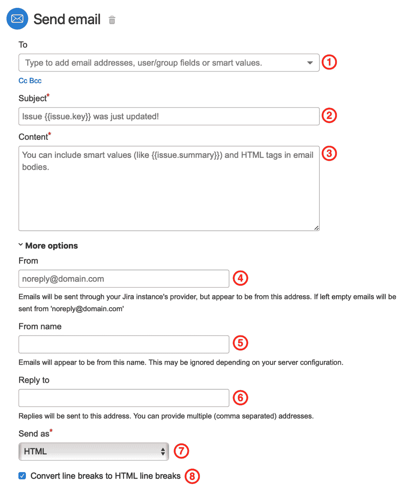

图 4.1 – 发送电子邮件操作

让我们快速看一下**发送电子邮件**操作中的每个可用字段：

1.  **收件人**字段是我们配置电子邮件收件人的地方。可以是一个或多个电子邮件地址，或者你可以使用下拉菜单选择一个或多个 Jira 用户或用户组。你还可以使用智能值和智能值函数从问题字段中提取电子邮件地址。

    你还可以通过点击**收件人**字段下方的相应链接，按照相同的方式设置**抄送**和**密送**字段，以显示相关的输入字段。

1.  **主题**字段是我们配置电子邮件通知主题的地方。你可以在此字段中使用智能值和智能值函数来引用任何问题字段的数据。

1.  **内容**字段是你提供电子邮件消息的地方。你可以使用 HTML 标签来格式化消息，还可以使用智能值和智能值函数来引用和操作触发自动化规则的任何数据。

1.  在**更多选项**展开部分，你会找到**发件人**字段。该字段仅适用于 Jira Server 和 Data Center，在 Jira Cloud 中不可编辑。

    如果你使用的是 Jira Server 或 Data Center，应该确保你在此处输入的电子邮件地址使用有效的发件人域名，因为许多 SMTP 服务器配置为仅接受来自有效域的外发邮件，以防止它们被用作垃圾邮件中继。

1.  **发件人名称** 字段是邮件通知中显示的可读发件人名称。在 Jira Cloud 中，默认值为 *Jira 自动化*，而在 Jira Server 和 Data Center 中，该字段不会出现。

1.  可选地，如果你希望用户能够回复邮件，并可能将回复作为对问题的评论，你可以使用 **回复至** 字段，输入你在 **接收邮件** 系统配置中为软件和核心项目配置的邮箱地址，或者对于服务管理项目，在项目的 **邮件请求** 设置中进行配置。

    如果你使用 **回复至** 功能，还应该确保问题键出现在 **主题** 行中。

1.  **发送方式** 字段允许你选择该通知是以纯文本还是 HTML 格式发送。如果邮件通知是发送到其他应用程序，建议将其设置为纯文本。

1.  在 **发送方式** 字段设置为 **HTML** 时，每当新的一行出现时，要在消息正文中保留 `<br>)`。虽然这很方便，但如果忘记考虑这一点，可能会破坏你的 HTML 格式。

    重要提示

    如果你使用的是 Jira Server 或 Jira Data Center，你（或 Jira 管理员）需要在 **Jira 管理** | **系统** | **外发邮件** 设置中配置一个外发 SMTP 邮件服务器。如果没有配置外发邮件服务器，带有邮件通知的规则仍然会成功执行，但实际上不会发送任何邮件。

让我们来看一个使用邮件通知的规则。

## 创建一个规则，用于在发布新版本时通知客户

在这个示例中，我们希望能够在发布新软件版本时通知客户，并列出在新发布的版本中修复或添加的项。

所有的客户都属于一个名为 *客户* 的用户组。这样我们就可以将任何新客户添加到该组中，而无需为每个新客户修改自动化规则。

由于 Jira Cloud 和 Jira Server 在处理多个问题时的自动化规则有所不同，我们将分别展示该规则，以突出这两个环境之间的差异。

### 使用 Jira Cloud 通知客户当新版本发布时

在 Jira Cloud 中，我们需要使用 **查找问题** 动作，这将允许我们在一次操作中迭代最多 100 个问题。

让我们看看如何使用 Jira Cloud 构建这个规则：

1.  在你的 Jira Software 项目中，导航到 **项目设置**，点击项目设置菜单中的 **自动化** 链接，然后点击 **创建规则**。

1.  选择 **版本发布** 触发器并点击 **保存**。

1.  接下来，选择 **新建动作**，然后选择 **查找问题** 动作。

    将以下查询添加到 **JQL** 字段并点击 **保存**：

    ```
    fixVersion = {{version.name}}
    ```

    如你所见，我们在这个 JQL 查询中使用了智能值来引用版本名称，因此我们无法验证查询。

1.  然后，选择`客户`

    `{{version.project.key}} 版本 {{version.name}} 已发布！`

    **内容**：

    ```
    We have just released Version <strong>{{version.name}}</strong> for {{version.project.key}}.<br/>This version includes the following fixes and features:
    <ul>
    {{#lookupIssues}}
      <li>
        <a href="{{url}}">{{issuetype.name}}: {{key}} - {{summary}}<a/>
      </li>
    {{/}}
    </ul>
    We hope you enjoy it!<br/><br/>
    Regards,<br/>
    The {{version.project.key}} development team
    ```

1.  接下来，展开**更多选项**设置，取消勾选**将换行符转换为 HTML 换行符**选项，因为我们在内容字段中已包含显式的 HTML 换行符，然后点击**保存**。

    你的规则应类似于以下屏幕截图：

    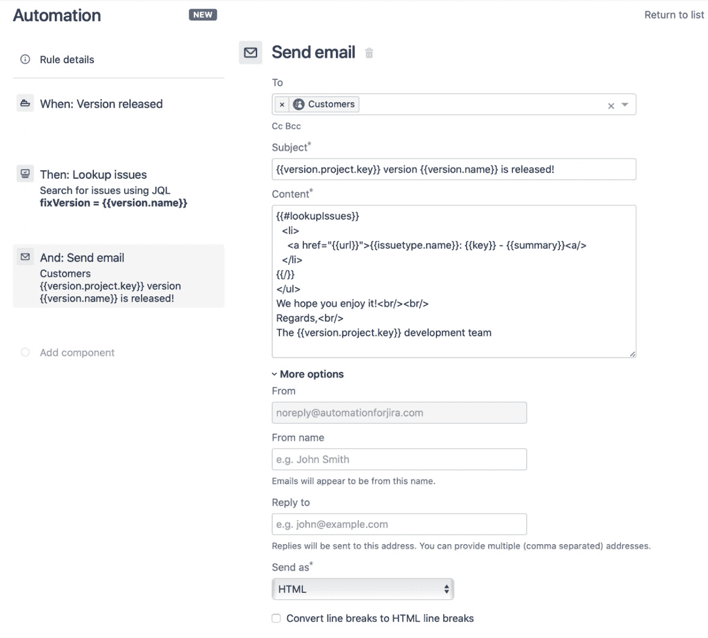

    图 4.2 – 在 Jira Cloud 中发送电子邮件通知

1.  最后，给你的规则命名为`版本发布客户通知`，并点击**启用**以保存并启用该规则。

现在我们已经学习了如何在 Jira Cloud 中使用**查找问题**操作发送电子邮件通知，接下来让我们看看如何调整此规则以便在 Jira Server 中使用。

### 使用 Jira Server 通知客户新版本发布时

Jira Server 中的自动化规则没有**查找问题**操作。相反，我们可以选择在某些触发器和分支规则中批量处理问题。

让我们看看如何在 Jira Server 中复制版本发布规则：

1.  在你的 Jira 软件项目中，导航到**项目设置**，点击项目设置菜单中的**项目自动化**链接，然后点击**创建规则**。

1.  选择**版本发布**触发器并点击**保存**。

1.  接下来，选择**分支规则/相关问题**，在**相关问题类型**字段中选择**版本中修复的问题**。

1.  展开**更多选项**设置，确保勾选**批量处理此触发器产生的所有问题**选项，然后点击**保存**。

1.  现在，选择`客户`

    `{{version.project.key}} 版本 {{version.name}} 已发布！`

    **内容**：

    ```
    We have just released Version <strong>{{version.name}}</strong> for {{version.project.key}}.<br/>This version includes the following fixes and features:
    <ul>
    {{#lookupIssues}}
      <li>
        <a href="{{url}}">{{issuetype.name}}: {{key}} - {{summary}}<a/>
      </li>
    {{/}}
    </ul>
    We hope you enjoy it!<br/><br/>
    Regards,<br/>
    The {{version.project.key}} development team
    ```

1.  接下来，展开**更多选项**设置，取消勾选**将换行符转换为 HTML 换行符**选项，因为我们在内容字段中已包含显式的 HTML 换行符，然后点击**保存**。

    你的规则应类似于以下屏幕截图：

    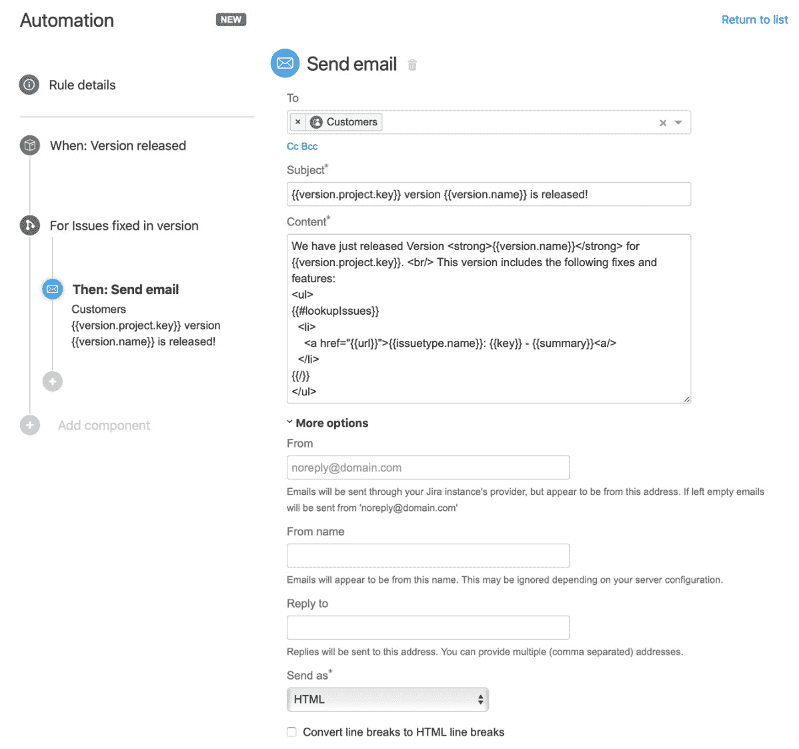

    图 4.3 – 在 Jira Server 中发送电子邮件通知

1.  最后，给你的规则命名为`版本发布客户通知`，并点击**启用**以保存并启用该规则。

在本节中，我们已经学习了如何使用**发送电子邮件**操作通过自动化规则向用户发送自定义通知。

在下一节中，我们将看看如何在我们的自动化规则中集成 Slack 通知。

# 如何向 Slack 发送通知

Slack 是一个流行的工作空间通信工具，允许用户在所谓的频道中或通过直接消息互相聊天。

我们可用于自动化规则的一个操作是**发送 Slack 消息**操作，它使我们能够向 Slack 频道或个人用户发送消息。

在本节中，我们将学习如何与 Slack 集成，从自动化规则中发送通知。

## 与 Slack 集成

在我们开始通过自动化规则发送 Slack 通知之前，我们首先需要在 Slack 中设置传入 Webhook，以便能够接收来自 Jira 的消息。

我们可以通过两种方式来实现这一点。第一种是通过在 Slack 中创建一个自定义应用并配置一个传入 Webhook，然后选择将接收通知的频道。

将 Slack 与自动化规则集成的第二种且最简单的方式是创建一个传统的传入 Webhook，它还允许覆盖配置的频道。

重要提示

如果您使用 Slack 自定义应用方法创建传入 Webhook，您需要为每个需要发送通知的频道创建一个 Webhook，因为此方法不允许覆盖您创建 Webhook 时选择的默认频道。更好的方法是使用*传统的 Webhook*，我们将在本节中介绍它。

让我们来看看如何使用传统的传入 Webhook 选项在 Slack 中建立一个传入 Webhook，然后在自动化规则中使用它将消息发布到 Slack 中的**#general**频道：

1.  在浏览器中导航至以下网址：[`my.slack.com/services/new/incoming-webhook/`](https://my.slack.com/services/new/incoming-webhook/)。

    在要求登录后，您应该看到一个与以下截图相似的屏幕：

    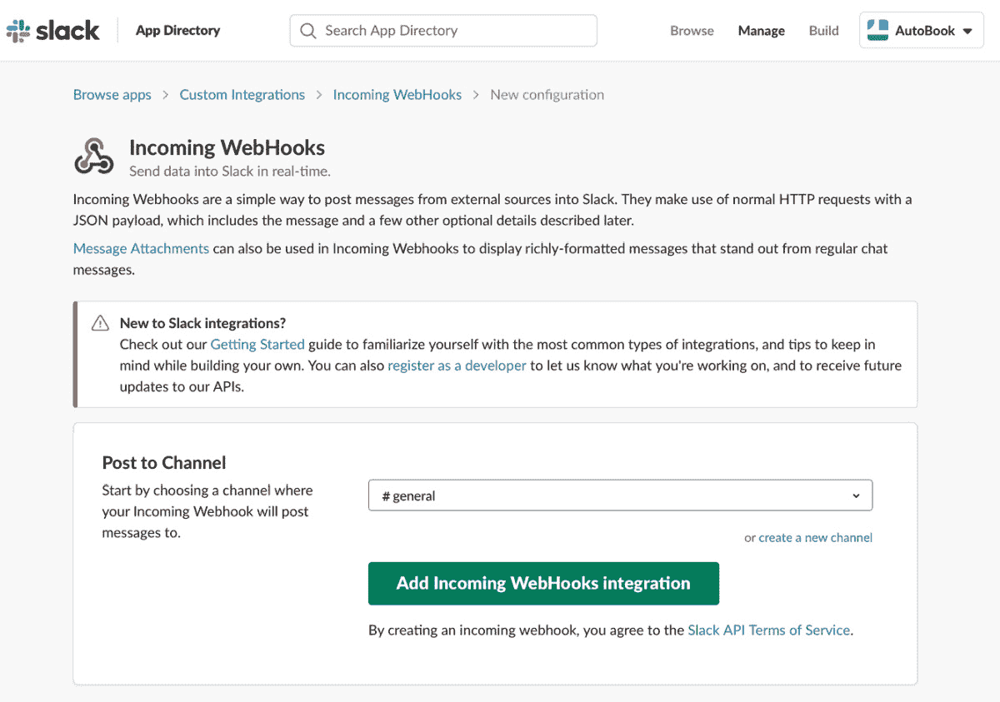

    图 4.4 – 将传入的 Webhook 添加到 Slack

1.  在**发布到频道**字段中，选择**#general**频道并点击**添加传入 WebHooks 集成**按钮。

1.  在以下屏幕中，您将看到您的新**Webhook URL**。您还可以使用此页面自定义集成时使用的图标、标签和用户名。现在，记录下生成的**Webhook URL**，因为稍后我们将需要它来完成自动化规则的设置。

现在我们已设置 Slack 通过 Webhook 接收传入消息，接下来我们需要设置一个自动化规则来利用这个集成。

## 创建一个规则来通知 Sprint 中的未解决问题

在本示例中，我们希望每天将开发团队的**#sprint-update**频道中的当前 Sprint 仍未解决的问题发送到 Slack：

1.  在您的 Jira 软件项目中，导航至**项目设置**，点击项目设置菜单中的**自动化**链接，然后点击**创建规则**。

1.  在**每隔此规则运行**字段中选择`1 天`，然后点击**保存**。

1.  接下来，选择**新建操作**，然后选择**查找问题**操作。

    在**JQL**字段中输入以下查询并点击**保存**：

    ```
    Sprint in openSprints() AND status != Done
    ```

1.  然后，选择`#sprint-updates`

    自动化规则应该类似于以下截图：

    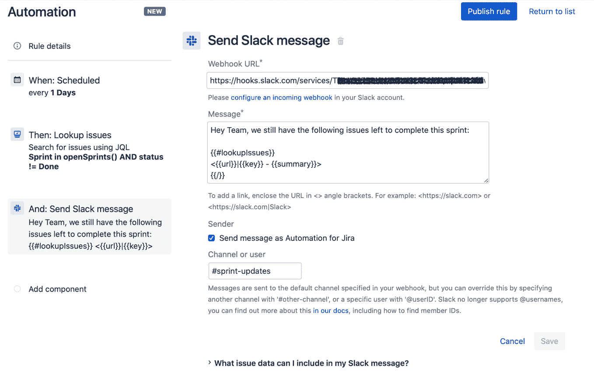

    图 4.5 – 发送 Slack 消息

1.  最后，给规则命名为 `在冲刺中打开问题通知`，并点击 **开启** 以保存并启用规则。

1.  现在你已经设置好了自动化规则，每天在你创建规则的时间，应该会在你配置的 Slack 频道中收到类似下面截图的通知：

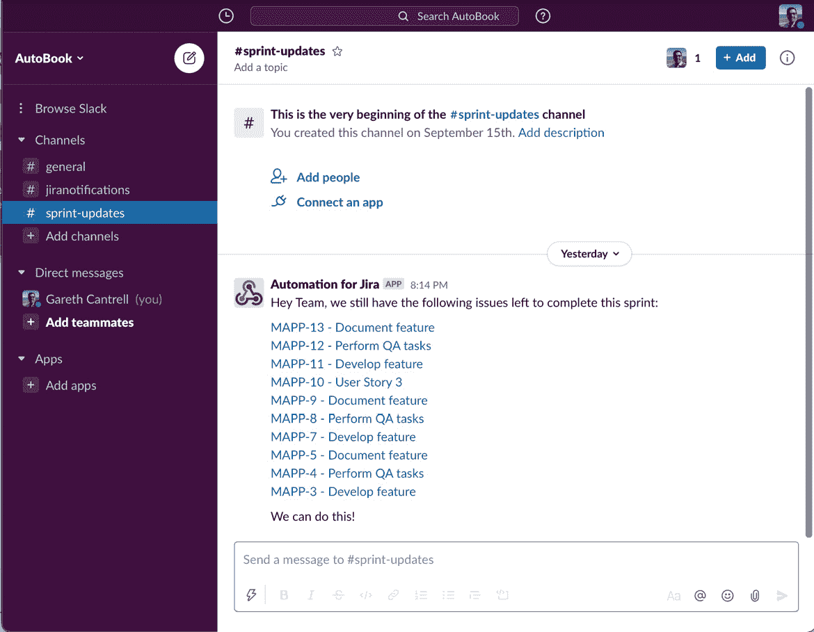

图 4.6 – 在 Slack 频道接收通知

提示

在 Jira Server 中创建这个规则时，你需要在触发器配置中输入 JQL 查询，而不是使用 **查找问题** 动作，展开 **更多选项**，并确保选中 **批量处理触发器产生的所有问题** 选项。

在本节中，我们学习了如何将 Slack 通知集成到自动化规则中，并如何向 Slack 频道发送通知。在接下来的章节中，我们将探讨如何与 Microsoft Teams 集成，以类似于 Slack 的方式向 Teams 频道发送通知。

# 如何向 Microsoft Teams 发送通知

Microsoft Teams 是微软的协作平台，属于 Microsoft 365 套件的一部分。与 Slack 类似，它允许团队通过频道或直接消息与其他人进行协作。

正如我们在上一节中看到的，自动化提供了 **发送 Microsoft Teams 消息** 动作，允许我们向 Microsoft Teams 频道发送消息。

在本节中，我们将学习如何与 Microsoft Teams 集成，通过自动化规则向频道发送通知。

## 与 Microsoft Teams 集成

在我们能够在自动化规则中使用 Microsoft Teams 之前，首先需要设置传入 Webhook，这样我们的规则才能向 Teams 频道发送消息。

在 Microsoft Teams 中，我们需要将传入 Webhook 连接器添加到团队中，才能通过自动化规则向频道发送消息。

让我们来看一下如何使用 *传入 Webhook 连接器* 在 Microsoft Teams 中配置团队和频道：

1.  打开你的 Microsoft Teams 应用，并从侧边栏打开 Teams 应用商店。

1.  从菜单中选择 **连接器**，然后找到 **传入 Webhook** 连接器。

1.  在弹出的窗口中，点击 **添加到团队**，然后选择你想要添加连接器的团队和频道，并点击 **设置连接器**。

1.  在下一个界面中，给你的传入 Webhook 连接器命名，例如 *Jira 通知*，如果需要，可以上传新的图片，并点击 **创建**。

    下图显示了你新建的传入 Webhook 连接器的 URL，你需要复制它，以便在配置自动化规则时使用：

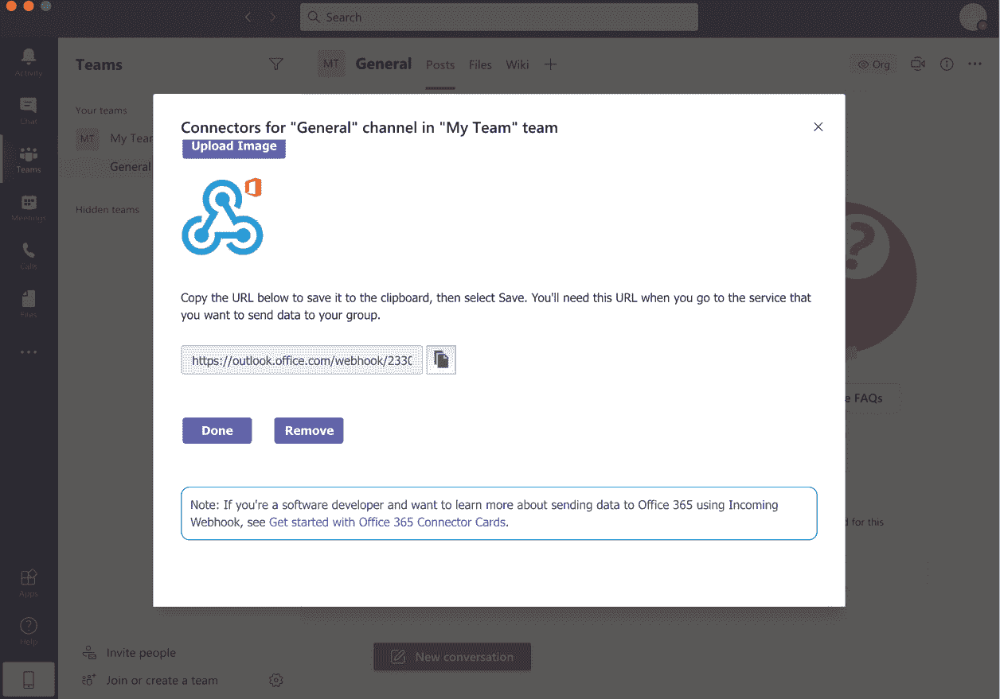

图 4.7 – 设置 Microsoft Teams 传入 Webhook 连接器

现在我们已经在 Microsoft Teams 中设置了传入 Webhook 连接器，可以在自动化规则中使用它来向我们配置的渠道发送通知。

## 创建规则以便在高优先级问题被提出时通知 Microsoft Teams 渠道。

在本示例中，我们将使用自动化规则监控提出的高优先级或最高优先级警报问题，并通过*Microsoft Teams*将通知发送到团队渠道：

1.  在你的 Jira 服务管理项目中，导航到**项目设置**，点击项目设置菜单中的**自动化**链接，然后点击**创建规则**。

1.  接下来，选择**问题已创建**触发器并点击**保存**。

1.  然后，选择**新建** **条件**，接着选择**问题**字段条件。

1.  按照以下步骤完成字段设置，并点击`Priority`。

    `是其中之一`

    `Highest, High`

1.  接下来，选择**新建操作**，然后选择**发送 Microsoft Teams 消息**操作。

1.  按照以下步骤完成操作字段设置，并点击`High Priority Ticket`。

    **消息**：

    ```
    {{issue.key}} - {{summary}} has just been created with *{{issue.priority.name}}* priority.
    Your urgent attention is required.
    ```

    提示

    如果勾选了**在消息中包含问题摘要**选项，Microsoft Teams 中的通知将包括问题状态、问题类型和指派人信息，以及一个**在 Jira 中查看**按钮，点击后将打开 Jira 工单的网页。

    你的规则应与以下截图类似：

    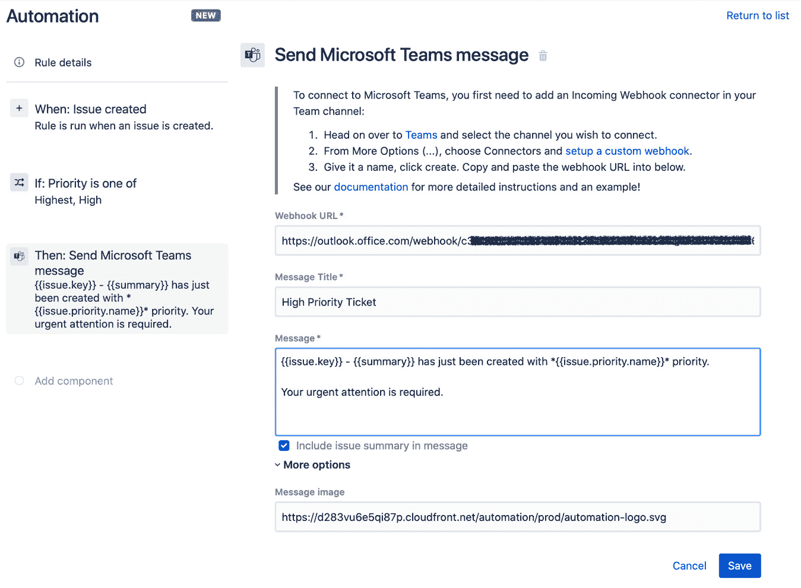

    图 4.8 – 使用 Microsoft Teams 发送消息

1.  最后，将规则命名为`高优先级问题通知`，点击**启用**以保存并启用该规则。

1.  在你的服务管理项目中创建一个新的高优先级或最高优先级问题时，将向你配置的 Microsoft Teams 渠道发送类似于以下截图的通知：

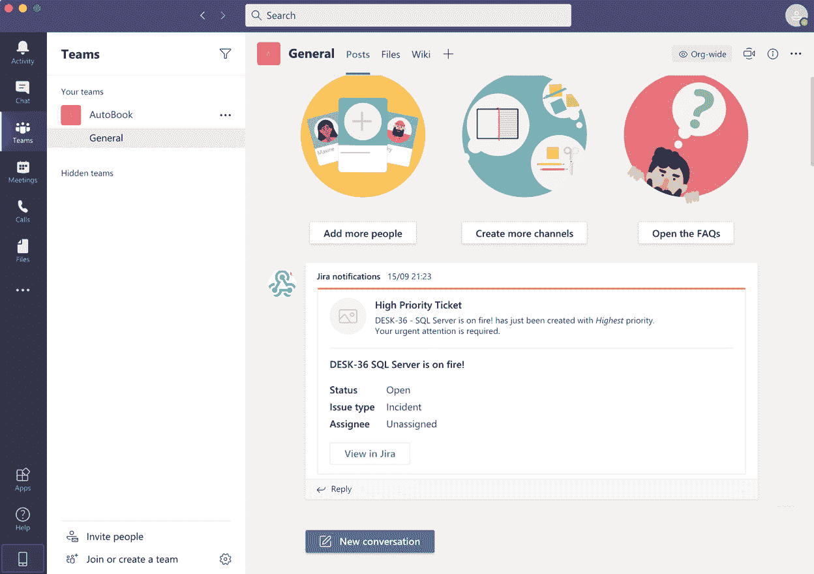

图 4.9 – 在 Microsoft Teams 渠道接收通知

在这一部分，我们学习了如何在 Microsoft Teams 中设置传入 Webhook 连接器，并如何在自动化规则中使用它向配置的团队渠道发送通知。

在下一部分，我们将讨论如何使用*Twilio*向手机发送短信通知。

# 使用 Twilio 发送短信通知

**Twilio** 是一个提供云服务的通信平台，允许开发者通过**REST API**将语音、视频和文本通信集成到他们的应用程序中。

在我们的自动化规则中使用**发送 Twilio 通知**操作，可以利用 Twilio 平台向手机发送短信。

在实际操作中，您通常会使用集成了 Jira 的专用值班工具，该工具能够通过各种方式，包括通过手机短信，使用可自定义计划联系正确的团队成员。然而，**发送 Twilio 通知**操作将允许您使用*自动化规则*构建一个简单的值班计划。

在本节中，我们将学习如何通过自动化规则集成 Twilio，以便将通知作为短信消息发送。

## 与 Twilio 集成

与 Twilio 集成是一个相对简单的过程。您需要一个 Twilio 账号和一个从中发送 SMS 消息的电话号码。

重要提示

Twilio 账户免费设置，并且您可以免费获得试用号码。但是，您将需要支付通过平台发送的每条 SMS 消息的费用，并且您需要为您选择的国家购买电话号码。

让我们看看如何设置 Twilio，以便我们可以从我们的自动化规则发送短信消息：

1.  导航至[`www.twilio.com`](https://www.twilio.com)，注册一个账号或者登录您现有的账号。

1.  如果您还没有电话号码，请在项目仪表板上点击**获取试用号码**按钮。

    一旦您有了电话号码，您的 Twilio 仪表板应该看起来类似以下的截图：

    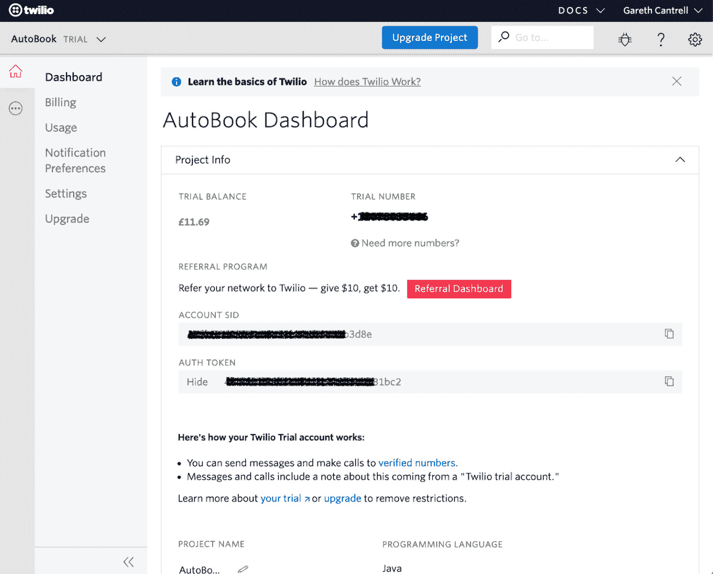

    图 4.10 – 设置 Twilio 账号

1.  当我们配置自动化规则时，您需要从 Twilio 仪表板复制您的**试用号码、账户 SID 和授权令牌**信息。要复制您的**账户 SID**和**授权令牌**字段，您可以点击各字段右侧的图标。

现在我们有了 Twilio 账号和电话号码，我们可以创建一个自动化规则来发送短信到手机上。

## 创建一个规则以通过短信消息发送工作时间外通知

在这个例子中，对于任何优先级为最高或高，并且在早上 8 点之前或下午 6 点之后提出的事件，我们将使用*Twilio*向手机发送短信通知。

为了简单起见，我们假设有一个单独的移动设备，由负责在工作时间外值班的团队成员使用。

让我们创建一个发送短信消息的规则：

1.  在您的 Jira 服务管理项目中，导航至**项目设置**，点击**自动化**链接在**项目设置**菜单中，然后点击**创建规则**。

1.  接下来，选择**问题创建**触发器并点击**保存**。

1.  然后，选择`问题类型`

    `等于`

    `事故`

1.  现在点击**保存**，这样我们就可以添加我们的下一个条件。

1.  选择`优先级`

    `是其中之一`

    `最高，高`

    点击**保存**，这样我们就可以继续我们的最后一个条件。

1.  然后选择**新条件**，然后选择**JQL 条件**，输入以下**JQL**查询并点击**保存**：

    ```
    NOT(created > startOfDay("+8h") AND created < endOfDay("-6h"))
    ```

1.  接下来，选择**新操作**，然后选择**发送 Twilio 通知**操作。

    按如下方式填写字段，然后点击 **保存**：

    **Account SID**：从你的 Twilio 仪表板复制账户 SID。

    **Auth token**：从你的 Twilio 仪表板复制认证令牌。

    **From**：从你的 Twilio 仪表板复制试用号码或电话号码。

    **To**：以国际格式填写要发送短信的手机号码。

    **消息正文**：

    ```
    A new incident, {{issue.key}} - {{issue.summary.abbreviate(100)}}, requires urgent attention!
    ```

    你的自动化规则应类似于以下截图：

    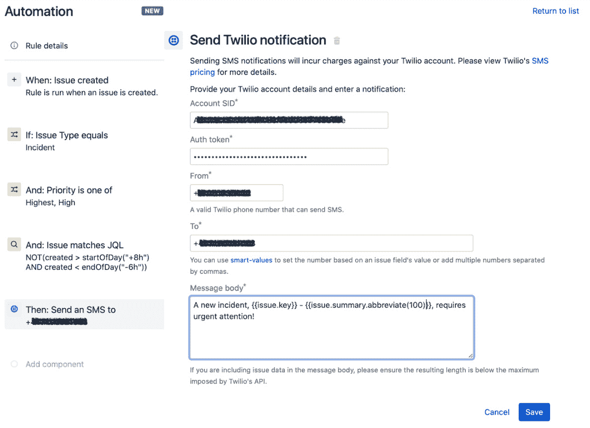

    图 4.11 – 通过 Twilio 发送短信

1.  最后，命名规则为 `高优先级非工作时间通知`，然后点击 **开启** 以保存并启用规则。

1.  在 Service Management 项目中创建一个优先级为高或最高的 issue 时，应该会发送一条短信，内容与以下截图相似：

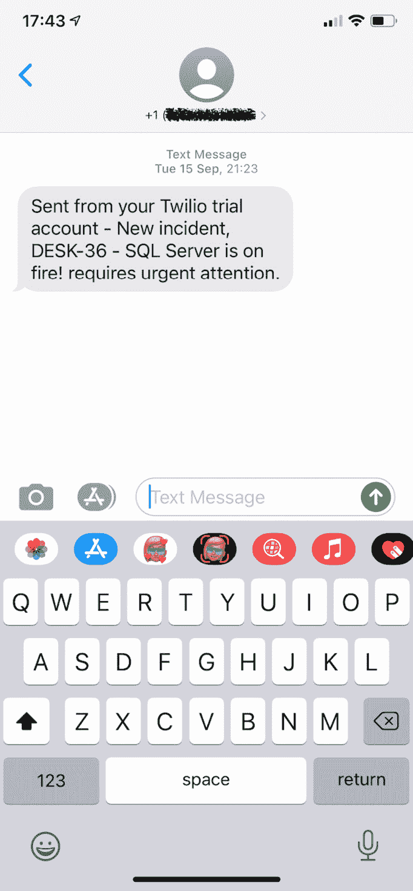

图 4.12 – 通过 Twilio 接收短信通知

在本节中，我们已经学习了如何使用 Twilio 平台通过 SMS 向手机号码发送短信通知。发送短信通知的能力为你提供了另一种渠道，确保通知能够及时送达，并传达预期的紧急程度。

# 概述

在本章中，你已学会了如何使用自动化规则向用户、用户组或任何有效的电子邮件地址发送自定义电子邮件通知。

你还学会了如何向两个最广泛使用的聊天系统，Slack 和 Microsoft Teams 发送通知。

最后，我们已经学习了如何与 Twilio 集成，通过 SMS 向手机发送文本消息。

凭借这些技能，你现在可以利用自动化规则在恰当的时间发送定制通知，并附带相关的上下文信息，这将鼓励用户采取预期的行动。

在下一章中，我们将探讨如何使用自动化规则与可以接受 web 请求的外部系统集成，以及如何接受来自外部系统的请求。
