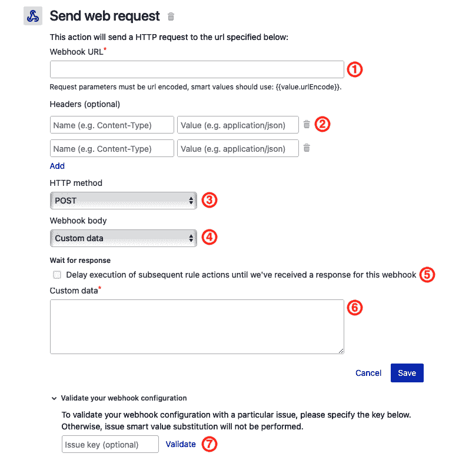
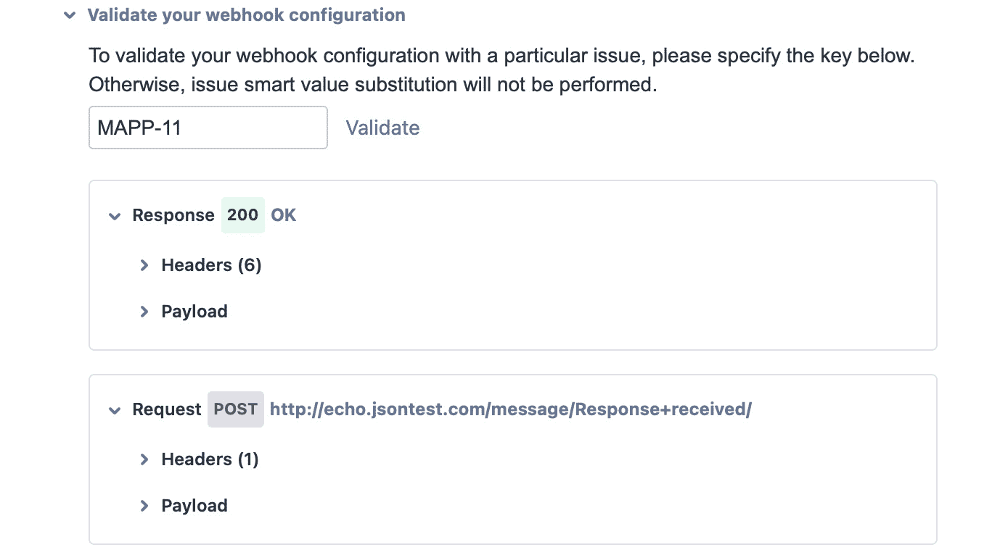
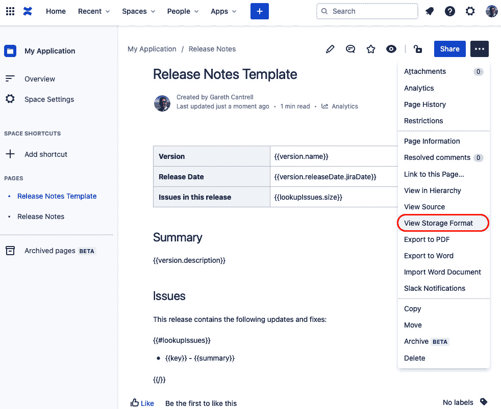
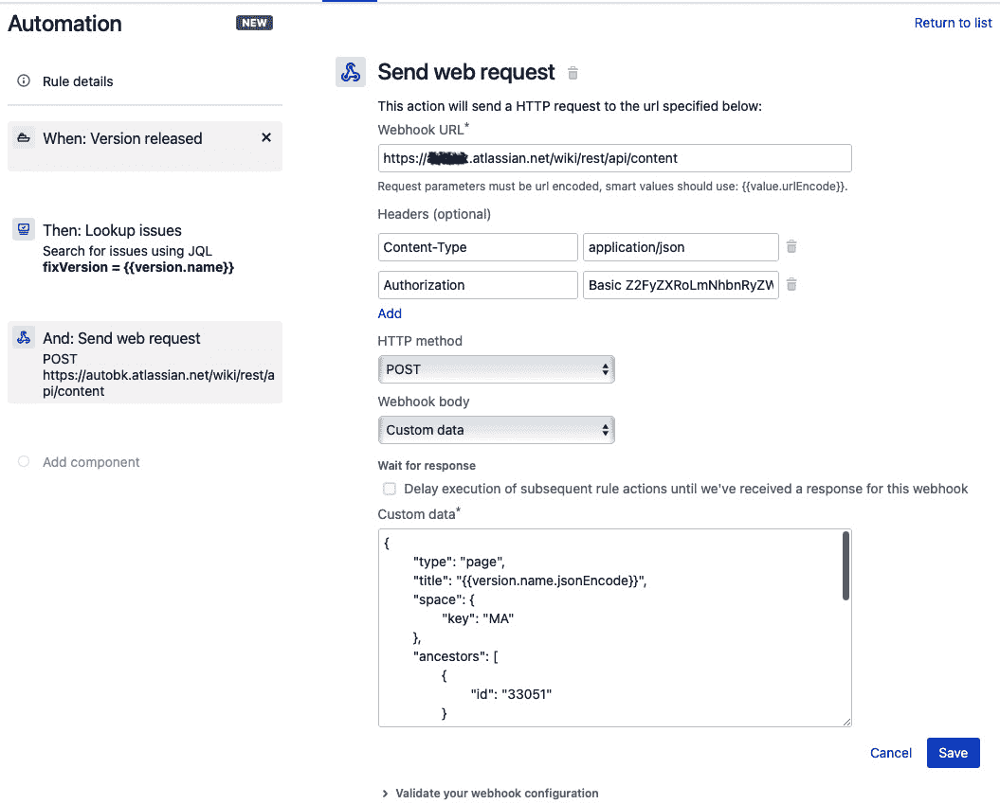
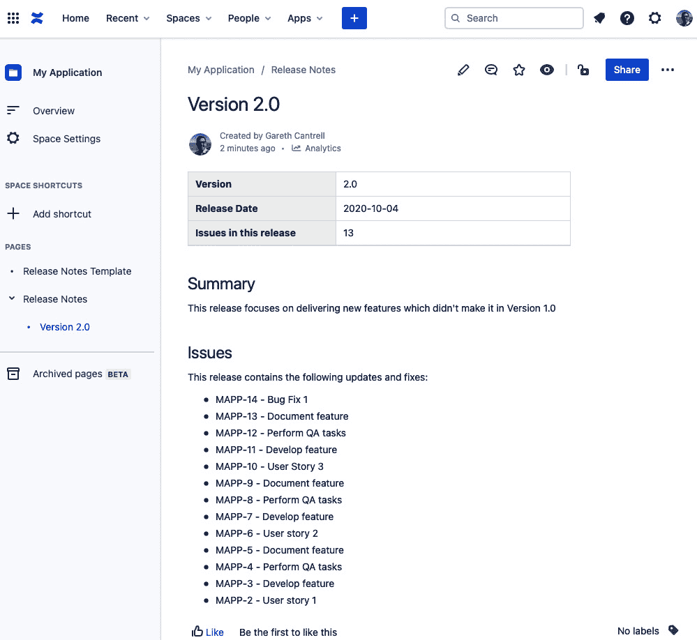
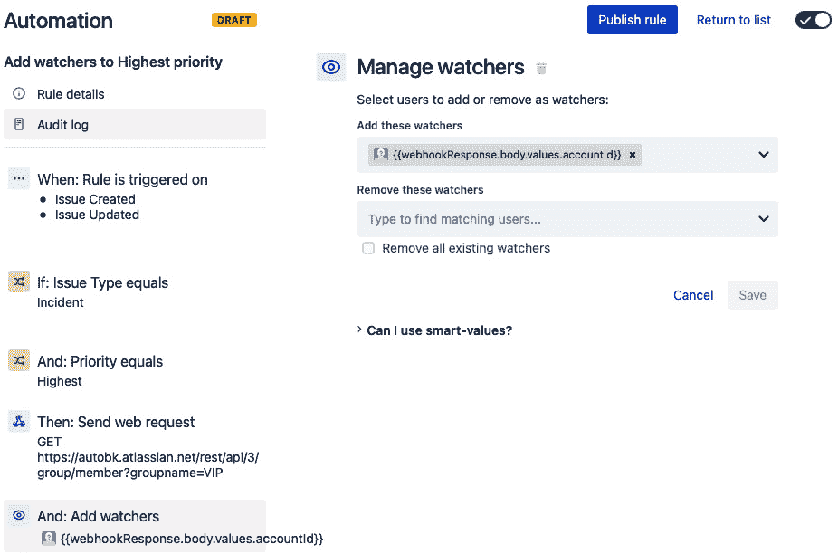
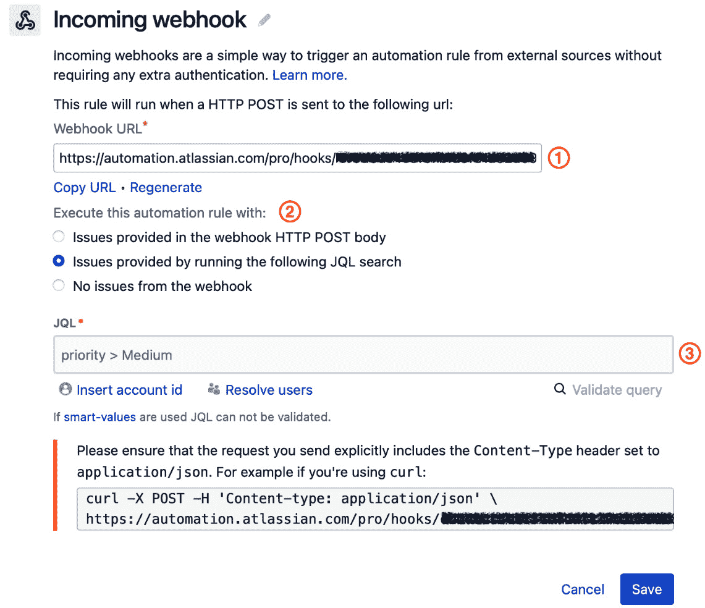
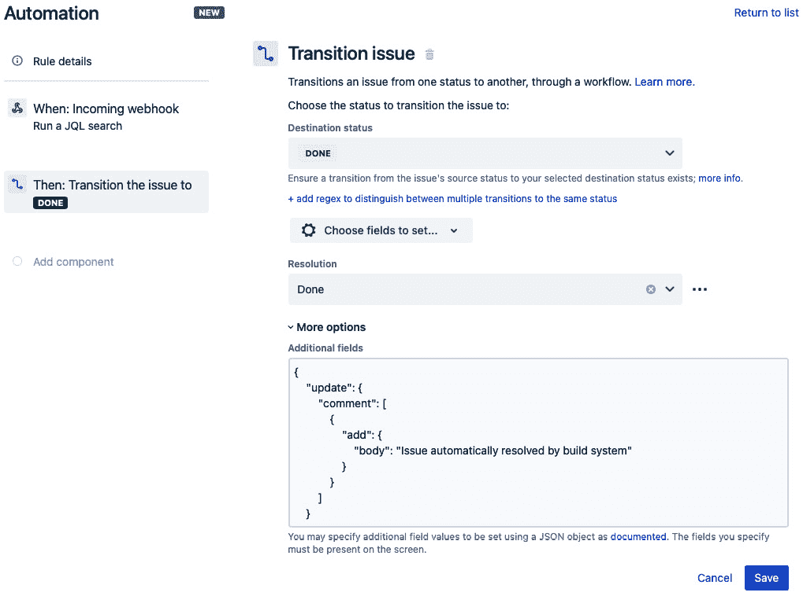
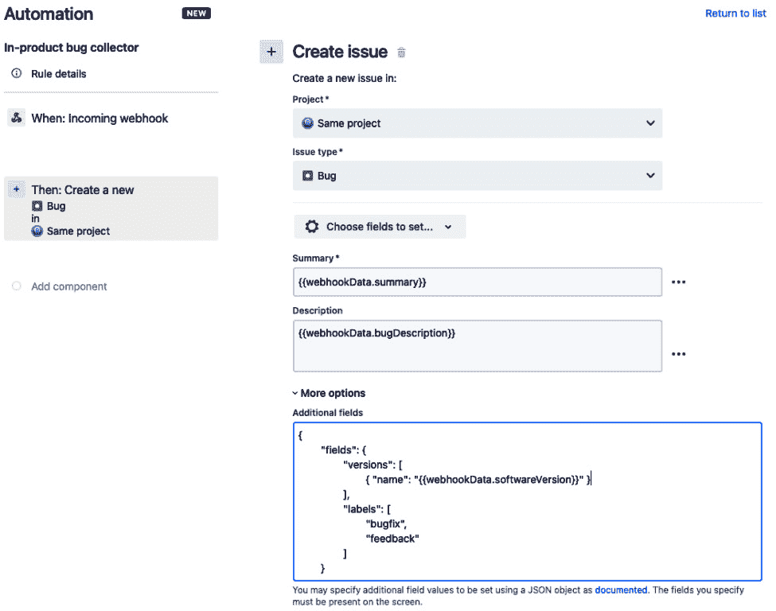

# *第五章*：与外部系统的交互

应用程序很少是孤立存在的。它们通常专注于做一件事，但为了真正有用，它们需要与组织中的其他应用程序共同存在。

这尤其适用于 Jira，这一点可以在 Atlassian Marketplace 中看到，在大量可用应用程序中，数百个仅用于将 Jira 与其他应用程序和系统集成。

即使有许多与各种应用程序的集成插件可供 Jira 使用，仍然会有一些情况，所需的集成未被涵盖，或者现有的集成无法完全满足你的特定需求。

近年来，许多应用程序和系统都采用了基于 JSON 的 REST API，以便使第三方系统能够与它们集成，而 Jira 中的自动化规则为我们提供了利用这些 API 所需的组件。

在本章中，我们将学习如何通过自动化规则向外部系统发送请求，并如何处理从这些请求返回的数据。此外，我们还将探讨如何使用自动化规则设置传入的 Webhooks，以便监听来自外部系统的请求并触发规则。

本章将涵盖以下主题：

+   如何向外部系统发送请求

+   处理从请求中返回的数据

+   如何使用传入 Webhooks 接收请求

+   处理传入 Webhooks 中的数据

# 技术要求

本章的要求如下：

+   **Jira Cloud 环境**：如果你还没有访问 Jira 的权限，可以在[`www.atlassian.com/software/jira/free`](https://www.atlassian.com/software/jira/free)创建一个免费的 Jira Cloud 账户，并确保选择了 Jira Software 和 Jira Service Management。

+   **Jira Server 环境**：如果你使用 Jira Server（可以从[`www.atlassian.com/software/jira/download`](https://www.atlassian.com/software/jira/download)下载），确保你拥有 Jira Software 和 Jira Service Management 的许可证。此外，你还需要确保安装来自 Atlassian Marketplace 的*Automation for Jira*应用。

+   **Confluence Cloud 环境**：如果你还没有访问 Confluence 的权限，可以通过 Jira Cloud 实例中的应用切换菜单在你的云账户中设置 Confluence 网站。如果你没有 Jira Cloud 账户，可以在[`www.atlassian.com/software/confluence/free`](https://www.atlassian.com/software/confluence/free)设置一个免费的 Confluence Cloud 账户。

+   **Confluence Server 环境**：如果你使用 Jira Server，可以从[`www.atlassian.com/software/confluence/download`](https://www.atlassian.com/software/confluence/download)下载并安装 Confluence Server，或者你可以创建并使用 Confluence Cloud 账户。

在这两个实例中，你需要至少拥有**项目管理员**权限，才能按照本章的示例进行操作，权限要求分别是 Service Management 项目和 Scrum Software 项目。我们在本章示例中使用了*IT 服务管理项目模板*来创建 Service Management 项目，并使用*Scrum 软件项目模板*来创建软件项目。

你可以从本书的官方 GitHub 仓库下载本章的最新代码示例，地址为[`github.com/PacktPublishing/Automate-Everyday-Tasks-in-Jira`](https://github.com/PacktPublishing/Automate-Everyday-Tasks-in-Jira)。本章的《代码实战》视频可以在[`bit.ly/2LJAJvN`](https://bit.ly/2LJAJvN)找到。

# 如何向外部系统发送请求

从自动化规则中向外部系统发送请求，打开了一个全新的极其强大的可能性领域。此功能可以用来发送通知，或将数据或任何自定义数据发送到任何接受通过 HTTP 或 HTTPS 进行网络请求的应用程序或系统。例如，你可以使用此功能触发在构建工具（如 Bamboo 或 Jenkins）中的构建过程，或在支持此功能的集中式用户目录系统中发起密码更改。

在本节中，我们将了解**发送网络请求**组件，并如何在自动化规则中使用它来向外部系统发送请求。我们将从查看操作中可用的各种配置选项开始。

在下方的截图中，我们可以看到**发送网络请求**操作的配置选项：



图 5.1 – 配置发送网络请求操作

让我们逐一查看配置屏幕中的每个字段，并了解我们如何使用它：

1.  使用`urlEncode`确保智能值正确编码。例如，你应该在字段中插入`{{issue.key.urlEncode}}`。

1.  **Headers**字段是你添加外部系统所需的任何 HTTP 请求头的地方，例如**Authorization**头，允许你向远程系统提交凭证或授权令牌，或**Content-Type**头，它告知远程系统你将要发送的数据的性质。在我们的示例中，我们将在发布版本说明到 Confluence 时使用这两个头。

    提示

    请求头名称通常不区分大小写。然而，你应始终确保使用官方规范中定义的大小写，以避免任何意外结果。维基百科维护了一份标准请求头的便捷列表，包含每个头部的示例接受输入，网址为[`en.wikipedia.org/wiki/List_of_HTTP_header_fields`](https://en.wikipedia.org/wiki/List_of_HTTP_header_fields)。

    你可以通过点击 **名称** 字段下方的 **添加** 链接，添加尽可能多的 HTTP 请求头。如果你需要删除一个头部，可以通过使用 **值** 字段右侧的垃圾桶图标来删除。

1.  **HTTP 方法** 字段允许你选择外部资源执行所选操作所需的正确方法。**发送网络请求** 操作支持以下标准 HTTP 方法：

    **获取**: 通常用于从外部系统中检索资源。

    **发布**: 通常用于使用请求体中的数据在外部系统中创建资源。

    **替换**: 通常用于替换资源，或者在资源不存在时创建它，资源数据位于请求体中。

    **修补**: 通常用于更新资源，更新后的数据位于请求体中。

    **删除**: 通常用于从外部系统中删除资源。

1.  在以下链接获取问题：[`developer.atlassian.com/cloud/jira/platform/rest/v3/api-group-issues/#api-rest-api-3-issue-issueidorkey-get`](https://developer.atlassian.com/cloud/jira/platform/rest/v3/api-group-issues/#api-rest-api-3-issue-issueidorkey-get)。

    **自定义数据**: 选择此选项将显示 **自定义数据** 字段（6）。通常在使用 **发布**、**替换** 或 **修补** 方法时，如果外部系统不期望 Jira 问题格式的数据，就需要此选项。

1.  `{{webhookResponse}}` 智能值字段。我们将在下一节中详细探讨这一点，*处理来自请求的返回数据*。

1.  `{{issue.description.abbreviate(255).jsonEncode}}` 以确保描述字段的内容得到正确编码。

    提示

    始终确保在发送自定义数据时，使用 **Headers** 字段指定正确的内容类型，并通过 *Content-Type* 头名称告知外部系统。例如，如果你发送的是 JSON 数据，将 *Content-Type* 设置为 *application/json*，或者对于 XML 数据，设置为 *application/xml*。

1.  一旦你已经配置了正确的 URL、头部、方法和可选数据，你应该始终测试生成的请求和接收到的响应是否符合预期。

    你可以通过展开 **验证你的 Webhook 配置** 并点击 **验证** 链接来完成此操作。提供一个可选的问题密钥将确保在验证过程中替换任何智能值。

    当你点击 **验证** 链接时，将会生成一个包含你配置的选项和数据的请求，并发送到外部系统，接收到的响应会被捕获并呈现给你，类似于以下截图：



图 5.2 – 验证网络请求配置

如你所见，验证请求将返回从外部系统接收到的响应，以及生成并发送到外部系统的请求。展开**负载**（Payload）部分将显示通过 Web 请求接收和发送的实际数据，让你确保双向数据符合预期。

现在我们已经了解了发送 Web 请求的各种配置选项，让我们看看如何在自动化规则中使用这些选项。

## 创建一个规则，将发布说明发布到 Confluence

在*第四章*《发送自动化通知》中，我们向你展示了如何创建规则，在 Jira 发布软件版本时向各个相关人员发送电子邮件通知。

我们将在本示例中重新审视该规则。然而，我们将不再在发布版本时发送电子邮件通知，而是通过**发送 Web 请求**操作将页面发布到 Confluence。

在这个示例中，我们创建了一个新的 Confluence 空间和一个发布页面。各个发布说明页面将作为“发布”页面的子页面创建。

为了简化操作，我们将在 Confluence 中创建一个**发布说明模板**页面，页面中填充了所有相关的智能值。我们有了模板后，需要复制该页面的存储格式，以便将其包含在自动化规则中的**发送 Web 请求**主体中。

在下图中，我们可以看到已完成的模板，并且可以查看页面的存储格式：



图 5.3 – 获取发布说明模板页面源代码

将存储格式视图中的所有代码复制到文本编辑器中，然后我们将按如下方式修改`{{#lookupIssues}}`部分，以确保智能值替换按预期工作：

```
<ul>
{{#lookupIssues}}
<li><p>{{key}} - {{summary}} </p></li>
{{/}}
</ul>
```

接下来，我们将通过在代码中的双引号前添加反斜杠来转义所有双引号字符，并删除所有换行符，这样整个代码就会在一行内。

提示

当我们与 Confluence 配合使用时，采用存储格式，这样我们可以访问页面的底层 HTML 格式，包括用于定义页面中各种 Confluence 宏的 XML，并且能更灵活地调整发布页面时显示的最终内容。

最后，我们需要确保你拥有一个有效的 API 令牌，该令牌将在规则中授权 Web 请求时使用：

1.  访问[`id.atlassian.com/manage-profile/security/api-tokens`](https://id.atlassian.com/manage-profile/security/api-tokens)，点击**创建 API 令牌**。

    重要提示

    你不能在自动化规则中使用的账户启用双重身份验证。双重验证是为有访问辅助设备的人类用户设计的，无法在自动化系统中实现。

1.  给你的令牌起个标签，比如 `自动化规则`，然后点击 **创建**。

1.  将令牌保存在安全的地方，因为关闭弹出窗口后你将无法检索它。

1.  我们现在需要对凭证进行编码，以便在自动化规则中使用。你可以使用像 [`www.base64encode.org`](https://www.base64encode.org) 这样的在线工具进行编码。

    输入你的电子邮件地址，紧跟其后输入冒号（:），然后输入你的 API 令牌，点击 **编码** 按钮，然后将生成的编码值保存在安全的地方。

    提示

    如果你使用的是 Confluence Server，你只需要一个可以在 Confluence 空间中创建页面的用户的用户名和密码。要对凭证进行编码，将前面的 *第 4 步* 中的电子邮件地址替换为用户名，将 API 令牌替换为用户的密码。

现在，让我们开始构建自动化规则：

1.  在你的 Jira 软件项目中，导航到 **项目设置**，点击 **项目设置** 菜单中的 **自动化** 链接，然后点击 **创建规则**。

1.  选择 **版本发布** 触发器，然后点击 **保存**。

1.  接下来，选择 `fixVersion = "{{version.name}}"`

1.  然后，选择 `https://<your_site>.atlassian.net/wiki/rest/api/content`

    第一步 `Content-Type`

    `application/json`

    第二步 `Authorization`

    `Basic <你的 base64 编码凭证>`

    `POST`

    `自定义数据`

1.  我们需要获取发布说明页面的页面 ID，因为它将作为我们发布页面的父页面。为此，导航到 Confluence 中的发布说明页面，然后点击 JSON 中的 `ancestors` 项。

    你还需要确保使用正确的 Confluence 空间密钥。在我们的示例中，这是 **MA**。

    ```
    {
        "type": "page",
        "title": "Version {{version.name.jsonEncode}}",
        "space": {
            "key": "MA"
        },
        "ancestors": [
            {
                "id": "33051"
            }
        ],
        "body": {
            "storage": {
                "value": "<table data-layout=\"default\"><colgroup><col style=\"width: 212.0px;\" /><col style=\"width: 416.0px;\" /></colgroup><tbody><tr><th><p><strong>Version</strong></p></th><td><p>{{version.name.jsonEncode}}</p></td></tr><tr><th><p><strong>Release Date</strong></p></th><td><p>{{version.releaseDate.jiraDate}}</p></td></tr><tr><th><p><strong>Issues in this release</strong></p></th><td><p>{{lookupIssues.size}}</p></td></tr></tbody></table><h1>Summary</h1><p>{{version.description.jsonEncode}}</p><h1>Issues</h1><p>This release contains the following updates and fixes:</p><ul>{{#lookupIssues}}<li><p>{{key}} - {{summary.jsonEncode}}</p></li>{{/}}</ul>",
                "representation": "storage"
            }
        }
    }
    ```

    如果 JSON 结构与上面的代码类似，将 JSON 复制到 **自定义数据** 字段中，之后你的规则应该类似以下截图：

    

    图 5.4 – 配置发送 Web 请求

1.  最后，点击 `发布发布说明到 Confluence`，然后点击 **开启** 以保存并启用该规则。

    当你在 Jira 软件项目中发布版本时，你应该在 Confluence 中的 **发布说明** 下有一个类似以下截图的已发布页面：



图 5.5 – 自动化规则发布的发布说明

我们现在已经学习了如何使用自动化规则向外部系统发送 Web 请求。在下一节中，我们将扩展这一点，看看如何将从外部系统返回的数据纳入后续规则组件中。

# 使用请求返回的数据

许多系统在集成时不仅会接收你发送的数据，还会根据请求返回额外的数据。通过自动化规则，我们能够获取请求的响应，并在后续的条件和操作中利用这些数据。这个功能让我们的规则更加灵活和强大，因为我们现在可以根据外部系统返回的具体内容来做决策和执行操作。

在配置`{{webhookResponse}}`时，使用来自外部系统的响应。

`{{webhookResponse}}`智能值包含许多字段，你可以在后续的规则组件中访问这些字段，具体如下：

+   成功请求返回`200`或`201`，重定向和错误则在`300`到`599`范围内。你可以在[`en.wikipedia.org/wiki/List_of_HTTP_status_codes`](https://en.wikipedia.org/wiki/List_of_HTTP_status_codes)查找更多关于 HTTP 响应代码的信息。

+   `{{webhookResponse.headers.Content-Type}}`将获取外部系统返回的**Content-Type**头信息。

+   **{{webhookResponse.body}}**：body 字段将包含外部系统返回的响应主体。如果外部系统的响应是 JSON 对象，你可以使用**点符号**访问任何字段。

+   **{{webhookResponses}}**：如果你的规则中有多个**发送 Web 请求**动作，每个响应（如果有）都会被添加到这个列表中，你可以使用我们在*第三章*《使用智能值增强规则》中讲解的智能值列表函数来处理列表项。

现在，让我们来看一下如何将来自 Web 请求的响应纳入自动化规则。

## 创建一个规则，将事件管理者添加为观察者

在这个例子中，我们将在*第一章*，《自动化的关键概念》中，添加我们在 VIP 组中创建的成员作为观察者，给那些优先级设置为**最高**的、无论是已创建还是已更新的问题。

由于 Jira 本身具有强大的 REST API，我们可以将其视为自动化规则中的外部系统，获取通常无法访问的数据，并将其用于我们的规则中。

让我们来看一下规则：

1.  在你的 Jira 服务管理项目中，导航至**项目设置**，点击**项目设置**菜单中的**自动化**链接，然后点击**创建规则**。

1.  选择`问题创建`和`问题更新`，然后点击**保存**。

1.  现在选择`问题类型`

    `equals`

    `事件`

1.  然后选择`优先级`

    `equals`

    `最高`

1.  接下来，选择`https://<your_site.domain.com>/rest/api/3/group/member?groupname=VIP`

    `授权`

    `基本 <your base64-encoded credentials>`

    `GET`

    `空`

    **等待响应**：选择复选框

    这个 API 调用的响应会返回一个包含属于我们在查询参数中指定的**groupname**的用户列表，这个列表位于**values**数组中，类似于以下内容：

    ```
    {
      "values": [
        {
          "self": "https://<your-site>.atlassian.net/rest/api/3/user?accountId=5b10a2844c20165700ede21g",
          "name": "Joe Soap",
          "key": "jsoap",
          "accountId": "5b10a2844c20165700ede21g",
          "emailAddress": "joe.soap@company.com",
          "avatarUrls": {},
          "displayName": "Joe Soap",
          "active": true,
          "timeZone": "Europe/London",
          "accountType": "atlassian"
        }
      ]
    }
    ```

    您可以在 [`developer.atlassian.com/cloud/jira/platform/rest/v3/api-group-groups/#api-rest-api-3-group-member-get`](https://developer.atlassian.com/cloud/jira/platform/rest/v3/api-group-groups/#api-rest-api-3-group-member-get) 找到有关此 API 调用的更多信息。

1.  要完成规则，选择`{{webhookResponse.body.values.accountId}}`

    您的规则应类似于以下截图：

    

    图 5.6 – 在规则中使用 webhookResponse 数据

1.  最后，点击`Add` `watchers` `to` `Highest` `priority` `incidents`，然后点击**Turn it on**以保存并启用规则。

在本节中，我们学习了如何暴露外部系统请求返回的响应，并且我们可以如何利用这些数据创建更强大的自动化规则。

在下一部分，我们将学习如何监听来自外部系统的 web 请求，以及如何利用这些请求来触发我们的自动化规则。

# 如何通过传入的 webhook 接收请求

在前两节中，我们学习了如何使用自动化规则向外部系统发送通知和数据，并且如何处理从外部系统接收到的响应数据。

此外，自动化规则还允许我们使用**Incoming webhook**触发器接收来自外部系统的通知和数据。该组件将为每个触发器创建一个唯一的 URL，外部系统可以调用该 URL，并触发自动化规则的运行。这些传入的 webhook 可以接收待处理的 issue 列表以及以 JSON 对象形式提供的自定义数据，后者可用于后续规则组件中，通过条件作出决策，或使用提供的自定义数据创建或更新 issues。

以下截图显示了**Incoming webhook**触发器的配置选项：



图 5.7 – 配置传入的 webhook 触发器

现在让我们来看一下每个配置选项的工作原理：

1.  **Webhook URL** 是唯一的 URL，当外部系统向它发送 HTTP **POST** 请求时，将触发规则的运行。

    此 URL 是自动生成的，使用时无需认证。如果 URL 被泄露，您可以使用**Regenerate**链接生成一个新的 URL，并更新任何使用该 URL 的外部系统。

    重要提示

    传入的 webhook 仅支持 HTTP **POST** 方法。它们不会响应 HTTP **GET** 或任何其他方法。此外，您需要确保发送请求到 webhook 的外部系统将 *Content-Type* 请求头设置为 *application/json*。

1.  `issue`，例如，`https://automation.atlassian.com/pro/hooks/<unique-webhook-token>?issue=MAPP-1`。要指定多个 issue，应在 JSON 格式的请求体中包含一个名为 `"issues"` 的列表，并在该列表中包含 issue 键或 issue ID，如下所示：

    ```
    {
        "issues": [
            "MAPP-1",
            "MAPP-2",
            "10123"
        ]
    }
    ```

    **通过运行以下 JQL 查询提供的问题**将显示**JQL**字段（3），允许你输入 JQL 查询来搜索相关问题。

    **Webhook 没有问题**意味着 Webhook 不期望操作任何现有问题。如果需要在 Webhook 调用时创建问题，可以使用此选项。

1.  如上所述的*第 2 步*，当你使用**通过运行以下 JQL 查询提供的问题**选项时，会显示**JQL**字段，允许你定义一个 JQL 查询，以返回在调用 Webhook 时将被更新的问题。你可以在查询中使用智能值和函数。然而，使用这种方法时，你无法通过**验证查询**链接验证查询。

现在让我们来看看如何使用传入 Webhook 触发我们所看到的自动化规则，以便配置传入 Webhook。

## 使用自动化 Webhook 创建解决开放问题的规则

许多软件项目都有某种形式的自动化构建和部署工具，用于自动化构建、测试和部署代码。

在这个例子中，我们假设开发人员在完成开发后，会将问题移动到*等待部署*状态。当我们的自动化部署开始时，我们希望通过让我们的构建和部署工具在 Jira 中创建一个自动化规则，自动解决当前开放冲刺中所有等待部署的问题。

在我们的 Jira 软件项目中，我们使用的是*简化软件*工作流程，因此我们将从**项目设置**屏幕编辑工作流程，添加一个新的*等待部署*状态，并允许所有状态过渡到此状态。此外，添加*解决问题*屏幕到*完成*过渡，以便在解决问题时允许添加评论。

既然我们已经调整了工作流程以考虑到这个新状态，接下来让我们创建自动化规则：

1.  在你的 Jira 软件项目中，导航到**项目设置**，点击项目设置菜单中的**自动化**链接，然后点击**创建规则**。

1.  选择`通过运行以下 JQL 查询提供的问题`

    `sprint in openSprints() AND status = "Waiting for deploy"`

1.  现在，在**目标状态**字段中选择`完成`。

1.  此外，我们还希望向这些问题添加评论，表明问题是由构建系统自动解决的。

    为此，展开**更多选项**面板，在**附加字段**编辑器中添加以下 JSON，然后点击**保存**：

    ```
    {
        "update": {
            "comment": [
                {
                    "add": {
                        "body": "Issue automatically resolved by build system"
                    }
                }
            ]
        }
    }
    ```

    你的规则现在应该类似于下图所示：

    

    图 5.8 – 配置带有传入 Webhook 的规则

1.  最后，将你的规则命名为`Release` `issues` `waiting` `for` `deploy`，并点击**开启**以保存并启用规则。

在这一部分中，我们学习了如何创建和使用传入的 webhook 来触发自动化规则。在下一部分中，我们将学习如何利用外部系统提供的数据进一步增强我们的自动化规则。

# 在传入 webhook 中处理数据

能够从外部系统触发 Jira 中的操作使您能够创建非常强大的自动化规则集成。

正如我们在前一部分看到的，您可以通过将特定问题包括在传入请求体中来对其进行操作。但是，借助`{{webhookData}}`智能值，您可以使用点表示法访问任何 JSON 对象字段。

这个强大的功能将使您能够与任何可以发送 web 请求的外部系统进行集成，并提取有价值的数据以用于您的问题。例如，您可以设置监控工具，在事件发生时向自动化规则发送通知，并使用它提供的数据创建一个新事件，并根据哪个资产导致事件来设置受影响的组件。

现在让我们看看如何配置一个自动化规则，利用传入的 web 请求中的自定义数据。

## 创建一个规则，通过自动化 webhook 来提升新的问题

当发生错误时，能够收集关于已部署软件的信息对许多开发者来说是非常宝贵的，许多软件应用程序允许用户在发生错误时提交反馈。

在这个示例中，我们将创建一个自动化规则，使用传入的 webhook 接收一个错误报告，并自动在我们的 Jira 项目中创建一个错误来跟踪它。

我们将期望处理一个具有以下结构的 JSON 对象来处理这些传入的信息：

```
{
    "summary": "some summary text",
    "bugDescription": "some descriptive text",
    "softwareVersion": "version string"
}
```

如果您将其包括在产品中，您可能还可以向 JSON 结构中添加更多相关数据，如堆栈跟踪，以使错误报告更具上下文。

现在让我们看看如何构建这个自动化规则：

1.  在您的 Jira 软件项目中，导航到**项目设置**，点击**项目设置**菜单中的**自动化**链接，然后点击**创建规则**。

1.  选择`No issues from the webhook`，因为我们将使用此规则来创建一个问题。然后点击**保存**。

1.  接下来，选择`Same project`

    `Bug`

    `{{webhookData.summary}}`

    `{{webhookData.bugDescription}}`

1.  我们还希望捕获在提交此错误时部署的软件版本，并希望向问题添加一些标签，以便更容易地找到通过产品内反馈收集器提出的错误。

    为此，展开**更多选项**，然后将以下 JSON 添加到**附加字段**编辑器：

    ```
    {
        "fields": {
            "versions": [
                { "name": "{{webhookData.softwareVersion}}" }
            ],
            "labels": [
                "bugfix",
                "feedback"
            ]
        }
    }
    ```

    现在您的规则应该类似于以下屏幕截图：

    

    图 5.9 – 消费传入的 webhook 数据

1.  点击`In-product` `bug` `collector`，然后点击**开启**以保存并启用该规则。

你现在已经学会了如何在传入的 Web 钩子中获取外部系统的请求数据。

能够消费来自外部系统的传入数据，并利用这些数据做出决策，使用自动化规则对问题进行更改，给你提供了在 Jira 中自动化项目的一些强大选项。

# 总结

在本章中，你已经学会了如何通过发送 Web 请求将外部系统集成到自动化规则中，并且了解了如何使用智能值和智能值函数将自定义数据包含在这些请求中。

我们还学会了如何确保我们能够接收到来自外部系统请求的响应，并且如何提取数据以便在后续的规则组件中使用。

接下来，我们学习了如何使用自动化规则设置传入的 Web 钩子，监听来自外部系统的请求，并且如何可选地处理请求体中发送的数据，并在后续的规则组件中使用这些数据。

正如我们在本章中所看到的，通过使用自动化规则与外部系统集成的能力为你的 Jira 项目开辟了无限可能。例如，当你在 Jira Software 中发布版本或完成冲刺时，你可以通过构建工具启动软件构建或部署。在 Service Management 中，你可以集成用户目录服务，根据服务请求自动创建新账户或自动重置密码（如果支持的话）。

在下一章，我们将探讨如何运用本章以及前几章中学到的技能，在 Service Management 实例中帮助构建自动化。
