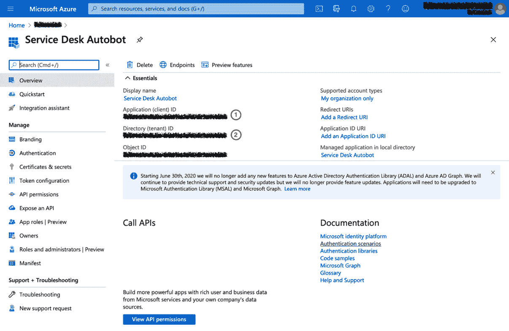

# 第六章：*第六章*：自动化 Jira Service Management

今天，许多组织使用 Jira Service Management 提供客户支持门户、**人力资源**（**HR**）服务以及**信息技术**（**IT**）服务台等。

然而，Jira Service Management 最常见的使用案例是作为**IT 服务管理**（**ITSM**）解决方案，帮助高效提供组织内的 IT 服务。

提高效率、降低 IT 服务台请求每票成本的最佳方法之一是尽可能自动化琐碎的任务和流程。

一些最常见的任务，自动化能够提供即时的好处，包括票据分类与路由、实时更新客户请求状态、维护**服务水平协议**（**SLA**）的合规性、解放支持人员从重复性任务中脱身，并关闭过时的请求，确保它们不会堵塞请求队列。

在本章中，我们将涵盖以下主题：

+   处理来往请求

+   监控 SLA 合规性

+   自动化常见的重复任务

在本章结束时，你将更好地理解如何在 Jira Service Management 中使用自动化规则来提高服务台的效率。此外，减少完成常见任务所需的人为干预，也将降低每个服务台请求的成本。

# 技术要求

本章的要求如下：

+   **Jira Cloud 环境**：如果你尚未访问 Jira，你可以在[`www.atlassian.com/software/jira/free`](https://www.atlassian.com/software/jira/free)创建一个免费的 Jira Cloud 账户，并确保你选择了**Jira Software**和**Jira Service Management**。

+   **Jira Server 环境**：如果你使用的是 Jira Server（可从[`www.atlassian.com/software/jira/download`](https://www.atlassian.com/software/jira/download)下载），请确保你拥有 Jira Software 和 Jira Service Management 的许可证。此外，你还需要确保安装来自 Atlassian 市场的*Automation for Jira*应用。

+   **Microsoft Azure Active Directory（Azure AD）**：Azure AD 是微软的基于云的身份服务。你可以在[`azure.microsoft.com/free`](https://azure.microsoft.com/free)注册一个免费的 Azure 账户。

在这两种情况下，你需要至少具有**项目管理员**权限，才能在服务管理项目和 Scrum 软件项目中执行本章中的示例。对于本章中的示例，我们使用了*IT 服务项目模板*来创建服务管理项目，并使用*Scrum 软件项目模板*来创建软件项目。

你可以从本书的官方 GitHub 仓库下载本章的最新代码示例，链接为[`github.com/PacktPublishing/Automate-Everyday-Tasks-in-Jira`](https://github.com/PacktPublishing/Automate-Everyday-Tasks-in-Jira)。请访问以下链接查看 CiA 视频：[`bit.ly/2NhMFp9`](https://bit.ly/2NhMFp9)

# 处理传入请求

服务台中较为耗时的任务之一是将收到的请求分类并将其分发到正确的团队。

拥有一个成熟的服务请求目录，并将其作为基础在 Jira 服务管理门户中创建相关的请求类型，可以解决客户创建请求时的初步分类问题；然而，在许多组织中，仍然通过电子邮件接收请求，这些请求通常需要人工干预来分类并将其路由到相关团队。

在本节中，我们将探讨自动化规则，自动处理传入的请求，并将其路由到正确的团队进行处理。

在第一个示例中，我们将查看如何使用自动化规则来处理来自电子邮件的请求。

## 创建一个规则来处理电子邮件请求

拥有一个结构良好的客户门户的好处之一是，你可以利用组织的服务请求目录，通过请求类型推动正确的服务请求选择，同时使用每个服务请求中的预选组件来缩小请求的分类范围。

提示

要为请求类型中的任何字段预定义一个值，可以将该字段添加为请求表单中的隐藏字段。这样做会强制你为该字段提供一个默认值，之后可以在自动化中使用这个默认值。

这种方法确保了到达服务台队列的票据已经按正确的组件进行了分类，我们可以利用这些组件来推动自动化流程。

然而，电子邮件请求仍然被广泛用于创建服务台请求，这些请求通常会进入一个服务队列，需要人工干预以进行初步分类和正确归类。

在这个例子中，我们将使用一个自动化规则来处理并根据电子邮件中某些特定关键词的出现对传入的电子邮件进行分类。为了简化起见，我们只检查问题摘要，这个摘要是从电子邮件主题设置的。

让我们来看看这个规则，如下所示：

1.  在你的 Jira 服务管理项目中，导航到**项目设置**，点击**项目设置**菜单中的**自动化**链接，然后点击**创建规则**。

1.  选择**问题已创建**触发器并点击**保存**。

1.  然后，选择`请求类型`

    `equals`

    `电子邮件请求`

1.  接下来，选择`摘要`

    `contains`

    `vpn`

1.  从`VPN 服务器`组件中选择`组件`字段并点击**保存**。

1.  点击`摘要`

    `contains`

    `password`

1.  现在，从`Active Directory`组件中选择`组件`字段并点击**保存**。

1.  规则现在应该与以下截图中的规则类似：

    图 6.1 – 处理来邮件请求

1.  你可以继续为需要的每个组件添加 else-if 块；不过，在这个例子中，我们就此停止，命名规则为`Triage email requests`，然后点击**启用**来保存并启用该规则。

现在我们已经学会了如何分类通过电子邮件接收到的来请求，让我们看看如何将这一过程扩展到路由和分配请求给正确的团队。

## 创建自动路由请求的规则

使用自动化规则自动分类来请求将有助于缩短工单处理的响应时间。然而，我们可以更进一步，自动将请求路由并分配给正确的团队，进一步缩短响应和解决时间。

在这个例子中，我们将利用为每种请求类型预定义组件的功能，并使用这些组件将来请求分配给正确的团队。此外，我们将确保我们之前创建的自动分类规则能够输入到此规则中。

我们将提到*网络团队*和*系统管理员团队*用户组，因此你需要在你的实例中创建这些用户组，以确保规则能够正常工作。

让我们开始创建规则，如下所示：

1.  在你的 Jira Service Management 项目中，导航至**项目设置**，点击**项目设置**菜单中的**自动化**链接，然后点击**创建规则**。

1.  选择`问题已创建`和`问题已更新`，然后点击**保存**。

1.  接下来，选择`组件`

    `包含任何`

    `VPN 服务器`

1.  然后，选择`用户在组中`

    `平衡工作负载`

    `网络团队`

1.  点击`组件`

    `包含任何`

    `Active Directory`

1.  点击`Summary`

    `不包含`

    `密码`

1.  现在，选择`用户在组中`

    `平衡工作负载`

    `系统管理员团队`

1.  你可以继续添加更多的 Else-If 块来路由更多的请求；不过，在这个例子中，我们只会创建这两个条件。

1.  在我们保存此规则之前，我们需要确保它能够通过分类来邮件的规则触发。

1.  点击`Route incoming requests`

    **允许规则触发**：确保勾选此框

    你的规则现在应该与以下截图中的规则类似：

    

    图 6.2 – 路由来请求

1.  最后，点击**保存**，然后点击**启用**来保存并启用规则。

在这一部分，我们学会了如何使用自动化规则来处理 Jira Service Management 中的来请求，首先在适当的情况下对它们进行分类，然后将它们路由到正确的团队进行解决。

在接下来的部分，我们将了解如何使用自动化规则来监控 SLA 合规性。

# 监控 SLA 合规性

服务水平协议（SLA）是重要的衡量指标，旨在确保 IT 服务在约定的时间内，根据其优先级和性质进行交付。

为了维持约定的 SLA 合规率，我们需要确保在可能的情况下，当请求即将违反其 SLA 时，会自动提升其优先级，从而增加其 SLA 得到满足的可能性。

此外，这应伴随适当的通知，通知给受托代理、服务台团队和服务台经理，以便在代理未能在 SLA 内提供解决方案时，做出适当反应。

在本节中，我们将学习如何使用自动化规则来跟踪 SLA，并在 SLA 违约时管理请求。

通过创建一个规则来监控*首次响应时间*SLA，并根据适用情况通知相关人员，来看一个示例。

## 创建规则来监控 SLA 违约

为了保持 SLA 的成功率，我们希望尽量避免请求在首次时违反其 SLA。

在此示例中，我们将监控高优先级请求的*首次响应时间*SLA，并在请求未分配时通知 Slack 频道，或者如果请求已被自动分配，则向受托代理发送消息。此外，我们还将向服务台经理发送通知，提醒他们 SLA 即将违反，以便他们采取适当的措施。

让我们开始创建规则，具体步骤如下：

1.  在你的 Jira 服务管理项目中，导航到**项目设置**，点击**项目设置**菜单中的**自动化**链接，然后点击**创建规则**。

1.  选择`首次响应时间`

    `将在接下来的 30 分钟内违反`

1.  接下来，选择`优先级`

    `是其中之一`

    `最高`、`高`

1.  无论我们是发送常规的 Slack 通知，还是通知请求的受托人，服务台经理都需要被通知，因此我们将首先发送此通知。

    选择`经理`

    `{{issue.key}} 即将违反其 SLA`

    `一个未分配的高优先级问题，{{issue.key}} - {{issue.summary}} 即将在 30 分钟内违反其“首次响应时间”SLA。`

    `通知已发送到#service-desk Slack 频道。`

    `此致，`

    `你的友好的 SLA 机器人。`

1.  然后，选择`受托人`

    `为空`

1.  现在，选择 `:fire: <{{issue.toUrl}}|{{issue.key}} - {{issue.summary}}> 当前未分配，并将在 30 分钟内违反其“首次响应时间”SLA。`

    `#service-desk`

1.  然后，在左侧规则链视图中点击**添加其他条件**，接着点击**保存**。

1.  选择`受托人`

    `{{issue.key}} 即将违反其首次响应时间 SLA`

    `嗨，{{issue.assignee.displayName.split(" ").first}}，` `你已被分配 {{issue.key}} - {{issue.summary}}，该问题将在 30 分钟内违反其首次响应时间 SLA。` `请采取适当的措施，确保我们达到 SLA 目标。` `谢谢，` `你的友好的 SLA 机器人。`

    现在你已经配置了**发送电子邮件**动作，你的规则应该与下面截图中的样式相似：

    

    图 6.3 – 监控 SLA 违约情况

1.  最后，将你的规则命名为`Time to first response monitor`，然后点击**启用**来保存并启用规则。

在这一部分中，我们学习了如何监控那些 SLA 即将违约或已经违约的请求，以及如何自动优先处理和升级这些请求。

接下来，我们将探讨如何通过自动化规则来提升服务台效率，自动化常见且重复的任务。

# 自动化常见的重复性任务

IT 服务台每天收到许多重复且琐碎的请求，这些请求是自动化的理想候选。

通过自动化任务，你不仅减少了人工干预和完成这些任务时可能出现的错误，还通过减少完成请求的时间，提高了最终用户的生产力。

在这一部分中，我们将了解如何通过自动化来处理密码重置请求，这很可能是服务台处理的最常见请求之一。

我们来看一个自动化规则，当用户在服务台提交密码重置请求时，自动重置用户密码。

## 创建一个规则来自动重置密码

IT 服务台面临的一个常见且耗时的任务是重置用户密码的请求，这使得它成为自动化的理想候选任务。

为了展示我们如何通过 Jira Service Management 中的自动化规则实现这一目标，我们将利用**微软的 Azure AD**服务，该服务拥有定义良好的**表现性状态转移** **应用程序编程接口**（**REST API**）。

重要提示

我们假设 Jira Cloud（或 Jira Server）和 Azure AD 之间唯一的公共信息是用户的电子邮件地址，因为 Jira Cloud 不允许访问用户账户名。

首先，我们需要确保 Jira 已经作为应用注册到 Azure AD，并且拥有适当的权限。

首先，我们需要完成在 Azure AD 中所需的配置，如下所示：

1.  在你的 Azure 门户中导航到**Azure Active Directory**组件，选择**应用注册**，然后点击**新建注册**。

1.  将你的新应用命名为`Service Desk Autobot`，然后点击**注册**。

    你现在应该会看到一个类似于下面截图的界面。你需要复制**应用程序（客户端）ID（1）**和**目录（租户）ID（2）**，以便稍后在我们的规则中使用：

    

    图 6.4 – 在 Azure AD 中将 Jira 注册为应用

1.  下一步是创建一个客户端密钥，用于通过自动化规则进行身份验证。为此，请在菜单中导航到**证书与秘密**，并在**客户端密钥**部分点击**新建客户端密钥**。

    添加可选描述并选择你希望该密钥有效的时间长度，然后点击**添加**。

    你的屏幕现在应该看起来类似于以下屏幕截图。将新添加的**客户端密钥 (1)** ID 复制到安全位置，以便稍后在自动化规则中使用：

    

    图 6.5 – 在 Azure AD 中为 Jira 创建客户端密钥

1.  现在我们需要为我们的新应用授予正确的权限，以便能够在 Azure AD 中重置密码。

1.  导航到**API 权限**菜单项，然后点击**添加权限**。接着，选择**Microsoft Graph**。

1.  接下来，选择`Directory`，并勾选**Directory.ReadWrite.All**权限。最后，点击**添加权限**，如以下屏幕截图所示：

    图 6.6 – 为 Jira 添加正确的 Azure AD 权限

1.  为了简化与自动化规则的交互，我们希望预先授权我们刚刚授予的权限，所以点击`<tenant>`。

    现在，两个**Microsoft Graph** API 权限的状态应该都有一个绿色勾选，表示它们已获得**管理员**同意，正如以下屏幕截图所示：

    

    图 6.7 – 授予 API 权限的管理员同意

1.  在 Azure 门户中的最后一步是授予你的应用**公司管理员**角色。为此，请点击搜索栏右侧的 Cloud Shell 图标，并将以下命令复制到 PowerShell 终端中：

    ```
    Connect-AzureAD
    $displayName = "Service Desk Autobot"; $objectId = (Get-AzureADServicePrincipal -SearchString $displayName).ObjectId
    $roleName = "Company Administrator"; $role = Get-AzureADDirectoryRole | Where-Object {$_.DisplayName -eq $roleName}
    Add-AzureADDirectoryRoleMember -ObjectId $role.ObjectId -RefObjectId $objectId
    ```

    你的屏幕现在应该看起来类似于以下屏幕截图：


图 6.8 – 将公司管理员角色授予 Jira

现在我们已经在 Azure AD 中配置了应用，并且你已经配置了一些与 Jira 邮件地址匹配的用户邮箱地址，我们可以创建自动化规则，当 Jira Service Management 接收到请求时，自动重置用户密码。为此，请按照以下步骤操作：

1.  在你的 Jira Service Management 项目中，导航到**项目设置**，点击**项目设置**菜单中的**自动化**链接，然后点击**创建规则**。

1.  选择`Issue Created`和`Issue Updated`，然后点击**保存**。

1.  然后，选择`Components`

    `contains any of`

    `Active Directory`

1.  选择`Summary`

    `contains`

    `password`

1.  接下来，我们将使用[`www.passwordrandom.com`](https://www.passwordrandom.com)外部网页服务为用户生成一个随机的临时密码，因此我们将选择`GET`

    `Empty`

    **等待响应**：确保选择了此项

1.  如果您验证了 webhook 配置，应该会收到一个类似以下内容的响应：

    ```
    {
      "char": [
        "LoyKI6;09jd"
      ]
    }
    ```

    点击**保存**继续。

1.  在下一步中，我们需要登录到 Microsoft Azure 并获取身份验证令牌。为了完成此步骤，我们需要`resource`、`client_id`、`client_secret`和`grant_type`。

    为了对数据进行 URL 编码，字段和值通过`=`分隔，每个字段值对再使用`&`分隔；最后，需要对整个文本字符串进行 URL 编码，您可以通过将完整字符串粘贴到像[`www.urlencoder.org`](https://www.urlencoder.org)这样的服务中来完成此操作。

1.  选择 `https://login.windows.net/<目录 (租户) ID>/oauth2/token`

    `Content-Type`

    `application/x-www-form-urlencoded`

    `POST`

    `自定义数据`

    `<应用程序 (客户端) ID>`

    `<客户端密钥>`

    `client_credentials`

    到此为止，您的规则应该类似于以下截图所示：

    

    图 6.9 – 配置登录到 Azure AD 的网页请求

1.  成功的 Microsoft Azure 登录请求将返回`token_type`和`access_token`，您将分别使用以下的`{{webhookResponse.body.token_type}}`和`{{webhookResponse.body.access_token}}`智能值，来完成密码重置请求：

    ```
    {
      "token_type": "Bearer",
      "expires_in": "3599",
      "ext_expires_in": "3599",
      "expires_on": "1602958671",
      "not_before": "1602954771",
      "resource": "https://graph.microsoft.com",
      "access_token": "xxxxxx"
    } 
    ```

1.  现在我们已成功登录到 Microsoft Azure，我们可以使用身份验证响应和报告者的电子邮件地址，查找 Azure AD 中用户的 ID。为此，我们需要选择 `https://graph.microsoft.com/v1.0/users?$filter=startsWith(mail,'{{reporter.emailAddress.urlEncode}}')`

    `Authorization`

    `{{webhookResponses.get(1).body.token_type}} {{webhookResponses.get(1).body.access_token}}`

    `GET`

    `Empty`

    `{{webhookResponse.body.value.id}}`智能值，如下所示：

    ```
    {
      "@odata.context": "https://graph.microsoft.com/v1.0/$metadata#users",
      "value": [
        {
          "businessPhones": [],
          "displayName": "Joe Bloggs",
          "givenName": "Joe",
          "jobTitle": null,
          "mail": "joe.bloggs@company.com",
          "mobilePhone": null,
          "officeLocation": null,
          "preferredLanguage": "en",
          "surname": "Bloggs",
          "userPrincipalName": "jblogs@tenant.onmicrosoft.com",
          "id": "2aa3af1f-c91f-4feb-89dc-de4d200da185"
        }
      ]
    }
    ```

    提示

    当自动化规则接收到多个网页请求的响应时，每个响应会按照在规则中调用的顺序，添加到`{{webhookResponses}}`智能值列表中，从位置零（`0`）开始。因此，我们可以使用智能值列表函数，在后续需要引用时获取单个的 webhook 响应。例如，`{{webhookResponses.get(1).body}}`将获取来自*第二个*网页请求的 JSON 响应，而`{{webhookResponses.first.body}}`将获取第一个请求的响应。

1.  现在我们拥有了身份验证数据、Azure AD 中用户的 ID 和我们从第一个网页请求中获取的临时密码，我们可以将这些信息结合起来，实际执行密码重置。

    选择 `https://graph.microsoft.com/v1.0/users/{{webhookResponse.body.value.id}}`

    首先 `Authorization`

    `{{webhookResponses.get(1).body.token_type}} {{webhookResponses.get(1).body.access_token}}`

    第二个 `Content-Type`

    `application/json`

    `POST`

    `自定义数据`

    **自定义数据**：

    ```
    {
        "passwordProfile": {
            "forceChangePasswordNextSignIn": "true",
            "password": "{{webhookResponses.first.body.char}}"
        }
    }
    ```

    **等待响应**：确保选中此选项，以便只有在响应成功时，我们才会继续执行该规则。

    本示例中的自定义数据使用了微软 Graph API 中定义的用户 REST API 的 Azure AD 密码配置结构，详细信息请参见[`docs.microsoft.com/en-us/graph/api/resources/passwordprofile?view=graph-rest-1.0`](https://docs.microsoft.com/en-us/graph/api/resources/passwordprofile?view=graph-rest-1.0)。

    您的规则应类似于以下截图所示：

    

    图 6.10 – 配置密码重置请求

1.  要完成该规则，我们需要通知用户他们的密码已被重置，并告知他们新的临时密码，以便他们重新登录并将密码更改为他们选择的密码。

    选择 `报告人`

    `您的密码重置请求已完成。`

    `亲爱的 {{issue.reporter.displayName.split(" ").first}}，`

    `您的密码重置请求已完成。`

    `为您生成的新临时密码是：`

    `{{webhookResponses.first.body.char}}`

    `下次登录时，系统将提示您更改密码。`

    `谢谢，`

    `服务台团队。`

1.  最后，选择 `密码重置机器人`，并确保选中**允许规则触发**复选框。点击**保存**，然后点击**开启**以启用该规则。

在本节中，我们学习了如何使用自动化规则来自动化服务台团队面临的常见和重复性任务，通过查看最常见的重复性任务之一——重置密码。

如我们所见，使用自动化规则来自动化这些重复且耗时的任务将提高您的服务台的整体效率，减少每个工单的成本，并提高最终用户的满意度。

# 总结

在本章中，您学习了如何通过将自动化添加到 Jira 服务管理中，提升 IT 服务台的效率，降低每个工单的成本，并提高整体用户满意度。

我们学到了如何在请求生命周期的早期对传入的请求进行分类和处理，这可以提高请求的响应和解决时间，因为不再需要人工干预进行初步筛选，并且我们现在了解了如何通过适当的升级监控 SLA 合规性，以帮助我们保持对重要问题的掌控。

最后，我们了解到，使用自动化机器人执行常见且重复的任务（如重置用户密码）可以显著提高请求解决的时间和最终用户的生产力，因为他们不再需要等待服务代理手动执行这些任务。

通过运用本章所学的技能，并将其应用于服务台中的更多流程，你不仅能够让服务代理集中精力处理更有意义和紧急的任务，还将提升整个组织对 IT 服务的整体用户满意度。

在下一章，我们将探讨如何使用自动化有效管理 Jira 软件项目。
