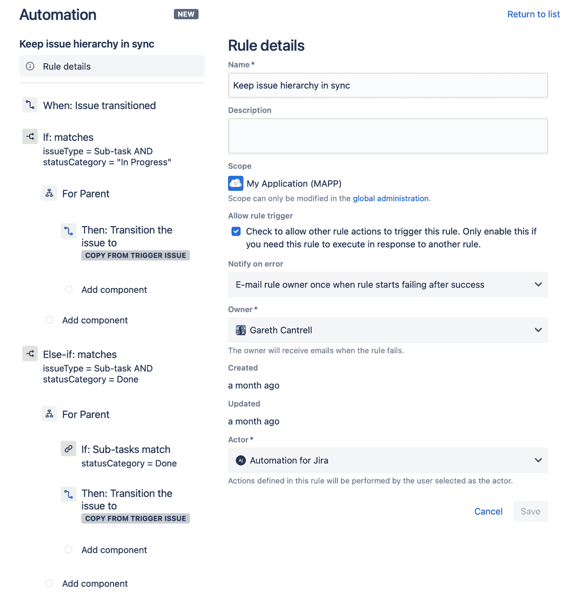
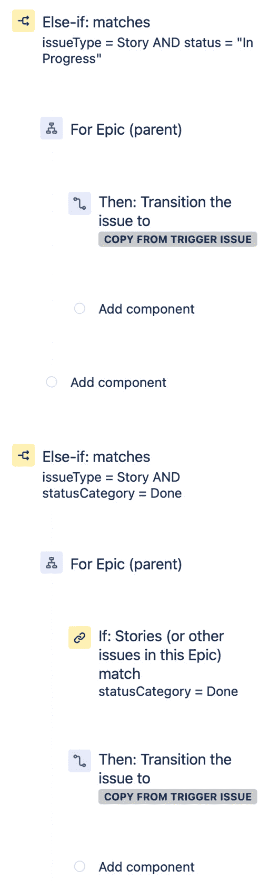
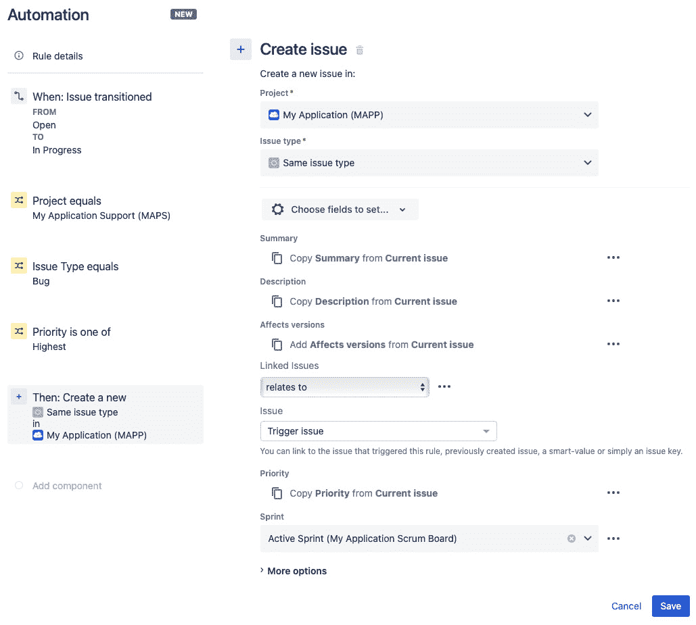
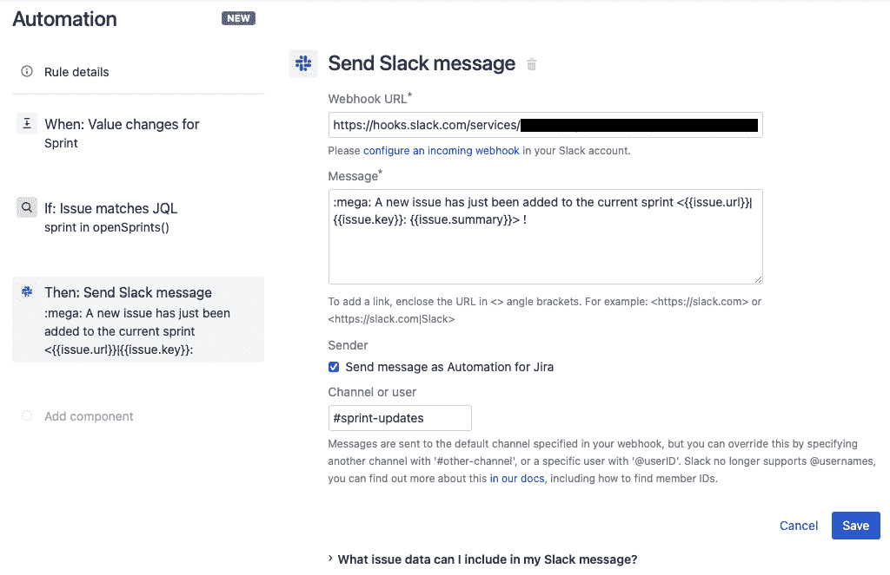

# 第七章：*第七章*：自动化 Jira 软件项目

跟踪软件开发任务和 Bug 是 Jira 最为人所知的功能之一；然而，它一直伴随着管理开销，需要保持问题对齐并确保跨项目的工作同步。

在 Jira 中处理管理任务有时会令人沮丧，通常意味着无法投入更多时间进行实际开发工作。引入自动化可以减少许多手动任务，从而让团队成员更快乐、更高效。

在本章中，我们将学习如何利用自动化规则，为 Jira 软件项目提供简单而有效的生产力提升，例如如何保持跨项目的版本同步。

我们还将看到，如何通过自动化对问题层级的状态进行对齐，从而减少大量手动操作，提升在软件项目中处理问题的效率。

本章将涵盖以下主题：

+   跨项目管理版本

+   确保史诗和故事保持一致

+   管理 Sprint 范围

# 技术要求

本章的要求如下：

+   **Jira 云环境**：如果你尚未获得 Jira 访问权限，可以在[`www.atlassian.com/software/jira/free`](https://www.atlassian.com/software/jira/free)创建一个免费的 Jira 云账户，并确保选择了 **Jira Software** 和 **Jira Service Desk**。

+   **Jira 服务器环境**：如果你正在使用 Jira 服务器（可从[`www.atlassian.com/software/jira/download`](https://www.atlassian.com/software/jira/download)下载），确保你拥有 Jira Software 和 Jira Service Desk 的许可证。此外，你还需要确保安装 *Automation for Jira* 应用，该应用可从 Atlassian 市场获取。

在这两种情况下，你至少需要拥有 **项目管理员** 访问权限，才能在 Service Desk 项目和 Scrum 软件项目中跟随本章的示例进行操作。对于本章中的示例，我们使用了 *IT 服务管理项目模板* 来创建 Service Desk 项目，并使用 *Scrum 软件项目模板* 来创建软件项目。

你可以从本书的官方 GitHub 仓库下载本章的最新代码示例，地址是[`github.com/PacktPublishing/Automate-Everyday-Tasks-in-Jira`](https://github.com/PacktPublishing/Automate-Everyday-Tasks-in-Jira)。请访问以下链接查看 CiA 视频：https://bit.ly/3quqjil

# 跨项目管理版本

一个常见的 Jira 软件项目使用场景是，拥有一个面向公众的项目，客户可以在其中提交缺陷和功能请求，针对已发布的软件，另有一个内部项目供开发团队追踪工作。

拥有这种设置可以让团队筛选传入的请求，并选择相关的问题进行处理，而不会将实际项目中堆积成成千上万的问题。

然而，从这种设置中获得好处要求两个项目中的软件版本保持同步，以便客户能够针对发布的软件的正确版本报告问题。

在本节中，我们将探讨如何使用自动化规则来管理项目之间的版本同步。

为了做到这一点，我们需要确保当我们在内部项目中发布版本时，创建一个对应的版本在面向公众的项目中，客户可以在报告错误或创建功能请求时使用该版本。

让我们来看一个规则，它可以帮助我们在多个项目之间保持版本同步。

## 创建一个规则以保持跨项目版本同步

在这个例子中，我们将创建一个规则，该规则会在我们内部项目发布版本时触发，并在面向公众的项目中创建并发布对应的版本，客户可以在报告问题时使用该版本。

重要提示

创建跨多个项目的自动化规则要求用户创建规则时拥有 Jira 管理员权限。项目管理员不能创建跨项目的规则。

在这个例子中，我们将在规则中使用两个软件项目。对于第一个软件项目，我们将创建一个使用 Scrum 软件模板的项目，命名为*我的应用程序*，项目键为*MAPP*。对于面向公众的支持项目，我们将创建一个使用 Bug 跟踪软件模板的项目，命名为*我的应用程序支持*，项目键为*MAPS*。

让我们来看看如何构建这个规则：

1.  由于我们处理的是多个项目，这个规则需要由拥有 Jira 管理员权限的用户设置。

1.  进入**设置**（顶部菜单中的齿轮图标），选择**系统**，点击左侧菜单中的**自动化规则**选项卡，然后点击**创建规则**。

1.  选择**版本发布**触发器并点击**保存**。

1.  由于这个规则中配置的两个项目都可能触发规则，我们需要确保只有当 MAPP 项目触发时，规则才继续执行。为此，选择`{{version.project.key}}`。

    `equals`

    `MAPP`

1.  接下来，选择`{{version.name}}`智能值，以选择触发规则的版本名称。

    展开**更多选项**，在**项目**字段中选择您的应用支持项目。对于这个例子，它是**我的应用支持 (MAPS)**。

1.  点击`{{version.name}}`智能值以确保发布正确的版本。

1.  接下来，点击`保持支持项目版本同步`。

    设置`多个项目`，并在`我的应用程序`和`我的应用程序支持`中进行选择。

1.  最后，点击**保存**，然后点击**开启**来发布并启用该规则。

在本节中，我们学习了如何使用自动化规则来保持多个项目之间的版本同步，使客户能够在开发项目之外提出错误和功能请求。

在接下来的部分，我们将了解如何确保软件项目中的史诗状态与项目中的基础故事保持一致。

# 确保史诗和故事保持一致

使用**Scrum 敏捷框架**进行软件项目工作通常涉及一套问题类型的层级结构。

在典型的基于 Scrum 的敏捷层级中，你会有史诗来定义较大的工作任务或业务需求，这些任务可能跨越多个迭代周期。

这些被分解为故事（或用户故事），它们是需求的高层次定义，可以在限定的时间周期或迭代中交付。

然后，故事可以被分解为任务，作为故事的子任务，这些任务是完成故事所需的具体、可衡量的工作项。

在本节中，我们将查看如何使用自动化规则来保持这个层级中问题的状态同步，这样当子任务开始工作时，子任务上方的相关问题将自动转换到正确的状态，无需人工干预。

## 创建一个规则以保持史诗和故事的同步

在这个例子中，我们将创建一个规则，当子任务转换到新的状态时触发，并根据子任务的状态，如果需要，规则会自动将其父级故事转换到正确的状态。

此外，我们还将使用相同的规则，当故事转换到新状态时，自动将与故事相关联的史诗转换到正确的状态，因此我们需要允许规则通过其他规则触发。

重要提示

允许规则通过其他规则触发可能会无意中导致执行循环，其中规则可能会被无限触发。自动化规则引擎包括循环检测机制，以防止无限循环；然而，配置不当的规则仍然可能导致执行循环，最多可达到 10 层深度，之后规则执行会被终止。

现在我们来看看这个规则：

1.  在你的 Jira 软件项目中，导航到**项目设置**，点击项目设置菜单中的**自动化**链接，然后点击**创建规则**。

1.  选择**问题转换**触发器并点击**保存**。保持**从状态**和**到状态**字段为空，因为我们希望规则在每次转换时都能触发。

1.  我们首先要检查的是子任务是否已经开始进展，并将其父级故事转移到`issueType = Sub-task AND statusCategory = "In Progress"`。

1.  现在，选择**分支规则/相关问题**，在**相关问题类型**字段中选择**父级**，然后点击**保存**。

1.  然后，选择**新建操作**，接着选择**转换问题**。对于这个例子，确保**目标状态**字段设置为**从触发问题复制**，然后点击**保存**。

1.  规则的下一个阶段是确保当所有子任务完成时，用户故事能够转换为完成状态。为此，点击`issueType = Sub-task AND statusCategory = Done`。

1.  接下来，选择**分支规则/相关问题**，在**相关问题类型**字段中再次选择**父级**，然后点击**保存**。

1.  此时，我们需要检查`子任务`中选定父级问题的所有子任务。

    `所有匹配指定的 JQL`

    `statusCategory = Done`

1.  如果在*第 8 步*中提到的条件匹配，并且故事的所有子任务的状态类别为完成，那么我们需要将故事本身转换为完成状态。为此，选择**新建操作**，然后选择**转换问题**，并确保**目标**字段设置为**从触发问题复制**，然后点击**保存**。

    重要说明

    当你使用**从触发问题复制**来处理状态时，你需要确保两种问题类型使用相同的工作流，或者这些工作流共享相同的状态。如果不是这种情况，你将需要选择你希望转换到的实际状态。

1.  现在我们已经处理好了将故事与其子任务同步的问题，接下来我们需要处理将 Epic 与其底层故事同步的问题。

    首先，我们将处理将 Epic 移动到`issueType = Story AND status = "In Progress"`。

1.  然后，选择**分支规则/相关问题**，在**相关问题类型**字段中选择**Epic（父级）**，然后点击**保存**。

1.  接下来，选择**新建操作**，然后选择**转换问题**。确保**目标**字段设置为**从触发问题复制**（对于本示例），然后点击**保存**。

1.  该规则中的最终条件分支将确保当所有底层故事完成时，Epic 自动转换为完成状态。

    通过点击`issueType = Story AND statusCategory = Done`来完成此操作。

1.  现在，选择`Epic（父级）`并点击**保存**。

1.  像我们为子任务做的那样，我们需要确保 Epic 中的所有故事都完成后，才能自动将 Epic 转换为完成状态。

    我们通过选择`Stories（或此 Epic 中的其他问题）`来完成此操作。

    `所有匹配指定的 JQL`

    `statusCategory = Done`

1.  为了真正地转换 Epic，我们需要添加一个操作，选择**新建操作**，然后选择**转换问题**。

    确保**目标**字段设置为**从触发问题复制**（对于本示例），然后点击**保存**。

1.  这个规则的一个要求是它能够触发自身，确保层级中的所有问题都更新到正确的状态。

    为了实现这一点，我们需要设置一个允许规则由其他规则触发的规则选项。

    在左侧的规则链视图中选择**规则详情**。在**名称**字段中，将规则名称设置为**保持问题层级状态同步**，并确保选中**允许规则触发**复选框。

    你的规则应该类似于以下两张截图：

    

    ](img/B16551_Figure_7.2.jpg)

    图 7.2 – 保持史诗与故事同步的规则（第一部分）

    在前面的截图中，我们可以看到规则的详细信息，以及处理保持故事与子任务同步的规则链的第一部分。

    

    ](img/B16551_Figure_7.3.jpg)

    图 7.3 – 保持史诗与故事同步（第二部分）

    在这张截图中，我们可以看到规则链的第二部分，它处理保持史诗与其底层用户故事同步的问题。

1.  最后，点击 **保存**，然后点击 **启用** 以保存并发布规则。

在这一节中，我们学习了如何使用自动化规则保持问题层级之间的同步，以及如何允许规则触发自身来实现这一目标。

在下一节中，我们将看看如何通过将关联问题自动添加到当前冲刺中来调整冲刺的范围，并在冲刺范围发生变化时通知团队。

# 管理冲刺的范围

在任何开发生命周期中，难免会在某些时刻由于需求的临时变化或需要包括紧急 bug 修复，导致冲刺范围的变化。

在这一节中，我们首先将探讨如何通过将一个新关联的问题添加到冲刺中来改变冲刺的范围。

我们还将探讨如何使用自动化规则监控冲刺，并在冲刺范围变化时通知团队。

## 创建规则以将关联问题添加到冲刺中

在这个例子中，我们将利用我们拥有的两个项目：一个是私有的内部软件开发项目（*我的应用程序*，关键字 *MAPP*），另一个是公共支持项目（*我的应用程序支持*，关键字 *MAPS*），客户可以在该项目中提交请求和报告错误。

我们还将假设有一个团队在监控公共支持项目，并处理收到的请求。

这部分处理包括检查由组织的顶级客户提交的高优先级 bug，如果验证通过，将在私有开发项目中创建一个关联 bug，并将其添加到当前冲刺中。

让我们看看如何通过自动化规则实现这一目标：

1.  由于我们正在处理的不仅仅是一个项目，因此这个规则需要由具有 Jira 管理员权限的用户来设置。

1.  转到 **设置**（顶部菜单中的齿轮图标），选择 **系统**，然后点击左侧菜单中的 **自动化规则** 标签，并点击 **创建规则**。

1.  选择 `待办`

    `进行中`

1.  接下来，我们需要添加一些条件，确保我们只选择支持项目中优先级最高的 bug。

    在这个例子中，我们将使用多个问题字段条件，因为它们比使用 JQL 条件具有性能优势。

1.  通过选择 `项目` 来检查正确的项目

    `等于`

    `我的应用程序支持（MAPS）`

1.  接下来，我们将确保此规则仅适用于 bug 类型的问题。

    选择 `问题类型`

    `等于`

    `Bug`

1.  最后的条件是检查该 bug 是否为最高优先级。

    选择 `优先级`

    `是其中之一`

    `最高`

1.  此规则的最后一步是创建关联问题并将其添加到当前的开发项目和冲刺中。

    选择 `My Application (MAPP)`

    `相同问题类型`

    `与...相关`

    `触发问题`

    `当前冲刺（My Application Scrum Board）`

    你的规则现在应该类似于以下截图：

    

    图 7.4 – 在当前冲刺中创建关联问题

1.  最后，选择 `将关键 bug 添加到当前冲刺`。

    将 **范围** 字段设置为 **多个项目**，在 **限制为项目** 字段中，选择你的内部和支持项目。在这个例子中，我们将选择 **My Application** 和 **My Application Support**。

1.  最后，点击 **保存**，然后点击 **启用** 来发布并启用规则。

在这个示例中，我们学会了如何使用自动化规则创建项目中的关联问题并将其添加到当前冲刺。

在下一个示例中，我们将展示如何监控当前冲刺的范围变化，并在发生变化时通知开发团队。

## 创建一个规则，当范围发生变化时通知团队

当当前冲刺的范围发生变化时，我们希望让团队保持知情，这样团队中的每个人都能了解发生了什么。

为了实现这一点，我们将创建一个规则，监听问题中 **冲刺** 字段的变化，如果该冲刺当前是激活的冲刺，我们将向团队的 Slack 渠道发送通知。

在这个示例中，我们将通过我们在 *第四章* 中设置的 Slack 集成，将通知发送到 **#sprint-updates** Slack 渠道，*发送自动化通知*。

让我们看看这个规则是如何工作的：

1.  在你的 Jira Software 项目中，导航至 **项目设置**，点击 **项目设置** 菜单中的 **自动化** 链接，然后点击 **创建规则**。

1.  由于没有直接的方式来监控当前冲刺的变化，我们将设置规则，在问题的 **冲刺** 字段发生更改时触发。

    为了实现这一点，我们将选择 **字段值更改** 触发器。在 **监控更改的字段** 下拉菜单中选择 **冲刺**。

    保持 **For** 字段为空，选择 **所有问题操作**，然后点击 **保存**。

1.  我们需要确保问题添加到的冲刺与当前激活的冲刺相对应。

    我们可以通过选择 `冲刺在 openSprints()` 来实现此功能

1.  接下来，我们将选择 `#sprint-updates`。

    你的规则应类似于以下截图：

    

    图 7.5 – 监控冲刺范围变化

1.  我们还需要确保这个规则可以被其他自动化规则触发；否则，其他规则所创建的范围变更将不会触发通知。

    在规则链视图的左侧选择**规则详情**。在**名称**字段中，将规则名称设置为**当冲刺范围变化时发送通知到 Slack**，并确保勾选了**允许规则触发**复选框。

1.  最后，点击**保存**，然后点击**启用**以发布并启用该规则。

在这个示例中，我们学习了如何使用问题中的冲刺字段来监控冲刺的范围变化，并保持团队对这些变化的知情。

通过使用自动化减少手动操作，保持问题同步并及时更新团队，你将使团队更高效，因为他们不再需要管理项目工具，而可以专注于实际任务。

# 摘要

在本章中，我们学习了如何使用自动化规则来最小化管理和操作 Jira 软件项目时通常涉及的管理开销，事实上，这些规则可以应用于 Jira 中的大多数项目类型。

特别是，我们学习了如何在项目之间保持版本同步，当你有一个跨多个 Jira 项目的软件项目时，这一点尤其有用，无论这些项目是内部团队项目，还是像我们示例中的那样，供客户记录和跟踪请求的公共项目。

保持问题层次结构同步是 Jira 项目中非常常见的任务，在本章中，我们学习了如何使用循环规则来实现这一点，利用 Jira 软件项目中最常见的层次结构。最后，我们学习了如何保持对冲刺范围变化的可见性，并且如何使用自动化调整冲刺范围。

除了我们所看到的与冲刺相关的示例，本章中讨论的主题同样适用于任何其他类型的软件开发，包括看板和瀑布流，只需做一些小的调整。

将本章中学到的知识应用到你的项目中，使用自动化规则将有助于减少手动和重复的行政工作，从而使用户更加高效和富有生产力。

在下一章，我们将探讨如何利用自动化规则与 GitHub 和 Bitbucket 等工具集成，以支持 DevOps 流程。
