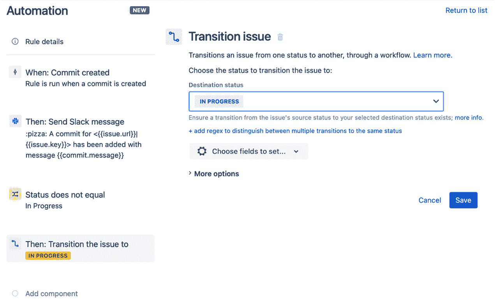

# *第八章*：与 DevOps 工具集成

DevOps 的核心原则之一，在于在组织内培养相关文化的同时，通过使用技术来自动化和优化流程。通过在 Jira 中使用自动化规则，我们可以通过将 Bitbucket 和 GitHub 等 DevOps 工具与 Jira 中的问题连接，优化软件开发流程，从而实现问题状态的自动同步。

除了自动将问题状态与代码提交同步外，我们还可以利用自动化来跟踪和同步拉取请求，创建任务来追踪这些请求，并向团队发送通知，以确保过程的最大可见性。所有这些都能使开发人员更多时间专注于编写和交付软件，而减少管理行政任务的时间。

虽然通过工作流触发器在 Jira 中集成某些 DevOps 流程（过去和现在）是可能的，但在本章中，我们将探讨如何使用自动化规则来创建比以往更加灵活的集成方式。这将保持你的工作流配置简洁，并防止冗长的工作流更新，尤其是当工作流影响大量问题时。

本章将涵盖以下主题：

+   同步问题和 Git 提交

+   跟踪拉取请求

+   使用 GitHub 自动发布版本

+   与冲刺完成同步部署

# 技术要求

本章的要求如下：

+   **Jira Cloud 环境**：如果你还没有 Jira 访问权限，可以在[`www.atlassian.com/software/jira/free`](https://www.atlassian.com/software/jira/free)创建一个免费的 Jira Cloud 账户，并确保选择了 Jira Software 和 Jira Service Management。

+   **Jira Server 环境**：如果你使用的是 Jira Server（可以在[`www.atlassian.com/software/jira/download`](https://www.atlassian.com/software/jira/download)下载），请确保你拥有 Jira Software 和 Jira Service Management 的许可。此外，你还需要确保安装*Automation for Jira*应用，该应用可以在 Atlassian Marketplace 中找到。

对于 Jira，你需要至少拥有**项目管理员**权限，才能访问 Scrum 软件项目并跟随本章的示例。在本章的示例中，我们使用了*Scrum 项目模板*来创建软件项目。

你还需要访问以下工具：

+   **Bitbucket Cloud**：Bitbucket Cloud 是 Atlassian 提供的托管 Git 版本控制服务。你可以在[`bitbucket.org`](https://bitbucket.org)注册 Bitbucket 账户，或者通过你的 Jira Cloud 账户使用应用切换器。

+   **GitHub**：GitHub 是微软提供的托管软件开发和基于 Git 的版本控制服务。你可以在[`github.com`](https://github.com)注册 GitHub 账户。

+   **Jenkins**：Jenkins 是一个流行的免费开源自动化服务器，用于通过自动化构建、测试和部署软件项目来促进**持续集成**（**CI**）和**持续交付**（**CD**）。你可以从 [`www.jenkins.io`](https://www.jenkins.io) 下载 Jenkins。

你可以从本书的官方 GitHub 仓库下载本章的最新代码示例，网址是 [`github.com/PacktPublishing/Automate-Everyday-Tasks-in-Jira`](https://github.com/PacktPublishing/Automate-Everyday-Tasks-in-Jira)。请访问以下链接查看 CiA 视频：[`bit.ly/2XWeuW7`](https://bit.ly/2XWeuW7)

# 同步问题和 Git 提交

在编写软件的正常过程中，开发者通常会将一个故事或任务移动到**进行中**状态，进行实际的代码编写，将更改提交到如 Bitbucket 或 GitHub 等源代码仓库，然后返回 Jira，将故事或任务移至工作流中的下一个状态。

所有这些手动操作都需要不必要的上下文切换，而且由于这一过程要求开发者记得在不同工具之间切换，因此很可能有时问题没有得到更新，这使得追踪项目的实际进展变得更加困难。

Jira 已经具备了与 Bitbucket 和 GitHub 等工具集成的能力，允许管理员通过在各种工作流转换上配置触发器来设置底层的 Jira 工作流。

虽然这种方法确实可以自动化过程，并解放开发者不需要手动更新任务状态，但它仅限于触发器配置的转换。此外，调整工作流并不总是一个简单的任务。

通过使用自动化规则，我们在同步代码提交与对应 Jira 问题时获得了更多的灵活性。

让我们来看看如何利用自动化规则实现这一点。

## 创建一个规则以在代码提交时转换问题

在本例中，我们将创建一个规则，监听通过 Bitbucket Cloud 创建的提交，如果对应的问题还没有处于**进行中**状态，则将其转换为该状态。

此外，我们会为每次提交发送消息到 *#sprint-updates* Slack 频道，这个频道是在*第四章*中设置的，*发送自动通知*。但实际上，你可能并不想用提交通知骚扰开发者，而是希望等到更重要的事件，比如创建拉取请求时，再发送通知。

小贴士

为了让自动化规则识别需要更新的问题，提交信息需要包含问题键。如果你的开发人员为他们工作的每个问题创建一个分支，则问题键需要作为分支名称的一部分。在这两种情况下，问题键必须遵循 Jira 的标准格式，即项目键后跟一个短横线，再加上问题编号。例如，如果项目键是 PROJ，问题编号是 123，则问题键将是*PROJ-123*。

首先，让我们看看在*Jira Cloud*中如何使用可用于自动化规则的 DevOps 触发器来构建此规则：

1.  在你的 Jira 软件项目中，进入**项目设置**，点击**项目设置**菜单中的**自动化**链接，然后点击**创建规则**。

1.  选择**提交创建**触发器，然后点击**保存**。

    提示

    如果你还没有为项目配置 Git 提供者，提交创建触发器将提示你创建连接，你可以点击**立即连接**链接来创建连接。

1.  接下来，我们将发送一条 Slack 消息到`#sprint-updates`

1.  在此步骤中，我们将添加一个条件来检查问题的当前状态是否不是`状态`

    `不等于`

    `进行中`

1.  接下来，如果*步骤 4*中的条件满足，我们将把问题转换为**进行中**。

    点击**新动作**，然后选择**转换问题**。将**目标**字段设置为**进行中**，然后点击**保存**。

    你的规则现在应该类似于以下截图：

    

    图 8.1 – 使用 DevOps 触发器来同步提交

1.  最后，命名规则为`Transition to In Progress on commit`，然后点击**开启**以保存并发布该规则。

Jira Server 和 Data Center 的自动化规则目前不包括 DevOps 触发器，因此我们需要利用传入 Webhook 触发器来实现类似的结果。

在本示例中，我们将首先在 Jira 中设置传入的 Webhook 自动化规则，然后复制生成的 Webhook URL，这将在设置 Bitbucket Cloud 仓库中的传出 Webhook 时使用。

现在，让我们来看看如何在*Jira Server*或*Jira Data Center*中构建此规则：

1.  在你的 Jira 软件项目中，进入**项目设置**，点击**项目设置**菜单中的**项目自动化**链接，然后点击**创建规则**。

1.  Bitbucket Cloud 在创建提交时会发送一个*推送*Webhook，并发送一个 Webhook 负载，更多信息请查看[`support.atlassian.com/bitbucket-cloud/docs/event-payloads/#EventPayloads-entity_repository`](https://support.atlassian.com/bitbucket-cloud/docs/event-payloads/#EventPayloads-entity_repository)。

    在这个例子中，我们假设问题键存在于提交消息中而不是分支名称中。我们需要从提交消息中提取问题键，以便查找正确的 Jira 问题。根据前述链接中详细的 Bitbucket 负载结构，我们可以找到提交消息并使用以下智能值提取问题键：

    ```
    {{webhookData.push.changes.first().new.target.message.match("([A-Z][A-Z0-9]+-\d+)")}}
    ```

    提示

    如果你是按问题使用分支，并且问题键编码在分支名称中，你可以使用以下智能值从分支名称中提取问题键：`{{webhookData.push.changes.first().new.target.name.match("([A-Z][A-Z0-9]+-\d+)")}}`。

    选择`通过运行以下 JQL 查询提供的 Issue`

    `key = {{webhookData.push.changes.first().new.target.message.match("([A-Z][A-Z0-9]+-\d+)")}}`

1.  接下来，我们将向`#sprint-updates`发送一条 Slack 消息。

1.  在此步骤中，我们将添加一个条件，检查问题的当前状态是否不是`状态`。

    `不等于`

    `进行中`

1.  接下来，如果*第 4 步*的条件满足，我们将把问题状态转换为**进行中**。

    点击**新建操作**，然后选择**转换问题**。将**目标**字段设置为**进行中**，然后点击**保存**。

    你的规则现在应该类似于下图所示：

    

    图 8.2 – 使用传入的 Webhook 触发器同步提交

1.  将规则命名为`在提交时转换为进行中`，然后点击**启用**以保存并发布该规则。

1.  接下来，我们需要在 Bitbucket Cloud 中配置出站 Webhook。

    导航到 Bitbucket Cloud 中的仓库，点击`提交时转换 Jira 问题`，并将步骤 2 中生成的传入 Webhook URL 粘贴到**URL**字段中。

    保持其他字段为默认值并点击**保存**。

    你的 Bitbucket Cloud Webhook 应该类似于下图所示：


图 8.3 – 在 Bitbucket Cloud 中配置推送 Webhook

现在，我们已经完成了 Bitbucket Cloud 中的 Webhook 设置，任何推送到 Bitbucket 仓库的提交都会向*第 2 步*中自动生成的**Webhook URL**发送请求，触发我们的自动化规则并转换与该提交相关的问题状态。

在这一部分，我们已经学会了如何使用 Jira Cloud 中的 DevOps 触发器，自动将 Jira 问题与 Bitbucket Cloud 中托管的 Git 仓库提交同步。

重要提示

Jira Cloud 中的 DevOps 触发器，如 Commit 创建，适用于大多数主流 Git 仓库，包括 Bitbucket Cloud、GitHub 和 Gitlab，我们之前看过的 Jira Cloud 示例也可以在这些工具中直接使用。

我们还看了如何通过专门在提交消息中使用问题关键字的 Bitbucket Cloud 传入 Webhook 来为 Jira Server 和 Jira Data Center 实现类似的结果。

在下一节中，我们将讨论如何使用自动化规则来跟踪在基于 Git 的仓库中创建的拉取请求。

# 跟踪拉取请求

DevOps 实践的一个常见特点是使用所谓的基于主干的开发方法，这是**持续集成**和**持续交付**或**开发（CI/CD）**应用于软件开发过程的关键推动力。

实现这一点的方式之一是使用从主分支（或主干）分出的短生命周期分支来执行开发任务。Jira 通过允许开发者在配置了像 Bitbucket 或 GitHub 这样的源代码管理仓库时，自动为每个开发任务创建分支，来方便这一点。

这些短生命周期的分支通常通过拉取请求（pull requests）合并回主干/主分支，拉取请求允许开发者在合并到主分支之前，审查软件中引入的变更。

在本节中，我们将看到如何使用自动化规则来跟踪这些拉取请求，这些请求通常直接发生在源代码控制仓库中，并自动同步和过渡 Jira 中的相关问题。

我们还将看到如何创建自动化任务来跟踪拉取请求。这些跟踪任务将使产品负责人和团队能够快速查看哪些问题已经合并而没有拉取请求，或者哪些问题存在未解决的拉取请求，而无需离开 Jira。

让我们来看一下第一个规则，它将同步开发问题并创建跟踪任务。

## 创建一个规则来跟踪新的拉取请求

在这个示例中，当管理拉取请求时，我们首先想要实现的是将相应的开发问题转换为**等待审查**状态，然后在 Jira 中创建一个与正在审查的开发问题相关联的跟踪任务。

提示

为了使这个示例正确工作，**等待审查**状态需要添加到你的工作流中。如果你使用了*Scrum 软件项目模板*的默认工作流，你可以通过在看板配置中向 Scrum 看板添加一个新列来完成。如果你使用的是自定义工作流，则需要编辑工作流以添加此状态。

此外，我们会向团队发送 Slack 消息，通知他们已经创建了一个新的拉取请求任务。这样开发团队的任何成员都可以接手并审查该拉取请求。

让我们来看一下如何构建这个规则：

1.  在你的 Jira 软件项目中，导航到**项目设置**，点击项目设置菜单中的**自动化**链接，然后点击**创建规则**。

1.  选择**拉取请求已创建**触发器，然后点击**保存**。

1.  接下来，我们要将开发问题的状态转换为**等待审查**。

    选择**新动作**，然后选择**转换问题**，接着在**目标状态**字段中选择**等待审查**选项，然后点击**保存**。

1.  然后我们需要创建 Jira 任务来跟踪此拉取请求。

    选择`同一项目`

    `任务`

    `审查 PR：{{pullRequest.title}}`

    `需要审查的 PR：{{pullRequest.title}}`

    `源分支：{{pullRequest.sourceBranch}}`

    `目标分支：{{pullRequest.destinationBranch}}`

    `访问 PR 链接：{{pullRequest.url}}`

    `阻塞`

    `触发问题`

1.  要通过 Slack 向团队发送通知，我们将选择`:bellhop_bell: 一个新的拉取请求已创建并准备好审查 <{{createdIssue.url}}|{{createdIssue.key}}>`

    `#slack-updates`。

    你的规则应类似于以下截图：

    

    图 8.4 - 跟踪新拉取请求的规则

1.  最后，将规则命名为`跟踪新拉取请求`，然后点击**启用**以保存并启用该规则。

在此示例中，我们学习了如何使用 Jira Cloud 中内置的 DevOps 触发器，在连接的 Git 工具（如 Bitbucket 和 GitHub）中创建新的拉取请求时触发规则，前提是这些工具已在 Jira 中配置并与软件项目连接。

本节中我们要查看的第二个规则将通过处理拉取请求已批准并合并的情况来完成管理拉取请求的循环。

## 创建一个管理已合并拉取请求的规则

在这个示例中，我们将创建一个自动化规则，当拉取请求被合并时触发。此时，我们希望将开发问题的状态从**等待审查**转换为**等待部署**。

提示

为了使此示例正确工作，需要在你的工作流中添加**等待部署**状态。如果你使用的是*Scrum 软件项目模板*的默认工作流，可以通过在看板配置中添加新列来实现。如果你使用的是自定义工作流，则需要编辑工作流以添加此状态。

此外，我们还希望自动将我们在**跟踪新拉取请求**规则中创建的跟踪任务状态转换为**已完成**。

现在让我们来看一下如何构建一个规则来实现这个目标。

1.  在你的 Jira 软件项目中，导航到**项目设置**，点击**项目设置**菜单中的**自动化**链接，然后点击**创建规则**。

1.  选择**拉取请求已合并**触发器，然后点击**保存**。

1.  由于我们只希望在问题处于*等待审查*状态时才进行转换，因此需要设置一个条件来检查这一状态。

    选择`状态`

    `等于`

    `等待审查`

1.  接下来，选择**新动作**，然后选择**转换问题**，接着在**目标状态**字段中选择**等待部署**，然后点击**保存**。

1.  现在我们想要自动过渡我们在*创建规则以跟踪新的拉取请求*部分中创建的跟踪任务到`关联问题`

    `被阻塞`

1.  由于可能会有其他任务通过相同的链接类型与此问题关联，我们希望确保只自动过渡跟踪任务，因此我们需要另一个条件。

    选择`摘要`

    `以...开始`

    `审查 PR:`

1.  现在选择**新动作**，然后选择**过渡问题**。在**目标状态**字段中，选择**已完成**，然后点击**保存**。

    该规则现在应该与以下截图类似：

    

    图 8.5 – 用于管理拉取请求合并的规则

1.  最后，给规则命名为`管理拉取请求合并`，然后点击**启用**以保存并启用规则。

我们现在知道如何通过自动化规则将拉取请求与 Jira 集成。首先，确保开发问题与开发团队实际执行的工作同步，其次，跟踪哪些问题已经或仍然需要合并到主分支。在下一部分，我们将看到如何具体使用自动化规则与 GitHub 中的发布功能进行集成。

# 使用 GitHub 自动发布版本

版本控制工具允许开发者对源代码的特定修订进行标记，这实际上创建了一个时间点上的代码库快照。标签的最常见用途是标识构成特定版本或发布的软件的源代码组件和文件，像 GitHub 和 GitLab 这样的工具进一步推动了这一点，它们允许开发者基于特定标签创建一个发布版本。这些版本通常包含适用于该版本的变更列表，形式为发布说明。它们还可以包含指向构成发布的资产列表的链接，这些资产通常是可下载的二进制包。

发布可以通过工具的用户界面创建，但最常见的是通过构建工具（如 Bitbucket Pipelines 或 Jenkins）在成功完成部署构建后自动创建。这些工具反过来可以触发 webhook 事件，在发布被创建时通知其他工具。

使用 Jira 中的自动化规则，我们可以使用传入的 webhook 接收这些通知，并自动发布 Jira 中的相应版本，同时将所有与该版本关联的受影响问题过渡到*已完成*。现在让我们来看一个可以帮助我们实现这一目标的规则。

## 创建一个规则以同步版本发布到 GitHub 发布

在这个规则中，我们将创建一个可以被 GitHub 调用的传入 webhook，当发布被创建时，GitHub 发布 webhook 会包含一个 JSON 负载，我们将能够从中提取出标识发布的标签名称。反过来，这个标签名称应该与 Jira 软件项目中的版本相对应。

GitHub 发布负载的结构类似于以下内容，我们将在规则中使用`action`和`tag_name`字段：

```
{
  "action": "published",
  "release": {
    ...
    "tag_name": "1.0",
    ...
  }
}
```

你可以在以下网址阅读更多关于事件负载的信息：`docs.github.com/en/free-pro-team@latest/developers/webhooks-and-events/webhook-events-and-payloads#release`。

你还可以在以下网址了解更多关于 GitHub webhook 和事件的内容：`docs.github.com/en/free-pro-team@latest/developers/webhooks-and-events/about-webhooks`。

让我们来看一下创建自动化规则所需的步骤，以便在从 GitHub 发布版本时同步 Jira 版本的发布：

1.  在你的 Jira 软件项目中，导航到**项目设置**，点击**项目设置**菜单中的**自动化**链接，然后点击**创建规则**。

1.  选择**传入 webhook**触发器，并在**使用此自动化规则时**字段中选择**没有来自 webhook 的问题**选项，然后点击**保存**。

    请确保复制自动生成的 webhook URL，因为我们稍后需要它来配置 GitHub webhook。

1.  GitHub 会为发布的不同状态发送 webhook 事件；但是，对于此规则，我们只关心在发布版本时执行该事件，具体可以通过查看`{{webhookData.action}}`来判断。

    `equals`

    `published`

1.  如果*步骤 3*中的条件匹配，首先要做的是自动将所有属于该版本并且当前等待部署的问题转移到`JQL`

    `fixVersion = {{webhookData.release.tag_name}} AND status = "Waiting for deploy"`

1.  然后我们选择**新建操作**，接着选择**转移问题**，在点击**保存**之前，将**目标状态**字段设置为**完成**。

1.  接下来，我们希望发布与 GitHub 版本的标签名称对应的 Jira 版本。

    我们需要在`{{webhookData.release.tag_name}}`之外执行此操作，然后点击**保存**。

    规则现在应该看起来像以下屏幕截图：

    

    图 8.6 – 从 GitHub 自动发布 Jira 版本

1.  最后，将规则命名为`与 GitHub 发布同步版本`，然后点击**启用**以保存并启用此规则。

现在我们在 Jira 中有了自动化规则，我们需要使用*步骤 2*中生成的 webhook URL 完成 GitHub 配置。

现在，让我们配置我们的 GitHub 仓库，将发布通知发送到 Jira 中的自动化规则：

1.  导航到你在 GitHub 中的仓库，点击**设置**，从左侧菜单选择**Webhooks**标签，然后点击**添加 webhook**按钮。

1.  按如下方式填写 Webhook 字段：

    `application/json`

    `启用 SSL 验证`

1.  为了确保我们在自动化规则中接收到正确的事件，请在**您希望触发此 Webhook 的事件**字段中选择**让我选择单独的事件**选项。

    确保取消选择**Pushes**选项，选择**Releases**选项，然后点击**添加 Webhook**。

    您的 GitHub 配置应类似于以下屏幕截图：


图 8.7 – 配置 GitHub 中的 Releases Webhook

我们现在已经学习了如何将 Jira 与 GitHub Releases 集成，并且如何在将所有受影响的开发任务转移到**完成**状态后，使用自动化规则在 Jira 中发布相应版本。在下一节中，我们将学习如何在冲刺完成时，使用 Jenkins 自动启动部署构建。

# 与冲刺完成同步部署

在敏捷 Scrum 中，一个在冲刺期间创建的工件是**产品增量**，它是通过完成产品待办事项中的任务所产生的可交付成果。在本节中，我们将学习如何通过自动化规则与 Jenkins 集成，以便在 Jira 中的冲刺关闭时自动启动最终部署构建。

在一个冲刺期间，在基于主干的开发模型中，开发人员会将代码提交到与开发任务相关的源代码库中的分支，这通常会启动自动化测试，以验证新代码不会对构建过程产生负面影响。当创建并合并拉取请求时，可以进一步启动自动化测试，随后是自动化部署到 QA 或预发布服务器。到冲刺完成时，所有这些过程最终会导致将生成的产品增量部署到生产环境，或者通过像 GitHub 这样的工具创建发布。

让我们看看如何通过自动化规则实现这一目标。

## 创建启动部署构建的规则

在本例中，我们将创建一个规则，每当冲刺完成时，都会启动一个软件项目的生产构建。为了实现这一目标，我们首先需要在 Jenkins 中配置作业，以允许通过脚本远程触发构建。

提示

如果你还没有 Jenkins 实例，可以在 [`aws.amazon.com`](https://aws.amazon.com) 注册一个 AWS 账户，并基于 *Jenkins Certified by Bitnami* AMI 启动一个新的 EC2 实例。此 AMI 包含了如何在 AWS 中启动并运行 Jenkins 的完整说明。

我们将从导航到 Jenkins 中的项目开始。在项目的**配置**屏幕中，选择**构建触发器**选项卡，然后选择**远程触发构建**选项。Jenkins 需要提供一个身份验证令牌，以确保只有知道此令牌的远程系统才能启动构建作业。

这个令牌可以是您选择的任何文本字符串。在我们的示例中，我们将使用 `MY_SECURE_AUTH_TOKEN` 作为 **身份验证令牌**。配置好 Jenkins 后，**构建触发器**部分应该类似于以下截图：


图 8.8 – 配置 Jenkins 以允许远程触发构建

现在我们已经配置好了 Jenkins，接下来我们来构建一个自动化规则，在冲刺完成时启动部署：

1.  在您的 Jira 软件项目中，导航到 **项目设置**，点击 **项目设置** 菜单中的 **自动化** 链接，然后点击 **创建规则**。

1.  选择 **冲刺完成** 触发器，在 **看板** 字段中选择您的项目的 Scrum 看板，然后点击 **保存**。在这个例子中，我们将选择 **我的应用程序 Scrum 看板**。

1.  向 Jenkins 发送 API 请求需要我们从 Jenkins 令牌颁发服务获取一个 API 令牌。该服务返回一个令牌，我们随后需要在与 API 交互时使用，格式如下：

    ```
    {
        "_class": "hudson.security.csrf.DefaultCrumbIssuer",
        "crumb": "18b1846…",
        "crumbRequestField": "Jenkins-Crumb"
    }
    ```

    为此，选择 `https://<your_jenkins_host>/crumbIssuer/api/json`

    `Authorization`

    `Basic <your base64-encoded credentials>`

    `GET`

    `空`

    `{{webhookResponse}}` 智能值。

1.  接下来，我们需要调用 Jenkins API 来启动我们在 Jenkins 中配置的部署构建。

    我们还需要在 *步骤 3* 中通过 *Jenkins-Crumb* 头发送我们获取到的 Jenkins 令牌。

    再次选择 `https://<your_jenkins_host>/job/<your_job_name>/build?token=<YOUR_AUTHORIZATION_TOKEN>`

    在第一个 `Authorization` 中填写以下内容

    `Basic <your base64-encoded credentials>`

    填写以下第二个 `Jenkins-Crumb`

    `{{webhookResponse.body.crumb}}`

    `POST`

    `空`

    `{{webhookResponse}}` 智能值。

1.  如果在 Jenkins 中成功启动构建，我们希望将所有在冲刺中等待部署的问题转换为 `{{webhookResponse}}` 智能值，该值始终包含来自最新 `{{webhookResponses}}` 列表的响应，该列表将按 Web 请求操作的顺序包含响应，从位置零（0）开始。还请注意，只有在您检查了 `{{webhookResponse.status}}` 后，响应才会添加到此列表中。

    `完全匹配正则表达式`

    `2\d\d`

1.  接下来，选择 **分支规则 / 相关问题**，然后在 **相关问题类型** 字段中选择 **冲刺中的问题**，然后点击 **保存**。

1.  然后，选择 `Status`

    `等于`

    `等待部署`

1.  现在，我们需要根据 *步骤 7* 中的条件转换这些问题。

    选择 **新建动作**，然后选择 **转换问题**。在 **目标状态** 字段中，选择 **已完成**，然后点击 **保存**。

    您的规则应类似于以下截图：

    

    图 8.9 – 冲刺关闭时启动 Jenkins 部署的规则

1.  最后，将规则命名为`开始部署（冲刺关闭时）`，然后点击**启用**以保存并启用规则。

这就结束了本章的最后一部分，在这一部分中，我们学习了如何使用自动化规则与 Jenkins 集成，在冲刺完成时自动启动部署构建，并将所有受影响的开发任务转移到**已完成**。

# 总结

在本章中，我们已经学会了如何通过使用自动化规则，通过优化我们的开发和运维流程，来帮助我们改进 DevOps 实践。

我们介绍了如何使用 Jira Cloud 中内置的 DevOps 自动化触发器，与我们的源代码仓库（如 Bitbucket 或 GitHub）进行集成。这使我们能够将 Jira 中的开发任务与提交到源代码仓库的代码保持同步。

此外，我们还学会了如何在使用 Jira Server 或 Data Center 时，通过在规则中使用传入 Webhook 来实现类似的集成，而不是使用 Jira Cloud 中的 DevOps 触发器。

接下来，我们学习了如何使用 Jira Cloud 中可用的 DevOps 拉取请求触发器，自动同步 Jira 中的开发任务。我们还学会了如何创建和管理跟踪任务，这些任务为 Jira 中的整体开发过程提供了更大的可视性。

接着我们学习了，在使用 GitHub 管理软件发布时，如何利用自动化规则将受影响的 Jira 问题转移到**已完成**状态，并在创建 GitHub 发布时，如何自动保持 Jira 中的版本同步。最后，我们学会了如何在 Jira 中完成冲刺时，自动启动 Jenkins 中的软件项目部署构建。

通过将自动化规则引入我们的 Jira 流程，我们可以简化我们的 DevOps 流程，并大幅减少开发人员在多个工具中执行任务所需的时间。

在下一章中，我们将探索在 Jira 中创建自动化规则时需要遵循的一些最佳实践。
