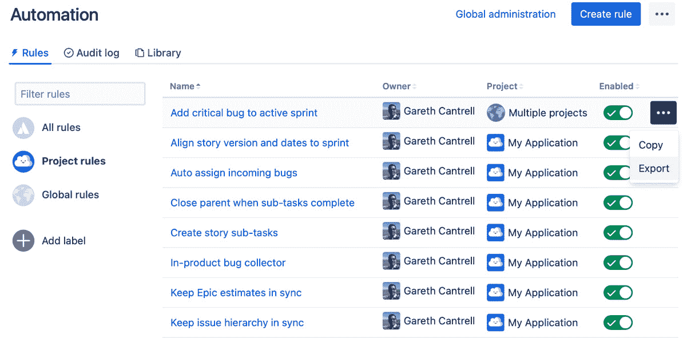
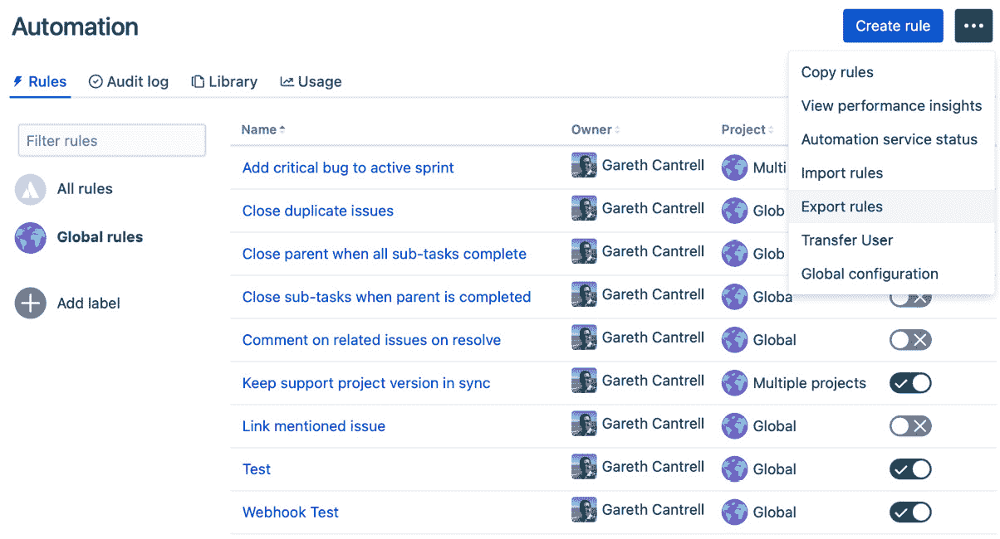
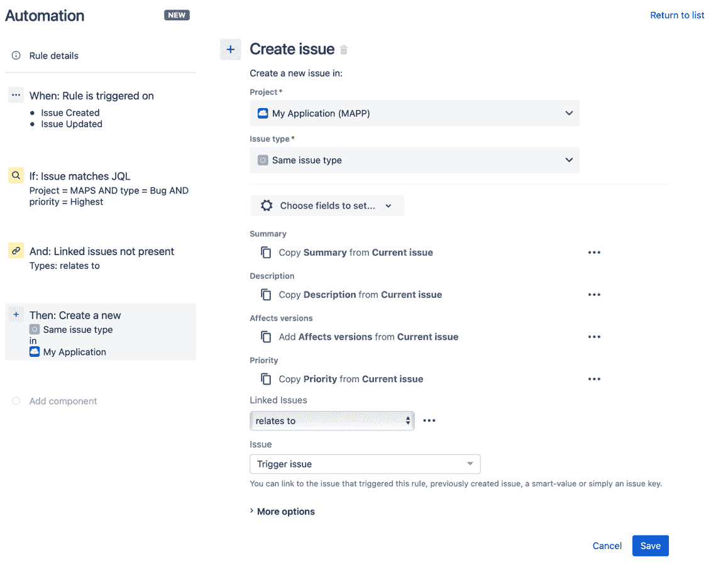
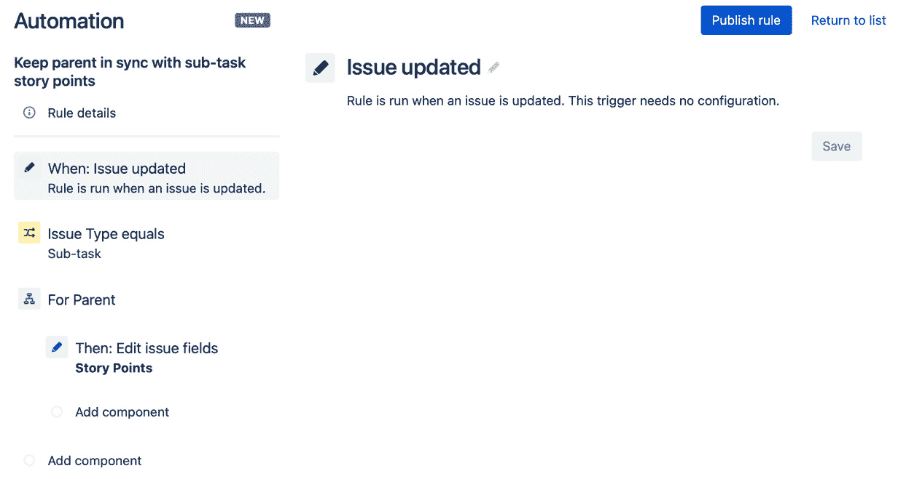
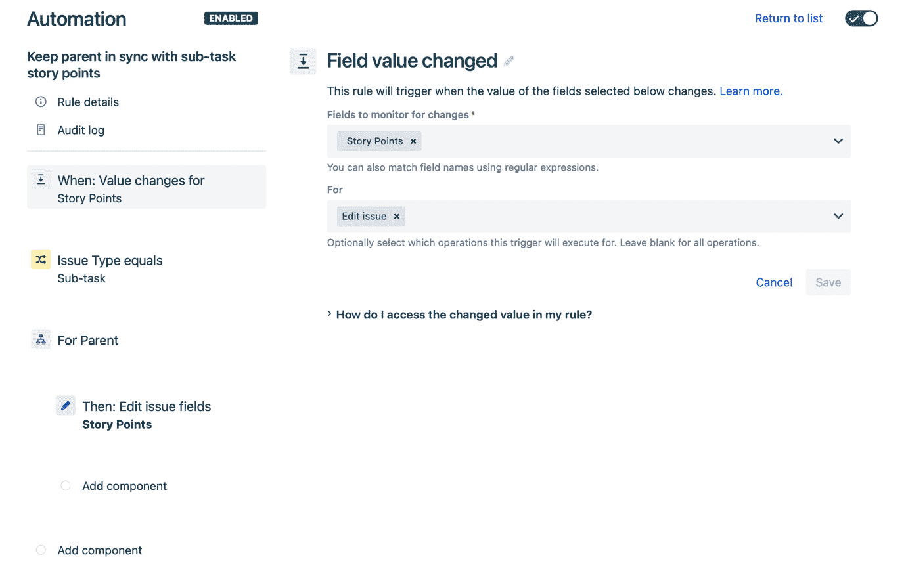
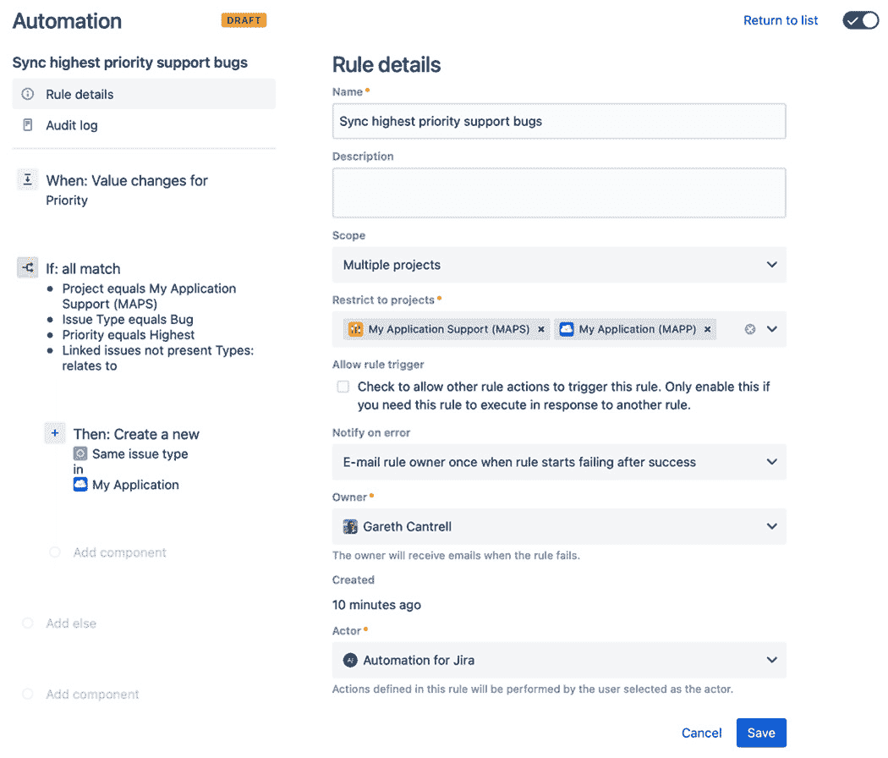
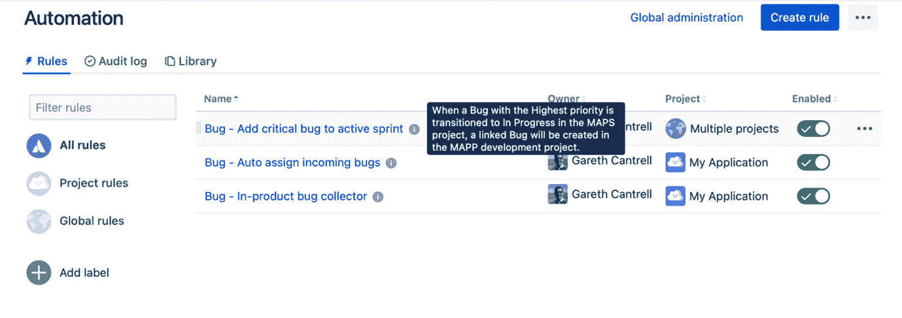
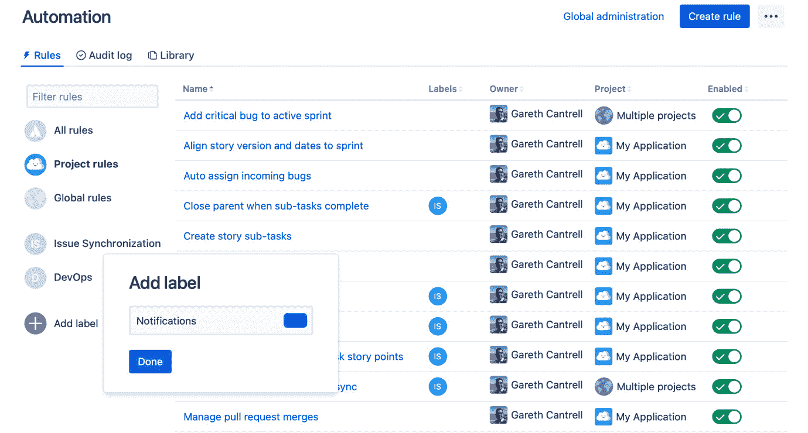
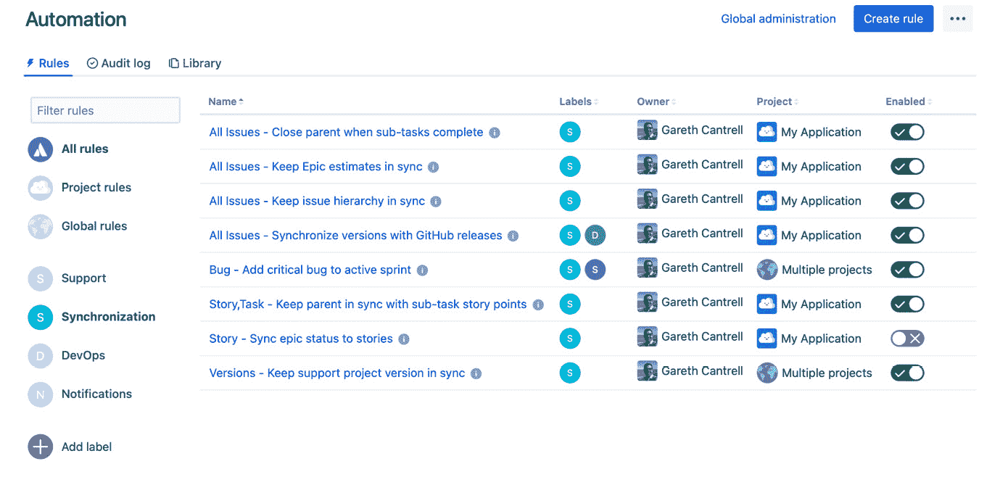
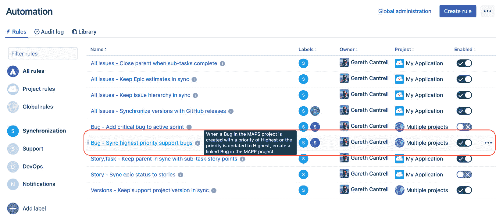

# *第九章*：最佳实践

在 Jira 中自动化任务和流程的能力，为简化项目和提升生产力打开了全新的可能性。

这反过来又带来了自己的复杂性，如果方法不当，你可能最终会有一堆规则，这些规则不仅没有提升生产力，反而比开始之前带来更多的麻烦。

本章的重点是提供一套指南，帮助你在自动化过程中获得最大收益。

我们将学习从规划规则开始，然后再深入实施规则，并了解如何编写规则以确保最大化性能。最后，我们将讨论一些最佳实践，帮助你组织规则，使其更易于管理和维护。

本章将涵盖以下主题：

+   规划你的规则

+   考虑性能

+   组织你的规则

# 技术要求

本章的要求如下：

+   **Jira 云环境**：如果你尚未使用 Jira，可以在[`www.atlassian.com/software/jira/free`](https://www.atlassian.com/software/jira/free)创建一个免费的 Jira 云帐户，并确保选择了**Jira Software** 和 **Jira Service Management**。

+   **Jira 服务器环境**：如果你使用的是 Jira Server（可从[`www.atlassian.com/software/jira/download`](https://www.atlassian.com/software/jira/download)下载），请确保你拥有 Jira Software 和 Jira Service Management 的许可证。此外，你还需要确保安装了*Jira 自动化*应用， 可从 Atlassian Marketplace 获取。

你需要是全局的 Jira 管理员，才能跟随本章中的示例。此外，我们使用了*Scrum 软件项目模板*来创建这两个软件项目，以便进行示例演示。

你可以从本书的官方 GitHub 仓库下载本章的最新代码示例：[`github.com/PacktPublishing/Automate-Everyday-Tasks-in-Jira`](https://github.com/PacktPublishing/Automate-Everyday-Tasks-in-Jira)。请访问以下链接查看 CiA 视频：[`bit.ly/3oVOYw1`](https://bit.ly/3oVOYw1)

# 规划你的规则

在你开始创建自动化规则之前，应该明确你想要自动化的目标，以及如何达成期望的结果，这些都是你在规划阶段需要思考的问题。

首先制定自动化策略，将确保你的自动化规则符合目的、有效率，并达到组织的目标。

在这一节中，我们将讨论一些规划规则的最佳实践。

## 规划你的自动化策略

值得记住的是，自动化的主要目的是简化你的业务流程，确保你的流程更高效地运行。

在计划自动化内容时，首先要做的事情之一是与用户互动。这将揭示出关于他们花费大量时间执行哪些任务以及如何利用自动化规则来提高他们的生产力的宝贵见解。

您还应考虑系统中现有请求的使用模式，以确定是否有可以应用于提高整体效率的自动化机会。

通过提前计划您的规则，并确保它们与您的整体业务和流程目标一致，您将清楚地了解到应自动化什么以确保自动化工作的整体成功。

接下来，我们将看看在规则规划期间应考虑使用适当的范围的原因。

## 设定规则的范围

正如我们在*第一章*中所看到的，*自动化的关键概念*，Jira 中的规则可以适用于四种范围之一：

+   **单一或特定项目的规则**：当在项目内创建规则时，此范围会自动应用。在此范围中的一个示例规则是按计划创建特定项目的任务。

+   **多项目规则**：通过指定适用规则的特定项目名称来启用此范围，并且只能由 Jira 管理员应用。在此范围中的一个规则示例是保持两个项目之间软件版本的同步。

+   **全局规则**：当管理员从全局管理视图创建规则时，此范围会自动应用。这个范围中的规则适用于实例中的每个项目。例如，在此范围中的一个规则是当一个问题被标记为重复时关闭它。

+   **Jira 云中特定项目类型的规则**：这个范围仅适用于 Jira 云，并允许将规则应用于特定类型的所有项目。例如，一个规则可以关闭一个客户请求，如果该请求在 5 个工作日内未更新。

这是规划自动化规则的重要方面之一。

使用自动化的主要目的之一是提高流程效率，当决定如何设置自动化规则本身时，这一点是正确的。

在 Jira 实例中，多个项目共享工作流程和其他常见配置是很常见的。在一个规则也在多个项目中共享的情况下，维护单一规则比维护各自的重复规则更为高效。

当然，这需要与全局和多项目规则只能由具有全局 Jira 管理员权限的用户维护而不是项目管理员的事实进行平衡。

## 思考规则设计

一旦确定了规则如何与组织的整体业务和流程战略相适应，接下来要关注的是设计实际的自动化规则本身。

自动化的一个关键原则是简化流程并减少重复性工作，因此你应尽量避免创建过于复杂且难以理解的规则。

你的规则应该是原子的，并且应该尽可能简单，以完成既定任务。始终记住，自动化规则通常会在原作者转向其他事务后长期存在，因此它们应该足够直观，便于其他人理解规则如何工作以及它们如何协同工作。

这引出了下一个要点：文档化你的规则。文档化每个规则始终是一个良好的做法。您应该在文档中包含规则的业务案例，并确保它与现有的业务目标一致。

规则的文档还应包括该规则依赖于其他规则或外部系统的任何信息。例如，如果该规则可以通过另一个规则的完成来触发，则应在文档中包含这一点。

确保规则文档完备可以实现以下几个目标：

+   这确保了业务的连续性。当原规则的作者离开时，他们的继任者可以快速理解规则背后的目的。

+   它促进了可见性。其他项目管理员可以快速看到是否有任何现有规则可以在他们的项目中使用，而不必重新发明轮子。

最后，您应该将规则的副本保存在像 Bitbucket 或 GitHub 这样的版本控制系统中。这不仅能确保您有每个规则的备份，还能让您追踪每个规则的变更历史。

您无疑会遇到有人对规则进行更改的情况，最好会导致一些小错误，最坏的情况会引发重大事件。

具备将有问题的规则快速回滚到已知的正常版本的能力，可以帮助您高效地解决这类事件。

Jira 的自动化功能允许您导出每个规则的副本，该副本可以以 JSON 格式下载，然后您可以将其保存在自己选择的版本控制系统中。

在下面的截图中，我们可以看到，点击每个规则右侧的省略号（**…**）按钮，您可以选择导出该规则：



](img/Figure_09.1_B16551.jpg)

图 9.1 – 导出单个规则到 JSON

Jira 管理员还可以选择将系统中所有的自动化规则导出为一个单独的可下载 JSON 格式文件。

定期执行此操作并将结果文件存储在版本控制中，可以让管理员在更广泛的事件发生时快速恢复所有项目中的自动化规则。

Jira 管理员可以通过访问全局管理界面，在齿轮图标下选择**系统**菜单，然后从左侧菜单中选择**自动化规则**标签，执行此操作。

你可以使用**创建规则**按钮右侧的省略号（**…**）按钮来访问菜单选项，从而导出所有规则，如下图所示：



图 9.2 – 将所有规则导出为 JSON

现在我们已经理解了规划规则的一些最佳实践，让我们通过一个示例来说明这一点。

## 创建一个规则来同步高优先级的错误

对于这个示例，我们将使用以下场景。

我们在 Jira 中有两个软件项目，*My Application*，项目键为 *MAPP*，开发团队使用该项目来跟踪他们的开发工作；另一个是 *My Application Support*，项目键为 *MAPS*，该项目允许客户报告错误并提出其他请求，而不会让开发项目淹没在无关问题中。

与应用支持团队沟通后，我们发现手动分类优先级最高的错误并创建关联的开发错误既耗时又容易出错。我们还确认已经采取了严格的检查措施，以限制创建优先级最高的错误。如果需要，支持团队也可以提升错误的优先级。

我们将使用这些信息创建一个自动化规则来处理这些特定的错误：

1.  我们将创建一个全局规则，因为涉及多个项目，所以只有 Jira 管理员才能创建此规则。

    点击顶部菜单栏中的设置（齿轮）菜单，选择**系统**。然后，在左侧菜单中选择**自动化规则**选项卡，最后点击**创建规则**。

1.  该规则需要在问题创建时以及手动提高优先级时都能生效，因此选择**多事件触发**，在**问题事件**字段中选择**问题创建**和**问题更新**。点击**保存**。

1.  该规则应仅适用于 MAPS 项目中优先级最高的错误。

    选择**新条件**，然后选择**JQL 条件**。在**JQL**字段中输入以下查询并点击**保存**：

    ```
    Project = MAPS AND type = Bug AND priority = Highest
    ```

1.  为了确保在多次更改优先级时不会在开发项目中创建多个错误，我们需要为规则添加一个额外的条件。

    选择`关联问题`

    `relates to`

    `Are not present`

1.  接下来，我们想要在 MAPP 项目中创建一个关联错误。

    选择`受影响的版本`、`优先级`和`关联问题`字段。

    按照如下字段完成填写，然后点击`My Application (MAPP)`

    `相同问题类型`

    `relates to`

    `触发问题`

    该规则应该类似于以下截图所示：

    

    图 9.3 – 用于在项目之间创建关联错误的规则

1.  最后，命名该规则为`同步最高优先级支持错误`并点击**开启**以保存并启用该规则。

我们已经在本节中学习了如何提前规划规则，并确保它们符合你的整体业务和流程策略，同时得到适当的文档记录和控制，这将确保你的自动化工作取得最终成功。

提示

Atlassian 提供了一个模板库，你可以使用这些模板作为规则的起点。此外，还提供了一个自动化游乐场，你可以在其中探索各种规则组件并创建虚拟规则。你可以通过[`www.atlassian.com/software/jira/automation-template-library`](https://www.atlassian.com/software/jira/automation-template-library)访问这两个资源。

在接下来的部分，我们将介绍一些最佳实践，确保你编写的规则能够高效运行，保持你的 Jira 实例响应快速并顺利运行。

# 考虑性能

在为任何系统规划自动化规则时，你应该确保它们能够高效执行，并且不消耗超过绝对必要的资源。这对于保持系统的良好运行和响应性至关重要。

你正在引入自动化来提高生产力和优化耗时的流程。你最不希望看到的就是自动化本身对系统性能产生负面影响。

Jira 中的自动化引擎旨在尽可能最大化性能；然而，在编写规则时，有一些考虑因素可以确保它们表现最佳。我们将在本部分中探讨其中的一些考虑事项。

## 使用项目特定的规则

规则的范围在性能方面起着重要作用。它决定了给定规则最初排队的执行次数。

比如，如果你有 50 个项目，并且有一个使用*创建问题*触发器的全局规则，那么当“创建问题”事件被触发时，规则引擎会排队 50 次执行，每个匹配项目 1 次。

如果你使用“创建问题”触发器添加另一个全局规则，100 次执行将被排队，也就是说，每个匹配触发器的每个匹配项目都会有 1 次执行。

如你所见，应用过宽的范围很容易导致潜在的性能问题。

一般来说，你创建的大多数规则通常是特定于某个项目的，因此规则的范围应该限于该项目。

将规则的范围限定为实际需要的项目，将确保每个事件只排队最少数量的规则执行。

在接下来的部分，我们将探讨如何选择适当的触发器，以优化规则的性能。

## 使用适当的触发器

另一种确保最大性能的方法是为你的规则使用合适的触发器。这一点在你的规则依赖于特定字段的更改时尤其重要。

例如，如果你有一个规则，应该将子任务的所有故事点总和加到父任务中，你可以使用**问题更新**触发器，正如下面截图所示：



图 9.4 – 使用问题更新触发器来触发规则

虽然这种方法并不错误，且可以正常工作，但更高效的方法是使用**字段值更改**触发器，并进一步将其限制为**编辑问题**操作，如下截图所示：



图 9.5 – 使用更高效的字段值更改触发器

这样做的原因再次在于，当 Jira 中的事件被触发时，自动化引擎将排队与触发器匹配的规则执行。

在前面的示例中，使用**问题更新**触发器将匹配所有配置了**问题更新**触发器的规则。例如，如果你有 10 个规则使用**问题更新**触发器，在子任务中更改**故事点**字段将导致 10 个规则执行被排队等待处理。这是因为规则引擎无法确切知道哪个**问题更新**规则是相关的。

将规则更改为使用**字段值更改**触发器，并仅监控**故事点**字段的**编辑问题**操作，将仅排队一个规则执行，前提是没有其他规则使用完全相同的触发器配置。

## 选择正确的条件

条件用于通过限制哪些问题会受到规则中后续操作的影响，来缩小规则的作用范围。

最有效的规则是那些对执行额外操作的任务数量最少的规则，因此尽早在规则执行链中排除不需要处理的问题，将确保你的规则尽可能高效地运行。

此外，并非所有条件都是平等的。在决定使用哪个条件时，最佳的做法是尽可能早地考虑使用最有效且性能最好的条件。

按性能排序的条件，性能从高到低依次为：

+   问题字段条件

+   高级比较条件

+   JQL 条件

**问题字段**条件适用于在条件评估时规则中已经存在的数据，并使用简单的比较将字段与常量值或一组值进行比较。由于不需要进一步处理来评估，这是最有效的条件，可以用于你的规则。

当你有多个字段需要比较时，你可以将多个问题字段条件链式连接，以执行更复杂的比较，并且仍然保持整体性能。

按性能顺序排列，下一个条件是**高级比较**条件。该条件允许使用智能值和正则表达式，因此这些需要先被解析，然后才能评估该条件。

类似于*问题字段*条件，你可以将多个*高级比较*条件串联在一起，以执行更复杂的比较。

最后，**JQL**条件是这三种条件中最昂贵的。它还允许你在比较中使用 Jira 搜索功能的全部能力。JQL 条件还可以包含智能值，如果使用这些值，它们需要先被评估，然后查询才能发送到 Jira 执行。

让我们重新审视一下我们在*规划规则*部分中介绍的同步最高优先级 bug 的规则，看看我们如何优化其性能。

## 优化规则性能

在该规则的第一次迭代中，我们使用*多个问题事件*触发器创建了一个全局规则。正如我们所了解到的，这可能会对我们的 Jira 实例造成性能影响。

这是因为我们为规则使用了全局范围，因为它适用于多个项目。我们还使用了多个问题事件触发器来监听问题的创建和更新事件。最后，我们使用了*JQL 条件*来缩小规则的适用范围，而我们已经了解到，这是最不高效的条件。

让我们更新规则，以考虑这些性能问题：

1.  作为 Jira 管理员，点击顶部菜单栏中的设置（齿轮）菜单，选择**系统**。然后，选择左侧菜单中的**自动化规则**标签，最后点击**同步最高优先级支持 bug**规则。

1.  首先，我们将更新触发器为*字段值更改*触发器。

    点击规则链视图左侧的**当：规则触发时**组件。

    接下来，点击**多个问题事件**右侧的铅笔图标以更改触发器。

1.  选择`优先级`

    `创建问题`和`编辑问题`

1.  接下来，我们将用更高效的*问题字段条件*替换*JQL 条件*。我们将使用*if/else 块*来使规则更易读。

    选择**新条件**，然后选择**If/else 块**。

1.  点击`项目`

    `等于`

    `我的应用支持（MAPS）`

1.  点击`问题类型`

    `等于`

    `Bug`

1.  点击`优先级`

    `等于`

    `最高`

1.  点击`关联问题`

    `相关`

    `未出现`

1.  删除**If: 问题匹配 JQL**条件。你可以通过点击规则链视图中组件右上角的**X**，或选择组件并点击组件名称右侧的垃圾桶图标来删除该条件**JQL 条件**。

1.  通过点击规则链视图中组件右上角的**X**，或选择组件并点击组件名称右侧的垃圾桶图标，删除**If: 未关联问题**条件。

1.  然后，我们需要将**创建问题**动作移到**If…else 块**中。这是通过在规则链视图中点击并拖动该动作，然后将其放置在**If: all match component**和**Add component**链接之间来实现的。

1.  最后一步是更改规则的范围。点击`多个项目`

    `我的应用支持（MAPS）`和`我的应用（MAPP）`

    规则现在应该类似于以下截图：

    

    图 9.6 – 为性能优化规则

1.  最后，点击**发布更改**以保存我们对规则所做的更改。

在这一节中，我们学到了使用正确的规则范围对性能的影响。我们还学习了如何选择适当的触发器和条件，通过选择最有效的组件来保持规则的最佳性能。

在下一节中，我们将看看如何组织规则，使它们更易于跟踪和管理。

# 组织你的规则

随着时间的推移，随着你在更多项目中自动化更多任务，管理和跟踪所有自动化规则将变得更加复杂。

处理越来越多的自动化规则和配置的最佳方法是逻辑地组织每个规则。

在这一节中，我们将探讨一些最佳实践，以保持规则的最佳组织方式，使它们更容易查找和管理。

我们将从一个应该对任何曾经处理过大量系统配置的人员来说都很熟悉的概念开始：命名约定。

## 使用命名约定

使用明确定义的命名约定可以让用户一致地识别规则，并帮助你以有意义的方式组织规则。

一个好的命名约定需要提前规划、文档化，并对所有管理自动化规则的人可见。

Jira 中的自动化规则列表按字母顺序排列，在设计命名约定时应充分利用这一点，这样可以将相关项目分组在一起。

注意

你可以按工作列表中的任何列来排序你的自动化规则。然而，排序顺序总是默认按名称的字母升序排列。

例如，您的命名约定可以规定每个规则应以其适用的事务类型为前缀。在软件项目中，这可能类似于`Bug`、`Epic`、`Story`、`Task`等。这样一来，规则的适用对象一目了然，而且这些规则在按名称排序时总是会被分组在一起。

除了建立命名约定外，还有一个良好的实践是详细描述每个规则的作用，使用**描述**字段。这将使查看规则列表的任何人立即了解到规则实际上在做什么，而无需检查每个规则。

在下面的屏幕截图中，您可以看到使用命名约定如何将规则分组在一起：



图 9.7 – 应用命名约定的规则列表

此外，您可以看到通过使用规则描述清楚地记录规则实际执行的操作，可以更轻松地导航和管理自动化规则列表。

## 为您的规则打标签

除了使用命名约定外，您还可以并且应该定义标签来分类和标识您的自动化规则。

在自动化规则的上下文中，**标签**是一个带有颜色编码的关键字，您可以分配给自动化规则以更轻松地识别它们。

理想情况下，您应该为您的标签使用简短的功能术语；以下是一些功能性标签的示例：

+   **客户通知**: 发送通知给客户的规则

+   **内部通知**: 发送通知给团队成员的规则

+   **支持**: 处理支持问题的规则

+   **同步**: 处理保持问题或其他项同步的规则

+   **软件发布**: 处理软件项目中版本控制的规则

上述列表只是您项目中可能使用的功能性标签名称的小样本。

此外，自动化规则可以分配给多个标签。例如，将一个从支持项目创建链接错误到开发项目的规则可以同时标记为**支持**和**同步**标签。

要创建新标签，或者使用之前定义的现有标签，请按照以下步骤进行：

1.  在左侧的规则列表视图中，点击**添加标签**按钮。

1.  在**输入标签名称**字段中输入标签名称。

1.  可选地，通过点击字段右侧的彩色块来选择颜色。

    如果标签已经定义，当您开始输入时，它将显示在标签名称字段下面的列表中。

1.  要使用之前定义的标签，只需点击其名称。

1.  一旦定义了标签名称和颜色，点击**完成**。

    您可以看到如何在下面的屏幕截图中创建标签：



图 9.8 – 添加新标签

现在您已经定义了标签，您需要将规则分配给相应的标签。通过点击并拖动规则到适当的标签上完成此操作。

一旦你创建了标签并相应地分配了规则，通过选择合适的标签来缩小规则列表的范围，就能更轻松地管理大量的自动化规则，正如下图所示：



图 9.9 – 使用标签快速查找合适的规则

现在我们已经获得了一些关于如何组织规则的见解，让我们将其应用于我们在*优化规则性能*部分优化过的规则。

## 规则的命名和标签

让我们完成我们的规则，通过使用命名约定来同步最高优先级的问题。我们还将使用**描述**字段来描述规则的功能，然后适当标签化它：

1.  作为 Jira 管理员，点击顶部菜单栏中的设置（齿轮）菜单，然后选择**系统**。接着，在左侧菜单中选择**自动化规则**标签，最后点击**同步最高优先级支持 Bug**规则。

1.  在`Bug – 同步最高优先级支持 Bug`

    `当 MAPS 项目中的一个 Bug 被创建为最高优先级，或者其优先级被更新为最高时，在 MAPP 项目中创建一个关联的 Bug。`

1.  点击**发布更改**以保存规则，然后点击**返回列表**以返回规则列表。

1.  创建两个标签，分别命名为**同步**和**支持**，然后依次点击并拖动**Bug – 同步最高优先级支持 Bug**规则到每个标签上。

    现在，当与其他规则一起列出时，该规则应该看起来类似于以下截图：



图 9.10 – 使用命名约定和标签组织规则

我们已经学到，通过使用命名约定来组织规则，可以更容易地找到并管理它们。此外，使用**描述**字段创建规则的叙述帮助你快速识别规则的作用。最后，结合使用功能标签将在长期维护规则时节省时间并减少困扰。

# 使用检查清单

在创建规则时，你不可能总是记得我们在本章中讨论的所有要点，以确保你的规则遵循最佳实践。

拥有一个可以快速参考的检查清单有助于确保你遵循了本章中呈现的最佳实践以及你所制定的任何组织指导原则。

因此，我们整理了一份基本的检查清单，可以作为你创建适合你需求格式的清单的起点：

+   该规则的作用范围正确，仅限于受影响的项目或项目组。

+   该规则已被记录，并包含了业务案例和实施方法。

+   该规则已经导出并存储在如 GitHub 或 Bitbucket 等版本控制系统中。

+   使用了适当的触发器，例如“字段值已更改”而不是“问题已更新”。

+   该规则使用了最有效的条件，例如“问题字段”条件，并且只有在规则中确实需要时才依赖更昂贵的条件。

+   该规则根据文档中规定的命名约定命名。

+   规则描述充分说明了规则的作用。

+   该规则已分配到适当的功能标签。

现在，您已拥有了检查清单，您可以用它快速识别规则是否遵循了您制定的所有准则。这将确保您的规则既易于管理，又不太可能在长期内导致性能问题。

# 总结

在本章中，我们学习了一些规划、实施和组织自动化规则时应遵循的最佳实践。

我们了解到，在 Jira 中，你应该提前规划自动化策略，以便与业务和流程目标对齐，从而确保自动化工作的最终成功。

我们还了解到，为了确保业务连续性并避免不必要的重复工作，您的规则应该在外部系统（如 Confluence）中妥善记录，并向相关团队成员公开。

此外，您还应该理解将规则的外部副本保存在版本控制系统（如 Bitbucket 或 GitHub）中的重要性，以确保当规则发生意外的破坏性更改时，可以通过导入最后已知的工作版本迅速解决问题。

接下来，我们学习了如何在编写规则时考虑性能，使用适当的项目范围来定义自动化规则，并了解为何使用正确的触发器和条件对确保自动化规则的最佳性能至关重要。

最后，我们了解了如何定义并使用命名约定，通过默认按字母顺序组织规则，将规则进行分组。我们还学习了如何使用标签功能，通过功能性标签来组织我们的规则。

在下一章中，我们将介绍一些调试自动化规则的技巧和方法，以及如何理解和使用服务限制与性能洞察来监控 Jira 实例中的自动化规则。
