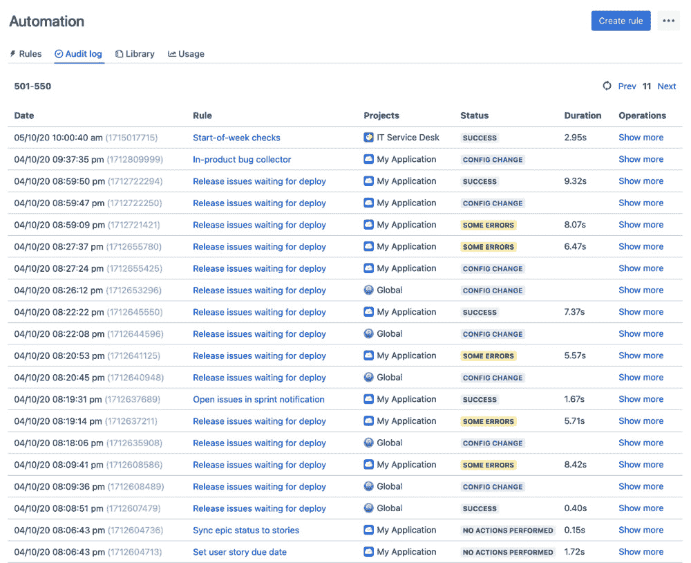
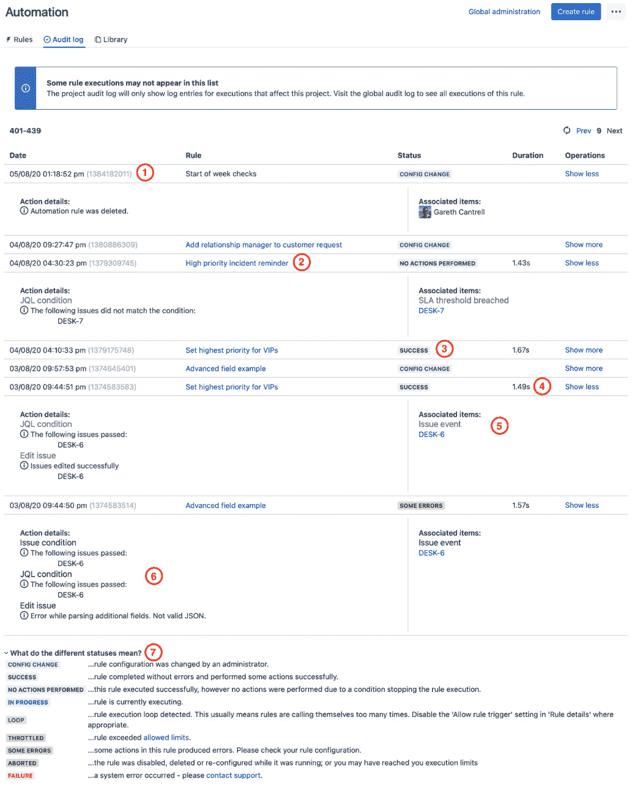
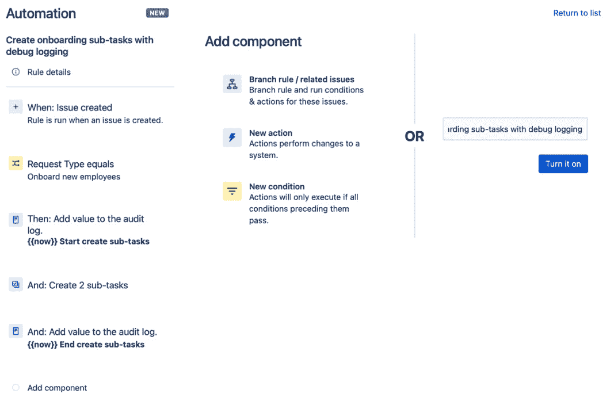
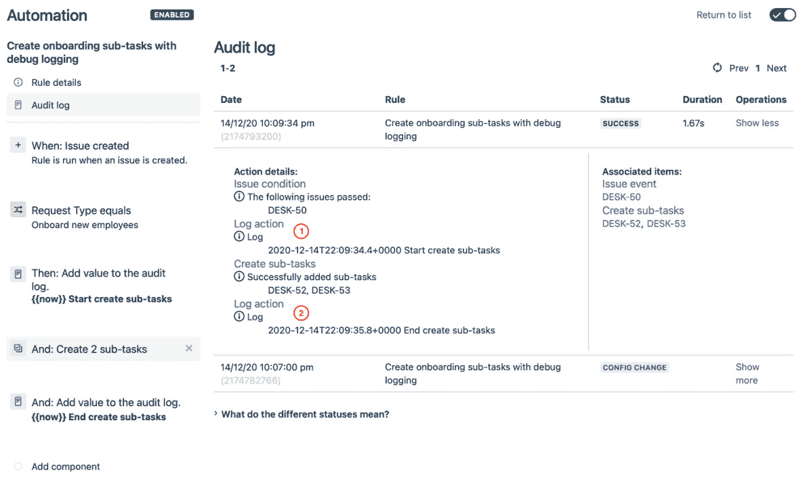
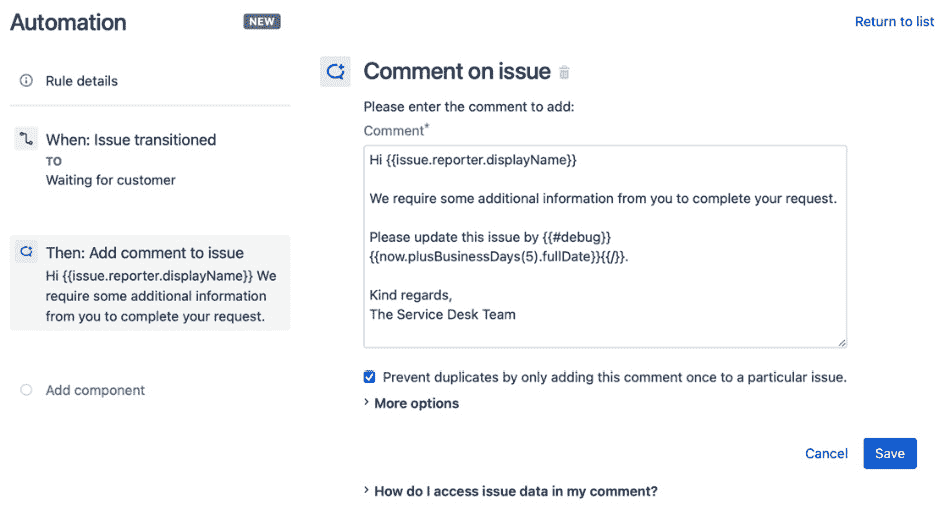
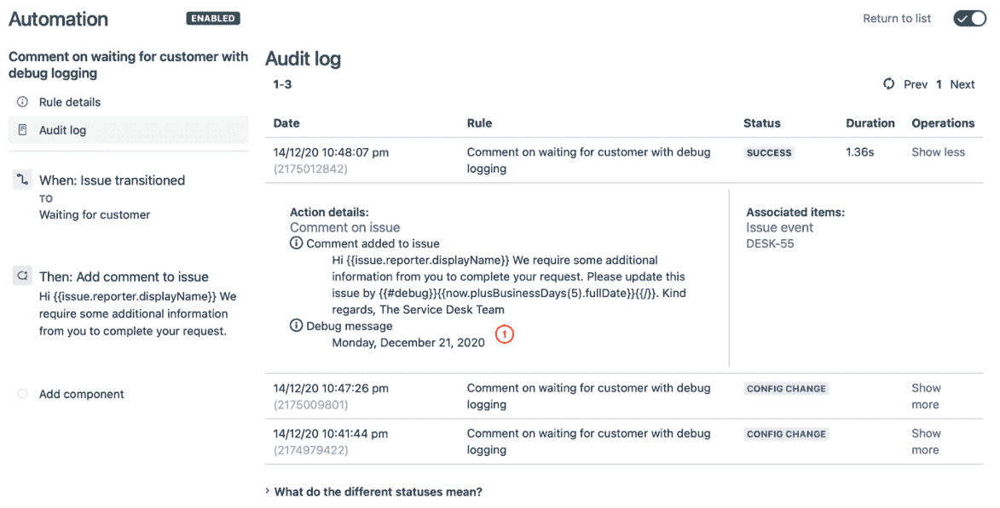
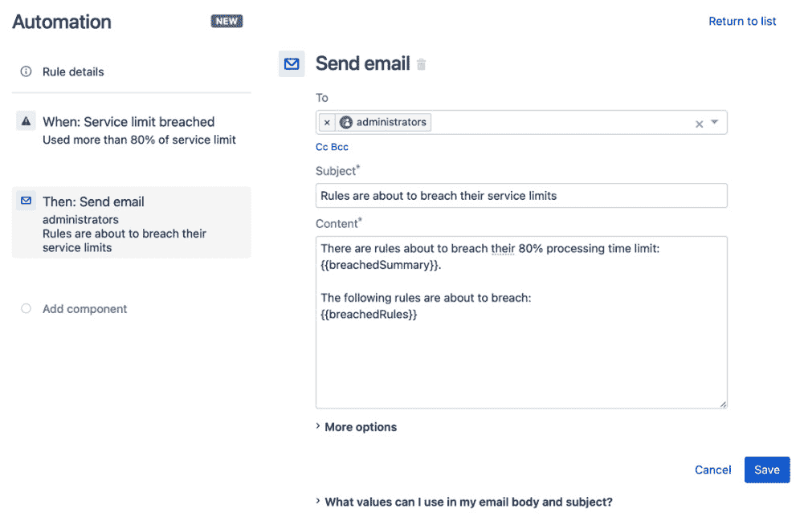
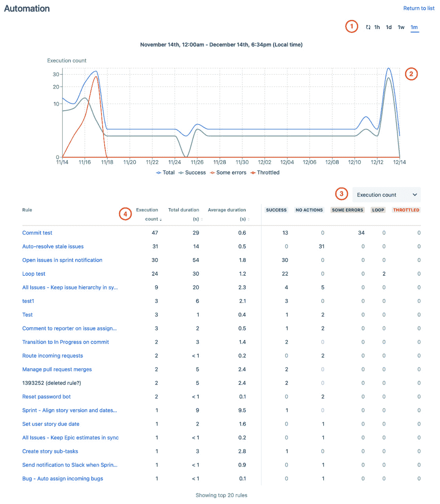

# *第十章*：故障排除技巧和方法

不可避免的是，某个时刻你的自动化规则将会因错误或无法解释的原因而失败或变慢。即使是精心规划和实施的规则，也终会遭遇无法预见的错误。在这些情况下，了解如何主动监控、故障排除和调试规则，将帮助你更快地解决这些问题。

在本章中，我们将向你介绍一些技巧和方法，以更好地理解你的规则发生了什么以及如何调试它们。我们将查看审计日志，并介绍如何利用它来更好地理解规则执行过程中发生的事情，以及如何利用它进行调试。

我们还将了解为防止不合规的规则对实例性能产生负面影响而设定的服务限制，以及如何主动监控你的规则，以避免违反这些限制。

最后，你将学习如何使用性能洞察指标来概览系统中自动化规则的性能。这将帮助你识别可能导致性能问题的规则，从而能够维持和改进你的 Jira 实例的性能。

在本章中，我们将覆盖以下主题：

+   调试自动化规则

+   了解服务限制

+   获取性能洞察

# 技术要求

本章的要求如下：

+   **Jira Cloud 环境**：如果你尚未访问 Jira，你可以在[`www.atlassian.com/software/jira/free`](https://www.atlassian.com/software/jira/free)创建一个免费的 Jira Cloud 账户，并确保选择了 Jira Software 和 Jira Service Management。

+   **Jira Server 环境**：如果你使用的是 Jira Server（可从[`www.atlassian.com/software/jira/download`](https://www.atlassian.com/software/jira/download)获取），请确保你拥有 Jira Software 和 Jira Service Desk 的许可证。此外，你还需要确保安装来自 Atlassian Marketplace 的 *Automation for Jira* 应用。

在这两种实例中，你需要至少拥有 **项目管理员** 权限才能跟随本章中的示例。为了演示本章中的示例，我们使用了 *IT 服务管理项目模板* 来创建服务台项目。

你可以从本书的官方 GitHub 仓库下载本章的最新代码示例，网址为[`github.com/PacktPublishing/Automate-Everyday-Tasks-in-Jira`](https://github.com/PacktPublishing/Automate-Everyday-Tasks-in-Jira)。请访问以下链接查看 CiA 视频：[`bit.ly/2XSttjY`](https://bit.ly/2XSttjY)

# 调试自动化规则

自动化规则失败的原因有很多。这些可能是由于 Jira 中的基础配置更改，或者规则的创建者在规划和实施规则时未预见到某些边缘情况。

当规则开始失败时，必须了解是什么导致规则失败，并修复潜在原因或调整自动化规则以考虑到导致失败的变化。

然而，调试不仅仅是找到并修复自动化规则或 Jira 配置中的不足之处。我们可以在规划和开发过程中使用相同的技术，确保我们交付的规则更为健壮，从而更可能成功。

在本节中，我们将了解如何使用审计日志来帮助自动化规则识别问题，以及在调试自动化规则时如何利用它。

首先，让我们看看审计日志及其如何帮助我们了解规则的执行情况。

## 理解审计日志

每个自动化规则都有一个相关的审计日志，包含从规则创建开始，按时间顺序排列的所有影响该规则的条目。

这些项不仅跟踪规则的创建、修改和删除事件，还记录规则的每次执行，包括受影响的事务和规则中每个动作的结果。

有三种查看审计日志的方式：

+   **全局审计日志**：全局审计日志允许 Jira 管理员查看系统中每个项目和规则的所有审计日志。作为 Jira 管理员，你可以通过点击顶部菜单栏的**设置（齿轮）**图标，然后选择**系统**，找到全局审计日志。在左侧菜单中选择**自动化规则**标签页，然后在 Jira Cloud 中选择**审计日志**标签页。在 *Jira Server* 或 *Jira Data Center* 中，点击省略号（**…**）按钮并选择**显示审计日志**。

+   **项目审计日志**：项目审计日志允许项目管理员查看该项目中每个规则的所有审计日志。作为项目管理员，要找到项目审计日志，请导航至**项目设置**。在 *Jira Cloud* 中，选择左侧菜单中的**自动化**标签页，然后选择**审计日志**标签页。在 *Jira Server* 或 *Jira Data Center* 中，选择左侧菜单中的**项目自动化**标签页，然后点击省略号（**…**）按钮并选择**显示审计日志**。

+   **规则审计日志**：规则审计日志让你仅查看该特定规则的所有日志项。要查看规则审计日志，选择一个规则，然后点击**审计日志**项，位于**规则链**视图上方。

以下截图显示了全局审计日志的示例，展示了跨所有项目的规则审计日志：



图 10.1 – Jira Cloud 中的全局审计日志视图

在全局审计日志和项目审计日志视图中，点击规则名称将带您进入该规则的审计日志视图。在每个规则视图中，点击**操作**列中的**显示更多**链接，将展开该事件的审计日志详细信息。

以下截图展示了项目审计日志视图，其中一些单独的审计项已展开，显示了详细的审计日志：



图 10.2 – 审计日志详细信息

让我们看一下审计日志中的每一项：

1.  每个审计日志都有一个关联的日期和时间戳，准确到秒，显示该事件发生的具体时间。审计日志按日期和时间降序排列，最新的事件显示在列表的顶部。日期和时间戳旁边的括号中的数字是规则的标识号。

1.  这是与该审计日志相关联的规则名称。在全局审计日志和项目审计日志视图中，点击规则名称将带您进入该规则的审计日志。您还可以在全局或项目审计日志视图中查看已删除规则的审计日志历史。已删除的规则很容易识别，因为它们没有指向规则定义的超链接。

1.  在这一列中，您可以看到规则是否成功执行。此外，它还显示了规则的配置更改，这在调试规则失败时非常有帮助。

1.  每次规则执行时，运行所花费的时间都会被记录并显示在这一列中。

1.  对于规则执行，**相关项**显示哪些问题被添加到规则执行中，以及由哪个规则组件添加。点击该组件将直接带您到负责该操作的组件配置。对于配置事件，它将显示执行操作的用户。

1.  规则执行所执行的所有操作都在这里列出，并按操作分组。对于规则中配置的每个操作，您将看到一个成功的任务列表。如果操作失败，则会显示错误信息。点击任何操作将直接带您到该操作的配置屏幕。

1.  展开**不同状态代表的含义**选项将列出所有可能的状态代码及其含义。

现在我们已经了解了如何读取审计日志，接下来我们来看一下如何利用它来调试规则。

## 使用审计日志进行调试

查看智能值中存储的内容或检查智能值函数的结果，可以让您了解规则中发生的情况。这在设计规则或调试行为不符合预期的规则时尤其有用。

为此目的，可以在您的规则中使用一个自动化动作组件——*日志动作*。该组件的唯一目的是将消息注入到审计日志中，您可以在调试规则时查看这些消息。

让我们来看一个使用 Log 操作组件的示例。

### 使用 Log 操作记录消息

Log 操作组件允许你将消息注入到审计日志中，这样你就可以添加调试语句，帮助你理解规则执行时发生了什么。

在此示例中，我们将使用 Log 操作组件，在调用**创建子任务**操作之前和之后，将时间戳添加到审计日志中：

1.  在你的 Service Desk 项目中，导航到**项目设置**，点击**自动化**标签页，然后点击**创建规则**。

1.  选择**问题创建**触发器，然后点击**保存**。

1.  然后选择`Request Type`

    `equals`

    `Onboard new employees`

1.  现在选择`{{now}} 开始创建子任务`

1.  接下来，选择`Provision new laptop by {{issue.duedate.longDate}}`

    `Setup new desk phone by {{issue.duedate.longDate}}`

1.  再次选择`{{now}} 结束创建子任务`

1.  接下来，给你的规则命名为`Create onboarding sub-tasks with debug logging`，然后点击**启用**，以保存并启用规则。

    规则应类似于以下屏幕截图：



图 10.3 – 使用调试日志创建规则

现在我们已经设置好规则，使用**提出请求**链接，从你的 Service Desk 项目中创建一个新的问题，选择*Onboard new employees*请求类型，然后返回到*使用调试日志创建入职子任务*规则，点击**审计日志**项。

展开审计日志项后，你应该能看到类似以下屏幕截图的内容：



图 10.4 – 带有调试日志消息的审计日志

你可以在审计日志中看到我们在**创建子任务**操作前后插入的消息：

1.  第一个日志操作消息会在调用**创建子任务**操作之前。

1.  第二个日志操作消息会在**创建子任务**操作之后被调用。

从中，你现在可以确定`Sub-task`问题类型的持续时间。

### 使用调试智能值功能记录消息

使用 Log 操作将消息插入审计日志，使得调试你的规则变得更加容易。然而，如果你有太多 Log 操作组件来记录像智能值函数的输出这类信息，你就必须重复你的智能值，以便创建调试日志。

为了解决这个问题，你可以使用调试智能值功能。这涉及将你的智能值包裹在`{{#debug}}`函数中。

让我们来看一个示例规则，使用调试智能值功能来实现这个目标：

1.  在你的**Service Desk**项目中，导航到**项目设置**，点击**自动化**标签页，然后点击**创建规则**。

1.  选择`Waiting for customer`

1.  现在，选择**新建操作**，然后选择**评论问题**。将以下消息添加到**评论**字段中，然后点击**保存**：

    ```
    Hi {{issue.reporter.displayName}}
    We require some additional information from you to complete your request.
    Please update this issue by {{#debug}}{{now.plusBusinessDays(5).fullDate}}{{/}}.
    Kind regards,
    The Service Desk Team
    ```

    你的规则应类似于以下屏幕截图：

    

    图 10.5 – 使用调试智能值函数

1.  最后，命名规则为`带调试日志的等待客户评论`，然后点击**启用**以保存并启用该规则。

创建一个*服务请求*类型的问题，将其转换为*等待客户*状态，然后返回到*带调试日志的等待客户评论*规则，点击**审计日志**项。

展开顶层审计日志项后，您的审计日志应如下所示：



图 10.6 – 使用调试智能值函数的审计日志

使用`{{#debug}}`智能值函数导致**调试消息**被打印到审计日志中，并附带**评论问题**操作输出的信息，而无需向规则中添加单独的**日志操作**组件。您可以在*图 10.6*中标记为**(1)**的项中看到这一点。

我们在本节中学习了如何从全局、项目和规则角度理解和使用审计日志，以及日志中的各种项目能告诉我们什么。

我们还学习了如何从规则中发送消息到审计日志，以帮助调试规则。

在下一节中，我们将查看服务限制，这些限制是为了防止规则对 Jira 实例的性能产生负面影响。

# 理解服务限制

自动化规则的服务限制是确保自动化规则不会对 Jira 实例的性能产生负面影响的关键。

在本节中，我们将查看现有的服务限制以及它们如何影响您的规则。我们还将讨论如何在这些服务限制内工作，以及如何使用自动化规则来监控其中一些限制。

让我们首先了解有哪些服务限制可用。

## 了解服务限制

服务限制适用于 Jira Cloud 和 Jira Server/Data Center 版本的自动化规则。

适用于所有规则的服务限制列出了每个限制可能被突破的描述：

+   每个规则的组件数：65

    包含超过 65 个条件、分支和操作的规则。

+   每个操作的新子任务：100

    尝试创建超过 100 个子任务的规则。

+   搜索到的问题：1,000

    返回超过 1,000 个项目的 JQL 查询将导致此限制被突破。

+   并发调度规则执行：1

    如果规则被调度为每 5 分钟运行一次，但执行时间超过 5 分钟，导致此限制被突破，因为在第一次执行仍在处理时，后续执行无法开始。

+   规则排队的项目：Jira Cloud 为 5,000，Jira Server/Data Center 为 25,000

    任何单一规则，若导致排队的问题超过指定数量，将违反此限制。

+   全局队列中的项：Jira Cloud 为 50,000，Jira Server/Data Center 为 100,000

    在任何时刻，队列中的问题总数不得超过指定的限制。

+   每日处理时间：每 12 小时 60 分钟

    每个执行时间超过 5 秒且每 5 分钟执行一次的单个规则将违反此限制。

+   每小时处理时间：100 分钟

    如果 Jira Cloud 每小时的规则执行次数超过 2,000 次，或 Jira Server/Data Center 每小时的规则执行次数超过 5,000 次，将触发此限制。这种情况可能会发生在执行批量操作时，导致多个规则同时触发。

+   循环检测：10

    一个规则如果在短时间内触发自己或其他规则超过指定次数，将触发此限制。

## 处理服务限制违反

当规则违反其服务限制时，自动化引擎会限制受影响的规则。审计日志将包含更多信息，并使用*已限制*状态来帮助更容易地识别。

因违反服务限制而被限制的规则也将被禁用，以防止进一步的性能问题。

重要提示

在设置规则时，您可以选择在规则首次失败时或每次失败时向规则所有者发送电子邮件通知。请注意，当通知发送时，规则已经被限制并禁用。

在常规执行的规则即将超出其处理时间限制的情况下，存在一个特殊触发器——*服务限制违反*触发器，您可以使用它来监控您的规则。您可以在规则被限制和禁用之前，利用此触发器设置自动化规则，以便提前通知您。

让我们快速了解如何设置自动化规则，监控规则何时达到处理时间限制的 80%，并通知您：

1.  在您的 Jira 项目中，导航到**项目设置**，点击**项目设置**菜单中的**自动化**链接，然后点击**创建规则**。

1.  选择`已使用超过 80%的服务限制`

    `每小时一次`

1.  接下来，选择`管理员`

    `规则即将违反其服务限制`

    `即将违反其 80%处理时间限制的规则：{{breachedSummary}}。`

    `以下规则即将违反：`

    `{{breachedRules}}`

    该规则应类似于以下截图：

    

    图 10.7 – 监控处理时间服务限制的规则

1.  最后，将规则命名为`服务限制 80%通知`，然后点击**开启**以保存并启用该规则。

现在，每当规则达到其处理时间限制的 80%时，将向管理员发送电子邮件通知，提醒他们在规则被限制和禁用之前采取行动。

## 处理队列项限制

Jira 中的自动化规则通过使用规则处理队列来工作。例如，如果您的 Jira 实例中有 50 个项目，并且存在一个使用*问题更新*触发器的全局自动化规则，每次任何项目中的一个问题被更新时，都会创建并排队 50 次规则执行。

添加第二个使用*问题更新*触发器的全局自动化规则将导致创建并排队 100 次规则执行；也就是说，每个规则在每个项目中执行一次。

如果每个规则仅适用于单个项目，则只会创建并排队两个规则执行。

正如您可以想象的那样，如果规则作用域过于宽泛且触发条件不具体，过多的错误作用域规则会迅速导致性能瓶颈，这只是其中一个例子。

在计划触发器或使用*分支规则/相关问题*组件的相关问题分支中使用 JQL 查询，也可能导致每个规则队列中的问题数量超过服务限制。

重要说明

超过队列项目限制的规则会被规则引擎自动禁用，以防止进一步执行，且违规的详细信息会记录在审计日志中。

为了防止规则队列中积压过多项目，您应该考虑以下指导原则：

+   对于您的规则，请使用尽可能狭窄的作用域。如果规则仅需要在单个项目或少数项目上操作，请相应地限制作用域。

+   当您的规则只对某个特定字段的变化感兴趣时，使用像*字段值已更改*触发器，而不是*问题创建*或*问题更新*触发器。

+   通过尽可能使查询更具体，限制 JQL 查询返回的结果数。

+   节制使用*分支规则/相关问题*组件。

在本节中，我们学习了自动化规则引擎所施加的各种服务限制，以及如何利用这些知识编写更高效的规则。在接下来的章节中，我们将学习如何使用性能洞察来概览自动化规则的整体性能。

# 获取性能洞察

为确保自动化规则的整体成功并保持性能在满意的水平，您需要留意可能长期引发问题的任何事项。

我们已经看到审计日志可以为您提供关于规则是否成功运行、是否出现错误、是否导致性能问题并被限制的洞察。除此之外，能够监控并主动通知管理员当规则可能超出服务限制时，有助于您及时关注这些问题。

虽然这确实有帮助，但检查审计日志可能会很耗时，特别是当您有大量规则频繁执行时。

在本节中，我们将介绍自动化规则的性能洞察功能，它将为你提供规则整体性能的鸟瞰图。

性能洞察对项目管理员和全局管理员均可用。项目管理员可以查看项目内所有规则的性能，而全局管理员则能查看系统中每个自动化规则的性能概况。

作为项目管理员访问性能洞察，首先进入**项目设置**，然后从左侧菜单中选择**自动化**链接（如果你使用的是*Jira Server*或*Jira Data Center*，请使用**项目自动化**链接）。然后，点击省略号（**…**）按钮，选择**查看性能洞察**菜单项。

要访问全局性能洞察，请点击顶部菜单栏中的设置（**齿轮**）图标，然后选择**系统**。接着，在左侧菜单中点击**自动化规则**，最后点击省略号（**…**）按钮，选择**查看性能洞察**菜单项。

性能洞察屏幕如下图所示，项目和全局性能洞察的界面类似：



图 10.8 – 查看性能洞察

让我们快速浏览一下性能洞察的各个方面：

1.  使用时间分辨率选项来选择图表显示过去一小时、一天、一周或一个月的规则执行数据。点击圆形箭头图标刷新屏幕上的数据。

1.  对于每个数据点，图表显示了规则的总执行次数、成功执行的次数、出错执行的次数以及被限制的执行次数。将鼠标悬停在图表上时，你将看到每个数据点的实际数字。

1.  位于表格上方的下拉菜单允许你选择在表格右侧的规则状态栏中显示哪些数据。可选项包括**执行次数**、**平均持续时间（秒）**和**总持续时间（秒）**。

1.  图表下方的表格显示了图表中的前 20 个规则。这些规则默认按执行次数降序排列。

    你可以通过点击每个相应列标题，按**执行次数**、**总持续时间**或**平均持续时间**进行升序或降序排序。

    点击规则名称将带你到该规则的审计日志，你可以在这里更详细地查看日志内容。

如你所见，性能洞察功能可以让你快速了解规则的表现，并能深入分析存在问题的规则。

使用按平均持续时间排序的性能洞察，将帮助你看到哪些规则在每次执行时花费的时间更长。这些规则可能是进一步检查的重点，以了解它们是否可以通过性能增强来受益。

执行次数多且持续时间较长的规则可能是最终突破处理时间限制的候选者，应检查这些规则是否可以进行改进。由于每个 Jira 实例的配置可能有所不同，因此无法明确界定什么算作“慢”。因此，你应该结合其他规则的持续时间并考虑 Jira 实例的具体配置来进行分析。

# 总结

在本章中，我们学习了如何在自动化规则出现问题或开始表现不佳时进行故障排除。

我们学习了审计日志的工作原理，以及它提供的大量信息，这些信息帮助我们了解规则执行时发生了什么。此外，我们还学会了如何利用审计日志输出消息，这将帮助你调试规则。

我们还了解了各种服务限制以及如何使用自动化规则监控这些限制，这使我们能够在规则超出处理限制之前收到预警。

最后，我们查看了项目和全局管理员可用的性能洞察，并了解了它是如何概述系统中规则的性能，以及我们如何利用这些信息，及时处理可能的性能问题。

通过了解如何使用审计日志进行调试，你将能够编写更健壮的规则，并且能够迅速确定智能值或函数导致规则失败的原因，并识别问题所在。

了解服务限制的工作原理以及如何通过自动化规则和检查性能洞察来监控它们，将使你能够保持 Jira 实例的良好性能。

在下一章，我们将讨论 Atlassian 生态系统中另一个著名的自动化应用，它允许我们使用 Groovy 脚本执行更高级的自动化操作。
