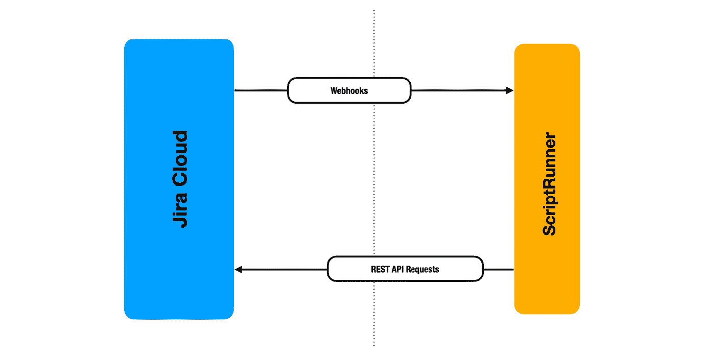
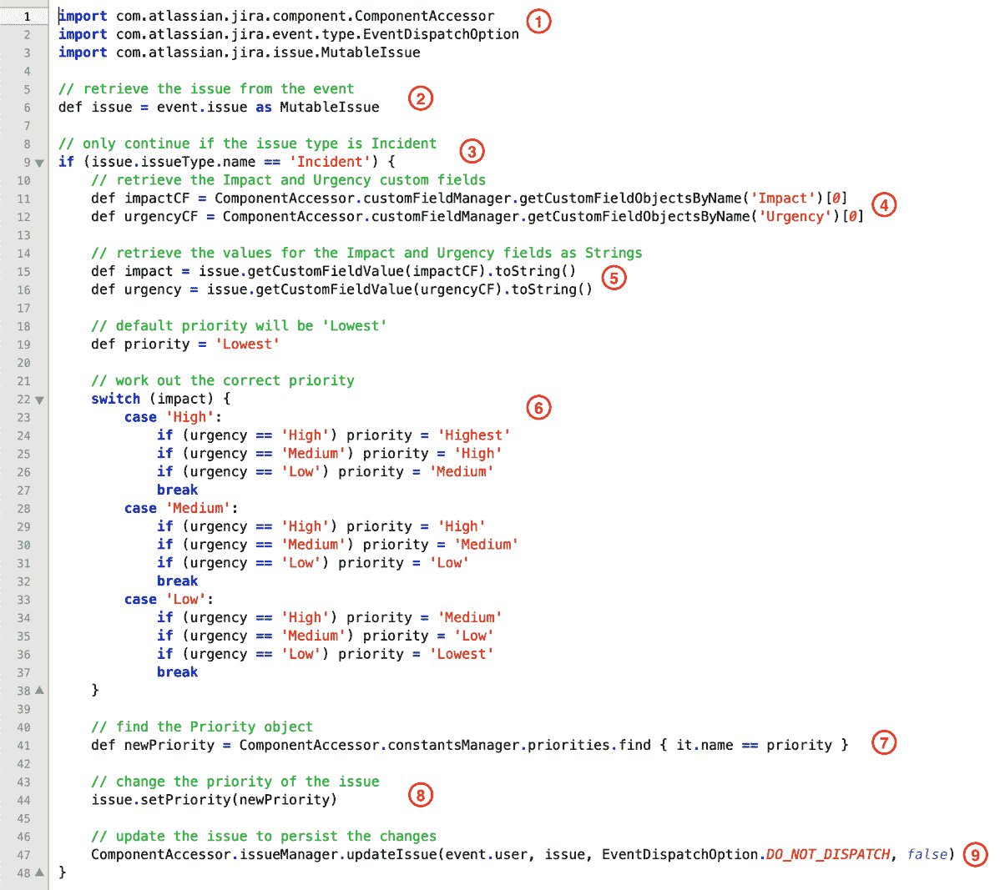
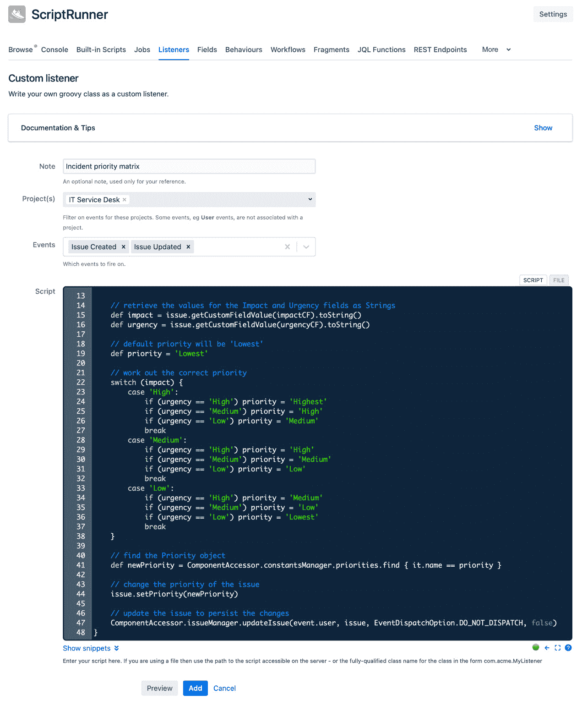

# *第十一章*：超越自动化；脚本编写简介

本书重点介绍了使用无代码的方法在 Jira 中自动化日常任务。这种自动化功能原生支持 Jira Cloud，并且在 Jira Server 和 Jira Data Center 中可以通过添加 *Automation for Jira* 应用程序来使用。

这种方法使得 Jira 管理员能够非常轻松地快速启动自动化，因为它不需要任何专业的编程知识。此外，创建自动化的能力可以委派给项目管理员，从而使 Jira 管理员可以专注于其他任务。

然而，任何关于 Jira 自动化的书籍，如果没有提到脚本编写，尤其是 **ScriptRunner for Jira**，就无法算作完整，因为它无疑是最知名的自动化应用程序。

在这一章中，我们将简要介绍 ScriptRunner for Jira 及其背后使用的 Groovy 脚本语言。此外，我们还将探讨 Jira Cloud 与 Jira Server 在脚本编写上的差异。

本章将涵盖以下主题：

+   使用 ScriptRunner 引入高级自动化

+   探索 Jira Cloud 中的脚本编写

+   探索 Jira Server 中的脚本编写

# 技术要求

本章的要求如下：

+   **Jira 云环境**：如果你还没有 Jira 访问权限，你可以在[`www.atlassian.com/software/jira/free`](https://www.atlassian.com/software/jira/free)创建一个免费的 Jira Cloud 账户，并确保选择了 Jira Software 和 Jira Service Management。你还需要从 Atlassian Marketplace 安装 *ScriptRunner for Jira*。

+   **Jira Server 环境**：如果你使用的是 Jira Server（可从[`www.atlassian.com/software/jira/download`](https://www.atlassian.com/software/jira/download)下载），请确保你拥有 Jira Software 和 Jira Service Desk 的许可证。此外，你还需要确保安装了从 Atlassian Marketplace 获取的 *ScriptRunner for Jira* 应用程序。

你需要成为全球 Jira 管理员才能跟随本章节中的示例进行操作。此外，我们使用了 *IT 服务管理项目模板* 来创建本示例中使用的服务台项目。

你可以从本书的官方 GitHub 仓库下载本章的最新代码示例：[`github.com/PacktPublishing/Automate-Everyday-Tasks-in-Jira`](https://github.com/PacktPublishing/Automate-Everyday-Tasks-in-Jira)。请访问以下链接查看 CiA 视频：[`bit.ly/39L6BIB`](https://bit.ly/39L6BIB)

# 使用 ScriptRunner 引入高级自动化

**ScriptRunner** for Jira 允许你通过编写 **Groovy** 脚本来扩展 Jira Cloud、Jira Server 或 Jira Data Center 的功能。

在自动化中使用 Groovy 语言的能力使您可以访问底层 Java 平台和 Jira API，同时还可以发挥脚本语言本身的全部功能。

如我们所见，在 Jira Cloud 中，访问 Jira API 仅限于与 Jira 提供的 REST API 进行交互。而在 Jira Server 中，您的脚本可以访问 Jira 向开发者开放的整个 API。

本节将首先简要介绍支撑 ScriptRunner 的 Groovy 语言，然后概述 ScriptRunner for Jira 应用程序。

## 介绍 Groovy

**Groovy**，或者称为 **Apache Groovy**，是一种建立在 Java 平台上的编程语言。它既是静态语言，因为它可以编译成字节码，又是动态语言，因为它可以在运行时解释执行。

Groovy 语法与 Java 兼容。这意味着它与 Java 和更重要的第三方库能够无缝集成和运行。这也意味着您可以在 Groovy 脚本中编写 Java 代码，并且代码会被正确解释和执行。

此外，Groovy 支持函数式编程和可选类型，这意味着它可以在运行时推断对象类型。它还具有比 Java 更简洁和表达力更强的语法，并且能够高效地处理 XML 和 JSON。

让我们看一个示例，突出显示 Java 和 Groovy 之间的差异和相似性。

在这个示例中，我们将创建一个包含名字的列表，然后遍历该列表，将每个名字打印到控制台，前面加上 `"Hello"` 这个词，代码如下：

```
List<String> nameList = new ArrayList<>();
nameList.add("Andrew");
nameList.add("Evelyn");
nameList.add("Tony");
for (String name : nameList) {
    System.out.println("Hello " + name);
}
```

尽管这段代码是用 Java 编写的，但它可以在 Groovy 中完全不做修改地运行。在编写脚本时，应用程序通常提供一个执行上下文。这个执行上下文本质上是一个类中的空方法，我们的脚本就是方法体，因此不需要声明周围的类或方法。

现在，让我们看一下上面代码的 Groovy 版本：

```
def nameList = ["Andrew", "Evelyn", "Tony"]
nameList.each { name ->
    println "Hello ${name}"
}
```

这个 Groovy 脚本与我们之前看到的 Java 代码等效。让我们逐行快速查看这个示例中发生了什么：

+   `def nameList = ["Andrew", "Evelyn", "Tony"]`：我们通过使用 `def` 关键字声明 `nameList` 变量来使用可选类型。此外，我们使用方括号初始化该变量，并赋值为一个字符串列表。

+   `nameList.each { name ->`：在这里，我们对列表调用 `each` 闭包，并将闭包参数命名为 `name`。

    闭包通过使用大括号标识，而箭头（`->`）将闭包参数与代码分开。

    当使用仅包含一个参数的闭包，并且您不需要在内部闭包中引用该参数时，可以省略该参数和分隔箭头。

    在这种情况下，参数名默认为 `it`，如下所示：

    `nameList.each { println "Hello ${it}" }`

+   `println "Hello ${name}"`：这一行使用字符串插值打印出 `"Hello"` 字符串，后跟当前正在迭代的名字。

此外，你会注意到，在 Java 中用于终止语句的分号，在 Groovy 中并不需要。

提示

你可以在官方的 Apache Groovy 网站 [`groovy-lang.org/learn.html`](https://groovy-lang.org/learn.html) 上了解更多关于 Groovy 的信息，那里有许多书籍、演示文稿和课程，帮助你学习并最大限度地利用 Groovy 语言。

正如我们所学到的，Groovy 使你能够编写简洁、易读的代码，并且支持你在 Java 中编写脚本。接下来，让我们看看 ScriptRunner for Jira 如何利用这一点，帮助我们在 Jira 中创建自动化脚本。

## 了解 ScriptRunner

Adaptavist 的 **ScriptRunner** 是 Atlassian 生态系统中的一款应用，已有十多年历史。它结合了 Groovy 脚本引擎，并以一种便于通过可用 API 对 Jira 进行脚本访问的方式配置它。

它已经成为许多 Jira 管理员的首选应用，帮助他们自动化并扩展 Jira 的基本功能，实际上，它也适用于其他 Atlassian 工具，包括 Confluence、Bitbucket 和 Bamboo。

简而言之，ScriptRunner 通过提供一个现成的框架，其中所有底层基础设施已经就绪，从而让你能够专注于自动化的业务逻辑，进而让你能够访问 Jira 应用程序。

重要提示

ScriptRunner 提供的功能远不止于创建脚本化自动化。它还提供了使用内置和自定义 Groovy 脚本创建工作流函数的能力。此外，它还提供了一些强大的额外 JQL 功能，便于更轻松地搜索 Jira。它还允许你使用脚本片段对用户界面进行自定义，具体的复杂度会根据你使用的是 Jira Cloud 还是 Jira Server 而有所不同。

Adaptavist 为 ScriptRunner 提供了全面的文档和教程，适用于 Jira Cloud 和 Jira Server。你可以在 [`scriptrunner-docs.connect.adaptavist.com/jiracloud/quickstart.html`](https://scriptrunner-docs.connect.adaptavist.com/jiracloud/quickstart.html) 上了解更多关于 *ScriptRunner for Jira Cloud* 的内容。要了解关于 *ScriptRunner for Jira Server* 的更多信息，你可以在 [`scriptrunner.adaptavist.com/latest/jira/quickstart.html`](https://scriptrunner.adaptavist.com/latest/jira/quickstart.html) 查阅文档。

提示

Adaptavist 提供了一个脚本库，你可以直接使用其中的脚本，或者将它们作为自己脚本的起点。你可以在 [`library.adaptavist.com`](https://library.adaptavist.com) 上找到这些脚本。

现在我们已经简要了解了 ScriptRunner 和 Groovy 脚本语言，接下来让我们看看如何在 Jira Cloud 中使用脚本创建自动化。

# 探索 Jira Cloud 中的脚本

ScriptRunner for Jira Cloud 使你能够根据 Jira 中发生的事件创建自动化任务，例如创建或更新问题等。它还具有升级服务，允许你对由 JQL 查询提供的问题列表执行预定的操作。

ScriptRunner 还提供了在预定时间间隔运行脚本的功能。这与升级服务不同，因为它不需要一个问题列表来执行操作，从而使你能够执行如定期创建问题等任务。

在本节中，我们将简要概述 Jira Cloud API 的工作原理，然后重建来自*第二章*的 *事件优先级矩阵* 示例，*自动化 Jira 问题*，以了解如何使用脚本编写自动化任务。

## 理解 Jira Cloud API

为了使应用能够与 Jira Cloud 集成，它需要使用 *Atlassian Connect 框架* 来构建。该框架允许应用扩展 Jira 用户界面，访问 Jira API，并响应来自 Jira Cloud 的事件。

使用 Connect 框架构建的应用程序是一个通过 HTTP 协议远程操作的 web 应用程序。这意味着，当你为 Jira 构建一个 Connect 应用时，它需要托管在一个可以通过 HTTP 从 Jira Cloud 接收请求的公开可访问的 web 服务器上，并且能够向 Jira Cloud 发送 REST API 请求。

使用 Connect 框架构建的应用与 Jira Cloud 之间的基本交互可以从以下图示中看到。这是关于使用 ScriptRunner 进行自动化的简化表示：



图 11.1 – 应用与 Atlassian Connect 框架的交互

当 Jira Cloud 中发生事件时，Webhook 会通过 HTTP 发送，通知 ScriptRunner 应用该事件已发生。这避免了应用程序需要定期轮询 Jira 以确定是否发生了更改。

作为响应，ScriptRunner 会启动执行配置为监听特定事件的任何脚本。反过来，这些脚本利用 Jira REST API 获取附加信息并更新 Jira 中的数据。

使用 ScriptRunner 的预定或升级服务的脚本只需要访问 Jira REST API 来与 Jira 中的数据进行交互。

提示

你可以在 [`developer.atlassian.com/cloud/jira/platform/webhooks/`](https://developer.atlassian.com/cloud/jira/platform/webhooks/) 上了解有关 Jira Cloud 中 Webhook 的更多信息，而可以在 [`developer.atlassian.com/cloud/jira/platform/rest/v3/intro/`](https://developer.atlassian.com/cloud/jira/platform/rest/v3/intro/) 上了解 Jira Cloud REST API 的相关信息。

现在我们已经了解了 Jira Cloud API 的基本工作原理，让我们来看看如何利用它在 Jira Cloud 中创建脚本自动化。

## 在 Jira Cloud 中创建脚本自动化

在这个示例中，我们将重新创建我们在*第二章*《自动化 Jira 问题》章节中首次介绍的事件优先级矩阵自动化。如果你已经有类似的 Jira 自动化规则，请在实施此规则前禁用该规则。

这个示例将展示如何利用 Groovy 脚本和 Jira Cloud API 在 Jira Cloud 中实现类似的自动化。

我们将使用的 Groovy 脚本在下面的截图中展示：

![图 11.2 – Jira Cloud 中的事件优先级矩阵脚本]

](img/Figure_11.2_B16551.jpg)

图 11.2 – Jira Cloud 中的事件优先级矩阵脚本

让我们来看看这个脚本的执行过程：

1.  我们做的第一件事是使用 Jira 的 REST API 将所有自定义字段检索到一个存储在`customFields`变量中的列表中。

1.  使用自定义字段列表后，我们可以确定`Impact`和`Urgency`字段的 ID，并将其保存到相应的变量中。

1.  现在我们已经获得了`Impact`和`Urgency`字段的 ID，我们可以利用这些 ID 从问题中提取相应的值，这些值表示为`Map`对象。

1.  在这个代码块中，我们使用字段的值来根据优先级矩阵确定正确的优先级。

    我们使用 Groovy 的`switch`语句，使代码比使用 if/else 语句更具可读性。

1.  最后，我们使用 Jira 的 REST API 来更新问题，并使用*第 4 步*中计算出的新优先级。

现在我们已经创建了 Groovy 中的自动化脚本，我们需要在 ScriptRunner 中创建一个脚本监听器来实际启动自动化：

1.  作为 Jira 管理员，点击顶部菜单栏中的**应用程序**菜单，然后选择**管理你的应用程序**。

1.  从左侧菜单中，选择**ScriptRunner**部分下的**脚本监听器**标签，然后点击**添加监听器**按钮。

1.  完成脚本监听器字段如下：

    `事件优先级矩阵`

    `问题已创建`和`问题已更新`

    `IT 服务台 (DESK)`

    `当前用户`

1.  我们只希望在问题为事件时才调用该监听器，因此我们需要向监听器添加一个条件，只有在处理事件时它才会评估为`true`。

    在`issue.issueType.name == 'Incident'`

    这将确保该监听器仅在问题类型名称为`Incident`时继续执行。

1.  最后，将脚本输入到本章节 GitHub 仓库中的`11.1 事件优先级矩阵 – Cloud.groovy`文件中，然后将代码复制并粘贴到字段中。

    你的脚本监听器现在应该类似于以下截图：

![图 11.3 – 在 Jira Cloud 中创建脚本监听器]

](img/Figure_11.3_B16551.jpg)

图 11.3 – 在 Jira Cloud 中创建脚本监听器

在本节中，我们学习了如何在 Jira Cloud 中使用 Groovy 脚本在脚本监听器中重新创建事例优先级矩阵。现在，您应该了解如何使用脚本编写自动化任务。

在接下来的部分中，我们将查看如何在 Jira Server 中创建脚本自动化，并重新使用事例优先级矩阵示例，以便您可以看到两个平台之间的区别。

# 探索 Jira Server 中的脚本编写

与 Jira Cloud 的 ScriptRunner 类似，ScriptRunner for Jira Server 允许您根据 Jira 中的事件创建自动化。

然而，与 Jira Cloud 不同的是，由于您可以访问完整的 Jira API，因此您能够在 Jira Server 中对更广泛的事件创建自动化。

在本节中，我们将查看 Jira Server 平台上脚本可用的 API。然后，我们将再次查看事例优先级矩阵示例，以便更容易理解两个平台之间脚本编写的区别。

## 理解 Jira Server API

与 Jira Cloud API 相反，使用 Jira Server API 编写的应用程序在与核心 Jira 应用程序相同的 Java 进程中运行，因此可以通过公共基于 Java 的 API 充分访问底层应用程序。

ScriptRunner for Jira Server 是使用 Jira **Plugins2** (**P2**) 框架构建的应用程序。该框架允许应用程序注册为 Jira 中事件的监听器，并提供访问应用程序随附的底层 API 和公共第三方库的能力。

Jira API 非常庞大，要全面理解它的每个方面可能需要几本书。然而，出于我们的目的，我们将集中精力讨论 `ComponentAccessor` 类，其文档位于 [`docs.atlassian.com/software/jira/docs/api/latest/com/atlassian/jira/component/ComponentAccessor.html`](https://docs.atlassian.com/software/jira/docs/api/latest/com/atlassian/jira/component/ComponentAccessor.html)。

该类是在 ScriptRunner 中编写脚本时您将需要的大多数组件的入口点。它为您提供了诸如 `IssueService` 和 `IssueManager` 类的操作权限，这些类用于创建、更新和修改问题。您还将使用它获取 `CustomFieldManager` 类的访问权限，该类允许您操作 Jira 中定义的大多数自定义字段。

提示

您可以在官方的 *执行问题操作* 教程中了解如何使用 `IssueService` 和 `IssueManager` 与 Jira 中的问题进行交互，位于 [`developer.atlassian.com/server/jira/platform/performing-issue-operations/`](https://developer.atlassian.com/server/jira/platform/performing-issue-operations/)。

要访问 `ComponentAccessor`，您需要在脚本的开头显式导入该类，如下所示：

`import com.atlassian.jira.component.ComponentAccessor`

正如你将在下一部分的示例中看到的那样，`ComponentAccessor`是我们在 Jira Server 中查找和操作数据的核心工具。

现在我们简要介绍了 Jira Server API，接下来让我们看看如何使用 API 创建自动化脚本。

## 在 Jira Server 中创建脚本自动化

在这个例子中，我们将使用 Groovy 脚本重新创建事件优先级矩阵，这样我们可以了解在 Jira Server 和 Jira Cloud 中编写脚本的区别。

我们将要使用的脚本示例如下所示：



图 11.4 – Jira Server 中的事件优先级矩阵脚本

让我们来看看这个脚本在做什么：

1.  我们需要做的第一件事是导入 Jira API 类，这些类是我们脚本所需的。如果没有这些类，脚本将无法编译并无法访问 Jira API。

1.  Jira Server 中的 ScriptRunner 脚本监听器会将事件对象传递给脚本。该事件对象在`issue`字段中包含底层问题。

    此外，我们还确保将`issue`变量强制转换为`MutableIssue`类型，这将允许我们对问题进行更改。

1.  ScriptRunner 中的自定义脚本监听器没有条件字段，因此我们需要使用`if`语句确保只有在处理事故问题类型时才继续执行。

1.  这里我们通过使用`ComponentAccessor`中的`CustomFieldManager`组件来获取`Impact`和`Urgency`字段的自定义字段对象。在这个例子中，我通过名称而不是 ID 来获取字段，但你也可以使用任一方法。

1.  现在我们已经拥有了`Impact`和`Urgency`字段的自定义字段对象，可以使用这些对象从问题中检索它们各自的值。

    此外，我们还提取了这些值的字符串表示形式，以便在接下来的代码块中进行比较。

1.  在此代码块中，我们使用字段的值根据优先级矩阵来确定正确的优先级。

    我们利用 Groovy 的`switch`语句使代码比使用 if/else 块更加易读。

1.  在 Jira Server 中，优先级字段是优先级类型的对象，因此我们需要找到与我们在*步骤 6*中计算的字符串值相对应的`Priority`对象。

    我们通过使用`ComponentAccessor`提供的`ConstantsManager`类来检索系统中所有的优先级。

    然后，我们使用`find`闭包来搜索名称字段匹配我们计算出的优先级的优先级对象。

1.  一旦找到正确的优先级对象，我们就可以相应地更新问题。

1.  最后，我们需要将更改持久化到数据库中，我们通过调用从`ComponentAccessor`获取的`IssueManager`对象上的`updateIssue`方法来实现。

    我们不希望此特定更新导致更多的更新事件被触发，因此我们使用 `EventDispatchOption.DO_NOT_DISPATCH` 选项来表示这一点。

    我们还不希望在更新问题时发送任何电子邮件通知，因此我们将最后一个参数设置为 `false`。

正如我们在这个示例中所学到的，针对 Jira Server 编写的脚本可以利用完整的 Jira API，而不是针对 Jira Cloud 编写的脚本所能使用的简化版 REST API。

注意

拥有完整的 Jira API 访问权限既强大又危险。您在 Jira Server 中编写脚本时应谨慎操作，因为编写不当的脚本可能会导致严重的性能下降，甚至更糟的后果。

让我们通过将脚本附加到监听器上来完成此示例，这样它就会在每次创建或更新事件时执行：

1.  作为 Jira 管理员，点击设置菜单（齿轮）图标，然后选择 **管理应用**。

1.  在左侧菜单中，选择 **ScriptRunner** 部分下的 **监听器** 标签，点击 **创建监听器** 按钮，然后选择 **自定义监听器**。

1.  按照以下方式填写监听器字段：

    `事件优先级矩阵`

    `IT 服务台`

    `问题创建` 和 `问题更新`

1.  在本章的 GitHub 仓库中输入 `11.2 事件优先级矩阵 - Server.groovy` 中的 Groovy 脚本，然后将代码复制粘贴到字段中。

    新的脚本监听器现在应该类似于以下截图：



图 11.5 – 在 Jira Server 中创建脚本监听器

现在我们已经完成了本节内容，您已经学会了如何在 ScriptRunner for Jira Server 中使用 Groovy 脚本创建自动化。您现在应该也能理解 Jira Cloud 和 Jira Server 平台在脚本方面的一些核心差异。

# 总结

在本章中，我们介绍了 ScriptRunner for Jira，这是一款允许我们在 Jira 中使用脚本创建高级自动化的应用程序。

我们已经学习了 Groovy 语言，ScriptRunner 使用它在 Jira 中启用脚本化，并且我们了解到 Groovy 可以执行 Java 和 Groovy 语句，这使得即使不先学习 Groovy，也能更容易入门。

为了理解脚本如何与 Jira Cloud 进行交互，我们了解了 Atlassian Connect 框架，它用于为 Jira Cloud 构建应用程序，并且我们了解了它如何使 ScriptRunner 提供对 Jira 的脚本化访问。

接着，我们通过重新创建 *第二章* 中的事件优先级矩阵示例，学习了如何创建一个脚本自动化，并且通过解析脚本，我们了解了与 Jira Cloud 进行交互的方式。

接下来，我们向您介绍了 Jira Server 上的脚本，并通过简要了解 Jira Server API，学习了它与 Jira Cloud 的脚本有什么不同。

为了更容易理解不同平台之间的差异，我们重新使用了事件优先级矩阵示例脚本，并再次分析了该脚本，以了解如何与 Jira Server API 进行交互。

了解如何使用 Groovy 脚本创建高级自动化，将使你能够创建超越无代码方法的自动化，而这正是本书的重点，它将使你能够根据自己的需求定制 Jira 实例。

这也标志着本书的结束，我希望它不仅激励了你，还能给你一些关于如何将自动化提升到新水平的想法。
