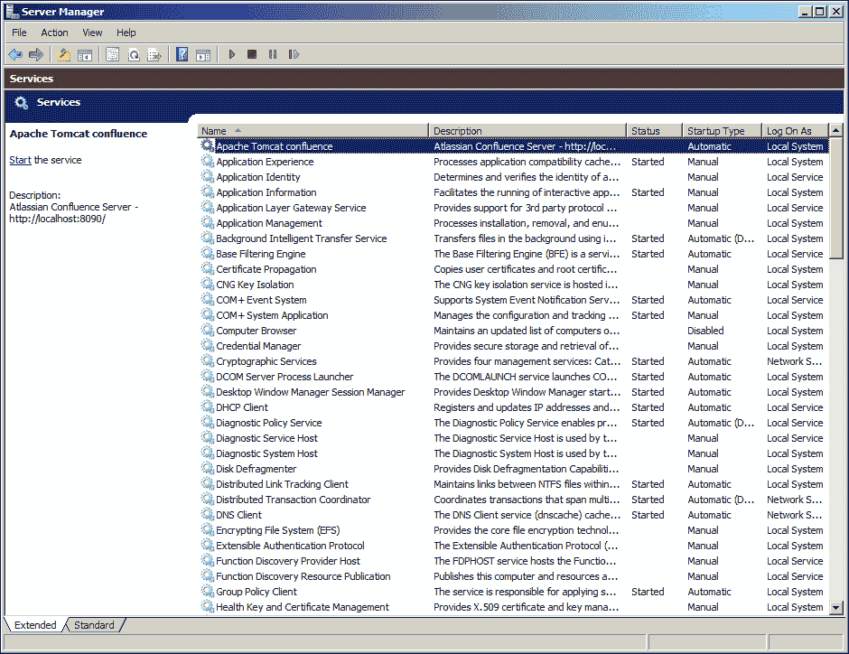

# 第一章：开始使用 Confluence

Atlassian 自 2002 年起步，他们的目标是创建既便宜又易于使用的软件，并且安装和维护工作量小。正是因为这些原则，Confluence 的安装过程相对简单直接；甚至有一键安装向导可用。在本章中，我们将从 Confluence 的高层次概述开始，查看构成该应用程序的不同组件。我们将探讨可用的不同部署选项，包括发行版选择、应用服务器和数据库。最后，我们将从零开始安装我们自己的 Confluence 应用程序。

在本章结束时，你将学到以下内容：

+   Confluence 的整体架构

+   Confluence 支持的平台和应用程序

+   安装 Confluence 及所有必需的软件

+   配置数据库连接

+   安全地运行 Confluence

# 理解架构

安装 Confluence 简单明了。然而，理解安装过程中涉及的组件以及可用的选项对我们来说非常重要。理解这些内容将帮助你做出明智的决策，更好地为故障排除和未来的更新做好准备。

## 高层次架构

Atlassian 提供了 Confluence 技术组件的全面概述，详情请见[`developer.atlassian.com/display/CONFDEV/Confluence+Architecture`](https://developer.atlassian.com/display/CONFDEV/Confluence+Architecture)。然而，这个概述主要对那些开发自定义插件的人比较有兴趣，对日常管理和使用 Confluence 的管理员帮助不大。因此，我们创建了一个高层次的概述，突出了架构中最重要的组件，以及我们的用户如何连接到 Confluence：


## 支持的浏览器

Confluence 是一个 Web 应用程序，因此我们的用户只需一个兼容的 Web 浏览器就能访问它。这个浏览器可以是桌面系统、笔记本电脑，甚至是智能手机或平板电脑等移动设备。Confluence 的较新版本依赖于一些新的 Web 技术和标准。因此，较旧版本的 Internet Explorer 和 Firefox 已经不再完全兼容。

下表总结了 Confluence 5.1 的浏览器要求：

| 浏览器 | 兼容性 |
| --- | --- |
| Microsoft Internet Explorer（Windows） | 8, 9（由于 Internet Explorer 未完全支持相关的 HTML5 特性，因此拖放操作不完全支持） |
| Mozilla Firefox（所有平台） | 10+ |
| Safari（Windows 和 Mac） | 5, 6 |
| Google Chrome（Windows 和 Mac） | 17+ |
| 移动 Safari（iOS） | iOS 5.1, 6.0（在移动设备上不支持编辑） |

## 数据存储

配置文件、附件、索引和插件默认存储在首次安装 Confluence 时配置的 Confluence Home 目录中。所有其他数据存储在配置的数据库中。附件可以选择配置为存储在数据库中，而不是 Confluence Home 目录中。 |

你可以选择将附件存储在数据库中，以便于备份（所有数据集中存放）或是处理在文件系统中无效的字符。请注意：将附件存储在数据库中会大幅增加数据库的大小。在多个 Confluence 安装共享数据的集群环境中，你需要将附件存储在数据库中。

## Confluence 安装目录

安装 Confluence 的目录称为安装目录。它包含了所有应用程序服务器的可执行文件和配置文件。Confluence 不会修改或存储任何数据在此目录中。此目录主要用于执行。接下来的内容中，我们将此目录称为 `CONF_INSTALL`。

## Confluence Home 目录

Confluence Home 目录是 Confluence 存储其配置、搜索索引、附件和插件的文件夹，特定于一个 Confluence 安装。这意味着每个 Confluence 安装必须且只能有一个 Confluence Home 目录，且每个 Confluence Home 目录只能服务于一个 Confluence 安装。如果你正在评估 Confluence 并使用内嵌的 HSQLDB 数据库，数据库文件也存储在此目录中。接下来的内容中，我们将此目录称为 `CONF_HOME`。

推荐将 `CONF_HOME` 单独创建，而不是与 Confluence 安装在同一位置。数据和应用程序的分离使得维护、备份和未来升级等任务更加简便。请记住，Confluence Home 目录在高度使用的网站上可能会变得非常大。

在 `CONF_HOME` 中有几个重要的文件和子目录：

| 文件/目录 | 描述 |
| --- | --- |
| `confluence.cfg.xml` | Confluence 的核心配置文件；包含连接数据库和许可证密钥的配置。 |
| `Attachments/` | Confluence 网站中的所有文件附件都存储在此目录下。如果附件没有存储在数据库中，这里是 Confluence 存放附件文件的地方。 |
| `Backups/` | 如果 Confluence 配置为每日备份，备份文件将存储在此目录中。管理员应定期删除旧的备份文件，以防止目录变得过大。 |
| `Bundled-plugins/` | 与 Confluence 安装捆绑的插件存储在此目录中。用户安装的插件不会保存在此目录。 |
| `Config/` | 各种全局和每个空间的配置文件保存在此目录中。 |
| `Index/` | 完整文本搜索索引保存在此目录中。删除或修改此目录中的文件可能会导致搜索功能失效。可以通过管理控制台执行重新索引操作，重新生成此文件夹中的文件。 |
| `Logs/` | 应用程序日志文件保存在此目录中。 |
| `Plugins-osgi-cache/` | 通过 Confluence 界面安装的插件会下载并保存在此目录中。 |
| `Temp/` | Confluence 在此目录中存储临时文件，特别是在备份和导出期间。Confluence 内部的定时任务会删除不再需要的文件。 |
| `Thumbnails/` | 存储图像缩略图的临时文件。可以安全删除此目录中的内容，因为 Confluence 会在需要时重新生成缩略图。 |

# 安装选项

Confluence 是一个基于 Java 的 Web 应用程序，采用许多开放标准和库进行开发。因此，它能够在许多不同的操作系统、数据库和应用程序服务器上运行。我们将更详细地了解我们拥有的选项，并根据我们的情况做出明智的决策。

## 独立版和 WAR 发行版

首先，我们需要决定选择哪个发行版。Confluence 提供三种发行版：

+   一键安装程序

+   独立版捆绑 Apache Tomcat

+   WAR/EAR 发行版

关于应用程序而言，这三种发行版之间没有区别。安装程序版和独立版都捆绑了 Apache Tomcat，这意味着我们不需要自己安装和配置应用程序服务器。这些发行版还包含了一个嵌入式的内存数据库，可以用于评估目的。

安装程序是一个非常方便的封装工具，自动化了我们通常需要手动执行的所有步骤。对于评估 Confluence 来说，这非常好，但它并未提供我们在维护安装过程中所涉及步骤的深入了解。因此，当我们需要自己安装 Confluence 时，我们将使用独立版发行版。

如果你已经有一个运行中的 J2EE 应用程序服务器，或者有安装和调优应用服务器的经验，那么 WAR 发行版可能适合你。由于不同应用程序服务器之间的差异，你需要使用提供的构建脚本来构建最终的部署文件。一旦构建完成，你可以像部署任何其他 Java Web 应用程序一样部署 Confluence。

## 操作系统

Confluence 官方支持 Microsoft Windows 和 Linux（所有发行版）。Mac OS 仅作为客户端平台支持。选择在哪个操作系统上运行 Confluence 大多是根据专业技能的偏好来决定的，并且在大多数情况下，已有特定需求的 IT 基础设施。

如果您没有特别偏好并且希望保持初始成本较低，Linux 将是一个不错的选择，因为没有许可证费用。如果您的服务器内存超过 4 GB，请确保选择 64 位版本。

## 数据库

Confluence 将所有数据存储在关系型数据库中。嵌入式内存 HSQLDB 数据库仅供评估使用，绝不应在生产环境中使用。为了减少数据损坏的风险，重要的是我们为生产系统使用企业级数据库。

Confluence 支持目前大多数关系型数据库。在安装和配置 Confluence 的过程中不会出现明显差异。就像操作系统一样，您选择的数据库通常取决于个人偏好或您所在组织的 IT 标准。如果您使用的是 Windows 操作系统，那么最有可能的选择是 Microsoft SQL Server。如果您使用的是 Linux，那么应该考虑 PostgreSQL、MySQL 或 Oracle。

下表总结了 Confluence 5.1 当前支持的数据库列表。值得一提的是，PostgreSQL 和 MySQL 都是开源（免费）产品，如果您希望减少初始投资，它们是非常好的选择。

| 数据库 | 支持版本 |
| --- | --- |
| PostgreSQL | 8.4, 9.0 |
| MySQL | 5.1, 5.5 |
| Microsoft SQL Server | 2005, 2008, 2008 R2 |
| Oracle | 11.1, 11.2 |
| HSQLDB | （仅供评估使用） |

## 应用服务器

Confluence 需要一个兼容 J2EE 的应用服务器。唯一官方支持的应用服务器是 Apache Tomcat。幸运的是，Apache Tomcat 是一个开源产品，适用于所有操作系统。

Confluence 5.1 仅支持 Tomcat 6.0。

# 安装 Confluence

现在我们已经对 Confluence 的整体架构和各种安装选项有了充分的了解，我们准备安装自己的 Confluence 实例。

在接下来的练习中，我们将安装和配置一个全新的 Confluence 实例，使其准备好投入生产使用。我们将使用独立包，并且安装将基于 Windows 平台。如果您打算使用其他操作系统，请参考 [`confluence.atlassian.com/display/DOC/Installing+Confluence`](https://confluence.atlassian.com/display/DOC/Installing+Confluence) 以获取有关在该平台上安装 Confluence 的详细信息。

在这个练习中，我们将：

+   安装全新的 Confluence 实例

+   配置 Confluence 以使用关系型数据库

+   配置 Confluence 以发送电子邮件通知

+   配置 Confluence 为自动启动的 Windows 服务，以便其自动启动

我们将在后续章节和练习中继续使用此 Confluence 实例，同时为您所在的组织准备 Confluence 的使用。

对于我们的实现，我们将使用：

+   Confluence 独立发行版 5.1.0

+   PostgreSQL 9.0

+   Java 开发工具包 7 更新 9

+   Microsoft Windows Server 2008 R2

## 安装 Java

Confluence 要求系统上安装 Java，这是我们的第一步。Confluence 5.1 要求最新更新的 JDK 7。如果你安装的是不同版本的 Confluence，请确认是否支持 JDK 7。选择 32 位或 64 位版本取决于你希望为 Confluence 分配多少内存；如果超过 4GB，选择 64 位版本，因为 32 位版本的上限是 4GB。

当前，只有在 32 位 Java 版本上运行时，才能将 Confluence 安装为 Windows 服务。

按照以下步骤在系统中安装 Java：

1.  从[`www.oracle.com/technetwork/java/javase/downloads/index.html`](http://www.oracle.com/technetwork/java/javase/downloads/index.html)下载最新版本的 32 位 JDK 7。

1.  双击下载的安装文件以启动安装向导。

1.  选择你希望安装 Java 的位置；或者你也可以直接接受默认值。安装 JDK 的路径将在本书中被称为`JAVA_HOME`。

1.  创建一个名为`JAVA_HOME`的新环境变量，路径指向你刚刚安装 Java 的位置，如下图所示：

1.  通过在命令提示符中输入以下命令来测试安装是否成功：

    ```
    java –version

    ```

    这应该显示已安装的 Java 版本：

    ```
    C:\>java –version
    java version "1.7.0_17"
    Java(TM) SE Runtime Environment (build 1.7.0_17-b02)
    Java HotSpot(TM) Client VM (build 23.7-b01, mixed mode, sharing)

    ```

## 安装 PostgreSQL

下一步是为我们的 Confluence 安装准备一个数据库。

安装 PostgreSQL，请执行以下步骤：

1.  从[`www.postgresql.org/download/windows/`](http://www.postgresql.org/download/windows/)下载 PostgreSQL。

    ### 注意

    截至目前，PostgreSQL 的最新版本尚不支持 Confluence。我们将使用 PostgreSQL 版本 9.0.12。

1.  双击下载的安装文件以启动安装向导。

1.  选择你希望安装 PostgreSQL 的位置以及存储数据的位置。在本练习中，我们将使用默认设置。

1.  为 root 用户选择一个密码；请记住，这不是我们 Confluence 数据库的密码。我使用了`p0stgre$`，为了简便和易于记住，同时符合 Windows 2008 的密码安全规则。

1.  如果你选择了不同的端口号，请确保它不会与机器上运行的其他服务发生冲突。并且记住端口号，我们稍后会用到它。

1.  取消选中复选框，确保安装过程完成后不会启动 Stack Builder。我们不需要它。

### 创建用户和数据库

现在 PostgreSQL 已安装在我们的机器上，我们需要为 Confluence 创建一个专用的用户和数据库。这样可以防止其他应用用户访问 Confluence 数据。

按照以下步骤创建新用户和数据库：

1.  启动刚刚由安装程序安装的 **pgAdmin III** 管理工具。我们将使用该管理工具来创建 Confluence 用户和数据库。

1.  通过双击服务器名称连接到运行在 localhost 上的 PostgreSQL 服务器。在提示时输入您刚刚设置的 root 密码：

1.  创建一个新用户，或者说是“登录角色”，正如 PostgreSQL 所称的。右键单击对象浏览器中的 **Login Roles**（在左侧），然后选择 **New Login Role...**：

    1.  输入用户名：`confluence`。

    1.  输入密码：`confluence`。

    1.  不要选择任何角色权限。

    1.  确认角色的创建。

1.  创建一个新数据库；右键单击 **Databases** 并选择 **New Database**。

    1.  输入数据库名称：**confuencedb**。

    1.  将数据库的所有者设置为我们刚刚创建的用户。

    1.  选择 **UTF-8** 作为编码方式。

    1.  确认数据库的创建。

1.  就这样。我们已经安装了 PostgreSQL，并为 Confluence 安装创建了一个用户和数据库。

## 安装 Confluence

现在我们已经准备好了 JDK 和数据库，满足了在我们的机器上安装 Confluence 所需的所有条件。为了安装 Confluence，我们需要：

+   解压 Confluence

+   配置 Confluence Home 目录

+   检查 Confluence 使用的端口

+   配置电子邮件

可选地，我们可以配置 Confluence 使用 HTTPS 并作为 Windows 服务运行。

### 解压 Confluence

执行以下步骤解压 Confluence：

1.  从 [www.atlassian.com/software/confluence/download](http://www.atlassian.com/software/confluence/download) 下载最新版本的 Atlassian Confluence。

1.  Atlassian 网站会自动检测您正在使用的操作系统，并相应地推荐一个发行版。如果您打算在与当前系统不同的系统上安装 Confluence，请确保选择正确的发行版。

1.  如前所述，Windows 和 Linux 都提供了一键安装程序。为了本次练习，我们将使用 ZIP 压缩包，因为它将让我们了解安装过程中通常隐藏的步骤。

1.  将下载的 ZIP 文件解压到 `c:/confluence/`。建议使用第三方解压软件，如 7-Zip 或 WinZip，因为 Windows 自带的解压工具存在已知问题。您可以选择不同的安装路径；只需确保目录路径中不要使用空格。

1.  `C:\confluence\atlassian-confluence-5.1` 将被称为 `CONF_INSTALL`。接下来，我们将定义 Confluence Home 目录。

### 配置 Confluence Home 目录

接下来，我们需要定义并配置 `CONF_HOME`。记住，我们希望将数据与安装数据分开存储。

1.  创建 `c:\confluence\data`；该目录将被称为 `CONF_HOME`。

1.  打开 `CONF_INSTALL` 并在您喜欢的文本编辑器中打开文件 `confluence\WEB-INF\classes\confluence-init.properties`。

1.  定位以下行；通常位于文件末尾。

    `# confluence.home=c:/confluence/data`

1.  删除此行开头的 `#` 和空格，以便 Confluence 不再将其视为注释。

1.  如果您为 `CONF_HOME` 选择了不同的目录，则相应更改路径。请注意以下内容：

    1.  避免在目录路径中使用空格。

    1.  使用斜杠 `/` 定义路径。

### 配置端口

默认情况下，Confluence 在端口 8090 上运行，没有上下文路径。这意味着启动 Confluence 后，它将在 `http://localhost:8090/` 上可用。如果您的机器上有另一个使用相同端口的应用程序运行，您可能需要更改 Confluence 将使用的端口。当您在代理后面运行应用程序并希望使用相同域访问它们时，例如 `http://example.com/jira` 和 `http://example.com/confluence`，更改上下文路径非常有用。在此练习中，我们将更改 Confluence 正在运行的上下文为 `/confluence`。

要更改 Confluence 的端口，请打开您 `CONF_INSTALL` 目录下的文件 `conf/server.xml`。该文件的摘录如下所示：

```
<Server port="8000" shutdown="SHUTDOWN" debug="0">
<Connector className="org.apache.coyote.tomcat4.CoyoteConnector" port="8090"…. />
<Context path="/confluence" docBase="../confluence" debug="0" reloadable="false" useHttpOnly="true">
```

### 提示

**下载示例代码**

您可以从您在 [`www.packtpub.com`](http://www.packtpub.com) 上购买的所有 Packt 图书的帐户中下载示例代码文件。如果您在其他地方购买了这本书，您可以访问 [`www.packtpub.com/support`](http://www.packtpub.com/support) 并注册，直接将文件通过电子邮件发送给您。

第一行：此行指定关闭 Tomcat 命令的端口。默认情况下，此端口为 8000。如果您已经在该端口上运行应用程序，可以将其更改为另一个端口。

第二行：此行指定 Confluence/Tomcat 将在哪个端口运行。默认情况下，此端口为 8090。如果由于某种原因该端口不可用，可以将其更改为另一个可用端口。

第三行：此行允许您更改 Confluence 可用的上下文路径。默认情况下，路径为空，这意味着 Confluence 将在 `http://hostname:portnumber/` 上可用。

在此练习中，我们将上下文路径更改为 `/confluence`，如前面的文件所示。

### 配置电子邮件 JNDI 资源

为了使用 Confluence 的共享和通知功能，必须设置电子邮件帐户。通常，我们可以使用 Confluence 界面来完成此操作，但是如果您希望使用例如您的 Gmail 帐户来使用 SMTPS，则存在一个例外。因此，在此练习中，我们将配置 Confluence 以使用您的 Gmail 帐户向用户发送电子邮件通知。

1.  移动（*不要复制*）`activation-1.0.2.jar` 和 `mail-1.4.1.jar` 从 `CONF_INSTALL/confluence/WEB-INF/lib` 到 `CONF_INSTALL/lib`。

1.  将以下资源添加到你的 `CONF_INSTALL/conf/server.xml` 文件中；确保在 `</Context>` 标签之前添加它。

    ```
    <Resource name="mail/GmailSMTPServer"
    auth="Container"
    type="javax.mail.Session"
    mail.smtp.host="smtp.gmail.com"
    mail.smtp.port="465"
    mail.smtp.auth="true"
    mail.smtp.user="yourEmailAddress@gmail.com"
    password="yourPassword"
      mail.smtp.starttls.enable="true"
      mail.transport.protocol="smtps"
    mail.smtp.socketFactory.class="javax.net.ssl.SSLSocketFactory"
    />
    ```

1.  将 `yourEmailAddress@gmail.com` 和 `yourPassword` 替换为你账户的正确值。

1.  记住或写下资源名称。当我们配置 Confluence 并被要求提供电子邮件服务器时，JNDI 位置将是：

    `java:comp/env/mail/GmailSMTPServer`

    请注意，名称区分大小写。

### 配置 HTTPS

默认情况下，Confluence 使用标准的未加密 HTTP 协议运行。如果你在安全的环境中运行 Confluence，例如内部网络，这种配置是可以接受的。然而，如果你计划通过互联网开放 Confluence 访问权限，你需要加强安全性。我们将通过将 Confluence 配置为通过 HTTPS（SSL 加密的 HTTP）运行来实现这一点，从而加密登录信息和数据在互联网上传输过程中的安全性。

对于独立安装，我们需要执行以下任务：

+   创建或请求一个新的 SSL 证书

+   在我们的应用服务器上启用 HTTPS

+   将流量重定向到 HTTPS

首先，我们需要获取一个数字证书。这个证书可以是来自认证机构（如 VeriSign 或 StartSSL）的证书（CA 证书），也可以是由你生成的自签名证书。CA 证书不仅能加密数据，还能向用户识别你的 Confluence 副本。自签名证书适用于没有有效 CA 证书且仅需设置 HTTPS 以加密数据的情况。

由于自签名证书没有经过认证机构签名，用户可能会收到提示，表示该站点不可信，并且需要执行一些步骤以接受证书后才能访问该站点。通常这种情况只会在第一次访问时发生。自签名证书非常适合用于评估，但建议在生产环境中使用 CA 证书。

在本次练习中，我们将创建一个自签名证书。如果你已经拥有 CA 证书，当然可以使用该证书。

#### 生成证书

按照以下步骤使用 Java 的 keytool 工具生成证书。该工具包含在 JDK 中，可以在 `JAVA_HOME/bin` 找到。

1.  在命令提示符下运行以下命令：

    ```
    "%JAVA_HOME%/bin/keytool.exe" -genkeypair -alias tomcat -keyalg RSA

    ```

1.  当系统要求输入密码时：

    1.  指定你希望用于证书的密码。请注意，密码输入时不会显示为明文。

    1.  记下你选择的密码；我们将在下一步编辑 Tomcat 配置时需要使用该密码。

    1.  在本次练习中，我们将使用默认密码 `changeit`。

1.  按照提示输入您的域名、组织和位置。这些信息将用于构建实体的 X.500 区别名称 (DN)。对于问题 **您的名字是什么？** (CN)，不要填写您的真实姓名。CN 必须与运行 Confluence 的服务器的完全限定主机名匹配。否则，Tomcat 将无法使用证书进行 SSL。

    例如，对于我们在本地运行的 Confluence：

    CN = `localhost`，OU = `Confluence Essentials`，O = `Packt`，C = `UK`

1.  输入 `y` 以确认详情。

1.  当系统提示输入 `tomcat` 的密码（您在 keytool 命令中输入的别名）时，按 *Enter* 键。您 *必须* 使用与密钥库密码相同的密码。这是 Tomcat 实现的限制。

1.  现在您的证书已准备好。

我们的自签名证书现在已经在 Java 的密钥库中。如果您使用的是之前生成的证书或 CA 证书，您需要将该证书导入到 Java 的密钥库中。可以使用以下命令进行导入：

```
keytool -importcert -alias tomcat -file <MY_CERTIFICATE_FILENAME>

```

#### 配置 Tomcat

要启用 HTTPS，请打开 `CONF_INSTALL/conf/server.xml` 文件，并在文本编辑器中找到并取消注释以下行：

```
<Connector port="8443" maxHttpHeaderSize="8192"
    maxThreads="150" minSpareThreads="25" maxSpareThreads="75"
    enableLookups="false" disableUploadTimeout="true"
    acceptCount="100" scheme="https" secure="true"
    clientAuth="false" sslProtocol="TLS" SSLEnabled="true"
    URIEncoding="UTF-8" keystorePass="<MY_CERTIFICATE_PASSWORD>"/>
```

这个连接器将为 Confluence 启用 HTTPS，并使用 8443 端口。我们需要将 `<MY_CERTIFICATE_PASSWORD>` 替换为创建证书时指定的密码。在我们的案例中，这个密码是 `changeit`。

默认情况下，Tomcat 期望密钥库文件命名为 `.keystore`，并位于 Tomcat 运行的用户主目录中。这可能与您的用户账户不同，因此可能位于其他目录。如果您的证书不在默认位置，您需要更新服务器配置，在连接器元素中包含 `keystoreFile="<MY_CERTIFICATE_LOCATION>"`。

#### 将流量重定向到 HTTPS

尽管 HTTPS 已经启用且可用，但旧的 HTTP URL 仍然有效。我们需要配置 Confluence 以便它会自动将 HTTP 请求重定向到 HTTPS。我们需要通过在 `web.xml` 中添加安全约束来实现这一点。

打开 `CONF_INSTALL/confluence/WEB-INF/web.xml` 文件，并在文件末尾 `</web-app>` 标签之前添加以下代码片段：

```
<security-constraint>
  <web-resource-collection>
    <web-resource-name>Restricted URLs</web-resource-name>
    <url-pattern>/</url-pattern>
  </web-resource-collection>
  <user-data-constraint>
    <transport-guarantee>CONFIDENTIAL</transport-guarantee>
  </user-data-constraint>
</security-constraint>
```

这将导致 Tomcat 将所有进入非 SSL 端口的请求重定向。第一部分将确保所有 URL 都会被此安全约束检查。第二部分将确保使用 HTTPS 进行传输。

### 将 Confluence 配置为服务

在 Windows 下，Confluence 可以配置为 Windows 服务，从而在操作系统重启时自动启动。推荐这样做，因为替代方法是让机器上保持控制台窗口开启，这可能会被意外关闭，导致 Confluence 停止运行。

要将 Confluence 配置为 Windows 服务，只需执行以下步骤：

1.  以管理员身份启动新的命令提示符，并浏览到 `CONF_INSTALL/bin` 目录。

1.  运行以下命令：

    ```
    service.bat install Confluence

    ```

1.  这将把 Confluence 安装为一个 Windows 服务。该服务将被命名为 Apache Tomcat Confluence。

1.  通过进入 **开始** | **管理工具** | **服务** 来验证配置，访问服务控制台。 

您现在可以通过 Windows 服务面板启动、停止或重启 Confluence。

# 启动 Confluence

一切就绪，开始我们的 Confluence 安装。因此，让我们通过 Windows 中的服务控制台启动 Confluence。服务器运行后，您可以使用 Internet 浏览器访问 Confluence。您的 Confluence URL 是 `https://localhost:8443/confluence`。如果您没有在安装时添加 HTTPS 或上下文路径，可以通过 `http://localhost:8090/` 访问 Confluence。

如果您使用了自签名证书，您将看到一个提示，表明存在证书错误，类似于以下截图所示：


您将看到的第一页是配置向导的第一步，它将完成您的 Confluence 安装。

## 安装向导

向导的第一步是提供有效的许可证。这可以是完整许可证或评估许可证。如果您已经从 Atlassian 获得了许可证，可以将其复制并粘贴到 **License Key** 文本框中。如果您没有许可证，可以通过点击 **生成在线评估许可证** 链接来生成一个评估许可证。填写完许可证密钥后，您需要选择安装类型。我们将安装 **生产环境安装**，所以选择该选项。


第 2 步是配置我们的数据库连接。从下拉列表中选择 **PostgreSQL**，然后点击 **外部数据库**。接下来，您将选择如何连接到数据库。这可以通过 JDNI 或直接 JDBC 进行。区别在于，JNDI 是在应用服务器上配置和管理的，就像 SMTPS 电子邮件服务器一样；而直接 JDBC 是在应用程序内部进行配置的。

对于本练习，我们将使用直接 JDBC 选项。

在此屏幕中，我们需要填写我们的数据库配置：


根据此处解释的字段，输入数据库配置的详细信息：

| 属性 | 值 |
| --- | --- |
| 驱动程序类名 | `org.postgresql.Driver` |
| 数据库 URL | `jdbc:postgresql://localhost:5432/confluencedb` 如果您为 PostgreSQL 配置了不同的端口号，请确保在此 URL 中也更改它。 |
| 用户名 | `confluence` |
| 密码 | `confluence` |

点击 **下一步** 开始初始化数据库。这个过程可能需要一段时间，请耐心等待。

数据库初始化后，你将进入下一屏（见下图），在这里你可以选择如何加载内容：

+   **示例站点**：这将把一个演示空间加载到 Confluence 中，展示 Confluence 提供的一些功能。如果你想评估 Confluence，这是一个不错的选择。

+   **空白站点**：一个干净的 Confluence 安装，没有任何空间或内容。如果你已经熟悉 Confluence 并想快速开始，这将是完美的选择。

+   **从备份恢复**：如果你已经有一个 Confluence 安装和该安装的备份，你可以使用此选项进行导入。确保备份数据与目标 Confluence 的主要版本相同。

对于我们的安装，我们将选择**示例站点**，因为这可以让我们了解如何使用 Confluence。

一旦加载了**示例站点**，就可以开始设置用户管理了。选择在 Confluence 内部设置用户管理。将用户管理连接到外部来源的内容在第二章，*用户管理*中有详细讨论。

设置系统管理员账户，并确保记住用户名/密码，因为 Confluence 仅存储密码的哈希值。你将无法找回密码。


Confluence 现在已经可以使用；你可以选择开始使用或者继续配置。对于本次练习，我们希望继续并设置电子邮件服务器，因此请选择**继续配置**。在使用系统管理员账户登录后，你将看到 Confluence 管理控制台。

## 设置电子邮件服务器

登录 Confluence，并通过访问**管理** | **Confluence 管理员**进入**管理控制台**。由于 Confluence 的**WebSudo**，你可能需要再次登录。WebSudo 可防止他人访问管理员控制台，例如，当你离开电脑未锁定时。

在**管理控制台**中，在左侧菜单选择**邮件服务器**。选择**添加新的 SMTP 邮件服务器**，以添加一个新的 SMTP 邮件服务器，Confluence 将使用该服务器来发送通知和密码重置邮件。

| 属性 | 描述 |
| --- | --- |
| 名称 | 用于在 Confluence 中引用的 SMTP 服务器名称。 |
| 发件地址 | 输入电子邮件发送者的地址。在大多数情况下，这必须与所使用的电子邮件账户相同。 |

| 发件人名称 | 输入该服务器发送的电子邮件在`发件人`字段中显示的名称。此字段接受以下变量，这些变量引用相关 Confluence 用户档案中定义的具体细节：

+   `${fullname}`，用户的全名

+   `${email}`，用户的电子邮件地址

+   `${email.hostname}`，用户的域名

默认值是 `${fullname} (Confluence)`。

| 主题前缀 | 输入一些文本以显示在主题行的开头。 |
| --- | --- |

输入 *either* 你的邮件服务器的主机名和凭证，或者 JDNI 资源。由于我们之前设置了一个 Gmail 账户，我们将使用这个：


JNDI 地址将是 **java:comp/env/mail/GmailSMTPServer**。

提交配置，并尝试向自己发送一封测试邮件以验证设置。

# 概述

我们已经看到，开始使用 Confluence 是相当简单的；它在安装时提供了非常灵活的选项，你可以根据自己的情况选择合适的选项，或者根据 IT 部门的要求进行配置。如果你希望将初期成本保持在最低，可以完全使用开源软件安装 Confluence，例如 Linux 和 Postgresql，这些软件是免费的。

现在我们已经安装了 Confluence 并完成了设置向导，接下来我们将深入探讨 Confluence 的各个方面。在下一章中，我们将讨论如何管理用户和组，因为 Confluence 并非单独使用。
