# 第二章：用户管理

像 Confluence 这样的协作工具，如果没有用户进行协作，将毫无意义。在本章中，我们将学习不同的方式将用户添加到我们的 Confluence 实例中，并学习如何管理这些用户。

我们还将了解到，在企业环境中，用户管理通常已经存在，因此配置 Confluence 以利用现有的用户基础设施非常容易。

在本章中，我们将涵盖：

+   手动将用户添加到 Confluence

+   邀请用户

+   管理您的用户

+   管理用户组

+   连接到外部用户目录

# 理解身份验证

Confluence 中的身份验证发生在应用程序的不同层次，例如，在从数据库检索信息时，或在将这些信息显示在 Confluence 页面上时。使用的技术取决于对 Confluence 发出的请求或您的配置。以下是几种身份验证技术的示例。

## 密码验证

密码验证默认情况下由 Seraph 委托给用户管理系统。如果您使用 **单点登录** (**SSO**) 系统，这可能不需要。身份验证器会从您的 SSO 提供商获取所有必要的凭证。

## Seraph

Seraph 是由 Atlassian 开发的开源框架，几乎所有 Confluence 中的身份验证都使用此框架。Seraph 的目标是提供一个简单、可扩展的身份验证系统，可以在任何应用服务器上使用。

Seraph 实现为一个过滤器。过滤器动态拦截每个身份验证请求和响应，并使用和转换请求或响应中的信息。Seraph 的目的是将请求与特定用户关联（如果请求是匿名的，则与无用户关联）。Seraph 支持 HTTP 基本身份验证和基于表单的身份验证，并可以查找已经存储在用户会话中的凭证。

Seraph 本身并不用于用户管理。它只检查传入请求的凭证，并将任何用户管理功能委托出去，包括查找用户和检查用户的密码。

如果您想将 Confluence 与您自己的 SSO（单点登录）基础设施集成，您可以编写自己的 Seraph 身份验证器。有关 Seraph 的更多信息，请参见 [`docs.atlassian.com/atlassian-seraph`](http://docs.atlassian.com/atlassian-seraph)。

# 添加用户

有几种方法可以将用户添加到您的 Confluence 安装中。这些选项互不排斥，因此可以根据您的安装和 Confluence 对外开放的程度，全部使用这些选项。

## 手动添加用户

由于您刚开始使用 Confluence，因此手动添加用户可能是您想要采取的方式。添加用户仅对 Confluence 管理员或系统管理员可用。

要添加用户，请导航至 Confluence 中的管理控制台（**管理** | **Confluence 管理员**），然后从左侧菜单中选择**用户**。如下截图所示，点击**添加用户**选项卡：

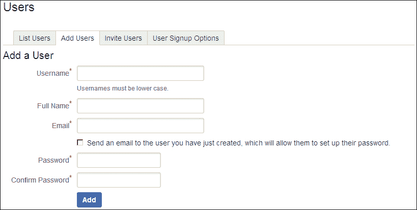

在填写表单时，有几件事情需要记住：

+   用户名必须为小写并且在 Confluence 中唯一。如果您的公司有用户名策略，最好在 Confluence 中也使用此策略。如果没有用户名策略，我喜欢使用`firstname.lastname`作为标准，例如`arthur.dent`或`ford.prefect`。

+   你可以选择通过选中相应的复选框向刚创建的用户发送电子邮件。在这种情况下，密码字段将被忽略，因为用户将收到一个设置自己密码的链接。如果选择不发送电子邮件，则需要填写密码字段。这样的电子邮件看起来像下图所示：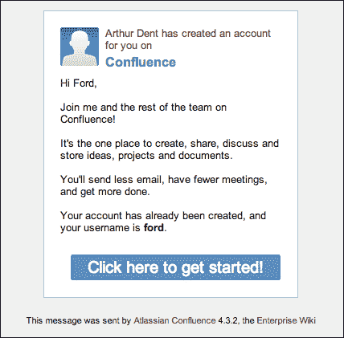

+   创建用户后，Confluence 将重定向到用户详细信息屏幕，您可以在那里更改一些用户详细信息。稍后将进一步讨论此内容。

同样的方式，您可以添加更多用户。

## 开放注册

如果您的 Confluence 是公共安装或在本地网络上运行，则可以进行开放注册。开放注册允许所有用户注册自己到 Confluence，如下截图所示：

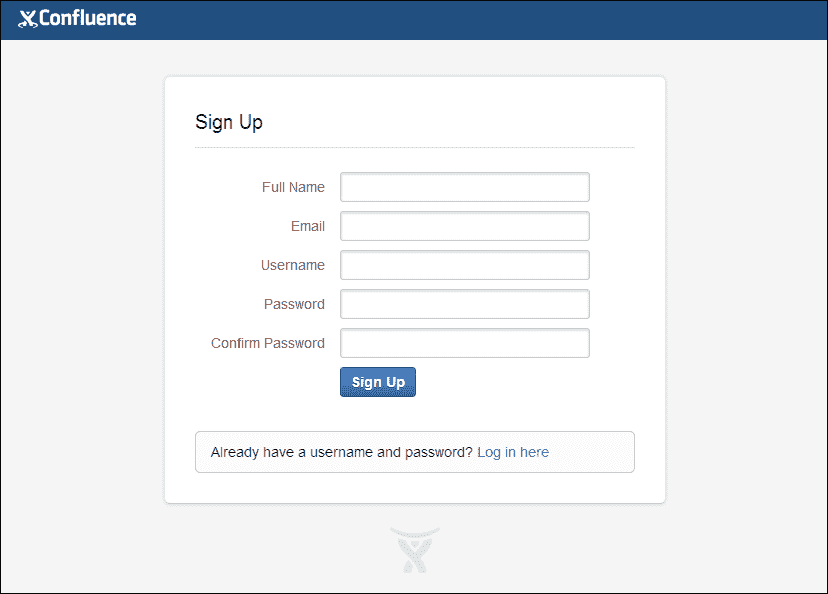

您的用户可以输入他们自己的姓名、电子邮件地址、用户名和密码，但请注意，当允许用户自行注册时，他们可以选择自己的用户名，这可能不符合您公司的政策。

用户直接添加到 Confluence-users 组，并将获得与该组相关的权限。

## 邀请用户

而不是手动添加所有用户，还可以向他们发送注册 URL。此选项在公共和私有 Confluence 安装中都可用。当用户在浏览器中访问 URL 时，将显示 Confluence 注册屏幕。

您可以通过以下步骤从管理控制台发送邀请：

1.  浏览到管理控制台（**管理** | **Confluence 管理员**）。

1.  在左侧菜单中选择**用户**。

1.  单击**邀请用户**选项卡。将显示以下屏幕：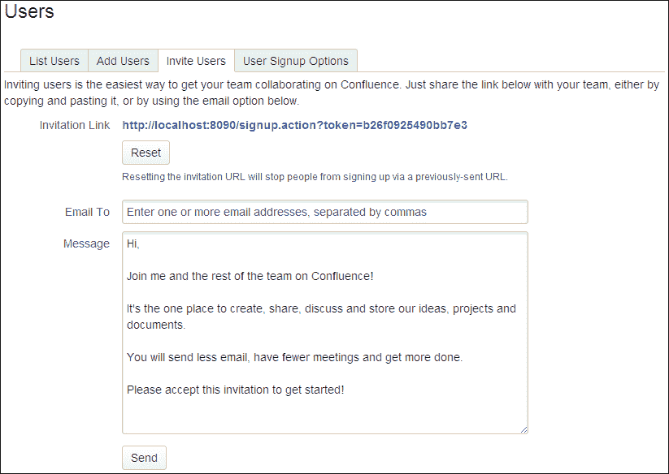

添加要邀请的用户的电子邮件地址，并根据需要包含一条他们可以阅读的自定义消息。他们将收到一封带有消息和邀请 URL 的电子邮件。

邀请 URL 包含安全令牌作为参数。有了这个令牌，您的用户将能够自行注册，如果您的 Confluence 实例被设置为私密访问。安全令牌可以在**邀请用户**页面重置；重置将使所有先前发送的邀请失效，并且将变为过时。

# 管理群组

组是用户的集合。一个组可以用来有效地管理大量用户。管理员可以在 Confluence 中创建组并将用户添加到这些组中。然后，权限会分配给组而不是单个用户，从而实现更容易的管理。

Confluence 中已经有两个默认的组，这些是特殊的组：

+   **confluence-administrators**：这个组代表“超级用户”。该组的成员可以访问管理控制台并执行站点范围的管理操作，如安装插件或更改站点的安全性。

+   **confluence-users**：这是所有新用户的默认组。此组中的用户被允许登录 Confluence，并计入您的许可证用户限制。

### 提示

**Confluence 管理员权限与 confluence-administrators 组无关**

尽管名称上看起来它们是相关的，但实际上并非如此。授予用户或组 Confluence 管理员权限与将用户添加到 confluence-administrators 组中并不相同。Confluence 管理员权限仅赋予用户部分管理员功能的访问权限，而不是完全的访问权限。

您可以在第六章的*全局权限*部分中找到有关管理员角色差异的更多信息，*保护您的内容*。

## 创建组

要向 Confluence 添加一个组，请执行以下步骤：

1.  浏览到管理控制台（**管理** | **Confluence 管理**）。

1.  在左侧菜单中选择**组**。

1.  在已有组表格下方选择**添加组**。

1.  输入新组名称。

1.  点击**保存**按钮。

为了为您公司未来的 Confluence 安装做好准备，最好在开始创建组之前考虑一个命名约定。对我有效的命名约定是 `<product>-<space>-<role>`。例如，所有参与 `MyExample` 项目的 Confluence 空间管理员会在 `confluence-myexample-administrators` 组中，而所有用户则在 `confluence-myexample-users` 组中。

## 添加用户到组中

要将用户分配到组中，从而确定他们的权限，您必须是 Confluence 管理员。有两种方式可以编辑 Confluence 中的组成员身份，具体如下：

+   从用户详情屏幕

+   从组管理屏幕

### 从用户详情屏幕编辑组成员身份

编辑特定用户组成员身份的一种方法是通过用户详情屏幕。此方法仅允许您一次更新一个用户。

要编辑用户的组成员身份，您必须进入该用户的用户详情屏幕。我们将在下一节深入了解如何查找用户，现在我们使用管理控制台。

1.  浏览到管理控制台（**管理** | **Confluence 管理**）。

1.  在左侧菜单中选择**用户**。

1.  选择**显示所有用户**以查看 Confluence 中所有用户的概览。

1.  点击你想编辑的用户名链接。

1.  选择用户详细信息下方的**编辑组**链接，接下来将显示以下界面：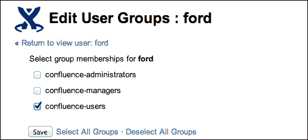

1.  勾选你想要将用户添加到的组前面的框，或者取消勾选任何组的框以将用户从该组中移除。

1.  点击**保存**按钮提交更改。

### 通过组管理界面编辑组成员

如果你想同时将多个用户添加到同一组，可以使用组管理界面，这允许你这么做。

1.  浏览到管理控制台（**管理** | **Confluence 管理**）。

1.  在左侧菜单中选择**组**。

1.  选择你想要添加用户的组。

1.  **组成员**界面会出现，显示所有该组的成员。点击**添加成员**链接。

1.  在**添加成员**文本框中，输入你想要添加到该组的人的用户名。你也可以通过点击框旁边的搜索图标来搜索用户，如下图所示：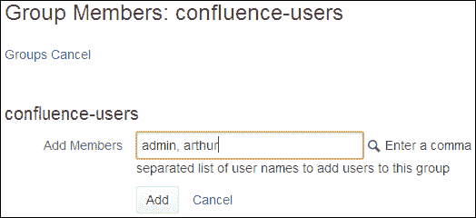

1.  当你添加完所有想要加入该组的用户后，点击**添加**按钮保存更改。

你可以在**组成员**界面中删除组中的用户。通过点击该用户所在行的图标，将移除该用户的成员资格。

# 管理用户

现在我们可以将用户和组添加到 Confluence，并管理组成员资格。有时我们需要查找用户、更改其详细信息，或发送新密码。

## 搜索用户

当我们想要将用户添加到某些组、空间，或进行任何与权限相关的操作时，我们可以选择搜索用户。每当你能在 Confluence 中搜索用户时，都会显示放大镜图标。点击该图标后，会弹出一个新窗口，给我们以下两种搜索用户的选项：

+   简单搜索

+   成员搜索

### 注意

请注意，搜索不区分大小写；无论输入大写还是小写文本，结果没有区别。支持通配符，但无需使用，搜索会返回相同的结果。

### 使用简单用户搜索

使用简单用户搜索：

1.  在**用户搜索**界面中选择**用户**标签，如下图所示。

1.  在搜索框中输入有关用户的信息。你可以使用用户的用户名、全名或电子邮件地址的任何部分。

1.  点击**搜索**。

    Confluence 会返回匹配的用户列表。你可以勾选用户名前面的框，选择你要找的用户。

    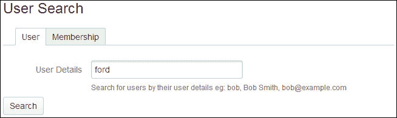

### 使用成员搜索

还可以使用成员搜索来查找属于某个特定组的用户。

1.  在**用户搜索**页面上选择**成员身份**标签。

1.  在搜索框中输入整个或部分的组名。

1.  单击**搜索**。

Confluence 会返回与您的搜索匹配的组的成员列表。在以下示例中，我搜索了“confluence”。结果显示了所有属于**confluence-administrators**组的用户和所有属于**confluence-users**组的用户：

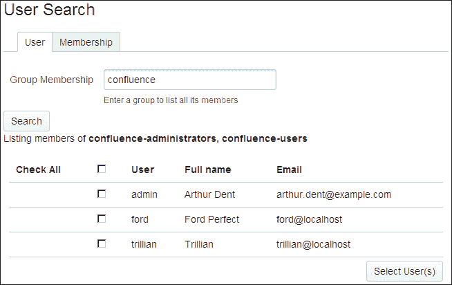

## 编辑用户详情

要更改用户的详情，您需要 Confluence 管理员权限。用户详情包括用户的姓名、密码、电子邮件地址、组成员身份以及访问 Confluence 的权限。用户可以更改自己的详情，但不能更改他们的组成员身份。

更新用户的详情可以通过显示的用户详情页面完成，接下来的截图将展示该页面。有两种方法可以导航到此页面。

+   第一个方法是通过管理控制台，使用以下步骤：

    1.  浏览到管理控制台（**管理** | **Confluence 管理**）。

    1.  在左侧菜单中选择**用户**。

    1.  搜索用户，或使用**显示所有用户**链接。

    1.  单击您要编辑的用户的链接。

+   第二种方法是通过用户个人资料，使用以下步骤：

    1.  如果您不在管理控制台中，您可以通过用户的个人资料快速进入用户详情页面。

    1.  单击 Confluence 中用户的全名以进入该用户的个人资料页面。全名可以在 Confluence 的任何页面上找到，如以下截图所示：

    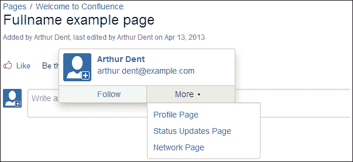

+   单击左侧的**管理员用户**链接。

    现在您应该能够看到用户详情页面，并且可以看到允许您编辑详情的链接。

    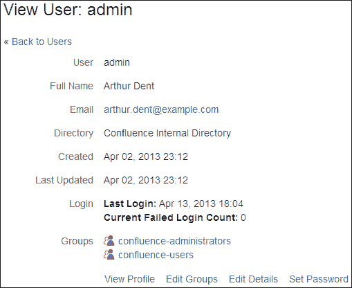

以下是关于用户详情页面上不同链接的解释。请注意，并非所有可用选项都会在之前的截图中显示。

| 链接 | 描述 |
| --- | --- |
| **查看个人资料** | 查看用户的个人资料。 |
| **编辑组** | 将用户添加到组或从组中移除用户。 |
| **编辑详情** | 更改用户的姓名、电子邮件地址、联系方式和部门信息等详情。 |
| **设置密码** | 更改用户的密码。 |
| **移除** | 从 Confluence 中移除该用户，只有在用户没有在站点上添加或编辑任何内容时才可以执行此操作。 |
| **禁用** | 禁用该用户对 Confluence 的访问。可以在用户已在站点上添加或更改任何内容时使用此选项。禁用用户还将从您的许可证计数中删除该用户。 |

### 注意

在 Confluence 中，当前不支持通过界面更改用户名，只有通过数据库才能完成更改。如果您需要更改用户名，请阅读[`confluence.atlassian.com/x/nXUC`](https://confluence.atlassian.com/x/nXUC)以获取更多信息。

## 重置密码

在某些时候，用户可能会丢失密码，并向您发送电子邮件询问是否可以重置密码。幸运的是，Confluence 在其登录屏幕上有一个**忘记密码？**链接，用户可以自己使用：

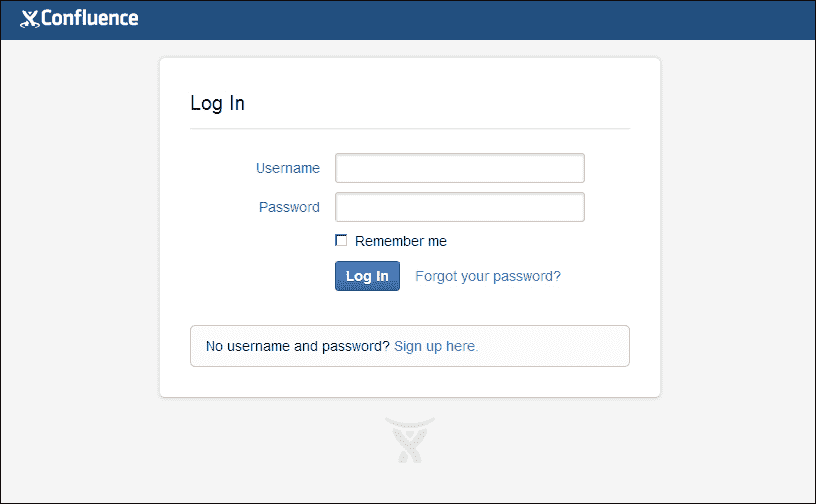

**忘记密码？**链接允许用户请求重置密码。用户需要填写其用户名，并将收到一封包含重置链接的电子邮件。除非点击链接并保存新密码，否则用户的密码不会被更改。

如果您没有设置电子邮件服务器或未配置外部用户目录，则此选项不可用。如果使用外部用户目录，您将需要将用户重定向到该系统的密码恢复选项。

如果您尚未设置电子邮件服务器，您将需要通过用户详细信息屏幕上的**设置密码**选项手动重置密码，如前所述。此密码重置必须由管理员执行。

# 公共注册

可以为您的 Confluence 站点启用公共注册。这样，用户就可以添加自己的用户名并立即登录站点。

如果您希望将站点限制为特定用户，您可能需要限制电子邮件域名或完全禁用公共注册。

启用或禁用公共注册：

1.  浏览到管理控制台（**管理** | **Confluence 管理**）。

1.  在左侧菜单中选择**用户**。

1.  选择**用户注册选项**选项卡。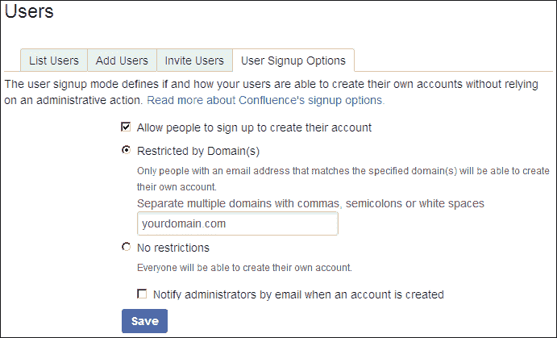

上面的截图向我们展示了几个选项。

我们可以通过一个复选框启用或禁用公共注册。启用公共注册还使我们能够将用户的电子邮件地址限制为一个或多个域名。

### 注意

您需要在配置域名限制注册之前设置电子邮件服务器。Confluence 将向注册的人员发送一封电子邮件，要求他们点击链接验证其电子邮件地址。

一个非常有用的功能是，当帐户创建时，通过电子邮件通知管理员。通过这种方式，您仍然可以检测是否有不应该注册的人，或者为需要额外权限的用户授予权限。

# 外部用户目录

到目前为止，我们已经了解了如何将用户添加到我们的 Confluence 安装中。这非常有用，但如果您的公司有自己的 LDAP 服务器或已经使用了其他 Atlassian 产品，如 JIRA 或 Crowd，怎么办？

在 Confluence 中，我们可以配置一个或多个外部用户目录。**用户目录**是一个存储有关用户和组的信息的地方，包括一些其他的用户信息。这些信息可以是个人的全名、电子邮件地址或部门。当配置了外部用户目录时，Confluence 也会使用该目录来验证用户身份。

Confluence 支持以下外部目录：

+   Microsoft Active Directory

+   各种 LDAP 目录服务器，包括 OpenLDAP、Apache Directory Server 和 Novell eDirectory

+   Atlassian Crowd

+   Atlassian JIRA

你可以根据需要添加多个外部目录。请注意，你可以更改目录的顺序，从而决定哪个目录会优先进行搜索。

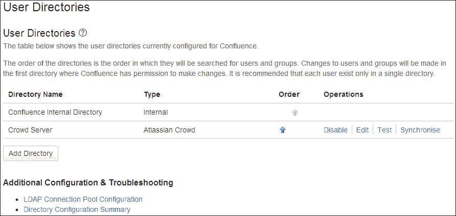

## 目录顺序的影响

当你配置了多个目录时，目录的顺序非常重要，并且会影响 Confluence 中的多个方面。

+   **登录**：在用户认证过程中，目录顺序非常重要，特别是当用户存在于多个目录中时。登录时，应用程序将按指定顺序搜索目录，并将使用*用户首次出现时的密码*进行验证。

+   **权限**：与登录机制相同，Confluence 将只在用户名出现的第一个目录中查找组成员资格，这取决于目录顺序。

    例如：

    +   你有两个目录：员工目录和客户目录

    +   员工目录在目录顺序中排在第一位

    +   用户名 `arthur.dent` 在两个目录中都存在

    +   用户 `arthur.dent` 是员工目录中的 G1 组成员，并且是客户目录中的 G2 组成员

    +   基于目录顺序，用户 `arthur.dent` 仅基于 G1 组拥有权限，而不是 G2 组

+   **更新用户和组**：如果通过 Confluence 的管理界面更新用户或组，更新将仅在 Confluence 具有写权限的第一个目录中进行。

    例如：

    +   你有两个用户目录：一个读/写的 LDAP 目录和内部目录

    +   LDAP 目录是第一个目录

    +   用户名 `arthur.dent` 在两个目录中都存在

    +   你通过 Confluence 管理控制台更新了用户 `arthur.dent` 的电子邮件地址

    +   电子邮件地址将只在 LDAP 目录中更新，而不会在内部目录中更新

## 使用外部目录时的限制

使用外部目录时，你需要注意几个限制。

### 内建用户管理

你需要注意的第一个限制取决于外部目录的读/写配置。如果 Confluence 无法写入你的外部目录，或者你不希望它写入，你必须禁用内建的用户管理。

要禁用在 Confluence 中对用户和组的管理：

1.  转到管理控制台（**管理** | **Confluence 管理**）。

1.  在左侧菜单中选择**安全配置**。

1.  单击**编辑**。

1.  勾选**外部用户管理**复选框。

1.  单击**保存**。

如果禁用了内置用户管理，用户将无法：

+   注册

+   重置他们的密码

+   更新他们的个人资料

此外，管理员将无法：

+   添加新用户和组

+   从 Confluence 将用户分配到组

所有这些功能现在都委托给外部用户管理的管理，并且必须在那里执行。

### 编辑目录

无法编辑、禁用或删除您的用户所属的目录。这是为了防止管理员通过更改目录配置而锁定自己无法登录或删除其管理权限。

在某些情况下，重新排序目录将更改您当前正在使用的目录，如果您的用户存在于两个目录中。此行为可用于更改现有目录。

### 注意

建议在内部目录中保留管理员帐户（无法删除），并使用该内部用户对其他外部目录的设置进行更改。

## 连接到 LDAP 目录

如果您的用户和组存储在公司目录中，则连接到 LDAP 目录服务器非常有用。在配置 Confluence 中的 LDAP 目录时，您可以选择只读、只读并带有本地组或读/写。在最后一种情况下，您在 Confluence 中对用户和组所做的任何更改都将反映在 LDAP 目录中。

### 连接到 LDAP

要将 Confluence 连接到 LDAP 目录，请执行以下步骤：

1.  转到管理控制台（**管理** | **Confluence 管理**）。

1.  在左侧菜单中选择**用户目录**。

1.  单击**添加目录**。选择其中一种类型，然后单击**下一步**：

    +   **Microsoft Active Directory**：此选项提供了一种快速添加 AD 目录的方式，因为它是其中一个流行的选择。

    +   **LDAP**：您将能够在下一个屏幕上选择更具体的 LDAP 目录类型。

1.  根据以下表中描述的必需设置输入值。

1.  保存目录设置。

### 服务器设置

下面是设置外部用户目录所需的不同设置：

| 设置 | 描述 |
| --- | --- |
| **名称** | 输入一个描述性名称，将帮助您识别 LDAP 服务器。例如，`MyCompany 员工目录`或`MyCompany 客户目录`。 |
| **目录类型** | 选择要连接的 LDAP 服务器类型。您在此处选择的值将确定屏幕上许多选项的默认值。 |
| **主机名** | 您的目录服务器的主机名。 |
| **端口** | 您的目录服务器监听的端口。例如，**389**（默认 LDAP 端口），**10398** 或 **636**（LDAP over SSL）。 |
| **使用 SSL** | 如果与 LDAP 服务器的连接是 SSL 连接，请选中此复选框。 |

| **用户名** | 应用程序连接到目录服务器时使用的用户的区别名称。例如：

+   `cn=administrator,cn=users,dc=ad,dc=mycompany,dc=com`

+   `cn=user,dc=domain,dc=name`

+   `user@domain.name`

|

| **密码** | 指定用户的密码。 |
| --- | --- |

### LDAP 架构设置

| 设置 | 描述 |
| --- | --- |

| **基础 DN** | 运行对目录服务器查询时使用的根**区别名称**（**DN**）。例如：

+   `o=myCompany,c=com`

+   `cn=users,dc=ad,dc=myCompany,dc=com`

|

| **附加用户 DN** | 在搜索和加载用户时，除基础 DN 外还使用此值。如果未提供值，则搜索将从基础 DN 开始：

+   `ou=Users`

|

| **附加组 DN** | 在搜索和加载组时，除基础 DN 外还使用此值。 |
| --- | --- |

### LDAP 权限

| 设置 | 描述 |
| --- | --- |
| **只读** | 从您的 LDAP 服务器检索用户、组和成员，并且不能在 Confluence 中修改。 |
| **只读，带本地组** | 从您的 LDAP 服务器检索用户、组和成员，并且不能在 Confluence 中修改。但是，可以将 LDAP 中的用户添加到 Confluence 内部目录中维护的组中。 |
| **读/写** | 在 Confluence 中修改用户、组和成员将直接应用于您的 LDAP 服务器。您配置的 LDAP 用户需要在 LDAP 服务器上具有修改权限。 |
| **默认组成员资格** | 只有在选择**只读，带本地组**权限时才会显示此字段。如果想要自动将用户添加到一个或多个组中，请在此处输入这些名称。用户首次登录时，将检查并相应添加他们的组成员资格。在后续登录中，将不会自动添加成员资格，允许从默认组中删除用户。 |

### 注意

**只读，带本地组**选项在许多情况下是最佳配置，具有极大的功能。用户和组仍可在公司的集中用户管理系统中管理。但是作为管理员，您仍然可以选择创建新组并更改这些组的成员资格，从而在 Confluence 中获得所需的控制而不会混淆您的 LDAP 服务器。lines

### 高级设置

| 设置 | 描述 |
| --- | --- |
| **启用嵌套组** | 某些目录服务允许您将一个组定义为另一个组的成员，称为**嵌套组**。如果您使用组来管理权限，请选中此框以启用嵌套组的使用。 |
| **使用分页结果** | 在查询大型用户目录时非常有用，此选项会将结果分页返回，而不是一次性返回所有结果。 |
| **跟随引用** | 选择是否允许目录服务器将请求重定向到其他服务器。通常需要为配置不正确 DNS 的 Active Directory 服务器使用，以防止出现 `javax.naming.PartialResultException: Unprocessed Continuation Reference(s)` 错误。 |
| **简单 DN 匹配** | 如果你的目录服务器始终返回一致的 DN 字符串表示，可以启用简单 DN 匹配。使用简单 DN 匹配将显著提高性能，因此建议在可能的情况下启用。 |

| **启用增量同步** | 启用增量同步时，仅查询自上次同步以来的更改。请注意，当使用此选项时，配置的用户帐户必须具有对以下内容的读取权限：

+   所有需要同步的用户和组的 `uSNChanged` 属性

+   活跃目录已删除对象容器中的对象和属性

如果这些条件不满足，可能会导致 LDAP 中的更改无法正确同步到 Confluence。 |

| **同步间隔（分钟）** | 指定目录更新之间的间隔时间（分钟）。默认值为 60 分钟。 |
| --- | --- |
| **读取超时（秒）** | 这是等待接收响应的时间。如果在指定时间内没有响应，则停止读取尝试。值为 0 表示没有限制。默认值为 120 秒。 |
| **搜索超时（秒）** | 这是等待搜索操作响应的时间。值为 0 表示没有限制。默认值为 60 秒。 |
| **连接超时（秒）** | 这是在打开新服务器连接或从连接池获取连接时的等待时间。值为 0 表示无限期等待池中连接的可用，或者在创建新连接时等待默认的 TCP 超时生效。 |

### 用户架构设置

| 设置 | 描述 |
| --- | --- |

| **用户对象类** | 这是用于 LDAP 用户对象的类名。例如：

+   `inetorgperson`

+   `user`

|

| **用户对象过滤器** | 搜索用户对象时使用的过滤器。例如：

+   `(objectclass=inetorgperson)`

+   `(&(objectCategory=Person)(sAMAccountName=*))`

|

| **用户名属性** | 加载用户名时使用的属性字段。例如：

+   `cn`

+   `sAMAccountName`

|

| **用户名 RDN 属性** | 加载用户名时使用的**相对可分辨名称**（**RDN**）。RDN 是 DN 中不与目录树结构相关的部分。例如：

+   `cn`

|

| **用户名字属性** | 加载用户名字时使用的属性字段。例如：

+   `givenName`

|

| **用户姓氏属性** | 在加载用户姓氏时使用的属性字段。例如：

+   `sn`

|

| **用户显示名称属性** | 在加载用户全名时使用的属性字段。例如：

+   `displayName`

|

| **用户电子邮件属性** | 在加载用户电子邮件地址时使用的属性字段。例如：

+   `mail`

|

| **用户密码属性** | 在加载用户密码时使用的属性字段。例如：

+   `userPassword`

|

| **用户密码加密** | 选择用于目录中密码的加密算法。例如：

+   SHA

+   MD5

+   PLAINTEXT

|

### 群组模式设置

| 设置 | 描述 |
| --- | --- |

| **群组对象类** | 这是用于 LDAP 群组对象的类名。例如：

+   `groupOfUniqueNames`

+   `group`

|

| **群组对象过滤器** | 搜索群组对象时使用的过滤器。例如：

+   `(objectclass=groupOfUniqueNames)`

+   `(objectCategory=group)`

|

| **群组名称属性** | 在加载群组名称时使用的属性字段。例如：

+   `cn`

|

| **群组描述属性** | 在加载群组描述时使用的属性字段。例如：

+   `description`

|

### 成员模式设置

| 设置 | 描述 |
| --- | --- |

| **群组成员属性** | 在加载群组成员时使用的属性字段。例如：

+   `uniqueMember`

+   `member`

|

| **用户成员属性** | 在加载用户的群组成员关系时使用的属性字段。例如：

+   `memberOf`

|

| **使用用户成员属性** | 如果你的 LDAP 服务器支持用户的群组成员属性，勾选此复选框。如果勾选了此复选框，Confluence 将在检索用户所属的群组列表时使用用户的群组成员属性。这将提高检索效率。如果未勾选此复选框，Confluence 将使用群组中的成员属性进行搜索。请注意，如果使用嵌套群组，则此选项将被忽略，Confluence 将使用群组中的成员属性。 |
| --- | --- |

## 连接到 Crowd 目录

Atlassian Crowd 是一个应用程序安全框架，可以处理 Web 应用程序的身份验证和授权，不仅限于 Confluence 或 JIRA。通过 Crowd，可以将多个用户目录集成到一个目录中，并添加对单点登录（SSO）和集中式身份管理的支持。

Crowd 是一个非常有用的选项，如果你有多个基于 Web 的应用程序和多个用户目录需要配置，特别是当你希望将单点登录（SSO）添加到这些应用程序时。

### 连接到 Crowd

使用以下步骤连接到 Crowd：

1.  前往你的 Crowd 管理控制台并定义 Confluence 作为一个应用程序。有关此步骤的更多信息，可以查看[`confluence.atlassian.com/x/rQcD`](https://confluence.atlassian.com/x/rQcD)。

1.  浏览到管理控制台（**管理** | **Confluence 管理**）。

1.  选择左侧菜单中的 **用户目录**。

1.  点击 **添加目录** 并选择 **Atlassian Crowd** 选项。

1.  输入设置的值（在下表中解释）。

1.  保存目录设置。

### 服务器设置

| 设置 | 描述 |
| --- | --- |

| **名称** | 您的 Crowd 服务器的描述性名称。例如：

+   `Crowd 服务器`

+   `MyCompany Crowd`

|

| **服务器 URL** | 您的 Crowd 控制台服务器的 web 地址。例如：

+   `http://www.mycompany.com:8095/crowd`

+   `https://crowd.mycompany.com/`

|

| **应用名称** | 用于将 Confluence 与 Crowd 进行身份验证的名称。这是您在为 Confluence 配置 Crowd 时创建的应用名称。 |
| --- | --- |
| **应用密码** | 配置应用名称的密码。此密码必须与您在 Crowd 中为 Confluence 注册的密码相同。 |

### Crowd 权限

| 设置 | 描述 |
| --- | --- |
| **只读** | 此目录中的用户、组和成员信息只能通过 Crowd 进行修改。无法通过 Confluence 管理控制台更改任何信息。 |
| **读/写** | 如果通过 Confluence 管理界面修改用户、组或成员关系，这些更改将直接应用到 Crowd。请注意，Confluence 需要在 Crowd 中具有修改权限。 |

### 高级设置

| 设置 | 描述 |
| --- | --- |
| **启用嵌套组** | 在启用嵌套组之前，请确保 Crowd 中的目录支持此功能。启用嵌套组后，您可以将一个组定义为另一个组的成员，从而继承父组的权限。 |
| **启用增量同步** | 如果选中此项，在同步目录时只会检索自上次同步以来的更改。 |
| **同步间隔（分钟）** | 指定目录更新之间的时间间隔（分钟）。默认值为 60 分钟。 |

## 连接 JIRA 进行用户管理

如果您也在组织内部运行 JIRA，可以使用 JIRA 作为 Confluence 的用户管理系统。这种方法的优势在于，您的用户管理系统只在 JIRA 中，而不分散在多个位置。

### 注意

请注意，如果您的用户超过 500 个，或者连接到 JIRA 的应用超过五个，则不推荐使用此集成。在这种情况下，LDAP 或 Crowd 会是一个更好的、更稳定的选择。

### 连接到 JIRA

连接 Confluence 到 JIRA 的方法在 JIRA 4.3 及更高版本中发生了变化。我将假设您将使用 JIRA 4.3 或更高版本进行此练习；如果您使用的是旧版本的 JIRA，可以在线找到更多信息，网址：[`confluence.atlassian.com/x/hg6zDQ`](https://confluence.atlassian.com/x/hg6zDQ)。

要将 Confluence 连接到 JIRA 4.3 或更高版本，请执行以下步骤：

1.  转到你的 JIRA 管理界面，并使用以下步骤定义 Confluence 应用程序到 JIRA：

    1.  对于 JIRA 4.3.x，选择 **其他应用程序** 来自 **用户、组与角色** 部分的 **管理** 菜单。

    1.  对于 JIRA 4.4 或更高版本，在管理模式下选择 **用户** | **JIRA 用户服务器**。

    1.  点击 **添加应用程序**。

    1.  输入 Confluence 在访问 JIRA 时使用的应用程序名称和密码。

    1.  输入你的 Confluence 服务器的 IP 地址，例如 `192.168.10.42`。

    1.  保存新应用程序。

1.  使用以下步骤设置 Confluence 以使用 JIRA 用户目录：

    1.  浏览到管理控制台（**管理** | **Confluence 管理**）。

    1.  在左侧菜单中选择 **用户目录**。

    1.  点击 **添加目录** 并选择 **Atlassian JIRA** 选项。

    1.  输入设置的值（在下表中解释）。

    1.  保存目录设置。

1.  通过以下步骤确保 Confluence 组在 JIRA 中可用：

    1.  在 JIRA 中添加 **confluence-users** 和 **confluence-administrators** 组。

    1.  将你自己的用户名添加为两个组的成员。

### 服务器设置

| 设置 | 描述 |
| --- | --- |

| **名称** | 你的 JIRA 服务器的描述性名称。例如：

+   `JIRA 服务器`

+   `MyCompany JIRA`

|

| **服务器 URL** | 你的 JIRA 服务器的网址。例如：

+   `http://www.mycompany.com:8080/crowd`

+   `https://jira.mycompany.com/`

|

| **应用程序名称** | 用于在 JIRA 中进行身份验证的 Confluence 名称。这是你在为 Confluence 设置 JIRA 时创建的应用程序名称。 |
| --- | --- |
| **应用程序密码** | 配置的应用程序名称的密码。此密码必须与您在 JIRA 中为 Confluence 注册的密码相同。 |

### JIRA 服务器权限

| 设置 | 描述 |
| --- | --- |
| **只读** | 此目录中的用户、组和成员信息只能通过 JIRA 修改，不能通过 Confluence 管理控制台更改任何信息。 |
| **读/写** | 如果你通过 Confluence 管理界面修改用户、组或成员信息，这些更改将直接应用到 JIRA。 |

### 高级设置

| 设置 | 描述 |
| --- | --- |
| **启用嵌套组** | 在启用嵌套组之前，确保 JIRA 服务器已启用嵌套组。当嵌套组被启用时，你可以将一个组定义为另一个组的成员，从而允许从其父组继承权限。 |
| **启用增量同步** | 如果选中此项，则在同步目录时仅会检索自上次同步以来的更改。 |
| **同步间隔（分钟）** | 指定目录更新之间的分钟间隔。默认值为 60 分钟。 |

# 概要

在本章中，我们学习了如何将用户添加到我们的 Confluence 安装中。有许多可用的选项，例如手动添加用户、邀请用户自助注册，或者为用户提供开放注册。

我们已经看到，如果你的公司已经有了用户管理系统，Confluence 可以轻松利用这一点，既可以完全委托认证和授权，也可以仅部分委托。

现在我们已经成功安装并运行了 Confluence，并邀请了一些用户来使用它，我们将进入 Confluence 最重要的部分之一——创建内容。在下一章中，我们将深入探讨如何使用 Confluence 编辑器创建引人入胜的内容。
