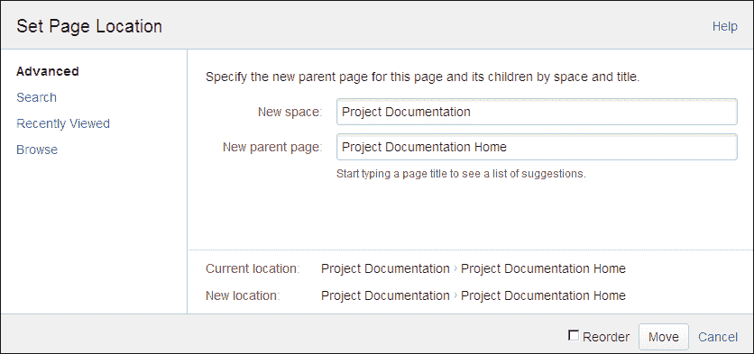
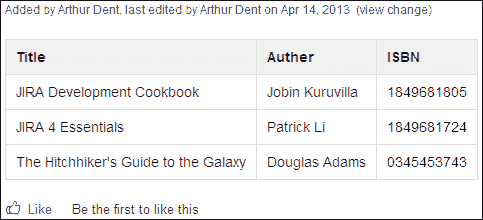

# 第三章 创建内容

在本章中，我们将深入探讨使用 Confluence 发挥最大潜力时需要学习的最重要内容之一：创建内容。我们将介绍空间、页面和博客帖子的概念，以解释如何向 Confluence 添加内容。Confluence 的富文本编辑器具有许多功能，在本章中我们将通过创建我们的第一页来掌握其中的大部分功能。

在本章中，我们将学习以下内容：

+   Confluence 基本概念

+   添加空间和页面

+   Confluence 编辑器

+   创建吸引人的内容

+   导入和导出内容

# 基本概念

在我们开始在 Confluence 中创建内容之前，需要对 Confluence 中使用的基本概念有一个基础的理解。

## 空间

在 Confluence 中组织内容，我们使用空间（spaces），它有两种类型。空间是 Confluence 内的一个区域，包含你的页面。空间可以被看作是子站点或容器，具有自己的页面结构和主页。

**全局空间**是定义 Confluence 结构的区域。例如，你可能希望根据团队、部门或主题来划分区域。

**个人空间**属于特定用户。个人空间可以设置为私密或公开，供每个用户查看和编辑。个人空间可以用来存储个人信息，如博客帖子、书签和附件。管理员可以选择完全禁用个人空间。

每个空间都有特定的内容（页面、博客帖子等）和空间特定的权限。空间内容可以单独导出。

Confluence 中的空间数量没有限制。

## 页面

页面是 Confluence 的核心，也是存储和共享信息的方式。页面始终包含在一个空间内，与空间不同的是，页面可以是嵌套的。

如果你要在 Confluence 的一个空间中组织本书的内容，你将按以下方式组织：

## 博客帖子

博客帖子是 Confluence 中一种特殊类型的页面，可以添加到每个空间，只要你有相应的权限。博客帖子通常用于公告、日志条目、报告或任何其他时间敏感的信息。博客帖子有时也被称为新闻。

Confluence 按时间顺序列出博客帖子，并允许通过浏览日历来查找博客帖子。

博客帖子与普通页面的区别如下：

+   你不能将博客帖子移动到另一个空间

+   博客帖子有一个发布日期，创建后不能更改。

+   博客帖子没有父级，因此只能根据其发布日期进行结构化。

## 评论

评论是对现有页面或博客帖子的备注、问题或其他信息，但它们不一定是页面内容的一部分。评论可以用于与其他用户就某个主题进行互动。评论可以添加到每个页面或博客帖子，只要用户有权限。

评论显示在页面底部，内容下方，并按顺序排列，最新的评论显示在最下方。评论通常以线程的形式显示，显示出响应的层级和上下文。管理员可以更改设置，选择以平铺的方式显示所有评论，去除层级和上下文。

# 添加全局空间

在我们能向 Confluence 添加任何内容之前，需要先创建一个空间。在本练习中，我们将创建两个空间，后续章节将使用这两个空间。

要设置一个新的全局空间，需要**创建空间**权限。

要添加一个新的全局空间，请执行以下步骤：

1.  转到 Confluence 仪表板，点击位于仪表板右上角的**创建空间**。将出现如下所示的**创建空间**对话框。

1.  输入以下信息以创建第一个空间：

    +   **空间名称**：该空间的名称。此名称无需唯一。使用名称**项目文档**。

    +   **空间键**：用于识别空间的键。该键只能包含字母和数字，不能包含其他字符。此键用于在空间之间链接内容、网址和报告。对于我们的**项目文档**空间，我们使用**DOC**。空间键必须唯一。

    +   **将此空间设为私密**：勾选此框将确保该空间仅对创建者可见。如果空间不是私密的，它将具有默认的空间权限。目前，我们不关心权限，将创建一个公共空间。

1.  点击**创建**。您将被转到该空间的主页。此主页会自动创建，并包含默认的空间内容。

1.  创建第一个空间后，创建第二个空间：

    +   **空间名称**为**管理**

    +   **空间键**为**MGMT**

    +   **将此空间设为私密**框未勾选

空间权限可以之后更改。有关权限的更多信息，请参阅第六章，*保护您的内容*。

# 添加页面

在 Confluence 中有多种方法可以创建页面，我将在这里进行说明。Confluence 还允许导入现有的 Word 文档，后面章节会进一步解释这一点。

## 向 Confluence 添加新页面

可以直接从顶部导航栏创建页面，而无需进入特定的空间浏览。

1.  点击顶部导航栏中的**创建**按钮。

1.  使用**选择空间**下拉列表选择您想要添加页面的空间。

1.  然后选择您想要创建的内容类型。可以根据某个模板创建页面，也可以创建一个空白页面。暂时选择**空白页面**。

1.  点击**创建**。Confluence 将以编辑模式打开该页面。

1.  给页面命名为**简介**并保存页面。

**创建内容**对话框将呈现如下截图：

### 注释

Confluence 会将页面添加到空间的根目录。如果这不是你的意图，请记得在保存之前设置位置（将在后续部分中说明）。

## 从另一个页面创建页面

另一种在 Confluence 中创建页面的方法是直接从另一个页面创建。默认情况下，这个新页面会作为当前页面的子页面添加。

1.  前往我们刚刚创建的**介绍**页面。如果你没有创建它，可以前往 Confluence 中的任何其他页面。

1.  在顶部导航栏中选择**创建**，紧挨着**选择空间**下拉菜单。新页面的父页面会显示出来。

1.  为新页面命名标题并点击**保存**。

## 设置页面位置

如果你想将页面添加到与默认位置不同的位置，可以在保存页面之前设置位置。

设置新页面位置的步骤如下：

1.  在添加页面时，点击底部的**位置**。

1.  将会出现**设置页面位置**对话框，如下图所示。使用左侧的标签页搜索新页面的父页面。对话框底部的面包屑导航将显示当前位置和新位置。

1.  如果你想在子页面中定义位置，选择**重新排序**。点击**移动**时，会显示同级页面的列表。

1.  点击**移动**。

# Confluence 编辑器

Confluence 拥有一个功能强大的编辑器，允许你创建丰富且引人入胜的内容。但在开始创建内容之前，我们需要先了解一下编辑器及其选项。

我们首先从上到下浏览编辑器界面：

| 项目 | 描述 |
| --- | --- |
| Confluence 导航 | 主要的 Confluence 导航栏。 |
| 页面标题 | 页面标题；用于 URL 和其他指向该页面的链接。页面标题是必填项，并且在一个空间中应该是唯一的。 |
| 编辑器工具栏 | 格式化内容、创建表格和列表、更改对齐方式以及向页面添加其他内容的所有功能。关于编辑器工具栏的更多内容将在下节中介绍。 |
| 页面内容 | 你的内容：文字、图片和其他媒体。 |
| 限制 | 控制谁可以查看或编辑你的页面。 |
| 附件 | 查看、管理并插入页面的附件。 |
| 标签 | 通过添加标签对页面进行分类。 |
| 位置 | 更改页面的位置。 |
| 更改注释 | 描述你对页面所做的更改；仅在编辑现有页面时可用。 |
| 通知观察者 | 选择此选项以通知观察者你对页面所做的更改；如果更改仅为小幅更改，可以取消选择。此选项仅在编辑现有页面时可用。 |
| 预览 | 查看你修改的内容如何影响页面，且无需先保存。 |
| 保存 | 保存你的更改。 |
| 取消 | 停止编辑页面并重置你所做的所有更改。 |

在编辑过程中，Confluence 会自动保存页面的草稿。如果其他用户开始编辑同一页面，Confluence 会通知该用户，并尽可能地尝试合并更改。

## 工具栏

如果你习惯了在线创建内容，或者在你电脑上的办公软件中进行编辑，这个工具栏上的大多数选项应该都很熟悉。

工具栏可以从左到右用于以下功能：

+   更改段落和字符格式（如标题、粗体、斜体）

+   给文本着色，以便强调或区分不同的文本

+   创建项目符号列表、编号列表或任务列表

+   选择文本或图像的缩进和对齐方式

+   向其他页面、附件和外部网站插入链接

+   添加表格，添加、删除或合并行和列

+   向页面插入其他内容，例如图片、视频或符号

+   向页面添加布局

+   在你编辑的页面中搜索和替换内容

## 格式化和自动补全

在 Confluence 4 版本之前，有一种叫做**wiki 标记**的概念，用来格式化 Confluence 中的页面。如果你想格式化内容或添加表格，你必须熟悉 wiki 标记。而在当前的编辑器中，已经不再需要使用 wiki 标记。

当前的编辑器确实允许使用 wiki 标记进行快速编辑；wiki 标记会自动将页面转换为相关格式。借助自动补全和格式化，你可以更快地创建和编辑内容，且全部操作都可以通过键盘完成。

### 自动格式化

使用自动格式化功能，你可以直接在编辑器中输入 wiki 标记。一些常用的示例列在下面的表格中。如果你想了解更多，可以点击编辑器工具栏上的**?**，然后选择**编辑器自动格式化**选项卡。

| Wiki 标记 | 结果 |
| --- | --- |
| ***bold*** | 粗体 |
| **_italic_** | 斜体 |
| **h1\. 标题** | 标题 1 |
| **h2\. 标题** | 标题 2 |
| **- item 1****- item 2** | 项目列表 |
| **&#124; cell 1 &#124; cell 2 &#124;** | 两列表格 |

### 自动补全

在 Confluence 中进行编辑时，有一些“快捷”字符，可以让你快速在页面中添加或附加图片、文件、宏、链接或用户提及。

| 触发字符 | 操作 | 描述 |
| --- | --- | --- |
| **** | 添加链接 | 显示一个推荐的（最近使用的）页面列表供你链接 |
| **!** | 显示图片、视频、音频文件或文档 | 显示附加到页面的媒体列表，供你嵌入页面 |
| **{** | 添加宏 | 一旦开始输入宏名称，显示宏列表 |
| **@** | 通过提到某个用户来通知他们 | 显示一个用户列表；输入用户名以获得建议 |

自动补全可以通过按下键盘上的*Esc*键，或者点击编辑面板的其他地方来取消。

要自动补全一个链接，执行以下步骤：

1.  编辑页面，并点击你想要插入链接的位置。

1.  输入 `[` 和你想链接的文件的页面标题或用户名的前几个字符。

1.  从建议列表中选择相关链接。

如果你想链接的项目不在列表中，你可以：

+   选择**搜索“over”**以继续查找页面。

+   选择**插入网页链接**以使用链接浏览器插入外部页面的链接。

+   选择**插入链接以创建页面**，创建一个指向尚未创建页面的链接。当第一次点击该链接时，页面将被创建。![自动完成

### 自动转换

当你将 URL 粘贴到 Confluence 中时，编辑器会检查你粘贴的内容，并会自动将其转换为 Confluence 中可显示的内容。

Confluence 可以识别来自此处列出的服务的链接，并且每次发布新版本时，列表都会增加：

+   YouTube 和 Vimeo 视频

+   单个 JIRA 问题或完整的 JQL 查询

+   谷歌地图

+   其他 Confluence 页面和博客的 URL

## 拖放

如果你想从桌面向 Confluence 添加文件，可以通过将文件从桌面拖到浏览器中来实现。根据你使用的 Confluence 视图，结果会有所不同：

+   如果你正在查看页面，文件已被附加

+   如果你正在浏览附件，文件已被附加

+   如果你正在编辑页面，文件会在光标位置附加并嵌入。

拖放功能要求浏览器支持 HTML5 拖放功能。大多数最新的浏览器都满足此要求。较旧的浏览器版本，如 Firefox 3.5、Safari 4 和 Internet Explorer 8 和 9，仅提供有限的 HTML5 支持，不支持拖放功能。

# 添加内容

现在我们已经了解了 Confluence 编辑器，我们可以使用样式、布局、表格和宏来创建丰富且引人入胜的页面。

我们从创建一个新页面开始，称其为**Lorem Ipsum**，并使用位于[`www.lipsum.com/feed/html`](http://www.lipsum.com/feed/html)的生成器为我们生成一些文本段落。如果你有其他文档需要使用，也可以。

大部分格式化可以通过鼠标和编辑器工具栏完成，或者使用带快捷键的键盘。后者使得编辑页面变得非常简单，但需要一些适应。

## 样式

我们使用段落样式和字符格式化来突出显示内容的部分或将内容分隔为逻辑块。对于我们的**Lorem Ipsum**页面，我们将添加一些标题和引用，并强调几行内容。

+   首先，我们将在每个生成的段落上方添加一个标题：

    1.  在段落的前两个词后按**Enter**键。

    1.  选择这两个词，然后从**段落**下拉列表中选择**标题 1**。

    1.  标题可以轻松更改为不同的样式。将所有标题更改为**标题 2**，但第一个标题除外。

+   第二段实际上是某人说的引用：

    1.  选择完整的第二段。

    1.  从**样式**下拉列表中选择**引用**。

+   最后，我们想通过加粗来强调一些句子：

    1.  选择你想加粗的句子。

    1.  点击工具栏上的**B**按钮使句子加粗。或者在键盘上按*Ctrl* + *B*也可以使句子加粗。

+   保存页面。它应该像这样：

## 宏

使用 Confluence 中的宏，你可以为页面添加额外的功能或包括动态信息。例如，附件宏可以放置在页面上列出所有附件；如果你在此页面添加新的附件，附件列表将自动更新。

让我们将之前创建的面板宏添加到页面上：

1.  打开我们的**Lorem Ipsum**页面并点击**编辑**。

1.  选择第三段。

1.  点击**插入**并选择**其他宏**。

1.  Confluence 将显示宏浏览器。

1.  使用搜索框搜索**面板**，然后点击**面板**宏。

1.  在下一个屏幕中，我们可以为这个特定宏输入一些细节。保持为空并点击右下角的**插入**。

1.  保存页面。

### 宏浏览器

在上一节中，我们将一个面板宏添加到页面中，这引入了宏浏览器。宏浏览器是你在创建页面时会经常使用的一个功能，它是探索你可用的不同宏的好方法。

宏按一个或多个类别进行分组。宏浏览器的左侧面板分为不同的类别。当点击某个类别时，相关宏将在右侧面板中显示。

宏浏览器搜索将使用你的查询根据宏标题和描述进行过滤。

### 编辑宏

在将宏添加到页面后，Confluence 会在你的内容周围显示一个特殊的框。这就是宏占位符。这个占位符可以用来编辑、删除或复制/粘贴宏。

左键单击占位符一次，显示可用选项。这些选项根据宏的不同而有所不同。面板的选项如下图所示：

要编辑宏，选择**编辑**选项或双击占位符。Confluence 将显示**编辑“面板”宏**界面：

左侧的大部分区域显示了内容的预览。右侧则可以更改宏选项，如果该宏支持的话。

在**Lorem Ipsum**页面上，我们想更改面板的样式，使其看起来像上一张截图。这可以通过执行以下步骤实现：

1.  打开我们刚刚添加的面板的**编辑宏**界面。

1.  使用段落标题作为**面板标题**。

1.  将边框样式更改为**虚线**。

1.  如果你想更突出这个面板，你也可以更改颜色。颜色应以十六进制表示：

    +   边框颜色：`#FF0000`（红色）

    +   背景色：`#FFEDED`（非常浅的红色）

1.  保存面板。

Confluence 中几乎所有的宏都可以通过我们刚才使用的右键菜单和**编辑宏**对话框进行更新。

### 宏的键盘快捷键

当你更熟悉 Confluence 中的宏时，你也可以使用键盘快捷键将这些宏添加到页面中。

输入 `{` 开始自动补全宏。继续输入你要查找的宏名称，建议列表会自动更新。选择你需要的宏，它将被添加到页面中。

## 面板

我之前使用了面板宏来解释宏浏览器，但值得再次提及。面板宏是我使用最多的宏之一。面板宏非常有用，可以用来分隔内容、为页面添加一些样式，或者突出显示某个内容。

## 页面布局和节

当我们想要为页面添加结构时，最常见的方法是将信息拆分成多列。我常用的一个例子是，在 Confluence 中添加事件信息。左边我添加事件信息，右边添加 RSVP（答复）。

Confluence 提供两种方法来为页面添加结构：

+   **页面布局**，即预定义的列和节。

+   **节**和**列**宏提供了更大的灵活性，但比页面布局更难使用。你可以设置列的宽度，并根据需要在页面上添加任意数量的节和列。

### 使用页面布局

Confluence 编辑器自带一套预定义的页面布局，每种布局提供两列或更多列。某些布局还为页面提供了横向的页头和页脚。你选择的布局决定了列的位置以及这些列在页面上的相对宽度。如果使用页面布局，页面的内容将被限制在该布局的边框内，无法在其前后添加内容。

要选择页面布局，请执行以下步骤：

1.  打开一个页面并进入编辑模式。

1.  点击 **页面布局** 图标（如下截图所示）。

1.  会弹出一个下拉列表，显示可用的布局。

1.  选择一个布局。

如果页面上已经有内容，Confluence 会将现有内容放置到新布局的左上角列中。如果页面已经使用了其他布局，Confluence 会将内容放置到新布局的相应列中。

例如：你有一个三列布局，想要切换到两列布局。Confluence 会将第二列和第三列合并成一列，并将第三列的内容放到第二列的下方。

请记住，每列的宽度是页面总宽度的百分比。Confluence 会根据页面宽度自动调整列的宽度。如果某列包含较大的表格或对象，内容可能无法完全显示，你在查看页面时会看到一个水平滚动条。

### 使用节和列宏

如果预定义的布局不是你所需要的，且你希望有更多的灵活性，Confluence 也提供了使用章节和列宏的功能。章节宏定义了包含你列的区域。与页面布局不同的是，你可以有任意数量的章节，并且在每个章节中可以添加任意数量的列。

要将章节和列宏添加到页面，请执行以下步骤：

1.  打开页面的编辑模式。

1.  通过导航至**插入** | **其他宏**找到**章节**宏，并将其插入到页面中。

1.  再次进入**插入** | **其他宏**。

1.  找到**列**宏并将其插入到章节宏中。

1.  向列中添加内容。

1.  根据需要插入任意数量的章节和列。

在编辑模式下，你会看到章节和列以宏占位符的形式呈现。这使得在查看模式下更难看到页面的实际效果。

除了可以添加任意数量的章节和列外，这些宏还具有可以设置的参数。

章节宏有一个参数`Show Border`，如果设置为`true`，则会在章节和列周围显示边框。

列宏有一个参数`Column Width`。默认情况下，它为 100%，按章节中的列数进行划分。列宽可以设置为像素值或可用宽度的百分比。

## 表格

表格功能非常强大；你几乎可以在编辑器中执行任何你期望的表格操作。Confluence 中的表格可以突出显示单元格、行或列，并且在查看模式下包含排序功能。

要创建一个表格，请执行以下步骤：

1.  打开页面的编辑模式，将光标放在你希望插入表格的位置。

1.  从工具栏中选择**表格**。

1.  从出现的下拉列表中，选择你希望表格包含的行数和列数。

1.  如果你不想在表格上添加标题，在选择行和列时按住*Shift*键。

### 编辑表格

当你在编辑器中选择表格时，会出现一个额外的工具栏，显示你可以对表格执行的所有操作。我们从左到右逐一介绍这些选项。

| 在当前选中行上方插入一个空行。 |
| --- |
| 在当前选中行下方插入一个空行。 |
| 删除当前选中行。 |
| 剪切当前行并将其复制到剪贴板。 |
| 将当前行复制到剪贴板。 |
| 将剪贴板中的行粘贴到当前行。 |
| 在当前列的左侧插入一个空列。 |
| 在当前列的右侧插入一个空列。 |
| 删除当前列。 |
| 合并选中的单元格。 |
| 拆分选中的合并单元格。 |
| 将一行标记为表格标题。该行的单元格会被高亮显示为灰色，文本会以粗体显示。 |
| 将一列标记为表格头。该列中的单元格将以灰色突出显示，文本将以粗体显示。 |
| 高亮显示带有背景颜色的单元格。 |
| 移除表格。 |

### 键盘快捷键

为了加速表格操作，Confluence 提供了大多数操作的键盘快捷键。

| Windows | Mac OS X | 操作 |
| --- | --- | --- |
| *Ctrl* + *Shift* + *C* | *Cmd* + *Shift* + *C* | 复制当前表格或选定的行 |
| *Ctrl* + *Shift* + *I* | *Cmd* + *Shift* + *I* | 插入新表格 |
| *Ctrl* + *Shift* + *V* | *Cmd* + *Shift* + *V* | 将剪贴板中的行粘贴到当前行上方 |
| *Ctrl* + *Shift* + *X* | *Cmd* + *Shift* + *X* | 剪切当前表格或选定的行 |
| *Alt* + 向上箭头 | *Alt* + 向上箭头 | 在当前行上方添加一个空行 |
| *Alt* + 向下箭头 | *Alt* + 向下箭头 | 在当前行下方添加一个空行 |

### 排序表格

在页面的查看模式中，用户可以通过点击标题行中的排序图标对表格进行排序。此选项仅在查看页面时可用，且不能配置排序。表格的初始显示（排序前）与编辑模式中的顺序相同。

## 附件

附件定义为包含在页面中的任何文件。我们之前已经讨论过图片作为附件，但也有其他示例，比如截图、Word 或 PDF 文档以及视频。当你希望分享不同于纯文本格式的信息时，附件非常有用。

当你查看的页面包含附件时，页面标题下方会显示一个小的回形针图标。如果点击该回形针图标，你将进入附件视图，在那里你可以看到所有附件。

页面上的附件继承页面的权限，因此如果用户没有查看页面的权限，他或她将无法查看或下载附件。

### 将文件附加到页面

将文件附加到页面可以通过拖放方式完成，或者通过浏览文件并从计算机上传。

要使用拖放方式附加文件，请执行以下步骤：

1.  浏览到你想附加文件的页面。

1.  将一个或多个文件从你的计算机拖放到页面中。**附加文件**对话框将出现，显示文件附加到页面的上传进度。

文件也可以拖放到附件或编辑器视图中，或者拖放到**插入链接**或**插入图片**对话框中。

### 注意

拖放需要一个实现了 HTML5 拖放功能的浏览器。大多数现代浏览器都符合这一要求。

要通过“经典”上传方式附加文件，请执行以下步骤：

1.  通过进入**工具** | **附件**来浏览页面的附件视图。

1.  点击**浏览**并导航到文件。

1.  选择文件并点击**打开**。

1.  添加一个评论（可选）作为描述。

1.  如果你想一次上传更多文件，请选择**附加更多文件**。

1.  选择**附加**。

### 附件版本管理

Confluence 会追踪上传到页面的附件版本。通过上传相同文件名的附件，会添加新版本。现有文件将保留为`版本 X`，每次上传时会递增版本号。

要查看附件的所有版本，请点击附件名称旁边的箭头。

请注意以下几点：

+   你无法恢复到附件的先前版本。下载并重新上传先前版本是一种变通方法。

+   Confluence 不会追踪附件中的更改。

+   除非服务器上的磁盘空间足够，否则附件和版本的数量没有限制。

+   附件的旧版本可以被删除，只要用户具有适当的权限。

### 下载附件

用户可以下载 Confluence 中的所有附件，只要用户具有查看附加附件的页面所需的权限。

要下载单个附件，请执行以下步骤：

1.  通过点击**工具** | **附件**，进入页面的附件视图。

1.  右键点击附件名称的链接，选择**选择链接为**，或在浏览器中选择类似的选项。

1.  选择下载文件的位置。

要下载页面中的所有附件，请执行以下步骤：

1.  通过点击**工具** | **附件**，进入页面的附件视图。

1.  点击页面底部的**下载全部**按钮，下载一个包含所有附件的 ZIP 文件（如果有两个或更多文件附加，才会显示此链接）。

下载附件并不会阻止其他人上传附件的新版本。这可能会导致通过重新上传附件时，修改内容被覆盖。Confluence 有插件可以增强这种功能，例如 Arsenale 的 Lockpoint 插件。

### 嵌入附件

一旦你将文件附加到页面，就可以通过不同的方法将文件内容嵌入到 Confluence 页面中。

#### 多媒体

你可以使用多媒体宏嵌入许多多媒体文件。这允许用户直接观看或收听你的多媒体文件，而无需先下载它。在某些情况下，用户需要一个独立的插件或解码器。

支持的多媒体文件：

+   Adobe Flash（`.swf`）

+   Apple QuickTime（`.mov`）

+   Windows Media（`.wma`, `.wmv`）

+   Real Media（`.rm`, `.ram`）

+   MP3 和 MP4 文件（`.mp3`, `.mp4`）

+   MPEG 文件（`.mpeg`, `.mpg`）

+   AVI 文件（`.avi`）

要插入多媒体宏，请执行以下步骤：

1.  打开页面的编辑模式，并将光标放置在你希望插入宏的位置。

1.  选择**插入** | **其他宏**，然后搜索**多媒体**宏。

1.  填写宏参数（请参见下表）。

1.  点击**插入**。

下表列出了宏参数，并为每个参数提供了简短的描述：

| 参数 | 默认值 | 描述 |
| --- | --- | --- |
| 页面名称 | 当前页面 | 附加到您的多媒体文件的页面名称。使用自动完成查找页面。如果此字段为空，将使用当前页面。 |
| 附件 | - | 多媒体文件的文件名。 |
| 宽度 | 基于文件类型 | 显示窗口的宽度。可以以像素为单位或作为窗口宽度的百分比来指定。 |
| 高度 | 基于文件类型 | 显示窗口的高度。可以以像素为单位或作为窗口高度的百分比来指定。 |
| 自动播放 | 关闭 | 如果选中，则视频或音频文件将在页面加载后立即开始播放。如果未选中（默认设置），用户将需要按播放按钮。 |

您无法从远程服务器嵌入多媒体文件，但 Confluence 允许使用小部件连接器来实现，这作为一个宏提供。

#### Office 文件和 PDF

Confluence 可以显示附加到页面的 Office 文件。这对于没有安装 Office 套件或不想下载完整文件的用户非常有用。

支持的 Office 文件：

+   Office Word（`.doc`，`.docx`）

+   Office Excel（`.xls`，`.xlsx`）

+   Office PowerPoint（`.ppt`，`.pptx`）

+   PDF

要在 Confluence 中显示 Office 文件，请执行以下步骤：

1.  打开编辑模式下的页面，并将光标放置在要添加宏的位置。

1.  选择**插入** | **其他宏**，并搜索宏。每个 Office 文件都有一个宏——包括 Office Word 宏、Office Excel 宏、Office Powerpoint 宏和 PDF 宏。

1.  填写宏参数（请参见下表）

1.  点击**插入**。

| 宏 | 参数 | 默认值 | 描述 |
| --- | --- | --- | --- |
| 全部 | 页面名称 | 当前页面 | 包含附加文件的 Confluence 页面。如果未指定，则假定为当前页面。 |
| 文件名 | 无 | 要显示的附加文件的名称。 |
| Excel | 显示网格线？ | 是 | 选择以显示每个单元格周围的网格线。取消选择以隐藏这些网格线。 |
| 工作表名称 | 上次查看的工作表 | 要显示的工作表名称。 |
| 最后一行 | 有内容的最后一行 | 要显示的最后一行的编号，从 0 开始为第一行。 |
| 最后一列 | 有内容的最后一列 | 要显示的最后一列的编号，从 0 开始为第一列。 |
| Powerpoint | 高度 |   | 显示的高度，以像素为单位或作为窗口高度的百分比。 |
| 幻灯片编号 | 无 | 如果指定，Confluence 将显示单个幻灯片作为图像，而不是幻灯片放映。第一张幻灯片编号为 0。 |
| 宽度 |   | 显示的宽度，以像素为单位或作为窗口宽度的百分比。 |

PDF 文件中的文本在使用 PDF 宏查看时可能会模糊。这是设计使然，因为 Confluence 会将 PDF 转换为图像并减小其大小以节省带宽。这在宏浏览器中无法实现，因此我们必须使用一个技巧，涉及 Wiki 标记：

1.  在编辑模式下打开页面，并将光标放在您希望添加 PDF 文件的位置。

1.  转到 **插入** | **Wiki 标记**，并将以下行粘贴到文本编辑器中：`{viewfile:my.pdf|width=800|height=1000}`。

1.  将 `my.pdf` 替换为您的文件名称。

1.  点击 **插入**。

#### 拖放

根据您的浏览器，您还可以使用拖放将多媒体和 Office 文件嵌入到页面中。Confluence 将尝试确定正确的宏并使用它来显示您的附件：

1.  在编辑模式下，只需将文件从桌面拖放到编辑器中。

    Confluence 会将文件附加到页面，并在光标位置插入宏。

1.  如有需要，点击宏并选择 **编辑** 来更改宏属性。

## 图像

如果图像满足以下条件之一，则可以在 Confluence 页面上显示图像：

+   图像附加到当前页面

+   图像附加到同一 Confluence 安装中的另一个页面；即使在另一个空间中也可以

+   图像位于您的服务器可以连接的远程网页上

一旦图像显示在页面上，您可以：

+   更改图像的外观

+   移动图像到新位置

+   将图像用作指向另一个 Confluence 页面或 URL 的链接

### 显示附加的图像

一旦您将图像附加到页面上，有三种不同的方法可以显示该图像：

+   使用 **插入图像** 对话框：

    1.  在编辑模式下打开页面，并将光标放在您希望显示图像的位置。

    1.  从工具栏选择 **插入** | **图像**，并在对话框中选择 **附加图像** 标签。

    1.  选择所需的图像并点击 **插入**，或双击图像以选择它。

+   使用自动完成：

    1.  在编辑模式下打开页面，并将光标放在您希望添加图像的位置。

    1.  输入 `!` 以触发自动完成功能。

    1.  继续输入图像名称，并从出现的列表中选择图像。

+   使用拖放：

    此功能使用 HTML5 的拖放功能，因此仅在支持 HTML5 的浏览器中可用。根据您的浏览器，您可以通过一次操作附加并显示图像。在编辑页面时，将图像从桌面拖动并放到页面上。图像将被上传、附加，并显示在当前光标位置。

### 在另一个页面上显示附加的图像

也可以显示附加到同一 Confluence 安装中另一个页面的图像；该页面不需要在同一空间中。您只需知道图像的名称。

### 提示

从其他页面显示图片可以方便地管理您的图片。您可以将所有图片上传到一个页面，以避免重复上传。如果您希望限制对某些图片的访问，用户需要拥有该页面的查看权限，因此请勿使用此方法。

要显示附加在其他页面上的图片，请执行以下步骤：

1.  在编辑模式下打开页面，并将光标放置在您希望显示图片的位置。

1.  转到**插入** | **图片**，然后选择**搜索**标签。

1.  输入您要查找的图片名称。

1.  选择您要搜索的当前空间或**所有空间**，然后点击**搜索**。

1.  从搜索结果中选择所需的图片。

### 从远程网页显示图片

如果您知道图片的 URL，您可以在您的 Confluence 实例中从远程网页显示图片，而无需将其附加到页面上。

要从外部网页显示图片，请执行以下步骤：

1.  在编辑模式下打开页面，并将光标放置在您希望显示图片的位置。

1.  转到**插入** | **图片**，并选择**来自网络**标签。

1.  输入或粘贴图片的 URL。

1.  点击**预览**以检查是否使用了正确的 URL。

1.  点击**插入**。

### 修改图片外观

一旦将图片添加到页面中，您通常需要编辑图片。Confluence 提供了通过图片属性面板进行编辑的方法。

要更改图片的大小，请执行以下步骤：

1.  在编辑页面时，点击图片以显示图片属性面板，如前述截图所示。

1.  在面板左侧的文本框中手动调整图片大小（大小可以在 16px 到 900px 之间）。图片会按原始比例进行调整。或者，选择文本框旁边的大小预设按钮，来更改图片的大小。

图片以缩略图形式显示；在查看模式下点击图片将弹出图片的较大版本。

要为图片添加边框，请执行以下步骤：

1.  在编辑页面时，点击图片以显示属性面板。

1.  从属性面板中选择**边框**。

要使用图片效果，请执行以下步骤：

1.  在编辑页面时，点击图片以显示属性面板。

1.  从属性面板中选择**属性**。

1.  在属性对话框中选择**效果**。

1.  选择五种效果之一。

### 注意

**即时相机**效果仅适用于拉丁字符语言。这是因为使用了`手写风格`字体。

下一个截图展示了带有效果的图片示例。

为图片添加标题的唯一方法是使用前面描述的即时相机效果。标题非常有用，可以为图片添加额外的信息。执行以下步骤为图片添加标题：

1.  从图像属性面板选择**属性**，并选择**即时相机**效果。

1.  保存页面。

1.  进入**工具** | **附件**以查看页面的附件。如果你正在展示来自其他页面的图像，前往该页面的附件视图。

1.  选择位于图像旁边的**属性**。

1.  为附件添加评论。此评论将用作图像标题。

### 注意

每次上传同一图像的新版本时，你都需要重新应用评论。

若要为图像添加链接，请执行以下步骤：

1.  从图像属性面板选择**链接**。

1.  Confluence 将显示**插入链接**对话框，你可以使用它来搜索想要链接的页面。

#### 对齐图像

对齐图像的方式与对齐文本相同。选择你的图像并从编辑器工具栏的段落对齐按钮中选择。

如果你选择将图像左对齐或右对齐，文本将围绕图像换行。对于居中对齐，文本不会换行。

### 在画廊中显示图像

当你有许多图像附加到页面时，你可能希望将它们作为画廊显示。画廊将页面附件以缩略图的形式展示。当用户点击缩略图时，将显示该图像的更大版本。

若要将附加到页面的图像作为画廊显示，请按照宏部分中描述的步骤插入画廊宏。

画廊宏的功能：

+   画廊中的图像来自该页面的附件。也可以指定从不同的页面获取附件，但不能同时从多个页面获取。

+   画廊中的标题来自于图像评论。

+   默认情况下，画廊将包含页面上附加的所有图像。你可以通过宏属性根据名称或标签排除或包含图像。

+   画廊可以按名称、日期甚至大小排序。

+   画廊的宽度（列数）和标题可以通过宏属性轻松更改。

## 链接

链接比你想象的更重要。链接使你能够从 Confluence 的任何地方，或从其他网站或应用程序连接到内容。

可以链接到以下内容：

+   页面，来自 Confluence 内部或外部

+   博客文章

+   尚未存在但你希望稍后创建的页面

+   附件，如图像和文档

+   用户个人资料或个人空间

+   页面的一部分，使用锚点

### 链接到 Confluence 页面

可以使用以下方法创建指向页面的链接：

+   **自动完成**：链接到 Confluence 页面

+   **插入链接对话框**：链接到 Confluence 和网页

+   **剪切并粘贴链接到编辑器**：链接到 Confluence 和网页

#### 使用自动完成

如果你知道想要链接的页面名称，可以使用自动完成创建指向 Confluence 中任何页面的链接。

通过输入``开始您的链接，这样可以看到建议列表。继续输入页面名称以搜索您希望链接的页面。

#### 使用插入链接对话框

您可以使用“插入链接”对话框来创建指向页面的链接。执行以下步骤：

1.  打开页面并进入编辑模式，将光标放置在您希望插入链接的位置。您也可以高亮显示您希望链接的文本。

1.  在编辑器工具栏中选择**链接**，或按*Ctrl* + *K*。**插入链接**对话框将会出现。![使用插入链接对话框 1.  使用左侧的标签查找您想要链接到的页面：    +   **搜索**：使用此标签链接到 Confluence 中的页面或文件    +   **最近查看**：此标签显示您最近查看（和创建）的页面。    +   **附件**：显示此页面上的附件    +   **网页链接**：此标签用于链接到 Confluence 外部的网页    +   **高级**：此标签用于链接到锚点以及尚不存在的页面 1.  输入将在页面上显示的链接文本。如果链接文本为空，则链接将显示目标页面名称或网址。1.  点击**插入**。#### 使用复制和粘贴链接也可以通过剪切并粘贴链接到编辑器来创建。执行以下步骤：1.  在您的网页浏览器中，选择并复制 Confluence 页面标题。1.  打开页面并进入编辑模式，将标题粘贴到您想要插入链接的位置。1.  使用**编辑链接**更改链接文本（如果需要）。### 链接到网页要创建指向网页的链接，请执行以下步骤：1.  打开页面并进入编辑模式，将光标放置在您希望创建链接的位置。1.  点击工具栏中的**链接**，或按*Ctrl* + *K* 打开**插入链接**对话框。1.  从左侧标签中选择**网页链接**，然后将网页地址粘贴到**地址**文本框中。1.  输入链接文本。1.  点击**插入**。您还可以直接将链接粘贴到 Confluence 编辑器中。链接文本将是完整的 URL，之后可以通过图像属性面板进行更改。### 链接到锚点还可以通过在页面的特定位置插入锚点宏，并将链接指向该锚点来实现页面内的链接。要为页面添加锚点，请执行以下步骤：1.  打开页面并进入编辑模式，将光标放置在您希望添加锚点的位置。1.  通过以下方式查找锚点宏：    +   进入**插入** | **其他宏**，然后找到锚点宏。    +   输入`{anchor`以使用自动完成插入宏。1.  指定您的锚点名称。### 提示**选择锚点名称**锚点名称应该描述您想要链接到的部分。锚点名称可以包含空格。Confluence 在构建指向锚点的 URL 时会去掉这些空格。请记住，锚点名称是区分大小写的，在构建链接时要特别注意。要链接到锚点，请执行以下步骤：1.  打开页面并进入编辑模式，将光标放置在您希望添加链接的位置。1.  在编辑器工具栏中选择**链接**，或按*Ctrl* + *K*。1.  选择**高级**，并将锚点名称输入到链接文本框中。1.  输入将在页面上显示的链接文本。1.  点击**插入**。输入锚点名称时，请使用以下语法：| 锚点位置 | 链接语法 | 示例 || --- | --- | --- || 同一页面 | `#anchor` | `#footer``#highlighted info` || 不同页面 | `pagename#anchor` | `Overview#footer``Overview#highlighted info` || 其他空间中的页面 | `spacekey:pagename#anchor` | `DOC:Overview#footer``DOC:Overview#highlighted info` |### 注意不要将锚点链接用于目录。还有另一种宏可以为你生成目录；你可以通过宏浏览器搜索`Table of Content`来插入此宏。### 链接到标题你可以直接链接到 Confluence 中的标题，而无需使用锚点。然而，如果有人更改了标题，链接将会失效。使用锚点可以避免这种情况。要链接到标题，请执行以下步骤：1.  打开页面并进入编辑模式，将光标放置在你希望添加链接的位置。1.  在编辑器工具栏中选择**链接**，或按*Ctrl* + *K*。1.  选择**高级**，然后将标题输入到**链接**文本框中。标题区分大小写，且必须输入时不含空格。1.  输入将在页面上显示的链接文本。1.  点击**插入**。### 链接到未定义页面在某些情况下，你可能希望插入一个指向尚不存在的 Confluence 页面的链接，但你打算稍后创建该页面。我们称这种类型的链接为**未定义链接**。要添加未定义链接，请执行以下步骤：1.  打开页面并进入编辑模式，将光标放置在你希望添加链接的位置。1.  输入``以触发自动补全功能，然后输入未定义页面的名称。1.  从建议列表中选择**插入链接**来创建页面。## 草稿在你编辑页面的过程中，Confluence 会确保你的工作已保存。在规定的时间间隔内，草稿会被保存，这样在网络或服务器发生错误时，你可以恢复到最后一次保存的草稿并继续工作。草稿是在你添加或编辑页面时创建的。默认情况下，Confluence 每 30 秒保存一次草稿。Confluence 管理员可以在**常规配置**设置中更改此间隔。如果你在编辑页面时跳转到另一个站点或页面，草稿也会被创建。当你再次编辑页面时，Confluence 会显示一条消息，告知有未保存的页面版本，并询问你是否要放弃该版本或继续使用该版本。### 注意草稿仅适用于未保存的页面。如果你不小心取消了编辑会话，所有更改将丢失，因为草稿也会被删除。### 更改草稿间隔默认情况下，Confluence 会每 30 秒保存一次正在编辑页面的草稿。作为 Confluence 管理员，你可以更改此设置。1.  浏览到管理控制台（**管理** | **Confluence 管理**）。1.  在左侧菜单中选择**常规配置**。1.  编辑设置并更改**草稿保存间隔**中的值。### 恢复编辑草稿如果您想恢复编辑未保存的页面或博客文章，有两种选择：+   使用草稿视图：    1.  点击导航栏右上角的头像。    1.  从下拉菜单中选择**草稿**。    1.  您将看到 Confluence 为您保存的所有草稿。

### 查看未保存的更改

在编辑页面或博客文章时，可以在保存更改之前查看所做的更改。一旦保存了草稿，您将在右下角看到一行**草稿已自动保存于...（查看更改）**，就在**保存**按钮下方。

如果点击**查看更改**，将弹出一个对话框，显示您在此次编辑中所做的更改。

# 使用内容历史

Confluence 会跟踪页面的所有更改，每次修改页面时都会创建一个新版本。您可以查看不同版本之间的更改，也可以回滚到某个特定版本。

## 查看页面历史

可以查看页面的所有先前版本。

要查看页面的历史，请执行以下步骤：

1.  转到您想查看历史记录的页面。

1.  转到**工具** | **页面历史**。

1.  在**页面历史**屏幕中，如下图所示，点击版本号以查看该特定版本的页面。

要了解更改的内容，可以将两个版本进行对比。Confluence 会显示页面的最新版本，并突出显示所做的更改；下图展示了这一示例。

要比较版本之间的更改，请执行以下步骤：

1.  转到您想查看历史记录的页面。

1.  转到**工具** | **页面历史**。

1.  使用复选框选择最多两个不同的版本。

1.  选择**比较所选版本**以显示比较结果。

版本之间的更改将通过颜色突出显示：

+   **绿色**：内容已添加

+   **红色**：内容已删除

+   **蓝色**：格式已更改

显示页面比较视图时，所有未更改的文本部分将被隐藏并缩减为省略号，如：`...`。

也可以恢复页面的先前版本。Confluence 将使用该版本的内容来创建一个新版本。因此，如果你当前使用的是版本 10 并希望恢复版本 8，Confluence 将用版本 8 的内容创建版本 11。这样做的优点是，恢复版本不会丢失任何更改。

要恢复版本，请执行以下步骤：

1.  转到你想查看历史记录的页面。

1.  转到**工具** | **页面历史记录**。

1.  点击**恢复此版本**，旁边是你想要恢复的版本。

1.  在下一个页面，你可以根据需要更改注释。

1.  点击**确定**以恢复版本。

# 导入内容

Confluence 可以从多个不同来源导入内容，包括其他 Confluence 站点。在大多数情况下，人们是从基于文档的系统迁移到 Confluence 的，因此我们将重点介绍 Word 文档导入器。如果你对从其他来源（如其他 Wiki）导入内容感兴趣，请访问[`confluence.atlassian.com/display/DOC/Importing+Content+Into+Confluence`](https://confluence.atlassian.com/display/DOC/Importing+Content+Into+Confluence)。

## 导入 Word 文档

如果你导入一个 Office Word 文档，它将作为 Confluence 页面提供给你的用户，并且具备 Confluence 页面的所有优点。Word 文档将不再是必需的。

导入 Word 文档最简单的方法是将文档的全部内容作为单个 Confluence 页面导入。

更高级的选项允许你将内容导入到新页面中，根据标题将单个文档拆分成多个页面，并解决标题冲突。

Confluence 可以导入有效的 Microsoft Word 文档，这些文档以 97-2007（`.doc`和`.docx`）格式存储。

### 提示

在将 Word 文档导入 Confluence 之前，最好先准备好文档。确保所有标题正确，并且文档中没有 Word 艺术（Confluence 不支持此功能）。确保文档中的图片是 100%的放大比例；这样可以确保 Confluence 以完整的大小导入图片。

### 将 Word 文档作为单一页面导入

使用此方法将替换当前 Wiki 页面上的所有内容，因此请谨慎使用：

1.  创建一个新页面以导入 Word 文档，并保存该页面。

1.  转到**工具** | **导入 Word 文档**。

1.  点击**浏览**以查找你想要导入的 Word 文档。

1.  点击**下一步**以进入**导入选项**页面。

1.  指定选项并点击**导入**。

| 选项 | 描述 |
| --- | --- |
| **根页面标题** | 包含 Word 文档内容的新页面的标题。 |
| **作为当前空间的新页面导入** | 如果你希望创建一个新页面，并使用指定的标题，请选择此项。 |
| **替换<当前页面>** | 选择如果要替换当前页面；标题将被重命名为指定标题。 |
| **删除<当前页面>的现有子页面** | 当前页面的子页面将被删除。 |
| **如果页面名称已存在，重命名导入的页面** | 如果空间中已经存在同名页面，则重命名新页面。 |
| **用导入的相同标题的页面替换现有页面** | 如果导入的文档与现有页面标题相同，则会替换现有页面，页面历史将被保留。 |
| **删除与导入页面标题相同的现有页面** | 如果导入的页面与现有页面标题相同，则现有页面将被删除。 |
| **按标题拆分** | 根据标题创建新的子页面。 |

### 注意

请注意，一旦导入，页面将不再与原始 Word 文档关联，新的页面及其内容应直接在 Confluence 中更新和编辑。

### 将 Word 文档导入多个页面

也可以根据文档中的标题拆分 Word 文档；Confluence 会为这些标题创建子页面：

1.  按照上一节中描述的方法导入 Word 文档。在导入屏幕上，选择根据标题拆分文档。

1.  根据您的选择，Confluence 将向您展示导入后层级结构的预览。

1.  点击 **导入** 开始导入。

# 导出内容

您可能需要将内容导出为其他格式。例如，您可能需要将 Confluence 中编写的文档用于电子邮件或其他网站。您可以通过将部分空间、整个空间或单个页面导出为 HTML、Word 或 PDF 来做到这一点。也有插件可帮助您将内容导出为其他格式。

## 导出单个页面

您可以轻松将每个页面导出为 PDF。此选项适用于所有拥有导出页面权限的用户：

1.  转到您要导出的页面。

1.  转到 **工具** | **导出为 PDF**。

1.  浏览器将提示您下载并保存 PDF 文件。

页面上的评论不会导出到 PDF 文件中。

## 导出空间

您可以将空间的一部分或全部导出为 HTML、PDF 或 XML。对于这三种格式，导出方法几乎相同，只有选项上有一些小差异。

导出空间，请执行以下步骤：

1.  浏览到空间中的某个页面，并从左侧边栏选择 **空间工具**。

1.  选择 **内容工具**。

1.  打开 **导出** 标签。如果您有权限导出空间，此选项将可用。

1.  选择导出的类型并点击 **下一步**。可用的导出格式包括：

    +   **HTML**：这将导出空间为静态 HTML 页面。

    +   **XML**：这会创建 XML 导出，可用于备份，或将空间导入到不同的 Confluence 安装中。

    +   **PDF**：这将导出空间为 PDF 文件。

1.  选择你是否想要**普通**导出或**自定义**导出。

1.  普通导出将包含空间中的所有页面和博客文章，包括评论和附件（图片）。

1.  自定义导出将基于你接下来选择的页面和选项。

1.  如果你选择了**自定义**，请确保选择你想要导出的页面。

1.  点击**导出**。

1.  当导出过程完成后，下载导出文件并将其存储在桌面上。

# 总结

我们详细探讨了创作引人入胜内容的艺术，以及富文本编辑器。宏命令是编辑器的核心，提供了许多可以用来创建内容的功能。

我们已经看到，Confluence 中的内容不仅限于文本，我们还可以使用图片、音频和视频。你当前的文档，可以是 Word 文档的形式，可以轻松导入到 Confluence 中并在那里面提升到一个新的层次。

创建内容非常强大，但如何再次找到它呢？你如何确保你的用户和同事能够找到你的页面？这正是下一个章节的主题，*管理内容*。
