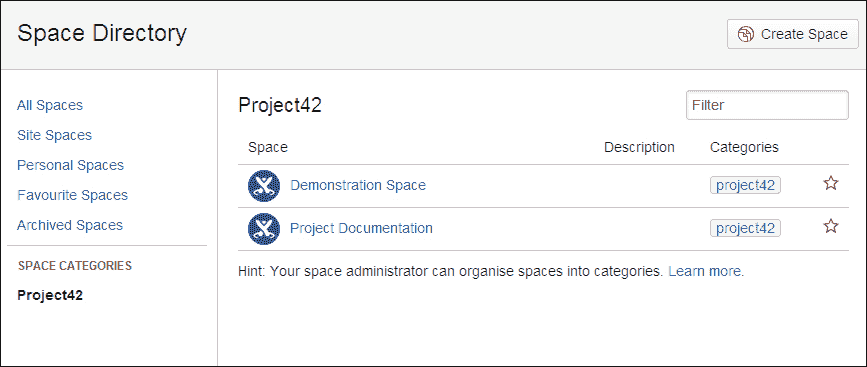

# 第四章：管理内容

查找内容和创建内容同样重要。在本章中，我们将学习如何使用标签、收藏夹来组织内容，并利用关注功能跟踪你的内容。借助快速和高级搜索功能，我们可以找到相关的内容和文档。

本章的目标是学习如何组织你的 Confluence 内容，以便你和你的用户能够轻松找到他们需要的最新信息。在本章结束时，我们将清楚地了解如何：

+   组织你的空间

+   使用标签

+   在 Confluence 中跟踪更改

+   在 Confluence 中搜索

# 组织你的空间

在第三章中，*创建内容*，我们学习了如何创建空间和页面。随着时间的推移，你的空间会不断增长，页面可能会出现不按正确顺序或位置排列的情况。用户也可能会抱怨找不到你所提到的页面。这正是你需要整理和清理空间的时刻。

## 更改页面顺序

Confluence 中的页面具有层级结构，其他页面可以被归类在父页面下。我们将这个组称为**页面家族**。页面家族中的页面默认按字母顺序排序。当你创建一个新页面时，它将按字母顺序插入到页面家族中。可以将页面移动到不同的位置，系统会自动将排序模式更改为手动模式。在手动模式下，新页面会被放置在页面家族的底部。

在空间内重新排序页面最简单的方法是使用**重新排序页面**视图，该视图位于**空间工具**中。要进入此视图：

1.  转到空间，并在左侧边栏选择**空间工具**。

1.  选择**内容工具**，然后选择**重新排序页面**，如以下截图所示：

所有页面都可以通过拖放的方式重新排序。在拖动页面时，你将看到以下其中一种情况发生：

+   在现有页面之间将出现一条细线。这表示页面的新位置；释放鼠标按钮后，页面将被放置在该位置。

+   在一个或多个现有页面上将出现一个高亮显示的部分。这表示你可以将页面拖放到页面家族中。被拖放的页面将根据排序顺序（字母顺序或手动）被加入到页面家族中。

### 将页面排序设置为字母顺序

一旦你移动了一个或多个页面，页面的排序将设置为手动模式。要将此排序恢复为字母顺序，请执行以下步骤：

1.  转到空间，并在左侧边栏选择**空间工具**。

1.  选择**内容工具**，然后选择**重新排序页面**。

1.  展开树形结构，找到你想恢复的页面家族。

1.  如果页面家族是手动排序的，父页面旁边将显示一个**A/Z**图标。

1.  点击**A/Z**图标，恢复该页面家族的字母顺序。

1.  点击图标后，撤销图标会出现，允许你恢复手动排序。此撤销图标仅在你仍处于树形视图并且没有更改其他内容时有效。

## 孤立页面

**孤立页面**是没有父页面或任何外部链接的页面。孤立页面不会出现在任何导航中，因此用户必须知道它的存在，才能搜索到它。这意味着，如果你在孤立页面上有内容，很不可能有人通过自然的导航过程找到它。孤立页面可以通过搜索找到。

孤立页面通常是在删除父页面时产生的。所有被删除的父页面的子页面将被移到空间的根目录。从那时起，子页面就成了孤立页面。

特别是在大型空间中，很难追踪孤立页面。Confluence 允许你查看空间中的所有孤立页面，以便你重新组织或删除它们。

要查看孤立页面，请执行以下步骤：

1.  进入空间，并在左侧边栏选择**空间工具**。

1.  选择**内容工具**，然后选择**孤立页面**。

在**孤立页面**界面，你可以编辑或删除该页面。如果你想移动页面并为其指定父页面，使用之前讨论的**重新排序页面**功能更为方便。另一种方法是从查看模式下选择**工具** | **移动**，此方法的优点是你能够将页面移动到其他空间。

### 提示

**孤立页面不一定是坏事**

孤立页面常用于作为附件或信息的占位符，这些信息可能在许多其他页面中使用。通过“包含”宏，这些孤立页面可以被包含在这些页面中。如果信息发生变化，你只需要更新一个页面。

## 归档空间

一些空间可能包含已经不再相关的信息。例如，当你使用 Confluence 编写用户文档并且为每个产品版本设置一个空间，或者一个项目完成后，空间不再需要时。

归档空间将使内容在 Confluence 中保持可用，但比之前更不显眼。如果一个空间被归档：

+   使用 Confluence 搜索框时，页面和其他内容不会出现在建议列表中。

+   页面和其他内容不会出现在任何搜索结果中，除非指定也包括已归档的空间。

+   该空间未列在仪表板中。

+   对空间内容的任何更新都不会出现在各种活动流中。

+   空间、页面和其他内容不会出现在 Confluence 的任何下拉菜单中。

+   已归档的空间不会出现在空间目录中的常规空间列表中。该空间会出现在“已归档空间”标签页和由空间标签确定的类别中。

在空间归档期间，以下功能将保持可用：

+   用户将照常查看内容，任何已书签的 URL 仍然有效

+   用户可以编辑内容，只要他们拥有相应的权限

+   任何订阅、关注或通知将保持激活状态

要归档空间，请执行以下步骤：

1.  进入空间并在左侧边栏选择**空间工具**。

1.  选择**概览**，以导航到空间详情页面。

1.  选择**编辑空间详细信息**。

1.  从状态下拉菜单中选择**已归档**。

1.  点击**保存**，如下面的截图所示：

如果你的 Confluence 安装是公开的，那么已归档的空间仍然会被索引，并通过像 Google 这样的搜索引擎找到。

# 使用 Confluence 标签

为了对 Confluence 中的内容进行分类、标识或书签管理，我们可以使用**标签**。标签是可以添加到页面、博客文章、附件和空间的元数据，起到关键词或标签的作用。标签是由用户定义的，因此任何能够标识内容的词都可以作为标签使用。

例如，你可以将标签“requirement”分配给所有包含项目需求的页面。然后，你可以浏览或列出在同一空间甚至整个 Confluence 中所有带有该标签的页面。也可以基于该标签搜索内容。

使用标签的优点如下：

+   标签是由用户定义的，所以你可以决定哪些信息是相关的，以及如何为其打上标签，使用你和你的用户都理解的词语

+   使用标签，你可以对页面和空间进行分组，而无需重组你的网站

+   你可以添加任意数量的标签

+   标签的添加非常简单，不会影响所分配标签的内容

Confluence 不支持多词标签。这意味着，如果要为页面添加“needs review”标签，空间名称必须使用其他字符替代，例如连字符或下划线。

## 内容标签

任何有权限编辑页面或博客文章的用户也可以管理标签。

为了添加标签，你需要执行以下步骤：

1.  转到你想要标记的页面。在页面底部内容下方，将会有一个标签列表（前提是页面已经有标签，否则会显示**无标签**）。

1.  点击列表旁边的编辑图标，或者按键盘上的*L*键。这将显示标签对话框。

1.  输入一个新标签。你在输入时，Confluence 会建议你常用的标签。

1.  点击**添加**，如下面的截图所示：

为了移除标签，你需要执行以下步骤：

1.  打开标签对话框（如前所述，添加标签的步骤）。

1.  每个标签旁边都会有一个**X**图标。

1.  点击**X**图标从页面中移除标签。

## 附件标签

附件也可以拥有标签，这使得查找或筛选它们更加方便。任何有权限编辑包含附件的页面的用户都可以添加或移除标签。

要将标签添加到附件，请执行以下步骤：

1.  转到包含附件的页面。

1.  选择**工具** | **附件**以转到附件视图。

1.  在附件视图中，您将看到一个附件列表。如果附件已经有标签，这些标签将显示在**标签**栏中。

1.  单击编辑图标以打开标签对话框。

1.  输入新标签；在输入时，会建议现有标签。

1.  单击**添加**，如下图所示：

标签的删除方式与页面相同。单击标签旁边的**X**标记即可将其从附件中移除。

## 使用空间类别

**空间类别**是 Confluence 用于在空间目录和仪表板的最近活动区域中对空间进行分组的特殊标签。假设您有一个或多个空间，其中包含有关同一项目**Project42**的信息。我们可以将所有这些空间归类为“Project42”以进行分组。

使用类别对空间进行分组将反映在空间浏览器中，您可以通过在仪表板的**空间类别**标签下选择**Project42**类别，查看这些空间的更新内容，如下图所示：

### 注意

您必须是空间管理员或 Confluence（系统）管理员，才能为空间设置空间类别。

要向空间添加类别，请执行以下步骤：

1.  转到空间并选择左侧边栏中的**空间工具**。

1.  选择**概览**以导航到空间详情页面。

1.  单击**编辑**，位于**空间类别**旁边。

1.  使用文本字段为空间添加新类别。

1.  单击**完成**。

类别的移除方式与标签相同。单击类别旁边的**X**标记即可将其移除。

### 注意

要完全删除类别或标签，只需删除它在所有使用的地方。如果标签或类别没有被使用，则无法存在。

## 查看标签

当您单击页面、博客文章或附件中的标签时，系统会将您转到标签视图。或者，如果您使用的是文档主题，可以转到空间中的任何页面，选择**浏览** | **标签**。

空间中的标签视图提供以下功能：

+   **热门标签**：使用此视图可以查看该空间中最常用的标签列表。您还可以查看全局热门标签。标签越大，越受欢迎。

+   **所有标签**：此视图将显示空间中的所有标签。单击某个标签以查看该空间中的相关内容。如果存在相关标签，也会显示。相关标签是指常常一起出现在页面上的标签。

+   **查看所有空间的内容**：在这两个视图中，您可以轻松扩展列表，查看 Confluence 站点上所有标签的内容。

## 使用标签显示内容

标签在与宏结合使用时非常强大，可以动态展示内容。Confluence 提供了以下标签宏：

+   **按标签显示内容**：此宏列出带有一个或多个特定标签的页面

+   **标签列表**：此宏列出空间中所有标签，并按字母顺序分组

+   **导航地图**：此宏创建一个与指定标签关联的页面地图

+   **热门标签**：此宏生成一个最受欢迎标签的列表或**热图**

+   **最近使用的标签**：此列表展示了在预定义的空间范围内最近使用的标签

+   **相关标签**：此宏列出在其他页面上使用的、与当前页面有共同标签的标签。

我们将讨论按标签显示内容的宏，因为它可能是此宏集合中使用最广泛的一个。

### 按标签显示内容的宏

按标签显示内容的宏将查找并展示一个列出所有带有指定标签的页面、博客文章和附件的列表。想象一下你有一个充满项目和客户信息的空间；使用此宏，你可以轻松地创建一个所有客户的概览，只要你为他们打上标签。

### 小提示

**使用标签进行评论**

我们经常使用标签来标示页面是否需要审核或是否过时。通过按标签显示内容的宏，我们创建了一个概览页面，展示这些页面。当页面被审核后，标签会被移除，因此不会显示在概览中。

要将按标签显示内容的宏添加到页面，请执行以下步骤：

1.  在编辑模式下打开页面，并将光标放置在你希望添加宏的位置。

1.  选择**插入** | **其他宏**。

1.  找到并选择按标签显示内容的宏。

1.  在屏幕右侧填写属性，标签是必填项。

1.  点击**插入**，如下图所示：

以下是按标签显示内容宏可用的属性：

| 属性 | 默认值 | 描述 |
| --- | --- | --- |
| **标签** |   | 此宏将仅显示带有指定标签的内容。你可以使用逗号分隔多个标签。如果需要排除某些标签，可以直接在标签前加上减号（`-`）。例如，指定`-lorum`时，宏只会显示*没有* `lorum` 标签的内容。 |
| **作者** |   | 这将按创建者或最后更新时间筛选。 |
| **仅显示此内容类型** | 所有 | 设置内容类型为**显示**。默认情况下将显示**页面**、**博客文章**和**附件**，但你也可以指定一个或多个内容类型。 |
| **每个页面显示标签** | 是 | 这将显示或隐藏结果中的标签。 |
| **每个页面显示空间名称** | 是 | 这将显示或隐藏结果中的空间名称。 |
| **列表标题** |   | 在这里你可以为列表添加一个标题。 |
| **最大页面数** | 15 | 这是限制显示的最大结果数。请注意，结果首先会排序，然后再进行限制。 |
| **显示摘要** | 否 | 显示页面摘要（由摘要宏添加）。 |

| **限制到空间** | **@all** | 宏只会显示指定空间中的内容。你可以通过逗号分隔指定多个空间。要排除某个空间，在空间关键字前添加减号（`-`）。特殊值包括：

+   **@self**：当前空间

+   **@personal**：所有个人空间

+   **@global**：所有全局空间

+   **@favorite**：你标记为收藏的空间

+   **@all**：你 Confluence 站点中的所有空间

|

| **操作符** | **OR** | 这是在匹配内容与指定标签时应用的操作符：

+   **OR**：显示任何标签的内容

+   **AND**：显示所有标签的内容

以减号开头的标签不受此设置的影响。|

| **排序方式** | 修改时间 | 这指定了结果应如何排序。 |
| --- | --- | --- |
| **反向排序** | 否 | 选择**反向排序**将排序方式从降序改为升序。此参数需与**排序方式**参数一起使用。如果未指定**排序方式**，则忽略**反向排序**。 |

# 跟踪内容

当你遇到相关内容时，你可以选择跟踪该内容。Confluence 提供了功能，让你快速找到你喜欢的页面，或者在某个页面或空间内容修改时收到通知。

我们将更详细地了解如何在不被信息过载的情况下，跟踪你最喜欢的内容。

## 观看内容

你可以“观看”Confluence 页面、博客文章或空间。每当有人更新所观看的内容时，Confluence 会向你发送电子邮件通知。

当发生以下情况时，你将收到通知：

+   页面已被编辑，除非在保存页面之前取消选中**通知观察者**复选框

+   内容已被删除

+   对现有或新附件进行了任何更改

+   添加了新评论

+   更新或删除了评论

Confluence 会将你添加为任何你创建或编辑的页面或博客文章的观察者。此行为称为**自动观看**，并且是你可以在用户配置文件中更改的设置之一。

### 设置通知选项

在开始观看内容之前，查看你的通知设置并根据需要进行更改，始终是个好主意。

若要编辑你的通知选项，请执行以下步骤：

1.  点击右上角的头像，在菜单中选择**设置**。

1.  从左侧菜单中选择**电子邮件**。

1.  点击**编辑**并更新设置。

1.  点击**提交**保存更改。

| 设置 | 描述 | 频率 |
| --- | --- | --- |
| **自动观看** | 你创建或编辑的页面将自动添加到你的观察列表。 | 无 |
| **订阅每日更新** | 这将允许你收到电子邮件报告，显示你有权限查看的所有空间的内容更改。此选项不包括附件的更改。 | 每日 |
| **订阅所有博客文章** | 这样，您将收到有关 Confluence 中博客更改的通知，包括新博客文章。 | 立即 |
| **订阅网络** | 这样，您将收到您关注的用户所做更改的通知。 | 立即 |
| **订阅新关注者通知** | 这样，当有人选择关注您时，您将收到一封电子邮件通知。 | 立即 |
| **我的操作通知** | 这样，您将收到有关您自己更改的通知。 | 不适用 |
| **显示更改内容** | 如果您希望在通知中查看页面的更改，请选择此项。 | 不适用 |
| **订阅推荐更新** | 这样，您将收到您可以查看的空间中热门内容的更新。 | 每日（工作日）或每周一次。 |

### 提示

**邮件太多了？**

一个常见的抱怨是 Confluence 发送太多电子邮件。如果是这种情况，人们往往不再阅读任何电子邮件。您可以通过关闭**自动观察**和**我的操作通知**功能来减少电子邮件数量。

此外，请注意您想要观察的内容或您选择观察的内容数量。有时，每日更新已经足够提供相关信息。

### 观察页面或博客文章

要开始观察一个页面或博客文章，请执行以下步骤：

1.  进入页面或博客文章。

1.  选择**工具** | **观察**。

您现在正在观察该页面或博客文章。

停止观察一个页面或博客文章：

1.  进入页面或博客文章。

1.  选择**工具** | **停止观察**。

### 观察某个空间

当您开始观察一个空间时，您将收到关于该空间中所有内容的更新通知，包括新页面或博客文章。

开始观察一个空间：

1.  进入该空间并在左侧边栏选择**页面**。

1.  在右上角选择**观察这个空间**。

停止观察一个空间：

1.  进入该空间并在左侧边栏选择**页面**。

1.  在右上角选择**停止观察这个空间**。

对于空间，您还可以选择仅在有新博客文章添加到空间时接收通知。如果选择此选项，您将不会收到有关博客文章更改或删除的任何通知。

要开始观察一个空间中的新博客文章：

1.  进入该空间并在左侧边栏选择**博客**。

1.  在右上角选择**观察这个博客**。

### 注意

此选项仅在您没有观察该空间时可用。

停止观察空间中的新博客文章：

1.  进入该空间并在左侧边栏选择**博客**。

1.  在右上角选择**停止观察这个博客**。

### 管理您的观察

您观察的所有页面或空间可以通过用户个人资料中的单一视图进行管理。此视图对于您想停止观察多个页面时特别有用。

管理您的观察：

1.  单击右上角的头像并选择**观察**。

1.  单击旁边的**停止观察**以关闭观察状态。

还可以直接从收到的电子邮件通知中管理特定的关注。根据电子邮件内容的不同，页脚可能会有所不同，但通常您会看到以下一个或多个链接：

+   **停止关注页面**：点击此链接停止关注触发通知的页面

+   **停止关注空间**：点击此链接停止关注触发通知的空间

+   **停止关注此用户**：点击此链接停止关注触发通知的用户

+   **管理通知**：点击此链接直接跳转到用户个人资料中的电子邮件设置页面

通知中的页脚示例如下所示：

## 收藏

收藏功能可以看作是书签功能，为您提供了一种快速访问感兴趣的特定页面或空间的方式。

### 添加收藏

将页面添加为收藏，请执行以下步骤：

1.  转到页面。

1.  选择**工具** | **收藏**。菜单项会变为**移除收藏**。

将空间添加为收藏，请执行以下步骤：

+   通过空间目录：

    1.  选择顶部导航中的**空间**。

    1.  点击每个空间旁边的星标图标将该空间添加为收藏。

+   或者，使用仪表板上空间旁边的星标图标。

要移除页面或空间的收藏，请重复前面的步骤。

### 查看收藏

当您将页面或空间添加为收藏时，您可以通过用户个人资料或仪表板查看它们。

通过个人资料查看您的收藏：

1.  点击右上角的头像。

1.  选择下拉菜单中的**收藏**。

通过仪表板查看您的收藏：

+   在仪表板的左侧，您可以看到：

    +   您的收藏空间，位于**空间**标签中

    +   您最近的收藏页面，位于**页面**标签中

+   在右侧的**收藏空间**标签中，您可以看到您收藏空间的更新内容。

# 搜索 Confluence

当您的 Confluence 安装内容增多时，使用常规导航查找信息将变得更加困难。到目前为止，您一定注意到 Confluence 导航栏上的搜索框。这个框被称为**快速搜索**或**快速导航辅助**，我们接下来将介绍的就是这一功能。

## 快速导航辅助

快速导航辅助功能会根据您的搜索查询自动提供页面、附件和用户个人资料的下拉列表。此列表会在您输入查询时发生变化。您可以选择其中一个建议项直接浏览该项目。

使用快速导航辅助功能，请执行以下步骤：

1.  点击**搜索**框或使用键盘快捷键*/*。

1.  开始输入查询。Confluence 将根据标题和您的查询给出建议。

1.  使用键盘上的上下箭头浏览建议。

1.  按*Enter*打开选定的项目。

1.  如果您没有找到所需的项目，请使用底部的**搜索**链接执行完整站点搜索。关于完整搜索的更多信息将在下一节中讨论。

关于快速导航辅助，有一些事情需要了解：

+   Confluence 会截断任何太长以至于无法显示的标题。

+   项目按其内容类型分组。Confluence 最多显示六个页面/博客文章、两个附件、三个人和两个空间。这样您可以轻松找到所需的类型。

+   项目根据最新更新排序。

+   标题的匹配部分将以粗体显示。

+   Confluence 管理员可以在 Confluence 管理控制台中禁用快速导航辅助功能。

## 完整和高级搜索

**完整搜索**是对所有空间中的所有内容进行的搜索，包括全局和个人空间、用户档案和附件。Confluence 还会索引附件的内容；因此，完整搜索也会搜索附件中的内容。

要进行完整搜索，请执行以下步骤：

1.  使用快速搜索输入您的查询。

1.  按下*Enter*键。这意味着您将忽略任何建议。

1.  如果有结果，搜索屏幕将显示结果。

1.  点击项目标题以打开该项目。

每个项目将通过其标题、几行匹配的内容、包含空间的名称或内容最后更新的日期来表示。对于附件，将显示大小和下载链接。

屏幕右侧有更多选项可以过滤您的搜索，稍后将进一步解释。

### “是否是您想要的”

当您执行完整搜索时，Confluence 可能会为您的搜索查询提供一个拼写替代建议。这个替代拼写会显示在**是否是您想要的**旁边。点击链接接受建议。此功能提供的一些主要特性如下：

+   Confluence 使用捆绑的字典和从您自己的内容中收集的单词。这意味着 Confluence 可以为您提供可能不出现在标准字典中的术语建议。

+   Confluence 会优先考虑在您的内容中出现频率较高的单词，而不是字典中的单词。

+   Confluence 可能会提供拼写不正确的建议。这通常发生在您的内容中出现错误拼写的次数较多时。这是故意的，因为“是否是您想要的”功能的目的是帮助找到您的内容，而不是纠正拼写错误。

+   必须由 Confluence 管理员在管理控制台中启用“是否是您想要的”索引。

### 过滤结果

如前一页所示，搜索屏幕在您进行第一次搜索时出现。默认情况下，Confluence 会搜索所有空间和附件中的所有内容。您可以使用屏幕右侧的过滤选项来筛选结果。

使用筛选选项，你可以基于以下类别筛选结果：

+   **哪里**：这将把你的结果限制为特定空间或一组空间（收藏、个人或全局）

+   **什么**：这将把你的结果限制为特定的内容类型（页面、博客文章、评论等）

+   **何时**：这将把你的结果限制为在给定时间段内修改的内容（今天、昨天、上周等）

+   **谁**：这将把你的结果限制为由特定用户最后修改的内容

别忘了在指定筛选条件后点击**筛选器**按钮。如果你使用多个筛选条件，Confluence 将基于所有这些筛选条件进行过滤。使用**清除筛选器**链接来移除所有筛选条件并返回完整的结果集。

### 搜索标签

你还可以使用完整搜索来搜索标签。使用 `labelText:` 前缀来指定搜索带有特定标签的内容。以下是一些使用此前缀的示例：

| 搜索… | 返回的内容… |
| --- | --- |
| `IpsumlabelText:lorem` | 包含 "ipsum" 一词或具有标签 "lorem" |
| `ipsum AND labelText:lorem` | 包含 "ipsum" 一词并具有标签 "lorem" |
| `labelText:ipsumlabelText:lorem` | 有标签 "ipsum" 或标签 "lorem" |
| `labelText:ipsum AND labelText:lorem` | 同时具有 "ipsum" 和 "lorem" 标签 |

`labelText:` 前缀是使用搜索字段的一个示例。使用搜索字段是 Confluence 中 Apache Lucene 搜索引擎的强大而高级的用法。

### 注意

Apache Lucene 是 Confluence 用于索引所有内容并提供本章中讨论的搜索功能的全文搜索引擎。

Confluence 提供了更多的搜索字段，可以用来查找内容。它们如下所示：

| 搜索字段 | 描述 |
| --- | --- |
| `spaceKey` | 你可以搜索位于指定 `spaceKey` 字段所在空间的内容。例如，`spaceKey:doc`。 |
| `creatorName` | 你可以搜索由指定用户名的用户创建的内容。例如，`creatorName:arthur`。 |
| `lastModifiers` | 你可以搜索最后修改者是指定用户名的用户的内容。例如，`lastModifiers:ford`。 |
| `macroName` | 你可以搜索使用了指定宏的内容。例如，`macroName:table-plus*`。 |
| `filename` | 你可以搜索具有指定文件名的附件。例如，`filename:requirement*`。 |
| `created` | 你可以搜索在指定范围内创建的内容。格式是 `yyyymmdd`。例如，`created:[20130524 TO 20130525]`。 |

关于搜索字段的更多信息，请访问 [`confluence.atlassian.com/display/DOC/Confluence+Search+Field`](https://confluence.atlassian.com/display/DOC/Confluence+Search+Field)。

## 搜索语法

Confluence 具有一种搜索语法，可以帮助你进一步细化搜索查询。此搜索语法如下所述：

| Syntax | Example | Description |
| --- | --- | --- |
| `OR` | `lorem OR ipsum` | 你可以搜索包含其中一个术语的内容。注意，`OR` 必须大写。 |
| `AND` | `lorem AND ipsum` | 你可以搜索包含两个术语的内容。注意，`AND` 必须大写。 |
| `NOT` | `lorem NOT ipsum` | 在这个例子中，你可以搜索包含 `lorem` 但不包含 `ipsum` 的内容。注意，`NOT` 必须大写。 |
| `-` | `lorem -ipsum` | 这与 `NOT` 搜索类似。 |
| `( )` | `(lorem OR ipsum) AND dolor` | 在这个例子中，搜索*必须*包含 `dolor`，但*可以*包含 `lorem` 或 `ipsum`。 |
| `title:` | `title:lorem` | 在这个例子中，你可以搜索标题中包含 `lorem` 的内容。 |
| `?` | `l?rem` | 在这个例子中，你可以搜索 `lorem` 或 `larem`。 |
| `*` | `lo*` | 在这个例子中，你可以搜索以 `lo` 开头的内容。 |
| `i*m` | 在这个例子中，你可以搜索 `ipsum` 或 `idem`。 |
| `~n` | `"lorem ipsum"~1` | 这两个指定的单词必须在彼此一定数量的单词范围内。 |
| `[ ]` | `[ipsum TO lorem]` | 这个符号用于搜索字母顺序落在指定范围内的单词。注意，不能在此语句中使用 `AND`，并且 `TO` 必须大写。 |
| `~` | `octogan~` | 这个符号用于查找拼写相似的单词。当你不确定拼写时非常有用。在这个例子中，`~` 会正确地返回 `octagon`。 |
| `macroName:` | `macroName:Panel` | 这个符号用于查找使用了宏“Panel”的内容。 |

Confluence 会忽略常见词，如“and”或“the”。这是基于 Lucene 使用的默认停用词列表。

# 摘要

在本章中，我们学习了如何更好地组织和重构我们的空间，随着 Confluence 网站的不断发展，我们也看到了通过标签的使用，内容变得更容易查找，并且概览也变得容易创建。标签、关注和收藏可以帮助我们跟踪有趣的内容，甚至接收到有关新内容或现有内容更改的通知。

Confluence 背后的搜索引擎非常强大，但通过快捷导航帮助也有一种简便的方法使用它。对于高级用户，Confluence 还提供了高级搜索功能。Confluence 还会对我们的附件进行索引，以便我们也可以搜索这些文档和电子表格。

在下一章中，我们将了解如何在日常工作中使用 Confluence，并学习如何利用 Confluence 与同事协作和共享信息。
