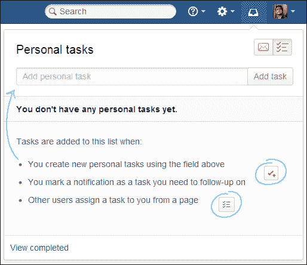

# 第五章：在 Confluence 中协作

到目前为止，我们已经学会了如何创建引人入胜的内容，以及如何自己跟踪有趣的内容。现在，我们将了解 Confluence 工作区，以及如何在日常工作中使用 Confluence 功能。

我们将了解如何直接在 Confluence 中分享有趣的内容、任务和喜欢，并学习如何快速回应而不切换上下文。我们还将学习如何通过分享、点赞和提及来吸引其他用户。

本章结束后，我们将能够：

+   分享内容并让其他人参与

+   管理应用内通知

+   处理个人任务

+   跟踪你在路上的内容

# 与他人合作

Confluence 是一个很棒的协作工具，但你如何利用 Confluence 与他人协作呢？假设你刚刚写了一篇很棒的文章，想在发布前让某人审核，或者你刚开了一个会议，想让一些人根据会议内容采取行动。

协作最重要的事情是内容的可用性，在 Confluence 中，所有内容默认对所有用户开放。接下来要做的是让人们参与，Confluence 提供了几种方法来实现这一点。

## 提及

提及是一种让人们参与到创建有用且相关内容的绝佳方式。你可以通过一种特别的方式提及某人，触发 Confluence 向该人发送通知。这就是所谓的**@提及**。@提及通知适用于页面、博客帖子和评论。

Confluence 会向用户发送电子邮件，通知他们已在页面中被提及。此消息会在你保存页面时发送，但仅当被提及的人对该页面有查看权限时才会发送。

使用自动补全功能执行以下步骤来提及某人：

1.  在编辑模式下打开页面，并将光标放在你想添加提及的位置。

1.  输入 `@`，然后输入用户全名的前几个字符。

1.  从建议列表中选择用户的姓名。

也可以通过编辑器工具栏添加提及，方法如下：

1.  在编辑模式下打开页面，并将光标放在你想添加提及的位置。

1.  选择**插入** | **用户提及**。Confluence 将在页面中添加一个 `@` 符号。

1.  开始输入该人的全名。

1.  从列表中选择用户的姓名。

请注意，提及是基于用户的全名而非用户名。目前，无法提及群组。

@提及通知是一种让人们参与你的对话或内容的好方法。例如，如果你希望**阿瑟·丹特**查看一些需求，只需在评论中提及他来让他参与。不要试图向你想要合作的人发送垃圾信息；要节制使用提及。另一种让人们参与的方法是分享你的内容。

## 分享内容

Confluence 提供了多种与其他用户共享内容的方式。之前讨论过的提及就是其中之一，但您还可以直接将页面链接共享给一个或多个用户，并简要说明您希望他们如何处理该链接。

通过**分享**按钮分享内容，前提是 Confluence 管理员已配置邮件服务器。

要使用**分享**按钮通过电子邮件发送链接，请执行以下步骤：

1.  转到您想分享的页面或博客帖子。

1.  点击右上角的**分享**按钮。输入 Confluence 用户的姓名或用户名，或者使用有效的电子邮件地址。开始输入时，将会出现建议列表。

1.  从列表中选择合适的用户或电子邮件地址。您可以添加多个收件人，并结合使用用户名和电子邮件地址。

1.  在**备注**框中输入可选消息。

1.  点击**分享**按钮通过电子邮件发送链接。

## 喜欢

当您在 Confluence 上阅读到一篇好的博客文章或页面时，您可以通过喜欢该页面来让其他用户知道。Confluence 在每个页面、博客帖子和评论上都有一个喜欢按钮。

点赞也用于填充仪表板上的**热门内容**标签页和**推荐更新**电子邮件。

点击**喜欢**按钮，让人们知道您同意或喜欢该内容或评论。您的名字将被添加到已喜欢该内容的其他人名单中。点击**不喜欢**按钮将把您从名单中移除。

当您喜欢一页、博客帖子或评论时：

+   内容的作者会收到通知

+   您网络中的人会收到通知，除非他们已经知道该内容，即：

    +   他们网络中的其他人已经喜欢了该内容

    +   用户自己已经喜欢了该内容

    +   用户已经评论了该内容或回复了评论

+   如果足够多人喜欢该内容，它将出现在仪表板的**热门内容**标签页中

+   如果足够多人喜欢该内容，它将包含在**推荐更新**的电子邮件中

**喜欢**功能由名为**Confluence Like Plugin**的插件提供，可以在**管理控制台**|**管理插件**中禁用。这将会在整个网站范围内禁用该功能，无法在特定空间或页面禁用。有关管理插件的更多信息，请参见第九章，通用管理。

## 状态更新

状态更新是短消息，会广播到 Confluence 中的不同活动流。这类短消息可能包括：

+   关于您正在处理的工作的描述

+   您想分享的有趣链接或事实

+   您可能希望快速得到答案的问题

您的状态更新历史可在**状态更新**视图中查看，当前状态消息则显示在您的个人资料和个人资料悬停上。

### 更新您的状态

要更新您的状态：

1.  确保您已登录到 Confluence。

1.  点击右上角的头像，并从下拉菜单中选择**更新状态…**。

1.  输入一个简短的消息（最多 140 个字符），描述您当前的状态或您想分享的内容。

1.  点击**更新**以发布您的新状态。

### 管理状态更新

更新状态后，您可以轻松查看、清除或删除它们（如果您犯了错误）。编辑状态更新是不可能的。

要查看您的状态更新，请执行以下步骤：

1.  点击右上角的头像。

1.  从下拉菜单中选择**状态更新**。

也可以通过前往其他用户的个人资料来查看其状态。

要清除当前状态，请执行以下步骤：

1.  前往用户个人资料中的**状态更新**视图。

1.  点击顶部状态更新下方的**清除**。

清除状态不同于删除状态。如果您清除状态，它不会显示在您的个人资料或个人资料悬停中，但仍会在**状态更新**视图中可见。

要删除状态更新，请执行以下步骤：

1.  前往用户个人资料中的**状态更新**视图。

1.  点击状态更新下方的**删除**。

## 显示状态更新

通常，状态更新仅显示在用户个人资料中或在仪表板上的最近更新内容中。利用状态更新的一个好方法是使用最近更新宏在页面上显示这些更新。

要在页面中插入状态更新：

1.  打开页面编辑模式或创建新页面。

1.  使用快捷键*{*（*Shift* + **）或**插入** | **其他宏**来选择最近更新的宏。

1.  点击宏容器并选择**编辑**，以打开宏的属性面板。

1.  为了仅显示状态更新，填写以下属性：

    +   **空间**：@all

    +   **仅包含这些内容类型**：状态

    +   **显示用户个人资料图片**：已勾选

1.  点击**保存**并保存页面。

您还可以将宏放入面板中，使其从其他内容中稍微突出一些。如下图所示：

![显示状态更新# 管理通知 Confluence 工作区的一个特点是可以将所有通知集中显示在一个地方。工作区的目的是通过减少在电子邮件、Confluence 和其他工具之间切换来节省时间。工作区显示从 Confluence 页面监视、共享、提及和任务中收集的所有通知。如果 Confluence 与 JIRA（Atlassian 的缺陷跟踪系统）链接，您还将看到 JIRA 的通知。工作区还显示个人任务，详细内容将在下一节说明。## 管理通知在工作区中，您可以使用内联操作回复评论，或喜欢并关注评论和页面。点击通知中的链接打开相关内容。你无法自己删除通知。已阅读的通知会在两周后自动删除，未读的通知则会在四周后删除。### 提示工作箱在集群化的 Confluence 环境中不可用。该功能会检测到 Confluence 安装在集群模式下运行，并且不显示工作箱。要管理你的通知，请执行以下步骤：1.  选择 Confluence 导航栏中的工作箱图标。    1.  你还可以使用键盘快捷键：按 `g` 然后按 `n`。    1.  图标还会显示未读通知的数量。1.  选择通知图标。1.  从列表中选择通知以查看通知详细信息。在详细信息中，你可以执行以下操作：    1.  打开相关的页面、博客文章或评论。该页面将在你的浏览器中新标签页中打开。    1.  **点赞** 或 **取消点赞** 内容或评论。    1.  **关注** 或 **停止关注** 相关内容，以接收或停止接收通知。    1.  **评论** 或 **回复** 直接从工作箱中回应评论。    1.  选择添加任务图标，根据通知创建任务。    

## 包括的通知

当有人在 Confluence 中执行以下操作时，工作箱会显示通知：

+   与你共享页面或博客文章

+   评论你正在关注的页面或博客文章

+   在页面、博客文章或评论中提到你

+   点赞你正在观看或创建的页面或博客文章

+   通过在任务列表中提到你来分配任务

因为你正在关注空间而触发的通知将 *不会* 显示在工作箱中。

如果你的 Confluence 安装与 JIRA 连接，你还会在工作箱中看到来自 JIRA 的以下通知：

+   评论你正在关注的问题

+   在问题中提到

+   分享问题、筛选器和搜索

## 配置工作箱通知

Confluence 工作箱默认启用；作为 Confluence 管理员，你可以禁用它或更改配置。有几种配置方案：

+   你的 Confluence 安装提供应用内通知，并将其显示在自己的工作箱中。在这种情况下，有两种可能性：

    +   这个 Confluence 安装是唯一涉及的安装。

    +   或者，这个 Confluence 安装会显示自己的通知，并且还会显示来自 JIRA 和/或其他 Confluence 安装的通知。

+   你的 Confluence 安装将应用内通知发送到另一个 Confluence 安装。

+   应用内通知完全禁用且不可用。

Confluence 工作箱包括通知和任务，当工作箱通知启用时，个人任务也会启用。如果你禁用通知，个人任务也将不可用。

### 启用工作箱通知

要使用通知和任务，必须启用 Confluence 工作箱。

要启用 Confluence 工作箱，请执行以下步骤：

1.  浏览到管理控制台 (**Administration** | **Confluence Admin**)。

1.  从左侧菜单中选择 **应用内通知**。

1.  选择 **显示应用内通知** 并点击 **保存** 来保存表单。工作区图标将出现在导航栏的右上角。

    +   **主动轮询间隔**：这是 Confluence 在检查与当前用户查看的页面相关的新通知之前等待的秒数。

    +   **非活动轮询间隔**：这是 Confluence 在检查与当前未聚焦的所有页面相关的新通知之前等待的秒数。如果已配置，这也可以在其他服务器上进行。

### 包括来自 JIRA 的通知

Confluence 工作区可以包括来自 JIRA 问题跟踪器的通知，但这需要额外的设置。

要包括来自 JIRA 的通知，请执行以下步骤：

1.  确保 JIRA 和 Confluence 通过应用链接连接。

    1.  浏览到管理控制台 (**Administration** | **Confluence Admin**)。

    1.  从左侧菜单中选择 **应用链接**。

    1.  选择 **添加应用链接** 并按照向导创建新的应用链接。（有关应用链接的更多信息，请参见 第八章，*高级 Confluence*。）

    1.  如果你的 JIRA 服务器已链接多个 Confluence 服务器，确保主应用链接指向将显示应用内通知的 Confluence 服务器。

1.  在管理控制台的左侧菜单中选择 **应用内通知**。

1.  选择 **显示来自其他服务器的应用内通知**。

    +   你的 JIRA 服务器将出现在链接应用程序的列表中。

    +   用户将在 Confluence 工作区中看到 JIRA 通知。

请注意，此功能仅适用于 JIRA 5.2 或更高版本。JIRA 将仅将通知发送到配置为主应用链接的 Confluence 服务器。

### 向另一个 Confluence 服务器发送通知

Confluence 可以向另一个 Confluence 服务器发送和接收通知。为了演示如何设置，我们假设有两个 Confluence 服务器 `ConfSend` 和 `ConfReceive`，其中 `ConfSend` 将其通知发送到 `ConfReceive`。

要将通知发送到另一个 Confluence 服务器，请执行以下步骤：

1.  通过应用链接连接两个 Confluence 安装。在 `ConfReceive` 中：

    1.  浏览到管理控制台 (**Administration** | **Confluence Admin**)。

    1.  从左侧菜单中选择 **应用链接**。

    1.  按照 *包括来自 JIRA 的通知* 部分中描述的方式设置应用链接。

1.  配置 `ConfReceive` 显示应用内通知。

    1.  从管理控制台的左侧菜单中选择 **应用内通知**。

    1.  选择 **显示来自其他服务器的应用内通知**。

1.  在 `ConfSend` 中配置通知设置。

    1.  从管理控制台左侧菜单中选择 **应用内通知**。

    1.  选择 **将应用内通知发送到另一个服务器**。

    1.  选择要将通知发送到的 Confluence 安装。

# 使用任务

Confluence 工作盒的另一个重要部分是任务。通过个人任务，你可以直接在 Confluence 中创建自己的待办事项列表，这对于与 Confluence 中的内容或评论相关的任务非常有用。

有几种方式可以让你和其他人将任务分配给你：

+   你可以通过工作盒添加个人任务

+   你可以通过工作盒中的通知添加任务；如果你不想忘记某些事情，这非常有用

+   有人可以从 Confluence 页面上的任务列表中分配任务给你

+   其他插件可以为你创建任务

## 使用个人任务

你可以使用工作盒界面在 Confluence 中创建自己的个人任务。

要创建新任务，请执行以下步骤：

1.  通过选择 Confluence 头部的工作盒图标来打开工作盒。

1.  选择个人任务图标。

1.  在文本框中输入任务概要，点击 **添加任务** 来添加个人任务。

1.  要向任务添加更多细节，点击新创建的任务。在备注文本框中输入任何细节和备注。

要更改任务优先级，请执行以下步骤：

1.  通过选择 Confluence 头部的工作盒图标来打开工作盒。

1.  拖放任务以更改其顺序。点击任务并按住鼠标按钮，拖动任务到新的位置。释放鼠标按钮以保存更改。

要完成任务，请执行以下步骤：

1.  通过选择 Confluence 头部的工作盒图标来打开工作盒。

1.  勾选任务旁边的复选框以完成它。

1.  完成的任务会被隐藏，并可以通过工作盒底部的 **查看已完成** 链接显示出来。

## 使用任务列表

任务列表可以放置在页面上，非常有助于在团队中分配和管理任务。任务列表会将已分配的任务放入被分配者的工作盒中，并保持进度同步，这意味着在工作盒中完成任务也会在任务列表中完成该任务。

### 提示

任务列表在会议纪要中非常有用，特别是当你想要分配并跟踪会议中的行动项时。

你还可以使用任务列表来跟踪新员工入职时所需完成的所有任务，例如用户账户、笔记本电脑和互联网访问。

要在页面上添加任务列表，请执行以下步骤：

1.  打开页面的编辑模式。

1.  在编辑器工具栏中，选择任务列表图标或使用快捷键 *[* + *]*。

1.  输入任务的描述。

1.  如果你想将任务分配给某人，请在任务描述中输入 `@` 和该人的全名（@提及的详细说明请参见本章其他部分）。被分配的人将收到通知，任务将出现在他们的个人任务列表中。你也可以提及自己，以将任务分配到自己的任务列表。

1.  完成任务列表时，按*Enter*键两次。

### 在页面上管理任务

当您或他人查看页面时，任务可以被标记为已完成或未完成。更新的任务及其状态也会与工作区同步。

+   要在查看模式下更新任务列表：

    +   您需要编辑权限

    +   您需要在空间中拥有创建页面的权限

# Confluence 移动界面

使用像 Confluence 这样的协作工具，您能够在出差时仍然访问您的信息并跟进讨论是非常重要的。Confluence 提供了内置的移动界面，适用于带有网页浏览器的现代移动设备，操作简便。

在您的手机或其他支持的移动设备上，您可以：

+   查看 Confluence 仪表板、页面、博客文章和用户资料

+   向页面或博客文章添加评论

+   点赞内容，例如页面、博客文章或评论

+   管理您的个人任务和通知

在移动界面中无法添加或编辑页面或博客文章，也无法编辑现有评论。与桌面版相比，移动界面的导航方式也有所不同。空间和树形视图在移动界面中不可用，导航是通过使用 Confluence 搜索来查找内容完成的。

## 查看

登录移动界面后，您首先看到的将是仪表板，尽管并非所有更新都会显示。移动界面上仪表板中可用的内容包括：

+   热门内容 – 基于评论和点赞

+   最近的博客 – 您可以访问的空间中的最新博客文章

+   网络 – 来自您网络中的人的更新

点击链接将带您进入页面、博客文章或评论的完整内容。查看页面或博客文章的完整内容时，您可以：

+   查看内容。点击任何链接即可跳转到 Confluence 中的其他页面。

+   点赞或取消点赞页面、博客文章或评论。

+   添加评论。移动界面仅支持纯文本评论。

如前一张截图所示，您可以使用移动界面更改任务的状态。

## 用户资料

通过移动界面，您可以搜索用户，然后直接使用手机拨打电话、发短信或发电子邮件给该用户，前提是该用户已在 Confluence 中填写了相关信息。

### 提示

**公司通讯录**

使用 Confluence 的移动界面，您可以轻松创建公司通讯录。只需确保每位员工及时更新自己的信息。

## 搜索

点击左上角的菜单图标以打开菜单面板。在搜索框中开始输入页面标题或人的名字。移动界面的搜索引擎旨在快速并仅提供基于页面标题的匹配结果。要进行完整搜索，你需要切换到桌面模式。点击搜索结果以查看完整内容。

## 通知和任务

你可以直接从手机查看和回复通知。点击菜单图标打开左侧菜单。选择**通知**，然后点击一个通知查看其详细信息。你可以通过行动来回复、点赞或关注。点击**打开**以打开页面或博客帖子。

选择**任务**来查看和管理你的个人任务。点击加号（+）添加新任务。点击任务以查看其详细信息。使用移动设备，你可以添加备注、完成任务或浏览相关页面。

## 关于移动界面的注意事项

移动界面是保持与时俱进的一种好方式，即使你不在正常的桌面前。 但是，Confluence 桌面版本提供的所有功能并不能完全转移到移动界面。

+   有些宏可能无法使用。

    Confluence 宏在移动界面中尚不完全支持。如果你正在查看带有不支持的宏的内容，你将看到一个消息，邀请你切换到页面的桌面版本。

+   在桌面和移动界面之间切换。

    在你的移动界面中使用左侧菜单面板，你可以切换到 Confluence 的桌面版本。当你在移动设备上查看桌面版本时，你还会看到一个链接，允许你切换回移动界面。

+   移动界面可以被禁用。

    如果你在 Confluence 上运营一个公共网站，你可能希望关闭移动界面，以保持原有的外观和感觉。移动界面有一个插件叫做 Confluence 移动插件，可以通过管理控制台禁用。

# 总结

我们已经了解了 Confluence 工作区及其与应用内通知和个人任务的协同工作能力。两者都可以用来共享内容，或让更多人参与到你的工作流程、行动和内容中。

任务是会议后或准备新版本时跟踪待办事项的好方法。通过任务列表，我们可以将任务分配给其他人并跟踪这些任务。

使用移动界面，你可以在旅途中随时随地使用 Confluence（前提是你有互联网连接）。移动界面可以用来搜索信息、对页面或博客帖子发表评论，并管理你的通知和任务。使用移动界面搜索其他用户时，可以直接从你的移动设备拨打电话或发送消息给他们。

通过在 Confluence 中创建、分享和跟踪内容，我们可以深入了解 Confluence 的另一个方面——**内容安全**。能够控制谁可以查看或编辑你的内容是我们将在下一章节中学习的内容。
