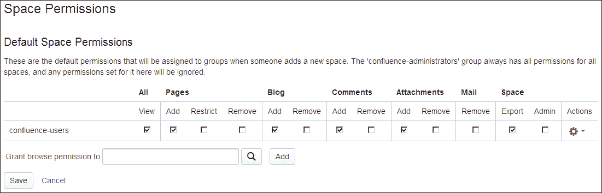

# 第六章：安全您的内容

现在我们知道如何创建丰富和引人入胜的内容，以及如何让同事参与内容创建过程中。我们已经在使用 Confluence 一段时间了，越来越多的信息变得可用。

在本章中，我们将学习如何保护我们的私有内容。我们将查看保护内容的不同方法，同时也将研究如何保护完整的 Confluence 安装。

本章我们将讨论以下主题：

+   全局权限

+   空间权限和页面限制

+   安全管理员会话

+   一些安全最佳实践

# 访问内容

到目前为止，我们创建的所有内容都可以被具有 Confluence 访问权限的任何人查看和编辑，甚至可以在启用匿名登录的情况下无需登录。当公司的信息和文档存储在 Confluence 中时，允许任何人查看或编辑它们可能不是最佳的安全设置。

Confluence 为您提供了使安装尽可能开放或封闭的所有工具。在我们讨论选项及如何启用它们时，请记住以下几点：

+   Confluence 是一款用于沟通和协作的工具；它允许用户尽可能查看和编辑更多的内容。这将帮助您充分利用组织内透明的知识交流。

    因此，在仅在有充分理由时才限制空间或页面的情况下。

+   Confluence 记录对页面或博客文章的每一次更改。这使得轻松查看谁更改了什么，如果需要的话，可以将内容恢复到先前保存的状态。

在每个人都在自己的桌面上处理文档的情况下，人们不习惯获得反馈和输入。这可能是公司在开始使用 Confluence 时必须经历的文化转变。在限制对空间、页面或博客文章的访问之前，请问自己：“为什么这篇文档应该是私有的，而在我的组织内使其更可见会有什么害处？”

## 全局权限

全局权限是站点范围的权限，只能由系统管理员和 Confluence 管理员分配。全局权限可以分配给组、个别用户和匿名用户。

在我们讨论如何更改不同的全局权限之前，了解不同的管理员角色是很重要的：

+   **超级用户**：任何属于 confluence-administrators 组的用户都具有对 Confluence 的完全管理访问权限。超级用户甚至可以查看和编辑所有内容，即使受权限限制也不例外。

+   **系统管理员**：具有系统管理员全局权限的用户具有对 Confluence 的完全管理访问权限，但不能查看或编辑他们没有权限的内容。

+   **Confluence 管理员**：具有 Confluence 管理员全局权限的用户对 Confluence 的管理功能有有限的访问权限。例如，Confluence 管理员不能安装新的插件。有关哪些功能受到限制的更多详细信息，请参阅*比较管理角色*部分。

### 提示

**Confluence 管理员权限和 confluence-administrators 组是没有关系的**。

尽管名称上看起来它们相关，但实际上并不相同。授予用户或组 Confluence 管理员权限并不等同于将该用户添加到 confluence-administrators 组。

不同角色之间的关系在以下图示中有所说明：


### 注意

由于 confluence-administrators 组内的用户被允许查看和编辑所有内容，建议为日常工作使用不同的用户账户。具有系统管理员权限时，可以执行所有管理功能，但您的管理员不能查看所有内容。

如果限制的内容无法再被任何人访问，则需要一个超级用户账户。超级用户仍然可以访问内容并恢复限制。

### 更新全局权限

如果您是 Confluence 管理员，您可以将用户和组添加到全局权限中，以确定其权限。

要查看全局权限：

1.  浏览到管理控制台（**管理** | **Confluence 管理员**）。

1.  在左侧菜单中选择**全局权限**。接下来的屏幕将显示如下截图：

要为组添加权限，请执行以下步骤：

1.  选择**编辑权限**；这将显示**编辑全局权限**屏幕。

1.  在组部分的**授予浏览权限给**框中输入组名。您也可以搜索组名。

1.  点击**添加**。

1.  该组将被添加到列表中，您可以编辑其权限。

1.  当所有相关的复选框都被选中后，点击页面底部的**保存所有**按钮。

要为用户添加权限，请执行以下步骤：

### 注意

在向用户添加权限之前，首先考虑管理开销。将他们添加到一个组并为该组分配权限，从长远来看将减少维护工作。

1.  选择**编辑权限**；这将显示**编辑全局权限**屏幕。

1.  在**个人用户**部分的**授予浏览权限给**框中输入用户名。您也可以搜索用户名。

1.  点击**添加**。然后，用户将被添加到列表中，您可以编辑其权限。

要添加或编辑组和用户的权限，请执行以下步骤：

1.  在相关用户或组的权限下，选择或清除复选框。选中的框表示已授予该权限。

1.  要允许匿名访问你的 Confluence 安装，请在**匿名访问**部分选择**使用 Confluence**选项。

1.  选择**保存所有**以保存更改。

### 全局权限概述

在之前的步骤中，我们学习了如何管理不同的全局权限。下表中解释了这些不同的全局权限。这些权限也显示在之前的截图中。

| 权限 | 描述 |
| --- | --- |
| **可以使用** | 这允许用户访问你的 Confluence 网站。拥有此权限的用户将计入你的许可证用户数。 |
| **将文件附加到用户个人资料** | 由于个人空间的引入，此权限不再相关，可以忽略。 |
| **更新用户状态** | 这允许用户更新他们的状态消息。 |
| **个人空间** | 这允许用户创建和维护个人空间。 |
| **创建空间** | 该权限允许用户在 Confluence 中创建新空间。当一个空间被创建时，创建者会自动成为该空间的空间管理员。 |
| **Confluence 管理员** | 该权限允许用户访问控制站点范围管理的管理控制台。拥有此权限的用户可以执行*部分*管理功能。 |
| **系统管理员** | 该权限允许用户访问控制站点范围管理的管理控制台。拥有此权限的用户可以执行*所有*管理功能。 |

### 比较管理角色

我们已经学习过，拥有系统管理员权限的用户可以执行 Confluence 中的所有管理功能。而拥有 Confluence 管理员权限的用户仅允许管理这些功能的子集。

你可以将 Confluence 管理员权限授予那些应该能够执行大多数管理功能的用户，但不应授予那些可能危及 Confluence 系统安全性的功能。

以下功能被授予系统管理员权限，但从 Confluence 管理员权限中排除，以确保你的 Confluence 实例的完整性和安全性。

+   一般配置 – 仅排除以下选项：

    +   更改服务器基本 URL

    +   启用/禁用远程 API

    +   启用/禁用压缩 HTTP 响应

    +   更改连接超时

+   备份管理

+   外部小工具

+   邮件服务器

+   用户宏

+   应用内通知

+   附件存储

+   PDF 导出

+   Office 连接器

+   插件 – 仅排除以下选项：

    +   升级插件

    +   安装新插件

    +   Confluence 升级检查

+   安全配置 – 仅排除以下选项：

    +   外部用户管理

    +   向用户和组搜索添加通配符。

    +   为空间启用自定义样式表。

    +   在 500 错误页面上显示系统信息。

    +   最大 RSS 项目数

    +   RSS 超时

    +   XSRF 保护

    +   防止 XSS 模式

+   更改全局样式表

+   添加自定义 HTML

+   备份与恢复

+   邮件队列

+   缓存统计

+   定时任务

+   日志记录与分析

+   Atlassian 支持工具

### 关于全局权限的说明

在使用全局权限时需要记住一些事项，例如拥有以下权限的用户：

+   Confluence 管理员权限可以访问全局权限页面并更改权限，但不能更改 confluence-administrators 组的权限

+   Confluence 管理员权限无法授予自己系统管理员权限

+   Confluence 管理员权限无法将自己添加到 confluence-administrators 组，并成为超级用户

+   系统管理员权限可以在全局权限页面上更改 confluence-administrators 组的权限

+   系统管理员权限可以将自己添加到 confluence-administrators 组，并成为超级用户

## 空间权限

每个空间都有自己的一组权限。这些权限决定了特定用户和组对该空间的访问权限。为了分配这些权限，用户必须是空间管理员，即他们应该具有该空间的管理员权限。

### 权限概述

以下是您可以在空间级别设置的不同权限列表：

| 权限 | 描述 |
| --- | --- |
| 查看 | 用户可以查看此空间的内容，包括页面和博客文章。如果没有此权限，用户将无法访问该空间。 |
| 页面 – 添加 | 用户可以在此空间中添加和编辑页面。 |
| 页面 – 限制 | 用户被允许应用页面级别的限制。 |
| 页面 – 删除 | 用户被允许删除此空间中的页面。 |
| 博客 – 添加 | 用户被允许创建和编辑博客文章。 |
| 博客 – 删除 | 用户被允许删除此空间中的博客文章。 |
| 评论 – 添加 | 用户被允许在此空间中发表评论。 |
| 评论 – 删除 | 用户被允许删除此空间中的任何评论。 |
| 附件 – 添加 | 用户被允许在此空间中添加附件。 |
| 附件 – 删除 | 用户被允许删除此空间中的任何附件。 |
| 邮件 – 删除 | 用户被允许删除邮件项。 |
| 空间 – 导出 | 用户被允许从此空间导出内容。 |
| 空间 - 管理 | 用户对该空间具有管理权限。 |

### 注释

如果由于错误，所有对空间的管理访问权限被移除，则没有人可以再管理该空间。例如，如果一个空间管理员离职，或者拥有空间管理员权限的组被从 Confluence 中移除，就可能发生这种情况。在这种情况下，需要来自 confluence-administrators 组的人员来帮助修复权限。

### 管理空间权限

权限可以授予组或个人用户。你需要是空间管理员才能分配空间权限。Confluence 管理员也可以设置新建空间时应用的默认权限；此内容将在以下部分说明。

要访问空间权限，你需要执行以下步骤：

1.  进入空间并在左侧边栏选择**空间工具**。

1.  选择**权限**，然后选择**权限**。

### 注意

请注意，权限菜单仅在你是空间管理员或超级用户时显示。

在空间权限屏幕中，你将注意到以下三个部分：

+   **组**：已拥有访问空间权限的组列表

+   **个人用户**：已拥有访问空间权限的用户列表

+   **匿名访问**：为匿名用户授予此空间的权限

要为组分配权限，请执行以下步骤：

1.  点击组部分下方的**编辑权限**按钮。

1.  要分配权限，勾选相关的复选框。

1.  要删除权限，取消勾选相关权限下方的复选框。

1.  要将新组添加到列表中，请在组部分的文本框中输入组名，然后点击**添加**。你还可以通过点击文本框旁边的放大图标来搜索组。

    ### 注意

    对于批量操作：

    点击操作列中的齿轮图标。

    选择**全选**或**取消全选**来执行批量操作。

1.  点击**保存所有**以应用更改。

要为用户分配权限：

1.  点击**编辑权限**按钮，位于**个人用户**部分下方。

1.  要分配权限，勾选相关的复选框。

1.  要删除权限，取消勾选相关权限下方的复选框。

1.  要将新用户添加到列表中，请在**个人用户**部分的文本框中输入用户名，然后点击**添加**。你还可以通过点击文本框旁边的放大图标来搜索用户。

    ### 注意

    对于批量操作：

    点击操作列中的齿轮图标。

    选择**全选**或**取消全选**来执行批量操作。

1.  点击**保存所有**以应用更改。

要为匿名用户分配权限：

1.  点击**编辑权限**按钮，位于**匿名用户**部分下方。

1.  要分配权限，勾选相关复选框。

1.  要删除权限，取消勾选相关权限下方的复选框。

1.  点击**保存所有**以应用更改。

匿名用户不能被授予空间管理权限或限制页面的权限。

### 设置默认空间权限

Confluence 管理员可以设置默认权限，这些权限将应用于每个新创建的空间。默认权限只能为组配置，而不能为个人用户或匿名用户配置。

要设置默认空间权限：

1.  浏览到管理控制台（**管理** | **Confluence 管理**）。

1.  在左侧菜单中选择**空间权限**。

1.  选择**编辑权限**。

1.  按照上一节中如何为组分配权限的描述，添加组并更改权限。

## 页面限制

页面限制是控制你内容访问权限的最低层次。通过页面限制，你可以控制谁可以查看或编辑单个页面。

### 页面限制层级

在我们讨论如何设置和管理页面限制之前，了解 Confluence 如何处理权限和限制是很有帮助的。权限和页面限制是分层处理的。这意味着可以访问和修改全局权限的用户，可以定义哪些用户可以访问和修改空间权限。空间管理员可以定义哪些用户有权创建和修改页面。这些用户随后可以对页面应用查看和编辑限制。子页面会继承父页面的查看和编辑限制。

如果你将其转化为一个图示，它将是这样的：


#### 继承

我之前提到过，子页面会继承父页面上设置的查看限制。这对于子页面的子页面也是成立的，依此类推。如果一个页面已经继承了父页面的限制，并且对该页面设置了查看限制，那么用户必须同时满足两项限制才能看到该页面。

编辑限制不会从父页面继承，只会从空间继承。编辑限制需要重新应用到子页面。

### 管理页面限制

我们将首先讨论查看页面限制。

当你查看已应用页面限制的页面时，你会注意到页面标题下方的署名旁边有一个小锁图标。如果你点击该图标，页面限制对话框将显示，展示该页面限制的详细信息。

当你编辑页面时，你会注意到屏幕底部有一个限制按钮。点击此按钮也会显示页面限制对话框。

接下来，我们将看看如何设置页面限制。为了设置页面限制，执行以下步骤：

1.  浏览到相关页面。

1.  选择**工具** | **限制**以打开**页面限制**对话框。

1.  选择你想要设置的限制选项（查看或编辑）。

1.  选择你希望能够查看或编辑页面的用户和组。

    +   要包括自己，请点击**我**。

    +   要选择特定的用户或组，请在文本框中输入用户的用户名或组名。点击**限制**，允许该用户或组查看或编辑该页面。

    +   要搜索用户或组，请点击**人员…**或**组…**按钮。

1.  点击**保存**以应用新的限制，如下图所示：

要移除页面限制，请执行以下步骤：

1.  使用挂锁图标打开**页面限制**对话框，或选择**工具** | **限制**。

1.  点击用户或组旁边的**移除限制**链接，以将其从限制中移除。这样，除非没有限制，否则您将禁止他们查看或编辑该页面。

1.  点击**保存**。

接下来我们将讨论查看受限页面。作为空间管理员，您可以查看所有受限页面。在此视图中，还可以移除页面限制。例如，当没有人能够访问某个页面时，您可能需要执行此操作。

1.  进入空间并在左侧边栏选择**空间工具**。

1.  选择**权限**，然后选择**受限页面**。

    ### 注意

    请注意，权限菜单仅在您是空间管理员或超级用户时显示。

1.  点击解锁图标将移除限制。

# Confluence 安全

到目前为止，我们讨论了权限和限制，这当然是保护数据安全的关键部分。但还有一些最佳实践和功能可以降低 Confluence 安装被破坏的风险，并防止错误的人获得访问权限。

## 安全管理员会话

Confluence 通过一个特殊的管理员会话保护其管理功能的访问。当用户尝试访问管理控制台或空间管理时，会提示用户重新登录。这将使管理员登录到一个临时的安全会话，允许访问这些管理页面。在文档的其他部分，这一功能也称为**WebSudo**。


管理员会话具有 10 分钟的滚动超时（默认）。这意味着如果在 Confluence 或空间管理中没有活动 10 分钟，用户将被登出管理员会话。如果用户点击任何管理功能，超时时间将被重置。

配置安全管理员会话：

1.  浏览到管理控制台（**管理** | **Confluence 管理**）。

1.  在左侧菜单中选择**安全配置**。

1.  编辑设置：

    +   要禁用安全管理员会话，请取消选中**启用**旁边的复选框**安全管理员会话**。

    +   要更改会话的超时时间，请更新**自动失效前的分钟数**旁边的值。

1.  点击**保存**。

如果您的 Confluence 实例使用自定义构建的身份验证机制，额外的登录验证可能会导致问题，因为它会将身份验证与 Confluence 进行对比，而不是与您自己的自定义身份验证服务器进行对比。禁用密码确认将是一个有效的解决方案。

管理员始终可以通过点击屏幕顶部显示的横幅中的**丢弃访问**来手动结束安全会话，以下截图所示：


## Atlassian 安全通告

像 Confluence 这样的软件并非完美无缺，偶尔会发现一些漏洞。当漏洞被发现时，Atlassian 将根据行业标准的**常见漏洞评分系统**（**CVSS**）来计算其严重性。

### 注意

欲了解更多有关 CVSS 的信息，请访问[`www.first.org/cvss/cvss-guide.html`](http://www.first.org/cvss/cvss-guide.html)。

根据 CVSS 评分，严重性将依据以下准则进行映射：

| CVSS 评分范围 | 通告中的严重性 |
| --- | --- |
| 0 – 2.9 | 低 |
| 3 – 5.9 | 中 |
| 6 – 7.9 | 高 |
| 8 – 10 | 严重 |

以下是通常导致特定严重性的因素总结。这些评级不考虑您个人的安装细节，而是基于一个平均的安装环境。

+   **严重**：这意味着为利用该漏洞所需的信息广泛可供攻击者获取。

    漏洞利用通常是直接的，这意味着攻击者无需任何特殊凭证或对您安装环境中的个人知识。

    漏洞的利用会导致您的服务器或其他基础设施设备的根级别妥协。

    ### 注意

    对于严重漏洞，建议您尽快修补或升级，除非您已采取其他措施。例如，如果您的 Confluence 安装没有通过互联网访问。

+   **高**：在此情况下，漏洞的利用不会导致权限提升。

    漏洞的利用不会导致显著的数据丢失或损坏。

    并且，漏洞利用是困难的。

+   **中等**：拒绝服务漏洞的设置较为复杂。

    这些漏洞只会影响非标准配置或不常见的应用程序。

    这包括需要攻击者与受害者位于同一局域网内的漏洞。

    这包括那些需要攻击者通过社交工程手段操控个别受害者的漏洞。

    这包括漏洞利用仅提供非常有限的访问权限。

+   **低**：低范围的漏洞通常对组织的业务影响非常小。利用这些漏洞通常需要本地或物理系统访问权限。

当发现严重漏洞并解决时，Atlassian 将通过以下渠道通知客户：

+   Atlassian 将在发布漏洞修复的同时，将安全通告发布到 Confluence 的最新文档中。请查看以下链接：

    [`confluence.atlassian.com/display/DOC/Confluence+Security+Overview+and+Advisories`](https://confluence.atlassian.com/display/DOC/Confluence+Security+Overview+and+Advisories)

+   Atlassian 将会把安全通告的副本发送到“技术警报”邮件列表。

如果您想跟踪非关键性漏洞，您可以监视 Confluence 的问题跟踪器，网址为[`jira.atlassian.com/browse/CONF`](https://jira.atlassian.com/browse/CONF)。安全问题将标记有“security”标签。

## 限制对 Confluence 管理的访问

Confluence 管理控制台在保持您的 Confluence 安装运行并确保用户具有应有的权限方面发挥着至关重要的作用。

进一步保护管理控制台的一种方式是将其访问限制在您网络或互联网上的某些机器上。如果您在 Confluence 安装前使用 Apache Web 服务器，操作如下：

1.  第一步是在服务器的常见位置创建一个文件。我们将使用此文件来包含所需的 Apache 配置，确保我们只需更改一个位置而不是多个位置。我们可以按以下方式执行此操作：

    1.  在您的 apache 配置目录中创建名为`local_machines_only.conf`的文件。

    1.  在此文件中添加以下行（仅包括**粗体部分**）：

    +   **Order Deny, Allow**：首先查找 Deny 规则，然后是 Allow 规则

    +   **Deny from All**：拒绝所有人的访问

    +   **Allow from 192.168.1.5 #Arthur 的机器**：基于 IP 允许从 Arthur 的机器访问

    ### 注意

    有关 Apache 访问控制的更多信息，请参阅[`httpd.apache.org/docs/2.2/howto/access.html`](http://httpd.apache.org/docs/2.2/howto/access.html)。

1.  接下来的步骤是将大量位置添加到您的 Apache 虚拟主机配置中。以下配置假设您已在上下文路径`/confluence`下安装了 Confluence，即`http://mycompany.com/confluence`。如果您的安装不是这样，请相应地更改以下配置中的位置：

    ```
    <Location /confluence/admin>
      Include local_machines_only.conf
    </Location>
    <Location /confluence/plugins/servlet/oauth/consumers/list>
      Include local_machines_only.conf
    </Location>
    <Location /confluence/plugins/servlet/oauth/view-consumer-info>
      Include local_machines_only.conf
    </Location>
    <Location /confluence/plugins/servlet/oauth/service-providers/list>
      Include local_machines_only.conf
    </Location>
    <Location /confluence/plugins/servlet/oauth/service-providers/add>
      Include local_machines_only.conf
    </Location>
    <Location /confluence/plugins/servlet/oauth/consumers/add>
      Include local_machines_only.conf
    </Location>
    <Location /confluence/plugins/servlet/oauth/consumers/add-manually>
      Include local_machines_only.conf
    </Location>
    <Location /confluence/plugins/servlet/oauth/update-consumer-info>
      Include local_machines_only.conf
    </Location>
    <Location /confluence/pages/templates/listpagetemplates.action>
      Include local_machines_only.conf
    </Location>
    <Location /confluence/pages/templates/createpagetemplate.action>
      Include local_machines_only.conf
    </Location>
    <Location /confluence/spaces/spacepermissions.action>
      Include local_machines_only.conf
    </Location>
    <Location /confluence/pages/listpermissionpages.action>
      Include local_machines_only.conf
    </Location>
    <Location /confluence/spaces/removespace.action>
      Include local_machines_only.conf
    </Location>
    <Location /confluence/spaces/importmbox.action>
      Include local_machines_only.conf
    </Location>
    <Location /confluence/spaces/viewmailaccounts.action>
      Include local_machines_only.conf
    </Location>
    <Location /confluence/spaces/addmailaccount.action?>
      Include local_machines_only.conf
    </Location>
    <Location /confluence/spaces/importpages.action>
      Include local_machines_only.conf
    </Location>
    <Location /confluence/spaces/flyingpdf/flyingpdf.action>
      Include local_machines_only.conf
    </Location>
    <Location /confluence/spaces/exportspacehtml.action>
      Include local_machines_only.conf
    </Location>
    <Location /confluence/spaces/exportspacexml.action>
      Include local_machines_only.conf
    </Location>
    <Location /confluence/plugins/servlet/embedded-crowd>
      Include local_machines_only.conf
    </Location>
    <Location /confluence/plugins/servlet/upm>
      Include local_machines_only.conf
    </Location>
    ```

这将确保只有指定的机器和 IP 才能访问管理功能。

## 最佳实践

设置您的 Confluence 角色、权限和内部流程的方式将极大影响保持您的 Confluence 安装的安全性。以下是一些您可以考虑的建议。这些建议不能使您的安装完全安全，但可以减缓或阻止攻击者的行动。

通常可以说，“安全不应因方便而忽视。”

+   尽可能保持 Confluence 管理员的数量尽可能低，但仅有一个管理员也不是没有风险。

+   限制具有强大角色或组成员资格的用户数量。如果只有一组用户应访问某些特定数据，请将数据访问权限限制为这些用户。当无需时，不要将所有员工都授予对敏感数据的访问权限。

+   Confluence 管理员应为其管理角色和日常工作分别拥有独立的帐户。

+   尽可能限制管理访问。如果没有理由从办公室外执行管理任务，请使用前面提到的方法将访问限制为已知 IP 地址。

+   制定好文档化的流程，以便当人员离开部门或公司时，确保他们无法再访问您的 Confluence。

+   Confluence 数据库用户应该仅具有读取和写入 Confluence 数据库的权限，不应允许执行数据库管理职能。

+   定期监控您的安全需求，因为随着时间的推移，情况会发生变化。您可能不知不觉中会有 10 个管理员，而不是 3 个，或者在升级系统时修改了 Apache 配置。

请记住，这些建议可能只是您整个基础设施的一小部分。应用那些对贵公司和安全需求有意义的建议。

# 摘要

我们已经了解了如何通过空间权限和页面限制来保护我们的内容隐私。Confluence 有一个分层的权限结构，从超级用户开始，超级用户可以更改所有权限并查看所有内容。关于安全性，遵循的一个好规则是，将具有管理权限的用户数量限制到绝对最小。

需要注意的是，限制权限可以帮助限制对您创建的内容的访问，但这与应用程序的预期用途和好处相悖。Confluence 是一个 Wiki，因此它的设计目的是鼓励协作和共享。在限制特定用户和群体对 Confluence 实例区域的访问时，请记住这一点。

下一章将介绍如何自定义 Confluence 的外观和感觉，使其融入贵公司的品牌。
