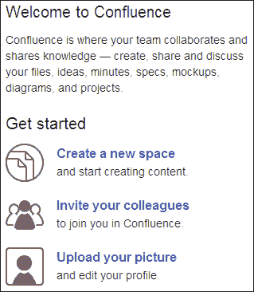
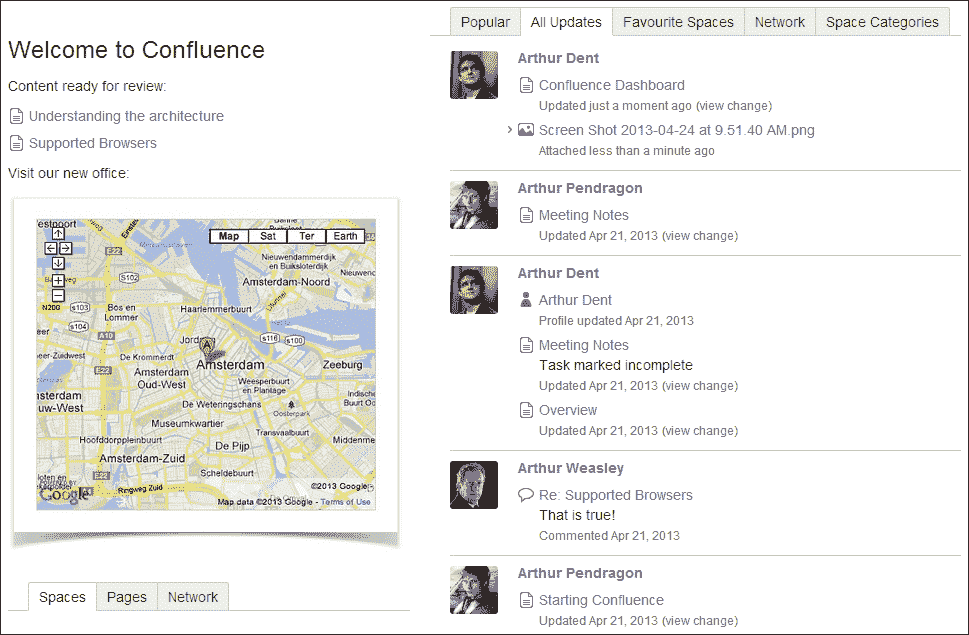
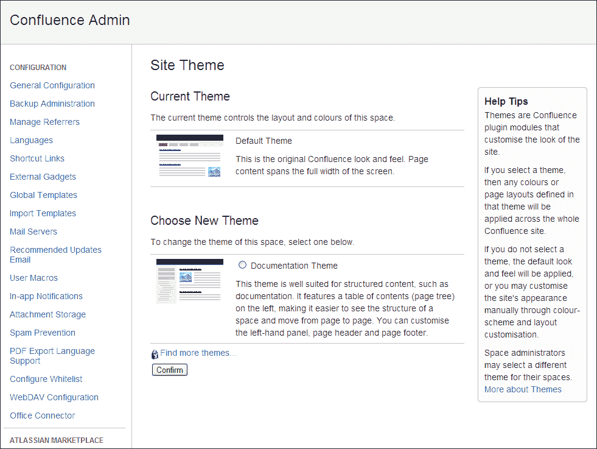
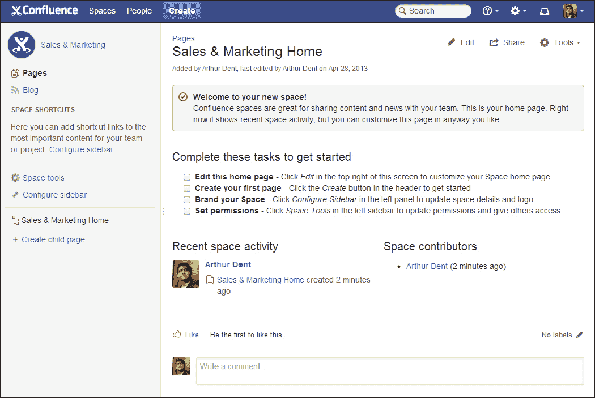
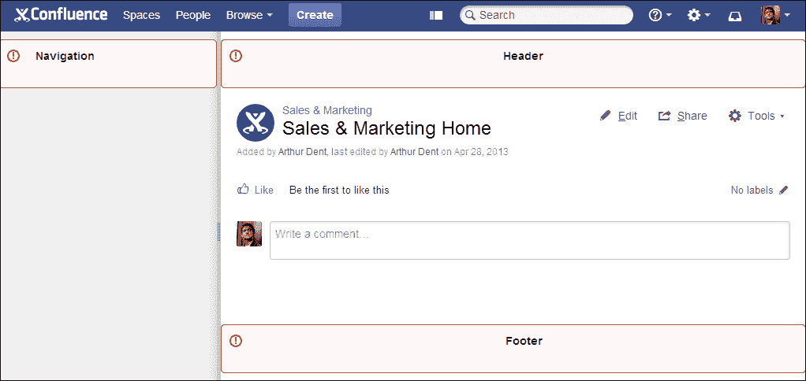
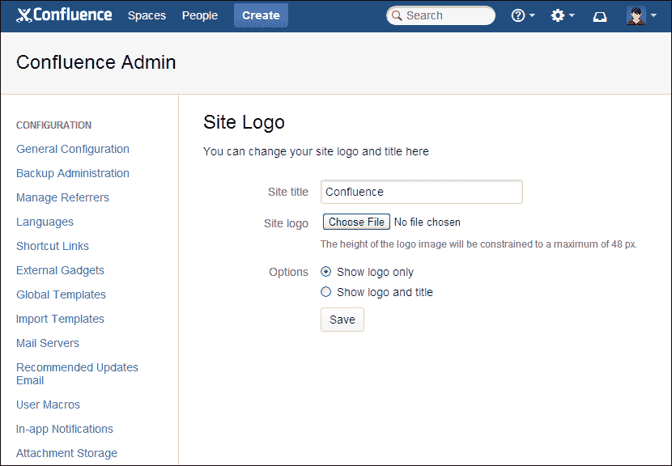
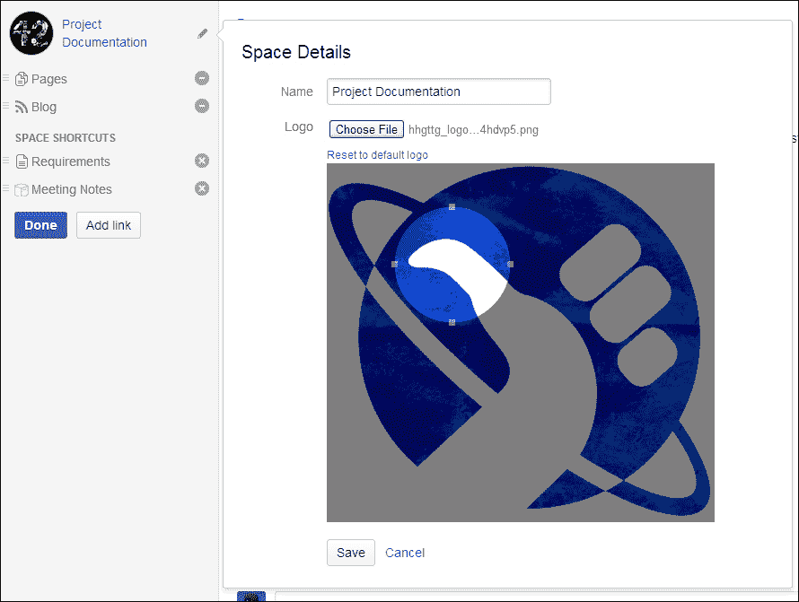
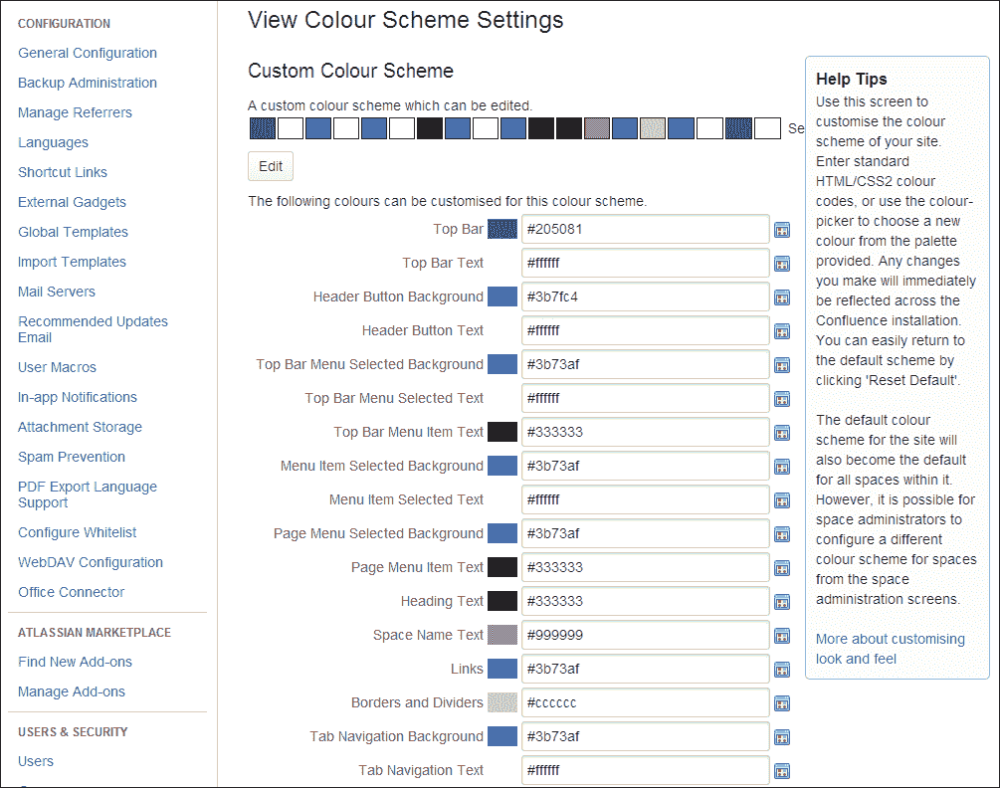
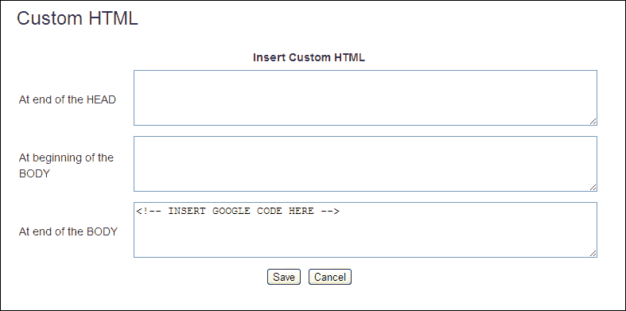
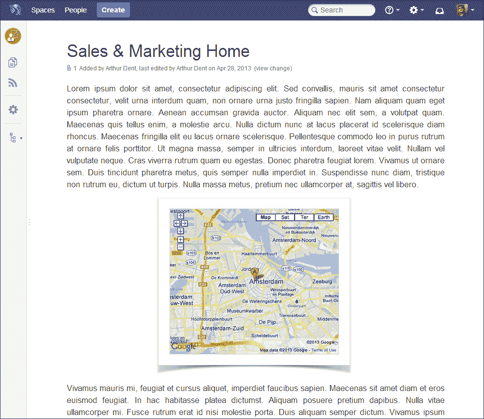

# 第七章 自定义 Confluence

如果你打算将 Confluence 引入公司，使用公司品牌和徽标会有很大帮助。本章将介绍不同的方式来定制 Confluence 的外观和感觉，并修改用户体验的方法。

我们将学习如何相对轻松地根据需求定制 Confluence。即使这些功能不足以满足你的需求，Confluence 还提供了更多高级选项，供你修改布局和样式。

本章内容包括：

+   更改登录页面并修改仪表盘

+   选择实例或空间的主题

+   将公司品牌应用于 Confluence

+   添加自定义 HTML 和样式表

+   更改默认的 Confluence 布局

# Confluence 仪表盘

第一次登录 Confluence 时，你将看到仪表盘。Confluence 仪表盘会快速显示最近更改的内容。从仪表盘，用户可以导航到 Confluence 中的空间或部分。

## Confluence 首页

Confluence 的默认首页是仪表盘，但作为 Confluence 管理员，你可以将其更改为任何你喜欢的空间首页。请记住，空间必须对所有用户可访问，如果你的 Confluence 安装允许匿名访问，空间也应该允许匿名用户查看。

要更改默认首页，请执行以下步骤：

1.  浏览到管理控制台（**管理** | **Confluence 管理**）。

1.  从左侧菜单中选择**常规配置**。

1.  点击左上角的**编辑**链接。

1.  从**站点首页**旁边的下拉菜单中选择一个空间。

1.  点击**保存**以保存更改。

用户还可以更改个人默认首页，这将覆盖全局设置。

要更改个人默认首页，请执行以下步骤：

1.  在右上角选择你的头像。

1.  从下拉菜单中选择**设置**。

1.  点击**编辑**按钮。

1.  从**站点首页**旁边的下拉菜单中选择一个空间。

1.  点击**提交**以保存更改。

## 欢迎消息

欢迎消息出现在 Confluence 仪表盘的左上角，可以用来展示关于 Confluence 的常见介绍或一些重要的公司新闻。

### 提示

**将页面包含为欢迎消息**

要更改欢迎消息的内容，用户必须是 Confluence 管理员。如果你希望其他用户更改欢迎消息，或者只是想使用默认的 Confluence 编辑器，包含一个页面是一个完美的解决方案。我们将在本章后面部分学习如何设置此配置。

执行以下步骤编辑欢迎消息：

1.  浏览到管理控制台（**管理** | **Confluence 管理**）。

1.  从左侧菜单中选择**全局模板**。

1.  点击**默认欢迎消息**右侧的**编辑**链接。

1.  使用编辑器创建你自己的欢迎消息。

1.  点击**保存**以保存更改。

### 注意

请记住，欢迎消息只是 Confluence 仪表板的一小部分。尽量避免使用页面布局和区块，因为它们可能无法正确显示。如果你在欢迎消息中插入图片和其他元素，尽量将宽度保持在 300px 到 400px 之间。

### 恢复默认的欢迎消息

默认欢迎消息如下图所示。它是一个常见的**欢迎使用 Confluence**和**开始使用**的文本。



要恢复默认的欢迎消息，请执行以下步骤：

1.  浏览到管理控制台（**管理** | **Confluence 管理**）。

1.  从左侧菜单中选择**全局模板**。

1.  点击**默认欢迎消息**右侧的**重置为默认值**链接。

### 删除“开始使用”文本

默认情况下，Confluence 仪表板会在站点欢迎消息下显示管理员的快速入门指南。此指南仅对 Confluence 管理员和系统管理员可见。系统管理员可以通过以下方式编辑站点布局来更新或删除此指南：

1.  浏览到管理控制台（**管理** | **Confluence 管理**）。

1.  从左侧菜单中选择**布局**。

1.  选择**创建自定义**或在**全局布局**旁边选择**编辑**。如果全局布局已经自定义，则可以选择**编辑**选项，否则你需要使用**创建自定义**链接。

1.  在代码中找到以下部分，并根据需要删除或编辑：

    ```
    #if($permissionHelper.isConfluenceAdministrator($remoteUser))
      <div class="dashboard-item wiki-content">
        <h2>$i18n.getText("getstarted.heading")</h2>
        <ol id="dashboard-get-started">
          <li class="create-space">
            <h3><a href="$req.contextPath/spaces/createspace-start.action">$i18n.getText("getstarted.add.space")</a></h3>
            <p>$i18n.getText("getstarted.add.space.desc")</p>
          </li>
          <li class="add-users">
            <h3><a href="$req.contextPath/admin/users/browseusers.action">$i18n.getText("getstarted.add.users")</a></h3>
            <p>$i18n.getText("getstarted.add.users.desc")</p>
          </li>
          <li class="user-profile">
            <h3><a href="$req.contextPath/users/editmyprofilepicture.action">$i18n.getText("getstarted.choose.profile.picture")</a></h3>
            <p>$i18n.getText("getstarted.choose.profile.picture.desc")</p>
          </li>
        </ol>
      </div>
    #end
    ```

1.  选择**保存**。

### 注意

升级 Confluence 安装后，可能需要重新应用这些更改。

### 包含来自其他页面的内容

在许多情况下，将另一个页面作为欢迎消息包含进来能为你提供更多的灵活性和控制权，并允许你定期更新内容。使用普通的 Confluence 页面意味着你可以：

+   允许不是 Confluence 管理员的其他人编辑消息

+   监视包含的页面，当欢迎消息发生更改时会收到通知。

确保你要包含的页面对所有用户可见，包括如果你的 Confluence 允许匿名访问的话，还需要对匿名用户可见。

如果用户没有权限查看某个页面，他们将在仪表板上看到以下消息：

**无法渲染 {include} 包含的页面找不到。**

要包含来自其他页面的内容，请执行以下步骤：

1.  按照平常的方式在 Confluence 中创建页面。

    1.  点击顶部导航中的**创建**按钮。

    1.  选择你想要创建页面的空间。

    1.  选择**空白页面**模板。

    1.  给页面起一个标题，比如 `Confluence 仪表板`。

    1.  在页面上输入一些基本内容。

    1.  点击**保存**以保存页面。

1.  根据需要更改页面限制。常用的设置是将该页面的编辑权限限制为某一特定小组。

1.  使用前面的步骤编辑站点的欢迎信息。

    1.  选择**插入** | **其他宏**，然后搜索“Include Page”宏。

    1.  在宏属性面板中，搜索您刚刚创建的页面。

    1.  选择**插入**。

1.  点击**保存**以保存欢迎信息。

在前面的示例中，我们添加了一个通过标签查找内容的“Content by Label”宏。我们还包括了一个带有效果的图片，该图片链接到 Confluence 上的另一页面。

# 主题

主题是一组预定义的样式，可以用来个性化 Confluence 的外观和感觉。主题可以应用于整个站点和单个空间。一些主题为 Confluence 添加了额外的功能，或者显著改变了布局。

Confluence 5 自带两个主题，管理员可以通过管理控制台作为附加组件安装新的主题。我们将在第九章，*一般管理*中详细介绍附加组件和 Atlassian 市场。

### 注意

Atlassian 计划将**文档主题**与**默认主题**合并。由于 Confluence 5 中尚未完成这一变化，我们将分别讨论它们，因为它们有一些不同的功能。请记住，**文档主题**将在某个时刻从 Confluence 中移除。

要更改全局 Confluence 主题，请执行以下步骤：

1.  浏览到管理控制台（**管理** | **Confluence 管理员**）。

1.  从左侧菜单中选择**主题**。

1.  所有已安装的主题将显示出来。

    选择适当的单选按钮以选择一个主题。

1.  选择**确认**以更改主题：

空间管理员还可以为自己的空间选择不同的主题。拥有自己主题选择的空间（因此不使用全局外观和感觉）在 Confluence 管理员更改全局默认主题时不会受到影响。

要更改空间主题，请执行以下步骤：

1.  转到空间中的任何页面。

1.  在侧边栏中选择**空间工具**。（如果您不使用默认主题，请选择**浏览** | **空间管理员**。）

1.  选择**外观和感觉**，然后选择**主题**。

1.  选择您想要应用于空间的主题。

1.  点击**确认**。

## 默认主题

如其名称所示，这是随 Confluence 一起发布的默认主题。这个默认主题在 Confluence 5 中进行了全面的改版，效果如下所示：



默认主题为每个空间提供了一个侧边栏，包含有用的链接和当前空间的导航帮助。通过侧边栏，您可以快速在浏览页面和博客帖子之间切换，反之亦然。侧边栏还允许将重要的空间内容作为链接添加，以便更快速地访问，并显示当前页面的子页面，方便导航。

### 提示

你可以折叠或展开侧边栏。点击并拖动边框，或使用快捷键：*。如果侧边栏已折叠，你仍然可以访问侧边栏选项。

### 配置主题

默认主题没有任何全局配置，但空间管理员可以对主题的侧边栏进行一些空间特定的更改。

![配置主题执行以下步骤以更改空间详细信息：1.  进入相关空间的任何页面。1.  在空间侧边栏中选择 **配置侧边栏**。1.  点击空间标题旁边的编辑图标。1.  会弹出一个窗口，你可以在其中更改空间标题和徽标（如前面截图所示，标记为 **1**）。1.  点击 **保存** 以保存更改。1.  点击 **完成** 按钮退出配置模式。侧边栏上的主导航项（页面和博客文章）可以隐藏。例如，当你不允许用户在空间中添加博客文章时，这个功能非常有用。要显示或隐藏主导航项，执行以下步骤：1.  进入相关空间的任何页面。1.  在空间侧边栏中选择 **配置侧边栏**。1.  选择链接旁的 **-** 或 **+** 图标以隐藏或显示该链接。1.  点击 **完成** 按钮退出配置模式。空间快捷方式是手动添加到侧边栏的链接，指向空间内的重要内容。空间管理员可以管理这些链接。要添加空间快捷方式，执行以下步骤：1.  进入相关空间的任何页面。1.  在空间侧边栏中选择 **配置侧边栏**。1.  点击 **添加链接** 按钮，前面截图中标记为 **3**。1.  **插入链接** 对话框将弹出。1.  搜索并选择你想要链接的页面。1.  点击 **插入** 将链接添加到侧边栏。1.  点击 **完成** 按钮退出配置模式。## 文档主题文档主题是另一个捆绑的主题。它为你的空间提供了内置的目录、可配置的页眉和页脚，并且支持空间限定的搜索。文档主题的默认外观和风格如下截图所示：

文档主题的侧边栏会显示一个树形结构，列出你空间中的所有页面。点击页面标题前的图标将展开该分支并显示其子页面。

### 提示

侧边栏可以通过 ** 快捷键打开和关闭，或者通过 Confluence 页头搜索框左侧的图标来操作。

### 配置主题

文档主题允许配置侧边栏内容、页面标题和页脚，并可以将搜索限制为仅在当前空间内。

Confluence 管理员可以全局配置主题，但空间管理员可以覆盖该配置来为其空间定制主题。要为空间配置文档主题，空间管理员应明确选择 **文档主题** 作为空间主题。

文档主题的主题配置允许你更改以下截图中显示的属性。如何到达这个页面以及这些属性的含义将在接下来的内容中解释。

![配置主题要配置文档主题，请执行以下步骤：1.  作为 Confluence 管理员：    1.  进入管理控制台（**管理** | **Confluence 管理**）。    1.  选择左侧菜单中的 **主题**。    1.  选择 **文档主题** 作为当前主题。    1.  点击 **配置主题** 链接。1.  作为空间管理员：    1.  进入空间中的任何页面。    1.  选择 **浏览** | **空间管理员**。    1.  选择左侧菜单中的 **主题**。    1.  确保 **文档主题** 是当前主题。    1.  点击 **配置主题** 链接。1.  选择或取消选择 **页面树** 复选框。这将决定你的空间是否会在侧边栏中显示默认的搜索框和页面树。1.  选择或取消选择 **限制搜索** **结果仅限于当前空间** 复选框。    +   如果你选择复选框：        左上角的 Confluence 搜索框只会在当前空间内进行搜索。        侧边栏将不包含搜索框。    +   如果你取消选择复选框：        左上角的 Confluence 搜索框将在整个 Confluence 网站中进行搜索。        侧边栏将包含一个搜索框，限制仅在当前空间中进行搜索。1.  在三个文本框中，你可以输入任何文本或 wiki 标记，例如，你可以在侧边栏中添加一些信息，或者向每个页面添加通知。以下截图将显示这些区域：    +   **导航**：这将在空间侧边栏中显示。    +   **页头**：这将在空间中所有页面的标题上方显示。    +   **页脚**：这将在空间中所有页面的评论之后显示。    

# 外观与感受

Confluence 的外观和感受可以在全局级别和空间级别进行自定义。对全局级别所做的任何更改将作为所有空间的默认设置应用。

空间管理员可以选择使用与全局外观不同的主题。当空间管理员选择不同的主题时，默认设置和主题不再应用于该空间。这也意味着，如果全局设置更新，空间中的设置将不会更新。

在本节中，我们将介绍一些基本的外观和感受的更改，例如更改 Confluence 实例的标志和配色方案。也可以更改一些 Confluence 布局；这将在 *高级自定义* 部分进行说明。

## Confluence 标志

Confluence 标志是显示在 Confluence 导航栏上的标志。你可以轻松将其更改为公司标志。

要更改全局标志，请执行以下步骤：

1.  进入管理控制台（**管理** | **Confluence 管理**）。

1.  从左侧菜单中选择**站点徽标**。

1.  点击**选择文件**以从您的计算机中选择文件。

1.  决定是仅显示您的公司徽标，还是同时显示您的 Confluence 安装的标题。

    +   如果您选择同时显示标题，您可以在**站点标题**旁边的文本字段中更改此项。

1.  点击**保存**。

### 注意

正如您所注意到的，Confluence 还更改了您的安装配色方案。Confluence 将根据您的徽标建议配色方案。要恢复此更改，请点击**撤销**，该按钮会在您更新徽标后直接显示。

## 空间徽标

每个空间可以选择自己的徽标，使其更容易识别特定的主题或空间。Confluence 管理员也可以为新创建的空间或没有指定徽标的空间设置默认空间徽标。

### 注意

个人空间的徽标无法更改；它将始终使用用户的头像作为徽标。

要设置默认空间徽标，请执行以下步骤：

1.  浏览到管理控制台（**管理** | **Confluence 管理员**）。

1.  从左侧菜单中选择**默认空间徽标**。

1.  点击**选择文件**以从您的计算机中选择文件。为获得最佳效果，请确保图像约为 48 x 48 像素。

1.  点击**上传徽标**以上传默认空间徽标。

作为空间管理员，您可以替换空间的默认徽标。具体操作取决于您使用的主题。

要更改带有默认主题的空间徽标，请执行以下步骤：

1.  进入相关空间的任意页面。

1.  点击侧边栏中的**配置侧边栏**。

1.  选择页面标题旁边的编辑图标。

1.  点击徽标旁边的**选择文件**，并从您的计算机中选择文件。Confluence 将显示一个图像编辑器，指示徽标应如何显示，如下截图所示。

1.  在编辑器中拖动并调整圆圈到正确的位置。

1.  点击**保存**以保存更改。

1.  点击**完成**按钮退出配置模式。

要更改带有文档主题的空间徽标，请执行以下步骤：

1.  进入相关空间的任意页面。

1.  选择**浏览** | **空间管理员**。

1.  从左侧菜单中选择**更改空间徽标**。

1.  选择**选择文件**并从您的计算机中选择徽标。

1.  点击**上传徽标**以保存新徽标；Confluence 将自动为您调整徽标的大小和裁剪。

## 配色方案

Confluence 和空间管理员可以为 Confluence 及单个空间配置新的配色方案。由 Confluence 管理员配置的全局配色方案也将作为默认空间配色方案。空间管理员可以为他们的空间配置不同的颜色。更改配色方案同样适用于个人空间。

要更改全局配色方案，请执行以下步骤：

1.  浏览到管理控制台（**管理** | **Confluence 管理员**）。

1.  从左侧菜单中选择 **配色方案**。

1.  点击 **编辑**，然后将显示下一个截图中的界面。

1.  使用标准 HTML/CSS 颜色代码或文本字段旁边的颜色选择器。

1.  点击 **保存** 以应用更改到 Confluence。

要更改空间的配色方案，请执行以下步骤：

1.  访问该空间中的任何页面。

1.  在侧边栏中选择 **空间工具**。 (如果你没有使用默认主题，请选择 **浏览** | **空间管理员**。)

1.  选择 **外观和感觉**，然后选择 **配色方案**。

1.  选择下面的配色方案 **自定义配色方案**。

1.  点击 **编辑** 链接。

1.  使用标准 HTML/CSS 颜色代码或文本字段旁边的颜色选择器。

1.  点击 **保存** 以应用更改到该空间。

如果你不喜欢所选的配色方案，可以在编辑界面中使用 **重置** 按钮恢复到 Confluence 的默认设置。

# 高级自定义

仅使用主题和配色方案来更改 Confluence 的外观和感觉通常是不够的。如果你想进一步更改 Confluence 的外观，或者希望在布局中添加一些额外的功能，那么这些更高级的话题可能会引起你的兴趣。

## 默认空间内容

每当你创建一个新空间时，该空间的首页总是具有相同的内容。作为 Confluence 管理员，你可以更改此默认空间内容，添加你喜欢的任何其他内容。

要更改全局空间的默认内容，请执行以下步骤：

1.  浏览到管理控制台（**管理** | **Confluence 管理员**）。

1.  从左侧菜单中选择 **全局模板**。

1.  在 **系统模板** 部分，点击 **默认空间内容** 文本下方的 **编辑** 链接。

1.  创建你希望出现在新空间主页上的内容。你也可以在内容中使用变量。

    +   `$spacekey`：此字段将被新空间的空间密钥替代。

    +   `$spacename`：此字段将被新空间的名称替代。

1.  点击 `保存` 以保存新的默认内容。

要更改个人空间的默认内容，请执行以下步骤：

1.  浏览到管理控制台（**管理** | **Confluence 管理员**）。

1.  从左侧菜单中选择 **全局模板**。

1.  在 **系统模板** 部分，点击 **默认个人空间内容** 文本下方的 **编辑** 链接。

1.  创建你希望出现在新空间主页上的内容。你也可以在内容中使用变量。

    +   `$userFullName`：此字段将被空间所有者的全名替代。

    +   `$userEmail`：此字段将被空间所有者的电子邮件地址替代。

    +   `$userPersonalInfo`：此字段将被空间所有者的 **关于我** 文本替代，该文本是在用户个人资料中输入的。

1.  点击 **保存** 以保存新的默认内容。

## 自定义 HTML

Confluence 允许您在每个 Confluence 页面中添加一些自定义 HTML。一个非常常见的用例是向 Confluence 添加 Google Analytics 跟踪代码。

如下截图所示，有三个地方可以插入 HTML：

+   **在 HEAD 结束处**

+   **在 BODY 开始处**

+   **在 BODY 结束处**

在向 Confluence 页面添加任何自定义 HTML 之前，请确保它是有效的。添加不完整或损坏的 HTML 可能会导致无法再使用 Confluence。



要插入自定义 HTML，请执行以下步骤：

1.  浏览到管理控制台（**管理** | **Confluence 管理**）。

1.  从左侧菜单中选择**自定义 HTML**。

1.  点击**编辑**按钮。

1.  将 HTML 插入到相应的文本区域，如前面的截图所示。

1.  点击**保存**。

## 自定义样式表

Confluence 使我们能够向 Confluence 添加自定义 CSS 文件，并可能改变整体的外观和感觉。为了应用 CSS，您需要具备使用和编写 CSS 的足够知识。网络上有许多入门教程，例如在 W3Schools 上可以找到（[`www.w3schools.com/css/default.asp`](http://www.w3schools.com/css/default.asp)）。

自定义 CSS 可以在全局和空间级别添加，尽管默认情况下禁用了空间级别的自定义 CSS，应该由 Confluence 管理员启用。具有自定义 CSS 的空间将忽略全局自定义 CSS。

### 注意

请记住，Confluence 的 HTML 可能会在版本间发生变化，您的 CSS 可能会停止工作。Atlassian 不支持自定义 CSS 或与之相关的任何问题。因此，在迁移到新版本的 Confluence 时，请始终检查您的自定义 CSS，并根据需要调整。

要启用空间的自定义样式表，请执行以下步骤：

1.  浏览到管理控制台（**管理** | **Confluence 管理**）。

1.  从左侧菜单中选择**安全配置**。

1.  点击**编辑**。

1.  启用**空间的自定义样式表**前面的复选框。

1.  点击**保存**以保存更改。

要向 Confluence 添加自定义样式表，请执行以下步骤：

1.  浏览到管理控制台（**管理** | **Confluence 管理**）。

1.  从左侧菜单中选择**样式表**。

1.  点击**编辑**。

1.  添加你的 CSS。

    为了展示更改样式表的强大功能，请输入下一个示例。

1.  点击**保存**以保存更改。

使用以下示例了解使用自定义样式表可以实现的功能：

```
body:not(.dashboard) #main { padding: 40px 80px 0px; font-size:120%; }
#title-heading { font-size: 200%; }

#breadcrumbs { display:none; }

.content-navigation {width: 300px; height: 30px; }
.content-navigation ul { display:none; }
.content-navigation:hover ul { display:block; }
```

第一个代码块将改变主元素的内边距，以便内容的左右两侧有更多的空白。它还会将文本大小调整为原始大小的 120%，并将页面标题调整为原始大小的 200%。

第二条语句将移除页面标题上方的面包屑导航。

样式表的最后一部分将隐藏页面工具（**编辑**、**分享**、和**工具**），除非有人将鼠标悬停在该位置。

这是安装此自定义样式表后你的页面的外观：



如前面的示例所示，改变 CSS 是一种强大的方式来更改 Confluence 的外观。但它确实需要一些基本的 CSS 和 HTML 技能。

网上有一个教程可以帮助你入门修改 CSS：[`confluence.atlassian.com/display/DOC/Basic+Styling+Tutorial`](https://confluence.atlassian.com/display/DOC/Basic+Styling+Tutorial)。

## 网站布局

Confluence 建立在开源库 SiteMesh 上，这是一个网页布局系统。为了进一步改变 Confluence 的外观和感觉，你可以修改这些装饰器文件。如果你想修改装饰器文件，你应该熟悉 Velocity。用户指南可以在线查看：[`velocity.apache.org/engine/releases/velocity-1.4/user-guide.html`](http://velocity.apache.org/engine/releases/velocity-1.4/user-guide.html)。

Confluence 中的装饰器文件按以下部分进行分组：

+   **网站布局**：这些布局用于定义内容周围的布局，例如页眉和页脚。

+   **内容布局**：这些布局控制内容的外观，例如页面和博客文章。它们不会改变页面本身的显示方式，但允许你改变周围评论或附件的显示方式。

+   **导出布局**：这些布局控制将空间和页面导出为 HTML 时的外观。例如，如果你使用 Confluence 生成静态网站，你需要修改这些布局。

要编辑装饰器文件，请执行以下步骤：

1.  浏览到管理控制台（**管理** | **Confluence 管理**）。

1.  从左侧菜单中选择**布局**。

1.  点击**创建自定义**以编辑默认文件。

1.  进行任何更改。

1.  点击**保存**以保存页面。

使用**查看默认值**来查看默认装饰器文件。如果出现问题，你可以使用**重置默认值**返回原始布局。

在编辑装饰器文件时，有几个 Velocity 宏可以用来在布局中插入如面包屑或菜单等项。以下是一些宏；更多宏可以在网上找到：[`confluence.atlassian.com/display/DOC/Working+With+Decorator+Macros`](https://confluence.atlassian.com/display/DOC/Working+With+Decorator+Macros)。

| 宏 | 用法 |
| --- | --- |
| `#includePage (pageTitle)` | 包含具有指定标题的 Confluence 页面。如果 Confluence 中有两个或更多页面具有相同标题，该宏将使用当前查看空间中的页面。 |
| `#searchbox ()` | 插入一个类似于右上角默认搜索框的搜索框。 |
| `#dashboardlink ()` | 插入指向仪表盘页面的链接。 |

这些宏只有在你编辑主装饰器时才会可靠地工作。它们可能在其他装饰器中无法使用；它们在普通的 Confluence 编辑器中肯定无法使用。

### 注意

如果你已经改变了布局，以至于某些功能不再可见，你可以通过直接访问以下 URL 来重置布局。请替换基础 URL 和相应的 `.vmd` 文件。

`http://<confluence_url>/admin/resetdecorator.action?decoratorName=decorators/main.vmd`

# 摘要

在本章中，我们从一些基本方法开始，逐步介绍了如何更改 Confluence 安装的外观，最终达到一种高级的、彻底改变外观的方法。将公司品牌添加到 Confluence 可以通过上传公司徽标并更改配色方案来实现。

你还可以更改用户登录时看到的页面；这可以是 Confluence 的仪表板，或者是包含公司新闻和其他重要信息的空间主页。用户也可以指定他们自己的偏好设置。

我们还了解到，Confluence 提供了一些内置主题，具有不同的外观、感觉和功能。如果这些主题无法完全满足你所期望的用户体验，一个选择是自己更改样式表和装饰器。

在下一章，我们将查看一些更高级的选项，比如创建和使用模板，以使你的文档更具结构性，并帮助用户快速入门。
