# 第八章：高级 Confluence

到目前为止，我们一直在使用 Confluence 的默认功能，利用所有与安装包捆绑在一起的特性、模板和宏。Confluence 还提供了添加自己特性、模板和宏的功能。这样，你可以根据公司的需求定制你的 Confluence 安装。

本章中，我们将学习 Confluence 中的一些高级功能，例如如何创建和应用模板，使你的内容更具结构性。我们还将看看如何创建自己的宏，以便在创建内容时使用。

到本章结束时，你将学到：

+   创建和管理内容模板

+   编写用户宏

+   使用页面属性宏

+   创建快捷链接

# 模板

到目前为止，我们已经添加了很多页面，每次都从头开始；但其实我们不必这样做。当你发现自己不断重复创建相同的页面结构，或者你希望用户出于一致性的原因使用相同的结构时，模板就是答案。

模板是预定义的页面，可以在创建页面时用作框架。只有新页面可以从模板中创建，并且当使用模板时，新的页面将包含与模板相同的内容。模板非常有用，当你希望页面具有统一的风格或格式时。

## 使用模板

当有可用模板时，你可以开始使用它们来创建新页面。当你基于模板创建页面时，Confluence 会将以下内容和信息复制到新页面：

+   标签

+   文本和样式

+   布局和其他格式

+   宏

+   显示的媒体，如图像或视频

新创建的页面与原始模板没有任何关联；对模板所做的更改不会反映在已创建的页面上。无法将模板应用到现有页面；模板只能在创建新页面时使用。新创建的页面可以像空白页面一样进行编辑；可以添加、更新和删除内容。

要基于模板创建页面，请执行以下步骤：

1.  点击标题中的**创建**。

1.  选择一个空间来创建新页面。

1.  从可用模板中选择一个模板。

1.  如果模板包含变量，你将看到一个表单。在字段中输入相关信息，然后点击**下一步**。

1.  你将看到一个基于模板的新页面。

1.  为页面命名，并添加、更新或删除内容。

1.  点击**保存**。

以下截图展示了可以用来创建新页面的可用模板：

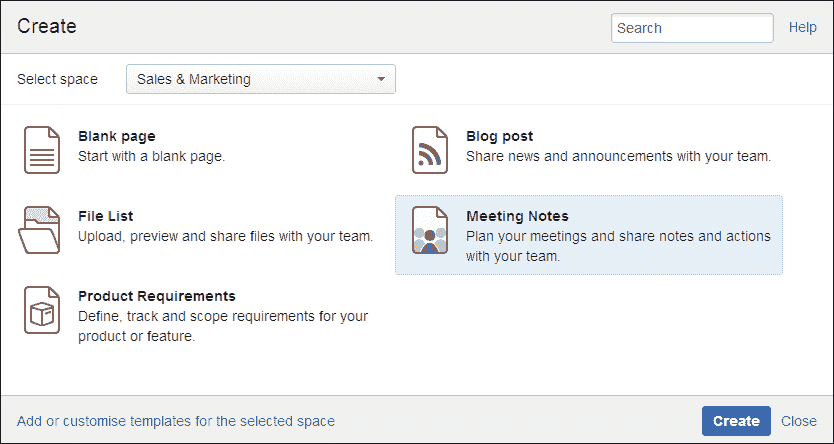

## 创建模板

在 Confluence 中，模板可以在 Confluence 层级的两个级别上创建：

+   **空间模板**：这些模板只在你创建它们的空间中可用。空间管理员可以通过空间管理界面定义空间模板。

+   **全局模板**：这些模板在 Confluence 中的每个空间都可以使用。Confluence 管理员可以通过管理控制台定义全局模板。

### 空间模板

空间模板可以由空间管理员创建，并且只在您创建它们的空间中可用。

要为某个空间添加模板，请执行以下步骤：

1.  转到空间中的任何页面。

1.  从侧边栏点击**空间工具**。

1.  从空间管理员菜单中选择**内容工具**，然后选择**模板**。

1.  点击**创建新模板**按钮。

如果您的空间使用文档主题：

1.  选择**浏览** | **空间管理员**。

1.  从左侧导航中点击**模板**。

1.  点击**创建新模板**按钮。

您将被重定向到**创建模板**页面。在*将内容添加到模板*部分中说明了如何添加内容并创建您的模板。

### 全局模板

全局模板可以由 Confluence 管理员创建，并且在 Confluence 中的所有空间中都可以使用。

要添加全局模板，请执行以下步骤：

1.  浏览至管理控制台（**管理** | **Confluence 管理员**）。

1.  在左侧菜单中选择**全局模板**。

1.  点击**添加新全局模板**按钮。

您将被重定向到**创建模板**页面。在*将内容添加到模板*部分中说明了如何添加内容并创建您的模板。

### 将内容添加到您的模板

**创建模板**视图与 Confluence 中的常规编辑器非常相似：

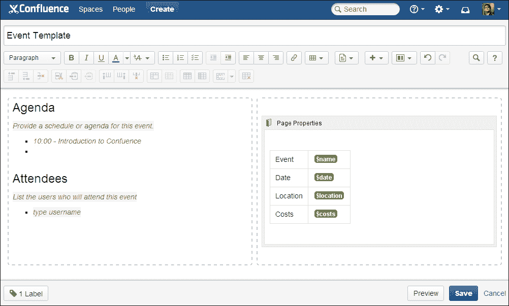

通常情况下，页面标题将是模板名称。模板名称将在您创建新页面时显示，因此请选择一个具有描述性的名称作为模板名称。

模板的内容就像普通页面一样；您可以使用样式、布局和其他格式化功能。您还可以添加链接和宏。除了常规功能外，模板编辑器还允许您添加变量和说明性文本。使用变量将使模板在有人基于它创建页面时生成一个数据收集表单。

创建模板时需要考虑的几个要点：

+   **标签**：从左下角选择**标签**以向模板添加标签。这些标签将包含在所有使用此模板创建的页面中。

+   **图片和其他附件**：无法将任何文件或图片添加到模板中。如果您想在模板中使用图片或附件，需要将该文件附加到 Confluence 中的其他页面。

    然后按照以下步骤插入图片：

    1.  选择**插入** | **图片**。

    1.  使用媒体浏览器查找您的图片。

    1.  点击**插入**以插入您的图片。

+   **说明性文本**：说明性文本允许您向模板中添加占位符内容。此占位符仅在编辑器中可见，并且当页面的作者开始在该占位符中输入内容时，它将消失。

    这些文本可以为用户提供如何使用模板以及在特定位置期望输入哪些数据的说明。

    要插入说明文本，请执行以下步骤：

    1.  将光标放置在模板中你希望显示说明文本的位置。

    1.  点击编辑器工具栏中的**模板**。

    1.  选择**说明文本**。

    1.  开始输入；说明文本将以斜体显示，并带有阴影背景，以便与普通段落文本区分开来。

    占位符的类型可以从“文本”更改为“用户提及”，当作者开始输入时，会启动用户提及的自动完成。要更改占位符类型，请点击占位符并选择**用户提及**。

+   **变量**：通过使用变量，你可以将数据输入引入模板，确保不仅布局井然有序，内容也得到了组织。添加到模板中的变量充当表单字段。当有人基于你的模板创建页面时，Confluence 会为每个变量显示一个输入框，如下所示：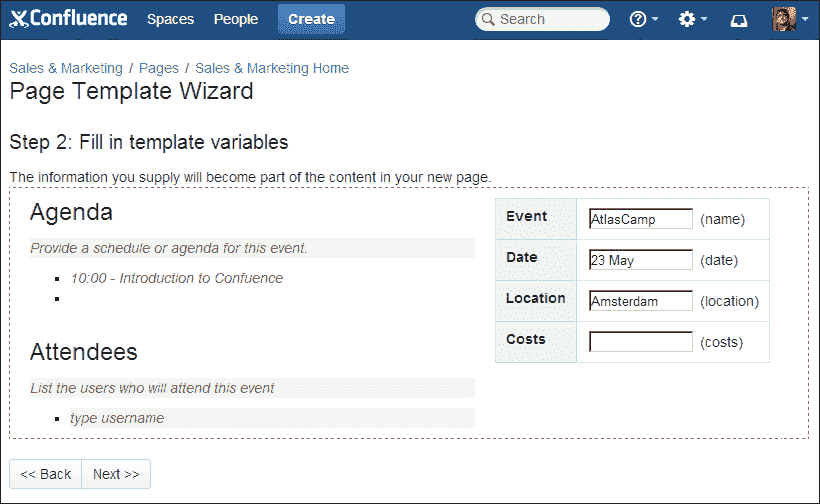

    每个变量必须有一个唯一的名称。如果你在同一个模板中多次添加相同的变量，Confluence 会为这两个占位符提供相同的值。当你需要在多个位置使用相同的信息时，这非常有用。

    要将变量插入模板，请执行以下步骤：

    1.  将光标放置在你想插入变量的位置

    1.  从编辑器工具栏中选择**模板**。

    1.  选择一个现有变量或点击**新建变量**。

    1.  输入变量名称。

    1.  按下*Enter*键。这将创建一个单行文本输入字段。

    1.  要更改变量类型，请点击占位符。属性面板将出现，您可以在其中选择不同的类型。有关这些类型的描述，请参见下表。

使用键盘快捷键*$*（*Shift* + *4*）来加速变量输入并启用自动完成。

这些是可用的变量类型：

| 变量类型 | 描述 |
| --- | --- |
| 文本 | 创建一个单行文本输入字段，如下所示： |
| 多行文本 | 创建一个允许输入多行文本的文本框。默认情况下，该文本框有**5**行，宽度为**100**个字符。你可以在属性面板中更改其大小：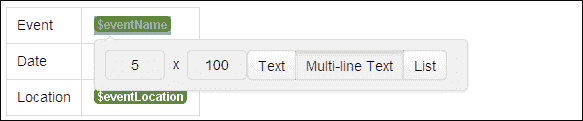 |

| 列表 | 创建一个下拉列表。你必须为下拉列表指定值。这些值：

+   必须用逗号分隔

+   可以包含任何字母、数字、空格以及其他特殊字符，除了逗号，因为逗号用作分隔符。

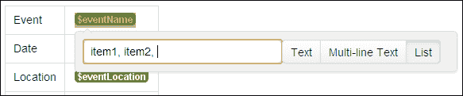 |

## 导入模板

除了创建自己的模板外，您还可以从 Atlassian Marketplace 下载预定义的模板，这些模板以模板包或蓝图的形式提供。每个包包含一个或多个模板，这些模板由 Atlassian 或其他方创建。

其中一个模板包的示例如下：

[`marketplace.atlassian.com/20489`](https://marketplace.atlassian.com/20489)

下载和安装附加组件，如模板包的详细信息，请参阅第九章，*通用管理*。

### 检查已安装的模板包

要检查哪些模板包可用并可以导入，请执行以下步骤：

1.  浏览到管理控制台（**管理** | **Confluence 管理**）。

1.  从左侧菜单中选择**导入模板**。

1.  您将看到已安装的模板包列表，以及每个包中包含的所有模板：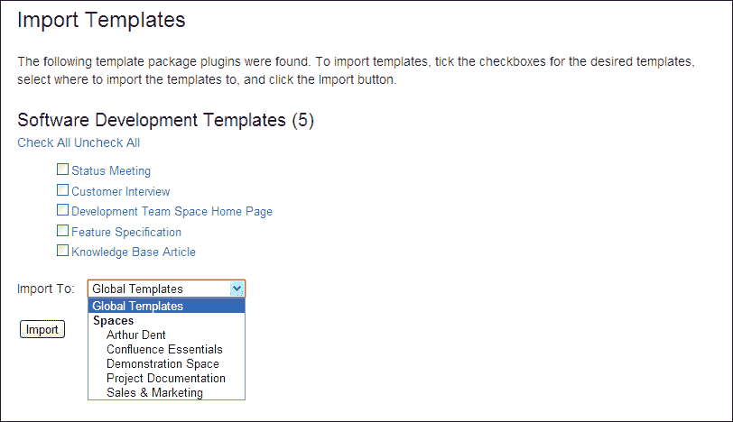

    显示可供导入的模板包

### 使模板可供使用

如果您已安装一个或多个模板包，可以导入它们以便为您的用户提供这些模板。

要导入模板，请执行以下步骤：

1.  浏览到管理控制台（**管理** | **Confluence 管理**）。

1.  从左侧菜单中选择**导入模板**。

1.  您将看到已安装的模板包列表，以及每个包中包含的所有模板。如果您点击模板名称，将显示预览。

1.  通过勾选模板名称旁边的框来选择要导入的模板。

1.  在**导入到：**下拉菜单中选择模板的目标位置。如果您希望将模板导入到特定空间，请选择该空间；否则，选择**全局模板**以使模板对所有空间可用。

# 用户宏

在本书中，我们已经学习了什么是宏，以及如何使用宏使我们的内容更加生动和吸引人。到目前为止，我们使用的大多数宏要么是与 Confluence 一起捆绑的，要么是我们安装的附加组件的一部分。但还有另一种添加宏的方式：通过用户宏。

用户宏是简短的代码片段，可以简化常用功能的执行或为页面添加自定义格式。例如，这可以是一个预配置的面板宏，其样式不同于默认样式。我们将在本章稍后自己创建这个示例。

系统管理员可以通过 Confluence 管理控制台添加用户宏。

## 管理用户宏

要管理用户宏，您需要具有系统管理员权限。请谨慎从未知来源安装用户宏；宏可能会影响您 Confluence 安装的稳定性和安全性。

添加用户宏的步骤如下：

1.  浏览到管理控制台（**管理** | **Confluence 管理**）。

1.  从左侧菜单中选择**用户宏**。

1.  单击宏列表底部的**创建用户宏**。

1.  输入宏详细信息，如*编写用户宏*部分所解释。

1.  单击**保存**。

执行以下步骤以编辑用户宏：

1.  浏览到管理控制台（**管理** | **Confluence 管理**）。

1.  从左侧菜单中选择**用户宏**。

1.  单击相关宏旁边的**编辑**。

1.  更改宏详细信息，如*编写用户宏*部分所解释。

1.  单击**保存**。

执行以下步骤以删除用户宏：

1.  浏览到管理控制台（**管理** | **Confluence 管理**）。

1.  从左侧菜单中选择**用户宏**。

1.  单击相关宏旁边的**删除**。

如果您删除了正在 Confluence 页面上使用的用户宏，您需要手动从页面中删除该宏。

### 提示

您可以使用 Confluence 搜索来查找正在使用用户宏的页面。有关搜索宏的更多信息，请参阅第四章中的*搜索标签*部分，*管理内容*。

## 编写用户宏

编写用户宏是在管理控制台通过表单完成的。我们将通过输入字段帮助您创建第一个用户宏：

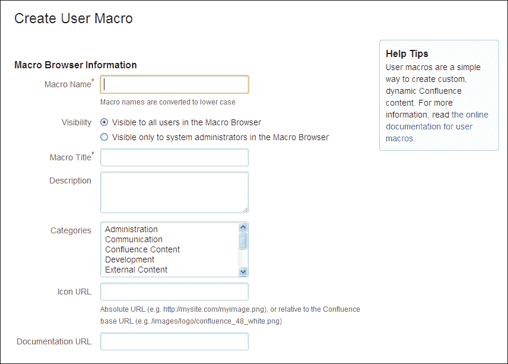

创建新用户宏的输入表单

+   **宏名称**：这是宏的名称，且只能包含字母、数字和连字符（-）；例如：teaser-panel。

+   **可见性**：在这里，您可以设置宏浏览器中的可见性；可以是所有用户或仅系统管理员。将宏对所有用户隐藏仍然允许他们使用该宏，但可以避免宏浏览器和自动完成功能的杂乱。

    选择**仅对系统管理员在宏浏览器中可见**意味着：

    +   仅系统管理员将在宏浏览器或自动完成中看到此宏。对于其他用户，即使在搜索宏时，此宏也不会显示。

    +   宏输出将对所有有权限查看页面的用户可见。

    +   任何具有编辑权限的用户都可以看到页面上已有的宏。您的用户还可以编辑或删除该宏。

+   **宏标题**：宏标题是将出现在宏浏览器和自动完成中的名称。选择一个描述性的标题，以便用户更容易找到该宏。

+   **描述**：描述文本会显示在宏浏览器中的宏旁边。宏浏览器中的搜索也会使用描述文本进行搜索。

+   **类别**：选择一个或多个类别，将您的用户宏放入其中。这些类别与用户在宏浏览器中看到的类别相关。要选择多个类别，请在选择时按住*Ctrl*键。

+   **图标 URL**：如果您提供一个 URL，宏浏览器可以显示您的宏的图标。这可以是绝对 URL，也可以是相对于 Confluence 基本 URL 的路径；例如：`http://example.com/images/no-print-icon.png` 或 `/images/icons/macrobrowser/no-print-icon.png`。

+   **文档 URL**：如果您有在线文档，请在此处输入文档的 URL。链接将显示在宏属性对话框中。在某些情况下，为用户宏编写一个 Confluence 页面文档非常有用。

+   **宏主体处理**：您可以指定您的宏可以具有主体，允许用户在您的宏中输入内容。一个具有主体的宏的示例是面板宏。

    如果您的宏有主体，则该主体将在宏模板中通过 `$body` 变量可用。主体的内容取决于处理方式。

    | 处理选项 | 描述 |
    | --- | --- |
    | **无宏主体** | 如果您的宏不需要主体，请选择此选项。 |
    | **已转义** | 如果您的宏有主体，并且在模板中使用了主体，则 Confluence 将转义主体中的任何 HTML。因此，如果主体是：`<b>Example HTML</b>`那么 `$body` 的值是：`&lt;b&gt;ExampleHTML&lt;/b&gt;`这将呈现为：`<b>Example HTML</b>` |
    | **未渲染** | 如果您希望`$body`变量与用户输入的完全一致，请使用此选项。您应在模板中处理主体以确保模板输出 HTML。 |
    | **已渲染** | 主体将被渲染，因此大多数 HTML 将未经修改地传递到模板；但 Confluence 特定的标记，如宏定义，将被处理和渲染。因此，如果主体是：`<b>Example HTML</b>`那么 `$body` 的值是 `<b>Example HTML</b>`这将呈现为：**Example HTML** |

+   **模板**：这是魔术发生的地方：宏模板。在这里，您应该编写指定宏功能的代码。我们很快将详细介绍如何编写用户宏模板，但以下是一个快速指南：

    +   在您的宏模板中使用 HTML 和 Confluence 特定的 XML 元素。使用存储格式工具查找特定的 XML。

    +   可以在模板中使用 Apache Velocity。

    +   如果您的宏有主体，则该内容可通过 `$body` 变量获得。

    +   每个宏的参数应具有匹配的元数据定义。使用`@param`来定义该元数据。

    +   如果您的宏不访问任何参数，请使用`@noparams`。

    ### 注意

    Apache Velocity 是一个模板引擎，提供一个模板语言来引用在 Confluence 后端定义的对象。Velocity 是 Confluence 的主要模板引擎，几乎用于显示每一页。您可以在您的宏中使用 Velocity 来添加一些逻辑（if-else）或从后端获取信息，例如当前页面标题和其他页面属性。

## 编写用户宏模板

用户宏模板是指定宏功能的一段代码。它是由 HTML、XML 和 Velocity 代码组合编写的。我们将一起构建一个用户宏，帮助您了解可用的功能。

我假设您已经根据前面的段落填写了宏的其他文本字段。确保**宏主体处理**选项设置为**已渲染**。

### 描述性标题

在每个模板的顶部添加描述性标题是一种良好的实践。标题告诉用户宏的功能以及它期望的参数类型。

我们的标题大致如下：

```
## Macro title: Teaser Panel
## Macro has a body: Y
## Body processing: Rendered
## 
## Developed by: Stefan Kohler
## Date created: 04/02/2013

## The Teaser panel is a predefined panel used as teaser
```

### 参数

在用户宏中使用参数是可能的，这样用户就可以传递额外的信息供您渲染。如果您定义了参数，Confluence 会在**宏属性**对话框和浏览器中显示相应的字段。

模板中的参数定义包括三个部分：

+   `@param` – 用于告诉 Confluence 我们正在定义一个参数

+   名称 – 用于访问模板中参数的值

+   额外属性 – 用于进一步描述您的参数

参数通常定义在模板的顶部，在标题下方。指定参数的顺序也决定了它们在宏浏览器中的参数部分（右侧）中显示的顺序。

```
## @paramTitle:title=Title|type=string|desc=What is the title for the Teaser
```

正如您可能已经注意到的，您可以使用相当多的额外属性来描述您的参数。您指定的越多，Confluence 在宏浏览器和属性编辑器中提供的帮助就越好。我们来了解一下可用的属性：

| 属性名称 | 描述 | 是否必需？ |
| --- | --- | --- |

| [未命名的第一个属性] | 参数名是第一个属性，不需要名称。

```
## @param example
```

将定义参数 `example`。 | 必需 |

| `title` | 将出现在宏浏览器中的参数标题。如果未指定标题，则使用参数名称。 | 推荐 |
| --- | --- | --- |
| `type` | 参数的字段类型。有关类型的详细信息，请参见接下来的页面。 | 推荐 |
| `desc` | 显示在宏浏览器中的参数描述。 | 可选 |
| required | 指定参数是否是必需的；默认为**false**。 | 可选 |
| multiple | 指定参数是否允许多个值；默认为**false**。 | 可选 |
| default | 参数的默认值。 | 可选 |

如果您没有指定参数的类型，它将默认设置为字符串。但还有许多其他类型供您选择。Confluence 将根据您指定的类型渲染参数的输入字段。

| 类型 | 描述 |
| --- | --- |

| `boolean` | 向用户显示一个复选框，并将值**true**或**false**作为字符串传递给宏。

```
## @param hide:title=Should hide?&#124;type=boolean
```

|

| `enum` | 提供可供选择的值列表。您可以自己指定要出现在下拉列表中的值。该变量将按原样传递给宏，包括大小写。

```
## @param color:title=Color&#124;type=enum&#124;enumValues=Grey,Red,Green
```

|

| `string` | 显示一个文本字段；如果没有指定其他类型，这是默认类型。

```
## @param title:title=Title&#124;type=string
```

|

| `confluence-content` | 显示一个快速搜索框，用户可以在 Confluence 中搜索页面或博客文章。

```
## @param page:title=Page&#124;type=confluence-content&#124;required=true
```

|

| `username` | 显示一个快速用户搜索框。

```
## @param user:title=Username&#124;type=username
```

|

| `spacekey` | 显示可供选择的空间列表；空间键将传递给宏。

```
## @param space:title=Space&#124;type=spacekey
```

|

| `date` | 当前被视为普通字符串。用户可以输入任何格式的日期；请确保在模板中检查日期。

```
## @paramfromDate:title=From Date&#124;type=date
```

|

| `int` | 类型被接受，但目前作为普通字符串处理。

```
## @param numItems:title=Number of items&#124;type=int
```

|

| `percentage` | 类型被接受，但目前作为普通字符串处理。

```
## @param pcent:title=Percentage&#124;type=percentage
```

|

参数在模板中可用，例如，`$paramtitle` 和 `$paramcolor` 分别表示名为 title 和 color 的参数。

通常，如果像 `$paramtitle` 这样的参数缺失，它将在输出中显示为 `$paramtitle`。如果参数未设置并且希望不输出任何内容，请在美元符号后使用感叹号：`$!paramtitle`。

当你的宏没有任何参数时，应在模板中使用 `@noparams`。这将告诉 Confluence 无需显示参数输入字段。如果你的宏没有参数且没有指定 `@noparams`，宏浏览器将显示一个自由格式的文本框，允许用户输入未定义的参数。你应该在模板中按如下方式使用 `@noparams`：

```
## @noparams
```

### 模板代码

现在我们已经为宏准备了良好的描述性标题和参数声明，接下来是编写宏模板代码的时间。

在编写宏时，以下对象可以供你使用：

| 变量 | 描述 |
| --- | --- |
| `$body` | 宏的主体，如果你的宏有的话。 |
| `$param<name>` | 如模板中描述的命名参数。 |
| `$renderContext` | `PageContext` 对象，主要用于（但不限于）检查 `$renderContext.baseUrl` 或 `$renderContext.spaceKey`。有关 `PageContext` 对象的更多信息，请访问 [`docs.atlassian.com/atlassian-confluence/latest/com/atlassian/confluence/renderer/PageContext.html`](http://docs.atlassian.com/atlassian-confluence/latest/com/atlassian/confluence/renderer/PageContext.html)。 |
| `$space` | 包含此页面或博客文章的空间对象。此对象可用于检索空间名称、描述和 URL 等信息。更多信息请访问 [`docs.atlassian.com/atlassian-confluence/latest/com/atlassian/confluence/spaces/Space.html`](http://docs.atlassian.com/atlassian-confluence/latest/com/atlassian/confluence/spaces/Space.html)。 |
| `$content` | 当前包含此宏的`ContentEntity`对象。例如，可以用它来检索附件、标签或评论。更多信息可以在[`docs.atlassian.com/atlassian-confluence/latest/com/atlassian/confluence/core/ContentEntityObject.html`](http://docs.atlassian.com/atlassian-confluence/latest/com/atlassian/confluence/core/ContentEntityObject.html)找到。 |

使用这些对象，可以访问某些额外的信息，这些信息在 Confluence 页面上通常无法获取；这使得用户宏非常强大。

#### 包含另一个宏

对于我们的用户宏，我们希望包含一个预定义版本的面板宏，它与 Confluence 一起捆绑提供。这意味着我们需要找出定义该面板的 Confluence 特定 XML。

最简单的做法是参考存储格式工具。要获取面板宏的存储格式：

1.  创建并保存一个包含面板宏的新页面，其中包括我们希望预定义的所有参数。

1.  选择**工具** | **查看存储格式**。此选项仅对 Confluence 管理员可用，并显示页面的 XML 源，正是我们需要的内容。

    +   一个 Confluence 宏以`<ac:macroac:name…`开头。

    +   宏参数以`<ac parameter ac:name…`开头。

对于我们的面板，想要在模板中使用的 XML 如下所示：

```
<ac:macro ac:name="panel">
<ac:parameter ac:name="titleBGColor">#00a8e1</ac:parameter>
<ac:parameter ac:name="title">$!paramTitle</ac:parameter>
<ac:parameter ac:name="borderStyle">dashed</ac:parameter>
<ac:parameter ac:name="borderColor">#00a8e1</ac:parameter>
<ac:parameter ac:name="titleColor">#ffffff</ac:parameter>
<ac:rich-text-body>$body</ac:rich-text-body>
</ac:macro>
```

正如你可能已经注意到的，我已经在 XML 中包含了`title`参数和`@body`。我通过使用在页面上创建的`panel`属性中的值来实现这一点，这样我就知道我将变量放在了正确的位置。

如果我们将所有代码块组合在一起，就得到了我们自己的预告宏。

```
## Macro title: Teaser Panel
## Macro has a body: Y
## Body processing: Rendered
## 
## Developed by: Stefan Kohler
## Date created: 04/02/2013

## The Teaser panel is a predefined panel used as teaser

## @param Title:title=Title|type=string|desc=What is the title for the Teaser

<ac:macro ac:name="panel">
<ac:parameter ac:name="titleBGColor">#00a8e1</ac:parameter>
<ac:parameter ac:name="title">$!paramTitle</ac:parameter>
<ac:parameter ac:name="borderStyle">dashed</ac:parameter>
<ac:parameter ac:name="borderColor">#00a8e1</ac:parameter>
<ac:parameter ac:name="titleColor">#ffffff</ac:parameter>
<ac:rich-text-body>$body</ac:rich-text-body>
</ac:macro>
```

如果你想了解更多关于编写用户宏的信息，可以查看一些在线示例，网址：[`confluence.atlassian.com/x/V4lYDQ`](https://confluence.atlassian.com/x/V4lYDQ)。

我们的用户宏的最终结果如下所示：

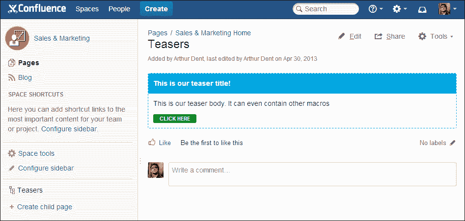

# 页面属性宏

有一个宏我想稍微强调一下。**页面属性宏**，也被称为**元数据详情宏**，是一个小巧的美丽宏。

页面属性宏使您能够将数据嵌入到一个页面中，然后在另一个页面上以表格形式显示该信息。页面属性宏可以放置在任意数量的页面上，您还可以使用页面属性报告宏显示所有数据。

一个示例是客户联系信息，其中每个客户都有一个包含联系信息的页面，使用页面属性宏。然后在概览页面上，我们将以表格形式展示所有客户的联系信息。

要创建客户详情页面，请执行以下步骤：

1.  为此练习创建一个`Sales & Marketing`空间，或者如果有可用的测试/沙盒空间，可以使用它。

1.  在新的空间中，创建一个名为`Customers Overview`的页面。

    1.  在正文中，添加页面属性报告宏。

    1.  在宏属性中，使用标签`customer-contact-details`。

    1.  点击**保存**以保存页面。

1.  创建一个新的页面，作为“客户概览”页面的子页面。

    1.  使用客户名称作为标题。

    1.  插入页面属性宏。

    1.  在宏的正文中，创建一个包含两列和四行的表格。

    1.  在表格中输入一些联系信息：

        **姓名** – `Ford Prefect`。

        **职位** – `管理董事`。

        **电子邮件** – `ford.prefect@example.com`。

        **电话** – `317-822-2752`。

    1.  给页面添加标签`customer-contact-details`。

    1.  点击**保存**以保存页面。

1.  对几个客户重复此步骤。（这是一个很好的模板使用示例。）

现在我们已经有几页包含客户信息，类似于以下截图所示：

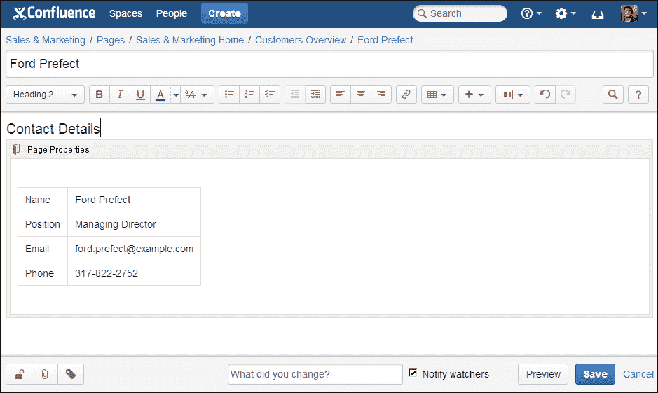

如果我们现在返回浏览之前创建的**客户概览**页面，我们应该会看到一个包含客户信息的表格。像所有 Confluence 中的表格一样，你可以按列对表格进行排序。

### 注意

列是按字母顺序排序的，而不是按你在页面属性宏中指定的顺序。如果你想重新排序列，给列添加数字是一个很好的方法。

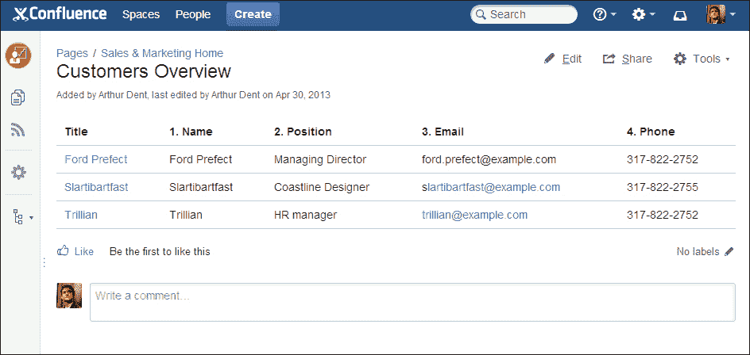

### 注意

页面属性报告宏生成的表格也可以作为其他宏的输入，比如图表宏。

# 快捷链接

快捷链接提供了一种快速链接到经常使用的资源的方法，例如链接到 Google 搜索。快捷链接需要由 Confluence 管理员进行配置，用户才能使用它们。

## 创建快捷链接

如果你在 Packt Publishing 网站上搜索书籍，URL 会是[`www.packtpub.com/books?keys=`](http://www.packtpub.com/books?keys=)。如果你为这个搜索创建一个快捷方式并使用`packt`作为关键字，每当用户需要访问该网站时，只需输入`[terms@packt]`，Confluence 会链接到[`www.packtpub.com/books?keys=terms`](http://www.packtpub.com/books?keys=terms)。

1.  浏览到管理控制台（**管理** | **Confluence 管理**）。

1.  从左侧菜单中选择**快捷链接**。

1.  输入快捷链接值的键。在我们的例子中，我们将使用`packt`。

1.  输入**扩展值**：`http://www.packtpub.com/books?keys=`。你可以在 URL 中使用`%s`来指定术语插入的位置。如果 URL 中没有`%s`，则术语会被放置在末尾。

1.  输入**默认别名**。这是在 Confluence 中显示的链接文本。文本中也可以使用`%s`。如果没有输入值，Confluence 将使用`term@key`作为链接文本。

1.  点击**提交**。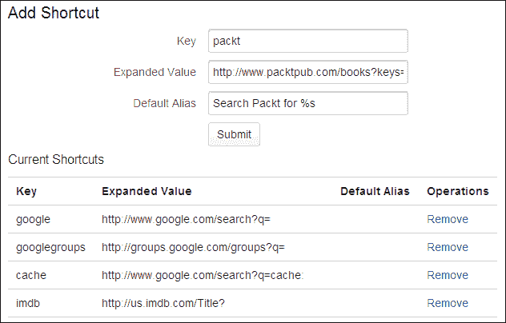

## 使用快捷链接

你的用户可以像使用其他链接一样使用你之前创建的快捷链接。

1.  打开页面的编辑模式，并将光标放在你想要添加链接的位置。

1.  在工具栏中点击**链接**，或者按*Ctrl* + *K*。

1.  点击**高级**，并将快捷链接 `confluence@packt` 输入到链接文本框中。

1.  输入将要显示的链接文本。

1.  点击**插入**。

你还可以使用*[* 键盘快捷键并输入链接，用`'` `''`将其括起来；例如`'[confluence@packt]'`。

### 注意

用户需要知道哪些快捷键是可用的。做这件事的最好方法是创建一个单独的页面，列出所有快捷键。Confluence 不提供自动列出这些快捷键的方法。

# 总结

如果你想创建统一性，或者只是希望为用户提供一个快速入门的内容创建方式，模板就能帮到你。模板是预先格式化的页面，可以在你添加新页面时使用。我们已经学习了如何创建这些模板，并且这些模板可以在空间级别或全局级别添加。

另一个自动化你经常做的事情的机制是用户宏。用户宏允许你编写一些功能或格式，供你的用户重复使用。用户宏可以通过 Confluence 用户界面轻松添加，但它们确实需要一些 HTML 和 XML 的知识。通过本章中的示例，你应该能够有一个坚实的基础，开始构建自己的宏。

宏的强大功能通过页面属性宏得到了证明，您可以使用它从页面中提取元数据，并在概览表中显示这些信息。

有许多附加组件可用，它们向 Confluence 添加模板、宏和其他功能。这些附加组件可以通过 Atlassian 市场安装，接下来的章节我们将学习如何使用它。
