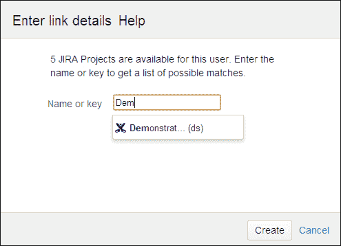

# 第九章 一般管理

Confluence 是一个功能强大且灵活的应用程序。我们已经了解了如何自定义 Confluence 的外观与感觉，添加结构，创建内容，以及如何让其他人参与进来。除了我们已经涵盖的内容外，还有一些其他有用的功能值得学习。

本章将介绍如何管理插件，为 Confluence 添加新功能，如何通过应用程序链接将 Confluence 与不同的应用程序集成，以及如何排查 Confluence 问题并与 Atlassian 支持团队联系。

在本章结束时，我们将学习到：

+   使用插件

+   将 Confluence 与其他应用程序集成

+   内容索引

+   获取支持

# 使用插件

在本书中，我们使用的是一个标准的 Confluence 安装，没有任何额外的功能或特性。插件是独立安装的组件，用于补充或增强 Confluence 的功能。它可以是一个单一功能，比如宏，也可以是一个独立的产品，例如插件“Team Calendars”。

在 Atlassian Marketplace 上有超过 500 个 Confluence 插件，并且还在不断增加。这些插件可以通过 Marketplace 进行下载、评估和购买。Marketplace 可以通过互联网直接访问，也可以通过 Confluence 管理控制台中的 Universal Plugin Manager 访问。

### 注意

“插件”和“附加组件”这两个术语都表示额外的功能。虽然这两个术语有时可以互换使用，但它们并不相同。插件是可以添加到 Confluence 中的附加组件，并且是使用 Atlassian 插件 SDK 开发的。并非所有的附加组件都是插件。适用于移动设备的原生应用程序也被视为附加组件，而“内容格式化宏”则是插件。

## Marketplace

Atlassian Marketplace，位于[`marketplace.atlassian.com`](https://marketplace.atlassian.com)，是寻找、评估和购买 Confluence 插件的资源。

使用 Marketplace 的普通搜索功能查找插件通常非常简单，可以帮助您找到合适的插件。有时您希望缩小搜索范围，查找特定版本的插件。这可以通过高级搜索来实现。

要使用高级搜索查找插件，请执行以下步骤：

1.  浏览至[`marketplace.atlassian.com`](https://marketplace.atlassian.com)。

1.  从顶部导航栏选择**高级搜索**，以浏览下图所示的高级搜索界面。

1.  选择**Confluence**作为**应用程序**，并从**版本**字段的值中选择您的版本。

1.  填写其他选项以指定您正在寻找的插件。

1.  点击**高级搜索**。The Marketplace

当您找到一个喜欢的插件时，有两种可能性：

+   该插件是*免费的*，可以在没有许可证的情况下使用。

+   如果插件是你需要*付费的*，那么你需要购买许可证才能使用该插件。插件可以评估 30 天，评估期可延长至 90 天。

无论哪种方式，你都必须下载插件并将其安装到你的 Confluence 安装中。Marketplace 提供了一个下载链接，但有一个更简单的方法可以将新插件安装到你的应用程序中，那就是通用插件管理器。

## 通用插件管理器

**通用插件管理器**（**UPM**）本身就是一个插件，可以用于在 Confluence 内部管理插件。UPM 被称为通用的，因为它可以跨其他 Atlassian 产品工作。

在较新版本的 Confluence 中，通用插件管理器是预装的，因此你无需自己安装。然而，由于 UPM 是一个插件，它会定期更新，所以你需要不时地更新它。

### 在线和离线模式

通用插件管理器依赖可用的互联网连接来执行以下任务：

+   搜索和安装新插件

+   检查和安装插件的更新

+   执行应用程序升级检查

如果你的 Confluence 服务器无法连接到互联网，可以将 UPM 切换为离线模式。在离线模式下，UPM 不连接互联网，所有依赖互联网的功能都会被禁用。即使在离线模式下，你仍然可以使用 UPM 执行以下操作：

+   管理已安装的插件

+   从本地服务器上传新插件

+   检查 UPM 审计日志

另一个选择是用防火墙保护服务器，并仅允许 UPM 连接到所需的服务。为了让 UPM 在防火墙后执行在线功能，请确保 Confluence 能够连接到以下服务器的 443 端口（https）：

+   ***.atlassian.com**：UPM 连接到 `atlassian.com` 域中的多个服务器，包括 [marketplace.atlassian.com](http://marketplace.atlassian.com) 和 [id.atlassian.com](http://id.atlassian.com)。

+   **dq1dnt4af4eyy.cloudfront.net**：Marketplace 使用 Amazon CloudFront 作为 CDN，这里是你的插件下载来源。

    ### 注意

    这些链接可能会发生变化，如果前面提到的设置对你不起作用，请检查[`confluence.atlassian.com/x/Y4tCEg`](https://confluence.atlassian.com/x/Y4tCEg)。

#### 由 UPM 传输的信息

如果通用插件管理器处于在线模式（默认），每次 Confluence 管理员访问“管理插件”页面时，信息都会被传输。此外，后台任务会每 24 小时将相同的信息发送到 Marketplace，以检查是否有新版本。

传输到 Atlassian 的信息包括：

+   应用程序的类型和版本（例如，Confluence 5.1.2）

+   已安装插件的插件密钥和版本（例如，`com.atlassian.calendar` `1.2`）

+   当前 UPM 版本

当启用分析信息收集时，以下信息也会传输到 Atlassian：

+   **支持授权号码** (**SEN**) 和服务器 ID

+   许可统计信息，例如最大用户数

+   许可类型（商业版、评估版）

+   某些使用事件，例如卸载插件

如果你希望禁用向 Atlassian 传输许可信息，可以通过设置 Java 系统属性禁用此功能。该属性为 `atlassian.upm.server.data.disable=true`。

设置 Java 系统属性：

1.  打开位于 `CONF_INSTALL/bin` 下的 `setenv.bat` 文件。

1.  找到 `set JAVA_OPTS=%JAVA_OPTS%` 部分。

1.  在该部分添加 `-Datlassian.upm.server.data.disable=true`；列表项用空格分隔。

    ### 注意

    如果你以 Windows 服务方式运行 Confluence，则该系统属性必须在其他地方设置；请参阅 [`confluence.atlassian.com/x/JoUDCg`](https://confluence.atlassian.com/x/JoUDCg) 获取更多信息。

#### 切换到离线模式

如果你想将 Universal Plugin Manager 设置为离线模式，则不会向 Atlassian 传输任何数据，但你无法通过 UPM 直接下载任何插件。

启用离线模式：

1.  浏览到管理控制台 (**管理** | **Confluence 管理**）。

1.  在左侧菜单中选择 **管理插件**。

1.  点击页面底部的 **设置** 链接；将出现如下图所示的对话框：

1.  取消勾选 **连接到 Atlassian 市场** 前面的复选框。默认情况下启用此选项。

1.  点击 **应用** 以使设置生效。

离线模式中禁用的功能，如 **查找新插件**，将从用户界面中隐藏。

### 寻找新的插件

任何用户、管理员或非管理员都可以从 Confluence 中浏览 Atlassian 市场。系统管理员可以使用此页面安装插件，而其他用户则可以用此请求安装插件（有关请求的更多信息，请参见 *用户请求插件* 部分）。

查找插件的步骤如下：

1.  点击左上角的头像。

1.  从下拉菜单中选择 **Atlassian Marketplace**。产品中的市场视图如下图所示：

1.  通过浏览建议或以下方式搜索插件：

    +   在 **搜索市场** 框中输入搜索字符串。这将根据插件名称过滤结果。

    +   使用下拉菜单根据以下条件过滤插件：

        +   属性，例如 **最近添加** 或 **员工推荐**

        +   分类，例如 **主题与样式** 或 **蓝图**

        +   基于定价，如 **免费**、**通过 Atlassian 付费** 或 **所有付费**

### 注意

**通过 Atlassian 付费**和**所有付费**之间有差异。插件供应商可以选择让 Atlassian 处理他们插件的所有购买。这对用户来说是一个巨大的优势，他们现在可以通过 Atlassian 购买插件，利用其标准化的流程和[my.atlassian.com](http://my.atlassian.com)。**所有付费**选项也会显示选择自己购买系统的供应商的插件。

### 安装插件

Universal Plugin Manager 使得在 Confluence 中安装新插件变得非常容易。通过几次点击，你就可以浏览所有插件并安装你喜欢的插件。

或者，你可以通过上传 JAR 或 OBR 文件到 Confluence，使用文件上传手动安装插件。归档文件应包含插件代码和资源。如果其他操作无法使用，因为你处于防火墙后，你可以使用这种方法。

### 注意

插件非常强大，可以改变 Confluence 许多方面的行为。然而，验证插件供应商并在将其添加到生产环境之前进行测试是非常重要的。

#### 通过市场直接安装

如果你是系统管理员，并且 UPM 已连接到互联网，你可以通过点击**查找新插件**页面上的**安装**按钮来安装插件。这个一键安装是安装插件的最快方法。

要直接安装插件：

1.  点击页面左上角的头像。

1.  从下拉菜单中选择**Atlassian 市场**。此时会显示产品中的市场视图。

1.  查找相关的插件。

1.  点击**安装**按钮以安装插件。

如果插件是付费插件，将显示**立即购买**和**免费试用**按钮。点击其中一个按钮将下载并安装插件，并要求你通过[`my.atlassian.com`](https://my.atlassian.com)获取有效许可证。

#### 通过文件上传安装

当一键安装方法不可用时，你可以使用手动文件上传来安装插件。插件通常以 JAR 或 OBR 文件的形式分发，包含插件代码和资源。这是 UPM 接受的安装文件的唯一两种类型。

在手动上传插件之前，请确保你已经将分发文件放在桌面或本地服务器上，例如从市场下载到桌面。

要上传插件：

1.  进入管理控制台（**管理** | **Confluence 管理**）。

1.  在左侧菜单中选择**管理插件**。

1.  点击页面右上角的**上传插件**链接。以下上传对话框将出现：

1.  从你的计算机中选择一个 JAR 或 OBR 文件，或者输入服务器可以访问的 URL。

1.  点击**上传**按钮。插件成功安装后，将显示确认消息。

### 更新插件

插件提供商定期发布插件的新版本，以包含错误修复和新功能。这些更新可以在任何时候发布，且与 Confluence 的版本发布无关。通常建议保持插件更新，但在将更新应用到生产环境之前，应该验证该更新。

如果 Universal Plugin Manager 已连接到市场，**管理插件**页面将帮助你保持已安装插件的最新状态。如果 UPM 未连接，则需要通过[`marketplace.atlassian.com`](https://marketplace.atlassian.com)手动检查插件更新。

要更新插件，请执行以下步骤：

1.  浏览到管理控制台（**管理** | **Confluence 管理**）。

1.  在左侧菜单中选择**管理插件**。

1.  有更新可用的插件将显示在**需要操作的插件**列表中，如下图所示：

1.  点击插件旁边的**更新**按钮。UPM 将下载并安装最新版本。安装完成后会显示成功消息。

或者，可以手动上传更新后的插件。更新过程与一键更新选项相同。通常，在更新插件之前，不需要先移除“旧”插件，只要插件开发者增加了版本号即可。

### 注意

在某些情况下，插件更新可能失败，例如，插件开发者没有预料到 UPM 的新版本，导致在新版 UPM 上更新插件时失败。也可能有其他原因。这时，可以停止 Confluence 实例，删除缓存文件夹（[`confluence.atlassian.com/x/TgG_EQ`](https://confluence.atlassian.com/x/TgG_EQ)），重新启动实例，并重新尝试更新或上传先前版本的插件。

### 移除已安装的插件

你可以在**管理插件**页面中移除已安装的插件。卸载插件会永久从 Confluence 中移除该插件，并且文件会从主目录中删除。如果你只想暂时移除插件，你可以选择禁用插件。

要卸载插件，请执行以下步骤：

1.  浏览到管理控制台（**管理** | **Confluence 管理**）。

1.  在左侧菜单中选择**管理插件**。

1.  在插件列表中找到你想要卸载的插件。

1.  点击插件以打开详细视图。

1.  点击**卸载**按钮。

1.  在对话框中点击**继续**按钮确认。

1.  完成后，会在插件的详细视图中显示通知。

如果你想临时移除插件的功能，也可以禁用该插件。禁用插件将使其功能不可用。

要禁用一个插件，请执行以下步骤：

1.  浏览到管理控制台（**管理** | **Confluence 管理**）。

1.  在左侧菜单中选择**管理插件**。

1.  在插件列表中找到您想禁用的插件。

1.  点击插件以打开详细视图。

1.  点击**禁用**按钮。

    ### 注意

    一些插件是 Confluence 的一部分，无法禁用。

### 用户对插件的请求

启用后，Confluence 中的所有用户都可以查看产品内的 Marketplace，搜索插件。用户可以选择请求插件，而不是安装或试用插件。

点击**请求**按钮时，会弹出一个对话框，您可以在其中为系统管理员提供额外的信息，如以下截图所示：

如果用户请求了插件，系统管理员将收到电子邮件通知。

#### 查看用户请求

通过**查找新插件**页面，管理员可以轻松查看最受请求的插件以及谁请求了它们。

要查看最受请求的插件：

1.  浏览到管理控制台（**管理** | **Confluence 管理员**）。

1.  在左侧菜单中选择**管理插件**。

1.  从插件筛选器中，选择**最受请求**，如以下截图所示：

    请求的插件将显示在列表中，最受请求的插件排在最上面。

1.  点击插件以查看请求的更多详细信息。这里会显示用户、请求日期和附加消息。

1.  在此视图中，您可以安装、购买或取消请求，移除插件的请求计数。

#### 禁用用户请求

用户插件请求功能默认启用，但可以由系统管理员禁用。这将移除用户的产品内 Marketplace 链接以及**最受请求**插件筛选器。

禁用用户请求不会删除请求计数。如果该功能再次启用，先前请求的插件将重新显示。

要禁用用户插件请求：

1.  浏览到管理控制台（**管理** | **Confluence 管理员**）。

1.  在左侧菜单中选择**管理插件**。

1.  点击页面底部的**设置**链接；将会出现一个对话框。

1.  清除**允许用户请求插件**复选框。

1.  点击**应用**以保存设置。

# 内容索引

存储在 Confluence 中的所有内容都被视为内容。为了能够搜索这些内容，它需要先被索引。Confluence 管理员可以调整索引和 Confluence 搜索的行为。

内容不会直接添加到索引中。新的和修改过的内容会被放入队列中，队列每分钟处理一次。

## 重新构建索引

通常，内容索引会自动维护，但在以下情况下，您可能需要手动重建索引：

+   创建的内容不会出现在“最近更新”或搜索结果中

+   **你是想说这个吗**功能无法正常工作

+   在 Confluence 升级后，如果在升级发布说明中提到

+   如果您更改了索引语言

要重建内容索引，请执行以下步骤：

1.  浏览到管理控制台（**管理** | **Confluence 管理**）。

1.  在左侧菜单中选择**内容索引**。

    这将显示**搜索索引**和当前状态：

    

1.  点击你想要重建的索引下方的**重建**按钮。如果索引之前从未构建过，则该按钮为**构建**。

构建 Confluence 内容索引可能需要很长时间，完成时间取决于：

+   你安装中页面的数量

+   附件的数量、类型和大小

+   分配给 Confluence 的内存量

## 更改索引语言

如果大多数内容使用的语言与英语不同，改变 Confluence 中的索引语言可能会提高 Confluence 搜索结果的准确性。Confluence 支持以下语言的内容索引：英语、德语、俄语、中文、日语、法语、巴西葡萄牙语、捷克语和希腊语。

要更改索引语言：

1.  浏览到管理控制台（**管理** | **Confluence 管理**）。

1.  在左侧菜单中选择**常规配置**。

1.  选择**编辑**。

1.  从**格式化和国际化设置**部分的下拉列表中选择索引语言。

1.  点击**保存**以应用设置。

    ### 注意

    即使是在不支持的语言（例如荷兰语）中，内容索引功能也能很好地工作，因为它不仅仅依赖于一种语言，而是会查看可用的内容（页面和附件）来构建搜索索引。

# 应用链接

Confluence 可以使用**应用链接**与其他 Atlassian 工具进行集成。应用链接是两个应用之间的受信关系，这些应用可以共享信息并相互协作。

为了说明这些可能性，我们将把 Confluence 安装连接到 JIRA 安装。使用相同的技术，Confluence 也可以连接到 Bamboo、FishEye、Crucible、Stash 或另一个 Confluence 安装。

将 Confluence 与 JIRA 集成可以让你在 Confluence 页面中显示 JIRA 问题列表，如下图所示：

## 添加应用链接

在添加应用链接之前，确保两个应用的基本 URL 在**常规配置**中设置正确。

要将 Confluence 连接到 JIRA，请执行以下步骤：

1.  浏览到管理控制台（**管理** | **Confluence 管理**）。

1.  在左侧菜单中选择**应用链接**。

1.  点击**添加应用链接**。链接向导的**第 1 步**将会出现。

1.  输入 JIRA 的服务器 URL 并点击**下一步**。

1.  在向导的**第 2 步**中，输入以下信息：

    +   **还要创建** **从“您的公司 JIRA”返回此服务器的链接**：如果您希望在 Confluence 和 JIRA 之间创建双向链接，请选择此选项。如果是这样，请提供一个 JIRA 管理员帐户来创建该链接。

    +   提供的凭据不会被存储。

    +   凭据需要是具有管理权限的用户帐户。

    +   **互惠链接 URL**：此 URL 将覆盖基本 URL。应用程序链接将使用此 URL 连接到 JIRA。

    

1.  点击**下一步**按钮，**第 3 步**将出现。

1.  输入配置身份验证所需的信息：

    +   **这些服务器具有相同的用户和用户名集**或**这些服务器具有不同的用户或用户名集**：根据 Confluence 和 JIRA 中的用户管理方式，选择其中一个选项。

    +   **这些服务器完全信任彼此**：选择此选项将允许 Confluence 和 JIRA 作为任何用户相互连接。这是最有用的连接方式。

## 编辑应用程序链接

Confluence 系统管理员可以更改任何现有应用程序链接的应用程序名称和显示 URL。

要编辑应用程序链接，请执行以下步骤：

1.  浏览到管理控制台（**管理** | **Confluence 管理**）。

1.  在左侧菜单中选择**应用程序链接**。

1.  点击您要编辑的应用程序链接旁边的**配置**链接。

1.  应用程序链接的详细信息将显示：

1.  按照您的需求更新详细信息；**应用程序类型**和**应用程序 URL**字段在创建链接后无法更改。

    +   **显示 URL**字段用于显示指向应用程序的链接。当您创建应用程序链接时，可能使用了一个用户无法访问的内部 URL 或 IP。此 URL 将在显示链接时覆盖该 URL。

1.  点击**更新**以保存更改。

## 空间项目链接

应用程序链接顾名思义是应用范围广泛的。一旦在应用之间设置了应用程序链接，就可以创建更具体的链接，称为**项目链接**。通过项目链接，您可以将特定的 Confluence 空间连接到特定的 JIRA 项目、Bamboo 项目或 FishEye 仓库。这样做可以更方便地将信息集中在一个地方。

要将空间链接到 JIRA 项目：

1.  转到您希望连接到 JIRA 的空间。

1.  在侧边栏中选择**空间工具**。（如果您未使用默认主题，请选择**浏览** | **空间管理员**。）

1.  选择**集成**标签。

1.  点击**添加链接**。下拉菜单会显示已配置的应用程序链接；选择您要链接的应用程序。

1.  在**需要授权**页面上选择其中一个选项。

    +   **授权**：如果您希望授予空间访问目标项目的权限，请选择此选项。系统会提示您输入 JIRA 凭据。

    +   **跳过 – 你的访问是匿名的**：如果你希望匿名访问 JIRA，请选择此选项。

1.  在**名称或密钥**字段中，输入你想要连接的 JIRA 项目的名称/密钥。

1.  选择**是**或**否**，在 JIRA 中也创建一个指向 Confluence 空间的链接。

1.  点击**创建**按钮以创建项目链接。

## 配置身份验证

在每个应用程序链接上，你可以配置应使用哪种身份验证方法来处理进出站连接。进站身份验证用于所有从 JIRA 到 Confluence 的请求，而外发身份验证则反向应用。

应用程序链接的身份验证本质上是定义 Confluence 和其他应用程序之间的信任级别。你应该配置的身份验证级别取决于多个因素：

+   **这两个应用程序彼此信任吗？**：如果是 Atlassian 应用程序，安全答案是“是”。如果你要将 Confluence 连接到另一个应用程序，请确保该应用程序是安全的。

+   **这两个应用程序是否共享相同的用户基础？**

+   **你是否具有对另一个应用程序的管理访问权限？**

常见的场景如下：

+   Confluence 和 JIRA 都是内部使用且共享相同用户基础的。在这种情况下，**受信任的应用程序**是最佳的身份验证方式，适用于进出站的身份验证。

+   如果 Confluence 和 JIRA 没有共享相同的用户基础，请使用**OAuth**（下一节会解释）进行身份验证（双向认证）。这可能是你的内部 Confluence 和外部（面向客户的）JIRA 实例。

+   如果你在 JIRA 服务器上没有管理员权限，你可以配置单向的外发身份验证，使用**基本 HTTP 身份验证**。

### 受信任的应用程序身份验证

受信任的应用程序身份验证允许一个应用程序代表任何用户访问另一个应用程序的功能，而无需用户登录到另一个应用程序。因此，在我们的情况下，每个 Confluence 用户在使用“JIRA 问题”宏时，看到的 JIRA 问题列表与使用 JIRA 问题导航器时看到的完全相同。

要配置受信任的应用程序身份验证：

1.  浏览到管理控制台（**管理** | **Confluence 管理**）。

1.  在左侧菜单中选择**应用程序链接**。

1.  点击**配置**链接，编辑你想要的应用程序链接。

1.  选择**进站身份验证**标签；所有进站身份验证将显示在选中**受信任的应用程序**标签的状态下。

1.  如果身份验证当前已启用或未启用，标签会显示相应的信息。受信任的应用程序配置具有以下属性：

    +   **IP 模式**：输入 Confluence 应该接受请求的 IP 地址（IPv4）。你可以通过使用星号来指定通配符，例如`192.168.2.*`。

    +   **URL 模式**：输入允许 JIRA 访问的 URL。对于 Confluence，这至少应包括以下内容：

        `/plugins/servlet/streams`

        `/plugins/servlet/applinks/whoami`

    +   **证书超时（毫秒）**：输入证书超时时间。默认时间为 10 秒。超时用于防止重放攻击。如果第二个请求比初始（授权）请求晚 10 秒，它将被拒绝。请注意，超时依赖于两个服务器的时钟同步。

1.  单击**应用**以保存您的更改。

外发身份验证设置具有相同的属性。外发身份验证也可以从 Confluence 设置，但可能会提示您输入 JIRA 凭据。

### OAuth 身份验证

OAuth 是一种允许 Web 应用程序与其他外部应用程序共享数据的协议。这可以是另一个 Web 应用程序（例如 JIRA）或桌面或移动应用程序。

当两个应用程序彼此信任但不共享相同用户集并且具有通过应用程序链接连接的选项时，通常会使用 OAuth。

### 小贴士

**使用 SSL**

建议您的应用程序使用 SSL（HTTPS），而不是基本 HTTP，因为敏感信息通过 Internet 传输。

要配置 OAuth 身份验证，请执行以下步骤：

1.  转到管理控制台（**管理** | **Confluence 管理**）。

1.  在左侧菜单中选择**应用程序链接**。

1.  单击要编辑的应用程序链接旁边的**配置**链接。

1.  选择**传入身份验证**，并选择**OAuth**选项卡。

1.  单击**启用**按钮以为传入链接启用 OAuth 身份验证。远程应用程序将自动设置为“消费者”，您的本地应用程序将设置为“服务提供者”。

对于外发身份验证，如果您尚未登录到远程应用程序，将显示登录对话框。使用您的凭据登录到其他（JIRA）服务器。选择**启用**按钮将为外发身份验证设置 OAuth。

### 基本 HTTP 身份验证

使用基本 HTTP 身份验证依赖于 Confluence 和 JIRA 之间的安全连接。建议您使用不同的身份验证方法，只要您能够这样做。

基本 HTTP 身份验证允许您为 Confluence 提供 JIRA 用户凭据，反之亦然。一旦验证通过，Confluence 便可以代表该用户访问 JIRA 功能和资源。这也意味着，如果您提供具有管理功能的用户凭据，您的应用程序链接也将能够访问这些功能。

要配置基本 HTTP 身份验证：

1.  转到管理控制台（**管理** | **Confluence 管理**）。

1.  在左侧菜单中选择**应用程序链接**。

1.  单击要编辑的应用程序链接旁边的**配置**链接。

1.  选择**传入身份验证**并选择**基本访问**标签。

1.  输入**用户凭据**。

1.  点击**启用**以存储凭据并启用基本 HTTP 身份验证。

# 使用应用程序导航器

一旦配置了多个链接，应用程序导航器将出现在 Confluence 的左上角。应用程序导航器可以用于在不同应用程序之间快速导航。

并非所有 Atlassian 应用程序目前都拥有此导航器，但未来会有。

## 添加新链接

Confluence 管理员可以将新链接添加到导航器中。默认情况下，应用程序链接也会被添加到导航器中；无法删除它们。

要添加新链接：

1.  浏览到管理控制台（**管理** | **Confluence 管理**）。

1.  在左侧菜单中选择**应用程序导航器**。

1.  填写新链接的详细信息：

    +   **名称**：将在导航器下拉列表中显示的名称

    +   **URL**：指向应用程序或网站的链接

    +   **隐藏**：如果不想在导航器下拉列表中显示此链接，请选择此复选框

    +   **仅限群组**：可以将链接限制为某些群组；选择允许查看此链接的群组

1.  点击**添加**以保存链接。

## 管理链接

除已配置的应用程序链接外，现有链接可以轻松更改、排序或删除，应用程序链接有些受限。

要更改现有链接：

1.  浏览到管理控制台（**管理** | **Confluence 管理**）。

1.  在左侧菜单中选择**应用程序导航器**。

1.  将鼠标悬停在你想更改的链接上，查看背景是否变黄（如果背景不变，表示你不能更改该值）。

1.  点击该值以切换到编辑模式。

1.  更新你想要更改的值。

1.  按下*回车*，或点击**更新**以保存更改。

改变链接在导航器中显示顺序的方式是通过拖放链接来实现的。

要删除链接：

1.  浏览到管理控制台（**管理** | **Confluence 管理**）。

1.  在左侧菜单中选择**应用程序导航器**。

1.  点击**删除**按钮。

# 获取支持

有时你会遇到需要帮助才能继续的情况。Atlassian 提供了几个渠道，在这种情况下你可以寻求帮助。

在许多情况下，在线文档（[`confluence.atlassian.com/display/DOC/`](https://confluence.atlassian.com/display/DOC/)）提供了详细信息帮助你解决问题。如果你在文档中找不到需要的信息，你可以通过 Atlassian Answers 在线提问。当然，你也可以创建支持工单寻求 Atlassian 的帮助，或联系 Atlassian 专家提供帮助。

## Atlassian Answers

Atlassian Answers 是一个由社区驱动的问答网站，任何人都可以使用。如果你需要帮助，你可以用你的 Atlassian ID（即用于管理许可证的账户）登录 [`answers.atlassian.com`](https://answers.atlassian.com)。

Answers 是一个声誉系统，通过使用**Karma**来激励用户参与并为发布的问题提供正确答案。积累足够的 Karma 点数，你将获得 Atlassian 赠送的 T 恤。

如果你在 Answers 上找不到问题的答案，或者你需要分享一些关于安装的信息而你不太方便公开，总是可以寻求 Atlassian 支持的帮助。

## Atlassian 支持

拥有有效许可证的用户有权获得 Atlassian 的支持。为了充分利用 Atlassian 支持，最好先使用内置的支持工具对你的系统进行初步诊断。

### Atlassian 支持工具

Confluence 提供了一个内置的日志扫描器。该扫描器会检查你的 Confluence 日志文件中的错误，并将其与 Atlassian 知识库和 bug 跟踪器中的已知问题进行对比。该日志扫描器名为**Hercules**。Hercules 将连接到互联网以检索最新的已知问题；但你的文件不会通过互联网发送。系统管理员可以使用 Hercules 扫描日志文件。

使用日志扫描器：

1.  浏览到管理控制台（**管理** | **Confluence 管理**）。

1.  在左侧菜单中选择**Atlassian 支持工具**。

1.  在**故障排除**标题下选择**日志扫描器**。

1.  如果你的日志文件在默认位置，点击**扫描**。否则，先更改位置。

1.  日志扫描器会返回指向 Atlassian 知识库或 bug 跟踪器的链接列表。

    +   最后报告的问题会优先显示。如果你有超过 10 个错误匹配已知问题，可以点击页面顶部出现的**显示全部**链接。

    +   选择一个链接查看报告的问题和可能的解决方案或变通方法。

    

### 提交支持票

在此时，我们可能遇到了没有已知解决方案的问题，但我们已经解决了大部分通过日志扫描器诊断出的故障。此时是提交 Atlassian 支持票的好时机。

提交支持票的最简单方法是直接通过管理控制台。如果你无法使用此方法，你需要通过 JIRA 实例 [`support.atlassian.com`](https://support.atlassian.com) 提交请求。

#### 通过 Confluence 提交支持请求

使用此方法的好处是，所有需要提供的支持文件都将直接添加到支持请求中。设置 SMTP 服务器是此方法的前提条件。

提交支持请求：

1.  浏览到管理控制台（**管理** | **Confluence 管理**）。

1.  在左侧菜单中选择**Atlassian 支持工具**。

1.  选择**支持请求**。

1.  尽可能提供更多信息：

    +   **联系邮箱**：默认使用登录用户的邮箱。该邮箱地址用于在 [`support.atlassian.com`](https://support.atlassian.com) 上查找或创建账户。所有后续通知将发送到该邮箱。

    +   **摘要**：问题的简要描述。

    +   **描述**：您可以分享的尽可能多的信息，包括任何错误消息和重现问题的步骤。

1.  在**附件支持数据**部分，选择您希望附加到请求中的附加文件类型。在这种情况下，越多越好，但请记住公司的隐私和保密规则。

1.  选择**发送**以发布您的请求。

    一旦支持请求被接收，您将通过电子邮件收到通知。

    

## Atlassian 专家

Atlassian 拥有超过 250 个合作伙伴，称为**专家**，他们致力于帮助您解决 Confluence 及其他产品相关的具体需求。如果您需要培训、定制插件或内部支持来设置您的产品套件，当地专家将为您提供帮助。

早期邀请专家帮助您设置 Confluence，从长远来看将大有裨益。专家们见过*许多不同的安装*，了解各种使用案例，并且非常熟悉为您提供的超过 1000 个插件。

要找到本地专家，请执行以下步骤：

1.  浏览到 [`www.atlassian.com/resources/experts/`](http://www.atlassian.com/resources/experts/)。

1.  使用筛选器指定：

    +   您在寻找什么类型的专家（培训、调整、迁移）

    +   针对哪种产品（Confluence、JIRA）

    +   在哪个国家

1.  点击**搜索专家**以生成符合筛选条件的专家列表。

# 摘要

在这一章节中，我们学习了如何在 Atlassian Marketplace 中找到插件，以便为 Confluence 添加新功能，满足您的所有需求。Atlassian Marketplace 是一个充满活力的地方，越来越多的插件每天都在添加。您可以轻松地在 Confluence 中浏览它。

在 Confluence 中，内容就是一切，而一切也是内容。正常情况下，内容的索引工作良好，但在某些情况下，我们需要帮助 Confluence。我们学习了内容索引以及如何在需要时进行维护。

通过应用链接，您可以将 Confluence 与其他工具集成，创建一个完整的产品套件。应用链接使您能够将来自不同工具的不同内容集中在一个应用中。使用应用导航器，您也可以轻松地在不同工具间切换。

最后但同样重要的是，我们学习了如何在遇到问题时寻求支持。在线资源非常丰富，Atlassian 支持团队和专家可以帮助您重新开始。

下一章将让你了解如何编写自己的插件。这意味着需要进行一定的编码。如果你不熟悉这部分内容，完成后可以把书交给公司里的开发人员；他或她或许能帮助你编写所需的插件。
