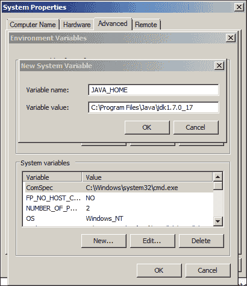
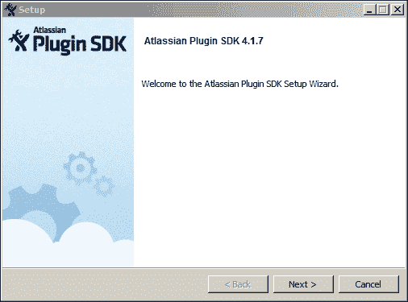
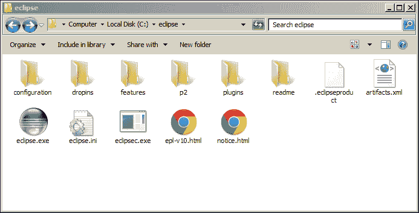
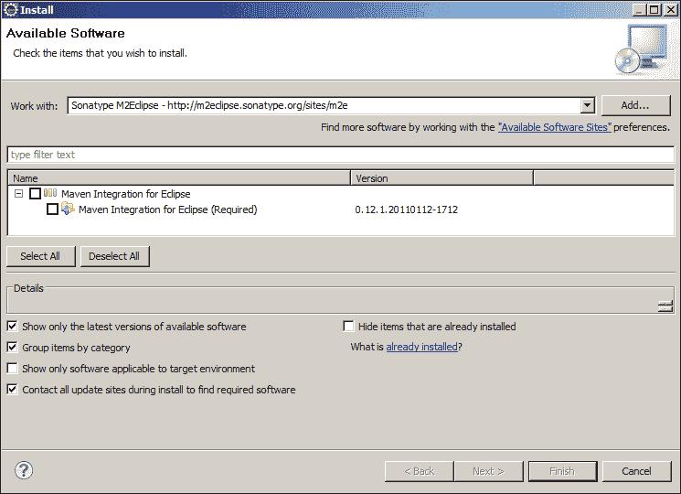
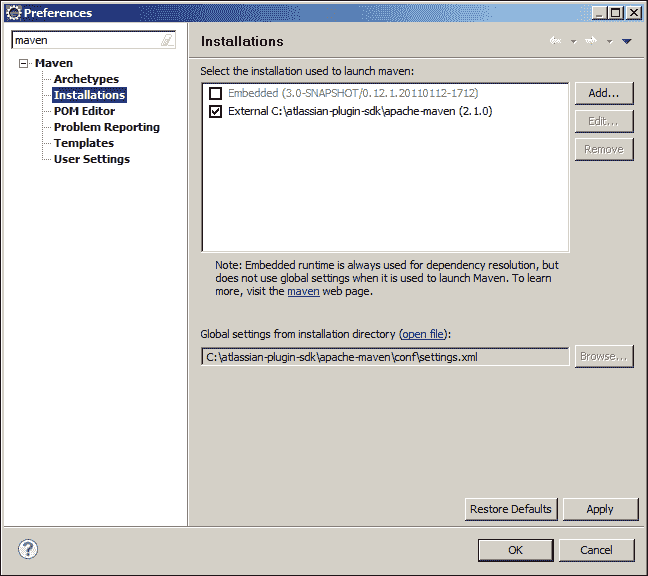
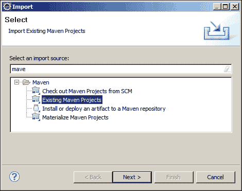
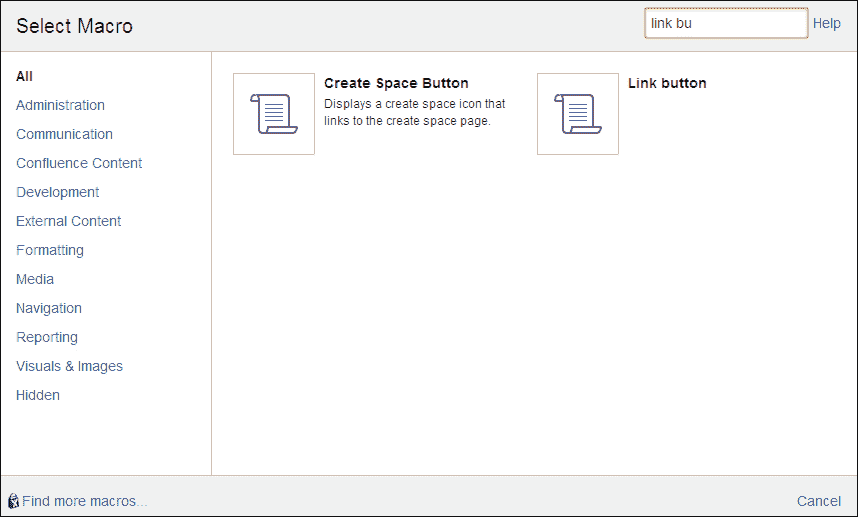

# 第十章：扩展 Confluence

不是所有功能都可能在 Confluence 开箱即用或作为市场中的附加插件提供。Confluence 通过自定义插件非常可扩展，如果你是开发人员，你甚至可以使用 **Atlassian 软件开发工具包** (**SDK**) 创建自己的插件。

到本章结束时，你将了解：

+   设置开发环境

+   使用 Atlassian 插件 SDK

+   不同的扩展点

+   如何发布你的插件

如果你不是开发人员，本章可能会很难阅读，但它可以让你了解通过扩展 Confluence 可以实现的功能。

# Atlassian 插件 SDK

Atlassian 提供了一个软件开发工具包（SDK）给插件开发人员。通过使用这个 SDK，开发人员可以创建扩展所有 Atlassian 产品功能的插件。SDK 使你能够快速连接并使用插件开发平台。

Atlassian 插件 SDK 通过帮助完成以下任务，让你的工作更轻松：

+   使用单一工具为任何 Atlassian 应用程序构建插件。

+   创建一个特定于你正在开发的 Atlassian 应用程序的插件框架。

+   下载应用程序二进制文件，安装插件，并启动应用程序。

+   在开发过程中，修改插件后可动态重新安装，无需重新启动。

+   编写高质量的单元测试和集成测试。

+   加速至关重要的代码-部署-测试循环。

## 安装 Atlassian 插件 SDK

在我们开始构建第一个插件之前，我们必须安装 Atlassian 插件 SDK。我们将逐步讲解如何在 Windows 系统上安装 SDK。

### 先决条件

首先，我们需要确保我们的 Windows 系统已经安装了必备软件，并且配置正确。Atlassian SDK 依赖于 Oracle JDK 版本 1.6.x 或更高版本。

安装 Oracle JDK 的步骤如下：

1.  从 [`www.oracle.com/technetwork/java/javase/downloads/index.html`](http://www.oracle.com/technetwork/java/javase/downloads/index.html) 下载最新的 JDK。

    ### 注意

    本文写作时，最新版本是 JDK 7 更新 17。

1.  双击下载的安装文件以启动安装向导。

1.  选择你希望安装 Java 的位置，或者直接接受默认值。你安装 JDK 的位置将被称为 `JAVA_HOME`。

1.  右键点击“计算机”图标。

1.  从左侧菜单中选择 **高级系统设置**。

1.  点击 **环境变量** 按钮。

1.  创建一个新的环境变量 `JAVA_HOME`，其值为你刚安装的 Java 路径，如下所示：

现在你已经在系统上安装了 JDK，请将 JAVA `bin` 目录添加到系统路径中，确保可以从命令提示符中使用 Java。再次假设这是 Windows 环境。

若要将 `JAVA_HOME` 添加到系统路径中，请执行以下步骤：

1.  右键点击“计算机”图标。

1.  从左侧菜单中选择**高级系统设置**。

1.  点击**环境变量**按钮。

1.  在系统变量中找到**Path**变量并点击**编辑...**。

1.  将`;%JAVA_HOME%\bin`添加到变量值的末尾。

1.  保存更改并关闭所有对话框。

在继续之前，我们必须确保 JDK 已正确安装，以便 Atlassian SDK 能够使用它。

为了验证你的 JDK 安装是否正确，请执行以下步骤：

1.  在 Windows 中打开一个命令提示符窗口。

1.  输入以下命令验证`JAVA_HOME`变量是否已设置：

    ```
    echo %JAVA_HOME%

    ```

1.  这应该会返回一个路径，即`C:\Program Files (x86)\Java\jdk1.7.0_17`。

1.  设置变量后，验证你的**Path**是否包含 JDK 的 bin 目录。输入以下命令：

    ```
    java –version

    ```

    这应该会显示已安装的 Java 版本，即：

    ```
    java version "1.7.0_17"
    Java(TM) SE Runtime Environment (build 1.7.0_17-b02)
    Java HotSpot(TM) Client VM (build 23.7-b01, mixed mode, sharing)

    ```

1.  如果你已经安装了 JDK 并且**Path**已正确配置，你可以继续进行下一步。

在为 Confluence 构建插件时，应用程序将运行在你的桌面上。为了让 Confluence 能够启动，它假设**端口 1990**是可用的。大多数机器上这不会成为问题。

通过执行以下步骤验证你的端口号：

1.  打开命令提示符窗口并输入以下命令：

    ```
    netstat –a | find /I "1990"

    ```

如果前面的命令没有返回任何内容，则表示端口可用。如果前面的命令返回了内容，则说明端口 1990 已经被其他应用占用。Atlassian SDK 在启动时会注意到这一点，并为 Confluence 分配一个不同的端口。我们将在*构建、安装和运行插件*部分深入讨论这个问题。

### 注意

如果你在 Linux 或 Mac 上开发插件，可以参考[`developer.atlassian.com/display/DOCS/Set+up+the+SDK+Prerequisites+for+Linux+or+Mac`](https://developer.atlassian.com/display/DOCS/Set+up+the+SDK+Prerequisites+for+Linux+or+Mac)的在线指南来安装 JDK。

### 设置 Atlassian SDK

在所有先决条件安装完毕后，我们可以下载并设置 Atlassian SDK。

1.  通过以下链接下载最新版本的 SDK：[`marketplace.atlassian.com/download/plugins/atlassian-plugin-sdk-windows`](https://marketplace.atlassian.com/download/plugins/atlassian-plugin-sdk-windows)（直接下载链接）。

1.  定位到下载的安装程序并双击 EXE 文件。

1.  点击**下一步**并选择一个安装 SDK 的路径。

1.  跟随接下来的界面安装 SDK。

现在 Atlassian 插件 SDK 已安装，我们准备创建第一个插件。

为了验证 SDK 是否配置正确，执行以下步骤：

1.  打开命令提示符窗口并运行以下命令：

    ```
    atlas-version

    ```

    系统应该会响应类似以下信息：

    ```
    ATLAS Version:    4.1.7
    ATLAS Home:       C:\atlassian-plugin-sdk
    ATLAS Scripts:    C:\atlassian-plugin-sdk\bin
    ATLAS Maven Home: C:\atlassian-plugin-sdk\apache-maven
    --------
    Executing: "C:\atlassian-plugin-sdk\apache-maven\bin\mvn.bat" --version -gs C:\atlassian-plugin-sdk\apache-maven/conf/settings.xml
    Apache Maven 2.1.0 (r755702; 2009-03-18 20:10:27+0100)
    Java version: 1.7.0_17
    Java home: C:\Program Files (x86)\Java\jdk1.7.0_17\jre
    Default locale: en_US, platform encoding: Cp1252
    OS name: "windows server 2008 r2" version: "6.1" arch: "x86" Family: "windows"

    ```

## 命令

Atlassian 插件 SDK 提供了一组脚本，用于为 Atlassian 产品创建、安装和构建插件。让我们看看 SDK 中的一些典型任务和命令示例。

### 创建一个新的插件

当你想要构建一个新的插件时，需要创建一个插件骨架。打开命令提示符并在你想要创建插件的位置运行以下命令。

```
atlas-create-confluence-plugin

```

### 向你的插件中添加一个新模块

如果你想为你的插件添加一个新的模块，也可以通过命令行来完成。打开命令提示符并浏览到插件所在位置。在插件目录中运行：

```
atlas-create-confluence-plugin-module

```

### 在应用程序中运行插件

如果你想在目标应用程序中运行你的插件，使用命令提示符进入插件目录并输入：

```
atlas-run

```

上述命令将启动插件中指定的应用程序（例如 Confluence、JIRA 等），并自动安装你的插件。

### 运行特定版本的应用程序

如果你正在构建一个插件，并且希望它能够与特定版本的应用程序兼容，或者你只是想测试你的插件在新版本应用程序中的表现，可以在启动应用程序时指定这一点。在你的插件目录中运行以下命令：

```
atlas-clean
atlas-run –-version 5.0.1

```

`atlas-clean`命令将清除任何先前运行的插件版本。只有在之前运行的是不同版本时才需要此操作。

### 使用 Maven 命令行界面（CLI）插件

SDK 捆绑了 Maven CLI 插件，允许你在开发 Confluence 安装中运行命令。要将其与插件的宿主应用程序一起使用，进入插件的项目目录（即你创建插件的地方）并输入：

```
atlas-cli

```

当命令行界面启动时，你可以使用命令`pi`来打包你的插件并将其安装到正在运行的 Confluence 安装中。

### 运行独立应用程序

如果你想快速测试应用程序的新版本，可以使用独立命令来启动该应用程序。你可以在任何地方运行此命令，因为不需要插件：

```
atlas-run-standalone-–product confluence --version 5.0.1

```

### 帮助命令

有更多可用的命令，但这些是最常用的。如果你不确定某个命令的用法或者有哪些命令可用，可以运行以下命令：

```
atlas-help

```

### Maven

当你构建插件时，Maven 将作为底层库依赖管理和构建工具。Maven 已经包含在 Atlassian Plugin SDK 中，因此不需要在你的机器上单独安装它。即使你已经安装了 Maven 版本，也应该使用捆绑的版本，因为 SDK 需要特定的 Maven 版本。

Atlassian SDK Maven 配备了已配置的设置，使得构建 Atlassian 插件尽可能简单。使用 Maven 和构建插件确实需要一个活跃的互联网连接，因为 Maven 会在构建过程中解析并下载所有需要的依赖。

如果你在公司代理后面，确保相应配置 Maven：

1.  在文本编辑器中打开`%USERPROFILE%/.m2/settings.xml`文件。如果该文件不存在，你可以创建它。

1.  在你的文件中添加以下部分，并确保用你的代理设置替换这些配置：

    ```
    <settings>
      <proxies>
        <proxy>
          <active>true</active>
          <protocol>http</protocol>
          <host>proxy.somewhere.com</host>
          <port>8080</port>
          <username>proxyuser</username>
          <password>somepassword</password>
          <nonProxyHosts>
    www.google.com|*.somewhere.com
    </nonProxyHosts>
        </proxy>
      </proxies>
    </settings>
    ```

1.  保存文件。

对于普通的 Maven 安装，或者如果你有多个安装版本，`mvn`将通过命令提示符使用。为了确保使用 Atlassian 提供的版本，Maven 将使用`atlas-mvn`代替。

#### pom.xml 文件

在插件的根目录下，有一个`pom.xml`文件；该文件是 Maven 中项目配置的核心。在这个文件中，你可以定义对其他库的依赖并指定要运行的 Confluence 版本，它还包含插件的名称和描述。

`pom.xml`文件是你使用`atlas-run`启动插件时使用的文件。

### 插件描述符

每个插件必须有一个插件描述符文件。该文件`atlassian-plugin.xml`用于描述插件与目标应用的关系。当你第一次创建插件时，Atlassian SDK 会生成`atlassian-plugin.xml`文件。每当你使用`atlassian-create-confluence-plugin-module`添加新模块时，描述符文件也会更新。

在插件开发的某个阶段，你需要手动更新文件，因此理解插件描述符的内容是很有用的。插件描述符位于`<plugin_home>/src/main/resources/`目录下。

一个非常简洁的插件描述符的构建如下所示：

```
<atlassian-plugin key="${project.groupId}.${project.artifactId}" 
  name="${project.name}" plugins-version="2">
<plugin-info>
<description>${project.description}</description>
<version>${project.version}</version>
<vendor name="${project.organization.name}" 
  url="${project.organization.url}" />
</plugin-info>
</atlassian-plugin>
```

该描述符文件主要包含变量，这些是 Maven 变量，并将在你构建插件时，使用`pom.xml`文件中的值替换。描述符文件的其余部分为空；这个插件没有包含任何组件，这对于插件来说是非常不常见的。

在本章中，我们将向这个文件添加更多的模块，如果你想了解可用模块的概览，可以跳到*插件模块类型*部分。

### 使用开发环境

在开发插件时，使用集成开发环境（IDE）是个不错的主意。开发环境能帮助你减少错误，并且在调试插件时非常有用。

#### 在 Windows 上安装 Eclipse

我们将使用 Eclipse，但如果你有其他偏好，也可以使用自己的 IDE。

1.  从[`www.eclipse.org/downloads/`](http://www.eclipse.org/downloads/)下载适用于 JAVA EE 开发者的 Eclipse。

1.  将下载的 ZIP 文件解压到硬盘根目录。当你完成时，如果你的硬盘根目录是`C:\`，你将会在硬盘上看到以下文件夹：

在下一步中，我们将确保 Eclipse 使用我们刚刚安装的 JDK；这通过编辑 Eclipse 初始化文件来完成。

1.  备份原始的`eclipse.ini`文件，并将其命名为`eclipse.ini.original`。

1.  在记事本中打开`eclipse.ini`文件。

1.  在文件中`-vmargs`条目之前添加`–vm`条目。该条目应该指向`%JAVA_HOME%/bin`的值。Eclipse 要求你将反斜杠转换为正斜杠。你的文件应如下所示：

    ```
    -startup
    plugins/org.eclipse.equinox.launcher_1.3.0.v20120522-1813.jar
    --launcher.library
    plugins/org.eclipse.equinox.launcher.win32.win32.x86_1.1.200.v20120913-144807
    -product
    org.eclipse.epp.package.jee.product
    --launcher.defaultAction
    openFile
    --launcher.XXMaxPermSize
    256M
    -showsplash
    org.eclipse.platform
    --launcher.XXMaxPermSize
    256m
    --launcher.defaultAction
    openFile
    -vm
    C:/Program Files/Java/jdk1.7.0_17/bin
    -vmargs
    -Dosgi.requiredJavaVersion=1.5
    -Dhelp.lucene.tokenizer=standard
    -Xms40m
    -Xmx512m
    ```

1.  关闭并保存文件。

1.  启动 Eclipse 并选择 Eclipse 存储工作区的位置。

#### 安装 Maven Eclipse 插件

我们将使用 Maven Eclipse 插件，它将帮助我们获取 Confluence 插件所需的依赖项。

1.  选择**帮助** | **安装**新软件。点击**添加**按钮以添加新的仓库。

1.  在**名称**字段中输入`Sonatype M2Eclipse`。

1.  在**位置**字段中输入`http://m2eclipse.sonatype.org/sites/m2e`。

1.  点击**确定**关闭对话框。系统将搜索该站点以查找插件。稍等片刻，**名称**字段将填写**Maven Integration for Eclipse**软件，如下所示：

1.  选中复选框并点击**下一步**。

1.  接受许可协议的条款并点击**完成**。

1.  在提示时重新启动 Eclipse。

#### 配置 Maven 插件

Eclipse 重新启动后，确保 Maven 插件已正确配置。

1.  从 Eclipse 菜单栏选择**窗口** | **首选项**。

1.  在过滤文本字段中输入`Maven`并选择**安装**。

1.  点击**添加**按钮以添加新的 Maven 安装。

1.  浏览到您的 Atlassian SDK 安装位置并选择`apache-maven`文件夹。

1.  点击**确定**。

1.  点击**应用**。

1.  点击 Maven 根目录。

1.  取消选中**在启动时下载仓库索引更新**。这样可以防止 Maven 在 Eclipse 启动时更新，这可能会消耗较多时间。`atlas-`命令将为您更新仓库。

1.  点击**确定**关闭对话框。

# 构建您的第一个插件

安装 Atlassian SDK 后，您可以开始构建第一个插件。我们将构建一个新的 Confluence 宏，它可以用于格式化内容。

我们将查看：

+   宏接口，这是所有宏的基础

+   `xhtml-macro`模块

+   向插件添加资源，例如样式表

我们将构建一个将链接显示为按钮的宏。

## 创建插件项目

首先，我们需要使用 Atlassian SDK 创建插件骨架，并将新项目加载到 Eclipse 中。

1.  打开命令提示符并导航到新插件的位置。

1.  输入以下命令以创建一个新的 Confluence 插件：

    ```
    atlas-create-confluence-plugin

    ```

1.  在提示时，输入以下信息以标识您的插件：

    | `groupId` | `com.example.confluence` |
    | --- | --- |
    | `artifactId` | `button-macro` |
    | `版本` | `1.0-snapshot` |
    | `package` | `com.example.confluence.button` |

1.  在提示时确认您的输入。

1.  启动 Eclipse。

1.  从 Eclipse 菜单中选择**文件** | **导入...**。

1.  在过滤文本字段中输入`Maven`，然后选择**现有的 Maven 项目**：

1.  点击**浏览**并浏览到您创建插件的位置。

1.  选择`pom.xml`文件并点击**完成**。Eclipse 现在将导入您的项目并根据需要下载所有依赖项。这个过程可能需要一些时间。

1.  有时在此过程中会发生错误，如果是这样：

    1.  右键点击导入的项目（在项目资源管理器中）。

    1.  选择**Maven** | **更新项目配置**。

## 更新生成的代码

当你刚刚生成一个新的插件骨架时，你需要确保所有细节，如插件名称或描述，都是正确的。在本节中，我们将检查 Confluence 版本值并调整一些设置。打开 Eclipse 中的插件项目并跟随操作。

### 将插件元数据添加到 POM 文件

POM 文件中的元数据将在插件构建时使用。这将是添加公司详细信息和插件描述的地方。

1.  编辑插件根目录中的`pom.xml`文件。

1.  将您的公司或组织的详细信息添加到`<organization>`元素中：

    ```
    <organization>
    <name>Stefan Kohler</name>
    <url>http://www.stefankohler.nl/</url>
    </organization>
    ```

1.  更新`<name>`和`<description>`元素：

    ```
    <name>Confluence Button Macro</name>
    <description>Display a link using a nicely formatted button.</description>
    ```

1.  保存文件。

### 验证您的 Confluence 版本

当你生成了一个新的插件骨架时，默认的 Confluence 版本已经包含在`pom.xml`文件中。在开始构建插件之前，请确保此版本是最新的。

1.  打开 Eclipse 中的`pom.xml`文件。

1.  滚动到文件的底部。

1.  查找`<properties>`元素。本节列出了 Confluence 版本及插件的其他属性。

1.  将 Confluence 版本更改为`5.1.2`，如果有更高版本则选择更新版本。

1.  保存`pom.xml`文件。Eclipse 将自动为您下载新的依赖项。

### 清理插件骨架

我们正在构建一个新的宏，生成的大部分代码用于不同的组件。因此，我们不需要生成的代码。在开始之前，让我们先清理一下。

1.  在 Eclipse 中打开`src/main/resources/atlassian-plugin.xml`。

1.  删除`<web-resource>`、`<component-import>`和`<component>`部分。

1.  还需要删除相应的文件：

    +   `MyPluginComponent.java`

    +   `MyPluginComponentImpl.java`

    +   `MyComponentWiredTest.java`

    +   `MyComponentUnitTest.java`

## 添加新的宏模块

在我们的插件骨架准备好进行开发后，我们将向插件描述符中添加一些新的模块。

1.  在 Eclipse 中打开您的`atlassian-plugin.xml`文件。

1.  将`xhtml-macro`组件添加到文件中：

    ```
    <xhtml-macroname="link-button"
      class="com.example.confluence.button.LinkButton"
      key="link-button">

      <parameters/>
    </xhtml-macro>
    ```

1.  `Class`参数指向我们宏的实现。

### 实现宏接口

我们刚刚定义的宏模块将调用我们 Java 类`com.example.confluence.button.LinkButton`的`execute`方法。该类还不存在，所以我们来创建它。

1.  右键点击项目中的`com.example.confluence.button`包（文件夹）。

1.  选择**新建** | **类**并输入以下详细信息：

    +   **包** – `com.example.confluence.button`

    +   **名称** – `LinkButton`

    +   **接口** – 添加`com.atlassian.confluence.macro.Macro`

1.  点击**完成**。

您的新 Java 类将被生成，您可能会注意到我们需要实现三个方法。

### 实现 getBodyType 和 getOutputType 方法

这两种方法指定了宏是否有主体（如果有主体，则指定其类型）以及输出类型，是块级元素还是内联元素。我们实现的宏将有主体，并且会有块级输出类型。

```
@Override
publicBodyTypegetBodyType() {
  returnBodyType.RICH_TEXT;
}

@Override
publicOutputTypegetOutputType() {
  returnOutputType.BLOCK;
}
```

### 实现`execute`方法

`execute`方法将决定我们的宏输出是什么。我已经包括了一个简单的模板，里面有一些 HTML 代码来样式化我们的按钮。我们将使用宏的主体并将其作为按钮的输入。

```
  @Override
  public String execute(Map<String, String> parameters,
      String body, ConversionContext context) throws MacroExecutionException {

    String template = "<div class=\"aui-button aui-button-primary link-button\">%s</div>";

    returnString.format(template, body);
  }
```

我们使用的模板使用了**Atlassian 用户界面**（**AUI**），这是一个包含 JavaScript、样式表和模板的库，所有 Atlassian 产品中都包括这个库。如果您的插件使用了 AUI，它将与 Confluence 具有相同的外观和感觉。

更多关于 AUI 的信息可以在线查阅，网址为[`developer.atlassian.com/display/AUI/`](https://developer.atlassian.com/display/AUI/)。

## 构建、安装和运行您的插件

当我们为插件设置好基础后，就该在 Confluence 中构建和运行插件了。

1.  保存所有代码更改。

1.  打开命令提示符并导航到插件的位置。

1.  运行以下命令：

    ```
    atlas-run

    ```

    该命令将构建您的插件，启动一个 Confluence 安装实例，并在该 Confluence 实例中安装您的插件。这个过程可能需要一些时间。完成后，输出的最后几行应如下所示：

    ```
    [INFO] confluence started successfully in 225s at http://localhost:1990/confluence
    [INFO] Type Ctrl-D to shutdown gracefully
    [INFO] Type Ctrl-C to exit

    ```

    如果 Confluence 无法使用 1990 端口，因为另一个应用程序正在使用它，Confluence 会在不同的端口启动，并在这些行中提到它。

1.  在浏览器中打开`http://localhost:1990/confluence`。

1.  在 Confluence 登录界面，输入用户名`admin`，密码为`admin`。

1.  创建一个新页面，并使用您的新宏。

    1.  点击导航栏中的**创建**。

    1.  选择**插入** | **其他宏**。

    1.  搜索`Link Button`。

    1.  插入您的宏。

    1.  在宏的主体中添加链接，就像您在 Confluence 中通常做的那样。

    1.  保存页面。

1.  观察您的新宏是如何格式化您的链接的：

## 添加资源

前面的截图显示的内容不太适合用户阅读；如果链接本身是白色的，会更好。为此，我们需要将资源（一个 CSS 文件）添加到我们的插件中。

在`atlassian-plugin.xml`文件中，添加`<web-resources>`元素：

```
<web-resource key="link-button-resources" 
name="Link Button Resources">

<resource type="download" name="button-macro.css"
location="css/button-macro.css" />

<context>atl.general</context>

</web-resource>
```

`<resource>`元素决定了哪个文件将与我们的插件一起包含。该位置相对于`src/main/resources`文件夹。

`<context>`元素将告诉 Confluence 何时加载这些额外的资源。在我们的情况下，资源会在每个页面上加载，除了管理界面。

以下 CSS 必须添加到我们的`button-macro.css`类中：

```
.aui-button.link-button a {
  color: #ffffff !important;
}
```

重新加载插件后，按钮现在应该如下所示：


### 提示

**使用 FastDev 重新加载您的插件**

FastDev 是 Atlassian SDK 的一项功能，能够加速插件开发。FastDev 会扫描插件目录中的变化，并能够直接从 Confluence 打包并重新安装插件。更多关于 FastDev 的信息，请访问[`developer.atlassian.com/display/DOCS/Automatic+Plugin+Reinstallation+with+FastDev`](https://developer.atlassian.com/display/DOCS/Automatic+Plugin+Reinstallation+with+FastDev)。

## 发布插件。

在某个时刻，你完成了插件的开发，并希望将最终成果交付给你的公司，甚至是全世界。我们需要做的第一件事就是发布你的插件。

发布过程很大程度上依赖于你为插件设置了版本控制系统，比如 Subversion 或 GIT。如果你没有这样的系统，可以考虑查看[`bitbucket.org`](http://bitbucket.org)，这是一个免费的在线 Atlassian 工具，提供源代码托管服务。

在我们发布插件之前，我们必须确保`pom.xml`文件包含所有必要的要求。

设置 SCM 属性，按照以下步骤进行：

1.  打开插件中的`pom.xml`文件。

1.  将以下行添加到文件中，包含你的 SCM 信息：

    ```
    <scm>
    <connection>
    scm:git:git@bitbucket.org:stefankohler/plugin-example-button.git
    </connection>
    <developerConnection>
    scm:git:file:///${basedir}
    </developerConnection>
    url>
    https://bitbucket.org/stefankohler/plugin-example-button
    </url>
    </scm>
    ```

1.  保存`pom.xml`文件。

`connection`和`developerConnection`告诉 Maven 如何连接到你的仓库。`connection`要求 Maven 有读取权限，以便能够找到源代码（例如更新），而`developerConnection`要求有写入权限的连接。

`url`元素不是必需的，但可以用于指向你仓库的公开 URL。

### 设置 distributionManagement。

发布过程将会将你的插件上传到由`pom.xml`文件中`distributionManagement`部分定义的指定位置。这个位置可以是从远程服务器到本地文件系统的任何地方。现在，我们将这个位置设置为你本地机器上的一个临时目录，因为该过程需要这个设置。

1.  打开插件中的`pom.xml`文件。

1.  将以下行添加到文件中：

    ```
      <distributionManagement>
      <repository>
      <id>local-repository</id>
      <url>file:///${basedir}/target</url>
      </repository>
      </distributionManagement>
    ```

1.  变量将会被替换为你自己的本地设置。

1.  保存文件。

下一步是发布你的插件：

1.  确保所有更改都已提交。

1.  打开命令提示符，导航到插件所在位置并运行以下命令：

    ```
    atlas-mvn release:prepare

    ```

1.  该命令将更新你的`pom.xml`文件，填写所需的版本，并为发布创建一个新标签。在此过程中，你将被要求输入发布版本和下一个开发版本。

1.  命令执行完成后，运行以下命令：

    ```
    atlas-mvn release:perform

    ```

    此命令将：

    +   检出刚刚创建的标签。

    +   运行所有测试。

    +   编译代码并打包它。

    +   将你的二进制文件上传到指定位置。

1.  命令完成后，你可以在插件文件夹的 target 目录中找到已发布的插件。这个文件应该是一个`.jar`文件，文件名为你的插件名和版本号，例如`button-macro-1.0.jar`。

#### 在没有版本控制的情况下发布插件。

如果您没有任何版本控制，插件的发布过程将涉及一些手动步骤。

1.  打开插件中的 `pom.xml` 文件。

1.  将`<version></version>`参数更改为您的发布版本，即`1.1`。

1.  保存文件。

1.  打开命令提示符并进入您的插件所在位置。

1.  运行 `atlas-package` 命令。该命令将编译、测试并构建您的插件。

1.  命令完成后，您可以在插件文件夹中的目标目录中找到已发布的插件。它应该是一个 `.jar` 文件，文件名为您的插件及其版本，例如 `button-macro-1.1.jar`。

# 插件模块类型

Atlassian 插件可以指定一个或多个插件模块，以影响底层的 Atlassian 应用程序。插件模块是您可以添加到插件中的元素，这些元素将通过 SDK 和应用程序架构转化为 Confluence 能够理解的内容。

我们在第一个插件中已经使用了 `xhtml-macro` 和 `web-resource` 模块，但还有更多其他模块。

## 通用模块类型

这些是每个应用程序中都可用的模块类型，不仅仅是 Confluence。如果您正在为多个应用程序构建插件，请仅使用这些类型。

| 模块类型 | 描述 |
| --- | --- |
| `component` | 将组件添加到组件系统中以供重用和自动连接。可以把它当作您自己的服务。 |
| `component-import` | 从其他插件导入组件，使其在您自己的插件中可用。 |
| `module-type` | 向插件框架添加新的插件模块。在为其他插件或在其他插件之上构建时非常有用。 |
| `path-converter` | 使您能够为插件创建自定义的 URL 方案，也就是说，您可以拥有 SEO 友好的 URL 方案。 |
| `rest` | 将服务和资源作为 REST API 提供。 |
| `servlet` | 在 Confluence 插件中部署标准 Java servlet。 |
| `servlet-context-listener` | 部署 Java servlet 上下文监听器，作为插件的一部分。 |
| `servlet-context-param` | 在 Java Servlet 上下文中添加参数，该上下文由您的插件的 servlet、过滤器和监听器共享。 |
| `servlet-filter` | 向您的插件添加 Java servlet 过滤器。别忘了指定过滤器的位置和排序。 |
| `velocity-context-item` | 向您的 Velocity 上下文中添加辅助对象，可以在模板中使用。 |
| `web-item` | 向 Confluence 用户界面添加链接和标签。 |
| `web-resource` | 使您能够将样式表和 JavaScript 包含到插件中。 |
| `web-resource-transformer` | 允许您在将 Web 资源发送到浏览器之前进行操作。 |
| `web-section` | 向 Confluence 用户界面添加链接部分。 |

## Confluence 特定的模块类型

每个 Atlassian 应用程序都有自己的模块，Confluence 也不例外。以下是 Confluence 支持的模块类型：

| 模块类型 | 描述 |
| --- | --- |
| `codeformatter` | 向 `{code}` 宏添加新的代码语言。 |
| `colour-scheme` | 向主题添加颜色方案。 |
| `decorator` | 为你的插件添加一个装饰器（布局），可以在没有主题的情况下使用。 |
| `device-type-renderer` | 为指定的（移动）设备类型添加一个渲染器。 |
| `extractor` | 允许你提取数据并将其放入 Confluence 索引器。 |
| `job` | 为 Confluence 添加一个可重复的作业，例如定时服务。 |
| `keyboard-shortcut` | 在 Confluence 中定义一个新的键盘快捷键。 |
| `language` | 为 Confluence 提供新的语言翻译。 |
| `layout` | 为你的插件添加一个布局（装饰器），以便与主题一起使用。 |
| `lifecycle` | 可用于安排应用程序启动和关闭期间的任务。 |
| `listener` | 一个特殊组件，响应 Confluence 中的某些事件。 |
| `xhtml-macro` | 向 WYSIWYG 编辑器添加一个新宏。应该输出可以嵌入页面的 HTML。 |
| `rpc-soap` | 为 Confluence 添加一个 SOAP 服务。 |
| `rpc-xmlrpc` | 为 Confluence 添加一个 XML-RPC 服务。 |
| `theme` | 为 Confluence 或单个空间创建一个新的主题（外观和感觉）。 |
| `trigger` | 添加一个触发器，用于安排作业。 |
| `xwork` | 向插件添加新的动作和视图，启用用户交互。 |

## 插件模块类型详细介绍

上述列表相当全面，有很多选择。在本节中，我将详细解释一些你几乎肯定会在大多数插件中使用的插件模块类型。

### XWork

如果你想向 Confluence 添加一个动作或屏幕（如配置屏幕），有两种选择。第一种是构建一个标准的 Java Servlet，第二种是使用 XWork/WebWork。

#### 模块描述符

XWork 模块的语法如下：

```
<xwork name="plugin-actions" key="plugin-actions">
<package name="configure" extends="default"
namespace="/plugins/config">

<default-interceptor-ref name="defaultStack" />

<action name="alpha"
class="com.example.action.AlphaConfigAction"
method="view">

<result name="success"type="velocity">
        /templates/alpha-config-action.vm
</result>

</action>
</package>
</xwork>
```

让我们快速浏览 XML，解释我们刚才定义的内容：

```
<xwork name="plugin-actions" key="plugin-actions">
```

定义 XWork 模块，`name` 和 `key` 属性仅用于标识。

```
<package name="configure" extends="default"
namespace="/plugins/config">
```

包含动作的包用于组织动作，你的 XWork 模块可以有多个包。`name` 是唯一的必需属性，用于标识该包。`extends` 指定包是否继承自其他包的行为；在此案例中，我们使用 Confluence 默认包。通过 `namespace`，你可以定义动作可用的 URL。

```
<action name="alpha"
class="com.example.action.AlphaConfigAction"
method="view">
```

`action` 元素是工作中的基本单元，定义了一个动作，在大多数情况下是一个 URL。name 属性完成了 URL，因为前面的动作可通过 `/plugins/config/alpha.action` 访问。一个动作总是具有一个类，该类会扩展 `ConfluenceActionSupport`。通过 `method`，可以指定负责此动作的类中的方法。

```
<result name="success"type="velocity">
/templates/alpha-config-action.vm
</result>
```

`result` 元素会将动作的结果映射到模板中。在前面的例子中，如果我们的 `AlphaConfigAction` 返回 `success`，则会渲染 velocity 模板 `alpha-config-action.vm`。

#### 动作类

每个动作都应该有一个实现，继承 `ConfluenceActionSupport` 类。如果适合你的插件，多个动作可以使用相同的实现。

我们的`AlphaConfigAction`类应类似于下面这样：

```
public class AlphaConfigAction extends ConfluenceActionSupport {

public String view() {
if (condition == true) return SUCCESS;
  return ERROR;
    }

public String getViewMessage() {
return "Don't forget a towel";
    }

}
```

基于我们的动作配置，调用方法`view()`，根据返回结果渲染成功或错误模板。

这当然是一个简单的示例，但你可以在这个动作类中做更多事情。这个动作类也可以在你的模板中使用，因此，如果你希望通过模板渲染某些信息，确保有一个可用的`get`方法，类似于`#getViewMessage()`。

### Web Sections

Web Sections 允许你的插件向现有菜单添加新部分；每个部分可以包含一个或多个链接，这些链接被定义为 Web Items。我们可以使用 Web Sections 向 Confluence 管理界面添加新部分，用于插件配置。

#### 模块描述符

Web Section 的语法如下：

```
<web-section key="plugin-admin-section" location="system.admin" 
weight="1000">

<label key="plugin.menu.section" />

<condition class="com.atlassian.confluence.plugin.descriptor.web.conditions.SystemAdministratorCondition" />

</web-section>
```

让我们分解一下这个定义：

```
<web-section key="plugin-admin-section" location="system.admin" 
weight="1000">
```

一个 web-section 元素需要一个`key`，这是该组件的唯一标识符。`location`与该部分需要添加到的菜单相关，`weight`决定了它在菜单中的位置。

如果你不熟悉 Confluence 源代码，`location`菜单可能很难找到。更多`location`菜单的文档请参见[`developer.atlassian.com/display/CONFDEV/Web+UI+Modules`](https://developer.atlassian.com/display/CONFDEV/Web+UI+Modules)。一些常用的菜单如下：

| 位置 | 描述 |
| --- | --- |
| `system.profile` | 用户资料视图上方的标签页。 |
| `system.user` | 点击右上角用户头像时的下拉菜单。 |
| `system.admin` | 管理员控制台左侧菜单中的链接。 |

`label`元素是 web-section 插件中唯一必需的元素。它会在你的插件属性文件中查找`label`并将其用于菜单部分标题。

```
<label key="plugin.menu.section" />
```

你可以为 Web 面板或项添加一个或多个条件。这些条件的实现必须返回`true`，才能在界面中显示该部分。你可以用它来确保链接仅对管理员可用。

```
  <condition class="com.atlassian.confluence.plugin.descriptor.web.conditions.SystemAdministratorCondition" />
```

### Web Items

使用 Web Items，你可以通过插件向 Confluence 添加链接。如果你构建了一个页面，可能希望用户能够找到它；向插件添加 Web Items 应该可以实现这一目标。

#### 模块描述符

一个常见的 Web Item 配置可能类似于这样：

```
<web-item key="config-link" name="Plugin Configuration" 
section="system.admin/plugin-admin-section" weight="10">

<label key="plugin.menu.config" />

<linklinkId="config-link">/plugins/config/alpha.action</link>

<icon height="16" width="16">
<link>/images/icons/config.gif</link>
</icon>
</web-item>
```

我将更详细地解释这个示例：

```
<web-item key="config-link" name="Plugin Configuration" 
section="system.admin/plugin-admin-section" weight="10">
```

`web-item`属性有一个`section`参数，而不是`location`，因为 Web Items 必须放置在某个部分中。在我们的例子中，我将这个 Web Item 放在我们之前定义的部分中。

```
<linklinkId="config-link">/plugins/config/alpha.action</link>
```

`link`元素将决定用户点击菜单项后将前往的位置。`linkId`参数是可选的，它将在渲染时提供一个 HTML ID。链接可以是相对 Confluence 服务器的，也可以是绝对链接，指向你想要的任何网站。

```
  <icon height="16" width="16">
  <link>/images/icons/config.gif</link>
  </icon>
```

Web Items 可以包含图标，这些图标将被放置在 `label` 元素之前。图标可以设置 `width` 和 `height` 属性。图像的位置由 `link` 元素定义。

就像 Web Sections 一样，Web Items 也可以包含条件，用来确定何时显示链接以及显示给谁。

# 在线资源

本章仅为你展示了扩展 Confluence 和编写插件的可能性的一小部分。有许多在线资源可以帮助你从这里继续前进。

所有开发者文档都已打包并可以在 [`developer.atlassian.com`](https://developer.atlassian.com) 找到。

+   **Confluence 模块类型**：有关可用模块的更多细节，以及它们接受哪些参数和元素，请访问 [`developer.atlassian.com/display/CONFDEV/Confluence+Plugin+Module+Types`](https://developer.atlassian.com/display/CONFDEV/Confluence+Plugin+Module+Types)。

+   **Confluence 插件教程**：各种从初学者到高级开发者的 Confluence 教程可以在 [`developer.atlassian.com/display/CONFDEV/Confluence+Tutorials`](https://developer.atlassian.com/display/CONFDEV/Confluence+Tutorials) 找到。

+   **Atlassian 设计指南与用户界面**：Atlassian 提供了一套工具包，帮助你为他们的产品创建漂亮的功能，详细信息请访问 [`developer.atlassian.com/display/AUI/`](https://developer.atlassian.com/display/AUI/)。

+   **市场**：获取你的插件在 Marketplace 上架所需的一切资源，可以在 [`developer.atlassian.com/display/MARKET/Atlassian+Marketplace`](https://developer.atlassian.com/display/MARKET/Atlassian+Marketplace) 找到。

### 提示

**获取源代码**

如果你拥有有效的 Confluence 许可证，你可以通过 [`my.atlassian.com`](https://my.atlassian.com) 下载源代码。如果你正在开发插件，这些源代码有时是最好的文档。当你遇到困难时，搜索源代码中的类似情况，看看 Atlassian 是如何解决这些问题的。

# 摘要

我们已经了解了如何通过插件扩展 Confluence。我们学习了如何设置 IDE 并构建我们的第一个插件，创建一个新的 Confluence 宏。

我们还看到 Confluence 有超过 30 个扩展点，可以用来增强 Confluence 功能。此章节将帮助你在开始构建自己的插件时获得一些启示，并大致了解可行的扩展方式。

到这里，你已经掌握了使用 Confluence 的所有基本知识，使它成为你公司不可或缺的工具。如果你遇到任何问题，可以在 Atlassian Answers ([`answers.atlassian.com`](https://answers.atlassian.com)) 上找到我和其他许多社区成员的帮助。
