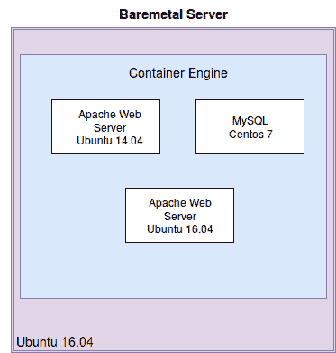
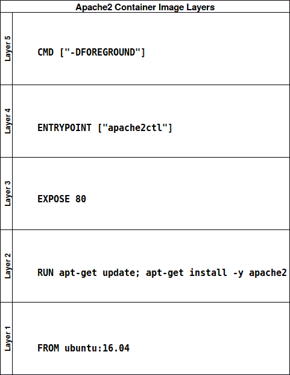

# 使用 Docker 构建容器

近年来，IT 行业的格局发生了巨大变化。高度互动的移动应用、云计算和流媒体的兴起，推动了现有 IT 基础设施的极限。曾经满足于网页浏览和电子邮件的用户，现在正在利用高度互动的服务，并且不断要求更高的带宽、可靠性和更多的功能。随着这一变化的发生，IT 部门和应用程序开发人员不断尝试找到应对日益增加的需求的方法，以保持与依赖其服务的消费者的相关性。

作为一名应用程序开发人员、基础设施支持专家或 DevOps 工程师，你无疑已经看到了基础设施支持和维护方式的根本变化。曾经，开发人员可以独立编写应用程序，将其部署到企业内部，并将工作交给那些可能仅对应用程序功能有基本了解的运维人员。而如今，开发和运维的范式在大多数企业中已经紧密交织在一起，这就是许多企业所称的 **DevOps**。在 DevOps 思维模式中，运维和支持人员直接与应用开发人员合作，共同编写应用程序，以及基础设施代码。利用这种新的思维方式，服务能够上线，且可扩展多个层次，分布在数百台服务器、数据中心和云服务提供商之间。一旦组织采纳了 DevOps 思维模式，这将促使各个部门之间发生文化上的转变。通常会出现一种新的团队意识，开发人员和运维人员会感受到一种新的伙伴关系。开发人员乐于贡献代码，使应用程序部署变得更轻松，而运维人员则对新 DevOps 支持的应用程序带来的易用性、扩展性和可重复性感到满意。

即便在 DevOps 的世界中，容器化作为一种更新且更好的应用部署和维护方式，正在组织中积极增长和扩展。像信息技术领域的其他任何事物一样，我们需要对容器的构建、部署和在组织内的扩展过程进行控制。Ansible Container 提供了一种抽象且易于实现的方法论，适用于大规模构建和运行容器。在我们开始学习 Ansible 和容器化平台之前，必须首先审视应用程序和服务的历史部署方式。

在我们开始之前，让我们看看本章将涉及的主题：

+   **DevOps 和 IT 基础设施的历史概述**：

    +   手动部署

    +   自动化简介

    +   应用虚拟化

    +   应用容器化

    +   容器化应用程序的编排

+   **构建你的第一个 Docker 容器**

    +   设置实验环境

    +   开始您的第一个 Docker 容器

    +   构建您的第一个 Docker 容器

    +   容器生命周期管理

# DevOps 和 IT 景观的变化

让我们快速看看许多 IT 部门的演变以及整个行业对这一根本性转变的响应。在我们深入学习容器之前，了解应用程序和服务部署的历史非常重要，以了解容器化解决了哪些问题，以及基础设施在几十年间如何变化和演进。

# 大型单体应用的手动部署

大型单体应用的手动部署通常是大多数应用部署的起点，并且在上世纪 90 年代末和 21 世纪初期到中期的大多数基础设施状态下。这种方法通常是这样的：

1.  组织决定创建新的服务或应用程序。

1.  组织委托开发团队编写新的服务。

1.  安装新服务器和网络设备以支持新服务。

1.  新服务由运维和工程团队部署，这些团队可能对新服务的实际功能一无所知。

通常，这种部署应用程序的方法很少或根本不使用自动化工具，只使用基本的 Shell 或批处理脚本，并且需要大量复杂的工作来维护应用程序或部署升级。在文化上，这种方法在团队之间创建信息孤岛，个人负责复杂整体中的小部分。如果团队成员在部门之间调动或离开组织，那些随后负责服务的人必须逆向工程最初开发应用程序的思维过程，可能会造成混乱。如果有文档存在，其可能模糊不清。

# 自动化介绍

迈向更灵活、面向 DevOps 架构演进的下一步是引入自动化平台，使操作和支持工程师能够简化组织内部部署和维护任务的许多方面。自动化工具种类繁多，具体取决于您希望自动化应用程序的程度。某些自动化工具仅在操作系统级别工作，以确保操作系统和应用程序按预期运行。其他自动化工具可以使用诸如 IPMI 之类的接口远程启动裸机服务器，以部署从操作系统到上层应用的一切。

自动化工具基于*当前状态*和*期望状态*的配置管理概念。自动化平台的目标是根据一个程序化模板评估服务器的当前状态，并且仅对服务器执行将其带入期望状态所需的操作。例如，一个自动化平台检查 NGINX 是否处于运行状态时，可能会查看一台 Ubuntu 16.04 服务器，发现 NGINX 当前未安装。

为了将此服务器带入期望状态，它可能会在后台运行命令`apt-get install nginx`，使该服务器符合要求。当相同的自动化工具评估一台 CentOS 服务器时，它可能会发现 NGINX 已安装但未运行。为了使该服务器符合要求，它会运行`systemctl start nginx`来使服务器符合期望状态。注意，它并没有尝试重新安装 NGINX。进一步扩展我们的例子，如果自动化工具检查一台既已安装又已运行 NGINX 的服务器，它将不会对该服务器采取任何操作，因为它已经处于期望状态。一个好的自动化平台的关键在于，该工具仅执行将服务器带入期望状态所需的步骤。这个概念被称为**幂等性**，是大多数自动化平台的一个标志。

现在我们将查看一些开源自动化工具，并分析它们是如何工作的以及它们有什么独特之处。深入理解自动化工具及其工作原理将帮助你理解 Ansible Container 是如何工作的，以及为什么它是容器编排中不可或缺的工具：

+   **Chef**：Chef 是由 Adam Jacobs 于 2008 年编写的配置管理工具，旨在解决当时他所面临的具体用例。Chef 代码使用 Ruby 基础的领域特定语言编写，称为*recipes*。为了特定目的而将多个 recipes 集合在一起的文件被称为*cookbook*。Cookbook 存储在服务器上，客户端可以定期下载更新的 recipes，通过作为守护进程运行的客户端软件来获取。*Chef Client* 负责评估当前状态与 cookbook 中描述的期望状态之间的差异。

+   **Puppet**：Puppet 是由 Luke Kaines 在 2005 年编写的，类似于 Chef，采用客户端-服务器模型。Puppet 清单使用 Ruby DSL 编写，并存储在一个专用服务器上，该服务器被称为*Puppet Master*。客户端运行一个名为*Puppet Agent*的守护进程，负责下载 Puppet 清单并在客户端上本地执行。

+   **Salt**：Salt 是 Thomas Hatch 于 2011 年编写的配置管理工具。与 Puppet 和 Chef 类似，Salt 主要基于*客户端-服务器*模型，其中存储在*Salt Master*上的*states*会在 minions 上执行，以实现所需的状态。Salt 的特点是它是最迅速且高效的配置管理平台之一，因为它在 master 和节点之间采用了消息总线架构（ZeroMQ）。通过这个消息总线，它能够迅速评估这些消息并采取相应的行动。

+   **Ansible**：Ansible 可能是我们迄今为止所研究的自动化平台中最具独特性的之一。Ansible 由 Michael DeHaan 于 2012 年编写，旨在提供一个简洁而强大的配置管理工具。Ansible 的*playbooks*是简单的 YAML 文件，详细列出了将在目标主机上执行的操作和参数，格式非常易读。默认情况下，Ansible 是无代理的，并采用*推送*模型，其中 playbooks 从一个集中位置（例如你的笔记本或网络上的专用主机）执行，并通过 SSH 在目标主机上进行评估。部署 Ansible 的唯一要求是，你运行 playbooks 的主机必须能够通过 SSH 访问，并且必须安装正确版本的 Python（撰写时为 2.7 版）。如果满足这些要求，Ansible 将是一个非常强大的工具，入门几乎不需要什么知识和资源。最近，Ansible 推出了 Ansible Container 项目，旨在将配置管理范式引入到基于容器的平台构建和部署中。Ansible 是一个极为灵活且可靠的配置管理平台，拥有一个庞大且健康的开源生态系统。

到目前为止，我们已经看到将自动化引入基础设施如何帮助我们更接近实现 DevOps 的目标。通过一个可靠的自动化平台，并配备正确的工作流程来引入变化，我们可以利用这些工具真正掌控我们的基础设施。虽然自动化的好处确实很大，但也存在重大缺点。错误实现的自动化会为我们的基础设施引入一个故障点。在选择自动化平台之前，必须考虑在我们的主服务器故障时会发生什么（适用于 Salt、Chef 和 Puppet 等工具）。或者，如果一个状态、食谱、playbook 或清单在某个裸机基础设施服务器上执行失败时会发生什么。使用配置管理和自动化工具在今天的环境中已成为一种必需，且出现了一些简化甚至消除这些潜在问题的应用部署方式。

# 应用程序和基础设施的虚拟化

随着近年来云计算的崛起，许多组织已经用应用程序和基础设施的虚拟化替代了传统的内部部署应用程序和服务。目前，租用像亚马逊、微软和谷歌等公司的硬件资源，创建具有精确硬件配置的虚拟服务器实例，已被证明对个人和公司而言更具成本效益。

如今，许多配置管理和自动化工具都在向这些云服务提供商添加直接的 API 访问，以扩展基础设施的灵活性。例如，使用 Ansible，你可以在剧本中精确描述所需的服务器配置，以及云服务提供商的凭证。执行该剧本不仅会启动所需的实例，还会将它们配置为运行你的应用程序。如果一个虚拟实例出现故障怎么办？销毁它并创建一个新的。随着云计算的兴起，基础设施的全新视角也随之而来。单一的服务器或服务器组不再被视为*特殊的*并以特定方式维护。云计算使 DevOps 从业者认识到一个非常现实的概念，那就是基础设施可以是一次性的。

然而，虚拟化不仅仅局限于云服务提供商。许多组织目前正在使用如 ESXi、Xen 和 KVM 等平台在内部实施虚拟化。这些平台允许具有大量存储、内存和 CPU 资源的大型服务器托管多个虚拟机，每个虚拟机使用宿主操作系统资源的一部分。

尽管虚拟化和自动化带来了许多好处，但采用这种架构仍然存在许多缺点。首先，各种形式的虚拟化可能相当昂贵。在云服务提供商中创建更多的虚拟服务器，你的月度开销费用将变得更高，还不算大型硬件配置虚拟机所带来的额外成本。此外，这样的部署可能需要大量的资源。即使是低配置，启动大量虚拟机也会消耗虚拟化主机硬件的巨大存储、内存和 CPU 资源。

最后，还必须考虑虚拟机操作系统以及虚拟化主机操作系统的维护和补丁更新。尽管自动化平台和现代虚拟化主机允许虚拟机快速启动和销毁，但对于那些可能需要维持数周或数月的实例，补丁和更新依然必须考虑。记住，即使操作系统已经虚拟化，它仍然容易受到安全漏洞、补丁和维护的影响。

# 应用程序和基础设施的容器化

容器化技术在 2013 年 3 月随着 Docker 的发布进入了 DevOps 领域。尽管容器化的概念早于 Docker，但对于许多在这一领域工作的人来说，这还是他们第一次接触到在容器内运行应用程序的概念。在继续之前，我们首先需要明确什么是容器，什么不是容器。

容器是一个在 Linux 系统中具有控制组和内核命名空间的隔离进程。在容器内部，有一个非常薄的操作系统层，只有足够的资源来启动和运行其他进程。基础操作系统层可以基于任何操作系统，甚至可以是与主机上运行的操作系统不同的操作系统。当运行容器时，容器引擎会分配访问主机操作系统内核的权限，以便将容器与主机上其他进程隔离开来。从容器内应用程序的角度看，它似乎是主机上唯一的进程，尽管同一主机可能同时运行多个该容器的版本。

以下插图展示了主机操作系统、容器引擎与主机上运行的容器之间的关系：



图 1：运行多个容器并使用不同基础操作系统的 Ubuntu 16.04 主机

许多容器化初学者将容器误认为是轻量级的虚拟机，并试图像处理虚拟机或未正确运行的裸机服务器一样修复或修改正在运行的容器。容器的设计理念是完全可丢弃的。如果容器没有正确运行，它们足够轻量，可以在几秒钟内终止现有容器并从头开始重建一个新的容器。如果虚拟机和裸机服务器应被视为*宠物*（需要照顾、喂养和维护），那么容器应该被视为*牲畜*（在这里一分钟，下一分钟就被删除和替换）。我想你明白这个意思了。

这种实现与传统虚拟化的显著区别在于，容器可以通过容器源文件快速构建，并在主机操作系统上运行，类似于 Linux 内核中的其他进程或守护进程。由于容器是隔离的且非常精简，因此不必担心容器内部运行任何不必要的进程，例如 SSH、安全工具或监控工具。容器的存在是为了特定的目的，即运行一个单一的应用程序。容器运行环境（例如 Docker）提供了必要的资源，使得容器能够成功运行，并提供与主机软件和硬件资源（如存储和网络）的接口。

容器天生就是为了便于移植设计的。一个使用 CentOS 基础镜像并运行 Apache Web 服务器的容器可以在 CentOS 主机、Ubuntu 主机，甚至是 Windows 主机上加载；它们都有相同的容器运行时环境，并且以完全相同的方式运行。拥有这种模块化的好处是巨大的。例如，开发人员可以在自己的笔记本电脑上为 *MyAwesomeApplication 1.0* 构建容器镜像，仅使用几个兆字节的存储和内存，并且可以确保该容器在生产环境中与在他们笔记本上的运行方式完全相同。当需要将 *MyAwesomeApplication* 升级到 2.0 版本时，升级路径只是简单地用更新的容器镜像版本替换正在运行的容器镜像，从而显著简化了升级过程。

将在 Docker 等运行时环境中运行容器的可移植性与 Ansible 等自动化工具相结合，可以为软件开发人员和运维团队提供一个强大的组合。新软件可以更快地部署，运行更加可靠，并且维护开销更低。这正是我们将在本书中进一步探讨的理念。

# 容器化应用程序的编排

朝着更灵活、面向 DevOps 的基础设施迈进，并不仅仅是将应用程序和工具运行在容器中。容器天生具有可移植性和灵活性。与 IT 行业中的其他技术一样，容器所带来的可移植性和灵活性可以被进一步构建，以使其变得更有用。Kubernetes 和 Docker Swarm 是两个容器调度平台，它们使得容器的维护和部署变得更加容易。

Kubernetes 和 Docker Swarm 可以主动维护在集群中各主机上运行的容器，使得容器的扩展和升级变得非常简单。如果你想增加集群中运行的容器数量，你只需告诉调度 API 增加副本数，容器将自动在集群中的节点上实时扩展。

如果你想升级应用程序版本，你也可以类似地指示这些工具使用新的容器版本，并且你几乎可以立刻看到滚动升级过程的发生。这些工具甚至可以提供容器之间的网络和 DNS 服务，从而将容器的网络流量与主机网络完全抽象开。这只是 Docker Swarm 和 Kubernetes 等容器编排和调度工具可以为你的容器化基础设施做的一小部分。但这些内容将在本书后续章节中进行更详细的讨论。

# 构建你的第一个 Docker 容器

现在我们已经涵盖了一些入门信息，帮助读者了解 DevOps、配置管理和容器化的基本概念，接下来是时候动手实践，实际从零开始构建我们的第一个 Docker 容器了。本章这一部分将带你手动构建容器，并通过编写 Dockerfile 脚本来实现。这样可以为你提供关于 Ansible Container 平台如何在后台工作、自动化构建和部署容器镜像的基础知识。

在使用容器镜像时，理解容器*镜像*和运行的*实例*之间的区别非常重要。当你使用 Ansible Container 或通过 Dockerfile 手动构建容器时，运行容器的过程需要两步：构建容器镜像和运行容器实例：

+   **构建容器**：构建过程包括下载基础容器操作系统镜像，并执行 Dockerfile 或 Ansible Container 剧本中列出的步骤，将容器构建到所需状态。构建过程的结果是一个已缓存的容器镜像，准备启动容器实例。`docker pull` 命令也可以用来从互联网下载容器镜像，并将其缓存到本地 Docker 主机上。

+   **运行容器**：启动一个已缓存的容器镜像并运行它的过程被称为*运行容器*。你可以从单个容器镜像启动任意数量的容器。如果你尝试运行一个本地 Docker 主机上尚未缓存的容器镜像，Docker 会尝试从互联网下载该镜像。

# 实例化实验环境

我鼓励你在我们进行这些实验操作时一同实践。为了简化获得本书中所覆盖工具的环境设置过程，我创建了一个 Git 仓库，里面包含了本书中所覆盖的多个实验场景。我们将从一个快速教程开始，介绍如何在你的本地工作站或笔记本电脑上设置实验环境。为了安装这些实验组件，我建议使用至少配备 8 GB RAM、支持虚拟化的 CPU（Intel Core i5 或同等配置）以及 128 GB 或更大硬盘的计算机。Linux 或 macOS 是安装实验环境的首选操作系统，因为这些工具在类 Unix 操作系统上运行通常更加稳定。但这些工具同样支持 Windows，只是效果可能因系统而异。

实验环境将启动一个一次性的 Ubuntu 16.04 Vagrant 虚拟机，预装了 Docker、Ansible Container 以及你成功熟悉 Ansible Container 工作原理所需的各种工具。还需要一个面向开发的文本编辑器，用于在本书中创建和编辑示例及实验任务。我建议使用 GitHub Atom 或 Vim，因为这两个编辑器都支持 YAML 文档和 Dockerfile 的语法高亮。GitHub Atom 和 Vim 都是免费的开源软件，并且支持跨平台使用。

请注意，你不必安装这个实验环境也能学习和理解 Ansible Container。虽然跟随本书操作并亲身体验这项技术是有帮助的，但并不是必须的。

本书应该足够简单，即使你没有可用的资源，也能理解内容而无需实例化实验室环境。同时需要注意，你也可以通过在工作站上安装 Ansible、Ansible Container 和 Docker 来实例化自己的实验室环境。稍后在本书中，我们将涉及 Kubernetes 和 OpenShift，因此后面的章节也需要这些工具。这些参考资料可以在书本的最后找到。

# 安装实验环境：

以下是在你的本地工作站上设置实验环境所需的步骤。关于如何为你的平台安装 Vagrant 和 VirtualBox 的详细信息，可以在各自的官方网站找到。尽量下载与列出的版本号相似的版本，以确保最大兼容性：

1.  下载并安装 Git：[`git-scm.com/downloads`](https://git-scm.com/downloads)

1.  下载并安装 VirtualBox（版本 5.1）：[`www.virtualbox.org/wiki/Downloads`](https://www.virtualbox.org/wiki/Downloads)

1.  下载并安装 Vagrant（版本 1.9.1）：[`www.vagrantup.com/docs/installation/`](https://www.vagrantup.com/docs/installation/)

1.  克隆 Ansible Container Lab Git 仓库：

```
git clone https://github.com/aric49/ansible_container_lab.git
```

在终端中，导航到 `ansible_container_lab` Git 仓库，并运行：`vagrant up` 来启动虚拟机：

```
cd Ansible_Container_Lab
vagrant up
```

如果 Vagrant 和 VirtualBox 已正确安装和配置，你应该开始看到虚拟机在工作站上启动，类似于以下显示：

```
user@host:$ vagrant up
Bringing machine 'node01' up with 'virtualbox' provider...
==> node01: Importing base box 'ubuntu/xenial64'...
==> node01: Matching MAC address for NAT networking...
==> node01: Checking if box 'ubuntu/xenial64' is up to date...
==> node01: Setting the name of the VM: AnsibleBook_node01_1496327441174_45550
==> node01: Clearing any previously set network interfaces...
==> node01: Preparing network interfaces based on configuration...
node01: Adapter 1: nat
==> node01: Forwarding ports...
node01: 22 (guest) => 2022 (host) (adapter 1)
==> node01: Running 'pre-boot' VM customizations...
==> node01: Booting VM...
==> node01: Waiting for machine to boot. This may take a few minutes...
node01: SSH address: 127.0.0.1:2022
```

一旦 Vagrant box 成功启动，你可以执行命令：`vagrant ssh node01` 来访问虚拟机。

当你在 Vagrant 虚拟机中完成工作后，可以使用命令：`vagrant destroy -f` 来终止虚拟机。销毁虚拟机应在你完成当天的工作后进行，或者当你希望删除并重新创建虚拟机时进行，以便将其重置为原始设置。

请注意：在实验虚拟机中，任何未保存在`/vagrant`目录中的工作都会被删除且无法恢复。`/vagrant`目录是你本地机器上`lab`目录根目录和 Vagrant 虚拟机之间的共享文件夹。如果你想要以后使用这些文件，请保存到这个目录中。

# 启动你的第一个 Docker 容器

默认情况下，实验环境会在 Docker 引擎已经启动并作为服务运行的情况下开始。如果你需要手动安装 Docker 引擎，可以在基于 Ubuntu 或 Debian 的 Linux 发行版上使用：`sudo apt-get install docker.io`。Docker 安装并运行后，你可以通过执行`docker ps -a`来检查正在运行的容器状态：

```
ubuntu@node01:~$ docker ps -a
CONTAINER ID IMAGE COMMAND CREATED STATUS PORTS NAMES
ubuntu@node01:~$
```

我们可以从前面的输出中看到，我们有列标题，但没有实际的信息。这是因为我们没有运行任何容器实例。让我们使用`docker images`命令来检查 Docker 知道多少个容器镜像：

```
ubuntu@node01:~$ docker images
REPOSITORY TAG IMAGE ID CREATED SIZE
```

这里也没有发生什么。那是因为我们还没有容器镜像可以使用。让我们通过`docker run`命令来运行我们的第一个容器——Docker 的`hello-world`容器：

```
ubuntu@node01:~$ docker run hello-world
Unable to find image 'hello-world:latest' locally
latest: Pulling from library/hello-world
78445dd45222: Pull complete
Digest: sha256:c5515758d4c5e1e838e9cd307f6c6a0d620b5e07e6f927b07d05f6d12a1ac8d7
Status: Downloaded newer image for hello-world:latest
Hello from Docker!
This message shows that your installation appears to be working correctly.
To generate this message, Docker took the following steps:
1\. The Docker client contacted the Docker daemon.
2\. The Docker daemon pulled the "hello-world" image from the Docker Hub.
3\. The Docker daemon created a new container from that image which runs the
executable that produces the output you are currently reading.
4\. The Docker daemon streamed that output to the Docker client, which sent it
to your terminal.
To try something more ambitious, you can run an Ubuntu container with:
$ docker run -it ubuntu bash
Share images, automate workflows, and more with a free Docker ID:
https://cloud.docker.com/
For more examples and ideas, visit:
https://docs.docker.com/engine/userguide/
```

我们执行的命令是：`docker run hello-world`。当我们运行这个命令时，发生了很多事情。命令`docker run`是 Docker 中启动并运行容器所必需的命令。我们正在运行的容器是`hello-world`。如果你查看输出，你会看到 Docker 报告说`无法在本地找到镜像 'hello-world:latest'`。Docker 运行的第一步是测试它是否已经在本地缓存了容器镜像，这样它就不需要重新下载已经在主机上运行的容器。我们之前验证了目前 Docker 中没有任何容器镜像，所以 Docker 会从其默认的注册中心（Docker Hub）下载镜像。当 Docker 下载容器镜像时，它会一次下载一层，并计算一个哈希值，以确保镜像正确并且完整。你可以从前面的输出中看到，Docker 提供了`sha256`摘要，这样我们就可以确信下载的是正确的镜像。由于我们没有指定容器版本，Docker 会在 Docker Hub 注册中心搜索名为`hello-world`的镜像，并下载最新版本。当容器执行时，它输出了`Hello From Docker`，这是该容器设计的功能。

你也可以使用`docker ps`命令，省略`-a`标志，这样只会显示当前正在运行的容器，而不是已退出或已停止的容器。

Docker 容器是基于层构建的。每次构建 Docker 镜像时，你运行的每个命令都会在 Docker 镜像中创建一个层。当 Docker 构建或拉取镜像时，Docker 会逐个处理每一层，确保整个容器镜像被完整地拉取或构建。当你开始构建自己的 Docker 镜像时，记住以下几点很重要：层数越少，文件大小越小，镜像效率越高。下载层数很多的镜像对于使用你服务的用户并不理想，而且如果你的 Docker 镜像下载时间过长，快速升级服务也不方便。

现在我们已经下载并运行了第一个容器镜像，让我们再次查看本地的 Docker 镜像列表：

```
ubuntu@node01:~$ docker images
REPOSITORY TAG IMAGE ID CREATED SIZE
hello-world latest 48b5124b2768 4 months ago 1.84 kB
ubuntu@node01:~$
```

如你所见，我们在本地缓存了 `hello-world` 镜像。如果我们重新运行这个容器，它将不再需要重新拉取镜像，除非我们指定一个比本地缓存中存储的镜像版本更高的版本号。现在我们可以再次查看 `docker ps -a` 的输出：

```
ubuntu@node01:~$ docker ps -a
CONTAINER ID IMAGE COMMAND CREATED STATUS PORTS NAMES
b0c4093ab38f hello-world "/hello" 28 minutes ago Exited (0) 28 minutes ago romantic_easley
```

从上面的输出中，你可以看到 Docker 创建了一个新的正在运行的容器，容器 ID 为 `b0c4093ab38f`。它还列出了用于启动此容器的源镜像的名称、执行的命令（在本例中是：`/hello`）、创建时间、当前状态以及容器名称。你可以看到这个特定的容器已经不再运行，因为它的状态是 `Exited (0)`。这个容器的设计方式是执行一个单一任务，任务完成后就退出。`Exited (0)` 状态让用户知道执行已成功完成。这与 Unix 系统中的二进制可执行文件非常相似，比如 `cat` 或 `echo` 命令。这些命令执行一个单一任务，完成后就停止。如果你的目的是为用户提供一个执行输出（比如解析文本、进行计算，甚至执行 Docker 主机上的任务）的容器，那么构建这种类型的容器是非常有用的。正如你稍后将看到的，你甚至可以向 `docker run` 命令传递参数，从而修改容器内应用程序的运行方式。

# 构建你的第一个容器

现在我们已经了解了 Docker 容器如何运行，以及 Docker 引擎如何下载和缓存容器镜像，我们可以开始构建运行服务的容器，例如 Web 服务器和数据库。在本节课中，我们将从一个 Dockerfile 构建一个容器，该容器将运行 Apache Web 服务器。然后我们将在 Docker 引擎中暴露端口，这样我们就可以访问我们刚刚实例化的运行中的 Web 服务。让我们开始吧。

# Dockerfile

正如我们之前所学，Docker 容器由多个层组成，这些层本质上是叠加在一起，形成一个 Docker 容器镜像。这些层由命令组成，这些命令保存在纯文本文件中，Docker 引擎会按顺序执行这些命令来构建最终的镜像。Dockerfile 中的每一行代表镜像中的一层。构建 Dockerfile 的目标是让它们尽可能小巧简洁，这样我们的容器镜像就不会比必要的要大。在你的虚拟机的`/vagrant`目录中，创建一个名为`Dockerfile`的纯文本文件，并使用你喜欢的文本编辑器打开它。我们将从以下几行开始，逐一探讨：

```
FROM ubuntu:16.04
RUN apt-get update; apt-get install -y apache2
EXPOSE 80
ENTRYPOINT ["apache2ctl"]
CMD ["-DFOREGROUND"]
```

让我们逐行查看这个 Dockerfile：

+   `FROM`：指定我们希望基于哪个镜像来构建容器。在这个例子中，我们使用的是 Ubuntu 基础镜像，版本 16.04。Docker Hub 上有多个基础镜像和预构建的应用镜像，可以免费使用。

+   `RUN`：任何你希望容器在构建过程中执行的命令都会通过`RUN`参数传入。我们正在同时执行`apt-get update`和`apt-get install`。我们将这两个命令放在同一行`RUN`中执行，以便尽量减小容器层的大小。将包管理命令放在同一行`RUN`中也是一个好习惯，这样可以确保在执行`apt-get install`之前，源列表已经被更新。需要注意的是，当 Docker 镜像重新构建时，它只会执行那些被更改或添加过的行。

+   `EXPOSE`：`EXPOSE`行指示 Docker 哪些端口应该在容器中开放，以接受外部连接。如果一个服务需要多个端口，可以用空格分开列出它们。

+   `ENTRYPOINT`：`ENTRYPOINT`定义了当容器启动时，默认运行的命令。在这个例子中，我们使用`apache2ctl`启动`apache2` web 服务器。如果你希望容器保持持久运行，重要的是要以守护进程模式或后台模式运行应用，这样容器不会立即发送`EXIT`信号。稍后我们将介绍一个名为`dumb-init`的开源项目，它是一个用于在容器中运行服务的初始化系统。

+   `CMD`：在这个示例中，`CMD`定义了在运行时传递给`ENTRYPOINT`命令的参数。这些参数可以通过在启动容器时在`docker run`命令末尾提供额外的参数来覆盖。你在`CMD`中提供的所有命令或参数都以`/bin/sh -c`为前缀，这使得在运行时传递环境变量成为可能。还需要注意的是，根据你希望默认 shell 如何解释在容器内启动的应用程序，你可以在某些情况下交替使用`ENTRYPOINT`和`CMD`。在线 Docker 文档中对如何使用`CMD`与`ENTRYPOINT`有更深入的最佳实践说明。

Dockerfile 中的每一行都会在最终的 Docker 容器镜像中形成一个独立的层，如下图所示。通常，开发人员希望尽量将容器镜像做得尽可能小，以最小化磁盘使用、下载和构建时间。通常通过在 Dockerfile 中的同一行上运行多个命令来实现这一点。

在这个示例中，我们运行了`apt-get udpate; apt-get install apache2`，以尝试将最终容器镜像的大小最小化。



图 2：Apache2 容器镜像中的层

这并不是 Dockerfile 中所有可用命令的详尽列表。你可以使用`ENV`导出环境变量，在构建时将配置文件和脚本复制到容器中，甚至使用`VOLUME`命令在容器中创建挂载点。更多这样的命令可以在官方的 Dockerfile 参考指南中找到，地址是[`docs.docker.com/engine/reference/builder/`](https://docs.docker.com/engine/reference/builder/)。

既然我们已经了解了 Dockerfile 的内容，接下来让我们使用`docker build`命令来构建一个功能性的容器。默认情况下，`docker build`会在当前目录中查找名为`Dockerfile`的文件，并尝试逐层创建容器。请在你的虚拟机上执行以下命令：

```
docker build -t webservercontainer:1.0 .
```

重要的是使用`-t`标志传递一个镜像构建标签。在这种情况下，我们给镜像打上了`webservercontainer`的标签，并指定了版本`1.0`。这确保你能够通过`docker image list`输出识别你构建的版本。

如果你再次执行`docker images`命令，你会看到新构建的镜像现在已存储在本地镜像缓存中：

```
ubuntu@node01:$ docker images
REPOSITORY TAG IMAGE ID CREATED SIZE
webservercontainer 1.0 3f055adaab20 7 seconds ago 255.1 MB
```

我们现在可以使用`docker run`启动新的容器实例：

```
docker run -d --name "ApacheServer1" -p 80:80 webservercontainer:1.0
```

这次，我们在`docker run`中传递了新的参数：

+   `-d`：表示我们将以分离模式或后台模式运行该容器。在这种模式下运行的容器启动时不会立即将用户登录到容器 shell 中。相反，容器将直接在后台启动。

+   `--name`：为我们的容器指定一个易于理解的名称，以便我们可以清楚地了解容器的用途。如果你没有传递名称标志，Docker 会为你的容器分配一个随机名称。

+   `-p`：允许我们打开主机上的端口，并将其转发到容器中的暴露端口。在这个示例中，我们将主机上的`80`端口转发到容器中的`80`端口。`-p`标志的语法始终是`<HostPort>:<ContainerPort>`。

你可以通过在虚拟机上针对本地主机的`80`端口执行`curl`命令来测试该容器是否正在运行。如果一切顺利，你应该能看到默认的 Ubuntu Apache 欢迎页面：

```
ubuntu@node01:~$ curl localhost:80
<!DOCTYPE html PUBLIC "-//W3C//DTD XHTML 1.0 Transitional//EN" "http://www.w3.org/TR/xhtml1/DTD/xhtml1-transitional.dtd">
<html 
...
```

这意味着 Docker 正在监听本地主机的`80`端口，并将该连接转发到容器，也监听`80`端口。容器的一个大优点是，你可以启动多个相同容器的实例，只要它们监听不同的端口号。只需几秒钟，你就可以创建一个提供各种服务的容器集群，并同样快速地清除它们。

让我们再创建两个 Apache 网络服务器容器，监听主机网络接口的`100`和`200`端口。请注意，在以下示例中，我提供了不同的名称参数以及不同的主机端口：

```
docker run -d --name "ApacheServer2" -p 100:80 webservercontainer:1.0

docker run -d --name "ApacheServer3" -p 200:80 webservercontainer:1.0
```

如果你再次运行相同的`curl`命令，这次是针对`100`和`200`端口，你将看到相同的 Ubuntu 默认网页。这有点无聊。让我们给容器增加一些个性。我们可以使用`docker exec`命令登录到正在运行的容器，并稍作自定义：

```
ubuntu@node01:~$ docker exec -it ApacheServer1 /bin/bash
root@bc951d6ec658:/#
```

`docker exec`命令需要以下标志才能访问正在运行的容器：

+   `-i`：以交互方式运行`docker exec`，因为我们将启动一个 Bash shell

+   `-t`：分配一个伪终端或终端会话

+   `ApacheServer1`：我们想要登录的容器的名称（或容器 ID）

+   `/bin/bash`：我们希望使用`docker exec`命令启动的终端或命令

运行`docker exec`命令后，你应该直接进入第一个 Apache 容器的 Bash shell。运行以下命令来更改 Docker 容器中的`index.html`文件。完成后，你可以通过输入`exit`退出容器的 shell 会话。

```
root@bc951d6ec658:/# echo "Web Server 1" > /var/www/html/index.html
```

从 Docker 主机上，再次在端口`80`上运行`curl`命令。你应该能看到你的 Apache 网络服务器使用的页面已发生变化：

```
ubuntu@node01:~$ curl localhost:80
Web Server 1
```

使用`docker exec`登录到另外两个容器，使用`echo`命令将默认的`index.html`页面更改为所有三个网络服务器容器独特的内容。你的`curl`结果应该能反映你所做的更改：

```
ubuntu@node01:~$ curl localhost:80
Web Server 1
ubuntu@node01:~$ curl localhost:100
Web Server 2
ubuntu@node01:~$ curl localhost:200
Web Server 3
```

**注意**：本练习的目的是演示`docker exec`命令。`docker exec`不是更新、修复或维护正在运行的容器的推荐方式。从最佳实践角度来看，当需要进行更改时，你应始终重新构建 Docker 容器，并在版本标签上进行递增。这确保了更改始终记录在 Dockerfile 中，因此容器可以尽可能快速地启动和销毁。

你可能还注意到，许多 Linux 操作系统工具、文本编辑器和其他实用程序在 Docker 容器中是缺失的。容器的目标是提供运行应用程序所需的最小化足迹。在构建自己的 Dockerfile 时，或者稍后当我们探索 Ansible 容器环境时，请思考一下容器内部的内容，考虑你的容器是否符合设计微服务的最佳实践。

# 容器生命周期管理

Docker 利用 Linux 控制组和命名空间为你提供了进程隔离的优势。与类 Unix 操作系统中的进程类似，这些进程可以在容器生命周期内启动、停止和重启，以实现更改。Docker 通过提供启动、停止、重新加载甚至查看容器日志的选项，使你能够直接控制容器的状态，必要时可以查看可能出现问题的容器日志。Docker 让你可以使用容器的内部 ID 或在我们启动容器时使用 `docker run` 指定的容器名称。以下是可以用来管理容器生命周期的 Docker 原生命令列表，在你构建和迭代不同版本时可以使用这些命令：

+   `docker stop <容器 ID 或名称>`：停止运行中的容器及容器内的进程。

+   `docker start <容器 ID 或名称>`：启动一个已停止或已退出的容器。

+   `docker reload <容器 ID 或名称>`：如果容器正在运行，reload 将优雅地停止容器并重新启动容器，以将其恢复到运行状态。如果容器已停止，reload 将启动已停止的容器。

+   `docker logs <容器 ID 或名称>`：显示由容器或在容器内运行的应用程序生成的任何日志，利用`STDOUT`或`STDERR`。日志对于调试行为异常的容器非常有用，而无需`exec`进入容器内部。

`docker logs` 有一个 `--follow` 标志，非常适合流式输出实时日志。这可以通过 `docker logs --follow <容器 ID 或名称>` 来访问。

从前面的示例中，我们可以像下面这样开始、停止、重新加载或查看我们之前构建的任何 Apache Web 服务器容器的日志：

```
docker stop ApacheServer2
docker start ApacheServer2
docker reload ApacheServer2
docker logs ApacheServer2
```

类似于这个示例，你可以通过查看 `docker ps -a` 的输出验证任何容器的状态。

对于所有 Docker 命令，包括`docker run`、`exec`和`build`，你可以通过添加`--help`标志来查看给定命令的所有可用选项。例如：`docker run --help`。

# 参考资料

+   **Dockerfile 参考指南**：[`docs.docker.com/engine/reference/builder/`](https://docs.docker.com/engine/reference/builder/)

+   **下载 VirtualBox**：[`www.virtualbox.org/wiki/Downloads`](https://www.virtualbox.org/wiki/Downloads)

+   **下载 Vagrant**：[`www.vagrantup.com/docs/installation/`](https://www.vagrantup.com/docs/installation/)

+   **下载 Git**：[`git-scm.com/downloads`](https://git-scm.com/downloads)

# 总结

在本章中，我们回顾了应用部署在 IT 基础设施中的历史，以及容器的历史和它们为什么会彻底改变软件开发。我们还通过手动运行容器和通过 Dockerfile 从头构建容器，迈出了构建 Docker 容器的第一步。

我希望，如果你是容器化和 Docker 的新手，本章能够为你提供一个好的起点，让你能亲身体验容器化的世界。Dockerfile 是构建容器的优秀工具，因为它们轻量、易于版本控制，并且具有很好的可移植性。然而，它们也有局限性，因为它们相当于 DevOps 世界中的 Bash 脚本。如果你需要调整配置文件、根据服务的状态动态配置服务，或根据容器将要部署的环境条件配置容器怎么办？如果你曾经在配置管理方面工作过，你会知道，虽然 Shell 脚本可以完成这项工作，但实际上有更好、更简单的工具可供使用。Ansible Container 就是我们所需要的工具，它将配置管理的强大功能与容器所带来的可移植性和灵活性结合在一起。在第二章，*使用 Ansible Container*，你将了解 Ansible Container，并亲眼看到我们如何快速构建和部署容器。
